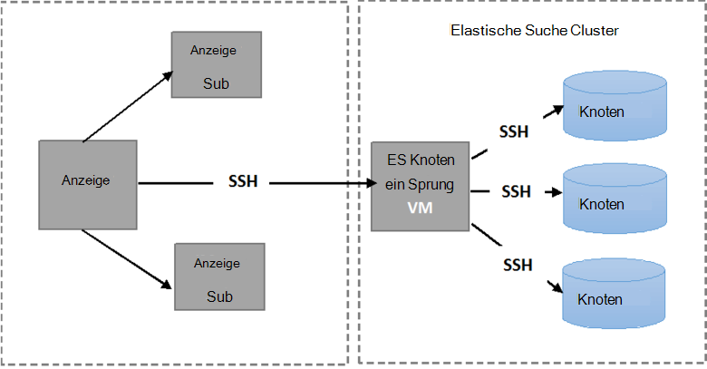

<properties
   pageTitle="Die automatisierte Elasticsearch Stabilität Tests | Microsoft Azure"
   description="Beschreibung wie die Stabilität Tests in Ihrer eigenen Umgebung ausführen."
   services=""
   documentationCenter="na"
   authors="dragon119"
   manager="bennage"
   editor=""
   tags=""/>

<tags
   ms.service="guidance"
   ms.devlang="na"
   ms.topic="article"
   ms.tgt_pltfrm="na"
   ms.workload="na"
   ms.date="09/22/2016"
   ms.author="masashin"/>

# <a name="running-the-automated-elasticsearch-resiliency-tests"></a>Die automatisierte Elasticsearch Stabilität Tests

[AZURE.INCLUDE [pnp-header](../../includes/guidance-pnp-header-include.md)]

Dieser Artikel ist [Teil einer Serie](guidance-elasticsearch.md).

[Konfigurieren von Stabilität]und auf Elasticsearch auf Azure[elasticsearch-resilience-recovery], eine Reihe von Tests, die ausgeführt wurden, mit einem Beispiel Elasticsearch Cluster einige allgemeine Formulare aus wie das System reagiert und wie gut erholt beschriebenen. Die Tests wurden Skript um automatisiert ausgeführt werden können. Dieses Dokument beschreibt, wie Sie die Tests in Ihrer eigenen Umgebung wiederholen. 

Folgende Szenarien wurden getestet:

- **Der Ausfall eines Knotens und ohne Datenverlust neu starten**. Ein Datenknoten beendet und nach 5 Minuten neu gestartet.
Elasticsearch wurde nicht fehlen Splitter in diesem Intervall reservieren, damit keine zusätzliche e/a in Splitter verschieben entstanden ist konfiguriert. Beim Neustart des Knotens bringt der Wiederherstellungsvorgang Splittern auf diesem Knoten wieder dem.

- **Der Ausfall eines Knotens mit schwerwiegenden Datenverlust**. Ein Datenknoten beendet, und es enthält Daten simulieren schwerwiegender Datenträgerfehler gelöscht. Der Knoten wird neu gestartet (nach 5 Minuten), effektiv als Ersatz für den ursprünglichen Knoten. Der Wiederherstellungsprozess muss neu erstellt die fehlenden Daten für diesen Knoten und könnte Splitter am anderen Knoten verschieben.

- **Der Ausfall eines Knotens und Neustart ohne Datenverlust ohne Umverteilung Splitter**. Ein Datenknoten beendet und Splitter, die er enthält andere Knoten zugewiesen sind. Der Knoten neu gestartet und weitere Reallocation auftritt, um Cluster auszugleichen.

- **Parallele Updates**. Jeder Knoten im Cluster beendet und nach kurzer simuliert der Computer wird neu gestartet, nachdem ein Update gestartet. Nur ein Knoten ist jederzeit beendet.
Splitter sind nicht zugewiesen, wenn ein Knoten ausfällt.

## <a name="prerequisites"></a>Erforderliche Komponenten

Automatisierte Tests müssen die folgenden Elemente:

- Ein Elasticsearch-Cluster.

- Ein JMeter Setup der Umgebung wie der [Leitfaden zur Leistung testen]. 

- Die folgenden Zusätze JMeter master VM nur installiert.

    - Java Runtime 7.

    - Nodejs 4.x.x oder höher.

    - Git Befehlszeilentools.

## <a name="how-the-scripts-work"></a>Wie funktionieren die Skripts

Die Testskripts sollen JMeter Master-VM ausführen. Wenn Sie einen Test ausführen auswählen, führen Skripts den folgenden Ablauf:

1.  Starten Sie einen JMeter Testplan übergibt die angegebenen Parameter.

2.  Kopieren Sie eine Skript, die Tests einer bestimmten VM im Cluster erforderlichen Operationen. Dies kann jede VM, die einer öffentlichen IP-Adresse oder VM *Jumpbox* sein, wenn Sie den Cluster mithilfe der [Azure Elasticsearch Schnellstart Vorlage](https://github.com/Azure/azure-quickstart-templates/tree/master/elasticsearch)erstellt haben.

3.  Führen Sie das Skript auf dem VM (oder Jumpbox).

Die folgende Abbildung zeigt die Struktur der Umgebung und Elasticsearch Cluster. Beachten Sie, dass die Testskripts secure Shell (SSH) für jeden Knoten im Cluster unterschiedliche Elasticsearch wie beenden oder Neustarten eines Knotens Operationen verbinden.



## <a name="setting-up-the-jmeter-tests"></a>Einrichten der JMeter tests

Vor dem Ausführen der Stabilität sollten Sie kompilieren und Bereitstellen von Flexibilität, Jmeter/Tests im Ordner JUnit-Tests. Diese Tests sind Testplan JMeter verwiesen. Weitere Informationen finden Sie im Verfahren "Einem vorhandenen Testprojekt JUnit in Eclipse importieren" [ein JMeter JUnit-Generator für Leistungstests Elasticsearch][]bereitstellen.

Es gibt zwei Versionen der JUnit-Tests im folgenden Ordner gespeichert:

- **Elasticsearch17.** Das Projekt in diesem Ordner wird die Datei Elasticsearch17.jar. Diese JAR-Datei zum Testen von Elasticsearch Versionen verwenden 1.7.x

- **Elasticsearch20**. Das Projekt in diesem Ordner wird die Datei Elasticsearch20.jar. Diese JAR-Datei zum Testen von Elasticsearch Version 2.0.0 verwenden und höher

Kopieren Sie die entsprechende JAR-Datei mit der Abhängigkeit, die JMeter Computer Der Prozess beschreibt das Verfahren "Bereitstellen eine Prüfung JUnit JMeter" [JMeter JUnit-Sampler Tests Elasticsearch Leistung]bereitstellen.

## <a name="configuring-vm-security-for-each-node"></a>Konfigurieren der Sicherheit für jeden Knoten VM

Die Skripts erfordern ein für jeden Elasticsearch Knoten im Cluster installiert werden. Dadurch werden die Skripts automatisch ausgeführt, ohne einen Benutzernamen oder ein Kennwort beim Herstellen der Verbindung zu verschiedenen VMs.

Anmelden an einem Knoten im Cluster Elasticsearch (oder Jumpbox VM) starten Sie, und führen Sie folgenden Befehl generiert einen Authentifizierungsschlüssel:

```Shell
ssh-keygen -t rsa
```

Verbindung Elasticsearch Knoten (oder Jumpbox) führen Sie die folgenden Befehle für jeden Knoten in der Elasticsearch Cluster. Ersetzen Sie `<username>` mit dem Namen eines gültigen Benutzers für jeden virtuellen Computer und Ersetzen `<nodename>` mit dem DNS-Namen oder IP-Adresse der VM hosting Elasticsearch Knoten.
Beachten Sie, dass Sie beim Ausführen dieser Befehle das Kennwort des Benutzers aufgefordert werden.
Weitere Informationen finden Sie unter [SSH-Benutzernamen ohne Kennwort](http://www.linuxproblem.org/art_9.html):

```Shell
ssh <username>@<nodename> mkdir -p .ssh (
cat .ssh/id\_rsa.pub | ssh <username>*@<nodename> 'cat &gt;&gt; .ssh/authorized\_keys'
```

## <a name="downloading-and-configuring-the-test-scripts"></a>Herunterladen und konfigurieren die Testskripts

Die Skripts werden in einem Repository Git bereitgestellt. Gehen Sie zu den Skripts konfigurieren.

JMeter master Computer, in dem Sie die Tests ausführen, Fenster Git desktop (Git Bash) und Klonen Repository, das die Skripts wie folgt enthält:

```Shell
git clone https://github.com/mspnp/azure-guidance.git
```

Wechseln Sie zum Ordner Resiliency-Tests und führen Sie den folgenden Befehl zum Ausführen der Tests erforderlichen Abhängigkeiten installieren:

```Shell
npm install
```

Wenn Master JMeter unter Windows läuft, herunterladen Sie [Plink](http://www.chiark.greenend.org.uk/~sgtatham/putty/download.html)ist eine Befehlszeilenschnittstelle kitten Telnet-Client Ausführbare Plink Resiliency-Tests/Lib-Ordner kopieren.

Wenn JMeter Master auf Linux ausgeführt wird, müssen Plink herunterzuladen, aber Sie müssen konfigurieren Kennwort weniger SSH Master JMeter und Elasticsearch-Knoten oder Jumpbox anhand der Schritte in der Prozedur verwendet "Konfigurieren virtueller Computer für jeden Knoten Sicherheit." 

Bearbeiten Sie die folgenden Konfigurationsparameter in der `config.js` Datei für Ihre Umgebung und Elasticsearch Cluster. Diese Parameter gelten für alle Tests:

| Name | Beschreibung | Standardwert |
| ---- | ----------- | ------------- |
| `jmeterPath` | Lokaler Pfad JMeter. | `C:/apache-jmeter-2.13` |
| `resultsPath` | Relative Verzeichnis, in dem das Skript das Ergebnis speichert. | `results` |
| `verbose` | Gibt an, ob das Skript im ausführlichen Modus oder nicht gibt. | `true` |
| `remote` | Gibt an, ob die JMeter lokal oder remote-Server Tests. | `true` |
| `cluster.clusterName` | Der Name des Clusters Elasticsearch. | `elasticsearch` |
| `cluster.jumpboxIp`         | Die IP-Adresse des Computers Jumpbox.                 |-|
| `cluster.username`          | Erstellt beim Bereitstellen von Cluster Administrator. |-|
| `cluster.password`          | Das Kennwort für den Administrator.                        |-|
| `cluster.loadBalancer.ip`   | Die IP-Adresse des Elasticsearch zum Lastenausgleich.    |-|
| `cluster.loadBalancer.url`  | Basis-URL des Lastenausgleich.                          |-|

## <a name="running-the-tests"></a>Ausführen der tests

Wechseln Sie zum Ordner Resiliency-Tests und führen Sie den folgenden Befehl:

```Shell
node app.js
```

Das folgende Menü erscheint:


Geben Sie die Anzahl der Szenario ausgeführt werden soll: `11`, `12`, `13` oder `21`. 

Wenn Sie ein Szenario auswählen, wird der Test automatisch ausgeführt. Die Ergebnisse werden als durch Trennzeichen getrennten Werten (CSV) Dateien in einem Ordner erstellten Ergebnisse im Verzeichnis gespeichert. Jede Ausführung hat einen eigenen Ergebnisordner.
Sie können Excel analysieren und grafisch darstellen dieser Daten.

[Running Elasticsearch on Azure]: guidance-elasticsearch-running-on-azure.md
[Tuning Data Ingestion Performance for Elasticsearch on Azure]: guidance-elasticsearch-tuning-data-ingestion-performance.md
[Leitfaden zur Leistung testen]: guidance-elasticsearch-creating-performance-testing-environment.md
[JMeter guidance]: guidance-elasticsearch-implementing-jmeter.md
[Considerations for JMeter]: guidance-elasticsearch-deploying-jmeter-junit-sampler.md
[Query aggregation and performance]: guidance-elasticsearch-query-aggregation-performance.md
[elasticsearch-resilience-recovery]: guidance-elasticsearch-configuring-resilience-and-recovery.md
[Resilience and Recovery Testing]: guidance-elasticsearch-running-automated-resilience-tests.md
[Bereitstellen von JMeter JUnit Sampler für Leistungstests Elasticsearch]: guidance-elasticsearch-deploying-jmeter-junit-sampler.md
