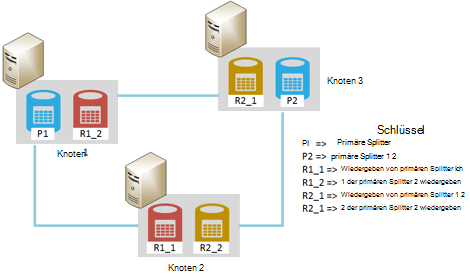
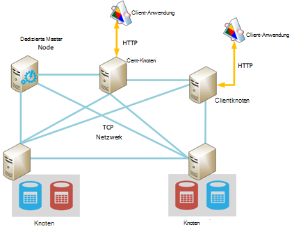
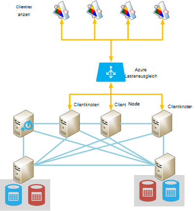
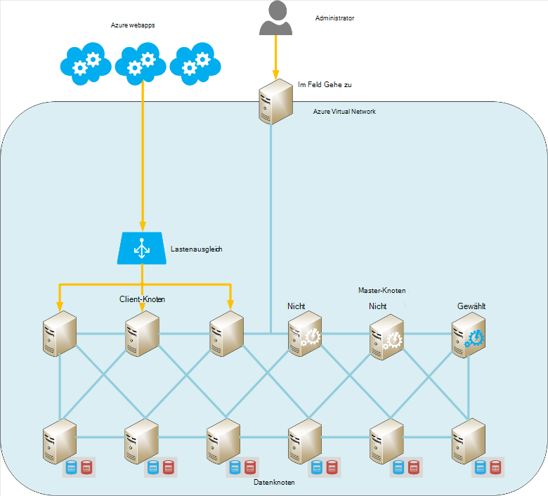

<properties
   pageTitle="Elasticsearch auf Windows Azure ausgeführte | Microsoft Azure"
   description="Zum Installieren, konfigurieren und Ausführen von Elasticsearch auf Azure."
   services=""
   documentationCenter="na"
   authors="dragon119"
   manager="bennage"
   editor=""
   tags=""/>

<tags
   ms.service="guidance"
   ms.devlang="na"
   ms.topic="article"
   ms.tgt_pltfrm="na"
   ms.workload="na"
   ms.date="09/22/2016"
   ms.author="masashin"/>

# <a name="running-elasticsearch-on-azure"></a>Elasticsearch auf Windows Azure ausgeführte

[AZURE.INCLUDE [pnp-header](../../includes/guidance-pnp-header-include.md)]

Dieser Artikel ist [Teil einer Serie](guidance-elasticsearch.md). 

## <a name="overview"></a>Übersicht

Dieses Dokument bietet eine kurze Einführung in die allgemeine Struktur des Elasticsearch und beschreibt, wie einen Elasticsearch Cluster mit Azure implementieren können. Er berührt best Practices für die Bereitstellung von einem Elasticsearch-Cluster auf die verschiedenen Funktions- und Verwaltungsaufwand Ihr System, und wie Ihre Bedürfnisse ausgeführt werden sollte, die Konfiguration und Topologie, die Sie auswählen.

> [AZURE.NOTE] Diese Anleitung setzt voraus, einige grundlegende Kenntnisse von [Elasticsearch][].

## <a name="the-structure-of-elasticsearch"></a>Die Struktur des Elasticsearch 

Elasticsearch ist eine Datenbank optimiert als eine Suchmaschine fungieren. Dokumente werden im JSON-Format serialisiert. Daten findet in Indizes mit [Apache Lucene][]Details Ansicht abstrahiert und muss nicht verstehen Lucene Nutzung Elasticsearch implementiert.

### <a name="clusters-nodes-indexes-and-shards"></a>Cluster, Knoten, Indizes und Splitter

Elasticsearch implementiert eine gruppierte Architektur, die Sharding zum Verteilen von Daten über mehrere Knoten und Replikation zur Bereitstellung hoher Verfügbarkeit verwendet. Dokumente werden in Indizes. Der Benutzer kann angeben, welche Felder in einem Dokument verwendeten Identifizierung in einem Index oder System ein Schlüsselfeld und Werte automatisch generieren. Index wird verwendet, um physische Dokumente organisieren und ist der Prinzipal für die Suche nach Dokumenten. 

Ein Index enthält mehrere Splitter. Dokumente werden auf Splitter mit einem hashing-Mechanismus basierend auf Schlüsselwerte im Index und die Anzahl der Splitter im Index gleichmäßig verteilt. 

Indizes können repliziert werden. In diesem Fall wird jeder Splitter im Index kopiert. Elasticsearch stellt sicher, dass jeder ursprünglichen Splitter für einen Index (als "primäre Splitter" bezeichnet) und seinem Replikat immer auf verschiedenen Knoten befinden. Wenn ein Dokument hinzugefügt oder geändert wird, Schreiben alle Operationen mit primären Splitter und dann jedes Replikat ausgeführt werden. 

Die folgende Abbildung zeigt die wesentlichen Aspekte einer Elasticsearch Cluster mit drei Knoten. Ein Index wurde erstellt, die zwei primären Splitter mit zwei Replikate für jeden Splitter (sechs Splitter in allen) besteht.



*Eine einfache Elasticsearch-Cluster mit zwei primäre Knoten und zwei Replikate*

In diesem Cluster befinden primäre Splitter 1 und 2 primäre Splitter auf separate Knoten können die Last gleichmäßig zu verteilen. Replikate werden entsprechend verteilt. Wenn ein Knoten ausfällt, haben die verbleibenden Knoten ausreichende Informationen, um das System weiterarbeiten. Falls erforderlich, Stufen Elasticsearch einen Replikat Splitter primäre Splitter zu, wenn der entsprechende primäre Splitter nicht verfügbar ist.

### <a name="node-roles"></a>Knoten Funktionen

Die Knoten in einem Cluster Elasticsearch können folgenden Funktionen ausführen:

- Ein **Knoten** kann ein oder mehrere Splitter enthalten, die Daten enthalten.

- **Clientknoten** , die Daten aber nicht verarbeitet eingehende Anfragen von Clientanwendungen auf dem entsprechenden Datenknoten.
 
- **Master-Knoten** keine Indexdaten enthält jedoch, Cluster-Management-Vorgänge wie ausführt und Verteilung von Routinginformationen im Cluster (die Liste der Knoten der Splitter enthalten), welche Knoten stehen, Splitter verschieben, wie Knoten angezeigt und ausgeblendet und Koordinierung Recovery nach Ausfall eines Knotens. Mehrere Knoten als Master konfiguriert werden, aber nur tatsächlich master Funktionen gewählt. Schlägt dieser Knoten eine andere Wahl findet und eine andere berechtigten master Knoten wird und über.

> [AZURE.NOTE]Der gewählten master-Knoten ist entscheidend für das Wohlbefinden des Clusters. Die anderen Knoten Pingen regelmäßig, um sicherzustellen, dass es noch verfügbar ist. Wenn gewählten master-Knoten auch als Datenknoten handelt, gibt es eine Möglichkeit, dass der Knoten gebucht werden und nicht auf diese Pings reagieren. In diesem Fall wird der Master fehlgeschlagen und master Knoten an seiner Stelle gewählt wird. 

 Die folgende Abbildung zeigt eine Topologie mit einer dedizierten Master Clients und Datenknoten in einem Cluster Elasticsearch.



*Ein Elasticsearch Cluster mit verschiedenen Typen von Knoten*

### <a name="costs-and-benefits-of-using-client-nodes"></a>Vor- und Nachteile der Verwendung von Client-Knoten

Wenn eine Anwendung eine Abfrage mit einem Elasticsearch Cluster sendet, ist der Knoten, die Anwendung verbindet, Beschlussfassungsinstanz der Abfragevorgang. Der Knoten leitet die Anforderung an jeden Datenknoten und sammelt die Ergebnisse die Informationen an die Anwendung zurückgegeben. Wenn eine Abfrage Aggregationen und anderen Berechnungen, führt der Knoten die Anwendung Verbindung erforderlichen Operationen nach dem Abrufen der Daten aus allen anderen Knoten. Dabei Scatter-Gather kann beträchtliche Verarbeitung und Speicherressourcen belegen.

Dedizierte Clientknoten können zum Ausführen dieser Aufgaben Datenknoten verwalten und Speichern von Daten. Das Ergebnis ist, dass viele Szenarios, die komplexe Abfragen und Aggregationen profitieren können dedizierte Clientknoten. Die Auswirkung der dedizierten Client Knoten variiert jedoch wahrscheinlich je nach Szenario, Arbeitslast und Clustergröße. 

> [AZURE.NOTE] Weitere [Optimierung Datenaggregation und Abfrage-Leistung für Elasticsearch auf Azure][] Weitere Informationen zur Feinabstimmung.

### <a name="connecting-to-a-cluster"></a>Herstellen einer Verbindung zu einem cluster

Elasticsearch stellt eine Reihe von REST-APIs für Clientanwendungen erstellen und Senden von Anfragen an einen Cluster. Entwickeln von Clientanwendungen, die mit.NET Framework zwei höhere APIs verfügbar sind [Elasticsearch.Net und verschachteln][].

Erstellen von Clientanwendungen mit Java können Sie [Knoten Client-API][] zu Client Knoten dynamisch zum Cluster hinzufügen. Erstellen von Knoten dynamisch ist praktisch, wenn Ihr System relativ langlebige Verbindung verwendet. Erstellt mithilfe der Knoten API Clientknoten erhalten Cluster Arbeitsplan zugeordnet (der Knoten der Splitter enthalten Details) vom master-Knoten. Diese Informationen kann die Java Anwendung direkt an die entsprechenden Knoten beim Indizieren oder Abfragen von Daten, die Anzahl der Hops möglicherweise erforderlich, wenn andere APIs verwenden.

Die Kosten dieser Vorgehensweise ist der Aufwand des Client-Knotens im Cluster registrieren. Wenn eine große Anzahl von Client-Knoten erscheinen und schnell verschwinden, kann die Auswirkung und routing Tabelle Cluster verteilen beträchtlich sein.

Die folgende Abbildung zeigt eine Konfiguration mit einem Lastenausgleich zum Weiterleiten von Anfragen an mehrere Client-Knoten zwar dieselbe Strategie die direkte Datenknoten Verbindung Clientknoten nicht verwendet werden kann.



*Kunden mit einem Elasticsearch Cluster mit Lastenausgleich Azure Instanzen*

> [AZURE.NOTE]Verwenden der [Azure-Lastenausgleich][] Cluster im öffentlichen Internet verfügbar machen oder können eine [interne Lastenausgleich][] Clientanwendungen und Cluster vollständig innerhalb des privaten virtuellen Netzwerks (VNet) enthalten sind.

### <a name="node-discovery"></a>Knoten-Erkennung

Elasticsearch auf Peer-to-Peer-Kommunikation basiert, erkennen die anderen Knoten in einem Cluster im Lebenszyklus eines Knotens gehört. Knoten-Erkennung können neue Datenknoten dynamisch zu einem Cluster hinzugefügt werden wiederum ermöglicht Cluster transparent skalieren. Darüber hinaus schlägt reagieren auf Kommunikation von anderen Knoten ein Datenknoten können master-Knoten, der Datenknoten konnte die erforderlichen Splittern neu zuordnen, die andere Knoten Betriebsdaten hielt.

Elasticsearch Knoten Erkennung erfolgt mithilfe eines Discovery-Moduls. Discovery-Modul ist ein Plugin verwenden unterschiedliche Erkennungsmechanismus geschaltet werden kann. Das Standardmodul Discovery ([Zen][]) wird ein Knoten zum Ausstellen von Ping-Anfragen zu anderen Knoten im selben Netzwerk. Wenn andere Knoten reagieren, Klatsch sie Informationen. Master-Knoten kann dann verteilen Splitter auf den neuen Knoten (wenn es einen Datenknoten ist) und den Cluster neu. Zen Discovery-Modul verarbeitet die master Wahlen und Protokoll für den Ausfall eines Knotens erkennen.

Außerdem, wenn Sie Elasticsearch Knoten als Azure virtuelle Maschinen (VMs) ausführen, wird Multicastnachrichten nicht unterstützt. Aus diesem Grund sollten Sie Discovery Zen Unicast messaging und eine Liste mit gültigen in der Konfigurationsdatei elasticsearch.yml konfigurieren.

Einen Elasticsearch Cluster in Azure virtuelles Netzwerk betreiben, Sie können angeben, dass der privaten DHCP zugewiesene IP adressiert jeder VM im Cluster bleibt zugewiesenen (statisch). Sie können die Zen Discovery Unicast messaging diese statische IP-Adressen konfigurieren. Wenn Sie VMs mit dynamischen IP-Adressen verwenden, denken Sie daran, dass wenn eine VM beendet und neu gestartet es erschweren Discovery eine neue IP-Adresse zugewiesen werden konnte. Um dieses Szenario zu behandeln, tauschen Sie Zen Discovery-Modul für [Azure Cloud Plugin][]. Dieses Plug-in verwendet die API Azure Azure Abonnementinformationen auf den Discovery-Mechanismus implementieren.

> [AZURE.NOTE]Die aktuelle Version von Azure Cloud Plugin erfordert Zeugnisse für Ihre Azure-Abonnement im Java-Schlüsselspeicher Elasticsearch-Knoten installieren und bieten den Speicherort und die Anmeldeinformationen für den Zugriff auf den Schlüsselspeicher in der Datei elasticsearch.yml. Diese Datei findet im Klartext, so ist es wichtig sicherzustellen, dass nur diese Datei zugegriffen werden über das Konto mit dem Elasticsearch-Dienst. 
> 
> Außerdem kann dieser Ansatz mit Azure-Ressourcen-Manager-Installationen nicht kompatibel. Aus diesen Gründen empfiehlt es sich, dass Sie statische IP-Adressen für master-Knoten, und diese Knoten verwenden Zen Discovery Unicast messaging im Cluster implementieren. In der folgenden Konfiguration (entnommen aus der Datei elasticsearch.yml ein Datenknoten Beispiel) verweisen die IP-Adressen master-Knoten im Cluster:

```yaml
discovery.zen.ping.multicast.enabled: false  
discovery.zen.ping.unicast.hosts: ["10.0.0.10","10.0.0.11","10.0.0.12"]
```

## <a name="general-system-guidelines"></a>Allgemeine Regelung Richtlinien

Elasticsearch kann auf verschiedenen Computern, von einem Laptop zu einem Cluster von High-End-Servern ausführen. Allerdings sind mehr Ressourcen bedarfsgerecht computing macht und schnelle Festplatten verfügbar umso besser die Leistung. In den folgenden Abschnitten werden die Mindestanforderungen für Hardware und Software zum Ausführen von Elasticsearch zusammengefasst.

### <a name="memory-requirements"></a>Speicherbedarf 

Elasticsearch versucht, Daten im Arbeitsspeicher Geschwindigkeit zu speichern. Produktions-Server Hosten eines Knotens für ein Unternehmen oder kommerzielle Bereitstellung in Azure mittlerer Größe muss zwischen 14 und 28 GB RAM (D3 und D4 VMs). **Verteilt die Last auf mehrere Knoten als Knoten mit mehr Speicher erstellen** (Versuche haben gezeigt, dass mehr Speicher mit größeren Knoten erweiterte Recovery-Zeiten im Fehlerfall kann.) Aber Obwohl Erstellen von Clustern mit vielen kleinen Knoten Verfügbarkeit und Durchsatz erhöhen kann, wird er nötigenfalls auch Aufwand bei der Verwaltung und Wartung eines Systems.

**50 % der verfügbaren Speicher auf einem Server für den Elasticsearch-Heap**. Verwenden Sie Linux Festlegen der Umgebungsvariablen ES_HEAP_SIZE vor dem Ausführen von Elasticsearch. Auch wenn Sie Windows oder Linux verwenden, Sie können Speichergröße in der `Xmx` und `Xms` Parameter beim Starten von Elasticseach. Legen Sie beide Parameter denselben Wert zu Java Virtual Machine (JVM) im Heap zur Laufzeit ändern. Jedoch **nicht mehr als 30 GB reservieren**. Verwenden Sie den verbleibenden Speicher für Dateicache Betriebssystem.

> [AZURE.NOTE]Elasticsearch nutzt Lucene Bibliothek zum Erstellen und Verwalten von Indizes. Lucene Strukturen verwenden eine Festplatte formatieren und diese Strukturen im Dateisystemcache Zwischenspeichern wird Leistung erheblich verbessern.

Beachten Sie, dass die maximale optimale Heapgröße für Java auf einem 64-Bit-Computer über 30 GB. Alle größeren Java-Switches eine erweiterte Methode zum Verweisen auf Objekte auf dem Heap verwenden, der mehr Systemspeicher für jedes Objekt und Leistungseinbußen. 

Standardmäßig Java Garbage collection (gleichzeitig markieren und Sweep) können auch untergeordnete optimal ist die Heapgröße über 30GB. Es derzeit sollte keinen anderen Garbage Collector wechseln, wie Elasticsearch und Lucene nur Standard getestet haben.

Speicher nicht overcommit, wie Auslagern Arbeitsspeicher auf den Datenträger Leistung stark beeinträchtigt wird. Deaktivieren Sie möglichst vollständig austauschen (Details abhängig von Betriebssystem). Ist dies nicht möglich aktivieren Sie die *Mlockall* -Einstellung in der Konfigurationsdatei Elasticsearch (elasticsearch.yml) wie folgt:

```yaml
bootstrap.mlockall: true
```

Konfiguration führt die JVM Speicher sperren und damit vom Betriebssystem ausgelagert.

### <a name="disk-and-file-system-requirements"></a>Datenträger- und Anforderungen

Verwenden Sie Premium-Speicher zum Speichern von Splitter unterstützt Datenträger. Datenträger sollten Größe die maximale Datenmenge in der Splitter erwartet enthält zwar später weitere Datenträger hinzufügen. Sie können einen auf mehrere Datenträger auf einem Knoten erweitern.

> [AZURE.NOTE]Elasticsearch Daten für gespeicherte Felder mithilfe des LZ4-Algorithmus komprimiert und in Elasticsearch 2.0 ab können Sie den Komprimierungstyp ändern. Sie können den Komprimierungsalgorithmus in DEFLATE, *Zip* und *Gzip* -Dienstprogramme verwendet. Diese Komprimierungstechnik Weitere ressourcenintensiv sein kann, jedoch empfiehlt für archivierte Daten verwenden. Dadurch können um Index zu verkleinern.

Es ist nicht wichtig, dass alle Knoten in einem Cluster die gleiche Festplattenlayout und Kapazität. Jedoch ein Knoten gegenüber anderen Knoten in einem Cluster mit sehr großen Datenträger ziehen mehr Daten und erhöhte Leistung dieser Daten erfordert. Daher werden der Knoten "hot" gegenüber anderen Knoten, und dies kann wiederum die Leistung beeinträchtigen.

Wenn möglich verwenden Sie RAID 0 (Striping). Andere Formen der RAID, die Parity und Spiegelung implementieren, entfallen wie Elasticsearch eigene Lösung hoher Verfügbarkeit von Replikaten.

> [AZURE.NOTE]Vor Elasticsearch 2.0.0 konnte Sie auch Striping auf Software-Level angeben mehrerer Verzeichnisse in Einstellung *path.data* implementieren. In Elasticsearch 2.0.0 ist diese Form der Striping nicht mehr unterstützt. Stattdessen andere Splitter können unterschiedliche Pfade zugeordnet werden, aber alle Dateien in einem einzigen Splitter in demselben Pfad geschrieben. Wenn Striping benötigen, sollten Daten auf Betriebssystem oder Hardware Streifen. 

Durchsatz, jede **VM muss ein Speicherkonto speziellen Premium**zu maximieren.

Lucene Bibliothek können eine große Anzahl von Dateien zum Speichern von Daten und Elasticsearch kann eine beträchtliche Anzahl von Sockets für die Kommunikation zwischen Knoten und Clients öffnen. Stellen Sie sicher, dass das Betriebssystem unterstützen eine angemessene Anzahl offener Dateideskriptoren (bis 64000 ist genügend Speicher verfügbar) konfiguriert. Beachten Sie, dass die Standardkonfiguration für viele Linux-Distributionen die Anzahl offener Dateideskriptoren 1024 begrenzt, ist zu klein.

Elasticsearch verwendet eine Kombination zugeordnet (Mmap) e/a und Java neue e/a (NIO) zum gleichzeitigen Zugriff auf Dateien und Indizes optimieren. Wenn Sie Linux verwenden, sollten Sie das Betriebssystem, um sicherzustellen, dass genügend virtueller Speicher verfügbar mit 256 KB Arbeitsspeicher Zuordnungsbereiche konfigurieren.

> [AZURE.NOTE]Viele Linux-Distributionen standardmäßig vollständig fair queuing (CFQ) Planer beim Anordnen von Daten auf Datenträger schreiben. Dieser Planer wird für SSDs optimiert. Ggf. neu das Betriebssystem verwenden NOOP Planer oder Stichtag Planer, der die für SSDs sind.

### <a name="cpu-requirements"></a>CPU-Bedarf

Azure VMs sind zwischen 1 und 32 Kerne Unterstützung an CPU-Konfigurationen verfügbar. Für einen Datenknoten ist ein guter Ausgangspunkt standard DS Serie VM und wählen die DS3 (4 Kerne) oder D4 (8 Kerne) SKUs. DS3 hinaus 14GB RAM, während die DS4 28 GB enthält. 

Der GS-(für Premium-Speicher) und G-Serie (für Standardspeicher) verwenden Xeon E5 V3-Prozessoren Arbeitslasten werden können, die schwer rechenintensiven, wie umfangreiche Aggregationen. Aktuelle Informationen finden Sie auf [Größen für virtuelle Computer][].

### <a name="network-requirements"></a>Netzwerk

Elasticsearch erfordert eine Netzwerkbandbreite zwischen 1 und 10, je nach Größe und Volatilität Clustern implementiert. Elasticsearch migriert Splitter zwischen Knoten Knoten zu einem Cluster hinzugefügt werden. Elasticsearch wird Zeit Kommunikation zwischen allen Knoten entspricht und die relativen Position dieser Knoten vom Splitter nicht berücksichtigt. Außerdem kann Replication entscheidend i/o zwischen Splitter entstehen. Aus diesen Gründen **auf Knoten, die in unterschiedlichen Regionen sind, Cluster vermeiden**.

### <a name="software-requirements"></a>Für Software

Elasticsearch kann unter Windows oder Linux ausgeführt werden. Elasticsearch Service wird als Java JAR-Bibliothek bereitgestellt und ist abhängig von anderen Java-Bibliotheken, die im Elasticsearch-Paket enthalten sind. Sie müssen Java 7 (Update 55 oder höher) oder Java 8 (Update 20 oder höher) JVM Elasticsearch ausgeführt.

> [AZURE.NOTE]Als Parameter Speicher *Xmx* und *Xms* (als Befehlszeilenoptionen Elasticsearch Engine – Siehe [Speicherbedarf][]) die Standardeinstellungen für JVM-Konfiguration nicht ändern. Elasticsearch wurde unter Verwendung der Standardeinstellungen; Ändern sie verursachen Elasticsearch verstimmte und abfallen.

### <a name="deploying-elasticsearch-on-azure"></a>Bereitstellen von Elasticsearch in Azure

Obwohl es nicht schwierig, eine Instanz von Elasticsearch bereitstellen, kann mehrere Knoten Installation und Konfiguration von Elasticsearch jeweils als zeitaufwändig und fehleranfällig erweisen. Wenn Sie Elasticsearch auf Azure VMs ausgeführt, haben Sie drei Optionen, die die Wahrscheinlichkeit von Fehlern zu helfen.

- In Azure Marketplace verwenden Azure-Ressourcen-Manager- [Vorlage](https://azure.microsoft.com/marketplace/partners/elastic/elasticsearchelasticsearch/) . Diese Vorlage wird elastischen erstellt. Dadurch werden kommerzielle Erweiterungen wie Shield Marvel, Monitor, und.

- Mithilfe der Azure Schnellstart- [Vorlage](https://github.com/Azure/azure-quickstart-templates/tree/master/elasticsearch) Cluster erstellen. Diese Vorlage kann einen Cluster basierend auf Windows Server 2012 oder Ubuntu Linux 14.0.4 erstellen. Dadurch werden experimentelle Funktionen wie Azure Dateispeicher. Diese Vorlage dient der Forschung und Testaufgaben in diesem Dokument.

- Mithilfe von Skripts, die automatisierte oder unbeaufsichtigt ausgeführt werden können. Skripts, die erstellen und Bereitstellen eines Elasticsearch Clusters, stehen auf [GitHub repository][elasticsearch-scripts]

## <a name="cluster-and-node-sizing-and-scalability"></a>Cluster und Knoten Größe und Ausbaufähigkeit 

Elasticsearch aktiviert Bereitstellungstopologien unterschiedliche Anforderungen und Skalierung unterstützt. Dieser Abschnitt beschreibt einige allgemeinen Topologien und beschreibt die Aspekte bei der Implementierung von Clusters basierend auf diesen Topologien.

### <a name="elasticsearch-topologies"></a>Elasticsearch-Topologien

Die Abbildung unten zeigt einen Ausgangspunkt für das Entwerfen einer Elasticsearch-Topologie für Azure:



*Empfohlene Ausgangspunkt für den Aufbau eines Clusters Elasticsearch mit Azure*

Diese Topologie enthält sechs Datenknoten mit drei Client und drei master-Knoten (nur ein master-Knoten gewählt, die anderen beiden stehen zur Wahl der gewählten Master ausfällt.) Jeder Knoten wird als separate VM implementiert. Azure ASP.NET-Webanwendungen sind Client-Knoten über ein System zum Lastenausgleich geleitet. 

In diesem Beispiel befinden sich im gleichen virtuellen Netzwerk, das effektiv von außen isoliert alle Knoten und Web-Applikationen. Wenn der Cluster extern zur Verfügung muss (möglicherweise als Teil einer Hybrid-Lösung mit lokalen Clients), dann können Sie den Azure-Lastenausgleich eine öffentliche IP-Adresse, aber Sie müssen zusätzliche Sicherheitsmaßnahmen gegen unbefugten Zugriff auf den Cluster. 

"Springen Feld optional" ist ein virtueller Computer, die nur Administratoren zur Verfügung. Diese VM besitzt einen Netzwerkanschluss an das virtuelle Netzwerk, sondern auch eine Netzwerkschnittstelle zum Administrator Anmelden von einem externen Netzwerk zulassen (wobei diese Anmeldung mit einem Kennwort oder Zertifikat geschützt werden) nach außen. Ein Administrator kann das springen melden und schließen Sie direkt an allen Knoten im Cluster aus. 

Alternative Ansätze sind ein Standort-zu-Standort-VPN zwischen einer Organisation und dem virtuellen Netzwerk oder [ExpressRoute][] Stromkreise für die Verbindung mit dem virtuellen Netzwerk verwenden. Diese Mechanismen ermöglichen administrativen Zugriff auf den Cluster ohne Cluster an das öffentliche Internet.

Um VM Verfügbarkeit sind Datenknoten in Azure Verfügbarkeit dieselben gruppiert. Ebenso bleiben die Clientknoten in ein weiteres Verfügbarkeit und master-Knoten in einer dritten Verfügbarkeit gespeichert.

Diese Topologie ist relativ einfach zu skalieren, einfach weitere Knoten des entsprechenden Typs hinzufügen, sie mit demselben Clusternamen in der Datei elasticsearch.yml konfiguriert werden. Client-Knoten müssen auch Back-End-Pool für Azure Lastenausgleich hinzugefügt werden.

**Geo-Suchen von Clustern**

**Knoten in einem Cluster Regionen nicht verteilt werden, da dies die Leistung der Kommunikation zwischen den Knoten auswirken können** (siehe [Netzwerk][]). Geo suchen Daten nahe beim Benutzer in unterschiedlichen Regionen müssen mehrere Cluster erstellen. In dieser Situation müssen Sie berücksichtigen wie (oder ob) Cluster synchronisiert. Mögliche Lösung umfasst:

[Stamm Knoten][] ähneln einem Clientknoten können mehrere Elasticsearch Cluster teilnehmen und als eine große Cluster anzuzeigen. Daten weiterhin lokal von jedem Cluster (Updates werden Cluster hinweg nicht weitergegeben) verwaltet, aber alle Daten. Stamm-Knoten kann Abfragen, erstellen und Verwalten von Dokumenten in jedem Cluster. 

Die primäre Einschränkung werden ein Stamm-Knoten kann nicht verwendet werden, um einen neuen Index erstellen und Indexnamen müssen für alle Cluster eindeutig sein. Daher ist es wichtig, zu berücksichtigen wie Indizes benannt werden, beim Entwerfen von Clusters Stamm Knoten zugegriffen werden soll.

Mithilfe dieses Mechanismus jeder Cluster enthalten Daten, die wahrscheinlich von lokalen Clientanwendungen zugegriffen werden, aber diese Clients weiterhin zugreifen und remote-Daten auch mit erweiterten Wartezeit ändern können. Die folgende Abbildung zeigt ein Beispiel dieser Topologie. Der Stamm-Knoten im Cluster 1 hervorgehoben. die Cluster können auch Stamm Knoten haben, obwohl dies nicht im Diagramm angezeigt werden:


*Eine Clientanwendung einen Stamm Knoten mehrere Cluster zuzugreifen*

In diesem Beispiel die Clientanwendung zum Stamm Knoten im Cluster 1 (Zusammenlegung in derselben Region) verbindet, aber dieser Knoten konfiguriert können Cluster 2 und 3 Cluster in unterschiedlichen Regionen befinden kann. Die Clientanwendung kann Anfragen, die abrufen oder Ändern von Daten in einem Cluster.

> [AZURE.NOTE]Stamm-Knoten müssen multicast Discovery Verbindung zu Clustern, die ein Sicherheitsrisiko darstellen können. Siehe Abschnitt [Knoten Entdeckung][] für weitere Details.

- Geo-Replikation zwischen implementieren. Bei diesem Ansatz werden Änderungen auf jedem Cluster weitergegeben Cluster befindet sich in anderen Rechenzentren in Echtzeit. Plug-Ins von Drittanbietern sind verfügbar für Elasticsearch, die diese Funktionalität wie [PubNub ändert Plugin][]unterstützt.

- [Elasticsearch Snapshot und Wiederherstellung Modul][]verwenden. Wenn die Daten sehr langsam und nur von einem einzigen Cluster geändert, können Sie erwägen Snapshots eine periodische Daten und anschließend diese Snapshots in anderen Clustern (Snapshots können in Azure BLOB-Speicher gespeichert werden Wenn Sie [Azure Cloud Plugin][]installiert haben). Allerdings funktioniert diese Lösung nicht für sich schnell ändernden Daten oder Daten in mehr als einem Cluster geändert werden können.

**Kleine Topologien**

Umfangreiche Topologien mit Cluster dedizierter Master und den Client-Knoten möglicherweise nicht für jedes Szenario eignen. Wenn Sie eine Produktion oder Entwicklungssystem erstellen, sollten Sie 3-Knoten-Cluster in der folgenden Abbildung dargestellt.

Clientanwendungen schließen direkt an jeder verfügbaren Knoten im Cluster. Der Cluster enthält drei Splitter P1-P3 (ermöglichen Wachstum) gekennzeichnet und Replikate R1 R3 gekennzeichnet. Drei Knoten können Elasticsearch Splitter und Replikate verteilt, wenn ein Knoten ausfällt einzelnes keine Daten verloren.


*Ein 3-Knoten-Cluster mit 3 Splitter und Replikaten*

Ausführen eine Installation Entwicklung auf einem eigenständigen Computer können Sie einen Cluster mit einem einzelnen Knoten konfigurieren, die als Master, Client und Datenspeicher fungiert. Alternativ können Sie mehrere Knoten als Cluster auf dem gleichen Computer Starten mehrmals Elasticsearch starten. Die folgende Abbildung zeigt ein Beispiel.


*Eine Entwicklungskonfiguration mehrere Elasticsearch Knoten auf dem gleichen Computer ausgeführt*

Beachten Sie, dass keine eigenständigen Konfigurationen für Produktion empfohlen werden, wie sie Konflikte verursachen können, sofern dem Entwicklungscomputer viel Arbeitsspeicher und einige schnelle Festplatten. Darüber hinaus, bieten sie keine hoher Verfügbarkeit garantiert. Wenn die Maschine nicht, sind alle Knoten verloren.

### <a name="scaling-a-cluster-and-data-nodes"></a>Skalieren einer Knoten-Cluster und Daten

Elasticsearch kann in zwei Dimensionen skalieren: vertikal (mit größer, leistungsfähigeren Computer) und horizontal (Verteilung der Last auf Computern).

**Elasticsearch Datenknoten vertikal skalieren**

Wenn Sie einen Elasticsearch Cluster mit Azure VMs hosten, kann jeder Knoten eine VM entsprechen. Maximal vertikale Skalierung eines Knotens weitgehend unterliegt SKU der VM und allgemeine eingeschränkt einzelne Speicherkonten und Azure-Abonnements. 

Der Seite [Azure-Abonnement und Service Grenzen, Kontingente und Einschränkungen](../azure-subscription-service-limits.md) Grenzwerte im Detail beschrieben, aber Aufbau eines Clusters Elasticsearch betrifft, die Elemente in der folgenden Liste sind die wichtigsten. 

- Jedes Storage-Konto ist auf 20.000 IOPS. Jede VM im Cluster muss eine spezielle nutzen (vorzugsweise Premium) Speicherkonto.

- Die Anzahl der Datenknoten in einem virtuellen Netzwerk. Wenn Sie der Azure-Ressourcen-Manager nicht verwenden, gibt es maximal 2048 VM Instanzen pro virtuelles Netzwerk. Dies sollte ausreichend viele Fälle haben eine große Konfiguration mit Tausenden von Knoten könnte dies eine Einschränkung sein.

- Anzahl der Konten pro Abonnement pro Region Storage. Sie können bis zu 100 Speicherkonten pro Azure-Abonnement in jeder Region erstellen. Speicherkonten werden verwendet, um virtuelle Laufwerke enthalten, und jedes Storage-Konto hat maximal 500TB Speicherplatz.

- Anzahl der Kerne pro Abonnement. Der Standardgrenzwert ist 20 Kerne pro Abonnement, aber dies kann bis zu 10.000 Kerne durch eine höhere Grenzen durch Support-Ticket anfordern erhöht werden. 

- Die Menge an Arbeitsspeicher pro VM. Kleinere Größe VMs haben Datenmengen Arbeitsspeicher (D1 Maschinen 3,5 GB und D2 Maschinen 7 GB) begrenzt. Diese Maschinen für Szenarien möglicherweise nicht, die Elasticsearch große Datenmengen zu gute Leistung (Aggregieren von Daten oder zum Beispiel eine große Anzahl von Dokumenten während der Aufnahme Daten analysieren) zwischengespeichert.

- Die maximale Anzahl der Laufwerke pro virtueller Speicher. Diese Einschränkung kann Größe und Leistung eines Clusters einschränken. Weniger Laufwerke bedeutet, dass weniger Daten können gespeichert und mit weniger Festplatten-Striping zur Leistung reduziert werden.

- Die Anzahl der Domänen aktualisieren / fault Domänen pro Verfügbarkeit. Erstellen virtueller Computer mithilfe der Azure-Ressourcen-Manager kann jede verfügbarkeitsgruppe Fehler bis zu 3 und 20 updatedomänen zugewiesen werden. Diese Einschränkung kann die Stabilität des großen Cluster auswirken, die zu häufig parallelen Updates.

Außerdem sollten dürfte Sie VMs mit mehr als 64GB Speicher. Gemäß Abschnitt [Speicherbedarf][], sollte Sie nicht die JVM mehr als 30 GB RAM auf jede VM zuweisen und Betriebssystem den verbleibenden Speicher für e/a-Pufferung zu nutzen.

Diese Beschränkungen beachten sollten Sie immer die virtuellen Laufwerke für die virtuellen Computer in einem Cluster Speicherkonten reduzieren die Wahrscheinlichkeit von e/a-Drosselung verteilt. In einem großen Cluster müssen Sie die logische Infrastruktur und funktionale getrennte Partitionen aufgeteilt. Beispielsweise müssen Sie Abonnements Cluster verteilt dabei Weitere Komplikationen wegen der virtuellen Netzwerke führen kann.

**Einen Elasticsearch Cluster skalieren horizontal**

Intern in Elasticsearch, maximal horizontale Skalierung die Anzahl der Splitter definiert für jeden Index bestimmt. Zunächst viele Splitter können auf demselben Knoten in einem Cluster zugeordnet, aber mit zunehmender Datenmenge zusätzliche Knoten hinzugefügt werden können und Splitter auf die Knoten verteilt werden. Theoretisch nur erreicht die Anzahl der Knoten die Anzahl der Splitter wird das System nicht mehr horizontal skalieren.

Wie bei der vertikalen Skalierung gibt es einige Probleme, die Sie bei der Betrachtung implementieren, horizontale Skalierung, einschließlich:

- Die maximale Anzahl virtueller Computer in Azure virtuelles Netzwerk herstellen können. Dadurch kann horizontal skalierbar für große Cluster begrenzt. Die können eines Clusters Knoten mehrere ein virtuelles Netzwerk dieser Grenzwert jedoch dadurch umgehen Leistung Mangels Lokalität der Knoten untereinander zu.

- Die Anzahl der Laufwerke pro virtueller Speicher. Datenreihen und SKUs unterstützen unterschiedliche angeschlossene Laufwerke.
Darüber hinaus können Sie auch betrachten mit flüchtigen Speicher mit der VM enthalten begrenzte schneller Datenspeicher bieten zwar Flexibilität und Recovery Konsequenzen, die zu berücksichtigen sind (finden Sie unter [Konfigurieren von Stabilität und Wiederherstellung Elasticsearch Azure] [ elasticsearch-resilience-recovery] Weitere Informationen). Der D-Serie DS-Serie, Dv2-Serie und GS-Serie VMs SSDs für flüchtigen Speicher verwenden.

Mit [virtuellen Skalierung] könnten[ vmss] starten und Beenden von VMs wie bestimmt. Aber dieser Ansatz für eine Elasticsearch Cluster aus den folgenden Gründen möglicherweise nicht:

- Dieser Ansatz eignet sich am besten für statusfreie VMs. Bei jedem Hinzufügen oder entfernen ein Knotens aus einem Cluster Elasticsearch Splitter werden zugewiesen, um die Last verteilen und dabei kann erhebliche Datenmengen Netzwerkverkehr und Festplatte und Einnahme Datenraten kann stark beeinträchtigt. Sie müssen abschätzen, ob diese zusätzliche Belastung der Nutzen der Weiterverarbeitung und Speicherressourcen verfügbar ist von mehr VMs dynamisch gestartet.

- VM starten geschieht nicht sofort, und es dauert einige Minuten, bevor zusätzliche VMs Verfügung stehen zur oder sie schließen. Auf diese Weise skalieren sollte nur verwendet werden, nachhaltige Änderungen Bedarf.

- Nach dem Skalieren, müssen tatsächlich skalieren zurück? Entfernen einer VM aus einem Elasticsearch Cluster kann eine Ressource intensiven, dass Elasticsearch der Splitter und Replikate, die auf diesem virtuellen Computer befinden und auf eine oder mehrere der verbleibenden Knoten neu. Entfernen mehrere VMs gleichzeitig gefährden die Integrität des Clusters Recovery erschwert. Außerdem viele Elasticsearch Implementierungen wachsen, aber die Art der Daten ist tendenziell nicht Volume verkleinern. Kann Dokumente löschen und Dokumenten können auch mit dem TTL (Time Live) konfiguriert werden, nach denen sie ablaufen und entfernt, aber in den meisten Fällen ist es wahrscheinlich, dass der zuvor zugewiesene Speicherplatz durch neue oder geänderte Dokumente schnell wiederverwendet werden. Fragmentierung Index kann auftreten, wenn Dateien entfernt oder geändert werden, in diesem Fall können Sie die HTTP-Elasticsearch [Optimieren][] API (Elasticsearch 2.0.0 und früher) oder der [Kraft Zusammenführen][] API (Elasticsearch 2.1.0 oder höher) Defragmentierung ausführen.

### <a name="determining-the-number-of-shards-for-an-index"></a>Bestimmen der Anzahl der Splitter für einen index

Die Anzahl der Knoten in einem Cluster kann variiert, aber die Anzahl der Splitter in einem Index festgelegt, nachdem der Index erstellt wurde. Hinzufügen oder Entfernen von Splitter erfordert dies einen Prozess mit der erforderlichen Anzahl der Splitter einen neuen Index erstellen und kopieren die Daten aus der alte Index zum neuen (können Aliase zu isolieren von Benutzern aus der Tatsache, dass Daten neu indiziert wurden Näheres [Tuning Datenaggregation und abfrageleistung für Elasticsearch auf Azure][] ) Daten.
Daher ist es wichtig, die Anzahl der Splitter bestimmen, die vor der Erstellung des ersten Indexes im Cluster erforderlich sind. Führen Sie die folgenden Schritte aus, um diese Nummer festzulegen:

- Erstellen Sie einen Einzelknotencluster mit derselben Hardwarekonfiguration in der Produktion bereitstellen möchten.

- Erstellen Sie einen Index, der die Struktur entspricht, die Sie in der Produktion verwenden möchten. Geben Sie diesen Index ein Splitter und Replikate.

- Der Index eine bestimmte Menge realistische Daten hinzufügen.

- Führen Sie normalerweise Abfragen, Aggregationen und andere Arbeitslasten mit Index und messen Sie die Zeit Durchsatz und Antwortzeiten.

- Wiederholen Sie den Vorgang ab Schritt 3 (Weitere Daten hinzufügen) ein, um die Zeit Durchsatz und Antwortzeiten innerhalb bestimmter Grenzen liegen.

- Wenn Sie die Kapazität der Splitter (Reaktionszeiten und Durchsatz beginnen immer unzulässig) erreicht haben erscheinen, notieren Sie sich die Menge der Dokumente.

- Die Kapazität der einzelnen Splitter auf die vorgesehene Anzahl der Dokumente auf die erforderliche Anzahl der Splitter berechnen (gewissen Spielraum bei der Berechnung anzugeben wie Extrapolation keine exakte Wissenschaft) aufgeführt.

> [AZURE.NOTE]Beachten Sie, dass jeder Splitter als Lucene Index implementiert wird, die Speicher, CPU-Leistung und Dateihandles verbraucht. Mehr Splitter Sie haben mehr Ressourcen, die Sie benötigen.

Außerdem erstellen mehr Splitter erhöht skalierbar (je nach Arbeitslast und Szenario) und Einnahme Durchsatz steigern; es möglicherweise reduziert, die Effizienz von vielen Abfragen Standardmäßig Abfragen eine Abfrage alle Splitter ( [benutzerdefinierte routing][] können Sie dieses Verhalten ändern, sollten Sie die Splitter benötigten Daten auf befindet) Index verwendet. 

Dadurch können nur ein Schätzwert für die Anzahl der Splitter und der Anzahl der Dokumente in der Produktion erwartet nicht bekannt. In diesem Fall ermitteln Sie das ursprüngliche Volume (wie oben) und die vorhergesagte Wachstum. Erstellen Sie eine entsprechende Anzahl von Splitter, die das Wachstum von Daten für den Zeitraum, bis Sie bereit sind, die Datenbank neu indizieren behandeln können. 

Andere Strategien für Szenarien wie Ereignismanagement und Protokollierung auch parallele Indizes.
Erstellen Sie einen neuen Index für die Daten täglich aufgenommen und ein Alias, der täglich gewechselt wird auf den letzten Index zugreifen Sie Index. Dadurch können Sie leichter Alter aus alten Daten (Sie können Indizes mit Informationen, die nicht mehr benötigt wird) und hält die Datenmenge überschaubar.

Denken Sie daran, die die Anzahl der Knoten nicht die Anzahl der Splitter. Beispielsweise 50 Splitter erstellen, können Sie zunächst auf 10 Knoten verteilt und fügen Sie weitere Knoten Skalieren das System als das Volumen der Arbeit erhöht. Vermeiden Sie eine sehr große Anzahl von Splitter auf eine kleine Anzahl von Knoten (1000 Splitter verteilt 2 Knoten beispielsweise). Obwohl der theoretisch Skalierung des Systems mit 1000 Knoten mit dieser Konfiguration konnte ausführen 500 Splitter auf einen einzelnen Knoten vereinheitlichtem die Leistung des Knotens.

> [AZURE.NOTE]Für Systeme, die Daten-Erfassung schwer, verwenden eine Primzahl Splitter. Der standardmäßige Algorithmus, Elasticsearch zum routing von Dokumenten Splitter produziert mehr selbst in diesem Fall verteilt.

### <a name="security"></a>Sicherheit

In der Standardeinstellung Elasticsearch minimale Sicherheit implementiert und bietet keine Möglichkeit Authentifizierung und Autorisierung. Diese Aspekte müssen das zugrunde liegende Betriebssystem und Netzwerk konfigurieren und Verwenden von Plug-Ins und Hilfsprogramme. Beispiele: [Abschirmung][]und [Suche Guard][].

> [AZURE.NOTE]Abschirmung ist ein Plugin für Authentifizierung, Verschlüsselung, rollenbasierte Zugriffskontrolle, IP-Filterung und Überwachung von elastisch bereitgestellt. Das zugrunde liegende Betriebssystem um weitere Sicherheitsmaßnahmen wie festplattenverschlüsselung implementieren konfigurieren kann erforderlich.

In einem Produktionssystem sollten wie:

- Verhindert unbefugten Zugriff auf den Cluster.
- Identifizieren und Authentifizieren von Benutzern.
- Autorisieren, die authentifizierte Benutzer Operationen ausführen können.
- Unerwünschte oder schädliche Operationen verhindern Sie des Clusters.
- Schützen Sie die Daten vor unberechtigtem Zugriff.
- Einhalten von Auflagen für die Sicherheit von kommerziellen (sofern zutreffend).

### <a name="securing-access-to-the-cluster"></a>Sichern des Zugriffs auf den cluster

Elasticsearch ist ein. Die Knoten in einem Cluster Elasticsearch eingehende Clientanforderungen mithilfe von HTTP und kommunizieren miteinander über einen TCP-Channel. Ergreifen Sie verhindern, dass nicht autorisierte Clients oder Dienste können Anfragen über die HTTP und TCP. Berücksichtigen Sie die folgenden Elemente. 

- Definieren Sie netzwerksicherheitsgruppen zu ein- und ausgehenden Netzwerkverkehr für ein virtuelles Netzwerk oder VM an bestimmte Ports beschränken.

- Ändern Sie die Standardports für Client-Webzugriff (9200) und programmgesteuerte Netzwerkzugriff (9300) verwendet. Verwenden einer Firewall auf jedem Knoten von schädlichem Internetdatenverkehr geschützt.

- Je nach Speicherort und Konnektivität der Clients stellen Sie den Cluster in einem privaten Subnetz keinen direkten Zugang zum Internet. Wenn Cluster außerhalb des Subnetzes verfügbar gemacht werden muss, leiten Sie alle Anfragen über einen Bastion-Server oder Proxy ausreichend gesicherte Cluster zu.

Wenn Sie direkten Zugriff auf Knoten mit ein [Nginx](http://nginx.org/en/) -Proxy-Server konfigurieren und HTTPS-Authentifizierung bereitstellen müssen.

> [AZURE.NOTE]Über einen Proxyserver wie Nginx, können Sie auch Zugriff auf Funktionen einschränken. Sie können beispielsweise Nginx damit nur Anfragen an die \_Endpunkt suchen, möchten Sie verhindern, dass Clients Ausführen anderer Vorgänge.

Benötigen Sie umfassendere Sicherheit des Netzwerkzugriffs verwenden Sie Schild oder Suche Guard-Plugins.

### <a name="identifying-and-authenticating-users"></a>Identifizieren und Authentifizieren von Benutzern

Alle Anfragen von Clients auf den Cluster müssen authentifiziert werden. Darüber hinaus sollte verhindert nicht autorisierte Knoten dem Cluster beitreten, wie diese eine Hintertür in das System, die Authentifizierung umgeht.

Elasticsearch-Plug-Ins sind verfügbar, ausführen kann verschiedene Arten der Authentifizierung, einschließlich:

- **HTTP-Standardauthentifizierung**. Benutzernamen und Kennwörter sind in jeder Anforderung enthalten. Alle Anfragen müssen mit SSL/TLS oder einer gleichwertigen Schutz verschlüsselt werden.

- **LDAP und Active Directory-Integration**. Dieser Ansatz erfordert, dass Clients in LDAP oder Active Directory-Gruppen Rollen zugewiesen werden.

- **Systemeigene Authentifizierung**. Elasticsearch Cluster selbst definierte Identitäten verwendet.

- **TLS-Authentifizierung**. Alle Knoten Authentifizierung verwenden Sie TLS-Authentifizierung in einem Cluster.

- **IP-Filterung**. Verwenden Sie IP-Filterung, dass Clients von nicht autorisierten Subnetzen verbinden und diesen Subnetzen beitretende Knoten verhindert.

### <a name="authorizing-client-requests"></a>Autorisieren von Clientanforderungen

Autorisierung ist abhängig vom Elasticsearch-Plug-in verwendet, um diesen Dienst bereitzustellen. Beispielsweise stellt ein Plug-in, der normalerweise Standardauthentifizierung enthält, Features, die die Authentifizierung definiert ein Plug-in, das LDAP oder Active Directory verwendet normalerweise ordnen Sie Clients Rollen und Zugriffsrechte zu diesen Rollen zuweisen. Wenn Sie ein Plugin verwenden, sollten Sie folgende Punkte:

- Müssen Sie die Vorgänge zu beschränken, die ein Client ausführen kann? Sollte ein Client beispielsweise den Status des Clusters überwachen oder erstellen und Löschen von Indizes?

- Werden der Client sollte auf bestimmte Indizes beschränkt? Dies ist nützlich in einem mehrere: kein Bindestrich pro Style Guide >> Wenn Mieter zugewiesen eigene bestimmten Satz von Indizes und Indizes sollten andere Mieter nicht zugegriffen werden.

- Den Client sollte lesen und Schreiben von Daten in einem Index? Ein Client möglicherweise Suchvorgänge, die Daten mithilfe eines Indexes abzurufen, aber hinzufügen oder Löschen von Daten aus diesen Index z. B. verhindert werden muss.

Die meisten Sicherheit Plugins Bereich derzeit Vorgänge auf dem Cluster oder Index und nicht um Teilmengen der Dokumente in Indizes. Dies ist aus Gründen der Effizienz. Daher ist es nicht einfach Anfragen auf bestimmte Dokumente innerhalb eines einzigen Indexes zu begrenzen. Benötigen Sie dieses Maß speichern Sie Dokumente in separate Indizes und Aliase, Indizes Gruppe zusammen. 

Erstellen Sie beispielsweise in einem Personalsystem Wenn Benutzer A erfordert Zugriff auf alle Dokumente, die Informationen über Mitarbeiter in der Abteilung X, Benutzer B erfordert Zugriff auf alle Dokumente, die Informationen über Mitarbeiter in Abteilung Y und Benutzer C benötigt Zugriff auf alle Dokumente, die Informationen über Mitarbeiter in beiden Abteilungen zwei Indizes (für X und Y) , und ein Alias, der beide Indizes verweist. Benutzer A Lesezugriff auf den ersten Index, Benutzer B Lesezugriff auf den zweiten Index und Benutzer C Lesezugriff auf beide Indizes über den Alias. Weitere Informationen finden Sie im [Index pro Benutzer mit Aliasen fälschen][].

### <a name="protecting-the-cluster"></a>Schützen den cluster

Der Cluster wird anfällig für Missbrauch nicht sorgfältig geschützt. 

**Dynamische Abfrage Elasticsearch scripting deaktivieren** Abfragen zu Sicherheitslücken führen können. Verwenden Sie systemeigene Skripts vor Abfrage Skripting; ein Schriftsystem ist ein Elasticsearch Plug-in in Java geschrieben und in einer JAR-Datei kompiliert.

Dynamische Abfrage scripting ist nun standardmäßig deaktiviert. Führen Sie nicht reaktivieren sie, wenn Sie einen sehr guten Grund dazu haben.

**Verfügbarmachen von Abfragezeichenfolge suchen Benutzer vermeiden** wie diese Art von Suche können Benutzer Abfragen ressourcenintensiven ungehindert. Diese suchen können stark beeinträchtigt die Leistung des Clusters und System DOS-Angriffe können rendern können. Darüber hinaus kann die Abfragezeichenfolge Suche möglicherweise private Informationen verfügbar machen.

Diese **verhindern Operationen verbraucht viel Speicher** kann Out of Memory Ausnahmen, die in Elasticsearch fehlerhafte auf einem Knoten. Langer ressourcenintensive Vorgänge können auch verwendet werden, DOS-Angriffe durchzuführen. Beispiele:

Vermeiden Sie z. B. Suchanfragen, die zum Laden großer Felder (falls eine Abfrage sortiert, Skripts oder Facetten dieser Felder), versuchen:

- Diese Abfrage durchsucht mehrere Indizes gleichzeitig.

- Suchvorgänge, die eine große Anzahl von Feldern abrufen. Diese suchen können Speicher ausgeschöpft, verursachen viel Daten zwischengespeichert werden. Standardmäßig ist Feld Datencache unbegrenzte Größe legen Sie die [indices.fielddata.cache.*](https://www.elastic.co/guide/en/elasticsearch/reference/current/modules-fielddata.html) -Eigenschaften in der Konfigurationsdatei elasticsearch.yml verfügbaren Ressourcen beschränken Sie können auch [Feld Daten Schutzschalter][] zwischengespeicherten Daten aus einem einzigen Feld erschöpfen Speicher und [Anforderung Schutzschalter][] einzelner Abfragen aus Speicher beanspruchen zu verhindern. Die Kosten dieser Parameter ist die erhöhte Wahrscheinlichkeit Abfragen fehlschlagen oder Timeout.
 
> [AZURE.NOTE][Doc][] Werte reduzieren Speicherbedarf von Indizes von Daten auf dem Datenträger gespeichert, sondern in den Speicher geladen. Dadurch können die Gefahr Speicherüberlauf auf einem Knoten jedoch eine Geschwindigkeit verringern.

> Elasticsearch geht immer davon aus, dass genügend Arbeitsspeicher die aktuelle Arbeitslast hat. Wenn dies nicht der Fall ist, kann der Dienst Elasticsearch abstürzen. Elasticsearch bietet Endpunkte, die Informationen über den Ressourcenverbrauch (die HTTP- [APIs Cat][]) zurückgeben und diese Informationen sollten sorgfältig überwachen.

**Warten lang eine angefangene Speichersegment geleert**. Dies kann im Arbeitsspeicher Pufferspeicher erschöpfen.
Wenn erforderlich, mit der Schwellenwerte zu [Konfigurieren der Translog][] geleert wird auf der Festplatte.

**Erstellen von Indizes mit sehr umfangreiche Metadaten**. Ein Index, der Dokumente mit großen in Feldnamen enthält kann viel Speicherplatz belegen. Weitere Informationen finden Sie unter [Auflösung zuordnen][].
  
Die Definition eines umfangreichen oder Abfrage zeitaufwendig ist sehr szenariospezifische. In der Regel von einem Cluster erwartet Arbeitslast möglicherweise ein anderes Profil von der Arbeitslast auf einem anderen. Bestimmen, welche Vorgänge unzulässig sind erfordert erhebliche Forschung und Testen der Anwendung.

Proaktiv und erkennen böswillige Aktivitäten beenden, bevor sie erhebliche Schäden oder Datenverluste verursachen.
Verwenden Sie ein Sicherheitssystem Überwachung und Benachrichtigung, die schnell erkennen kann, ungewöhnliche Daten zugreifen und Warnungen, wenn z. B. Benutzeranfragen Login fehl, unerwartete Knoten beitreten oder diese verlassen Cluster oder Operationen länger dauert sind als erwartet. Tools, die diese Aufgaben gehören Elasticsearch [Watcher][].

### <a name="protecting-the-data"></a>Schutz der Daten

Schützen Daten an Bord mit SSL/TLS, aber Elasticsearch bietet keine integrierte keinerlei Daten-Verschlüsselung auf dem Datenträger gespeicherten Informationen. Beachten Sie, dass diese Informationen im normalen Dateien gespeichert und jeder Benutzer mit Zugriff auf diese Dateien möglicherweise die Daten manipulieren, die sie beispielsweise halten, durch ihre eigenen Cluster kopieren. Beachten Sie die folgenden Punkte:

- Die Dateien von Elasticsearch verwendet, um die Daten zu schützen. Beliebige Lese- oder Schreibzugriff auf Identitäten Elasticsearch Service nicht zulassen.

- Die Daten in diesen Dateien mithilfe des verschlüsselnden Dateisystems zu verschlüsseln.

> [AZURE.NOTE]Azure unterstützt nun datenträgerverschlüsselung für Linux- und Windows-VMs. Weitere Informationen finden Sie unter [Azure Disk Encryption für Windows und Linux IaaS VMs Vorschau][].

### <a name="meeting-regulatory-requirements"></a>Einhaltung behördlicher Auflagen

Auflagen sind hauptsächlich mit Operationen zum Verwalten eines Ereignisverlaufs, Überwachung und die Privatsphäre dieser Operationen zu verhindern wird überwacht (wiederholt) eindringen. Insbesondere sollten Sie wie:

- Alle Anfragen verfolgen (erfolgreich oder nicht), und alle Versuche auf das System zuzugreifen.

- Verschlüsseln Sie die Kommunikation von Clients zu den Cluster-Knoten-Kommunikation von Cluster ausgeführt. Implementieren Sie SSL/TLS für alle Cluster-Kommunikation. Elasticsearch unterstützt Plug Chiffren verfügt Ihre Organisation über SSL/TLS aus unterschiedlichen Vorschriften.

- Speichern Sie alle Audit-Daten sicher. Die Überwachungsinformationen wachsen sehr schnell und robust geschützt werden müssen, um Manipulationen von Überwachungsinformationen.

- Sicheres Audit Daten archivieren.

### <a name="monitoring"></a>Überwachung

Überwachung ist wichtig, auf der Betriebssystemebene und Ebene Elasticsearch.

Überwachung auf Betriebssystemebene mit Betriebssystem-spezifischen Tools möglich. Unter Windows gehört das Systemmonitor mit den entsprechenden Leistungsindikatoren unter Linux Tools wie *Vmstat*, *Iostat* *oben*verwenden. Die Schlüsselelemente auf der Betriebssystemebene überwachen enthalten CPU-Auslastung, Datenträger-e/a-Festplatte Wartezeiten und Netzwerkverkehr.
In einem Cluster mit optimierten Elasticsearch sollte hohe CPU-Auslastung durch den Prozess Elasticsearch und Datenträger-e/a-Wartezeiten sollten minimal sein.

Ebene Software sollten Sie die Durchsatz und Antwortzeiten Zeiten Anfragen mit den Anfragen, die nicht überwachen. Elasticsearch bietet eine Reihe von APIs, mit denen Sie die Leistung verschiedener Aspekte eines Clusters untersuchen. Die zwei wichtigsten APIs sind *_cluster-Zustand* und *_nodes-Statistiken*. *_Cluster-Zustand* API kann verwendet werden, einen Überblick über den Gesamtzustand des Clusters sowie detaillierte Informationen für jeden Index zu, wie im folgenden Beispiel gezeigt:

`GET _cluster/health?level=indices`

Die Ausgabe unten wurde mit dieser API generiert:

```json
{
    "cluster_name": "elasticsearch",
    "status": "green",
    "timed_out": false,
    "number_of_nodes": 6,
    "number_of_data_nodes": 3,
    "active_primary_shards": 10,
    "active_shards": 20,
    "relocating_shards": 0,
    "initializing_shards": 0,
    "unassigned_shards": 0,
    "delayed_unassigned_shards": 0,
    "number_of_pending_tasks": 0,
    "number_of_in_flight_fetch": 0,
    "indices": {
        "systwo": {
            "status": "green",
            "number_of_shards": 5,
            "number_of_replicas": 1,
            "active_primary_shards": 5,
            "active_shards": 10,
            "relocating_shards": 0,
            "initializing_shards": 0,
            "unassigned_shards": 0
        },
        "sysfour": {
            "status": "green",
            "number_of_shards": 5,
            "number_of_replicas": 1,
            "active_primary_shards": 5,
            "active_shards": 10,
            "relocating_shards": 0,
            "initializing_shards": 0,
            "unassigned_shards": 0
        }
    }
}
```

Diese Cluster enthält zwei Indizes mit dem Namen *Systwo* und *Sysfour*. Wichtige Statistiken für jeden Index überwacht werden Status, Active_shards und Unassigned_shards. Der Status sollte Grün sollten die Anzahl der Active_shards, Number_of_shards und Number_of_replicas und Unassigned_shards sollte 0 sein. 

Ist der Status Rot, dann Teil des Indexes fehlt oder ist beschädigt. Sie können dies überprüfen, wenn die *Active_shards* -Einstellung kleiner als *Number_of_shards* - (*Number_of_replicas* + 1 ist) und Unassigned_shards ungleich NULL. Beachten Sie, dass Status Gelb gibt an, dass ein Index in einem Übergangsstadium als Ergebnis mehr Replikate oder Splitter verschoben. Der Status sollte nach Abschluss des Übergangs Grün wechseln. 

Wenn es für einen längeren Zeitraum oder Ändern von Rot Gelb bleibt, achten Sie darauf, ob wichtige e/a-Ereignisse (wie eine Festplatte oder Netzwerk) auf Betriebssystemebene aufgetreten sind.

Die \_Knoten-Statistiken-API gibt ausführliche Informationen über jeden Knoten im Cluster aus:

`GET _nodes/stats`

Die generierte Ausgabe enthält Details zur Speicherung von Indizes auf jedem Knoten (einschließlich Größe und Anzahl von Dokumenten), für Leistung Indizierung, Abfragen, suchen, zusammenführen, zwischenspeichern, Betriebssystem und Prozessinformationen, Statistiken über die JVM (einschließlich Garbage Collection-Leistung), und thread Pools. Weitere Informationen finden Sie unter [Überwachen der einzelnen Knoten][].

Ein Großteil der Elasticsearch Anfragen *EsRejectedExecutionException* Fehlermeldungen fehlschlagen, ist Elasticsearch fehl, zu mit den Weg gesendet werden. In diesem Fall müssen Sie den Engpass, der sich hinter Elasticsearch verursacht. Beachten Sie Folgendes:

- Ist der Engpass aufgrund einer Ressource nicht genügend Arbeitsspeicher reserviert die JVM verursacht eine große Anzahl von Garbage Collections sollten Sie zusätzliche Ressourcen (in diesem Fall die JVM verwenden mehr Arbeitsspeicher, bis zu 50 % des verfügbaren Speichers auf dem Knoten – Siehe [Speicherplatz][]konfigurieren).

- Cluster Groß angezeigt wird e/a-Wartezeiten und Zusammenführung Statistiken gesammelt für einen Index mit der \_Knoten-Statistiken API enthalten große Werte und der Index ist Write. Besuchen Sie Punkte [Optimieren Ressourcen für Indizierungsvorgänge](guidance-elasticsearch-tuning-data-ingestion-performance.md#optimizing-resources-for-indexing-operations) Indizierung Leistung optimieren.

- Bremsen Sie Clientanwendungen, die Daten Einnahme Vorgängen und bestimmen Sie die Auswirkung auf die Leistung. Dadurch Verbesserung zeigt, sollten Sie die Schubkontrolle beibehalten oder skalieren, indem die Last für Schreibzugriff Heavy Indizes auf Knoten.
Weitere Informationen finden Sie unter [Tuning Einnahme Datenverarbeitung für Elasticsearch in Azure][].

- Benutzer Statistiken für einen Index angeben, dass Abfragen sehr lange dauert sind und berücksichtigen, wie Abfragen optimiert werden. Beachten Sie, dass Sie die Werte *Query_time_in_millis* und *Query_total* durch die Suchstatistik eine grobe Abfrage Effizienz berechnet; Formel- *Query_time_in_millis* / *Query_total* wird Ihnen die Durchschnittsdauer für jede Abfrage.

### <a name="tools-for-monitoring-elasticsearch"></a>Tools zum Überwachen der Elasticsearch

Verschiedene Tools stehen für tägliche Überwachung der Elasticsearch in der Produktion ausgeführt. Diese Tools verwenden in der Regel die zugrunde liegenden Elasticsearch APIs Informationen und Details in einfacher zu Rohdaten ist. Beispiele sind [Elasticsearch-][], [Bigdesk][], [Kopf][]und [Marvel][].

Elasticsearch-Kopf, Bigdesk und Kopf Ausführen als Plugins für die Elasticsearch-Software. Neuere Versionen von Marvel unabhängig können [Kibana][] Datenerfassung und hosting-Umgebung erforderlich. Der Vorteil Marvel mit Kibana ist, in einer separaten Umgebung Elasticsearch Cluster überwachen können implementieren können zu Problemen mit Elasticsearch, die möglicherweise nicht möglich, wenn die Überwachungstools als Teil der Elasticsearch Software ausführen. Beispielsweise schlägt Elasticsearch wiederholt fehl oder wird sehr langsam ausgeführt, Tools, die als Elasticsearch-Plugins ausgeführt auch wirkt erschweren Überwachung und Diagnose.

Tools wie der Protokollanalyse [Azure Operations Management Suite][] oder [Azure-Diagnose mit dem Azure-Portal][] können Sie auf der Betriebssystemebene VMs hosten Elasticsearch Knoten Leistungsdaten erfassen. Eine andere Möglichkeit ist die Verwendung [Logstash][] Leistung erfassen und Protokolldaten, speichern diese Informationen in einem separaten Elasticsearch Cluster (nicht verwenden desselben Clusters, die Sie verwenden oder die Anwendung) und die Daten dann mit Kibana. Weitere Informationen finden Sie unter [Microsoft Azure Diagnostics mit ELK][].

### <a name="tools-for-testing-elasticsearch-performance"></a>Tools für Leistungstests Elasticsearch

Weitere Tools stehen benchmarking Elasticsearch oder Wert ein Clusters Leistungstests. Diese Tools sollen testen Umgebung als Produktion oder Entwicklung verwendet werden.
Eine häufig verwendete Beispiel ist [Apache JMeter][].

JMeter verwendete benchmarking und andere Dokumente zu dieser Anleitung beschriebenen Auslastungstests durchführen. [Performance testing Rahmenbedingungen für Elasticsearch auf Azure][] beschreibt im Detail, wie JMeter konfiguriert und verwendet wurde.

[Running Elasticsearch on Azure]: guidance-elasticsearch-running-on-azure.md
[Optimieren der Leistung von Daten Einnahme für Elasticsearch auf Azure]: guidance-elasticsearch-tuning-data-ingestion-performance.md
[Erstellen einer Umgebung-Leistungstests für Elasticsearch auf Azure]: guidance-elasticsearch-creating-performance-testing-environment.md
[Implementing a JMeter Test Plan for Elasticsearch]: guidance-elasticsearch-implementing-jmeter-test-plan.md
[Deploying a JMeter JUnit Sampler for Testing Elasticsearch Performance]: guidance-elasticsearch-deploying-jmeter-junit-sampler.md
[Datenaggregation und Abfrageleistung für Elasticsearch auf Azure optimieren]: guidance-elasticsearch-tuning-data-aggregation-and-query-performance.md
[Configuring Resilience and Recovery on Elasticsearch on Azure]: guidance-elasticsearch-configuring-resilience-and-recovery.md
[Running the Automated Elasticsearch Resiliency Tests]: guidance-elasticsearch-configuring-resilience-and-recovery

[Apache JMeter]: http://jmeter.apache.org/
[Apache Lucene]: https://lucene.apache.org/
[Azure Verschlüsselung Windows und Linux IaaS VMs Vorschau]: ../azure-security-disk-encryption.md
[Azure Lastenausgleich]: ../load-balancer/load-balancer-overview.md
[ExpressRoute]: ../expressroute/expressroute-introduction.md
[interne Lastenausgleich]:  ../load-balancer/load-balancer-internal-overview.md
[Größen für virtuelle Maschinen]: ../virtual-machines/virtual-machines-linux-sizes.md

[Speicherbedarf]: #memory-requirements
[Netzwerk]: #network-requirements
[Knoten-Erkennung]: #node-discovery
[Query Tuning]: #query-tuning

[elasticsearch-scripts]: https://github.com/mspnp/azure-guidance/tree/master/scripts/ps
[A Highly Available Cloud Storage Service with Strong Consistency]: http://blogs.msdn.com/b/windowsazurestorage/archive/2011/11/20/windows-azure-storage-a-highly-available-cloud-storage-service-with-strong-consistency.aspx
[Azure-Cloud-Plugin]: https://www.elastic.co/blog/azure-cloud-plugin-for-elasticsearch
[Azure Diagnostics mit Azure-Portal]: https://azure.microsoft.com/blog/windows-azure-virtual-machine-monitoring-with-wad-extension/
[Azure Operations Management Suite]: https://www.microsoft.com/server-cloud/operations-management-suite/overview.aspx
[Azure Quickstart Templates]: https://azure.microsoft.com/documentation/templates/
[Bigdesk]: http://bigdesk.org/
[CAT-APIs]: https://www.elastic.co/guide/en/elasticsearch/reference/1.7/cat.html
[Konfigurieren der translog]: https://www.elastic.co/guide/en/elasticsearch/reference/current/index-modules-translog.html
[Benutzerdefinierte routing]: https://www.elastic.co/guide/en/elasticsearch/reference/current/mapping-routing-field.html
[Doc-Werte]: https://www.elastic.co/guide/en/elasticsearch/guide/current/doc-values.html
[Elasticsearch]: https://www.elastic.co/products/elasticsearch
[Elasticsearch-Kopf]: https://mobz.github.io/elasticsearch-head/
[Elasticsearch.Net & verschachteln]: http://nest.azurewebsites.net/
[elasticsearch-resilience-recovery]: guidance-elasticsearch-configuring-resilience-and-recovery.md
[Elasticsearch Snapshot und Restore-Modul]: https://www.elastic.co/guide/en/elasticsearch/reference/current/modules-snapshots.html
[Fälschung Index pro Benutzer mit Aliasnamen]: https://www.elastic.co/guide/en/elasticsearch/guide/current/faking-it.html
[Feld Daten Schutzschalter]: https://www.elastic.co/guide/en/elasticsearch/reference/current/circuit-breaker.html#fielddata-circuit-breaker
[Zusammenführen erzwingen]: https://www.elastic.co/guide/en/elasticsearch/reference/2.1/indices-forcemerge.html
[gossiping]: https://en.wikipedia.org/wiki/Gossip_protocol
[Kibana]: https://www.elastic.co/downloads/kibana
[Kopf]: https://github.com/lmenezes/elasticsearch-kopf
[Logstash]: https://www.elastic.co/products/logstash
[Explosion zuordnen]: https://www.elastic.co/blog/found-crash-elasticsearch#mapping-explosion
[Marvel]: https://www.elastic.co/products/marvel
[Microsoft Azure Diagnostics mit ELK]: http://aka.ms/AzureDiagnosticsElk
[Überwachung einzelne Knoten]: https://www.elastic.co/guide/en/elasticsearch/guide/current/_monitoring_individual_nodes.html#_monitoring_individual_nodes
[nginx]: http://nginx.org/en/
[Knoten-Client-API]: https://www.elastic.co/guide/en/elasticsearch/client/java-api/current/client.html
[Optimieren]: https://www.elastic.co/guide/en/elasticsearch/reference/1.7/indices-optimize.html
[PubNub ändert Plugin]: http://www.pubnub.com/blog/quick-start-realtime-geo-replication-for-elasticsearch/
[Anforderung-Schutzschalter]: https://www.elastic.co/guide/en/elasticsearch/reference/current/circuit-breaker.html#request-circuit-breaker
[Suche-Schutz]: https://github.com/floragunncom/search-guard
[Abschirmung]: https://www.elastic.co/products/shield
[Transport Client API]: https://www.elastic.co/guide/en/elasticsearch/client/java-api/current/transport-client.html
[Stamm-Knoten]: https://www.elastic.co/blog/tribe-node
[vmss]: https://azure.microsoft.com/documentation/services/virtual-machine-scale-sets/
[Watcher]: https://www.elastic.co/products/watcher
[Zen]: https://www.elastic.co/guide/en/elasticsearch/reference/current/modules-discovery-zen.html
