<properties
   pageTitle="Optimieren der Aggregation und Abfrage-Leistung mit Elasticsearch auf Azure | Microsoft Azure"
   description="Eine Zusammenfassung der Hinweise zum Abfragen und optimieren für Elasticsearch."
   services=""
   documentationCenter="na"
   authors="dragon119"
   manager="bennage"
   editor=""
   tags=""/>

<tags
   ms.service="guidance"
   ms.devlang="na"
   ms.topic="article"
   ms.tgt_pltfrm="na"
   ms.workload="na"
   ms.date="09/22/2016"
   ms.author="masashin"/>
   
# <a name="tuning-data-aggregation-and-query-performance-with-elasticsearch-on-azure"></a>Optimieren der Aggregation und Abfrage-Leistung mit Elasticsearch auf Azure

[AZURE.INCLUDE [pnp-header](../../includes/guidance-pnp-header-include.md)]

Dieser Artikel ist [Teil einer Serie](guidance-elasticsearch.md). 

Ein Hauptgrund für die Verwendung von Elasticsearch soll Daten durchsucht werden. Benutzer sollen die Informationen schnell zu finden, die sie suchen. Das System muss außerdem können Benutzer die Daten Fragen, Korrelationen suchen und Schlussfolgerungen, die Entscheidungen fahren kommen. Diese Verarbeitung unterscheidet Daten aus.

Dieses Dokument fasst Optionen in Betracht Festlegung am besten Ihre Abfragen und Leistung optimieren.

Alle empfohlenen Leistung abhängen Szenarien, die auf Ihre Situation zutreffen die Menge der Daten, die Sie indizieren und die mit der Anwendung und Benutzer Abfragen Daten. Sie sollten sorgfältig die Ergebnisse der Änderungen Konfiguration oder Struktur mit eigenen Daten Arbeitslasten Vorteile für bestimmten Szenarien zu testen. Zu diesem Zweck beschreibt dieses Dokument eine Reihe Benchmarks, die für ein bestimmtes Szenario implementiert mit unterschiedlichen Konfigurationen durchgeführt wurden. Sie können Ansatz zur Beurteilung Ihrer eigenen Systeme anpassen. Die Details dieser Tests sind im [Anhang](#appendix-the-query-and-aggregation-performance-test)beschrieben.

## <a name="index-and-query-performance-considerations"></a>Index und Abfrage Leistungsaspekte

Dieser Abschnitt beschreibt einige allgemeinen Faktoren sollten über beim Entwerfen, müssen schnelle Abfragen und Suche indiziert.

### <a name="storing-multiple-types-in-an-index"></a>Mehrere Typen speichern in einem index

Elasticsearch Index kann mehrere Typen enthalten. Es empfiehlt sich möglicherweise dadurch vermeiden und erstellt einen Index für jede. Beachten Sie die folgenden Punkte:

- Verschiedene andere Analyzer können angegeben werden, und ist nicht immer klar die Analyzer Elasticsearch verwenden soll, wenn eine Abfrage bei der nicht auf. Einzelheiten finden Sie unter [Typ Probleme vermeiden](https://www.elastic.co/guide/en/elasticsearch/guide/current/mapping.html#_avoiding_type_gotchas) .

- Splitter für Indizes, die mehrere Arten werden für Indizes größer, die einen einzelnen Typ enthalten. Je größer ein Splitter mehr Aufwand von Elasticsearch zum Filtern von Daten muss die Abfragen.

- Besteht eine erhebliche Diskrepanz zwischen Daten für die Typen, kann Informationen für ein bestimmtes spärlich verteilt werden viele Splitter die Effizienz der Suchvorgänge, die diese Daten abrufen.

    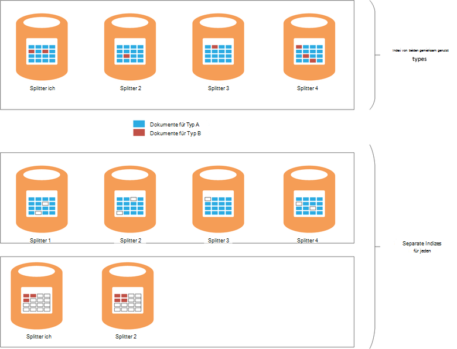

    ***Auswirkung der Freigabe Index zwischen*** 

    Im oberen Teil des Diagramms der gleiche Index der Typ A und Typ b Teilen Es gibt viele weitere Dokumente eines Typs als Typ b nach Art eines beinhaltet die Abfrage alle vier Splitter. Der untere Teil der Abbildung zeigt den Effekt, wenn separate Indizes für jeden Typ erstellt werden. In diesem Fall benötigen sucht ein Typ nur zwei Splitter zugreifen.

- Kleine Splitter können gleichmäßiger verteilt als große Splitter erleichtert Elasticsearch die Last über Knoten verteilt werden.

- Verschiedene möglicherweise unterschiedlichen Aufbewahrungszeiten. Sie können alte Daten archivieren, das Splitter mit aktiver Daten schwierig sein.


Unter Umständen Typen unternehmensweit einen Index kann jedoch effizient wenn:

- Sucht umfassen regelmäßig Typen statt im selben Index.

- Die Typen müssen nur eine kleine Anzahl von Dokumenten. Einen separaten Satz Splitter für jeden werden erheblichen Mehraufwand in diesem Fall.


### <a name="optimizing-index-types"></a>Indextypen optimieren

Elasticsearch Index enthält eine Kopie der JSON Dokumente, mit denen sie füllen. Diese Information findet in der [* \_Quelle*](https://www.elastic.co/guide/en/elasticsearch/reference/current/mapping-source-field.html#mapping-source-field) der einzelnen indizierten Elemente. Diese Daten können nicht durchsucht werden, aber standardmäßig zurückgegebene Anfragen *Abrufen* und *Suchen* . Aber dieses Feld Rechenaufwand und belegt Speicher vergrößern Splitter und Steigerung der e/a ausgeführt. Deaktivieren Sie die * \_Quelle* auf einer Basis pro Typ:

```http
PUT my_index
{
  "mappings": {
    "my_type": {
      "_source": {
        "enabled": false
      }
    }
  }
}
```
Dieses Feld deaktivieren entfernt auch die Möglichkeit, die folgenden Operationen durchführen:

- Aktualisieren von Daten im Index über die *Aktualisierung* API.

- Suchläufe, die markierte Daten zurückgeben.

- Dies ein Elasticsearch Index zu einem anderen.

- Zuordnung oder Einstellungen ändern.

- Debuggen das ursprüngliche Dokument Abfragen.


### <a name="reindexing-data"></a>Vollständige Daten

Die Anzahl der Splitter Index zur bestimmt letztlich der Kapazität des Indexes. Eine erste (und informiert) Schätzung wie viele Splitter werden nehmen, aber immer sollten Ihr Dokument erneut Indizierungsstrategie voraus. In vielen Fällen kann dies vorgesehene Aufgabe werden mit zunehmender Datenmenge. Sie sollten keine große Anzahl von Splitter zu einem Index zunächst der Suche Optimierung reservieren jedoch Zuweisung neuer Splitter Datenmengen erweitert. In anderen Fällen kann dies müssen auf mehrere Ad-hoc-Basis ausgeführt werden, sollten die geschätzten Daten Volume Wachstum einfach ungenau.

> [AZURE.NOTE] Dies kann nicht für Daten erforderlich, die schnell altert. In diesem Fall kann eine Anwendung einen neuen Index für jeden Zeitraum erstellen. Beispiele umfassen Leistungsprotokolle oder audit-Daten, die in frischem Index jeden Tag gespeichert werden kann.

<!-- -->

Dies effektiv umfasst das Erstellen eines neuen Indexes aus ALT und entfernen den alten Index. Index groß ist, kann dieser Vorgang dauern und Sie müssen sicherstellen, dass die Daten in diesem Zeitraum durchsuchbaren bleiben. Aus diesem Grund erstellen Sie einen [Alias für jeden Index](https://www.elastic.co/guide/en/elasticsearch/reference/current/indices-aliases.html)und Abfragen Daten durch diese Aliase abrufen soll. Dies, halten Sie den Alias auf den alten Index, und schalten sie den neuen Index verweisen, wenn dies abgeschlossen ist. Dieser Ansatz eignet sich auch zeitbasierte Daten, das einen neuen Index jeden Tag erstellt. Aktuellen Zugriff auf verwenden Daten einen Alias, der dem neuen Index wird erstellt wird.

### <a name="managing-mappings"></a>Verwalten von mappings

Elasticsearch verwendet Zuordnung festlegen, wie die Daten interpretiert, die in jeder Bereich in einem Dokument. Jeder hat eine eigene Zuordnung, die effektiv ein Schema für diesen Typ definiert. Elasticsearch verwendet diese Informationen invertierten Indizes für jedes Feld in den Dokumenten in einem Typ generiert. In jedem Dokument hat jedes Feld einen Datentyp (z. B. *Zeichenfolge*, *Datum*oder *long*) und einem Wert. Sie können die Zuordnung für einen Index angeben, beim erstmaligen des Indexes Erstellung oder kann von Elasticsearch abgeleitet werden, wenn ein neuer Dokumente hinzugefügt werden. Beachten Sie jedoch Folgendes:

- Dynamisch generierte Zuordnung kann je nach wie Felder interpretiert werden, wenn ein Index Dokumente hinzugefügt werden. Z. B. Dokument 1 kann ein Feld ein, das eine Zahl enthalten und Elasticsearch einer Zuordnung, die angibt, dieses Feld hinzufügen, wird eine *lange*. Wenn eine nachfolgende Dokument hinzugefügt wird ein Feld enthält nichtnumerische Daten und schlägt. In diesem Fall sollte ein Feld wahrscheinlich als Zeichenfolge ausgelegt haben das erste Dokument hinzugefügt wurde. Diese Zuordnung beim Erstellen des Indexes angeben können solche Probleme zu beheben.

- Entwerfen Sie Ihre Dokumente zu vermeiden, dass übermäßig große Zuordnung dieser zusätzlichen erheblichen Aufwand beim Suchen, viel Speicher beanspruchen und auch dazu führen, dass Abfragen Daten gefunden. Nehmen Sie eine konsistente Benennungskonvention für Felder in Dokumenten, die denselben Typ aufweisen. Verwenden Sie in verschiedenen Dokumenten keine Feldnamen "Vorname", "FirstName" und "Vorname" z. B.. Verwenden Sie denselben Feldnamen in jedem Dokument. Außerdem führen Sie Werte als Schlüssel verwenden (Dies wird häufig in Spalte Familie Datenbanken, aber kann Effizienz und Fehler mit Elasticsearch.) Weitere Informationen finden Sie unter [Auflösung zuordnen](https://www.elastic.co/blog/found-crash-elasticsearch#mapping-explosion).

- Verwenden Sie *Not_analyzed* , um die Tokenisierung zu vermeiden. Beispielsweise enthält ein Zeichenfolgenfeld mit dem Namen *Daten* , die den Wert "ABC DEF" enthält ein Dokument könnte dann versuchen, nach allen Dokumenten suchen, die diesem Wert wie folgt entsprechen:

  ```http
  GET /myindex/mydata/_search
  {
    "query" : {
      "filtered" : {
        "filter" : {
          "term" : {
            "data" : "ABC-DEF"
          }
        }
      }
    }
  }
  ```

 Suche fehl, die erwarteten Ergebnisse aufgrund zurück in die Zeichenfolge ABC DEF Token ist indiziert ist. Es werden effektiv Token ABC und DEF, durch einen Bindestrich aufgeteilt werden. Dieses Feature unterstützt Volltextsuche, aber ggf. die Zeichenfolge interpretiert als einzelne atomare Element sollten Tokenisierung deaktivieren, wenn das Dokument zum Index hinzugefügt. Können Sie eine Zuordnung wie diese:

  ```http
  PUT /myindex
  {
    "mappings" : {
      "mydata" : {
        "properties" : {
          "data" : {
            "type" : "string",
            "index" : "not_analyzed"
          }
        }
      }
    }
  }
  ```

  Weitere Informationen finden Sie in der [Genauen Werte finden](https://www.elastic.co/guide/en/elasticsearch/guide/current/_finding_exact_values.html#_term_filter_with_text).


### <a name="using-doc-values"></a>Doc Werte

Viele Abfragen und Aggregationen erfordern, dass Daten als Teil des Suchvorgangs sortiert werden. Sortierung erfordert einen oder mehrere Begriffe in eine Liste von Dokumenten zuordnen. Zur Unterstützung bei diesem Prozess laden Elasticsearch aller Werte für ein Feld in den Speicher als Sortierschlüssel verwendet. Diese Informationen werden als *Fielddata*bezeichnet. Die Absicht ist, führt zu weniger e/a Fielddata im Arbeitsspeicher Zwischenspeichern und möglicherweise schneller als wiederholt dieselben Daten vom Datenträger lesen. Ein Feld kann hohe Kardinalität der Fielddata im Arbeitsspeicher speichern viel Heapspeicher beeinträchtigen möglicherweise andere gleichzeitige Vorgänge ausführen oder sogar anstrengend Speicher verursacht Elasticsearch fehlschlagen beanspruchen.

Als Alternative unterstützt Elasticsearch *Doc-Werte*. Doc Wert ähnelt ein Element des Fielddata im Arbeitsspeicher auf der Festplatte gespeichert und erstellt, wenn in einem Index Daten (Fielddata wird dynamisch erstellt, wenn eine Abfrage ausgeführt wird.) Doc Werte Heapspeicher nicht nutzen und daher sind Abfragen, sortieren oder Daten Felder eine große Anzahl eindeutiger Werte enthalten können. Darüber hinaus können Unterdruck auf dem Heap offset Leistungsunterschiede zwischen Abrufen von Daten von der Festplatte und aus dem Speicher lesen. Garbagecollection ist wahrscheinlich weniger häufig und andere gleichzeitige Vorgänge, die Speicher nutzen voraussichtlich weniger erfolgen.

Sie aktivieren oder deaktivieren Doc Werte pro Eigenschaft für einen Index mit dem *Doc_values* -Attribut, wie im folgenden Beispiel gezeigt:

```http
PUT /myindex
{
  "mappings" : {
    "mydata" : {
      "properties" : {
        "data" : {
          ...
          "doc_values": true
        }
      }
    }
  }
}
```
> [AZURE.NOTE] Doc sind Elasticsearch Version 2.0.0 standardmäßig aktiviert.

Die genaue Auswirkung Doc Werte dürfte sein, eigene Szenarios Daten und Abfragen, sein Performance Tests zu nutzen. Beachten Sie außerdem, dass Doc Werte nicht analysierten Zeichenfolgenfelder funktionieren. Weitere Informationen finden Sie unter [Doc-Werte](https://www.elastic.co/guide/en/elasticsearch/guide/current/doc-values.html#doc-values).

### <a name="using-replicas-to-reduce-query-contention"></a>Verwendung von Replikaten zu Abfrage Konflikte

Eine gemeinsame Strategie mit der Leistung von Abfragen ist jeder Index viele Replikate erstellen. Datenabrufvorgängen können durch Abrufen von Daten aus einem Replikat erfüllt werden. Allerdings kann diese Strategie stark beeinträchtigt Daten Einnahme Prozesse muss mit Vorsicht in Szenarien verwendet werden, die gemischte Arbeitslasten betreffen. Darüber hinaus ist diese Strategie nur Replikate Knoten verteilt und stellt keine Konkurrenz für Ressourcen mit primären, die denselben Index gehören. Beachten Sie, dass man erhöhen oder verringern die Anzahl der Replikate für einen Index dynamisch.

### <a name="using-the-shard-request-cache"></a>Verwenden des Splitter Anforderung Caches

Elasticsearch kann die lokalen Daten von Abfragen auf jeder Splitter im Speicher angefordert Zwischenspeichern. Diese suchen können, die die gleichen Daten schneller abrufen können Daten aus dem Speicher statt Datenträger Speicher gelesen werden. Zwischenspeichern von Daten auf diese Weise verbessern daher einige Prozesse suchen Kosten verringern des anderen gleichzeitig ausgeführten Aufgaben zur Verfügung. Ist auch das Risiko, dass Daten aus dem Cache bereitgestellt ist veraltet. Die Daten im Cache werden nur ungültig, wenn der Splitter aktualisiert und die Daten geändert. Die Häufigkeit der Aktualisierung unterliegt den Wert der Einstellung *Aktualisierungsintervall* des Indexes.

Die Anforderung für einen Index Zwischenspeichern ist standardmäßig deaktiviert, aber wie folgt aktivieren:

```http
PUT /myindex/_settings
{
  "index.requests.cache.enable": true
}
```

Der Splitter Anforderung Cache ist für Informationen wie historisch oder Protokollierung relativ statisch bleibt.

### <a name="using-client-nodes"></a>Verwenden von Clientknoten

Alle Abfragen werden von dem Knoten, die zuerst die Anforderung empfängt. Dieser Knoten sendet weitere Anfragen an alle anderen Knoten mit Splitter abgefragten Indizes und sammelt die Ergebnisse für die Rückgabe der Antwort. Wenn eine Abfrage Datenaggregation oder komplexe Berechnungen durchführt, ist der Startknoten für die entsprechende Verarbeitung verantwortlich. Verfügt Ihr System relativ komplexe Abfragen unterstützen, sollten Sie einen Pool von Client Knoten verringern die Last Datenknoten erstellen. Umgekehrt verfügt Ihr System eine Vielzahl von Abfragen, anschließend diese Anfragen zu Datenknoten und einen Lastenausgleich um zu verteilen die Anfragen verwenden.

### <a name="tuning-queries"></a>Optimieren von Abfragen

Die folgenden Punkte fassen Tipps zur Maximierung der Leistung von Elasticsearch Abfragen:

- Vermeiden Sie Abfragen, bei denen Platzhalter möglichst.

- Wenn dasselbe Feld unter Volltext-Suchfunktionen und genau entsprechen, sollten Sie analysiert und nonanalyzed Daten für das Feld gespeichert. Durchführen Sie Volltextsuche für Feld analysiert und übereinstimmenden gegen die nonanalyzed.

- Nur Zurückgeben der Daten erforderlich. Wenn Sie große Dokumente, aber eine Anwendung nur eine Teilmenge der Felder Informationen erfordert, zurückzugeben Sie diese Teilmenge von Abfragen anstelle des gesamten. Diese Strategie reduziert die Netzwerkbandbreite des Clusters.

- Verwenden Sie Filter statt Abfragen möglichst bei der Suche nach Daten. Ein Filter bestimmt lediglich, ob ein Dokument einem bestimmten Kriterium übereinstimmt, während eine Abfrage wie nahe ein Dokument eine Übereinstimmung wird berechnet (scoring). Intern durch einen Filter generierten Werte werden als Bitmap angibt Match-keine Übereinstimmung für jedes Dokument gespeichert und von Elasticsearch zwischengespeichert werden. Tritt das gleiche Filterkriterium anschließend werden die Bitmap aus dem Cache abgerufen und übereinstimmenden Dokumente schnell abgerufen. Weitere Informationen finden Sie unter [Interne Ausführung](https://www.elastic.co/guide/en/elasticsearch/guide/current/_finding_exact_values.html#_internal_filter_operation).

- *Bool* Filter für statische Vergleiche verwenden und nur für dynamisch berechneten Filter wie die scripting umfassen verwenden *und*, *oder*und *nicht* filtern oder *Geo -\* * Filter.

- Eine Abfrage kombiniert *Bool* Filter mit *und*, *oder*oder *nicht* *Geo* -* Filter, der *und*/*oder*/*nicht Geo-** Filter zuletzt, damit sie die kleinstmögliche Daten ausgeführt werden.

    In ähnlicher Weise, *Post_filter* mit teuren Filter auszuführen. Dieser Filter werden zuletzt ausgeführt.

- Verwenden Sie Aggregationen Facets. Berechnung der Aggregate, analysiert oder viele mögliche Werte, zu vermeiden.

    > **Hinweis**: Facetten in Elasticsearch Version 2.0.0 entfernt wurden.

- Verwenden der *Kardinalität* Aggregation anstelle der Aggregation *Value_count* , wenn die Anwendung eine genaue Anzahl der übereinstimmenden Elemente erforderlich ist. Genaue Anzahl kann schnell veraltet und viele Programme benötigen nur ein vernünftiger.

- Vermeiden Sie scripting. Skripts in Abfragen und Filtern können teuer und die Ergebnisse werden nicht zwischengespeichert. Langer Skripts können Suchthreads, sodass nachfolgende Anfragen in der Warteschlange verarbeiten. Wenn die Warteschlange voll ist, werden weitere Anträge abgelehnt.

## <a name="testing-and-analyzing-aggregation-and-search-performance"></a>Prüfung und Analyse der Leistung Aggregation und Suche

Dieser Abschnitt beschreibt die Ergebnisse einer Reihe von Tests mit unterschiedlichen Cluster und Indexkonfigurationen ausgeführt wurden. Zwei Arten von Tests wurden durchgeführt:

- * *Aufnahme *und Abfrage* testen **. Dieser Test gestartet mit einem leeren Index als Zeichenfolge der Test einfügen Massenimport (jede Operation hinzugefügt 1000 Dokumente) übernommen. Anzahl der Abfragen während der vorherigen Zeitraum von 15 Minuten Suche und Aggregationen entworfen wurden zur gleichen Zeit in Intervallen von 5 Sekunden wiederholt. Dieser Test durfte normalerweise 24 Stunden ausgeführt, um die Effekte einer anspruchsvollen Arbeitslast mit umfangreichen Daten Einnahme mit in Echtzeit Abfragen zu reproduzieren.

- **Die *Abfrage nur* **zu testen. Dieser Test ist mit der *Aufnahme und Abfrage* testen Einnahme Teil fehlt und der Index auf jedem Knoten mit 100 Millionen Dokumenten aufgefüllt. Geänderten Satz von Abfragen wird ausgeführt. Zeitelement Dokumente hinzugefügt wurden in den letzten 15 Minuten beschränken wurde entfernt, da die Daten jetzt statische. Die Tests ausgeführt haben, 90 Minuten weniger Zeit erforderlich, um ein Muster Performance aufgrund der feste Daten;

---

Jedes Dokument im Index hat dasselbe Schema. In dieser Tabelle werden die Felder im Schema zusammengefasst:

Name                          | Typ         | Notizen |
  ----------------------------- | ------------ | -------------------------------------------------------- |
  Organisation                  | Zeichenfolge      | Der Test wird 200 eindeutige Organisationen. |
  CustomField1 - CustomField5   |Zeichenfolge       |Dies sind fünf Zeichenfolgenfelder die leere Zeichenfolge festgelegt werden.|
  DateTimeRecievedUtc           |Zeitstempel    |Datum und Uhrzeit, an dem Dokument hinzugefügt wurde.|
  Host                          |Zeichenfolge       |Dieses Feld ist auf eine leere Zeichenfolge festgelegt.|
  HttpMethod                    |Zeichenfolge       |Dieses Feld ist einer der folgenden Werte festgelegt: "POST", "GET", "PUT".|
  HttpReferrer                  |Zeichenfolge       |Dieses Feld ist auf eine leere Zeichenfolge festgelegt.|
  HttpRequest                   |Zeichenfolge       |Dieses Feld wird mit zufälligen Text zwischen 10 und 200 Zeichen aufgefüllt.|
  HttpUserAgent                 |Zeichenfolge       |Dieses Feld ist auf eine leere Zeichenfolge festgelegt.|
  HttpVersion                   |Zeichenfolge       |Dieses Feld ist auf eine leere Zeichenfolge festgelegt.|
  Organisationsname              |Zeichenfolge       |Dieses Feld wird auf den gleichen Wert wie das Feld Organisation festgelegt.|
  SourceIp                      |IP           |Dieses Feld enthält eine IP-Adresse "Ursprung" der Daten angibt. |
   SourceIpAreaCode              |Lange         |Dieses Feld ist auf 0 festgelegt.|
  SourceIpAsnNr                 |Zeichenfolge       |Dieses Feld "als\#\#\#\#\#".|
  SourceIpBase10                |Lange         |Dieses Feld ist auf 500 festgelegt.|
  SourceIpCountryCode           |Zeichenfolge       |Dieses Feld enthält einen Ländercode 2 Zeichen. |
  SourceIpCity                  |Zeichenfolge       |Dieses Feld enthält eine Zeichenfolge, einer Stadt in einem Land. |
  SourceIpLatitude              |Double       |Dieses Feld enthält einen zufälligen Wert.|
  SourceIpLongitude             |Double       |Dieses Feld enthält einen zufälligen Wert.|
  SourceIpMetroCode             |Lange         |Dieses Feld ist auf 0 festgelegt.|
  SourceIpPostalCode            |Zeichenfolge       |Dieses Feld ist auf eine leere Zeichenfolge festgelegt.|
  SourceLatLong                 |Geo-Punkt   |Dieses Feld ist auf eine zufällige Geo festgelegt.|
  Quellport                    |Zeichenfolge       |Dieses Feld wird mit String-Darstellung einer Zufallszahl aufgefüllt.|
  TargetIp                      |IP           |Dies ist eine zufällige IP-Adresse im Bereich 0.0.100.100 255.9.100.100 aufgefüllt.|
  SourcedFrom                   |Zeichenfolge       |Dieses Feld wird in die Zeichenfolge "MonitoringCollector" festgelegt.|
  TargetPort                    |Zeichenfolge       |Dieses Feld wird mit String-Darstellung einer Zufallszahl aufgefüllt.|
  Bewertung                        |Zeichenfolge       |Dieses Feld wird mit 20 verschiedenen Zeichenfolgenwerten stichprobenweise aufgefüllt.|
  UseHumanReadableDateTimes     |Boolescher Wert      |Dieses Feld ist auf False festgelegt.|
 
Die folgenden Abfragen wurden als Batch von jeder Iteration des Tests ausgeführt. Namen in Kursivschrift wird diese Abfragen in diesem Dokument beziehen. Hinweis Das Zeitkriterium (Dokumente in den letzten 15 Minuten hinzugefügt) ausgelassen wurde die *Abfrage nur* Tests:

- Wie viele Dokumente mit *Jeder Wert* in den letzten 15 Minuten (*Anzahl von Bewertung*) eingegeben wurden? 

- Wie viele Dokumente während der letzten 15 Minuten (*Anzahl mit der Zeit*) in jeder 5 Minuten hinzugefügt wurden?

- Wie viele Dokumente jeder *Bewertung* für jedes Land in den letzten 15 Minuten (*Zugriffe nach Land*) wurden?

- Die 15 Unternehmen auftreten, die meisten häufig in Dokumente, die in den letzten 15 Minuten (*Top 15 Organisationen*) hinzugefügt?

- Wie viele andere Unternehmen in Dokumenten, die in den letzten 15 Minuten (*eindeutige Anzahl Organisationen*) hinzugefügt auftreten?

- Wie viele Dokumente wurden in den letzten 15 Minuten (*Gesamtanzahl der Treffer Count*)?

- Wie viele verschiedene *SourceIp* in Dokumenten, die in den letzten 15 Minuten (*Anzahl eindeutiger IP*) hinzugefügt auftreten?


Definition des Indexes und die Details der Abfragen sind im [Anhang](#appendix-the-query-and-aggregation-performance-test)aufgeführt.

Die Tests wurden die Auswirkungen der folgenden Variablen:

- **Datenträgertyp**. Tests wurden auf 6 Nodes D4 VMs mit standardmäßigen Speicher (HDDs) ausgeführt und auf einem Cluster mit 6 Knoten DS4 VMs mit Premium-Speicher (SSDs) wiederholt.

- **Computer-Größe - Skalierung**. Tests wurden auf 6 Nodes mit DS3 VMs (als *kleinen* Clusters) durchgeführt, in einem Cluster DS4 VMs ( *Mittel* -Cluster) wiederholt und wiederholt in einem Cluster DS14 Computer ( *großer* Cluster). Die folgende Tabelle zeigt die Schlüsselmerkmale der einzelnen VM SKU:

 Cluster | VM-SKU        | Anzahl der Kerne | Anzahl der Datenträger | RAM (GB) |
---------|---------------|-----------------|----------------------|----------|
 Kleine   | Standard DS3  | 4               | 8                    | 14       |
 Mittel  | Standardmäßige DS4  | 8               | 16                   | 28       |
 Große   | Standardmäßige DS14 | 16              | 32                   | 112      |

- **Clustergröße - Skalierung**. Tests wurden in Clustern DS14 VMs mit 1, 3 und 6 Knoten durchgeführt.

- **Anzahl der indexreplikate**. Mithilfe von Indizes mit 1 und 2 konfiguriert wurden durchgeführt.

- **Doc-Werte**. Anfangs wurden der Tests mit dem Index festlegen *Doc_values* auf *true* (Standardwert) festgelegt. Ausgewählte Tests wiederholten mit *Doc_values* auf *false*festgelegt.

- **Zwischenspeichern**. Tests wurden mit dem Splitter Anforderung Cache aktiviert auf dem Index durchgeführt.

- **Anzahl der Splitter**. Tests wurden wiederholt mit wechselnder Splitter herstellen, ob Abfragen über Indizes mit weniger und größere Splitter oder mehr und kleinere Splitter effizienter ausgeführt wurde.


## <a name="performance-results---disk-type"></a>Ergebnisse - Datenträgertyp

Leistungsdaten wurde von Systemtest *Aufnahme und Abfrage* auf 6 Nodes D4 VMs (mit Festplatten) und 6 Nodes DS4 VMs (mit SSDs) ausgewertet. Die Konfiguration des Elasticsearch in beide Cluster war. Daten wurde 16 Festplatten auf jedem Knoten verteilt jeder Knoten hat 14GB RAM Java Virtual Machine (JVM) ausgeführt Elasticsearch zugeordnet und verbleibende Speicher (auch 14GB) für Betriebssystem abgegeben wurde. Jeder Test 24 Stunden ausgeführt. Diese Frist wurde ausgewählt, damit die Effekte der steigenden Datenmengen sichtbar und das System stabilisiert hat. In der folgenden Tabelle sind die Ergebnisse markieren die Reaktionszeiten der verschiedenen Operationen, die den Test besteht.

 Cluster | Abfrage-Vorgang            | Durchschnittliche Antwortzeit (ms) |
---------|----------------------------|----------------------------|
 D4      | Aufnahme                  | 978                        |
         | Anzahl nach Bewertung            | 103                        |
         | Über Zählzeit            | 134                        |
         | Zugriffe nach Land            | 199                        |
         | Top 15 Organisationen       | 137                        |
         | Anzahl der eindeutigen Organisationen | 139                        |
         | Eindeutige IP-Anzahl            | 510                        |
         | Gesamtanzahl der Treffer zählen           | 89                         |
 DS4     | Aufnahme                  | 511                        |
         | Anzahl nach Bewertung            | 187                        |
         | Über Zählzeit            | 411                        |
         | Zugriffe nach Land            | 402                        |
         | Top 15 Organisationen       | 307                        |
         | Anzahl der eindeutigen Organisationen | 320                        |
         | Eindeutige IP-Anzahl            | 841                        |
         | Gesamtanzahl der Treffer zählen           | 236                        |

Auf den ersten Blick scheint es, DS4 Cluster Abfragen weniger gut als D4 Cluster zeitweise verdoppelt (oder schlechter) Zeit ausgeführt. Dies sagt alles aber nicht. Die nächste Tabelle zeigt die Anzahl der Einnahme Operationen Clustern (Beachten Sie, dass jede Operation 1000 Dokumente geladen):

 Cluster | Anzahl der Vorgänge Einnahme |
---------|---------------------------|
 D4      | 264769                    |
 DS4     | 503157                    |

DS4 Cluster konnte fast doppelt so viele Daten als D4 Cluster während des Tests zu laden. Daher müssen beim Analysieren der Antwortzeiten für jeden Vorgang auch überlegen, wie viele Dokumente muss jede Abfrage durchsuchen und wie viele Dokumente zurückgegeben werden. Ständig wächst das Volumen der Dokumente im Index sind dynamische Zahlen. Nicht einfach 503137 von 264769 (Anzahl der Einnahme Operationen Clustern) teilen und Multiplizieren Sie das Ergebnis durch die durchschnittliche Antwortzeit für jede Abfrage durchgeführte D4 Cluster zu vergleichenden Informationen als den Betrag der i/o gleichzeitig Ingestion-Vorgang durchgeführt werden ignoriert. Sie sollten Bestimmung der physischen Daten geschrieben wird und wie der Test verläuft von der Festplatte gelesen. Der Testplan JMeter erfasst diese Informationen für jeden Knoten. Die zusammengefassten Ergebnisse sind:

 Cluster | Durchschnittliche Anzahl von Bytes bei jedem Vorgang geschrieben/lesen |
---------|----------------------------------------------|
 D4      | 13471557                                     |
 DS4     | 24643470                                     |

Diese Daten zeigt, dass DS4 Cluster können einer e/a-Rate etwa 1,8 Mal des Clusters D4. Abgesehen von der Natur der Datenträger alle Ressourcen identisch sind, müssen die Differenz durch mit SSDs eher Festplatten.

Diese Schlussfolgerung rechtfertigen hierzu die folgenden Diagramme veranschaulichen die die e/a mit der Zeit von Clustern durchgeführt:

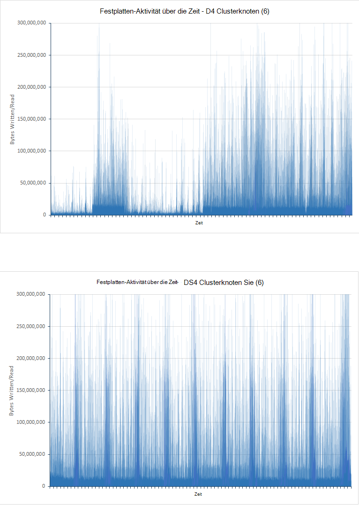

<!-- -->

***Die Datenträgeraktivität für Cluster D4 und DS4***

Für den Cluster D4 Diagramm beträchtliche Unterschiede insbesondere während der ersten Hälfte des Tests. Dies wurde wahrscheinlich um die e/a-Rate throttling. In den Anfangsphasen des Tests können Abfragen schnell ausgeführt wie wenig Daten analysieren. Datenträger im Cluster D4 dürften daher nahe die Input-Output-Operationen pro Sekunde (IOPS) Kapazität betrieben werden zwar jede e/a-Operation nicht viele Daten zurückgeben kann. DS4 Cluster IOPS höher unterstützt und gleichbleibender Drosselung nicht leiden, die e/a-Raten regelmäßiger. Um diese Theorie zu stützen, zeigen das nächste Paar der Grafiken wie CPU Festplatte langfristig blockiert wurde (die Datenträger Wartezeiten in den Diagrammen dargestellt sind Teil der Zeit, die CPU warten auf e/a):


***CPU-Festplatte Wartezeiten für Cluster D4 und DS4***

Es ist wichtig zu verstehen, dass zwei vorherrschenden Gründen Ausgabeoperationen CPU blockiert:

- E/a-Subsystem konnte lesen und Schreiben von Daten oder auf Datenträger.

- E/a-Subsystem konnte die Host-Umgebung gedrosselt. Azure Laufwerke mit Festplatten implementiert einen maximalen Durchsatz von 500 IOPS und SSDs einen maximalen Durchsatz von 5000 IOPS.


Für den Cluster D4 Wartezeit die Zeitdauer für e/a im ersten Halbjahr Test korreliert eng in umgekehrter Weise mit den e/a-Diagramm. Perioden niedrige e/a zu viel Zeit verbringt die CPU blockierte entsprechen, bedeutet dies, dass e/a gedrosselt wird. Die Situation ändert weitere Daten zum Cluster hinzugefügt und in der zweiten Hälfte der Peaks Test e/a-Wartezeiten mit Datendurchsatz entsprechen. An diesem Punkt wird die CPU bei echten e/a blockiert. Wieder ist die Wartezeit auf e/a mit dem Cluster DS4 noch viel mehr. Jeder Peak entspricht eine entsprechende Spitze anstatt eine e/a-Leistung, dies bedeutet, dass es wenig oder keine Drosselung auftritt.

Es gibt einen weiteren Faktor berücksichtigen. Während des Tests generierte D4 Cluster 10584 Einnahme, und 21 Abfrage Fehler. Auf DS4 Cluster erzeugt keinen Fehler.

## <a name="performance-results---scaling-up"></a>Ergebnisse - Skalierung

Skalieren Tests wurden durch Tests mit 6 Knoten Cluster DS14 VMs, DS3 und DS4. Diese SKUS wurden ausgewählt, da DS4 VM doppelt so viele CPUs und Speicher als eine DS3 bietet und DS14 Computer CPU-Ressourcen wieder gleichzeitig vier Mal die Menge an Arbeitsspeicher verdoppelt. In der folgenden Tabelle werden die wichtigsten Aspekte der Lagerhaltungsdaten verglichen:

 SKU  | \#CPU-Kerne | Speicher (GB) | Max. Laufwerks-IOPS | Max. Bandbreite (MB/s)|
------|-------------|-------------|---------------|--------------|
 DS3  | 4           | 14          | 12800| 128 |
 DS4  | 8           | 28          | 25.600| 256 |
 DS14 | 16          | 112         | 50.000| 512 |

In der folgenden Tabelle sind die Ergebnisse der Ausführung der Tests auf klein (DS3), Mittel (DS4) und großen Clustern (DS14). Jede VM verwendet SSDs zum Speichern der Daten. Jeder Test 24 Stunden ausgeführt.

Die Tabelle gibt die Anzahl der erfolgreichen Anfragen für jede (Fehler sind nicht enthalten). Die Anzahl der Anfragen, die für jede Abfrage versucht entspricht etwa der Ausführung eines Tests. Deswegen Testplan JMeter führt jede Abfrage (Anzahl von Bewertung, über Zeit Treffer nach Land, Top 15 Organisationen, eindeutige Anzahl Organisationen, Anzahl eindeutiger IP und Gesamtzahl der Treffer) einmalig zusammen in einer einzelnen Einheit eine *Transaktion* (diese Transaktion ist unabhängig von der Aufgabe, die Einnahme Operation durchführt, die von einem separaten Thread ausgeführt wird). Jede Iteration des Testplans führt eine einzelne Testtransaktion. Die Anzahl der Testtransaktionen ist daher ein Maß für die Reaktionszeit der langsamste Abfrage bei jeder Buchung.

| Cluster      | Abfrage-Vorgang            | Anzahl der Anfragen | Durchschnittliche Antwortzeit (ms) |
|--------------|----------------------------|--------------------|----------------------------|
| Klein (DS3)  | Aufnahme                  | 207284             | 3328                       |
|              | Anzahl nach Bewertung            | 18444              | 268                        |
|              | Über Zählzeit            | 18444              | 340                        |
|              | Zugriffe nach Land            | 18445              | 404                        |
|              | Top 15 Organisationen       | 18439              | 323                        |
|              | Anzahl der eindeutigen Organisationen | 18437              | 338                        |
|              | Eindeutige IP-Anzahl            | 18442              | 468                        |
|              | Gesamtanzahl der Treffer zählen           | 18428              | 294   
|||||
| Mittel (DS4) | Aufnahme                  | 503157             | 511                        |
|              | Anzahl nach Bewertung            | 6958               | 187                        |
|              | Über Zählzeit            | 6958               | 411                        |
|              | Zugriffe nach Land            | 6958               | 402                        |
|              | Top 15 Organisationen       | 6958               | 307                        |
|              | Anzahl der eindeutigen Organisationen | 6956               | 320                        |
|              | Eindeutige IP-Anzahl            | 6955               | 841                        |
|              | Gesamtanzahl der Treffer zählen           | 6958               | 236                        |
|||||
| Groß (DS14) | Aufnahme                  | 502714             | 511                        |
|              | Anzahl nach Bewertung            | 7041               | 201                        |
|              | Über Zählzeit            | 7040               | 298                        |
|              | Zugriffe nach Land            | 7039               | 363                        |
|              | Top 15 Organisationen       | 7038               | 244                        |
|              | Anzahl der eindeutigen Organisationen | 7037               | 283                        |
|              | Eindeutige IP-Anzahl            | 7037               | 681                        |
|              | Gesamtanzahl der Treffer zählen           | 7038               | 200                        |

Diese Zahlen zeigen, dass dieser Test die Leistung des Clusters DS4 und DS14 sind recht ähnlich. Reaktionszeiten für Abfragevorgänge DS3 Cluster auch positiv zunächst vergleichen erscheinen, und die Anzahl der Abfrageoperationen ist weit über die Werte für die Cluster DS4 und DS14. Allerdings sollte eine auch starke der Erfassung und konsequente Anzahl Dokumente gesucht beachten. Im Cluster DS3 Einnahme weitaus eingeschränkt und am Ende des Tests die Datenbank nur 40 % von jedem anderen Clustern lesen Dokumente enthalten. Dies ist möglicherweise Verarbeitungsressourcen, Netzwerk und Datenträgerbandbreite einer DS3 VM im Vergleich zu einer DS4 oder DS14 VM. DS4 VM ist doppelt so viele Ressourcen wie DS3 VM und ein DS14 zweimal (viermal für Speicher) hat die Ressourcen DS4 VM, bleibt die Frage: Warum bei Ingestion Cluster DS4 und DS14 deutlich weniger unterscheidet zwischen den Clustern DS3 und DS4? Dies kann den Netzwerkverkehr und Bandbreitengrenzwerte Azure VMs sein. Die folgenden Diagramme zeigen diese Daten für alle drei Gruppen:


**Netzwerklast für Aufnahme und Abfrage Testes DS3, DS4 und DS14-Cluster** 

<!-- -->

Die verfügbare Netzwerkbandbreite mit Azure VMs werden nicht veröffentlicht und kann variieren, aber daß die Netzwerkaktivität angezeigt wird im Durchschnitt um 2.75GBps für die DS4 verlangsamte haben und DS14 Tests schlägt Grenzwert erreicht wurde und letztendlich Durchsatz einschränken. Bei Cluster DS3 war die Netzwerkaktivität deutlich geringere Leistung eher aufgrund der Verfügbarkeit anderer Ressourcen.

Isolieren Sie die Effekte der Einnahme Vorgänge veranschaulichen, wie Leistung variiert, wie Knoten skalieren und wurde eine Reihe von Abfrage nur Tests mit denselben Knoten ausgeführt. In der folgenden Tabelle werden die Ergebnisse auf allen Clustern zusammengefasst:

> [AZURE.NOTE] Sollten Sie nicht vergleichen die Leistung und die Anzahl der Anfragen, die Ausführung von Abfragen in der *Abfrage nur* mit von *Aufnahme und Abfrage* testen. Ist Abfragen geändert wurden und das Volumen der Dokumente unterscheidet.

| Cluster      | Abfrage-Vorgang            | Anzahl der Anfragen | Durchschnittliche Antwort Ttme (ms) |
|--------------|----------------------------|--------------------|----------------------------|
| Klein (DS3)  | Anzahl nach Bewertung            | 464                | 11758                      |
|              | Über Zählzeit            | 464                | 14699                      |
|              | Zugriffe nach Land            | 463                | 14075                      |
|              | Top 15 Organisationen       | 464                | 11856                      |
|              | Anzahl der eindeutigen Organisationen | 462                | 12314                      |
|              | Eindeutige IP-Anzahl            | 461                | 19898                      |
|              | Gesamtanzahl der Treffer zählen           | 462                | 8882  
|||||
| Mittel (DS4) | Anzahl nach Bewertung            | 1045               | 4489                       |
|              | Über Zählzeit            | 1045               | 7292                       |
|              | Zugriffe nach Land            | 1053               | 7564                       |
|              | Top 15 Organisationen       | 1055               | 5066                       |
|              | Anzahl der eindeutigen Organisationen | 1051               | 5231                       |
|              | Eindeutige IP-Anzahl            | 1051               | 9228                       |
|              | Gesamtanzahl der Treffer zählen           | 1051               | 2180                       |
|||||
| Groß (DS14) | Anzahl nach Bewertung            | 1842               | 1927                       |
|              | Über Zählzeit            | 1839               | 4483                       |
|              | Zugriffe nach Land            | 1838               | 4761                       |
|              | Top 15 Organisationen       | 1842               | 2117                       |
|              | Anzahl der eindeutigen Organisationen | 1837               | 2393                       |
|              | Eindeutige IP-Anzahl            | 1837               | 7159                       |
|              | Gesamtanzahl der Treffer zählen           | 1837               | 642                        |

Dieses Mal die Trends der durchschnittlichen Antwortzeit über verschiedene Cluster ist klarer. Netzwerkverkehr ist unter 2.75GBps vorgeschriebenen DS4 und DS14 Clustern (die Aufnahme und Abfrage Tests im Netzwerk möglicherweise gesättigt) oben und der 1.5GBps für den Cluster DS3. Tatsächlich ist es näher 200MBps in allen Fällen wie den folgenden Diagrammen dargestellt:

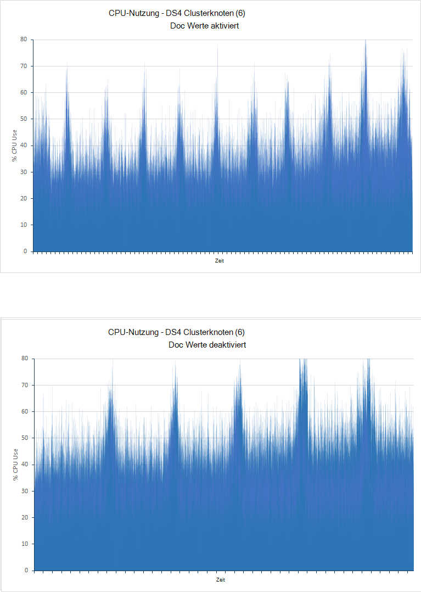

***Nutzung der DS3 DS4 und DS14 Cluster Testes Abfrage nur Netzwerk*** 

Der einschränkende Faktor in Clustern DS3 und DS4 erscheint zu CPU-Auslastung 100 % für einen Großteil der Zeit. In der DS14 bildet Cluster die CPU-Verwendung nur 80 %. Hoch ist dies klar hervorgehoben Vorteile mehr CPU-Kerne verfügbar. Das folgende Bild zeigt die CPU Verwendungsmuster für Cluster DS3, DS4 und DS14.

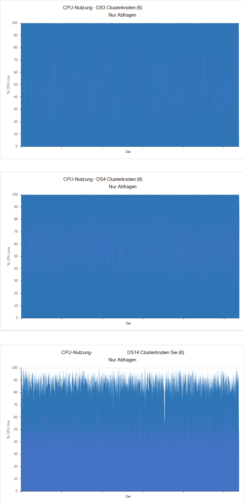

***CPU-Auslastung für die Abfrage nur Tests DS3 und DS14-Cluster*** 

## <a name="performance-results---scaling-out"></a>Ergebnisse - Skalierung

Zur Veranschaulichung, wie Sie mit der Anzahl Knoten skaliert wurden Tests mit DS14 Cluster mit 1, 3 und 6 Knoten ausgeführt. Nur dieses Mal, die *nur Abfrage* durchgeführt wurde, 100 Millionen Dokumente und 90 Minuten:

| Cluster | Abfrage-Vorgang            | Anzahl der Anfragen | Durchschnittliche Antwortzeit (ms) |
|---------|----------------------------|--------------------|----------------------------|
| 1 Knoten  | Anzahl nach Bewertung            | 288                | 6216                       |
|         | Über Zählzeit            | 288                | 28933                      |
|         | Zugriffe nach Land            | 288                | 29455                      |
|         | Top 15 Organisationen       | 288                | 9058                       |
|         | Anzahl der eindeutigen Organisationen | 287                | 19916                      |
|         | Eindeutige IP-Anzahl            | 284                | 54203                      |
|         | Gesamtanzahl der Treffer zählen           | 287                | 3333                       |
|||||
| 3 Knoten | Anzahl nach Bewertung            | 1194               | 3427                       |
|         | Über Zählzeit            | 1194               | 5381                       |
|         | Zugriffe nach Land            | 1191               | 6840                       |
|         | Top 15 Organisationen       | 1196               | 3819                       |
|         | Anzahl der eindeutigen Organisationen | 1190               | 2938                       |
|         | Eindeutige IP-Anzahl            | 1189               | 12516                      |
|         | Gesamtanzahl der Treffer zählen           | 1191               | 1272                       |
|||||
| 6 Knoten | Anzahl nach Bewertung            | 1842               | 1927                       |
|         | Über Zählzeit            | 1839               | 4483                       |
|         | Zugriffe nach Land            | 1838               | 4761                       |
|         | Top 15 Organisationen       | 1842               | 2117                       |
|         | Anzahl der eindeutigen Organisationen | 1837               | 2393                       |
|         | Eindeutige IP-Anzahl            | 1837               | 7159                       |
|         | Gesamtanzahl der Treffer zählen           | 1837               | 642                        |

Die Anzahl der Knoten macht wirkten sich die Abfrageperformance des Clusters in linear. Der Cluster mit 3 Knoten schließt etwa 4 Mal so viele Abfragen Einzelknoten-Cluster während der Cluster mit 6 Knoten 6 so viele behandelt. Zur Erläuterung dieses Linearität Graphen die folgenden wie die CPU durch drei Clustern verbraucht wurde:

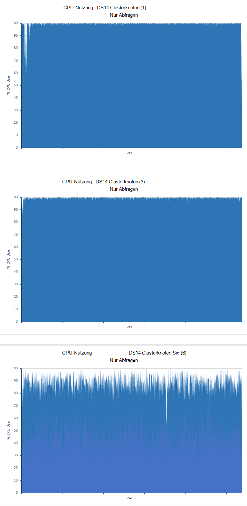

***CPU-Auslastung für 1, 3 und 6-Knoten-Cluster durchführen des Abfrage nur Tests***

Single- und 3-Knoten-Cluster sind CPU-gebundene CPU-Auslastung hoch in 6 Nodes ist es zwar freie Kapazität verfügbar. In diesem Fall dürften Faktoren den Durchsatz eingeschränkt werden. Dies konnte mit 9 und 12 Knoten wahrscheinlich weiter freie Kapazität anzeigen bestätigt werden.

Die Daten in der Tabelle oben zeigt auch, wie die durchschnittlichen Antwortzeiten für Abfragen unterscheiden. Dies ist das Element, das umfangreichste ist beim Testen ein Systems für bestimmte Arten von Abfragen wie skaliert. Einige suchen sind deutlich effizienter, wenn Knoten als andere umfassen. Kann entweder das Verhältnis zwischen der Anzahl der Knoten und die Anzahl der Dokumente im Cluster erhöhen, jedes Cluster 100 Millionen Dokumente enthalten. Bei suchen, bei denen Datenaggregation Elasticsearch verarbeitet und die Daten als Teil der Aggregation auf jedem Knoten abgerufen. Wenn mehrere Knoten vorhanden sind, ist weniger Daten abrufen, Puffer und auf den einzelnen Knoten verarbeiten.

## <a name="performance-results---number-of-replicas"></a>Ergebnisse - Anzahl der Replikate

Die *Aufnahme und Abfrage* wurden für einen Index mit einem Replikat Tests. Die Tests wurden auf die 6 DS4 und DS14 Einzelknotencluster mithilfe eines Indexes mit zwei Replikate konfiguriert wiederholt. Alle Tests verliefen 24 Stunden. Die folgende Tabelle zeigt die verglichenen Ergebnisse für einen und zwei Replikate:

| Cluster | Abfrage-Vorgang            | Durchschnittliche Antwortzeit (ms) - 1 Replikat | Durchschnittliche Antwortzeit (ms) - 2 Replikate | % Differenz Reaktionszeit |
|---------|----------------------------|----------------------------------------|-----------------------------------------|-------------------------------|
| DS4     | Aufnahme                  | 511                                    | 655                                     | + 28 %                          |
|         | Anzahl nach Bewertung            | 187                                    | 168                                     | -10 %                          |
|         | Über Zählzeit            | 411                                    | 309                                     | -25 %                          |
|         | Zugriffe nach Land            | 402                                    | 562                                     | + 40 %                          |
|         | Top 15 Organisationen       | 307                                    | 366                                     | + 19 %                          |
|         | Anzahl der eindeutigen Organisationen | 320                                    | 378                                     | + 18 %                          |
|         | Eindeutige IP-Anzahl            | 841                                    | 987                                     | + 17 %                          |
|         | Gesamtanzahl der Treffer zählen           | 236                                    | 236                                     | + 0 %                           |
||||||
| DS14    | Aufnahme                  | 511                                    | 618                                     | + 21 %                          |
|         | Anzahl nach Bewertung            | 201                                    | 275                                     | + 37 %                          |
|         | Über Zählzeit            | 298                                    | 466                                     | + 56 %                          |
|         | Zugriffe nach Land            | 363                                    | 529                                     | + 46 %                          |
|         | Top 15 Organisationen       | 244                                    | 407                                     | + 67 %                          |
|         | Anzahl der eindeutigen Organisationen | 283                                    | 403                                     | + 42 %                          |
|         | Eindeutige IP-Anzahl            | 681                                    | 823                                     | + 21 %                          |
|         | Gesamtanzahl der Treffer zählen           | 200                                    | 221                                     | + 11 %                          |

Aufnahme Rate verringert die Anzahl der Replikate erhöht. Dies sollten Sie berücksichtigen, wie Elasticsearch generieren zusätzliche Datenträger mehrere Kopien eines einzelnen Dokuments schreiben.  Dies spiegelt sich Diagramme für den Cluster DS14 für Indizes mit 1 und 2 in der folgenden Abbildung dargestellt. Bei Index mit 1 Replikat liegt die durchschnittliche e/a-16896573 Bytes pro Sekunde. Für den Index mit 2 war die durchschnittliche e/a-Rate über doppelt so viele 33986843 Bytes/Sekunde.

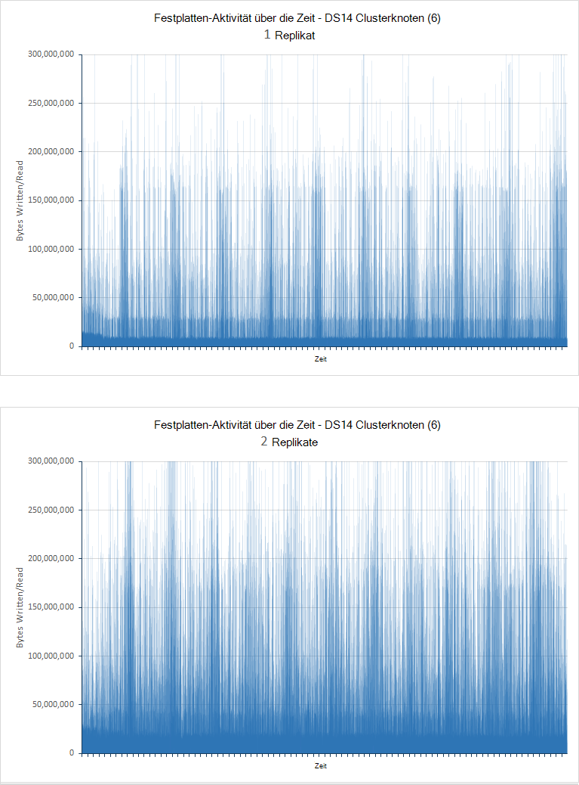

***E/a-Raten für Knoten mit 1 und 2 des Testes Aufnahme und Abfrage***

| Cluster | Abfrage                      | Durchschnittliche Antwortzeit (ms) - 1 Replikat | Durchschnittliche Antwortzeit (ms) - 2 Replikate |
|---------|----------------------------|----------------------------------------|-----------------------------------------|
| DS4     | Anzahl nach Bewertung            | 4489                                   | 4079                                    |
|         | Über Zählzeit            | 7292                                   | 6697                                    |
|         | Zugriffe nach Land            | 7564                                   | 7173                                    |
|         | Top 15 Organisationen       | 5066                                   | 4650                                    |
|         | Anzahl der eindeutigen Organisationen | 5231                                   | 4691                                    |
|         | Eindeutige IP-Anzahl            | 9228                                   | 8752                                    |
|         | Gesamtanzahl der Treffer zählen           | 2180                                   | 1909                                    |
|||||
| DS14    | Anzahl nach Bewertung            | 1927                                   | 2330                                    |
|         | Über Zählzeit            | 4483                                   | 4381                                    |
|         | Zugriffe nach Land            | 4761                                   | 5341                                    |
|         | Top 15 Organisationen       | 2117                                   | 2560                                    |
|         | Anzahl der eindeutigen Organisationen | 2393                                   | 2546                                    |
|         | Eindeutige IP-Anzahl            | 7159                                   | 7048                                    |
|         | Gesamtanzahl der Treffer zählen           | 642                                    | 708                                     |

Diese Ergebnisse zeigen eine durchschnittliche Antwortzeit für DS4 Cluster jedoch eine Erhöhung der DS14 Cluster. Zur Interpretation dieser Ergebnisse sollten Sie die Anzahl der Abfragen nach jedem Test ausgeführt:

| Cluster | Abfrage                      | Nummer 1 Replikat ausgeführt- | Anzahl durchgeführt - 2 Replikate |
|---------|----------------------------|------------------------------|-------------------------------|
| DS4     | Anzahl nach Bewertung            | 1054                         | 1141                          |
|         | Über Zählzeit            | 1054                         | 1139                          |
|         | Zugriffe nach Land            | 1053                         | 1138                          |
|         | Top 15 Organisationen       | 1055                         | 1141                          |
|         | Anzahl der eindeutigen Organisationen | 1051                         | 1136                          |
|         | Eindeutige IP-Anzahl            | 1051                         | 1135                          |
|         | Gesamtanzahl der Treffer zählen           | 1051                         | 1136                          |
|||||
| DS14    | Anzahl nach Bewertung            | 1842                         | 1718                          |
|         | Über Zählzeit            | 1839                         | 1716                          |
|         | Zugriffe nach Land            | 1838                         | 1714                          |
|         | Top 15 Organisationen       | 1842                         | 1718                          |
|         | Anzahl der eindeutigen Organisationen | 1837                         | 1712                          |
|         | Eindeutige IP-Anzahl            | 1837                         | 1712                          |
|         | Gesamtanzahl der Treffer zählen           | 1837                         | 1712                          |

Diese Daten zeigt, dass DS4 Cluster ausgeführten Abfragen mit der Rückgang der durchschnittliche Reaktionszeit mehr erneut die Umkehrung des Clusters DS14 gilt. Ein wichtiger Faktor ist, dass die CPU-Nutzung der DS4 in Replikat 1 und 2-Replikat Tests cluster war ungleich verteilt. Einige Knoten ausgestellt nahe 100 % Auslastung, während andere freie Kapazität. Die Verbesserung der Leistung ist wahrscheinlich durch verbesserte Fähigkeit zur Verarbeitung der Knoten des Clusters verteilt. Die folgende Abbildung zeigt die Variante CPU Verarbeitung zwischen äußerst leicht und häufig verwendete VMs (Knoten 4 und 3):

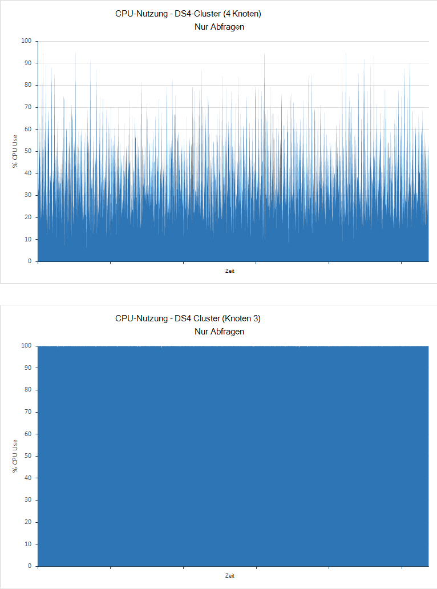

***CPU-Auslastung für die wenigsten verwendeten und am häufigsten verwendeten Knoten im Cluster DS4 Testes Abfrage nur***

Für den Cluster DS14 war dies nicht der Fall. CPU-Auslastung für beide Tests war niedriger auf allen Knoten und die Verfügbarkeit eines zweiten Replikats Vorteil und mehr Aufwand:

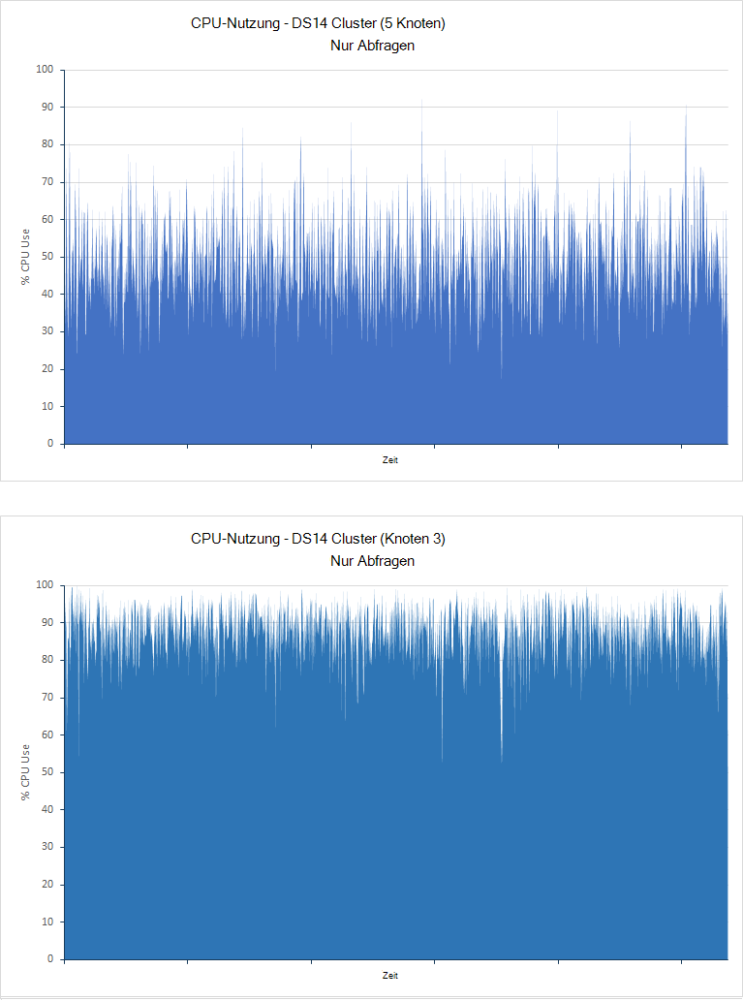

***CPU-Auslastung für die wenigsten verwendeten und am häufigsten verwendeten Knoten im Cluster DS14 Testes Abfrage nur***

Diese Ergebnisse zeigen muss Ihr System sorgfältig analysieren, ob mehrere Replikate verwenden. Sie sollten immer mindestens ein Replikat jedes Indexes (sofern Sie bereit sind, Daten verlieren, wenn ein Knoten ausfällt), aber zusätzliche Replikate können eine Belastung für das System wenig nutzen Ihre Arbeitslasten und Hardwareressourcen für den Cluster verfügbar.

## <a name="performance-results---doc-values"></a>Ergebnisse - Doc-Werte

Die *Erfassung und Abfrage* wurden mit Doc Werte aktiviert, wodurch Elasticsearch zum Sortieren von Berichtsfeldern auf Datenträger speichern durchgeführt. Die Tests wurden wiederholt mit Dokument deaktiviert, sodass Elasticsearch Fielddata dynamisch erstellt und im Arbeitsspeicher zwischengespeichert. Alle Tests verliefen 24 Stunden. In der folgenden Tabelle vergleicht die Reaktionszeiten für Tests ausführen Cluster mit 6 Knoten mit D4, DS4 und DS14 VMs (D4 Cluster verwendet reguläre Festplatten und DS4 und DS14 Cluster SSDs) erstellt.

| Cluster | Abfrage-Vorgang            | Durchschnittliche Antwortzeit (ms) - Doc Werte aktiviert | Durchschnittliche Antwortzeit (ms) - Doc Werte deaktiviert | % Differenz Reaktionszeit |
|---------|----------------------------|-------------------------------------------------|--------------------------------------------------|-------------------------------|
| D4      | Aufnahme                  | 978                                             | 835                                              | -15 %                          |
|         | Anzahl nach Bewertung            | 103                                             | 132                                              | + 28 %                          |
|         | Über Zählzeit            | 134                                             | 189                                              | + 41 %                          |
|         | Zugriffe nach Land            | 199                                             | 259                                              | + 30 %                          |
|         | Top 15 Organisationen       | 137                                             | 184                                              | + 34 %                          |
|         | Anzahl der eindeutigen Organisationen | 139                                             | 197                                              | + 42 %                          |
|         | Eindeutige IP-Anzahl            | 510                                             | 604                                              | + 18 %                          |
|         | Gesamtanzahl der Treffer zählen           | 89                                              | 134                                              | + 51 %                          |
||||||
| DS4     | Aufnahme                  | 511                                             | 581                                              | + 14 %                          |
|         | Anzahl nach Bewertung            | 187                                             | 190                                              | + 2 %                           |
|         | Über Zählzeit            | 411                                             | 409                                              | -0,5 %                         |
|         | Zugriffe nach Land            | 402                                             | 414                                              | 3 %                           |
|         | Top 15 Organisationen       | 307                                             | 284                                              | -7 %                           |
|         | Anzahl der eindeutigen Organisationen | 320                                             | 313                                              | -2 %.                           |
|         | Eindeutige IP-Anzahl            | 841                                             | 955                                              | + 14 %                          |
|         | Gesamtanzahl der Treffer zählen           | 236                                             | 281                                              | + 19 %                          |
||||||
| DS14    | Aufnahme                  | 511                                             | 571                                              | + 12 %                          |
|         | Anzahl nach Bewertung            | 201                                             | 232                                              | + 15 %                          |
|         | Über Zählzeit            | 298                                             | 341                                              | + 14 %                          |
|         | Zugriffe nach Land            | 363                                             | 457                                              | 26 %                          |
|         | Top 15 Organisationen       | 244                                             | 338                                              | + 39 %                          |
|         | Anzahl der eindeutigen Organisationen | 283                                             | 350                                              | + 24 %                          |
|         | Eindeutige IP-Anzahl            | 681                                             | 909                                              | + 33 %                          |
|         | Gesamtanzahl der Treffer zählen           | 200                                             | 245                                              | + 23 %                          |

Die folgende Tabelle vergleicht die Anzahl der Einnahme Operationen von Tests:

| Cluster | Aufnahme Vorgang Count - Doc Werte aktiviert | Aufnahme Vorgang Count - Werte Doc deaktiviert | % Unterschied in \number Einnahme Vorgänge |
|---------|----------------------------------------------|-----------------------------------------------|-----------------------------------------|
| D4      | 264769                                       | 408690                                        | + 54 %                                    |
| DS4     | 503137                                       | 578237                                        | + 15 %                                    |
| DS14    | 502714                                       | 586472                                        | + 17 %                                    |

Verbesserte Datenaufnahmeraten auftreten mit Dokument deaktiviert, da weniger Daten geschrieben wird, den Datenträger wie Dokumente eingefügt werden. Verbesserte Leistung fällt besonders mit D4 VM Festplatten zum Speichern von Daten verwenden. In diesem Fall die Reaktionszeit für Aufnahme Operationen auch (siehe die erste Tabelle in diesem Abschnitt) 15 % zurückging. Dies konnte aufgrund des reduzierten auf Festplatten die wahrscheinlich ausgeführt werden an ihre Grenzen IOPS im Test mit Werten aktiviert, siehe Datenträgertyp Test Weitere Informationen. Das folgende Diagramm vergleicht die e/a-Leistung der VMs D4 mit Doc Werte aktiviert (auf Festplatte gespeichert) und Doc Werte deaktiviert (Werte im Arbeitsspeicher):

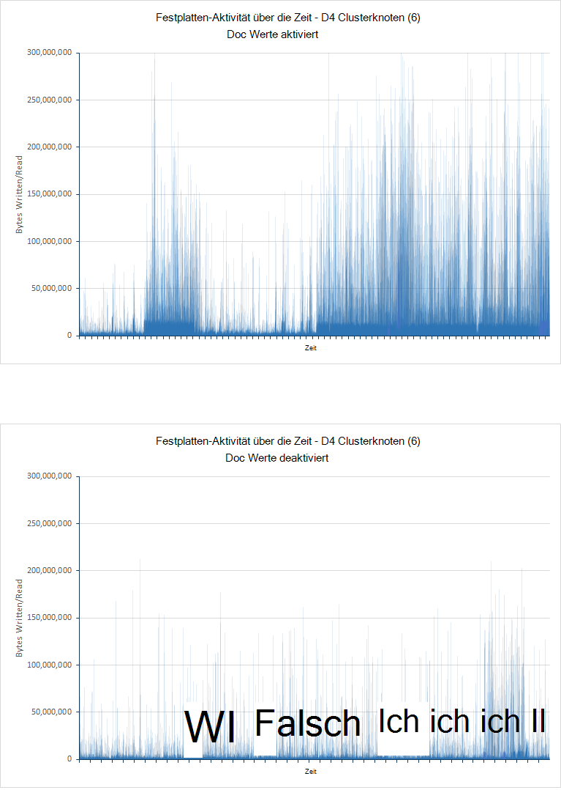

***Datenträger für den Cluster D4 mit Doc aktiviert und deaktiviert***

Dagegen anzeigen Einnahme Werte für die VMs mit SSDs vergrößert sich die Anzahl der Dokumente, sondern Zunahme die Reaktionszeit der Einnahme Vorgänge Ein oder zwei kleine Ausnahmen wurden die Antwortzeiten schlimmer. SSDs sind weniger wahrscheinlich mit an ihre Grenzen IOPS mit Doc aktiviert, so ändert Leistung durch eher Aktivität und den Aufwand steigen für die Verwaltung des JVM Heaps verarbeitet. Dies fällt durch Vergleich der CPU-Auslastung mit Doc Werten aktiviert und deaktiviert. Das folgende Diagramm zeigt diese Daten für den Cluster DS4, wo die meisten CPU-Auslastung verschiebt Band 30-40 % Doc Werte aktiviert, 40-50 % Band mit Doc deaktiviert (DS14 Cluster zeigte sich ähnlich):


***CPU-Auslastung für den DS4 Cluster mit Doc aktiviert und deaktiviert***

Um die Effekte der Doc Werte für Abfrage-Leistung von Daten Einnahme unterscheiden durchgeführt Paare von Abfrage nur Tests für die Cluster DS4 und DS14 mit Doc aktiviert und deaktiviert. In der folgenden Tabelle werden die Ergebnisse dieser Tests zusammengefasst:

| Cluster | Abfrage-Vorgang            | Durchschnittliche Antwortzeit (ms) - Doc Werte aktiviert | Durchschnittliche Antwortzeit (ms) - Doc Werte deaktiviert | % Differenz Reaktionszeit |
|---------|----------------------------|-------------------------------------------------|--------------------------------------------------|-------------------------------|
| DS4     | Anzahl nach Bewertung            | 4489                                            | 3736                                             | -16 %                          |
|         | Über Zählzeit            | 7293                                            | 5459                                             | -25 %                          |
|         | Zugriffe nach Land            | 7564                                            | 5930                                             | -22 %                          |
|         | Top 15 Organisationen       | 5066                                            | 3874                                             | -14 %                          |
|         | Anzahl der eindeutigen Organisationen | 5231                                            | 4483                                             | -2 %.                           |
|         | Eindeutige IP-Anzahl            | 9228                                            | 9474                                             | 3 %                           |
|         | Gesamtanzahl der Treffer zählen           | 2180                                            | 1218                                             | -44 %                          |
||||||
| DS14    | Anzahl nach Bewertung            | 1927                                            | 2144                                             | + 11 %                          |
|         | Über Zählzeit            | 4483                                            | 4337                                             | -3 %                           |
|         | Zugriffe nach Land            | 4761                                            | 4840                                             | + 2 %                           |
|         | Top 15 Organisationen       | 2117                                            | 2302                                             | + 9 %                           |
|         | Anzahl der eindeutigen Organisationen | 2393                                            | 2497                                             | + 4 %                           |
|         | Eindeutige IP-Anzahl            | 7159                                            | 7639                                             | + 7 %                           |
|         | Gesamtanzahl der Treffer zählen           | 642                                             | 633                                              | -%1                           |

Beachten Sie, dass ab Elasticsearch 2.0 Dokument standardmäßig aktiviert sind. Bei den Tests für den Cluster DS4 scheint deaktivieren Doc Werte insgesamt positiv während umgekehrt für DS14 Cluster sind (zwei Fällen Leistung besser mit Doc deaktiviert ist sehr gering).

Für den Cluster DS4 war CPU-Auslastung in beiden Fällen nahezu 100 % für die Dauer der beiden Tests, dass Cluster CPU-gebunden war. Verringert die Anzahl der verarbeiteten Abfragen, aus 7369, 5894 (20 %). Beachten Sie, dass Doc Werte deaktiviert Elasticsearch dynamisch Fielddata im Speicher generiert und diese CPU-Leistung nutzt. Diese Konfiguration reduziert die Rate der Festplatte jedoch höhere Belastung CPUs bereits nahe maximale Funktionalität, in diesem Fall werden Abfragen schneller mit Dokument deaktiviert, aber es gibt weniger.

DS14 Tests mit und ohne Doc CPU wurde Aktivität hoch, aber nicht 100 %. Die Anzahl der Abfragen durchgeführt wurde geringfügig (ca. 4 %) Tests mit Doc aktiviert:

| Cluster | Abfrage                      | Anzahl durchgeführt - Doc Werte aktiviert | Anzahl durchgeführt - Werte Doc deaktiviert |
|---------|----------------------------|---------------------------------------|----------------------------------------|
| DS4     | Anzahl nach Bewertung            | 1054                                  | 845                                    |
|         | Über Zählzeit            | 1054                                  | 844                                    |
|         | Zugriffe nach Land            | 1053                                  | 842                                    |
|         | Top 15 Organisationen       | 1055                                  | 846                                    |
|         | Anzahl der eindeutigen Organisationen | 1051                                  | 839                                    |
|         | Eindeutige IP-Anzahl            | 1051                                  | 839                                    |
|         | Gesamtanzahl der Treffer zählen           | 1051                                  | 839  
|||||                                  |
| DS14    | Anzahl nach Bewertung            | 1772                                  | 1842                                   |
|         | Über Zählzeit            | 1772                                  | 1839                                   |
|         | Zugriffe nach Land            | 1770                                  | 1838                                   |
|         | Top 15 Organisationen       | 1773                                  | 1842                                   |
|         | Anzahl der eindeutigen Organisationen | 1769                                  | 1837                                   |
|         | Eindeutige IP-Anzahl            | 1768                                  | 1837                                   |
|         | Gesamtanzahl der Treffer zählen           | 1769                                  | 1837                                   |

## <a name="performance-results---shard-request-cache"></a>Ergebnisse - Splitter Anforderung cache

Demonstrieren Auswirkungen Leistung durch Zwischenspeichern Indexdaten im Arbeitsspeicher der einzelnen Knoten wurde *Abfrage- und Aufnahme* -Test auf eine DS4 und ein DS14 6-Knoten-Cluster mit Index Zwischenspeichern aktiviert - Abschnitt [Splitter Anforderung Cache verwenden](#using-the-shard-request-cache) Weitere Informationen. Die Ergebnisse wurden auf die frühere Tests mit demselben Index jedoch mit Index caching deaktiviert verglichen. In der folgenden Tabelle werden die Ergebnisse zusammengefasst. Beachten Sie, dass die Daten auf nur die ersten 90 Minuten des Tests eingeschränkt wurde, vergleichende Trend war offensichtlich weiterhin den Test würde wahrscheinlich haben nicht zurückgegeben zusätzliche Hinweise:

| Cluster | Abfrage-Vorgang            | Durchschnittliche Antwortzeit (ms) - Indexcache deaktiviert. | Durchschnittliche Antwortzeit (ms) - Indexcache aktiviert | % Differenz Reaktionszeit |
|---------|----------------------------|---------------------------------------------------|--------------------------------------------------|-------------------------------|
| DS4     | Aufnahme                  | 504                                               | 3260                                             | + 547 %                         |
|         | Anzahl nach Bewertung            | 218                                               | 273                                              | + 25 %                          |
|         | Über Zählzeit            | 450                                               | 314                                              | -30 %                          |
|         | Zugriffe nach Land            | 447                                               | 397                                              | -11 %                          |
|         | Top 15 Organisationen       | 342                                               | 317                                              | -7 %                           |
|         | Anzahl der eindeutigen Organisationen | 370                                               | 324                                              | -12 %%                         |
|         | Eindeutige IP-Anzahl            | 760                                               | 355                                              | -53 %                          |
|         | Gesamtanzahl der Treffer zählen           | 258                                               | 291                                              | + 12 %                          |
||||||
| DS14    | Aufnahme                  | 503                                               | 3365                                             | + 569 %                         |
|         | Anzahl nach Bewertung            | 234                                               | 262                                              | + 12 %                          |
|         | Über Zählzeit            | 357                                               | 298                                              | -17 %                          |
|         | Zugriffe nach Land            | 416                                               | 383                                              | -8 %                           |
|         | Top 15 Organisationen       | 272                                               | 324                                              | -7 %                           |
|         | Anzahl der eindeutigen Organisationen | 330                                               | 321                                              | -3 %                           |
|         | Eindeutige IP-Anzahl            | 674                                               | 352                                              | -48 %                          |
|         | Gesamtanzahl der Treffer zählen           | 227                                               | 292                                              | + 29 %                          |

Diese Daten zeigt zwei Punkte an:

-  Einnahme Datenraten werden stark Index Zwischenspeichern vermindert werden.

-  Index Zwischenspeichern verbessert die Antwortzeit für alle Arten von Abfragen nicht notwendigerweise und nachteilig auf bestimmte aggregierte Vorgänge wie die Anzahl von Bewertung und Gesamtzahl der Treffer Abfragen durchgeführt haben.
 

Um zu verstehen, warum das System dieses Verhalten aufweist, sollten Sie die Anzahl der Abfragen, die in jedem Fall erfolgreich durchgeführt werden, während der Test ausgeführt. Der folgende Tabelle werden diese Daten:

| Cluster | Abfrage-Vorgang            | Operations-Abfragen Count - Indexcache deaktiviert. | Operations-Abfragen Count - Indexcache aktiviert |
|---------|----------------------------|-------------------------------------------------|------------------------------------------------|
| DS4     | Aufnahme                  | 38611                                           | 13232                                          |
|         | Anzahl nach Bewertung            | 524                                             | 18704                                          |
|         | Über Zählzeit            | 523                                             | 18703                                          |
|         | Zugriffe nach Land            | 522                                             | 18702                                          |
|         | Top 15 Organisationen       | 521                                             | 18706                                          |
|         | Anzahl der eindeutigen Organisationen | 521                                             | 18700                                          |
|         | Eindeutige IP-Anzahl            | 521                                             | 18699                                          |
|         | Gesamtanzahl der Treffer zählen           | 521                                             | 18701                                          |
||||                                        |
| DS14    | Aufnahme                  | 38769                                           | 12835                                          |
|         | Anzahl nach Bewertung            | 528                                             | 19239                                          |
|         | Über Zählzeit            | 528                                             | 19239                                          |
|         | Zugriffe nach Land            | 528                                             | 19238                                          |
|         | Top 15 Organisationen       | 527                                             | 19240                                          |
|         | Anzahl der eindeutigen Organisationen | 524                                             | 19234                                          |
|         | Eindeutige IP-Anzahl            | 524                                             | 19234                                          |
|         | Gesamtanzahl der Treffer zählen           | 527                                             | 19236                                          |

Sie können sehen, dass zwar die Aufnahme Rate, wenn es aktiviert wurde ca. 1/3 des caching deaktiviert wurde, die Anzahl der ausgeführten Abfragen Faktor 34 erhöht. Abfragen nicht mehr so viel Festplatte entstehen und keinen Ressourcen konkurrieren. Dies spiegelt sich die Diagramme in der folgenden Abbildung, die e/a-Aktivität für alle vier vergleichen:

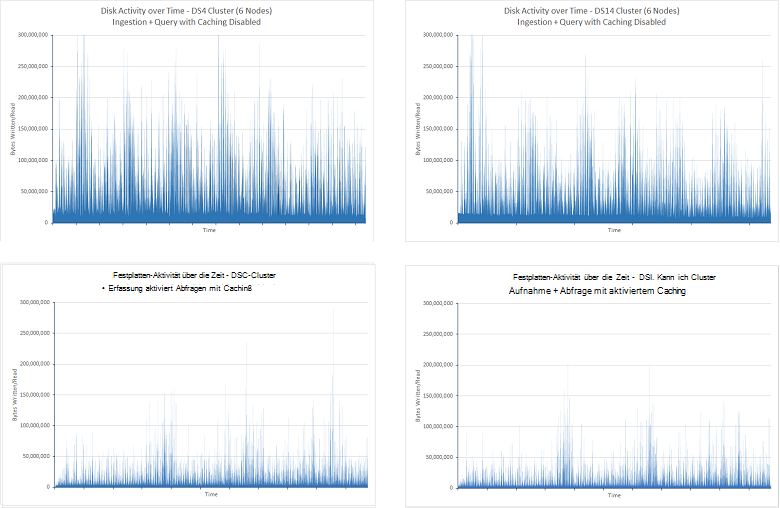

***E/a-Aktivität für die Erfassung und Abfrage mit Index-Cache deaktiviert und aktiviert***

Der Rückgang der Festplatte bedeutet auch, dass die CPU weniger Zeit warten auf e/a abgeschlossen. Dies wird in der nächsten Abbildung hervorgehoben:

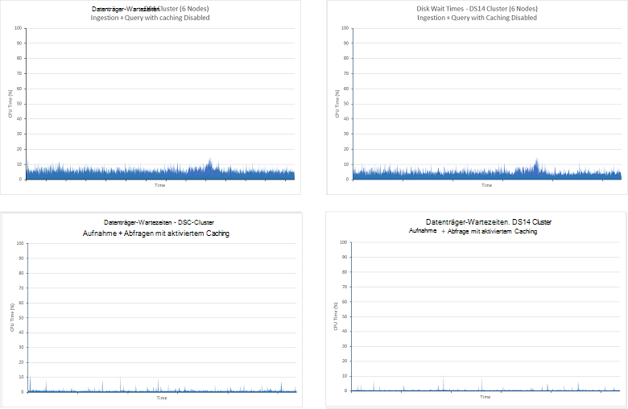

***CPU-Zeit warten auf Festplatte für die Erfassung und Abfrage abgeschlossen mit Index-Cache deaktiviert und aktiviert***

Der Rückgang der Datenträger e/a bedeutet, dass Elasticsearch nehmen viel Anteil der Zeit mit dem Verarbeiten von Abfragen von Daten im Speicher festgehalten. Dies erhöht die CPU-Auslastung deutlich wird, wenn man die CPU-Auslastung für alle vier. Die folgenden Diagramme zeigen wie CPU-Nutzung mit aktiviertem caching mehr bestätigt wurde:

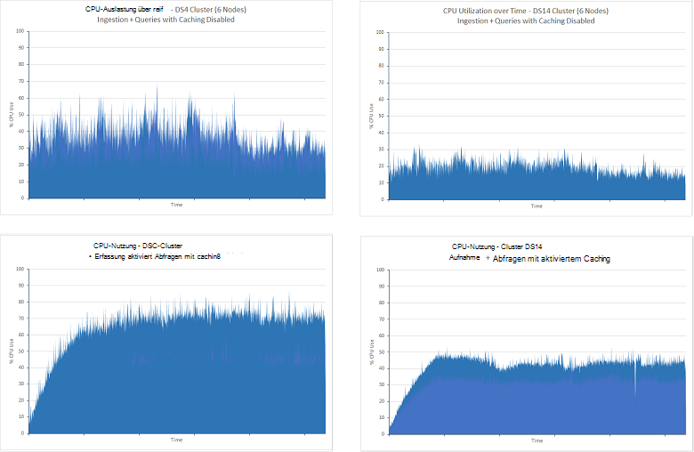

***CPU-Auslastung für Aufnahme und Abfrage testen mit Index-Cache deaktiviert und aktiviert***

Die Lautstärke des Netzwerk-e/a in beiden Szenarien für die Dauer des Tests wurde weitgehend. Die Tests ohne Zwischenspeichern ergab nachlässt während der Testphase die länger rund führt Tests zeigten, dass diese Statistik auf ca. 2.75GBps verlangsamte. Die folgende Abbildung zeigt diese Daten (die Daten für die Cluster DS14 war sehr ähnlich) DS4-Cluster:

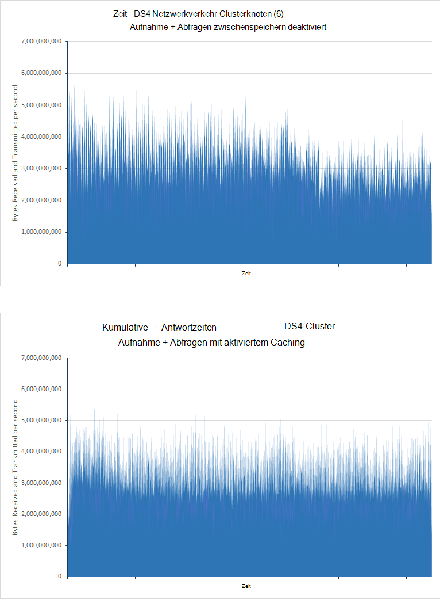

***Netzwerk-Verkehrsaufkommen für die Erfassung und Abfrage mit Index-Cache deaktiviert und aktiviert***

Beschriebenen Test [Skalierung](#performance-results-scaling-up) Einschränkungen auf Netzwerk-Bandbreite mit Azure VMs werden nicht veröffentlicht und können variieren; Mittel Ebenen CPU und Festplatte schlägt vor, dass Netzwerkverkehr der einschränkende Faktor in diesem Szenario möglicherweise

Zwischenspeichern eignet sich besser für Szenarien, in denen Daten selten ändern. Markieren Sie die Auswirkung des Zwischenspeicherns in diesem Szenario die *Abfrage nur* Prüfungen mit aktiviertem caching. Die Ergebnisse sind unten aufgeführt (Tests für 90 Minuten ausgeführt, und die Indizes getesteten enthalten 100 Millionen Dokumente):

| Cluster | Abfrage                      | Durchschnittliche Antwortzeit (ms) | Anzahl der ausgeführten Abfragen |
|---------|----------------------------|----------------------------|-------------------------|
|         |                            | **Cache deaktiviert.**         | **Cache aktiviert**       |
| DS4     | Anzahl nach Bewertung            | 4489                       | 210                     |
|         | Über Zählzeit            | 7292                       | 211                     |
|         | Zugriffe nach Land            | 7564                       | 231                     |
|         | Top 15 Organisationen       | 5066                       | 211                     |
|         | Anzahl der eindeutigen Organisationen | 5231                       | 211                     |
|         | Eindeutige IP-Anzahl            | 9228                       | 218                     |
|         | Gesamtanzahl der Treffer zählen           | 2180                       | 210                     |
|         |                            |                            |                         |
| DS14    | Anzahl nach Bewertung            | 1927                       | 211                     |
|         | Über Zählzeit            | 4483                       | 219                     |
|         | Zugriffe nach Land            | 4761                       | 236                     |
|         | Top 15 Organisationen       | 2117                       | 212                     |
|         | Anzahl der eindeutigen Organisationen | 2393                       | 212                     |
|         | Eindeutige IP-Anzahl            | 7159                       | 220                     |
|         | Gesamtanzahl der Treffer zählen           | 642                        | 211                     |

Die Abweichung der Leistung Vorwärtszugriff Tests ist wegen der verfügbaren Ressourcen zwischen DS4 und DS14 VMs. In beiden Fällen die zwischengespeicherten Tests wurde die durchschnittliche Antwortzeit deutlich gesunken als Daten direkt aus dem Speicher abgerufen. Ist auch erwähnenswert, dass die Reaktionszeiten für zwischengespeicherte DS4 und DS14 Cluster Tests wurden trotz der Ungleichheit mit Vorwärtszugriff Ergebnisse sehr ähnlich. Es steht wenig Unterschiede zwischen die Reaktionszeiten für jede Abfrage innerhalb jeder nehmen sie etwa 220ms. E/a-Raten und CPU-Auslastung für beide Cluster waren niedriger als alle im Speicher Daten auch e/a-Verarbeitung erforderlich ist. Die Netzwerk-e/a-Rate war nicht gespeicherte Tests bestätigt, Netzwerk-Bandbreite ein einschränkender Faktor hierbei möglicherweise ähnlich. Die folgenden Diagramme stellen diese Informationen für den Cluster DS4. Das Profil des Clusters DS14 war:

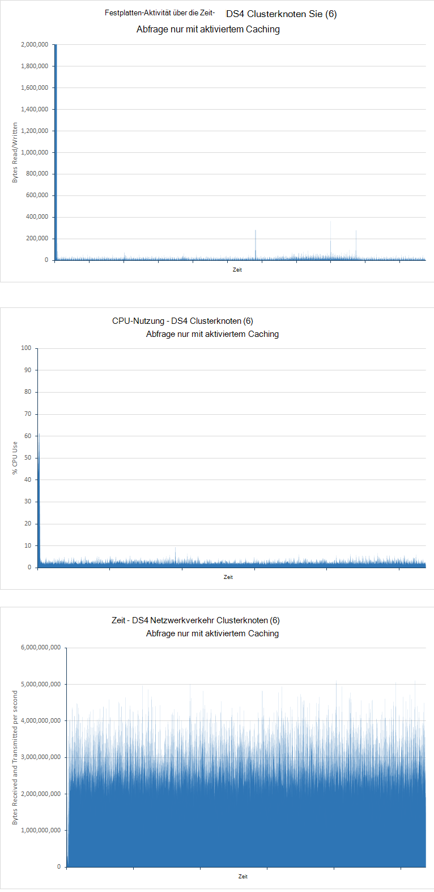

***Festplatte, CPU-Auslastung und Netzwerklast für die Abfrage nur Test mit Index-Cache aktiviert***

Die Zahlen in der Tabelle oben empfehlen die DS14 Architektur wenig Vorteile gegenüber den DS4 zeigt. Tatsächlich generiert DS14 Cluster Beispiele wurden etwa 5 % unter DS4 Cluster, aber möglicherweise auch aufgrund Netzwerk der Zeitverlauf abweichen können.

## <a name="performance-results---number-of-shards"></a>Ergebnisse - Anzahl der Splitter

Diese Prüfung wurde bestimmt, ob die Anzahl der Splitter für einen Index erstellt keinen Einfluss auf die Abfrageperformance für diesen Index verfügt.

Separate gezeigt zuvor, dass die Splitter-Konfiguration des Indexes bei Ingestion Daten auswirken kann. Die Tests durchgeführt Abfrageperformance eine ähnliche Methode, sondern wurden auf 6 Nodes auf DS14 Hardware beschränkt. Dieser Ansatz hilft, die Anzahl der Variablen, Unterschiede in der Leistung aufgrund der Splitter soll.

Die *Abfrage nur* Kopien der selben Index mit 7, 13, 23, 37 und 61 primäre Splitter konfiguriert Test durchgeführt wurde. Index 100 Millionen Dokumente enthalten und ein einzelnes Replikat die Verdopplung der Splitter im Cluster hatte. Jeder Test 90 Minuten ausgeführt. In der folgenden Tabelle werden die Ergebnisse zusammengefasst. Die durchschnittliche Antwortzeit gezeigt die Reaktionszeit für die Buchung der JMeter-Test, die den vollständigen Satz von Abfragen umfasst durch jede Iteration des Tests ausgeführt. Beachten Sie im Abschnitt [Ergebnisse - Skalierung](#performance-results-scaling-up) für Weitere Informationen:

| Anzahl der Splitter          | Splitter-Layout (Splitter pro Knoten einschließlich Replikate) | Anzahl der ausgeführten Abfragen | Durchschnittliche Reaktionszeit (ms) |
|---------------------------|----------------------------------------------------|-----------------------------|------------------------|
| 7 (einschließlich Replikate 14) | 3-2-2-2-2-3                                        | 7461                        | 40524                  |
| 13 (26)                   | 5-4-5-4-4-4                                        | 7369                        | 41055                  |
| 23 (46)                   | 7-8-8-7-8-8                                        | 14193                       | 21283                  |
| 37 (74)                   | 13-12-12-13-12-12                                  | 13399                       | 22506                  |
| 61 (122)                  | 20-21-20-20-21-20                                  | 14743                       | 20445                  |

Diese Ergebnisse zeigen, dass es ein entscheidenden Unterschied Leistung 13(26) Splitter Cluster zu 23,(46) Splitter, Durchsatz fast verdoppelt und Reaktionszeiten halbieren. Dies ist wahrscheinlich der Konfiguration von VMs und die Strukturen, die elasticsearch zu Anfragen verwendet. Suchanfragen in Warteschlange und jede Suchabfrage wird von einem einzigen Suchfeld Thread behandelt. Die Anzahl der Suchthreads erstellt einen Elasticsearch-Knoten ist eine Funktion der Anzahl der Prozessoren auf dem Computer hosten des Knotens verfügbar. Die Ergebnisse zeigen, dass mit nur 4 oder 5 auf einem Knoten, Verarbeitungsressourcen nicht voll genutzt werden. Dies wird anhand der CPU-Auslastung während der Ausführung dieser Tests unterstützt. In der folgenden Abbildung ist eine Momentaufnahme von Marvel beim Ausführen des 13(26) Splitter Tests:

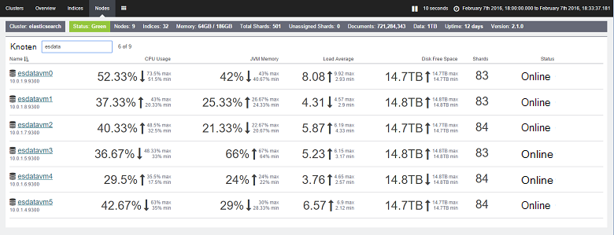

***CPU-Auslastung für den Test nur Abfrage 7(14) Splitter Cluster***

Vergleichen Sie diese Zahlen mit den 23(46) Splitter Test:

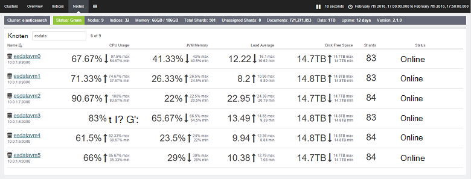

***CPU-Auslastung für den Test nur Abfrage 23(46) Splitter Cluster***

Im Test Splitter 23(46) war CPU-Auslastung deutlich. Jeder Knoten enthält 7 oder 8 Splitter. DS14-Architektur bietet 16 Prozessoren und Elasticsearch ist besser diese Anzahl der Kerne mit der zusätzlichen nutzen. Die Zahlen in der Tabelle oben empfehlen Zahl Splitter über diesen Punkt hinaus verbessert möglicherweise die Leistung geringfügig, jedoch sollte dieser Zahlen anhand der zusätzliche Aufwand für die Verwaltung umfangreicher Splitter versetzt. Diese Tests bedeuten, dass die optimale Anzahl der Splitter pro Knoten die Hälfte der Prozessorkerne auf jedem Knoten. Beachten Sie jedoch, dass diese Ergebnisse wurden beim Ausführen von Abfragen. Wenn Daten importiert, sollten Sie wie Sharding Daten Einnahme Prozesse auswirken kann. 

## <a name="summary"></a>Zusammenfassung

Elasticsearch bietet viele Optionen für das Strukturieren von Indizes und Optimieren sie umfangreiche Abfrageoperationen bieten. Dieses Dokument enthält einige allgemeine Konfigurationen und Techniken, mit denen Sie Ihre Datenbank Abfrage zu zusammengefasst. Allerdings sollten Sie erkennen, dass ein Kompromiss zwischen Optimieren einer Datenbank zum schnellen Abruf im Gegensatz zu Unterstützung großer Datenmengen Aufnahme unterstützen. Manchmal haben gut für Abfragen nachteilig Einfügevorgänge und umgekehrt. In einem gemischten Arbeitslasten ausgesetzt System müssen Sie bewerten die Balance liegt und die Systemparameter entsprechend anpassen.

Darüber hinaus die Anwendbarkeit von Konfigurationen und Verfahren variiert je nach der Struktur der Daten und die Grenzen (oder nicht) der Hardware des Systems auf erstellt. Viele der in diesem Dokument gezeigten Tests zeigen wie die Auswahl der Hardwareplattform Durchsatz auswirken kann und wie Strategien in bestimmten Fällen von Vorteil, aber in anderen abträglich sein können. Zu den verfügbaren Optionen führen Sie strenge benchmarking mit Ihren eigenen Daten bestimmt die optimale Kombination ist wichtig.

Beachten Sie schließlich, dass eine Elasticsearch-Datenbank nicht unbedingt ein statisches Element. Wird wahrscheinlich mit der Zeit wachsen und Strategien zum Strukturieren der Daten müssen regelmäßig überprüft werden. Beispielsweise kann es erforderlich sein, Skalierung, Skalierung oder Daten mit zusätzlichen indizieren. Mit zunehmender System an Größe und Komplexität werden Sie ständig testen Leistung um sicherzustellen, dass Sie noch SLAs sichergestellt, dass Ihre Kunden treffen.

## <a name="appendix-the-query-and-aggregation-performance-test"></a>Anhang: Abfrage und Aggregation Leistungstest

Dieser Anhang beschreibt Leistungstest Elasticsearch Cluster ausgeführt. Die Tests wurden mit JMeter auf separaten virtuellen Computer ausgeführt. Details die Konfiguration der Umgebung werden für [eine Umgebung für Elasticsearch auf Azure-Leistungstests](guidance-elasticsearch-creating-performance-testing-environment.md). Ausführen Ihrer eigenen Tests eigene manuell nach der Anleitung in diesem Anhang JMeter Testplan erstellen oder die automatisierten Testskripts können separat verwenden. Weitere Informationen finden Sie unter [Ausführen automatisierter Elasticsearch Webleistungstests](guidance-elasticsearch-running-automated-performance-tests.md).

Der Abfrage-Systemlast durchgeführt mehrere Abfragen bei großen Uploads Dokumente gleichzeitig beschrieben. Diese Arbeitslast diente einer simuliert, in dem neue Daten ständig hinzugefügt wird und Suchvorgänge ausgeführt werden. Rufen Sie die neuesten Daten aus Dokumenten, die in den letzten 15 Minuten hinzugefügt wurden die Abfragen strukturiert.

Jedes Dokument in einem einzelnen Index namens *Idx*gespeichert wurde und war Art *Doc*. Die folgende HTTP-Anforderung können Sie um den Index zu erstellen. *Number_of_replicas* und *Number_of_shards* eingestellten Werte unten in vielen Tests unterschiedlich. Darüber hinaus für die Tests, mit denen Fielddata Doc Werte, sondern jede Eigenschaft mit dem Attribut versehen wurde *"Doc_values": falsche*.

**Wichtig**: der Index gelöscht und neu vor jedem Testlauf erstellt wurde. 

``` http
PUT /idx
{  
    "settings" : {
        "number_of_replicas": 1,
        "refresh_interval": "30s",
        "number_of_shards": "5",
        "index.translog.durability": "async"    
    },
    "doc": {
        "mappings": {
            "event": {
                "_all": {
                    "enabled": false
                },
                "_timestamp": {
                    "enabled": true,
                    "store": true,
                    "format": "date_time"
                },
                "properties": {
                    "Organization": {
                        "type": "string",
                        "index": "not_analyzed"
                    },
                    "CustomField1": {
                        "type": "string",
                        "index": "not_analyzed"
                    },
                    "CustomField2": {
                        "type": "string",
                        "index": "not_analyzed"
                    },
                    "CustomField3": {
                        "type": "string",
                        "index": "not_analyzed"
                    },
                    "CustomField4": {
                        "type": "string",
                        "index": "not_analyzed"
                    },
                    "CustomField5": {
                        "type": "string",
                        "index": "not_analyzed"
                    },
                    "DateTimeReceivedUtc": {
                        "type": "date",
                        "format": "dateOptionalTime"
                    },
                    "Host": {
                        "type": "string",
                        "index": "not_analyzed"
                    },
                    "HttpMethod": {
                        "type": "string",
                        "index": "not_analyzed"
                    },
                    "HttpReferrer": {
                        "type": "string",
                        "index": "not_analyzed"
                    },
                    "HttpRequest": {
                        "type": "string",
                        "index": "not_analyzed"
                    },
                    "HttpUserAgent": {
                        "type": "string",
                        "index": "not_analyzed"
                    },
                    "HttpVersion": {
                        "type": "string",
                        "index": "not_analyzed"
                    },
                    "OrganizationName": {
                        "type": "string",
                        "index": "not_analyzed"
                    },
                    "SourceIp": {
                        "type": "ip"
                    },
                    "SourceIpAreaCode": {
                        "type": "long"
                    },
                    "SourceIpAsnNr": {
                        "type": "string",
                        "index": "not_analyzed"
                    },
                    "SourceIpBase10": {
                        "type": "long"
                    },
                    "SourceIpCity": {
                        "type": "string",
                        "index": "not_analyzed"
                    },
                    "SourceIpCountryCode": {
                        "type": "string",
                        "index": "not_analyzed"
                    },
                    "SourceIpLatitude": {
                        "type": "double"
                    },
                    "SourceIpLongitude": {
                        "type": "double"
                    },
                    "SourceIpMetroCode": {
                        "type": "long"
                    },
                    "SourceIpPostalCode": {
                        "type": "string",
                        "index": "not_analyzed"
                    },
                    "SourceIpRegion": {
                        "type": "string",
                        "index": "not_analyzed"
                    },
                    "SourceLatLong": {
                        "type": "geo_point",
                        "doc_values": true,
                        "lat_lon": true,
                        "geohash": true
                    },
                    "SourcePort": {
                        "type": "string",
                        "index": "not_analyzed"
                    },
                    "SourcedFrom": {
                        "type": "string",
                        "index": "not_analyzed"
                    },
                    "TargetIp": {
                        "type": "ip"
                    },
                    "TargetPort": {
                        "type": "string",
                        "index": "not_analyzed"
                    },
                    "Rating": {
                        "type": "string",
                        "index": "not_analyzed"
                    },
                    "UseHumanReadableDateTimes": {
                        "type": "boolean"
                    }
                }
            }
        }
    }
}
```

Die folgenden Abfragen wurden vom Test durchgeführt:
* Wie viele Dokumente mit jeder Wert in den letzten 15 Minuten eingegeben haben?

  ```http
  GET /idx/doc/_search
  {
    "query": {
      "bool": {
        "must": [
          {
            "range": {
              "DateTimeReceivedUtc": {
                "gte": "now-15m",
                "lte": "now"
              }
            }
          }
        ],
        "must_not": [],
        "should": []
      }
    },
    "from": 0,
    "size": 0,
    "aggs": {
      "2": {
        "terms": {
          "field": "Rating",
          "size": 5,
          "order": {
            "_count": "desc"
          }
        }
      }
    }
  }
  ```

* Wie viele Dokumente in jeder 5 Minuten während der letzten 15 Minuten hinzugefügt wurden?

  ```http
  GET /idx/doc/_search
  {
    "query": {
      "bool": {
        "must": [
          {
            "range": {
              "DateTimeReceivedUtc": {
                "gte": "now-15m",
                "lte": "now"
              }
            }
          }
        ],
        "must_not": [],
        "should": []
      }
    },
    "from": 0,
    "size": 0,
    "sort": [],
    "aggs": {
      "2": {
        "date_histogram": {
          "field": "DateTimeReceivedUtc",
          "interval": "5m",
          "time_zone": "America/Los_Angeles",
          "min_doc_count": 1,
          "extended_bounds": {
            "min": "now-15m",
            "max": "now"
          }
        }
      }
    }
  }
  ```

* Wie viele Dokumente jeder Wert für jedes Land in den letzten 15 Minuten hinzugefügt wurden?

  ```HTTP
  GET /idx/doc/_search
  {
    "query": {
      "filtered": {
        "query": {
          "query_string": {
            "query": "*",
            "analyze_wildcard": true
          }
        },
        "filter": {
          "bool": {
            "must": [
              {
                "query": {
                  "query_string": {
                    "query": "*",
                    "analyze_wildcard": true
                  }
                }
              },
              {
                "range": {
                  "DateTimeReceivedUtc": {
                    "gte": "now-15m",
                    "lte": "now"
                  }
                }
              }
            ],
            "must_not": []
          }
        }
      }
    },
    "size": 0,
    "aggs": {
      "2": {
        "terms": {
          "field": "Rating",
          "size": 5,
          "order": {
            "_count": "desc"
          }
        },
        "aggs": {
          "3": {
            "terms": {
              "field": "SourceIpCountryCode",
              "size": 15,
              "order": {
                "_count": "desc"
              }
            }
          }
        }
      }
    }
  }
  ```

* Die 15 Organisationen in Dokumenten, die in den letzten 15 Minuten hinzugefügt am häufigsten auftreten?

  ```http
  GET /idx/doc/_search
  {
    "query": {
      "filtered": {
        "query": {
          "query_string": {
            "query": "*",
            "analyze_wildcard": true
          }
        },
        "filter": {
          "bool": {
            "must": [
              {
                "query": {
                  "query_string": {
                    "query": "*",
                    "analyze_wildcard": true
                  }
                }
              },
              {
                "range": {
                  "DateTimeReceivedUtc": {
                    "gte": "now-15m",
                    "lte": "now"
                  }
                }
              }
            ],
            "must_not": []
          }
        }
      }
    },
    "size": 0,
    "aggs": {
      "2": {
        "terms": {
          "field": "Organization",
          "size": 15,
          "order": {
            "_count": "desc"
          }
        }
      }
    }
  }
  ```

* Wie viele andere Unternehmen in Dokumenten, die in den letzten 15 Minuten hinzugefügt auftreten?

  ```http
  GET /idx/doc/_search
  {
    "query": {
      "filtered": {
        "query": {
          "query_string": {
            "query": "*",
            "analyze_wildcard": true
          }
        },
        "filter": {
          "bool": {
            "must": [
              {
                "query": {
                  "query_string": {
                    "query": "*",
                    "analyze_wildcard": true
                  }
                }
              },
              {
                "range": {
                  "DateTimeReceivedUtc": {
                    "gte": "now-15m",
                    "lte": "now"
                  }
                }
              }
            ],
            "must_not": []
          }
        }
      }
    },
    "size": 0,
    "aggs": {
      "2": {
        "cardinality": {
          "field": "Organization"
        }
      }
    }
  }
  ```

* Wie viele Dokumente wurden in den letzten 15 Minuten hinzugefügt?

  ```http
  GET /idx/doc/_search
  {
    "query": {
      "filtered": {
        "query": {
          "query_string": {
            "query": "*",
            "analyze_wildcard": true
          }
        },
        "filter": {
          "bool": {
            "must": [
              {
                "query": {
                  "query_string": {
                    "analyze_wildcard": true,
                    "query": "*"
                  }
                }
              },
              {
                "range": {
                  "DateTimeReceivedUtc": {
                    "gte": "now-15m",
                    "lte": "now"
                  }
                }
              }
            ],
            "must_not": []
          }
        }
      }
    },
    "size": 0,
    "aggs": {}
  }
  ```

* Wie viele verschiedene SourceIp in Dokumenten, die in den letzten 15 Minuten hinzugefügt auftreten?

  ```http
  GET /idx/doc/_search
  {
    "query": {
      "filtered": {
        "query": {
          "query_string": {
            "query": "*",
            "analyze_wildcard": true
          }
        },
        "filter": {
          "bool": {
            "must": [
              {
                "query": {
                  "query_string": {
                    "query": "*",
                    "analyze_wildcard": true
                  }
                }
              },
              {
                "range": {
                  "DateTimeReceivedUtc": {
                    "gte": "now-15m",
                    "lte": "now"
                  }
                }
              }
            ],
            "must_not": []
          }
        }
      }
    },
    "size": 0,
    "aggs": {
      "2": {
        "cardinality": {
          "field": "SourceIp"
        }
      }
    }
  }
  ```
