<properties
   pageTitle="Optimierung Einnahme Datenverarbeitung für Elasticsearch auf Azure | Microsoft Azure"
   description="Wie Daten Einnahme Leistung mit Elasticsearch auf Azure zu maximieren."
   services=""
   documentationCenter="na"
   authors="dragon119"
   manager="bennage"
   editor=""
   tags=""/>

<tags
   ms.service="guidance"
   ms.devlang="na"
   ms.topic="article"
   ms.tgt_pltfrm="na"
   ms.workload="na"
   ms.date="09/22/2016"
   ms.author="masashin"/>

# <a name="tuning-data-ingestion-performance-for-elasticsearch-on-azure"></a>Optimieren der Leistung von Daten Einnahme für Elasticsearch auf Azure

[AZURE.INCLUDE [pnp-header](../../includes/guidance-pnp-header-include.md)]

Dieser Artikel ist [Teil einer Serie](guidance-elasticsearch.md). 

## <a name="overview"></a>Übersicht

Ein wichtiger Aspekt beim Erstellen jeder Datenbank am besten das System durchsuchbare Daten schnell und effizient Aufnahme Struktur bestimmen. Um dieses Aspekte betreffen nicht nur die Auswahl der Infrastruktur auf dem System implementieren, sondern auch verschiedene Optimierungen, die Sie verwenden können, um sicherzustellen, dass das System mit den erwarteten Daten Zustrom halten kann. 

Dieses Dokument beschreibt die Bereitstellung und Konfiguration Optionen, die Sie für die Implementierung eines Elasticsearch Clusters, der einen hohen Anteil an Daten Einnahme erwartet berücksichtigen sollten. Um feste Daten zur Veranschaulichung, zeigt dieses Dokument die Ergebnisse verschiedener Konfigurationen mit einer einfachen großer Datenmengen Einnahme Arbeitslast Benchmarking. Die Details der Arbeitslast werden im [Anhang](#appendix-the-bulk-load-data-ingestion-performance-test) am Ende dieses Dokuments beschrieben.

Der Zweck der Benchmarks war absolute Kennzahlen für Elasticsearch ausgeführt wird oder sogar auf eine bestimmte Topologie empfohlen, sondern Methoden veranschaulicht, die für die Bewertung, Datenknoten anpassen und Implementieren von Clustern, die eigene Leistung Anforderungen verwenden können. 

Anpassen Ihrer eigenen Systeme wird Leistung gründlich auf eigene Arbeitslasten getestet. Sammeln Sie Telemetrie, die Informationen über die optimale Hardwarekonfiguration verwenden kann und die horizontalen Skalierungsfaktoren, die Sie beachten sollten. Insbesondere sollten Sie:

- Sollten Sie die Größe der Nutzlast gesendet und nicht nur die Anzahl der Elemente in jeder Anforderung Bulk Insert. Eine kleinere Anzahl großer Massenelemente in jeder Anforderung möglicherweise mehr als eine größere Anzahl je nach Ressource für jeden Vorgang optimal.

Überwachen Sie die Effekte verschiedener Bulk Insert Anforderung mit [Marvel](https://www.elastic.co/products/marvel), mit *Readbytes*/*Writebytes* e/a-Leistungsindikatoren mit [JMeter](https://jmeter.apache.org/)und Betriebssystem-tools wie *Iostat* und *Vmstat* auf Ubuntu. 

- Performance-Tests durchführen und Telemetrie Maß CPU-Verarbeitung und e/a-Wartezeiten Datenträgerlatenz, Durchsatz und Antwortzeiten sammeln. Diese Informationen helfen, potenzielle Engpässe erkennen und bewerten Sie die Kosten und Vorteile von Premium-Speicher. Bedenken Sie Auslastung von CPU und Festplatte auch auf allen Knoten je nach möglicherweise nicht Splitter und Replikate auf Cluster verteilt sind (einige Knoten können mehr Splitter als andere enthalten).

- Prüfen Sie, wie die Anzahl gleichzeitiger für Ihre Arbeitslast im Cluster verteilt werden und Auswirkungen auf unterschiedliche Knoten um diese Arbeitslast zu bewältigen.

- Berücksichtigen wie Arbeitslasten wachsen können das Unternehmen erweitert wird. Auswirkungen dieses Wachstums auf Kosten der VMs und Speicherung von Knoten verwendet.

- Erkennen Sie, dass eine größere Anzahl von Knoten mit regulären Datenträger eines Clusters mit möglicherweise günstiger Szenario erfordert eine hohe Anzahl von Anfragen und die Datenträger-Infrastruktur verwaltet Durchsatz, die Ihre Service Level Agreements (SLAS) erfüllt. Erhöhen der Anzahl von Knoten kann jedoch Overhead in Form von zusätzlichen zwischen Knoten Kommunikation und Synchronisierung führen.

- Verstehen Sie, dass mehr Kerne pro Knoten Verkehrs möglicherweise weitere Datenträger mehr Dokumente verarbeitet werden können. In diesem Fall messen Sie Datenträgerverwendung zu beurteilen, ob das e/a-Subsystem kann ein Engpass und Vorteile von Premium-Speicher.

- Testen und Kompromisse mit einer höheren Anzahl von Knoten mit weniger Kerne im Vergleich zu weniger Knoten mit mehr Kernen analysieren. Denken Sie daran, erhöhen die Anzahl der Replikationen eskaliert die Belastung des Clusters müssen Sie Knoten hinzufügen.

- Beachten Sie, dass mit flüchtigen Festplatten erfordern, dass Indizes häufig wiederhergestellt werden.

- Messen Sie Speicher-Volume Kapazität und Auslastung des Speichers. In diesem Szenario gespeichert wir beispielsweise 1,5 Milliarden Dokumente mithilfe von 350GB Speicher.

- Übertragungsraten für die Auslastung messen und wie nahe Sie sind wahrscheinlich auf das gesamte e/a-Übertragung Ratenlimit für alle angegebenen Speicherkonto in die virtuelle Laufwerke erstellt haben.

## <a name="node-and-index-design"></a>Knoten und Index-design

In einem System, die umfangreiche Daten Aufnahme unterstützen, müssen Fragen Sie die folgenden:

- **Sind die Daten schnell oder relativ statisch?** Je mehr dynamische Daten, desto Wartung für Elasticsearch. Wenn die Daten repliziert werden, wird jedes Replikat synchron beibehalten. Schnell Daten, die nur eine begrenzte Lebensdauer oder einfach wiederhergestellt werden können, profitieren möglicherweise vollständig deaktivieren der Replikation. Diese Option wird im Abschnitt erläutert [Optimierung umfangreiche Datenmengen Einnahme.](#tuning-large-scale-data-ingestion)

- **Benötigen Aktualität die Daten entdeckt suchen, Sie?** Um die Leistung beizubehalten, puffert Elasticsearch Daten im Speicher wie möglich. Dies bedeutet, dass nicht alle Anfragen sofort. Prozess verwendeten Elasticsearch Änderung beibehalten und sichtbar [Machen permanenten Änderungen](https://www.elastic.co/guide/en/elasticsearch/guide/current/translog.html#translog)beschreibt. 

    Die Daten sichtbar unterliegt den *Aktualisieren\_Intervall* des betreffenden Index festlegen. Standardmäßig ist dieses Intervall auf 1 Sekunde festgelegt. Jedoch nicht in jedem Fall aktualisiert dies schnell. Beispielsweise müssen Daten aufzeichnen Indizes zu mit einem schnellen und kontinuierlichen Informationen schnell aufgenommen werden muss, sondern erfordert keine Informationen sofort für Abfragen verfügbar. In diesem Fall sollten Sie die Häufigkeit der Aktualisierung. Dieses Feature wird auch im Abschnitt beschriebenen [Optimierung umfangreiche Datenmengen Einnahme.](#tuning-large-scale-data-ingestion)

- **Wie schnell ist die Daten wachsen?** Index-Kapazität ist abhängig von der Splitter angegeben, wenn der Index erstellt wird. Um Wachstum zu ermöglichen, geben Sie genügend Splitter (Standard ist 5). Wenn der Index in einem einzigen Knoten erstmalig erstellt wird, alle fünf Splitter befinden sich auf diesem Knoten jedoch mit zunehmender Datenmenge zusätzliche Knoten hinzugefügt werden können und verteilen Elasticsearch dynamisch Splitter auf Knoten. Allerdings hat jede Splitter als Aufwand. Alle Suchvorgänge in einem Index fragt alle Splitter, so erstellen eine große Anzahl von Splitter für eine kleine Datenmenge Daten Abfragen langsam ( [Kagillion Splitter](https://www.elastic.co/guide/en/elasticsearch/guide/current/kagillion-shards.html) Szenario vermeiden).

    Einige Arbeitslasten (z. B. Protokollierung) können einen neuen Index jeden Tag erstellen und wenn Sie beobachten, dass die Anzahl der Splitter für die Datenmenge ist, sollten sie vor den Index ändern (vorhandene Indizes werden nicht betroffen). Wenn Sie vorhandene Daten über mehr Splitter verteilen müssen, besteht eine Option die Informationen neu indizieren. Erstellen Sie einen neuen Index mit der entsprechenden Konfiguration und Daten Sie hinein. Dabei kann Clientanwendungen transparent sein mit [Index Aliasen](https://www.elastic.co/guide/en/elasticsearch/reference/current/indices-aliases.html).

- **Müssen die Daten, die zwischen Benutzern in einem mandatenfähiges Szenario partitioniert werden?** Separate Indizes für jeden Benutzer erstellen kann, dies jedoch aufwändig, wenn jeder Benutzer nur eine mittlere Datenmenge. Stattdessen erstellen Sie [freigegebene Indizes](https://www.elastic.co/guide/en/elasticsearch/guide/current/shared-index.html) und direkte Anfragen an Daten pro Benutzer verwenden Sie [Aliasnamen entsprechend filtern](https://www.elastic.co/guide/en/elasticsearch/guide/current/faking-it.html) . Um die Daten für einen Benutzer in der gleichen Splitter zusammenhalten, die Standardkonfiguration routing als Index und Route auf einige identifizierende Attribut des Benutzers basiert.

- **Werden lange oder kurzlebige?** Verwenden Sie eine Reihe von Azure VMs einen Elasticsearch Cluster implementieren, können Sie auf eine lokale Ressource Systemdiskette statt einem angeschlossenen Laufwerk kurzlebige Daten speichern.
Mit VM-SKU, die SSD für die Festplatte verwendet, können e/a-Leistung verbessern. Jedoch alle Informationen auf der Festplatte sind temporär und kann verloren gehen, wenn die VM neu gestartet wird (siehe Abschnitt werden die Daten auf einem temporären Laufwerk werden verloren Verständnis [des temporären Laufwerks auf Microsoft Azure Virtual Machines](http://blogs.msdn.com/b/mast/archive/2013/12/07/understanding-the-temporary-drive-on-windows-azure-virtual-machines.aspx) für weitere Einzelheiten). Möchten Sie Daten zwischen zwei Neustarts beizubehalten, erstellen Sie Datenträger diese Informationen und die VM zuordnen.

- **Wie läuft die Daten?** Azure VHDs unterliegen Drosselung übersteigt die Lese-/Schreibaktivitäten angegebenen Parameter (derzeit 500 Eingabe-/Ausgabeoperationen pro Sekunde (IOPS) für einen Datenträger, eine Standard-Tier-VM und 5000 IO Storage Premium Datenträger zugeordnet). 

    Die Chancen der Drosselung e/a-Leistung erhöhen und erstellen Sie mehrerer Datenträger für jede VM und konfigurieren Sie Elasticsearch Daten-Striping über diese Festplatten Siehe [Datenträger und Anforderungen](guidance-elasticsearch-running-on-azure.md#disk-and-file-system-requirements).

    Wählen Sie eine Hardware-Konfiguration, die minimieren die Anzahl der Festplatte Lesevorgänge sicherstellen, dass genügend Arbeitsspeicher verfügbaren Daten Zwischenspeichern häufig zugegriffen wird. Dies wird im Abschnitt [Speicherbedarf](guidance-elasticsearch-running-on-azure.md#memory-requirements) ausgeführt Elasticsearch Azure beschrieben.

- **Müssen welche Aufgaben jeden Knoten unterstützen?** Elasticsearch profitiert von Speicher zum Zwischenspeichern von Daten in (aus dem Dateisystemcache) verfügbar und JVM Heap gemäß Abschnitt [Speicherbedarf](guidance-elasticsearch-running-on-azure.md#memory-requirements) ausgeführt Elasticsearch in Azure. 

    Die Speichergröße setzen die SKU des virtuellen Computers CPU-Kerne und Menge der verfügbaren Festplatten. Weitere Informationen finden Sie auf der Azure-Website [Preise von virtuellen Maschinen](http://azure.microsoft.com/pricing/details/virtual-machines/) .

### <a name="virtual-machine-options"></a>VM-Optionen

Sie können virtuelle Computer in Azure mit einer Reihe von verschiedenen SKUs bereitstellen. Ein Azure-VM verfügbaren Ressourcen hängen SKU ausgewählt. Lagerhaltungsdaten bietet verschiedene aus Kerne, Arbeitsspeicher und Speicher. Sie müssen eine entsprechende Größe des VM, die erwartete Arbeitslast behandelt jedoch wird auch nachweisen kostengünstige, auswählen.
Beginnen Sie mit einer Konfiguration, die der aktuellen erfüllt werden (Ausführen benchmarking testen, wie weiter unten in diesem Dokument beschrieben). Sie können einen Cluster später skalieren, durch Hinzufügen von mehr VMs Elasticsearch Knoten ausgeführt.

[Größen für virtuelle Computer](../virtual-machines/virtual-machines-linux-sizes.md) auf der Azure-Website dokumentiert die verschiedenen Optionen und SKUs verfügbar für VMs.

Sie sollten vergleichen Größe und Ressourcen für eine VM auf die Rolle, die Knoten auf dem virtuellen Computer ausführen.

Für einen Datenknoten:

- Zuweisen von 30 GB oder 50 % der verfügbaren RAM-Speicher auf dem Java heap, desto niedriger ist. Lassen Sie den Rest des Betriebssystems für das Zwischenspeichern von Dateien. Wenn Sie Linux verwenden, können Sie die Speichergröße auf Java-Heap zugewiesen, mit der ES\_HEAP\_Größe Umgebungsvariable vor dem Ausführen von Elasticsearch. Auch wenn Sie Windows oder Linux verwenden, können Sie festlegen Speichergröße *Xmx* und *Xms* -Parameter beim Starten von Elasticsearch.

    Je nach Arbeitsaufwand weniger große VMs so effektiv wie eine größere Anzahl von mittelgroßen VMs aus Leistungsgründen möglicherweise nicht. Führen Sie Tests, die die Kompromisse zwischen zusätzlichen Netzwerkverkehr und Wartungsaufwand im Vergleich zu den Kosten der verfügbare Anzahl von Prozessorkernen und reduzierte Laufwerkkonflikte auf jedem Knoten messen können.

- Verwenden Sie Premium-Speicher zum Speichern von Elasticsearch Daten. Dies wird ausführlicher im Abschnitt [Optionen](#storage-options) erläutert.

- Verwenden Sie mehrere Festplatten derselben Größe und Streifen Daten auf diesen Festplatten. SKU der VMs bestimmen die maximale Anzahl der Datenträger, den Sie anfügen können. Weitere Informationen finden Sie unter [Datei- und Anforderungen](guidance-elasticsearch-running-on-azure.md#disk-and-file-system-requirements).

- Verwenden Sie eine Multi-Core-CPU SKU mit 2 Kernen, vorzugsweise mindestens 4. 

Für einen Clientknoten:

- Reservieren Festplattenspeicher nicht für Elasticsearch Daten, dedizierte Clients speichern keine Daten auf dem Datenträger.

- Sicherstellen Sie, dass genügend Arbeitsspeicher zur Arbeitslast. BULK Insert Anfragen in den Speicher vor verschiedenen Datenknoten gesendeten Daten gelesen werden, und die Ergebnisse von Aggregationen und Abfragen im Arbeitsspeicher vor dem an die Clientanwendung zurückgegeben. Benchmark-eigene Arbeitslasten und Speicher mit einem Tool wie Marvel oder mit der *Knoten-Statistiken* API zurückgegebenen [JVM Informationen](https://www.elastic.co/guide/en/elasticsearch/guide/current/_monitoring_individual_nodes.html#_jvm_section) überwachen (`GET _nodes/stats`), die optimale Anforderungen.  Insbesondere überwacht der *Heap\_verwendet\_%* metrische für jeden Knoten und Ziel, die Heapgröße unter 75 % des verfügbaren Speicherplatzes.

- Sicherstellen Sie, dass genügend CPU-Kerne empfangen und verarbeiten die erwartete Anzahl von Anfragen.
Die Anfragen werden sie vor der Verarbeitung erhalten und zwischengespeichert werden können Elemente ist von der Anzahl der CPU-Kerne auf jedem Knoten. Sie können die Warteschlangenlängen mit den Daten in den zurückgegebenen Knoten/Stats API mit [Threadpool Informationen](https://www.elastic.co/guide/en/elasticsearch/guide/current/_monitoring_individual_nodes.html#_threadpool_section) überwachen. 

    Wenn *abgelehnt* für eine Warteschlange gibt, Anfragen abgelehnt werden, bedeutet dies, dass der Cluster Engpass. Dies kann durch CPU-Bandbreite jedoch möglicherweise auch andere Faktoren wie Arbeitsspeicher oder e/a-Leistung, so mithilfe dieser Informationen in Verbindung mit anderen Statistiken ermitteln die Ursache.

    Client-Knoten möglicherweise oder ist je nach der Auslastung. Daten Erfassung Arbeitslasten eher nicht mit dedizierten Clients profitieren, während einige Suchvorgänge und Aggregationen schneller ausführen können. Eigene Szenarien vergleichen werden.

    Client-Knoten sind in erster Linie für, Transport-Client-API verwenden, herstellen. Sie können auch Knoten-Client-API dynamisch erzeugt einen dedizierten Client für die Anwendung die Ressourcen der Anwendung Host-Umgebung. Wenn Ihre Anwendung die Knoten Client-API verwenden, klicken sie für den Cluster vorkonfigurierten dedizierten Client-Knoten enthalten möglicherweise nicht. 
    
    Beachten Sie jedoch, ein Knoten mit der Client-Knoten-API ist eine hochwertige Cluster so Chatter Netzwerk mit anderen Knoten beteiligt. Häufig können starten und Beenden von Clientknoten Lärm im gesamten Cluster erstellen.

Für master-Knoten:

- Reservieren Festplattenspeicher nicht für Elasticsearch Daten, dedizierte master-Knoten speichern keine Daten auf dem Datenträger.

- CPU-Anforderungen sollten minimal sein.

- Speicherbedarf hängt von der Größe des Clusters. Informationen über den Zustand des Clusters wird im Arbeitsspeicher beibehalten. Für kleine Cluster erforderliche Speichermenge ist minimal, aber bei einem großen, stark aktiven Cluster, Indizes erstellt werden häufig und Splitter verschieben, an Informationen wächst erheblich. Überwachen Sie die JVM Heapgröße um festzustellen, ob Sie mehr Speicher hinzufügen möchten.

> [AZURE.NOTE]Cluster Zuverlässigkeit mehrere master-Knoten zu erstellen und Konfigurieren der verbleibenden Knoten die Möglichkeit für einen Split Brain vermeiden. Im Idealfall sollte eine ungerade Anzahl von master-Knoten vorhanden sein. Dieses Thema wird ausführlicher [auf Elasticsearch in Azure konfigurieren Stabilität][]und beschrieben.

### <a name="storage-options"></a>Speicheroptionen

Gibt eine Anzahl von Optionen auf Azure VMs mit anderen Kompromisse auf Kosten, Performance, Verfügbarkeit und Recovery, die Sie berücksichtigen müssen.

Beachten Sie, dass Elasticsearch Daten auf dedizierten Datenträger gespeichert werden soll.  Dadurch werden Konflikte mit dem Betriebssystem zu minimieren und sicherzustellen, dass große Mengen an Elasticsearch e/a nicht mit Betriebssystemfunktionen für e/a-Ressourcen konkurrieren.

Azure sind Leistung Einschränkungen. Wenn Sie feststellen, dass ein Cluster periodische Aktivitätsschübe wird möglicherweise e/a-Anfragen gedrosselt. Um dies zu verhindern, Optimieren Sie Ihren Entwurf die Dokumentgröße Elasticsearch für Abfragen zu jeder Festplatte wahrscheinlich auszugleichen.

Datenträger basierend auf standardmäßigen Speicher unterstützt eine maximale Anforderungsrate 500 IOPS äquivalent zur Premium-Speicher bis zu 5.000 IOPS, je nach Größe der Datenträger funktionieren können. Premium-Datenträger stehen nur für DS und GS-Serie VMs. Maximale Disk IO durch VM-Größe finden Sie [Größen für virtuelle Computer in Azure](../virtual-machines/virtual-machines-linux-sizes.md). VM-Größe mit Größe Zuordnung auf dem Datenträger auf Premium-Speicher bestimmt. Weitere Informationen finden Sie unter [Storage Premium: Hochleistungsspeicher für Azure Virtual Machine Arbeitslasten](../storage/storage-premium-storage.md).

**Permanente Datenträger**

Persistente Daten sind VHDs Azure-Speicher gesichert werden. Wenn die VM nach einem schwerwiegenden Fehlers wiederhergestellt werden muss, können vorhandene Festplatten einfach neue VM zugeordnet werden. Virtuelle Festplatten können basierend auf standardmäßigen Speicher (dreht Media) oder Premium-Speicher (SSDs) erstellt. SSDs verwenden möchten Sie erstellen VMs mit der DS-Serie oder besser. DS-Maschinen Kosten entspricht D-Serie-VMs identisch, aber Sie werden extra berechnet, für Premium-Speicher.

Sollten Sie in Fällen, in denen die maximale Übertragungsrate pro Laufwerk zu erwartete Arbeitslast mehrere Datenträger erstellen und [Daten-Striping über diese Festplatten](guidance-elasticsearch-running-on-azure.md#disk-and-file-system-requirements)Elasticsearch erlauben, oder Systemebene [RAID 0 striping über Laufwerke](../virtual-machines/virtual-machines-linux-configure-raid.md)implementieren.

> [AZURE.NOTE]Microsoft erfahrungsgemäß besonders vorteilhaft für die e/a-Effekte Glätten ist RAID 0 mit *Spitzen* Arbeitslasten, die häufig Aktivitätsschübe generieren.

Mit Premium lokal redundante (oder lokal für redundante preisgünstige oder QA-Arbeitslasten) Speicher für das Speicherkonto mit Festplatten; Replikation über Zonen und Regionen ist nicht erforderlich für hohe Verfügbarkeit Elasticsearch. 

**Temporärer Datenträger**

Permanente Datenträgern basierend auf SSDs erfordert VMs, die Premium-Speicher unterstützen. Dies ist ein Preis. Elasticsearch Daten mit flüchtigen Festplatte kann eine kostengünstige Lösung für mittelgroßen Knoten bis ungefähr 800 GB Speicher benötigen. Der Serie D Standard VMs werden kurzlebige Datenträger implementiert mit SSDs weit größere Leistung und viel geringere Latenz als normale Festplatten

Wenn Sie Elasticsearch verwenden, kann die Leistung äquivalent mit Premium-Speicher ohne Kosten – Siehe Abschnitt [Problemen Datenträgerlatenz Adressierung](#addressing-disk-latency-issues) für Weitere Informationen.

Die Größe der VM beschränkt den Speicherplatz im temporären Speicher unter den Blogbeitrag [Leistungsangaben D-Serie](https://azure.microsoft.com/blog/d-series-performance-expectations/).

Beispielsweise Standard\_D1 VM bietet 50GB flüchtigen Speicher Standard\_D2 VM hat 100GB flüchtigen Speicher und Standard\_D14 VM bietet 800GB temporärer Speicherplatz. Bei Clustern, in denen Knoten nur diese Menge an Speicherplatz benötigen, möglich flüchtigen Speicher mit einer VM D-Serie kostengünstige.

Sie müssen den Durchsatz mit flüchtigen Speicher der Zeit und Kosten bei der Wiederherstellung von Daten nach dem Neustart abwägen. Den Inhalt des temporären Datenträgers gehen verloren, wenn die VM auf einen anderen Server verschoben wird, aktualisiert der Host oder der Host Hardwarefehler aufweist. Wenn die Daten selbst dann dieser Datenverlust tolerable eine begrenzte Lebensdauer haben. Für längere Daten es möglicherweise einen Index oder die fehlende Informationen aus einer Sicherung wiederherstellen. Es ist möglich, die mögliche Datenverluste zu minimieren, indem Replikate vom anderen VMs.

> [AZURE.NOTE]Verwenden einer **einzelnen** VM zu kritischen Daten. Wenn der Knoten ausfällt, alle Daten ist nicht verfügbar. Wichtige Informationen sicherstellen Sie, dass Daten auf mindestens einem Knoten repliziert werden.

**Azure-Dateien**

Der [Azure-Dateidienst](http://blogs.msdn.com/b/windowsazurestorage/archive/2014/05/12/introducing-microsoft-azure-file-service.aspx) Zugriff freigegebene Datei mit Azure-Speicher. Erstellen dann bereitstellen Dateifreigaben auf Azure VMs. Mehrere VMs können die gleichen Dateifreigabe bereitstellen, um dieselben Daten zugreifen.

Aus Leistungsgründen wird nicht empfohlen, verwenden von Dateifreigaben für Elasticsearch Daten, die nicht für mehrere Knoten freigegeben werden reguläre Datenträger eher dazu. Freigaben können zum Erstellen Elasticsearch [Schatten Replikat Indizes](https://www.elastic.co/guide/en/elasticsearch/reference/current/indices-shadow-replicas.html)verwendet werden. Aber dieses Feature ist derzeit und sollte nicht in einer zu diesem Zeitpunkt implementiert werden. Aus diesem Grund Schatten Indizes nicht weiter in diesem Handbuch gelten.

**Netzwerkoptionen**

Azure implementiert freigegebenen Netzwerk ein. VMs mit derselben Hardware Racks für Netzwerk-Ressourcen konkurrieren. Daher Netzwerkbandbreite variieren je nach Tag und wird der tägliches Arbeit auf VMs, die gemeinsame Nutzung der gleichen physischen Netzwerkinfrastruktur. Sie haben wenig Kontrolle über diese Faktoren. Es ist wichtig zu verstehen, dass Netzwerk-Performance wahrscheinlich mit der Zeit schwanken, so die Erwartungshaltung Benutzer entsprechend.

## <a name="scaling-up-nodes-to-support-large-scale-data-ingestion"></a>Knoten umfangreiche Datenmengen Aufnahme unterstützen Skalierung

Elasticsearch Cluster mit relativ mittelmäßiger Hardware erstellen und dann skalieren, oder skalieren, wächst das Datenvolumen und die Anzahl der Anfragen. Azure Sie skalieren auf größere und teurer VMs oder Sie können Dezentrales Skalieren mithilfe zusätzlicher kleiner und billiger VMs. 

Sie können auch eine Kombination aus beiden Strategien ausführen. Gibt es keine Standardlösung für alle Szenarien so zu jeder Situation am besten müssen Sie bereit zu einer Serie Performance tests.

Dieser Abschnitt befasst sich mit der Skalierung, Skalierung im Abschnitt beschriebenen [, Skalierung: Schlussfolgerungen](#scaling-out-conclusions).
Dieser Abschnitt beschreibt die Ergebnisse einer Reihe von Benchmarks gegen Elasticsearch Cluster mit VMs mit unterschiedlichen Größen ausgeführt wurden. Cluster Waren vorgesehen klein, Mittel und groß. In der folgenden Tabelle werden die Mittel für die VMs in jedem Cluster zusammengefasst.

| Cluster | VM-SKU      | Anzahl der Kerne | Anzahl der Datenträger | RAM  |
|---------|-------------|-----------------|----------------------|------|
| Kleine   | Standard D2 | 2               | 4                    | 7GB  |
| Mittel  | Standard D3 | 4               | 8                    | 14GB |
| Große   | Standard D4 | 8               | 16                   | 28GB |

Jeder Elasticsearch Cluster enthalten 3 Datenknoten. Diese Datenknoten behandelt Clientanforderungen sowie Umgang mit Daten. Separate Clientknoten wurden nicht verwendet, da sie wenig Nutzen von Tests verwendete Szenario Einnahme angeboten. Cluster enthalten außerdem drei master-Knoten, von denen Elasticsearch Cluster koordinieren gewählt wurde.

Die Tests wurden mit Elasticsearch 1.7.3 durchgeführt. Die Tests wurden ursprünglich in Clustern mit Ubuntu Linux 14.0.4 und wiederholt mit Windows Server 2012. Die Details der Arbeitslast durchgeführten Tests sind im [Anhang](#appendix-the-bulk-load-data-ingestion-performance-test)beschrieben.

### <a name="data-ingestion-performance--ubuntu-linux-1404"></a>Aufnahme-Performance – Ubuntu Linux 14.0.4

In der folgenden Tabelle werden die Gesamtergebnisse der Ausführung der Tests für zwei Stunden für jede Konfiguration zusammengefasst:

| Konfiguration | Anzahl der Samples | Durchschnittliche Antwortzeit (ms) | Durchsatz (Vorgänge/s) |
|---------------|--------------|----------------------------|---------------------------|
| Kleine         | 67057        | 636                        | 9.3                       |
| Mittel        | 123482       | 692                        | 17.2                      |
| Große         | 197085       | 839                        | 27,4                      |

Durchsatz und Proben verarbeitet sind drei Konfigurationen in das ungefähre Verhältnis 1:2:3. Speicher, CPU-Kernen und Datenträger verfügbaren Ressourcen müssen jedoch Verhältnis 1:2:4. Es war sein Wert niedriger Leistungsdetails der Knoten im Cluster zu beurteilen, warum dies der Fall ist. Diese Informationen helfen festzustellen, ob Grenzwerte zu skalieren und skalieren werden kann. 

### <a name="determining-limiting-factors-network-utilization"></a>Faktoren bestimmen einschränken: Netzwerk-Auslastung

Elasticsearch ist mit genügend Netzwerkbandbreite Zustrom Clientanforderungen sowie die Synchronisationsinformationen Clusterknoten zwischen unterstützt. Wie haben Sie früher steuern die bandbreitenverfügbarkeit eingeschränkte wie Datencenter und aktuelle Netzwerklast anderer virtueller Computer teilen die gleiche Netzwerkinfrastruktur vielen Variablen abhängig. Jedoch lohnt es sich dennoch untersuchen der Netzwerkaktivität für jeden Cluster zu überprüfen, ob der Umfang des Datenverkehrs nicht übermäßig hoch ist. Das Diagramm unten zeigt einen Vergleich von 2 Knoten in jedem Cluster (Volumes für Knoten in jedem Cluster war) eingehenden Netzwerkverkehr.

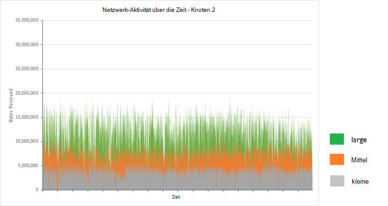

Die durchschnittliche empfangenen Bytes pro Sekunde für Knoten 2 in den einzelnen Cluster über zwei Stunden wurden wie folgt:

| Konfiguration | Durchschnittliche Anzahl Bytes/s |
|---------------|--------------------------------------|
| Kleine         | 3993640.3                            |
| Mittel        | 7311689.9                            |
| Große         | 11893874.2                           |

Die Tests wurden durchgeführt, während das System im **stabilen Zustand**ausgeführt wurde. In Situationen, wo indizieren Ressourcenausgleich oder Knoten Wiederherstellen auftritt, Datenübertragungen zwischen mit primären Knoten und Replikat Splitter können erheblichen Netzwerkverkehr. Die Effekte des Prozesses werden mehr im Dokument [Konfigurieren Stabilität und Wiederherstellung Elasticsearch Azure][]beschrieben.

### <a name="determining-limiting-factors-cpu-utilization"></a>Faktoren bestimmen einschränken: CPU-Auslastung

Die verfügbare Verarbeitungskapazität unterliegt zumindest teilweise Rate mit Anfragen bearbeitet werden. Elasticsearch akzeptiert Bulk Insert Anfragen an das gleichzeitige Warteschlange einfügen. Jeder Knoten verfügt über eine Bulk legen Sie Warteschlangen anhand der Anzahl der verfügbaren Prozessoren. Standardmäßig kann ist eine Warteschlange für jeden Prozessor und jede Warteschlange bis zu 50 ausstehenden bevor sie werden abgelehnt. 

Programme sollten Rate Anfragen, die keine Warteschlangen übergreifen verursachen. Die Anzahl der Elemente in der Warteschlange gleichzeitig wird eine Funktion die mit der Anfragen von Clientanwendungen gesendet werden und die Rate, mit der diese denselben Anforderungen abgerufen und von Elasticsearch verarbeitet. Daher erfasst eine wichtige Statistik Probleme Fehler in der folgenden Tabelle zusammengefasst.

| Konfiguration | Gesamtprobenzahl | Fehleranzahl  | Fehlerrate |
|---------------|---------------|--------------|------------|
| Kleine         | 67057         | 0            | 0,00 %      |
| Mittel        | 123483        | 1            | 0,0008 %    |
| Große         | 200702        | 3617         | 1,8 %      |

Jeder dieser Fehler wurde durch die folgenden Java-Ausnahme verursacht:

```
org.elasticsearch.action.support.replication.TransportShardReplicationOperationAction$PrimaryPhase$1@75a30c1b]; ]
[219]: index [systembase], type [logs], id [AVEAioKb2TRSNcPa_8YG], message [RemoteTransportException[[esdatavm2][inet[/10.0.1.5:9300]][indices:data/write/bulk[s]]]; nested: EsRejectedExecutionException[rejected execution (queue capacity 50)
```

Die Anzahl der Warteschlangen oder die Länge jeder Warteschlange möglicherweise reduziert die Anzahl der Fehler, aber dieser Ansatz nur für kurze Zeit mit stellt. Damit während der Ausführung eine anhaltende Reihe von Daten Einnahme einfach verzögert den Punkt an dem Fehler erstmals auf. Außerdem wird diese Änderung nicht den Durchsatz verbessern und Reaktionszeit von Clientanwendungen wahrscheinlich Schaden, als für mehr Anfragen werden wird vor der Verarbeitung.

Der Index Standardstruktur 5 Splitter mit 1 Replikat (10 Splitter in allen) eine geringfügige Ungleichgewicht zwischen Knoten in einem Cluster zwei Knoten enthalten, während der andere Knoten vier enthält drei Splitter aus. Der größte Knoten ist wahrscheinlich das Element, das Durchsatz, beschränkt sein, deshalb bei jeder dieser Knoten ausgewählt wurde. 

Die folgende Gruppe von Diagrammen erläutern die CPU-Auslastung für den höchsten Auslastung Knoten in jedem Cluster.

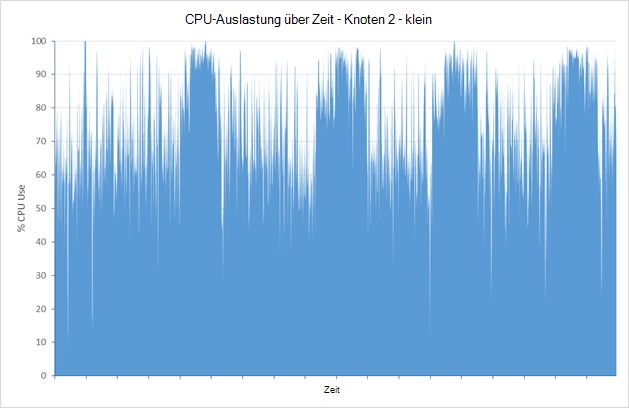

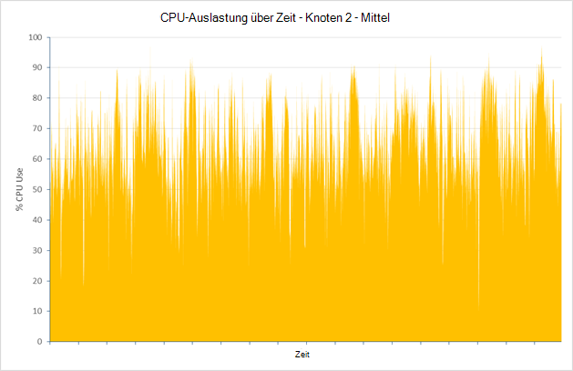

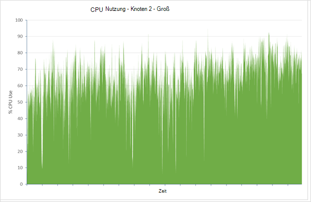

Die durchschnittliche CPU-Auslastung für diesen Knoten wurde für kleine, mittlere und große Cluster, 75.01 % 64.93 % und 64.64 %. Selten ist Auslastung tatsächlich erreicht 100 % und Auslastung fällt der Größe der Knoten und verfügbaren CPU-Leistung verfügbar erhöht. CPU-Leistung ist daher unwahrscheinlich beschränken die Leistung des Clusters groß werden.

### <a name="determining-limiting-factors-memory"></a>Faktoren bestimmen einschränken: Speicher

Speicher ist wichtig, die Leistung beeinflussen können. Für die Tests wurde Elasticsearch 50 % des verfügbaren Arbeitsspeichers reserviert. Diese entspricht [Empfehlung dokumentiert](https://www.elastic.co/guide/en/elasticsearch/guide/current/heap-sizing.html#_give_half_your_memory_to_lucene). Während die Tests ausgeführt wurden, wurde die JVM überschüssige Garbage Collection-Aktivität (Angabe der Mangel Heapspeicher) überwacht. In allen Fällen die Heapgröße blieb und JVM ausgestellt, niedriger Garbage Collection-Aktivität. Das Bildschirmabbild unten zeigt eine Momentaufnahme der Wunder, Schlüssel JVM Statistiken für einen kurzen Zeitraum markieren, während der Test, im großen Cluster ausgeführt wurde.


***JVM Speicher und Garbage Collection-Aktivität auf dem großen Cluster.***

### <a name="determining-limiting-factors-disk-io-rrates"></a>Faktoren bestimmen einschränken: Festplatten-e/a-rRates

Die verbleibenden Merkmal auf der Serverseite, die Performance einschränken kann ist die Leistung von Datenträger-e/a-Subsystem. Das Diagramm unten vergleicht die Datenträgeraktivität in Bytes für die größten Knoten in jedem Cluster geschrieben.

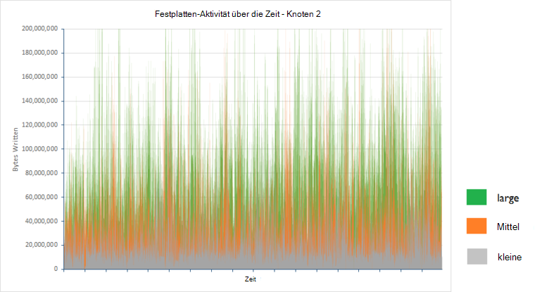 

Die folgende Tabelle zeigt die durchschnittliche Anzahl von Bytes pro Sekunde für Knoten 2 in den einzelnen Cluster über zwei Stunden:

| Konfiguration | Durchschnittliche Anzahl von Bytes geschrieben/s |
|---------------|-------------------------------------|
| Kleine         | 25502361.94                         |
| Mittel        | 48856124.5                          |
| Große         | 88137675.46                         |

Geschriebene Datenmenge steigt mit der Anzahl der Anfragen, die von einem Cluster verarbeitet, aber die e/a-Raten sind im Rahmen der Azure-Speicher (Datenträger erstellt mithilfe von Azure-Speicher unterstützen einen kontinuierlichen Übertragungsraten 10 s-100 s MB/s je nach, ob Standard oder Premium-Speicher). Untersuchen die Zeitspanne gewartet Festplatte können Sie erklären, warum der Datenträgerdurchsatz deutlich unter das theoretische Maximum. Diagramme und Tabelle zeigen diese Statistiken für die gleichen drei Knoten:

> [AZURE.NOTE]Die Datenträger\Zeit gemessen die prozentuale CPU-Zeit während der Prozessoren blockiert werden warten auf e/a-Vorgängen.

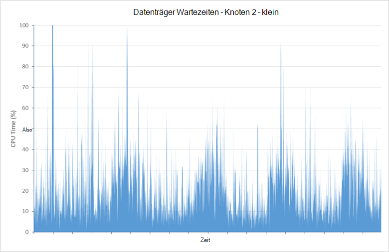

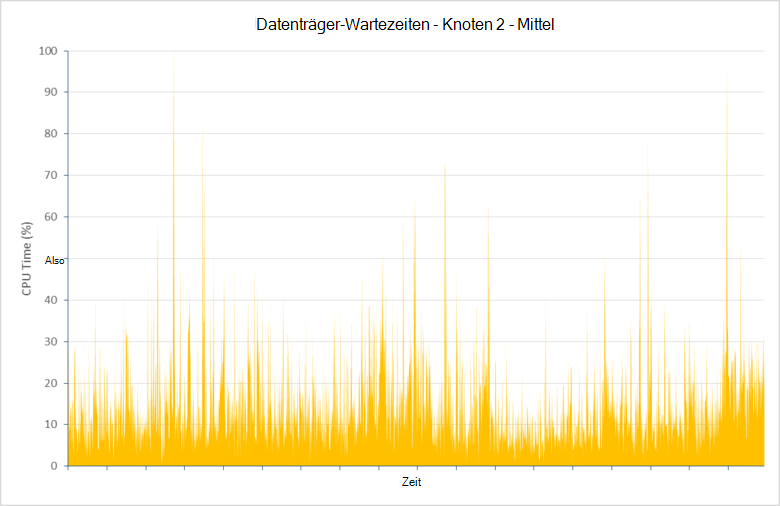

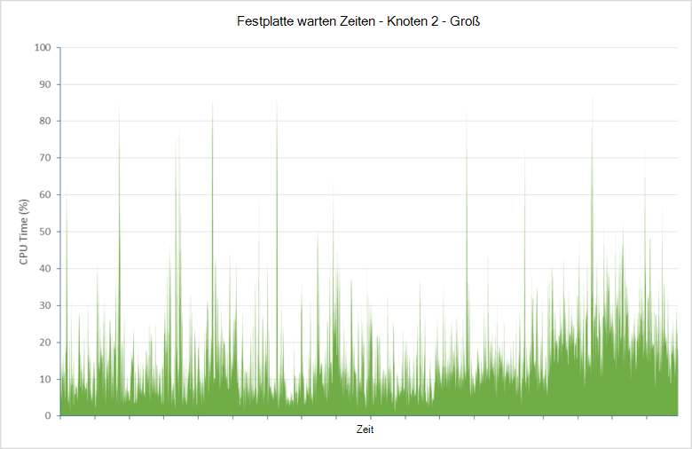

| Konfiguration | Durchschnittliche Wartezeit CPU (%) |
|---------------|--------------------------------|
| Kleine         | 21.04                          |
| Mittel        | 14,48                          |
| Große         | 15.84                          |

Diese Daten gibt an, dass ein Großteil der CPU-Zeit (fast 16 % bis 21 %) Festplatte gewartet wird abgeschlossen. Dies beschränkt die Fähigkeit Elasticsearch Anfragen zu verarbeiten und speichern.

Während des Testlaufs, großen Cluster mehr als **fünf Millionen Dokumente**eingefügt. Ermöglicht den Test weiterhin ergab, dass Wartezeiten erheblich bei die Datenbank über 600 Millionen Dokumente enthalten. Die Gründe hierfür vollständig untersucht, aber durch Disk Fragmentierung verursacht erhöhten Latenz. 

Vergrößern des Clusters über mehrere Knoten hilft, die dieses Problem abzumildern. In extremen Fällen möglicherweise sie einen Datenträger defragmentieren, der übermäßige e/a-Zeit angezeigt wird. Jedoch einen großen Datenträger defragmentieren dauert längere Zeit (möglicherweise mehr als 48 Stunden für eine virtuelle Festplatte Laufwerk 2TB) und einfach formatieren das Laufwerk und ermöglicht Elasticsearch Replikat Splitter die fehlenden Daten Wiederherstellung möglicherweise kostengünstiger Ansatz.

### <a name="addressing-disk-latency-issues"></a>Datenträger-Wartezeit Fragen

Die Tests wurden anfänglich durchgeführt mit VMs mit standard-Festplatten konfiguriert. Eine Standardfestplatte basiert auf Medien dreht und deshalb Rotationslatenz und anderer Engpässe, die e/a-Raten einschränken können. Azure bietet auch Premium Speicher Festplatten mit SSD Medien erstellt werden. Diese Geräte sollte haben keine Rotationslatenz und daher verbesserte e/a-Geschwindigkeit. 

In der folgenden Tabelle vergleicht die Ergebnisse der Premium-Festplatten in großen Cluster standard Laufwerke ersetzen (Standard D4 VMs in großen Cluster mit standardmäßigen DS4 virtueller Computer ersetzt wurden, die Anzahl der Kerne, Arbeitsspeicher und Festplatten war in beiden Fällen der einzige Unterschied, dass die DS4 VMs SSDs verwendet).

| Konfiguration    | Anzahl der Samples | Durchschnittliche Antwortzeit (ms) | Durchsatz (Vorgänge/s) |
|------------------|--------------|----------------------------|---------------------------|
| Große - Standard | 197085       | 839                        | 27,4                      |
| Große - Premium  | 255985       | 581                        | 35,6                      |

Einem Durchschnittsdurchsatz näher 4 Was Reaktionszeiten wurden deutlich besser x, kleine Cluster. Dies ist eher auf Standard DS4-VM Ressourcen. Durchschnittliche CPU-Auslastung auf dem höchsten Auslastung Knoten im Cluster (bei Knoten 1) erhöht, wie es weniger Zeit für e/a abgeschlossen:

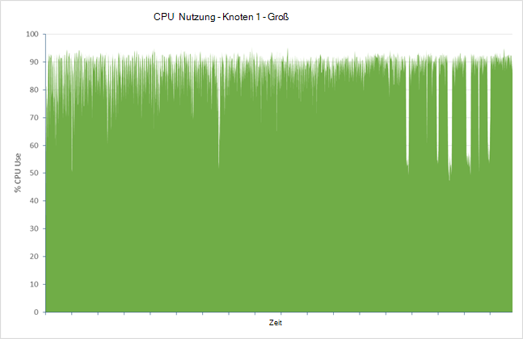

Der Rückgang der Wartezeit Datenträger zeigt bei das folgende Diagramm zeigt, dass für den höchsten Auslastung Knoten diese Statistik rund 1 % im Durchschnitt abgelegt:

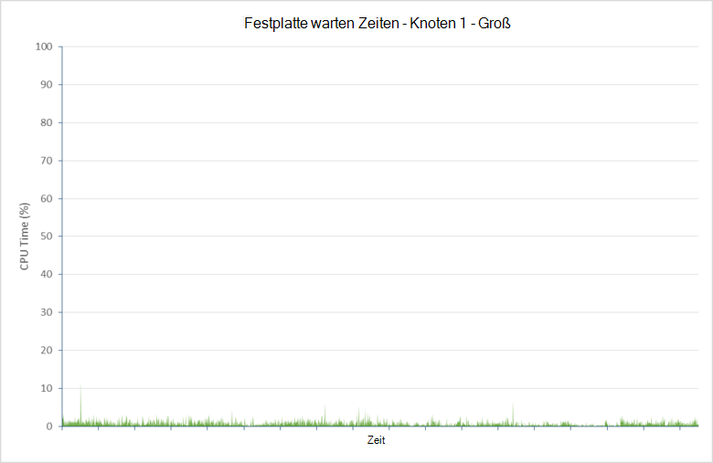

Es wird ein Preis für diese Verbesserung jedoch. Die Anzahl der Einnahme Fehler um den Faktor 10, 35797 (12,3 %). Die meisten dieser Fehler wurden wieder aus der größte einfügen Warteschlange vor. Wird die Hardware jetzt nahe Kapazität ausgeführt, ist es möglicherweise erforderlich, weitere Knoten hinzufügen oder drosseln bei Bulk INSERT Reduzierung von Fehlern. Diese Themen werden weiter unten in diesem Dokument.

### <a name="testing-with-ephemeral-storage"></a>Testen mit flüchtigen Speicher

Dieselben Tests wurden auf einem Cluster D4 VMs mit flüchtigen Speicher wiederholt. Auf D4 VMs ist temporärer Speicher als einzelne 400 GB SSD implementiert. Die Anzahl der Samples verarbeitet, Reaktionszeiten und Durchsatz wurden die Zahlen basierend auf DS14 VMs mit Premium Cluster alle sehr ähnlich.

| Konfiguration                     | Anzahl der Samples | Durchschnittliche Antwortzeit (ms) | Durchsatz (Vorgänge/s) |
|-----------------------------------|--------------|----------------------------|---------------------------|
| Große - Premium                   | 255985       | 581                        | 35,6                      |
| Groß-Standard (temporärer Datenträger) | 255626       | 585                        | 35,5                      |

Fehler war auch ähnliche (33862 Fehler aus 289488 Anfragen insgesamt 11,7 %).

Die folgenden Diagramme zeigen die CPU-Nutzung und Datenträger warten Statistiken für den höchsten Auslastung Knoten im Cluster (Knoten 2 dieser Zeit):

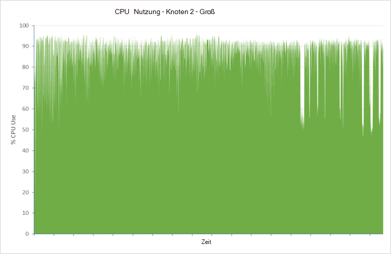

! [] (media/guidance-elasticsearch/data-ingestion-image13.png

In diesem Fall konnte hinsichtlich Leistung allein mit flüchtigen Speicher eine kostengünstigere Lösung als Premium Speicher betrachtet.

### <a name="data-ingestion-performance--windows-server-2012"></a>Aufnahme-Performance – Windows Server 2012

Dieselben Tests wurden mit Elasticsearch Cluster mit Knoten Windows Server 2012 wiederholt. Zweck dieser Tests war, welche Effekte ggf. die Auswahl des Betriebssystems auf Cluster-Performance haben kann.

Zur Veranschaulichung der Skalierbarkeits Elasticsearch unter Windows zeigt die folgende Tabelle die Zeiten Durchsatz und Antwortzeiten für kleine, mittlere und große Cluster-Konfigurationen erzielt. Beachten Sie, dass dieser alle mit Elasticsearch konfiguriert SSD flüchtigen Speicher Tests wurden wie mit Ubuntu Datenträgerlatenz wahrscheinlich ein wichtiger Faktor im Hinblick auf maximale Leistung war:

| Konfiguration | Anzahl der Samples | Durchschnittliche Antwortzeit (ms) | Durchsatz (Vorgänge/s) |
|---------------|--------------|----------------------------|---------------------------|
| Kleine         | 90295        | 476                        | 12,5                      |
| Mittel        | 169243       | 508                        | 23,5                      |
| Große         | 257115       | 613                        | 35,6                      |

Diese Ergebnisse zeigen wie Elasticsearch virtueller Speicher mit verfügbaren Ressourcen auf Windows skaliert.

In den folgenden Tabellen werden die Ergebnisse für große Cluster Ubuntu und Windows:

| Betriebssystem | Anzahl der Samples | Durchschnittliche Antwortzeit (ms) | Durchsatz (Vorgänge/s) | Fehlerrate (%) |
|------------------|--------------|----------------------------|---------------------------|----------------|
| Ubuntu           | 255626       | 585                        | 35,5                      | 11.7           |
| Windows          | 257115       | 613                        | 35,6                      | 7.2            |

Der Durchsatz war entsprechen, die für große Ubuntu-Cluster die Antwortzeit etwas höher. Dies kann durch die unteren Fehlerrate berücksichtigt werden (Fehler werden als erfolgreich gemeldet, haben eine längere Antwortzeiten).

Die CPU-Auslastung vom Windows-Überwachungstools gemeldet wurde geringfügig höher als die von Ubuntu. Allerdings sollten Sie direkte Vergleiche wie diese auf Betriebssystemen mit äußerster Vorsicht aufgrund der unterschiedlichen Betriebssystemen diese Statistiken Bericht behandeln. Darüber hinaus steht zu Datenträgerlatenz in Bezug auf CPU-Wartezeit für e/a nicht auf die gleiche Weise wie bei Ubuntu. Wichtig ist, CPU-Auslastung hoch war, die für e/a-Wartezeit angibt:

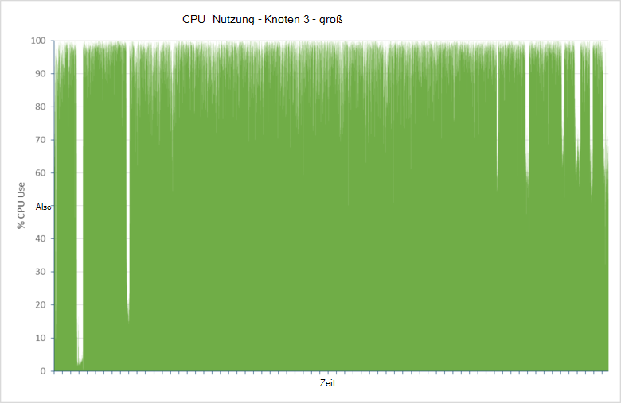

### <a name="scaling-up-conclusions"></a>Skalieren: Schlussfolgerungen

Elasticsearch Leistung für einen optimierten Cluster dürfte Entsprechung unter Windows und Ubuntu und dass es skaliert-in einem ähnlichen Muster für beide Betriebssysteme. Aus Leistungsgründen **Premium Speicher für Elasticsearch Daten**.

## <a name="scaling-out-clusters-to-support-large-scale-data-ingestion"></a>Skalieren von Clustern umfangreiche Datenmengen Aufnahme unterstützen

Dezentrales Skalieren ist der kostenlosen Ansatz für Skalierung untersuchten im vorherigen Abschnitt. Ein wichtiges Feature von Elasticsearch ist das inhärente horizontale Skalierung in die Software integriert. Vergrößern eines Clusters geht einfach weitere Knoten hinzufügen. Sie müssen keine manuellen Operationen zum Verteilen von Indizes oder Splitter als diese Aufgaben werden automatisch behandelt, obwohl stehen eine Reihe von Konfigurationsoptionen, mit dem Sie diesen Prozess beeinflussen. 

Leistungssteigerung Verteilung der Last auf mehrere Maschinen kann weitere Knoten hinzufügen. Weitere Knoten hinzufügen, müssen Sie auch berücksichtigen dies Daten zum Erhöhen der Anzahl der Splitter verfügbar. Teil des Prozesses zu trennen, Erstellen von Indizes, mehr Splitter zunächst Verfügbare Knoten gibt. Wenn weitere Knoten hinzugefügt werden, können der Splitter verteilt.

Neben der horizontalen Skalierung Elasticsearch nutzen, sind andere Gründe für Indizes, mehr Splitter als Knoten. Jeder Splitter wird als separate Datenstruktur (ein [Lucene](https://lucene.apache.org/) Index) implementiert und verfügt über eigene internen Mechanismen für Konsistenz und Behandlung von Parallelität. Erstellen mehrerer Splitter kann Parallelität innerhalb eines Knotens und kann die Leistung verbessern. 

Allerdings der Leistungsfähigkeit Skalierung ist ein Balanceakt. Weitere Knoten und Splitter enthält ein Cluster muss mehr Aufwand Arbeit Durchsatz kann Cluster synchronisieren. Für eine bestimmte Auslastung ist eine optimale Konfiguration, die Aufnahme-Performance bei gleichzeitiger Minimierung der Wartungskosten maximiert. Diese Konfiguration ist die Art der Arbeitslast und Cluster; insbesondere die Datenträger, Größe und Inhalt von Dokumenten, die Geschwindigkeit bei der Aufnahme auftritt und der Hardware auf der System ausgeführt wird.  

Dieser Abschnitt fasst die Ergebnisse der Untersuchung Größe Cluster unterstützen die Arbeitslast von Leistungstests beschrieben verwendet. Der gleiche Test erfolgte in Clustern mit VMs basierend auf große VM Größe (Standard D4 8 CPUs 16 Datenträger und 28GB RAM) Ubuntu Linux 14.0.4, aber mit einer unterschiedlichen Anzahl von Knoten und Splitter konfiguriert. Die Ergebnisse werden nicht als endgültige sie gelten nur für ein bestimmtes Szenario, aber sie können fungieren als Ausgangspunkt zu helfen, die horizontale Skalierung der Cluster analysieren und Zahlen für das optimale Verhältnis Splitter Knoten, die am besten Ihren Bedürfnissen.

### <a name="baseline-results--3-nodes"></a>Basiswerte – 3 Knoten

Zu Baseline Abbildung wurde ein Cluster mit 3 Knoten 1 Replikat mit 5 Splitter Aufnahme-Performance-Test ausführen. Dies ist die Standardkonfiguration für einen Elasticsearch Index. In dieser Konfiguration Elasticsearch 2 primäre Splitter 2 Knoten verteilt und verbleibende primäre Splitter auf dritte Knoten gespeichert. Die folgende Tabelle führt den Durchsatz bei Massenkopieren Erfassung pro Sekunde und die Anzahl der Dokumente, die vom Test erfolgreich gespeichert wurden.

> [AZURE.NOTE] In den Tabellen in diesem Abschnitt wird die Verteilung der primären Splitter als Zahl für jeden Knoten durch Bindestriche getrennt dargestellt. Beispielsweise wird das Layout 5 Splitter 3 Knoten 2 2 1 beschrieben. Das Layout der Splitter Replikat ist nicht enthalten. Sie folgen ein ähnliches Schema zur primären Splitter.

| Konfiguration | Anzahl der Dokumente | Durchsatz (Vorgänge/s)   | Splitter-layout |
|---------------|----------------|-----------------------------|--------------|
| 5 Splitter      | 200560412      | 27,86                       | 2-2-1        |

### <a name="6-node-results"></a>6 Knoten Ergebnisse

Der Test wurde auf einem Cluster mit 6 Knoten wiederholt. Der Zweck dieser Tests wurde zu ermitteln genauer Effekte mehrere Splitter auf einem Knoten gespeichert.

| Konfiguration | Anzahl der Dokumente | Durchsatz (Vorgänge/s)   | Splitter-layout |
|---------------|----------------|-----------------------------|--------------|
| 4 Splitter      | 227360412      | 31,58                       | 1-1-0-1-1-0  |
| 7 Splitter      | 268013252      | 37.22                       | 2-1-1-1-1-1  |
| 10 Splitter     | 258065854      | 35,84                       | 1-2-2-2-1-2  |
| 11 Splitter     | 279788157      | 38.86                       | 2-2-2-1-2-2  |
| 12 Splitter     | 257628504      | 35,78                       | 2-2-2-2-2-2  |
| 13 Splitter     | 300126822      | 41.68                       | 2-2-2-2-2-3  |

Diese Ergebnisse werden die folgenden Trends an:

* Mehr Splitter pro Knoten verbessert Durchsatz. Mit einer kleinen Anzahl Splitter pro Knoten für diese Tests wurde dieses beschriebenen Gründen erwartet.

* Ungerade Splitter bietet eine bessere Leistung als eine gerade Zahl. Die Gründe *hierfür sind weniger löschen möglicherweise Elasticsearch verwendet routing-Algorithmus auf Splitter in diesem Fall die Daten verteilt kann zu noch mehr Last pro Knoten* .

Zum Testen von Hypothesen wurden mehrere weitere Tests mit mehr Splitter durchgeführt. Beratung von Elasticsearch wurde beschlossen, eine Primzahl Splitter wie diese eine angemessene Verteilung der ungeraden Zahlen für den betreffenden Bereich für jeden Test verwenden.

| Konfiguration | Anzahl der Dokumente | Durchsatz (Vorgänge/s)   | Splitter-layout      |
|---------------|----------------|-----------------------------|-------------------|
| 23 Splitter     | 312844185      | 43,45                       | 4-4-4-3-4-4       |
| 31 Splitter     | 309930777      | 43.05                       | 5-5-5-5-6-5       |
| 43 Splitter     | 316357076      | 43,94                       | 8-7-7-7-7-7       |
| 61 Splitter     | 305072556      | 42.37                       | 10-11-10-10-10-10 |
| 91 Splitter     | 291073519      | 40.43                       | 15-15-16-15-15-15 |
| 119 Splitter    | 273596325      | 38.00                       | 20-20-20-20-20-19 |

Diese Ergebnisse empfohlen, ein Wendepunkt bei 23 Splitter erreicht wurde. Danach verursacht Splitter mehr kleine Beeinträchtigung Leistung (Durchsatz für 43 Splitter ist möglicherweise eine Anomalie).

### <a name="9-node-results"></a>9-führt

Die Tests wurden wiederholt ein Cluster von 9 Knoten erneut eine Primzahl Splitter.

| Konfiguration | Anzahl der Dokumente | Durchsatz (Vorgänge/s)   | Splitter-layout               |
|---------------|----------------|-----------------------------|----------------------------|
| 17 Splitter     | 325165364      | 45.16                       | 2-2-2-2-2-2-2-2-1          |
| 19 Splitter     | 331272619      | 46.01.                       | 2-2-2-2-2-2-2-2-3          |
| 29 Splitter     | 349682551      | 48.57                       | 3-3-3-4-3-3-3-4-3          |
| 37 Splitter     | 352764546      | 49,00                       | 4-4-4-4-4-4-4-4-5          |
| 47 Splitter     | 343684074      | 47,73                       | 5-5-5-6-5-5-5-6-5          |
| 89 Splitter     | 336248667      | 46.70                       | 10-10-10-10-10-10-10-10-9  |
| 181 Splitter    | 297919131      | 41,38                       | 20-20-20-20-20-20-20-20-21 |

Diese Ergebnisse ähnlich mit einen Wendepunkt rund 37 Splitter.

### <a name="scaling-out-conclusions"></a>Skalieren: Schlussfolgerungen

Verwendung von rohem Extrapolation angegeben die Ergebnisse der Tests 6 und 9-Knoten, für dieses spezielle Szenario die ideale Anzahl der Splitter Höchstleistung 4n +/-1 war, wobei n die Anzahl der Knoten ist. Diese *kann* sein der Threadanzahl Bulk Insert verfügbar, das ist die Anzahl der CPU-Kerne Begründung wird wie folgt (Details finden Sie unter [Mehrere Dokumente Muster](https://www.elastic.co/guide/en/elasticsearch/guide/current/distrib-multi-doc.html#distrib-multi-doc) ):

- Jede Bulk Insert Anforderung von der Clientanwendung gesendet wird durch einen einzigen Knoten empfangen.

- Der Datenknoten erstellt eine neue Bulk Insert Anforderung für jede primäre Splitter der ursprünglichen Anforderung betroffen und leitet sie an die anderen Knoten gleichzeitig.

- Jede primäre Splitter geschrieben wurde, wird eine weitere Anforderung Replikats, Splitter gesendet. Primäre Splitter wartet die Anforderung des Replikats vor dem Beenden abgeschlossen.

Elasticsearch erstellt einen Masseneinfügungsthread für jede verfügbare CPU-Kern in einer VM. Bei D4 VMs durch diesen Test verwendet jede CPU enthalten 8 Kernen, sodass 8 Masseneinfügungstask Threads erstellt wurden. Der Index erstreckt (in einem Fall 5) 4 primäre Splitter auf jedem Knoten aber auch 4 (5) Replikate auf jedem Knoten. Einfügen von Daten in diese Splitter und Replikate könnte bis zu 8 Threads auf jedem Knoten pro Anforderung entsprechen die Anzahl verfügbarer belegen. Erhöhen oder verringern die Anzahl der Splitter möglicherweise threading Ineffizienz Threads sind möglicherweise leer gelassen oder Anfragen sind. Allerdings ohne weitere Versuche ist nur eine Theorie und kann nicht endgültig sein.

Tests veranschaulicht außerdem ein wichtigen Punkt. In diesem Szenario Erhöhen der Anzahl von Knoten Einnahme Datendurchsatz verbessern kann, aber die Ergebnisse nicht unbedingt skalieren linear. Weitere Tests mit 12 und 15 Knoten durchführen konnte den Punkt zeigen die Skalierung wenig zusätzliche Vorteile bringt. Stellt diese Anzahl Knoten nicht über genügend Speicherplatz, es möglicherweise Maßstab Strategie zurückzukehren und weitere oder größere Festplatten basierend auf Premium-Speicher.

> [AZURE.IMPORTANT] Nehmen Sie Verhältnis 4n +/-1 nicht als Zauberformel, die immer für jeden Cluster funktionieren. Haben Sie weniger oder mehr CPU-Kerne verfügbar, kann die optimale Splitter Konfiguration abweichen. Die Ergebnisse basieren auf einer bestimmten Arbeitslast, die nur Daten Einnahme. Arbeitslasten, die auch aus Abfragen und Aggregationen können die Ergebnisse sehr unterschiedlich sein.

> Daten Erfassung Arbeitslast verwendet darüber hinaus einen einzelnen Index. In vielen Fällen sind die Daten wahrscheinlich mehrere Indizes zu Mustern oder Ressourcen verteilt werden.

> Wichtig dabei ist kennen Methode verwendet statt der Ergebnisse. Sie sollten darauf vorbereitet, Ihre eigenen Skalierbarkeits-Bewertung basierend auf eigene Arbeitslasten Informationen, die für Ihr eigenes Szenario ist.

## <a name="tuning-large-scale-data-ingestion"></a>Umfangreiche Datenmengen Einnahme optimieren

Elasticsearch ist extrem konfigurierbar mit vielen Switches und Einstellungen, mit denen Sie die Leistung für bestimmte Anwendungsfälle und-Szenarien zu optimieren. Dieser Abschnitt beschreibt einige Beispiele. Beachten Sie, dass die Elasticsearch in dieser Hinsicht bietet Flexibilität mit einer Warnung kommt, ist sehr einfach zu detune Elasticsearch Leistung schlechter. Beim optimieren, stellen Sie nur gleichzeitig ändern und Effekte Änderungen um sicherzustellen, dass sie nicht gegen Ihr System messen.

### <a name="optimizing-resources-for-indexing-operations"></a>Optimierung von Ressourcen für Indizierungsvorgänge

Die folgende Liste beschreibt einige Punkte Sie beim sollten Optimieren eines Elasticsearch Clusters umfangreiche Datenmengen Aufnahme unterstützen. Die ersten beiden Elemente sind wahrscheinlich beeinflussen offensichtlich Leistung während der Rest mehr marginalen je nach Arbeitslast sind:

*  Neue Dokumente nur sichtbar für Suchvorgänge aktualisiert der Index Index hinzugefügt. Aktualisieren eines Indexes ist aufwendig, anstatt jedes einzelne Dokument nur in regelmäßigen Abständen ausgeführt wird erstellt. Das Standardaktualisierungsintervall ist 1 Sekunde. Wenn Sie Massenvorgänge durchführen, sollten Sie vorübergehend deaktivieren Index aktualisiert. Festlegen des Index *Aktualisieren\_Intervall* auf-1 fest.

    ```http
    PUT /my_busy_index
    {
        "settings" : {
            "refresh_interval": -1
        }
    }
    ```

    Eine Aktualisierung manuell auslösen, indem Sie mit der [* \_aktualisieren*](https://www.elastic.co/guide/en/elasticsearch/reference/current/indices-refresh.html) API am Ende des Vorgangs die Daten sichtbar. Weitere Informationen finden Sie unter [Bulk Indizierung Verwendung](https://www.elastic.co/guide/en/elasticsearch/reference/current/indices-update-settings.html#bulk) . Weitere Informationen über den [Einfluss der Änderung des Aktualisierungsintervalls auf Daten Einnahme](#the-impact-of-changing-the-index-refresh-interval-on-data-ingestion-performance) werden später beschrieben.

* Repliziert ein Index jeder Indizierungsvorgang (Dokument erstellen, aktualisieren oder löschen) wird wiederholt Replikat Splitter in der primären Splitter an. Deaktivieren Sie Replikation Massenvorgänge importieren und dann aktivieren Sie, wenn der Import abgeschlossen ist:

    ```http
    PUT /my_busy_index
    {
        "settings" : {
            "number_of_replicas": 0
        }
    }
    ```

    Wenn Replikation erneut führt Elasticsearch Byte für Byte netzwerkübertragung von Daten aus dem Index Replikats. Dies ist effizienter als das wiederholte Indizierung Dokument auf jedem Knoten. Besteht die Gefahr, dass Daten der primären Knoten nicht beim Ausführen des Massenimports verloren, aber Wiederherstellung möglicherweise einfach eine Frage der Import erneut starten. Die [Auswirkung der Replikation Daten Einnahme Leistung](#the-impact-of-replicas-on-data-ingestion-performance) wird später ausführlicher beschrieben.

* Elasticsearch versucht, Ressourcen zwischen für Abfragen und für Einnahme Daten verteilen. Daher kann es Daten Einnahme Leistung drosseln (Drosselung Ereignisse werden im Protokoll Elasticsearch aufgezeichnet). Diese Einschränkung soll eine große Anzahl von Segmenten gleichzeitig erstellt Index verhindern, die Zusammenführung und speichern auf der Festplatte, ein Prozess, der Ressourcen monopolisiert kann. Wenn Ihr System nicht aktuell Abfragen ausführt, können Sie Daten Einnahme Einschränkung deaktivieren. Dadurch sollte Indizierung Leistung zu maximieren. Sie können die Einschränkung für einen gesamten Cluster wie folgt deaktivieren:

    ```http
    PUT /_cluster/settings
    {
        "transient" : {
            "indices.store.throttle.type": "none"
        }
    }
    ```

    Geben Sie die Drosselung des Clusters auf *"Seriendruck"* nach Abschluss der Aufnahme. Außerdem deaktivieren Drosselung Instabilität des Clusters zu beachten so sicherstellen, dass Sie Prozeduren verfügen, die den Cluster bei Bedarf wiederherstellen können.

* Elasticsearch reserviert einen Anteil der Heapspeicher für Indexvorgänge, der Rest ist hauptsächlich von Abfragen und suchen. Diese Puffer dient zum Verringern der Anzahl der Datenträger e/a-Operationen mit dem Ziel weniger und größere schreiben als kleinere, schreibt. Standard Teil Heap-Speicher reserviert ist 10 %. Wenn Sie große Datenmengen indizieren kann dieser Wert ausreichen. Für Systeme, die Erfassung umfangreicher Daten unterstützen, sollten Sie bis zu 512 MB Arbeitsspeicher für jede aktive Splitter im Knoten zulassen. Beispielsweise wenn Sie Elasticsearch auf D4 VMs (28GB RAM) und 50 % des verfügbaren Speichers JVM (14GB) zugewiesen, werden dann 1,4 GB verfügbar durch indizieren. Knoten 3 aktiven Splitter enthält, ist diese Konfiguration wahrscheinlich ausreichend. Allerdings enthält ein Knoten mehr Splitter als erhöhen den Wert der *indices.memory.index\_Puffer\_Größe* Parameter in der Konfigurationsdatei elasticsearch.yml. Weitere Informationen finden Sie unter [Leistungsaspekte für Elasticsearch indizieren](https://www.elastic.co/blog/performance-considerations-elasticsearch-indexing).

    Zuweisen von mehr als 512MB pro active Splitter verbessert Leistung bei der Indizierung wahrscheinlich nicht tatsächlich möglicherweise sein schädlich wie weniger Speicher für andere Aufgaben verfügbar ist. Beachten Sie auch, reservieren mehr Heapspeicher für Indexpuffer Speicher für andere Vorgänge entfernt wie Suchen und Sammeln von Daten und von Abfrageoperationen verlangsamen kann.

* Elasticsearch beschränkt die Anzahl der Threads (der Standardwert ist 8), die gleichzeitig in einen Indizierungsvorgänge ausführen können. Wenn ein Knoten nur eine kleine Anzahl von Splitter enthält dann erhöhen die *Index\_Parallelität* ein Index, der eine große Anzahl von Indexvorgänge unterliegt oder soll eine Bulk Insert wie folgt festlegen:

    ```http
    PUT /my_busy_index
    {
        "settings" : {
            "index_concurrency": 20
        }
    }
    ```

* Wenn Sie eine große Anzahl von Indizierung und Massen kurzer Zeit durchführen, können Zahl *Index* und das *Massenkopieren* verfügbaren Threads im Threadpool und Vergrößern der *Masseneinfügungstask* Warteschlange für jeden Datenknoten. Dies ermöglicht mehr Anfragen in der Warteschlange verworfen werden. Weitere Informationen finden Sie im [ThreadPool](https://www.elastic.co/guide/en/elasticsearch/reference/current/modules-threadpool.html). Beim Ausführen von anhaltend hohe Daten Einnahme wird erhöhen die Anzahl der Bulk-Threads nicht empfohlen. Stattdessen erstellen Sie zusätzliche Knoten und verwenden Sie Sharding, um diese Knoten die Indizierung Last verteilt. Alternativ senden Sie Bulk Insert Batches seriell anstatt parallel fügen Sie dies als natürliche Einschränkungsmechanismus fungiert, die die Wahrscheinlichkeit von Fehlern aufgrund einer reduzieren können Warteschlange überläuft ein.

### <a name="the-impact-of-changing-the-index-refresh-interval-on-data-ingestion-performance"></a>Einfluss der Änderung des Indexes-Aktualisierungsintervall Daten Einnahme Leistung

Das Aktualisierungsintervall steuert die Rate, mit der aufgenommene Daten Abfragen und Aggregationen sichtbar, aber häufig aktualisiert Daten Einnahme Prozesse auswirken können. Das Standardaktualisierungsintervall ist 1 Sekunde. Deaktivieren Sie vollständig aktualisiert, aber nicht möglicherweise von Ihrem Workload entsprechende. Sie können versuchen, verschiedene Intervalle und Vorteil, die Aufnahme Leistung gegen die Notwendigkeit aktuell Salden experimentieren.

Aufnahme-Performance-Tests wurde beispielsweise die Auswirkung auf ein Elasticsearch Cluster mit 7 Datenknoten 3 verteilt Splitter wiederholt. Der Index war ein Replikat. Jeder Datenknoten basiert auf D4 VM (28GB RAM und 8 Prozessorkernen) mit SSD temporärer Speicher zum Speichern der Daten. Jeder Test 1 Stunde ausgeführt.

In diesem Test wurde die Aktualisierungsrate auf den Standardwert von 1 Sekunde festgelegt. Die folgende Tabelle zeigt die Zeiten Durchsatz und Antwortzeiten für diesen Test im Vergleich zu separaten, verringerte Aktualisierungsrate auf 30 Sekunden.

| Aktualisierungsrate | Anzahl der Samples | Durchschnittliche Antwortzeit – erfolgreiche Vorgänge (ms) | Durchsatz – erfolgreiche Operations (Vorgänge/s) |
|--------------|--------------|----------------------------------------------------|---------------------------------------------------|
| 1 Sekunde     | 93755        | 460                                                | 26,0                                              |
| 30 Sekunden   | 117758       | 365                                                | 32,7                                              |

In diesem Test führte fallen die Aktualisierungsrate ein 18 % Verbesserung beim Durchsatz und eine 21 % durchschnittliche Antwortzeit. Die folgenden Diagramme mithilfe Marvel veranschaulichen der Hauptgrund hierfür. Die folgenden Zahlen anzeigen Index Zusammenführen Aktivität, die mit Aktualisierungsintervall festlegen auf 1 Sekunde und 30 Sekunden 

Index führt erfolgen, die Anzahl der Segmente Index im Speicher verhindern zu zahlreich. 1 Sekunde Aktualisierungsintervall viele kleine Segmente die zusammenzuführenden häufig generiert während 30 Sekunden Aktualisierungsintervall generiert weniger große Segmente der optimaler zusammengeführt.

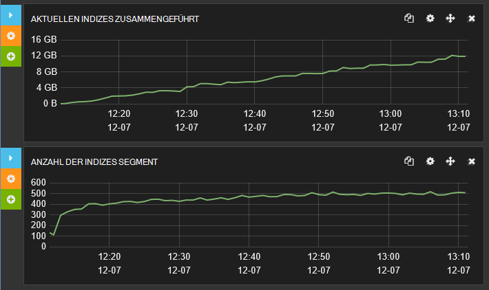

***Index Zusammenführen Aktivität für eine Aktualisierungsrate Index von 1 Sekunde***

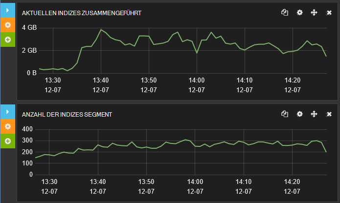

***Index Zusammenführen Aktivität für einen Index Aktualisierungsrate von 30 Sekunden***

### <a name="the-impact-of-replicas-on-data-ingestion-performance"></a>Die Auswirkung der Replikate auf Aufnahme Datenverarbeitung

Replikate sind eine wichtige Funktion sowie Cluster, und ohne diese besteht die Gefahr, dass Informationen verloren gehen, wenn ein Knoten ausfällt. Jedoch Replikate erhöhen den Datenträger- und Netzwerk-e/a durchgeführt werden und beeinträchtigen die Rate, mit der Daten erfasst, werden können. Beschriebenen Gründen kann es vorübergehend Replikate für die Dauer der großen Daten-Upload-Vorgänge deaktivieren hilfreich sein.

Daten Erfassung Performance-Tests wurden mit drei Konfigurationen wiederholt:

* Verwenden einen Cluster mit Replikate.

* Verwenden einen Cluster mit 1 Replikat.

* Verwenden einen Cluster mit 2.

In allen Fällen Cluster enthalten 7 Splitter 3 Knoten verteilt und auf virtuellen Computern konfiguriert, wie in den vorherigen Tests ausgeführt. Der Testindex verwendet ein Aktualisierungsintervall von 30 Sekunden.

In der folgenden Tabelle werden die Reaktionszeiten und Durchsatz aller Tests um zu Vergleichszwecken zusammengefasst:

| Konfiguration | Anzahl der Samples | Durchschnittliche Antwortzeit – erfolgreiche Vorgänge (ms) | Durchsatz – erfolgreiche Operations (Vorgänge/s) | Datenfehler Einnahme |
|---------------|--------------|----------------------------------------------------|---------------------------------------------------|--------------------------|
| 0-Replikate    | 215451       | 200                                                | 59,8                                              | 0                        |
| 1 Replikat     | 117758       | 365                                                | 32,7                                              | 0                        |
| 2 Replikate    | 94218        | 453                                                | 26,1                                              | 194262                   |


Wie die Anzahl der Replikate erhöht ist klar, aber beachten Sie außerdem großer Einnahme Datenfehler bei der dritten Prüfung. Diese Fehler generierten Nachrichten angegeben, dass sie Anfragen zurückgewiesen werden durch Bulk Insert Warteschlange überläuft verursacht wurden. Diese Ablehnung ist sehr schnell aufgetreten, deshalb die Anzahl ist groß.

> [AZURE.NOTE] Dritte Testergebnisse Bedeutung auf intelligenten wiederholungsstrategie treten vorübergehende Fehler wie diese – zurück für einen kurzen Zeitraum zu Bulk Insert Warteschlange vor dem erneuten Wiederholen das gleichzeitige abzuleiten Einfügeoperation.

Die nächste Diagramme Vergleichen der Reaktionszeiten während des Tests. Jeweils das erste Diagramm die allgemeine Reaktionszeit zeigt, vergrößert und das zweite Diagramm Antwortzeiten bei den schnellsten (Beachten Sie, dass das erste Diagramm zehnmal, der des zweiten ist). Sie können sehen, wie das Profil der Reaktionszeiten in drei Tests variiert.

Keine Replikate mitgenommen die meisten Operationen zwischen 75ms und 750ms mit der schnellste Reaktionszeit um 25ms:


Mit 1 Replikat wurde die gefüllten Reaktionszeiten im Bereich 125 MS 1250ms. Die schnellsten Antworten dauerte etwa 75ms waren weniger als bei 0 Replikate dieser schnelle Antworten. Auch wesentlich mehr Antworten, die wesentlich als die meisten allgemeinen Fälle über 1250ms länger:

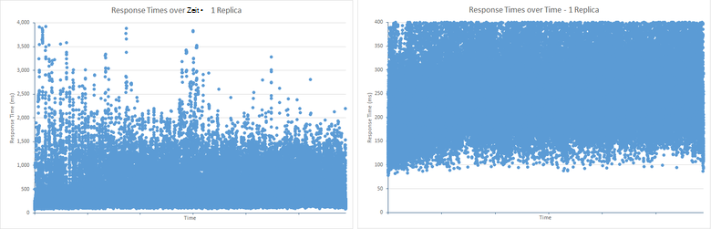

2 Replikate die gefüllte Antwort Bereich 200 ms 1500ms wurde jedoch weit weniger Ergebnisse unter dem minimalen Bereich als Test 1 Replikat. Das Muster der Ergebnisse über der Obergrenze sind jedoch ähnlich Test 1 Replikat. Dies ist wahrscheinlich aufgrund der Bulk Insert Warteschlange overflowing (mehr als eine Warteschlangenlänge von 50 Anfragen). Zusätzliche erforderliche Arbeit, zu 2 Replikate wird häufiger Überlauf die Warteschlange verhindert Einnahme Operationen mit übermäßiger Reaktionszeiten. Vorgänge werden längere Zeit dauert, möglicherweise Timeout Ausnahmen verursacht oder beeinträchtigen die Reaktionsfähigkeit von Clientanwendungen (Dies ist der Zweck der Bulk Insert-Warteschlangenmechanismus) schnell abgelehnt:


Marvel können Sie den Effekt Anzahl der Replikate Warteschleife Index Massenkopieren sehen Die nachfolgende Abbildung zeigt Daten aus Marvel, die zeigt, wie der Masseneinfügungstask Warteschlange während des Tests. Die durchschnittliche Warteschlangenlänge war 40 Anfragen jedoch regelmäßig Bursts verursachte Überlauf und Anfragen wurden daher abgelehnt:

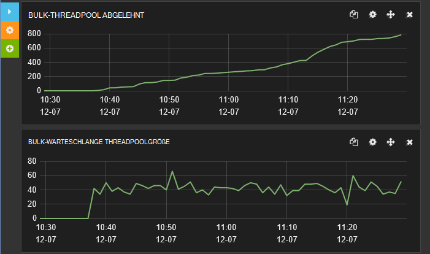

***BULK Indexgröße und Anzahl der Anfragen mit 2 zurückgewiesen.***

Sie sollten dies mit Abbildung zeigt die Ergebnisse eines einzelnen Replikats vergleichen. Elasticsearch-Engine konnte Anfragen schnell die durchschnittliche Warteschlangenlänge auf rund 25 zu verarbeiten und zu keinem Zeitpunkt hat die Warteschlangenlänge überschreitet 50 Anfragen so keine Arbeit abgelehnt wurde.

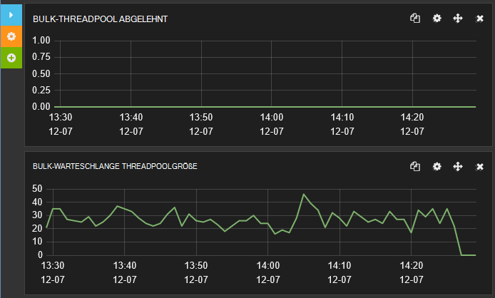

***Massenkopieren Sie Indexgröße und Anzahl der Anfragen mit 1 Replikat zurückgewiesen.***

## <a name="best-practices-for-clients-sending-data-to-elasticsearch"></a>Best Practices für Kunden senden von Daten an Elasticsearch

Viele Aspekte der Leistung betreffen nicht nur innerhalb des Systems ohne Verwendung des Systems von Clientanwendungen. Elasticsearch bietet zahlreiche Funktionen, die von der Erfassung von Daten verwendet werden können; Generieren von eindeutigen Bezeichnern für Dokumente, Beispiele Dokument Analyse und sogar zum Transformieren der Daten gespeichert wird mit scripting einige. Allerdings können diese Funktionen zu laden Elasticsearch-Engine und in vielen Fällen von Clientanwendungen vor der Übertragung effizienter erfolgen. 

> [AZURE.NOTE] Diese Liste der best Practices hauptsächlich Aufnahme neue Daten eher ändern vorhandene Daten bereits in einem Index. Einnahme Arbeitslasten erfolgt wie mit Elasticsearch, anhängen, Änderungen löschen/append Operationen durchgeführt werden. Dies ist, da Dokumente in einem Index unveränderlich sind, ein Dokument umfasst eine neue Version des gesamten Dokuments ersetzen. Sie können entweder eine HTTP PUT-Anforderung an ein vorhandenes Dokument überschrieben durchführen oder Elasticsearch *Aktualisieren* API, die eine Abfrage zum Abrufen eines vorhandenen Dokuments abstrahiert, führt die Änderung und führt dann speichern das neue Dokument speichern können.

Berücksichtigen Sie außerdem die folgenden Methoden implementieren, gegebenenfalls:

* Deaktivieren Sie Analyse für Indexfelder, die nicht analysiert werden. Analyse umfasst Wörtern Text zum Aktivieren von Abfragen nach bestimmten Begriffen suchen können. Sie können eine CPU-Intensive Aufgabe jedoch werden selektiv. Wenn Sie Elasticsearch zum Speichern von Daten verwenden, kann die Verarbeitungsmethode detailliertes Protokollnachrichten zu komplexe Suchvorgänge nützlich sein. Andere Felder wie Fehlercodes oder Bezeichner nicht zerlegt werden sollte (wie häufig Sie die Details aller Nachrichten anfordern, deren Fehlercode sind enthält eine "3", Example?) folgende Code Analysis für die Felder *Name* und *Hostip* in die *Protokolle* *Systembase* Index deaktiviert.

    ```http
    PUT /systembase
    {
        "settings" : {
            ...
        },
        "logs" : {
            ...
            "name": {
                "type": "string",
                "index" : "not_analyzed"
            },
            "hostip": {
                "type": "string",
                "index" : "not_analyzed"
            },
            ...
        }
    }
    ```

* Deaktivieren Sie Feld *_all* eines Indexes ist dies nicht erforderlich. Die * \_alle* Feld verkettet die Werte der Felder im Dokument zur Analyse und Indexierung. Es ist nützlich für Abfragen, die für jedes Feld in einem Dokument entsprechen können. Kunden erwarten benannten Felder verglichen, aktivieren * \_aller* einfach Rechenaufwand CPU- und Speicherressourcen. Das folgende Beispiel veranschaulicht das Deaktivieren der * \_alle* für welche *Protokolle* im Index *Systembase* .

    ```http
    PUT /systembase
    {
        "settings" : {
            ...
        },
        "logs" : {
            "_all": {
                "enabled" : false
            },
            ...,
        ...
        }
    }
    ```

    Beachten Sie, dass eine selektive Version erstellen können * \_alle* , die nur Daten aus bestimmten Feldern enthält. Weitere Informationen finden Sie unter [Deaktivieren der \_alle](https://www.elastic.co/guide/en/elasticsearch/reference/current/mapping-all-field.html#disabling-all-field).

* Vermeiden Sie dynamische Zuordnung in Indizes. Dynamische Zuordnung ist eine leistungsfähige Funktion, aber Hinzufügen neuer Felder zu einem vorhandenen Index muss sich die Indexstruktur auf Knoten koordiniert und kann vorübergehend Index gesperrt werden. Dynamische Zuordnung kann auch eine Explosion Anzahl Felder und die daraus resultierenden Indexmetadaten nicht sorgfältig. Wiederum dadurch erhöhte Speicherbedarf und e für Einnahme Daten sowohl Abfragen. Diese beiden Probleme beeinträchtigt die Leistung. Deaktivieren Sie dynamische Zuordnung und definieren Sie Indexstrukturen explizit. Weitere Informationen finden Sie unter [Dynamische Feld zuordnen](https://www.elastic.co/guide/en/elasticsearch/reference/current/dynamic-field-mapping.html#dynamic-field-mapping).

* Verstehen Sie, wie die Arbeitslast in Konflikt stehende Anforderungen. Sie sollten immer haben Daten Einnahme einen erheblichen Einfluss auf die Leistung der anderen gleichzeitigen Operationen wie Benutzer Abfragen kann. Daten Erfassung möglicherweise plötzlich gehäufte und bei System versucht, alle die Daten sofort nutzen könnte des Zustroms Abfrage Sätze ein Lager verlangsamt. Elasticsearch versucht, dieses Problem ensteht reguliert die Rate, mit der Verarbeitung, Einnahme Anfragen durch das gleichzeitige Warteschlange einfügen (siehe Abschnitt [Determining einschränkende Faktoren – CPU-Auslastung](#determining-limiting-factors-cpu-utilization) für Weitere Informationen), sondern diesen Mechanismus wirklich als letztes Mittel. Wenn der Anwendungscode nicht eingerichtet ist lehnte ab, dass Sie Daten verlieren. Stattdessen Sie verwenden Sie ein Muster wie [Queue-basierten Load Levelling](https://msdn.microsoft.com/library/dn589783.aspx) zum Steuern der Rate, mit der Daten an Elasticsearch übergeben werden.

* Sicherstellen Sie, dass Clusterressourcen ausreichende Ressourcen, um die Arbeitslast zu bewältigen ist, besonders wenn Indizes mit mehreren Replikaten konfiguriert sind.

* Verwenden der Bulk einfügen API Smartcarts stapelweise Dokumente hochladen. Größe Bulk fordert entsprechend. Manchmal größere Chargen sind nicht für Leistung und können Elasticsearch Threads und andere Ressourcen überlastet, andere gleichzeitige Vorgänge verzögern. Die Dokumente in einem Stapel Bulk Insert bleiben im Speicher koordinierende Knoten während der Operation. Die physische Größe jeder Partie ist wichtiger als die Anzahl der Dokumente. Es ist keine Regel darüber, was die optimale Batchgröße, obwohl Elasticsearch Dokumentation empfiehlt zwischen 5 bis 15 MB als Ausgangspunkt für eigene Untersuchungen zeigen. Führen Sie Leistungstests optimale Batchgröße für Szenarien und Arbeitslast Mischung zu.

* Stellen Sie sicher, dass Bulk Insert Anfragen werden Knoten verteilt, sondern auf einen einzelnen Knoten weitergeleitet. Leiten alle Anfragen auf einen einzelnen Knoten kann Speicherüberlauf verursachen jede Bulk Insert Anforderung verarbeiteten im Knoten gespeichert wird. Es können auch Netzwerklatenz, wie Anfragen an andere Knoten umgeleitet werden.

* Elasticsearch verwendet ein Quorum der Mehrzahl der Knoten Primär- und Replikat beim Schreiben von Daten aus. Bis das Quorum Erfolg meldet ein Schreibvorgang nicht abgeschlossen. Dadurch wird sichergestellt, dass Daten geschrieben werden, wenn die Mehrheit der Knoten aufgrund eines Ereignisses Netzwerk Partition (Fehler). Mit einem Quorum kann die Leistung der Schreibvorgänge beeinträchtigen. Sie können der Einstellung *Konsistenz* *ein* beim Schreiben Quorum-basierte schreiben deaktivieren. Das folgende Beispiel fügt ein neues Dokument jedoch schließt als das Schreiben in die primäre Splitter abgeschlossen hat.

    ```http
    PUT /my_index/my_data/104?consistency=one
    {
        "name": "Bert",
        "age": 23
    }
    ```

    Beachten Sie, dass mit asynchrone Replikation deaktivieren Quorum-basierte schreiben zu Inkonsistenzen zwischen primären Splitter und Replikate führen kann.

* Verwendung der Quorumdatenträger wartet Elasticsearch nicht genügend Knoten verfügbar werden, bevor festgestellt wurde, dass ein Schreibvorgang abgebrochen werden soll, da ein Quorum erreicht werden kann. Diese Wartezeit Abfrageparameter Timeout bestimmt (der Standardwert ist 1 Minute). Sie können diese Einstellung ändern, mit der Timeout-Abfrageparameter. Im folgenden Beispiel wird ein neues Dokument erstellt und wartet 5 Sekunden für das Quorum Abbruch reagieren:

    ```http
    PUT /my_index/my_data/104?timeout=5s
    {
        "name": "Sid",
        "age": 27
    }
    ```

    Elasticsearch können Sie eine eigene Version Nummern [generiert extern](https://www.elastic.co/guide/en/elasticsearch/reference/current/docs-index_.html#_version_types)verwenden.

* Deaktivieren der * \_Quelle* Feld eines Indexes. Dieses Feld enthält eine Kopie des ursprünglichen Dokuments in JSON, die verwendet wurde, wenn ein Dokument gespeichert ist. Speichern dieses Feld entstehen Kosten für zusätzlichen Speicher und Festplatte. Aber diese Kosten möglicherweise marginalen je nach Struktur des Dokuments und sollten Sie auch bedenken, Deaktivieren der * \_Quelle* Feld verhindert einen Client die folgenden Operationen:

    * Mithilfe der Update-API ein Dokument ändern.
    * Auf dem Flug beim Ausführen von Abfragen durchführen.
    * Vollständige Daten.
    * Debuggen von Abfragen und Aggregationen der ursprünglichen Dokument.

    Das folgende Beispiel deaktiviert die * \_Quelle* für welche *Protokolle* im Index *Systembase* .

  ```http
  PUT /systembase
  {
        "settings" : {
            ...
        },
        "logs" : {
            "_source": {
                "enabled": false
            },
            ...,
        ...
        }
  }
  ```

## <a name="general-guidelines-for-conducting-data-ingestion-performance-testing-with-elasticsearch"></a>Allgemeine Richtlinien für die Daten Erfassung Performance-Tests mit Elasticsearch

Die folgenden Punkte markieren Sie einige Elemente sollten bei Leistungstests ausführen Elasticsearch und Analysieren der Ergebnisse überprüft.

* Testen der Leistung ist unbedingt zeitaufwändig und kostenintensiv. Mindestens sammelt Statistiken, die Übertragungsraten auf Festplatte, Netzwerk, CPU-Nutzung und CPU-Wartezeiten Datenträgerlatenz (wenn möglich) zu messen. Dadurch können Sie schnell auf den Testaufwand mit guter Rendite Feedback.

* Nutzen Sie alle Skriptfunktionen gemäß der Auslastungstests Tool zum Sammeln von Metriken, die andernfalls nicht verfügbar u. u.. Beispielsweise hat Linux verschiedener zuverlässige Performance-Statistiken, die mit Dienstprogrammen wie *Vmstat* und *Iostat*erfasst werden können. Können Sie Skripting mit JMeter um Daten als Teil eines Testplans zu erfassen.

* Performance Engineering geht es vor allem Statistiken basierend auf zuverlässige und wiederholbare Daten analysieren. Nicht zur allgemeinen Metriken, die nicht die notwendigen Einblicke werden beendet. Informieren Sie sich mit den Daten und Leistung Dev Ops Prozesses mit einer schnellen Feedbackschleife engineering. Betrachten Sie immer Statistiken vergleichen von Trends und früherer Ergebnisse-Konfigurationen. Dadurch regelmäßig Daten generiert werden, die Sie verstehen kann Ihre Arbeitslast, und die Sie Bewertung Konfiguration und Bereitstellung können wiederholt werden.

* Verwenden Sie ein Tool wie Marvel Cluster- und Leistung beim Testen um zusätzliche Erkenntnisse zu überwachen. JMeter ist für die unformatierten Daten für Analyse, aber Marvel können geben sich Echtzeit-Performance wie geht und die möglichen Ursachen für Probleme mit langsamer ab. Außerdem bieten viele Auslastungstesttools keine Sichtbarkeit auf die inneren Eigenschaften von Elasticsearch. Verwenden und Indizierung Durchsatzraten, Seriendruck Segment zählt Garbage Collector (GC) Statistiken und Drosselung Indexstatistiken für Zeiten vergleichen. Wiederholen Sie diese Analyse in regelmäßigen Abständen.

* Vergleichen Sie die Load Test Tool Statistik mit Knotenstatistiken Marvel (Festplatte und Verkehr, CPU-Auslastung, Speicher und Thread Pool Nutzung) Muster Korrelation zwischen den Zahlen der Infrastruktur und bestimmte Elasticsearch Statistiken zu verstehen.

* Grundsätzlich sollten Sie *ein Knoten einen Splitter* als Grundlage für Leistungstests und bewerten Sie Kosten durch Hinzufügen von Knoten zu. Allerdings hängen Sie nicht vollständig extrapolierende Leistung basierend auf wenige Knoten und Splitter. Kosten für Synchronisierung und Kommunikation im Cluster können unvorhersehbare je größer die Anzahl der Knoten und Splitter auswirken.

* Splitter-Zuweisung auf Knoten vergleichen die Statistik betrachten. Einige Knoten haben weniger Replikate und Splitter Ungleichgewicht der Ressourcen schaffen.

* Wenn Sie Auslastungstests ausführen, erhöhen Sie die Anzahl der Threads, die Test-Tool verwendet, um zu dem Cluster bis Fehler senden. Zum Testen einer nachhaltigen Durchsatz pflegen der Testebene unterhalb der erwarteten Belastung. Wenn die Fehlerrate die Obergrenze überschreitet, entstehen Fehler auf Back-End-Ressourcen durch Wiederherstellung. In diesen Fällen verringert Durchsatz unvermeidlich.

* Um zu simulieren, wie Ihr System zu einem unerwartet Aktivität reagiert, ggf. Tests, die eine Fehlerrate generieren, die der erwarteten Belastung überschreitet. Dadurch erhalten Sie Durchsatzraten nicht nur Kapazität, sondern auch die Kosten der Wiederherstellung.

* Dokumentanzahl Performance-Profil zu verwenden, und Dokumente der Arbeitslast Muster wiederverwenden. Beachten Sie, dass beim Hinzufügen von mehr Performance-Profil ändern.

* Beachten Sie die SLAs für IOPS und Transfer Preise Grenzen für die Speicherung verwendeten. Verschiedene Speichertypen (SSD, dreht Media) haben unterschiedliche.

* Beachten Sie, dass die CPU-Leistung kann nicht nur wegen Datenträger und Netzwerkaktivität, aber da Back-End-Anwendung verwenden, können möglicherweise sperren und Kommunikationsmechanismen mit verteilten Verarbeitung, Nutzung des Prozessors.

* Führen Sie Leistungstests für mindestens zwei Stunden (nicht). Indizierung kann auf Arten Leistung nicht sofort sichtbar werden kann. JVM Garbage Collection-Statistik und führt die Indizierung können das Performance-Profil mit der Zeit ändern.

* Sollten Sie wie Index aktualisiert großen Einfluss Einnahme Datendurchsatz und Drosselung mit einem Cluster.

## <a name="summary"></a>Zusammenfassung

Es ist wichtig zu verstehen, wie Ihre Lösung als Datenmengen und die Anzahl der Anfragen erhöht. Elasticsearch auf Windows Azure ausgeführte kann vertikale und horizontale Skalierung. Auf größeren VMs mit mehr Ressourcen ausgeführt, und einen Elasticsearch Cluster auf ein Netzwerk von VMs verteilen. Die Palette der Optionen kann verwirrend sein. Ist es auf eine große Anzahl von kleinen VMs auf einem Cluster mit einer kleinen Anzahl von großen VMs oder irgendwo in der Mitte ein Clusters implementiert? Wie viele Splitter sollte jeder Index, auch Was sind die vor-und Nachteile zur Erfassung von Daten und Leistung? In der Splitter über Knoten verteilt werden haben einen erheblichen Einfluss auf Aufnahme Datendurchsatz. Mit mehr Splitter kann weniger interne Konflikte in einen vorkommt, jedoch müssen den Overhead viele Splitter mit einem Cluster auferlegen kann diesen Vorteil abwägen. Um diese Fragen effektiv sollten Sie zum Testen des Systems bestimmen die am besten geeignete Strategie vorbereitet.

Die Leistung von Datenträger-e/a-Subsystem ist für Daten Einnahme Arbeitslasten entscheidend. Mit SSDs kann Steigerung des Durchsatzes durch Reduzierung der Datenträgerlatenz Schreibvorgänge. Wenn Sie große Mengen an Speicherplatz auf einem Knoten benötigen, sollten Sie standard VMs mit flüchtigen Speicher anstelle teurer VMs, die Premium-Speicher unterstützen.

## <a name="appendix-the-bulk-load-data-ingestion-performance-test"></a>Anhang: Bulk Load Daten Einnahme Leistungstest

Dieser Anhang beschreibt Leistungstest Elasticsearch Cluster ausgeführt. Die Tests wurden mit JMeter auf separaten virtuellen Computer ausgeführt. Details die Konfiguration der Umgebung werden für [eine Umgebung für Elasticsearch auf Azure-Leistungstests][]. Ausführen Ihrer eigenen Tests eigene JMeter Testplan manuell erstellen oder die automatisierte Testskripts können separat verwenden. Weitere Informationen finden Sie unter [Ausführen automatisierter Elasticsearch Webleistungstests][] .

Daten Erfassung Arbeitslast durchgeführt umfangreiche Hochladen von Dokumenten mithilfe der Bulk Insert-API. Der Zweck dieses Index wurde simuliert ein Repository empfangen Daten Systemereignisse für folgende Suchvorgänge und Analyse darstellt. Jedes Dokument in einem einzelnen Index mit dem Namen *Systembase*gespeichert und war Art *Protokolle*. Alle Dokumente haben das gleiche feste Schema in der folgenden Tabelle beschrieben:

| Feld         | Datentyp            | Beispiel                           |
|---------------|---------------------|-----------------------------------|
| @timestamp    | DateTime            | 2013-12-11T08:01:45.000Z          |
| Name          | Zeichenfolge              | Checkout.Payment                  |
| Nachricht       | Zeichenfolge              | Eingehende Anforderungsnachricht          |
| severityCode  | ganze Zahl             | 1                                 |
| Schweregrad      | Zeichenfolge              | Info                              |
| Hostname      | Zeichenfolge              | sixshot                           |
| hostip        | Zeichenfolge (IP-Adresse) | 10.0.0.4                          |
| PID           | int                 | 123                               |
| TID           | int                 | 4325                              |
| appId         | Zeichenfolge (Uuid)       | {00000000-0000-0000-000000000000} |
| Anwendungsname       | Zeichenfolge              | mytestapp                         |
| appVersion    | Zeichenfolge              | 0.1.0.1234                        |
| Typ          | int                 | 5                                 |
| Untertyp       | int                 | 1                                 |
| correlationId | GUID                | {00000000-0000-0000-000000000000} |
| Betriebssystem            | Zeichenfolge              | Linux                             |
| osVersion     | Zeichenfolge              | 4.1.1                             |
| Parameter    | [ ]                | {Schlüssel: Wert, Schlüssel:}             |

Die folgende Anforderung können Sie um den Index zu erstellen. Die *Anzahl\_von\_Replikate*, *Aktualisieren\_Intervall*, und *Anzahl\_von\_Splitter* Settings die Werte unter vielen Tests unterschiedlich.

> [AZURE.IMPORTANT] Der Index wurde gelöscht und neu erstellt vor jeder Testlauf.

```http
PUT /systembase
{
    "settings" : {
        "number_of_replicas": 1,
        "refresh_interval": "30s",
        "number_of_shards": "5"
    },
    "logs" : {
        "properties" : {
            "@timestamp": {
            "type": "date",
            "index" : "not_analyzed"
            },
            "name": {
                "type": "string",
                "index" : "not_analyzed"
            },
            "message": {
                "type": "string",
                "index" : "not_analyzed"
            },
            "severityCode": {
                "type": "integer",
                "index" : "not_analyzed"
            },
            "severity": {
                "type": "string",
                "index" : "not_analyzed"
            },
            "hostname": {
                "type": "string",
                "index" : "not_analyzed"
            },
            "hostip": {
                "type": "string",
                "index" : "not_analyzed"
            },
            "pid": {
                "type": "integer",
                "index" : "not_analyzed"
            },
            "tid": {
                "type": "integer",
                "index" : "not_analyzed"
            },
            "appId": {
                "type": "string",
                "index" : "not_analyzed"
            },
            "appName": {
                "type": "string",
                "index" : "not_analyzed"
            },
            "appVersion": {
                "type": "integer",
                "index" : "not_analyzed"
            },
            "type": {
                "type": "integer",
                "index" : "not_analyzed"
            },
            "subtype": {
                "type": "integer",
                "index" : "not_analyzed"
            },
            "correlationId": {
                "type": "string",
                "index" : "not_analyzed"
            },
            "os": {
                "type": "string",
                "index" : "not_analyzed"
            },
            "osVersion": {
                "type": "string",
                "index" : "not_analyzed"
            },
            "parameters": {
                "type": "string",     
                "index" : "not_analyzed"
            }
        }
    }
}
```

Jede Partie Bulk Insert enthalten 1000 Dokumente. Jedes Dokument wurde basierend auf einer Kombination von Zufallswerten *SeverityCode* *Hostname*, *Hostip*, *pid*, *Tid*, *Anwendungsname*, *AppVersion*, *Typ*, *Untertyp*und *CorrelationId* Felder und eine zufällige Auswahl aus festgelegten Begriffe für die Felder *Name*, *Nachricht* *Schweregrad*, *os*, *OsVersion*, *Parameters*, *data1*und *data2* generiert. Die Anzahl der Client-Anwendungsinstanzen zum Hochladen von Daten verwendet wurde erfolgreich Eingangslautstärke zu sorgfältig ausgewählt. Tests haben zwei Stunden Cluster zu begleichen beeinflussen alle vorübergehenden Störungen im Gesamtergebnis aktivieren. In dieser Zeit geuploadet Tests beinahe 1,5 Milliarden Dokumente.

Die Daten wurde dynamisch generiert mithilfe einen benutzerdefinierten JUnit Anforderung Sampler, der die einer Gruppe von Threads in einem Testplan JMeter hinzugefügt wurde. JUnit Code wurde mit der Vorlage JUnit Testfall in Eclipse-IDE.

> [AZURE.NOTE] Informationen zum Erstellen eines JUnit-Tests für JMeter finden Sie unter [Bereitstellen einen JMeter JUnit Sampler Elasticsearch Leistungstests][].

Der folgende Ausschnitt zeigt den Java-Code für Elasticsearch 1.7.3 testen. Beachten Sie, dass die JUnit-Testklasse in diesem Beispiel *ElasticsearchLoadTest2 heißt*:

```java
/* Java */
package elasticsearchtest2;

    import static org.junit.Assert.*;

    import org.junit.*;

    import java.util.*;

    import java.io.*;

    import org.elasticsearch.action.bulk.*;
    import org.elasticsearch.common.transport.*;
    import org.elasticsearch.client.transport.*;
    import org.elasticsearch.common.settings.*;
    import org.elasticsearch.common.xcontent.*;

    public class ElasticsearchLoadTest2 {

        private String [] names={"checkout","order","search","payment"};
        private String [] messages={"Incoming request from code","incoming operation succeeded with code","Operation completed time","transaction performed"};
        private String [] severity={"info","warning","transaction","verbose"};
        private String [] apps={"4D24BD62-20BF-4D74-B6DC-31313ABADB82","5D24BD62-20BF-4D74-B6DC-31313ABADB82","6D24BD62-20BF-4D74-B6DC-31313ABADB82","7D24BD62-20BF-4D74-B6DC-31313ABADB82"};

        private String hostname = "";
        private String indexstr = "";
        private String typestr = "";
        private int port = 0;
        private int itemsPerInsert = 0;
        private String clustername = "";
        private static Random rand=new Random();

        @Before
        public void setUp() throws Exception {
        }

        public ElasticsearchLoadTest2(String paras) {
        \* Paras is a string containing a set of comma separated values for:
            hostname
            indexstr
            typestr
            port
            clustername
            node
            itemsPerInsert
        */

            // Note: No checking/validation is performed

            String delims = "[ ]*,[ ]*"; // comma surrounded by zero or more spaces
            String[] items = paras.split(delims);

            hostname = items[0];
            indexstr = items[1];
            typestr = items[2];
            port = Integer.parseInt(items[3]);
            clustername = items[4];
            itemsPerInsert = Integer.parseInt(items[5]);

            if (itemsPerInsert == 0)
                itemsPerInsert = 1000;
            }

        @After
        public void tearDown() throws Exception {
        }

        @Test
        public void BulkBigInsertTest() throws IOException {

            Settings settings = ImmutableSettings.settingsBuilder().put("cluster.name", clustername).build();

            TransportClient client;
            client = new TransportClient(settings);

            try {
                client.addTransportAddress(new InetSocketTransportAddress(hostname, port));
                BulkRequestBuilder bulkRequest = client.prepareBulk();
                Random random = new Random();
                char[] exmarks = new char[12000];
                Arrays.fill(exmarks, 'x');
                String dataString = new String(exmarks);

                for(int i=1; i &lt; itemsPerInsert; i++){
                    random.nextInt(10);
                    int host=random.nextInt(20);

                    bulkRequest.add(client.prepareIndex(indexstr, typestr).setSource(XContentFactory.jsonBuilder().startObject()
                        .field("@timestamp", new Date())
                        .field("name", names[random.nextInt(names.length)])
                        .field("message", messages[random.nextInt(messages.length)])
                        .field("severityCode", random.nextInt(10))
                        .field("severity", severity[random.nextInt(severity.length)])
                        .field("hostname", "Hostname"+host)
                        .field("hostip", "10.1.0."+host)
                        .field("pid",random.nextInt(10))
                        .field("tid",random.nextInt(10))
                        .field("appId", apps[random.nextInt(apps.length)])
                        .field("appName", "application" + host)
                        .field("appVersion", random.nextInt(5))
                        .field("type", random.nextInt(6))
                        .field("subtype", random.nextInt(6))
                        .field("correlationId", UUID.randomUUID().toString())
                        .field("os", "linux")
                        .field("osVersion", "14.1.5")
                        .field("parameters", "{key:value,key:value}")
                        .field("data1",dataString)
                        .field("data2",dataString)
                    .endObject()));
                }

                BulkResponse bulkResponse = bulkRequest.execute().actionGet();
                assertFalse(bulkResponse.hasFailures());
            }
            finally {
                client.close();
            }
        }

        @Test
        public void BulkDataInsertTest() throws IOException {
            Settings settings = ImmutableSettings.settingsBuilder().put("cluster.name", clustername).build();

            TransportClient client;
            client = new TransportClient(settings);

            try {
                client.addTransportAddress(new InetSocketTransportAddress(hostname, port));
                BulkRequestBuilder bulkRequest = client.prepareBulk();

                for(int i=1; i&lt; itemsPerInsert; i++){
                    rand.nextInt(10);
                    int host=rand.nextInt(20);

                    bulkRequest.add(client.prepareIndex(indexstr, typestr).setSource(XContentFactory.jsonBuilder().startObject()
                        .field("@timestamp", new Date())
                        .field("name", names[rand.nextInt(names.length)])
                        .field("message", messages[rand.nextInt(messages.length)])
                        .field("severityCode", rand.nextInt(10))
                        .field("severity", severity[rand.nextInt(severity.length)])
                        .field("hostname", "Hostname" + host)
                        .field("hostip", "10.1.0."+host)
                        .field("pid",rand.nextInt(10))
                        .field("tid",rand.nextInt(10))
                        .field("appId", apps[rand.nextInt(apps.length)])
                        .field("appName", "application"+host)
                        .field("appVersion", rand.nextInt(5))
                        .field("type", rand.nextInt(6))
                        .field("subtype", rand.nextInt(6))
                        .field("correlationId", UUID.randomUUID().toString())
                        .field("os", "linux")
                        .field("osVersion", "14.1.5")
                        .field("parameters", "{key:value,key:value}")
                    .endObject()));
                }

                BulkResponse bulkResponse = bulkRequest.execute().actionGet();
                assertFalse(bulkResponse.hasFailures());
            }
            finally {
                client.close();
            }
        }
    }
```

Private *String* Arrays *Namen*, *Nachrichten*, *Schweregrad*und *apps* enthalten eine kleine Gruppe von Werten, denen Elemente nach dem Zufallsprinzip aus ausgewählt werden. Die verbleibenden Datenelemente für jedes Dokument werden zur Laufzeit generiert.

Konstruktor, *der den Parameter* akzeptiert, von JMeter aufgerufen, und die Werte in der Zeichenfolge übergeben werden als Teil der JUnit Anforderung Sampler-Konfiguration angegeben. Für diesen Test JUnit soll *der Zeichenfolgenparameter* enthält folgende Angaben:

* **Hostname**. Dies ist der Name oder die IP-Adresse Azure Lastenausgleich. Lastenausgleich versucht, die Anforderung Datenknoten im Cluster verteilt. Wenn Sie kein Lastenausgleich verwenden Geben Sie die Adresse eines Knotens im Cluster jedoch alle Anfragen an, Knoten und die zu einem Engpass führen weitergeleitet.

* **Indexstr**. Dies ist der Name des Indexes, der Daten vom JUnit-Test hinzugefügt werden. Wenn der Index erstellt wird wie oben beschrieben, sollte dieser Wert *Systembase*.

* **Typestr**. Dies ist der Typ im Index, in dem die Daten gespeichert. Wenn der Index erstellt wird wie oben beschrieben, sollte dieser Wert *Protokolle*.

* **Port**. Dies ist der Port auf dem Host herstellen. In den meisten Fällen sollte dies auf 9300 (Anschluss überwacht API Clientanforderungen Port 9200 dient nur für HTTP-Anfragen von Elasticsearch verwendet) festgelegt werden.

* **Clustername**. Dies ist der Name des Clusters Elasticsearch mit dem Index.

* **ItemsPerInsert**. Dies ist eine numerische Parameter die Anzahl der Dokumente in jeder Bulk Insert hinzufügen. Die standardmäßige Stapelgröße ist 1000.

Sie geben die Daten für die Konstruktorzeichenfolge in die JUnit Seite Demo JUnit in JMeter konfiguriert. Die folgende Abbildung zeigt ein Beispiel:

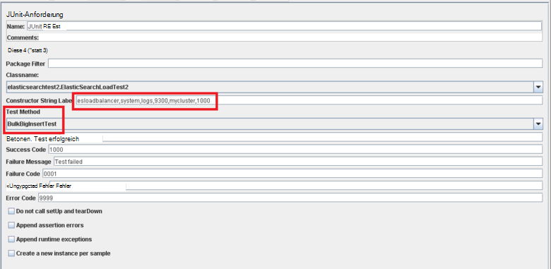

Die Methoden *BulkInsertTest* und *BigBulkInsertTest* durchführen das eigentliche erzeugen und Hochladen der Daten Beide Methoden sind sehr ähnlich. Elasticsearch Cluster herstellen, und erstellen Sie einen Stapel von Dokumenten (wie der *ItemsPerInsert* -Konstruktorparameter bestimmt). Die Dokumente werden mit Elasticsearch Bulk-API hinzugefügt. Der Unterschied zwischen den beiden Methoden ist *data1* und *data2* Zeichenfolgenfelder in jedem Dokument hochladen in der *BulkInsertTest* -Methode weggelassen werden, dass mit 12000 Zeichenfolgen in der *BigBulkInsertTest* -Methode gefüllt. Beachten Sie, dass die Methoden mit Feld *Testmethode* in die Seite JUnit in JMeter (in der Abbildung oben hervorgehoben) auswählen.

> [AZURE.NOTE] Der hier aufgeführte Beispielcode verwendet Elasticsearch 1.7.3 Transport-Clientbibliothek. Wenn Sie Elasticsearch 2.0.0 oder später müssen Sie für die ausgewählte Version die entsprechende Bibliothek verwenden. Weitere Informationen zu Elasticsearch 2.0.0 Transport-Clientbibliothek finden Sie unter [Transport Client](https://www.elastic.co/guide/en/elasticsearch/client/java-api/2.0/transport-client.html) -Seite auf der Website Elasticsearch.

[Stabilität und Recovery auf Elasticsearch in Azure konfigurieren]: guidance-elasticsearch-configuring-resilience-and-recovery.md
[Erstellen einer Umgebung-Leistungstests für Elasticsearch auf Azure]: guidance-elasticsearch-creating-performance-testing-environment.md
[Automatisierte Elasticsearch Leistungstests ausführen]: guidance-elasticsearch-running-automated-performance-tests.md
[Bereitstellen von JMeter JUnit Sampler für Leistungstests Elasticsearch]: guidance-elasticsearch-deploying-jmeter-junit-sampler.md
