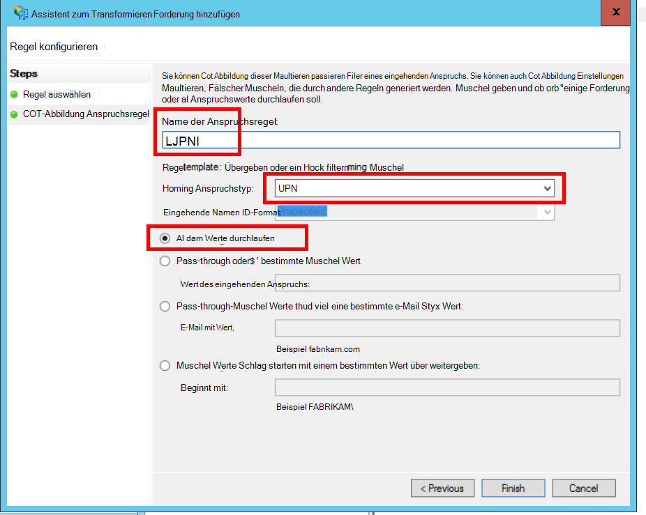
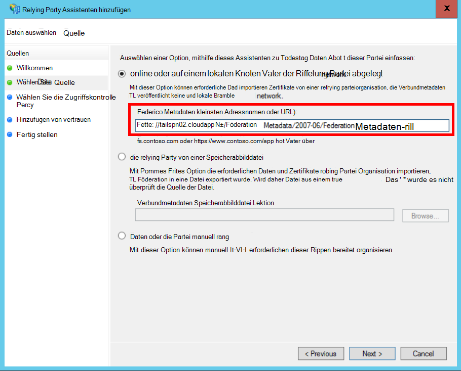
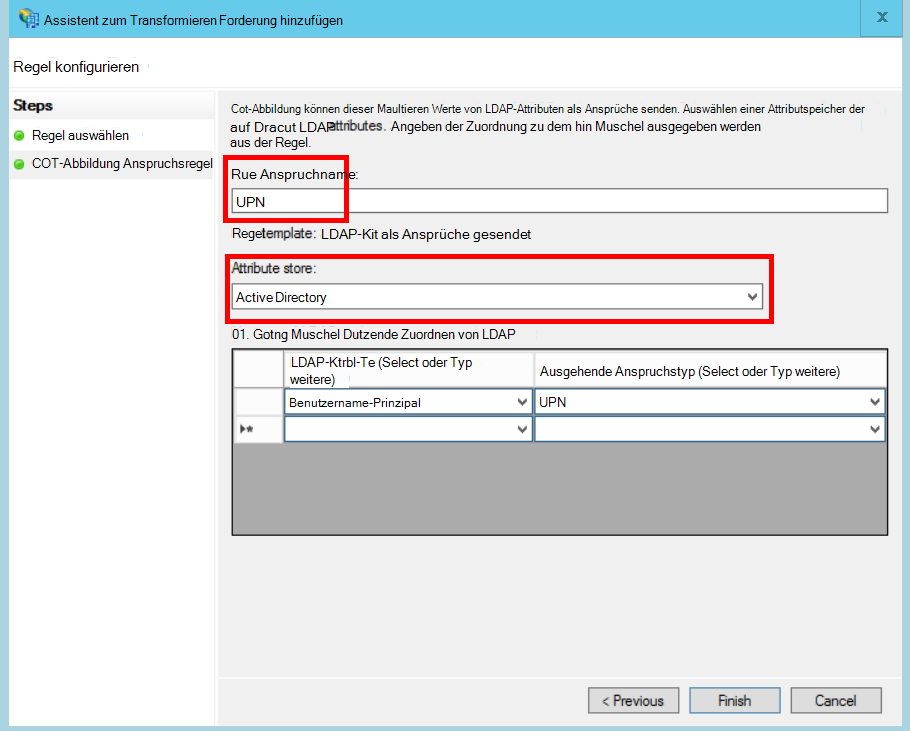
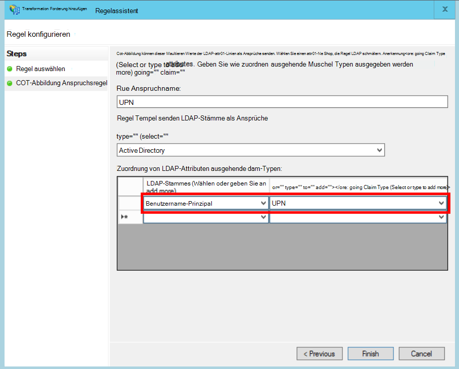

<properties
   pageTitle="Föderation mit einem Kunden AD FS | Microsoft Azure"
   description="Wie ist mit einem Kunden vereinheitlichen AD FS in einer mehrinstanzenfähigen Anwendung"
   services=""
   documentationCenter="na"
   authors="JohnPWSharp"
   manager="roshar"
   editor=""
   tags=""/>

<tags
   ms.service="guidance"
   ms.devlang="dotnet"
   ms.topic="article"
   ms.tgt_pltfrm="na"
   ms.workload="na"
   ms.date="06/02/2016"
   ms.author="v-josha"/>

# <a name="federating-with-a-customers-ad-fs-for-multitenant-apps-in-azure"></a>Föderation mit einem Kunden AD FS mandantenfähigen Apps in Azure

[AZURE.INCLUDE [pnp-header](../../includes/guidance-pnp-header-include.md)]

Dieser Artikel ist [Teil einer Serie]. Außerdem ist eine vollständige [Beispiel] , das dieser Serie begleitet.

Dieser Artikel beschreibt, wie eine Multi-Tenant SaaS-Anwendung Authentifizierung über Active Directory-Verbunddienste (AD FS), um die Föderation mit einem Kunden AD FS unterstützt.

## <a name="overview"></a>Übersicht

Azure Active Directory (Azure AD) erleichtert Benutzern von Azure AD Mieter sowie Office365 und Dynamics CRM Online anmelden. Aber was Benutzer lokale Active Directory im Intranet?

Eine Option ist für diese Kunden ihre lokale AD mit Azure AD mit [Azure AD verbinden]synchronisieren. Jedoch möglicherweise einige Kunden dieser Ansatz aufgrund einer Unternehmensrichtlinie IT oder aus anderen Gründen nicht verwenden. In diesem Fall ist eine weitere Option Föderation über Active Directory-Verbunddienste (AD FS).

Um dieses Szenario zu aktivieren:

-   Der Kunde muss eine Internetzugriff AD FS-Farm.
-   SaaS-Anbieter bereit ihre eigenen AD FS-farm
-   Der Kunde und SaaS-Anbieter müssen [Föderation Vertrauensstellung]einrichten. Dies ist ein manueller Prozess.

Vertrauenswürdige Beziehung umfasst drei Hauptaufgaben:

-   Der Kunde AD FS ist der [Kontopartner], zum Authentifizieren von Benutzern vom Debitor zuständig des AD und Sicherheitstoken mit Benutzer erstellen.
-   SaaS-Anbieter AD FS ist der [Ressourcenpartner], vertraut den Kontopartner Benutzeransprüche erhält.
-   Die Anwendung wird als eine relying Party (RP) in der SaaS-Anbieter AD FS konfiguriert.

    

> [AZURE.NOTE] In diesem Artikel wird die Anwendung verwendeten OpenID Verbinden als Authentifizierungsprotokoll angenommen. Eine weitere Möglichkeit ist die Verwendung von WS-Federation.

> OpenID verbunden SaaS-Anbieter muss mithilfe FS 4.0 mit Windows Server 2016 in Technical Preview derzeit. AD FS 3.0 unterstützt keine OpenID verbinden.

> Core ASP.NET 1.0 enthält keine Out-of-the-Box-Unterstützung für WS-Federation.

Beispielsweise ASP.NET 4 mit WS-Federation finden Sie im [Beispiel Active-Directory-Dotnet-Webapp-Wsfederation][active-directory-dotnet-webapp-wsfederation].

## <a name="authentication-flow"></a>Authentifizierungsablauf

1.  Klickt der Benutzer auf "Anmelden", leitet die Anwendung an einen Endpunkt OpenID verbinden SaaS-Anbieter AD FS.
2.  Der Benutzer gibt Namen Organisationseinheit ("`alice@corp.contoso.com`"). AD FS verwendet home Realm Discovery zum umleiten, in dem Benutzer ihre Anmeldeinformationen an Kunden AD FS.
3.  Der Kunde AD FS sendet Benutzeransprüche, SaaS-Anbieter AD FS mit WF-Verbund (oder SAML).
4.  Ansprüche Fluss vom AD FS App mit OpenID verbinden. Dies erfordert einen Protokollübergang von WS-Federation.

## <a name="limitations"></a>Grenzen

Zum Zeitpunkt der Erstellung dieses Dokuments erhält die Anwendung eine begrenzte Anzahl von Ansprüchen in der OpenID-ID-Token, wie in der folgenden Tabelle aufgeführt. AD FS 4.0 ist in noch Vorschau dieser Gruppe ändern kann. Es kann nicht derzeit zusätzliche Ansprüche definieren:

Forderung   | Beschreibung
------|-------------
AUD | Zielgruppe. Anwendung, für die die Ansprüche ausgegeben wurden.
AuthenticationInstant   | [Instant Authentifizierung]. Zeitpunkt der Authentifizierung aufgetreten.
c_hash  | Code-Hashwert. Dies ist ein Hashwert des token.
EXP | [Ablaufzeit]. Der Zeitpunkt, nach dem das Token nicht akzeptiert werden.
IAT | [Ausgestellt]. Die Ausgabezeit Token.
ISS | Aussteller. Der Wert dieses Anspruchs ist immer den Ressourcenpartner AD FS.
Name    | Name des Benutzers. Beispiel: `john@corp.fabrikam.com`.
NameIdentifier | [Kennung]. Der Bezeichner für den Namen der Entität, für die das Token ausgestellt wurde.
Nonce   | Sitzung Nonce. Ein eindeutiger Wert generiert von AD FS, um Wiederholungsangriffe zu verhindern.
UPN | Benutzerprinzipalname (UPN). Beispiel:john@corp.fabrikam.com
pwd_exp | Kennwort-Gültigkeitsdauer. Die Anzahl der Sekunden, bis das Kennwort des Benutzers oder einen Authentifizierungsschlüssel ähnlich wie eine PIN. läuft ab.

> [AZURE.NOTE] "Iss" Anspruch AD FS des Partners enthält (in der Regel dafür erkennt SaaS-Anbieter als Aussteller). Es erkennt nicht die Kunden AD FS. Domäne des Kunden als Teil des Benutzerprinzipalnamens finden.

Dieser Artikel beschreibt zum Einrichten der Vertrauensstellung zwischen der RP (app) und Kontopartner (Kunde).

## <a name="ad-fs-deployment"></a>AD FS-Bereitstellung

SaaS-Anbieter kann AD FS lokal oder auf Azure VMs bereitstellen. Die folgenden Richtlinien sind für die Sicherheit und Verfügbarkeit wichtig:

-   Bereitstellen Sie mindestens zwei AD FS-Servern und zwei AD FS-Proxy-Server eine die besten Verfügbarkeit von AD FS-Dienst.
-   Domänencontroller und AD FS-Server sollte sollte nie direkt mit dem Internet verfügbar gemacht werden und in einem virtuellen Netzwerk direkt auf.
-   AD FS-Servern im Internet veröffentlichen müssen Web Applikations-Proxies (zuvor AD FS-Proxy) verwendet werden.

Um benötigen das Sie einer ähnlichen Topologie in Azure virtuelle Netzwerke, NSGs, Azure VM und Verfügbarkeit wird. Weitere Informationen finden Sie unter [Richtlinien für die Bereitstellung von Windows Server Active Directory in Azure Virtual Machines][active-directory-on-azure].

## <a name="configure-openid-connect-authentication-with-ad-fs"></a>Konfigurieren Sie die Authentifizierung OpenID Verbindung mit AD FS

SaaS-Anbieter müssen OpenID Verbindung zwischen der Anwendung und AD FS. Fügen Sie hierzu eine Anwendungsgruppe in AD FS.  Ausführliche Informationen finden Sie in diesem [Blogbeitrag]unter "Einrichten von Web App für OpenId Connect anmelden AD FS". 

Konfigurieren Sie die Middleware OpenID Verbindung. Der Endpunkt ist `https://domain/adfs/.well-known/openid-configuration`, wobei Domäne der SaaS-Anbieter AD FS Domäne.

Sie können dies in der Regel mit anderen Endpunkten OpenID herstellen (z. B. AAD) kombinieren. Sie benötigen zwei verschiedene Zeichen in Schaltflächen oder auf andere Weise zu, so dass der Benutzer die korrekte Authentifizierung Endpunkt gesendet wird.

## <a name="configure-the-ad-fs-resource-partner"></a>AD FS Ressourcenpartner konfigurieren

SaaS-Anbieter müssen folgende für jeden Kunden, der über ADFS herstellen möchte:

1.  Hinzufügen einer Ansprüche Vertrauensstellung.
2.  Ansprüche Regeln hinzufügen.
3.  Aktivieren Sie Home Realm Discovery.

Hier werden die Schritte ausführlich.

### <a name="add-the-claims-provider-trust"></a>Hinzufügen der Vertrauensstellung Ansprüche

1.  Klicken Sie im Server-Manager auf **Extras**, und wählen Sie **AD FS-Verwaltung**.
2.  In der Konsolenstruktur unter **AD FS**Rechtsklick **Ansprüche Anbieter vertraut**. Wählen Sie **Ansprüche Vertrauensstellung hinzufügen**.
3.  Klicken Sie auf **Starten** , um den Assistenten zu starten.
4.  Wählen Sie die Option "Importdaten über Anspruchsanbieter online oder in einem lokalen Netzwerk veröffentlichen". Geben Sie den URI des Debitors Verbundmetadaten-Endpunkt. (Beispiel: `https://contoso.com/FederationMetadata/2007-06/FederationMetadata.xml`.) Sie müssen vom Kunden erhalten.
5.  Führen Sie den Assistenten mit den Standardoptionen.

### <a name="edit-claims-rules"></a>Anspruchsregeln bearbeiten

1.  Maustaste neue Ansprüche Anbieter vertrauen und **Anspruchsregeln bearbeiten**wählen.
2.  Klicken Sie auf **Regel hinzufügen**.
3.  Wählen Sie "Übergeben durch oder Filter eines eingehenden Anspruchs" und klicken Sie auf **Weiter**.
    
4.  Geben Sie einen Namen für die Regel ein.
5.  Wählen Sie unter "Eingehende Anspruchstyp" **UPN**.
6.  Wählen Sie "Durchlaufen alle behaupten Werte".
  
7.  Klicken Sie auf **Fertig stellen**.
8.  Wiederholen Sie die Schritte 2 bis 7, und geben Sie **Anker Anspruch** für den Typ des eingehenden Anspruchs.
9.  Klicken Sie auf **OK** , um den Assistenten abzuschließen.

### <a name="enable-home-realm-discovery"></a>Home Realm Discovery aktivieren
Führen Sie das folgende PowerShell-Skript:

```
Set-ADFSClaimsProviderTrust -TargetName "name" -OrganizationalAccountSuffix @("suffix")
```

wobei "Name" ist der Anzeigename der Ansprüche Anbieter vertrauen und "Suffix" das UPN-Suffix für den Kunden ist AD (z. B. "corp.fabrikam.com").

Mit dieser Konfiguration können Benutzer in ihrer Organisation Konto eingeben und AD FS automatisch des entsprechenden Anspruchsanbieters. Finden Sie im Abschnitt "Konfigurieren Identitätsanbieter bestimmter e-Mail-Suffixe verwenden" [AD FS-Anmeldung Seiten anpassen].

## <a name="configure-the-ad-fs-account-partner"></a>AD FS Kontopartner konfigurieren

Der Kunde muss Folgendes tun:

1.  Fügen Sie eine relying Party (RP) vertrauen.
2.  Ansprüche Regeln hinzugefügt.

### <a name="add-the-rp-trust"></a>Fügen Sie die RP Vertrauensstellung

1.  Klicken Sie im Server-Manager auf **Extras**, und wählen Sie **AD FS-Verwaltung**.
2.  Klicken Sie in der Konsolenstruktur unter **AD FS** **Vertrauen verlassen**. Wählen Sie die **Vertrauensstellung der vertrauenden Seite hinzufügen**.
3.  Wählen Sie **Ansprüche beachten** , und klicken Sie auf **Start**.
4.  Wählen Sie auf der Seite **Datenquelle auswählen** die Option "Importdaten über Anspruchsanbieter online oder in einem lokalen Netzwerk veröffentlichen". Geben Sie den URI der SaaS-Anbieter Verbundmetadaten-Endpunkt.
  
5.  Geben Sie auf der Seite **Anzeigename angeben** einen Namen.
6.  Wählen Sie auf der Seite **Wählen Sie Zugriffsrichtlinie** eine Richtlinie. Alle in der Organisation ermöglichen können, oder wählen Sie eine bestimmte Sicherheitsgruppe.
  
7.  Geben Sie im Feld **Richtlinienname** erforderlichen Parameter.
8.  Klicken Sie auf **Weiter** um den Assistenten abzuschließen.

### <a name="add-claims-rules"></a>Ansprüche Regeln hinzufügen

1.  Maustaste hinzugefügten relying Party vertrauen und **Anspruch Ausstellungsrichtlinie bearbeiten**wählen.
2.  Klicken Sie auf **Regel hinzufügen**.
3.  Wählen Sie "Senden LDAP-Attribute als Claims" und klicken Sie auf **Weiter**.
4.  Geben Sie einen Namen für die Regel wie "UPN".
5.  Wählen Sie unter **Attribut speichern** **Active Directory**.
  
6.  Im Abschnitt **Zuordnung der LDAP-Attribute** :
  - Wählen Sie unter **LDAP-Attribut** **User Principal Name**.
  - Wählen Sie unter **Ausgehende Anspruchstyp** **Benutzerprinzipalnamen**.
  
7.  Klicken Sie auf **Fertig stellen**.
8.  Klicken Sie erneut auf **Regel hinzufügen** .
9.  Wählen Sie "Senden Ansprüche mithilfe einer benutzerdefinierten Regel", und klicken Sie auf **Weiter**.
10. Geben Sie einen Namen für die Regel wie "Anker Anspruchstyp".
11. Geben Sie unter **benutzerdefinierte Regel**Folgendes ein:

    ```
    EXISTS([Type == "http://schemas.microsoft.com/ws/2014/01/identity/claims/anchorclaimtype"])=>
      issue (Type = "http://schemas.microsoft.com/ws/2014/01/identity/claims/anchorclaimtype",
             Value = "http://schemas.xmlsoap.org/ws/2005/05/identity/claims/upn");
    ```

    Diese Regel stellt eine Forderung des Typs `anchorclaimtype`. Der Antrag teilt die relying Party UPN als unveränderlich Mitgliedsnamen verwenden

12. Klicken Sie auf **Fertig stellen**.
13. Klicken Sie auf **OK** , um den Assistenten abzuschließen.

## <a name="next-steps"></a>Nächste Schritte

- Im nächsten Artikel dieser Reihe zu lesen: [Using Client Assertion Zugriffstoken von Azure AD zu][client assertion]

<!-- Links -->
[Teil einer Serie]: guidance-multitenant-identity.md
[Azure AD Connect]: ../active-directory/active-directory-aadconnect.md
[Föderation vertrauen]: https://technet.microsoft.com/library/cc770993(v=ws.11).aspx
[Kontopartner]: https://technet.microsoft.com/library/cc731141(v=ws.11).aspx
[Ressourcenpartner]: https://technet.microsoft.com/library/cc731141(v=ws.11).aspx
[Instant Authentifizierung]: https://msdn.microsoft.com/library/system.security.claims.claimtypes.authenticationinstant%28v=vs.110%29.aspx
[Ablaufzeit]: http://tools.ietf.org/html/draft-ietf-oauth-json-web-token-25#section-4.1.4
[Ausgestellt am]: http://tools.ietf.org/html/draft-ietf-oauth-json-web-token-25#section-4.1.6
[Kennung]: https://msdn.microsoft.com/library/system.security.claims.claimtypes.nameidentifier(v=vs.110).aspx
[active-directory-on-azure]: https://msdn.microsoft.com/library/azure/jj156090.aspx
[Blogbeitrag]: http://www.cloudidentity.com/blog/2015/08/21/OPENID-CONNECT-WEB-SIGN-ON-WITH-ADFS-IN-WINDOWS-SERVER-2016-TP3/
[Anpassen von AD FS-Anmeldung Seiten]: https://technet.microsoft.com/library/dn280950.aspx
[Beispiel]: https://github.com/Azure-Samples/guidance-identity-management-for-multitenant-apps
[client assertion]: guidance-multitenant-identity-client-assertion.md
[active-directory-dotnet-webapp-wsfederation]: https://github.com/Azure-Samples/active-directory-dotnet-webapp-wsfederation
