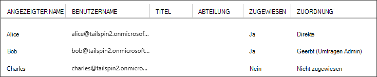

<properties
   pageTitle="Anwendungsrollen | Microsoft Azure"
   description="Durchführen von Autorisierung mithilfe von Anwendungsrollen"
   services=""
   documentationCenter="na"
   authors="MikeWasson"
   manager="roshar"
   editor=""
   tags=""/>

<tags
   ms.service="guidance"
   ms.devlang="dotnet"
   ms.topic="article"
   ms.tgt_pltfrm="na"
   ms.workload="na"
   ms.date="02/16/2016"
   ms.author="mwasson"/>

#  <a name="application-roles-in-multitenant-applications"></a>Anwendungsrollen mandantenfähigen Applikationen

[AZURE.INCLUDE [pnp-header](../../includes/guidance-pnp-header-include.md)]

Dieser Artikel ist [Teil einer Serie]. Außerdem ist eine vollständige [Beispiel] , das dieser Serie begleitet.

Anwendungsrollen werden verwendet, um Benutzern Berechtigungen zuzuweisen. Die [Tailspin Umfragen] [ Tailspin] Anwendung definiert die folgenden Rollen:

- Administrator. Können alle CRUD auf alle Vorgänge, die zu diesem Mandanten gehört.
- Ersteller. Können neue Umfragen erstellen.
- Reader. Umfragen, die zu diesem Mandanten gehören, können gelesen werden.

Sie können sehen, dass Rollen letztendlich bei der [Autorisierung]in Berechtigungen übersetzt werden. Aber die erste Frage zum Zuweisen und Verwalten von Rollen. Es identifiziert drei Optionen:

-   [Azure AD App-Rollen](#roles-using-azure-ad-app-roles)
-   [Azure Active Directory-Sicherheitsgruppen](#roles-using-azure-ad-security-groups)
-   [Anwendungsmanager Rolle](#roles-using-an-application-role-manager).

## <a name="roles-using-azure-ad-app-roles"></a>Azure AD App Rollen Rollen

Dies ist der Ansatz, den wir in Umfragen Tailspin-app verwendet.

Dabei definiert das SaaS-Anbieter Anwendungsrollen durch das Anwendungsmanifest hinzugefügt. Nachdem ein Kunde weist Administrator des Kunden AD-Verzeichnis Benutzer Rollen. Wenn sich ein Benutzer anmeldet, werden dem Benutzer zugewiesenen Rollen als Ansprüche gesendet.

> [AZURE.NOTE] Hat der Kunde Azure AD Premium, der Administrator kann eine Gruppe eine Rolle zuweisen und Mitglieder der Gruppe die Anwendungsrolle erbt. Ist eine bequeme Möglichkeit zum Verwalten von Rollen, Besitzer der Gruppe Administrator AD werden muss

Vorteile dieses Ansatzes:

-   Einfaches Programmiermodell.
-   Rollen sind anwendungsspezifisch. Die Rollenansprüche für eine Anwendung werden nicht in eine andere Anwendung gesendet.
-   Wenn der Kunde die Anwendung von AD-Mandanten entfernt, verschwinden die Rollen.
-   Die Anwendung benötigt kein zusätzlichen Active Directory-Berechtigungen, als das Profil des Benutzers gelesen.

Nachteile:

- Ohne Azure AD Premium zuordnen keine Rollen Sicherheitsgruppen. Für diese Kunden müssen alle Benutzer Aufgaben vom Administrator AD erfolgen.
- Haben Sie eine Back-End-Web-API ist getrennt von der Webanwendung anwenden nicht rollenzuweisungen für Web app Web API. Weitere Erläuterung dieses finden Sie unter [Sichern einer Back-End-web-API].

### <a name="implementation"></a>Implementierung

**Definieren Sie die Rollen.** SaaS-Anbieter deklariert die app Rollen im [Anwendungsmanifest]. Hier ist z. B. Manifesteintrags für Umfragen app:

```
"appRoles": [
  {
    "allowedMemberTypes": [
      "User"
    ],
    "description": "Creators can create Surveys",
    "displayName": "SurveyCreator",
    "id": "1b4f816e-5eaf-48b9-8613-7923830595ad",
    "isEnabled": true,
    "value": "SurveyCreator"
  },
  {
    "allowedMemberTypes": [
      "User"
    ],
    "description": "Administrators can manage the Surveys in their tenant",
    "displayName": "SurveyAdmin",
    "id": "c20e145e-5459-4a6c-a074-b942bbd4cfe1",
    "isEnabled": true,
    "value": "SurveyAdmin"
  }
],
```

Die `value` -Eigenschaft wird in der Rollenanspruch angezeigt. Die `id` -Eigenschaft ist der eindeutige Bezeichner für die Rolle. Immer einen neuen GUID-Wert für `id`.

**Benutzer zuweisen**. Wenn ein neuer Kunde wird die Anwendung des Kunden AD Mandanten registriert. An diesem Punkt kann Administrator AD, Pächter Rollen Benutzer zuweisen.

> [AZURE.NOTE] Wie bereits erwähnt, können Kunden mit Azure AD Sicherheitsgruppen auch Rollen zuweisen.

Der folgende Screenshot von Azure-Portal zeigt drei Benutzer. Alice wurde direkt eine Rolle zugewiesen. Bob vererbte Rolle als Mitglied einer Sicherheitsgruppe mit dem Namen "Umfragen Admin", die einer Rolle zugewiesen ist. Charles wird einer Rolle nicht zugewiesen.



> [AZURE.NOTE] Alternativ kann die Anwendung Rollen programmgesteuert zuweisen Azure AD Graph-API verwenden.  Dies erfordert jedoch die Anwendung Schreibberechtigungen für die Kunden AD-Verzeichnis zu. Eine Anwendung mit den Berechtigungen möglich viele Gefahren &mdash; Kunden vertrauen die Anwendung nicht zu ihrem Verzeichnis durcheinander. Viele Kunden möglicherweise nicht diese Zugriff gewährt.

**Rollenansprüche zu erhalten**. Wenn sich ein Benutzer anmeldet, empfängt die Anwendung dem Benutzer zugewiesenen Rollen einer Forderung mit `http://schemas.microsoft.com/ws/2008/06/identity/claims/role`.  

Benutzer können mehreren Rollen oder keine Rolle. In der Autorisierungscode nicht angenommen der Benutzer genau eine Rolle Anspruch hat. Schreiben Sie stattdessen Code, der überprüft, ob eine bestimmte Anspruchswert vorhanden ist:

```csharp
if (context.User.HasClaim(ClaimTypes.Role, "Admin")) { ... }
```

## <a name="roles-using-azure-ad-security-groups"></a>Rollen mit Azure Active Directory-Sicherheitsgruppen

Bei diesem Ansatz werden Rollen als Active Directory-Sicherheitsgruppen dargestellt. Die Anwendung weist Berechtigungen für Benutzer anhand deren Mitgliedschaft in Sicherheitsgruppen.

Vorteile:

-   Kunden, die keinen Azure AD Premium, ermöglicht dieser Ansatz den Kunden mit Sicherheitsgruppen Arbeitsaufträge für Benutzerrollen verwalten.

Nachteile:

- Komplexität. Da jeder Mieter verschiedene Gruppenansprüche sendet, die app muss Verfolgen der Sicherheitsgruppen, die die Anwendungsrollen für jeden Mandanten entsprechen.
- Kunden AD-Mandanten die Anwendung entfernt, bleiben die Sicherheitsgruppen in Active Directory Directory.

### <a name="implementation"></a>Implementierung

Legen Sie im Anwendungsmanifest die `groupMembershipClaims` -Eigenschaft auf "SecurityGroup". Dies ist erforderlich, Mitgliedschaft Gruppenansprüche AAD zu.

```
{
   // ...
   "groupMembershipClaims": "SecurityGroup",
}
```

Wenn ein neuer Kunde, weist die Anwendung der Kunde Sicherheitsgruppen für die Anwendung erforderlichen Rollen erstellen. Der Kunde muss die Gruppenobjekt-IDs in die Anwendung eingeben. Die Anwendung speichert diese in einer Tabelle, die Anwendungsrollen pro Mandant Gruppen-IDs zugeordnet.

> [AZURE.NOTE] Alternativ konnte die Anwendung erstellen Gruppen programmgesteuert mithilfe der Azure AD Graph-API.  Dies wäre weniger fehleranfällig. Jedoch muss die Anwendung "Lesen und Schreiben alle Gruppen" Berechtigungen für die Kunden AD-Verzeichnis. Viele Kunden möglicherweise nicht diese Zugriff gewährt.

Wenn ein Benutzer anmeldet:

1.  Die Anwendung empfängt die Benutzergruppen als Ansprüche. Der Wert jeder Anspruch ist die Objekt-ID einer Gruppe.
2.  Azure AD beschränkt die Anzahl der Gruppen im Token gesendet. Die Anzahl der Gruppen diesen Grenzwert überschreitet, sendet Azure AD einen besonderen "veralteten" Anspruch. Wenn der Anspruch vorhanden ist, muss die Anwendung Abfragen Azure AD Graph-API zu allen Gruppen, denen dieser Benutzer angehört. Einzelheiten finden Sie unter dem Abschnitt "Gruppen Anspruch Überschuss" [Autorisierung in AD-Gruppen mit Cloudanwendungen].
3.  Die Anwendung sucht die Objekt-IDs in einer eigenen Datenbank an die entsprechende Anwendung Rollen Benutzer zuweisen.
4.  Die Anwendung hinzugefügt, in der die Anwendungsrolle formuliert Benutzerprinzipals benutzerdefinierte Anspruchswert. Beispiel: `survey_role` = "SurveyAdmin".

Autorisierungsrichtlinien verwenden benutzerdefinierte Rollenanspruch nicht geltend machen.

## <a name="roles-using-an-application-role-manager"></a>Rollen eine Rolle Anwendungsmanager mit

Bei diesem Ansatz sind Anwendungsrollen nicht in Azure AD gespeichert. Stattdessen speichert die Anwendung Aufgaben Rolle für jeden Benutzer in der eigenen Datenbank &mdash; beispielsweise **RoleManager** -Klasse in ASP.NET Identität verwenden.

Vorteile:

-   Die Anwendung verfügt über Vollzugriff über die Rollen und Benutzer Aufgaben.

Nachteile:

- Komplexer und schwieriger zu verwalten.
- Können Active Directory-Sicherheitsgruppen Arbeitsaufträge für Benutzerrollen verwalten.
- Speichert Benutzerinformationen in der Datenbank, es mit der Mieter AD-Verzeichnis erhalten Benutzer hinzugefügt oder entfernt werden.   

Es gibt viele vorhandene Beispiele für diesen Ansatz. Beispielsweise finden Sie unter [erstellen eine ASP.NET MVC-Anwendung SQL DB mit Auth und in Azure App Service bereitstellen].

## <a name="next-steps"></a>Nächste Schritte

- Im nächsten Artikel dieser Reihe zu lesen: [und ressourcenbasierte Autorisierung in mandantenfähigen Applikationen][Autorisierung]

<!-- Links -->
[Tailspin]: guidance-multitenant-identity-tailspin.md
[Teil einer Serie]: guidance-multitenant-identity.md
[Autorisierung]: guidance-multitenant-identity-authorize.md
[Absichern von Back-End-Web-API]: guidance-multitenant-identity-web-api.md
[Erstellen einer ASP.NET MVC-Anwendung Authentifizierung mit SQL DB und in Azure App Service bereitstellen]: ../app-service-web/web-sites-dotnet-deploy-aspnet-mvc-app-membership-oauth-sql-database.md
[Anwendungsmanifest]: ../active-directory/active-directory-application-manifest.md
[Beispiel]: https://github.com/Azure-Samples/guidance-identity-management-for-multitenant-apps
