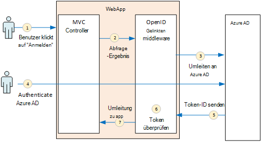
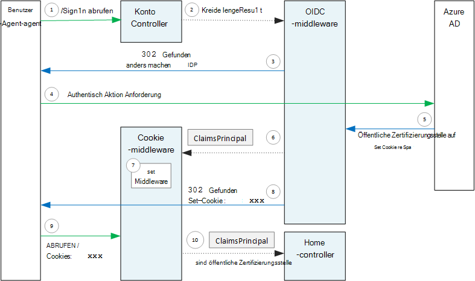

<properties
   pageTitle="Authentifizierung in mandantenfähigen Applikationen | Microsoft Azure"
   description="Wie kann eine mehrinstanzenfähige Anwendung von Azure AD Benutzerauthentifizierung"
   services=""
   documentationCenter="na"
   authors="MikeWasson"
   manager="roshar"
   editor=""
   tags=""/>

<tags
   ms.service="guidance"
   ms.devlang="dotnet"
   ms.topic="article"
   ms.tgt_pltfrm="na"
   ms.workload="na"
   ms.date="05/23/2016"
   ms.author="mwasson"/>

# <a name="authentication-in-multitenant-apps-using-azure-ad-and-openid-connect"></a>Authentifizierung in mandantenfähigen apps Azure AD- und OpenID

[AZURE.INCLUDE [pnp-header](../../includes/guidance-pnp-header-include.md)]

Dieser Artikel ist [Teil einer Serie](guidance-multitenant-identity.md). Außerdem ist eine vollständige [Beispiel] , das dieser Serie begleitet.

Dieser Artikel beschreibt, wie eine mehrinstanzenfähige Anwendung Benutzer von Azure Active Directory (Azure AD) mit OpenID verbinden (OIDC) zur Authentifizierung authentifizieren kann.

## <a name="overview"></a>Übersicht

Die [Implementierung des Verweis](guidance-multitenant-identity-tailspin.md) ist eine ASP.NET Core 1.0-Anwendung. Die Anwendung verwendet die integrierte OpenID verbinden Middleware Authentifizierungsablauf OIDC ausführen. Das folgende Diagramm zeigt, was geschieht, wenn der Benutzer auf einer hohen Ebene, signiert.



1.  Der Benutzer klickt auf die Schaltfläche "Anmelden" in der Anwendung. Diese Aktion wird von MVC-Controller behandelt.
2.  MVC-Controller gibt eine **ChallengeResult** -Aktion.
3.  Die Middleware fängt **ChallengeResult** und 302 Antwort leitet den Benutzer der Azure AD-Seite erstellt.
4.  Benutzerauthentifizierung mit Azure.
5.  Azure AD einen Token-ID an die Anwendung gesendet.
6.  Die Middleware überprüft das Token-ID an. Zu diesem Zeitpunkt wird er jetzt in der Anwendung authentifiziert.
7.  Die Middleware leitet den Benutzer zurück an die Anwendung.

## <a name="register-the-app-with-azure-ad"></a>Registrieren der Anwendung in Azure AD

Zum Aktivieren der OpenID verbinden registriert den Anbieter SaaS Anwendung im eigenen Azure AD-Mandanten.

Um die Anwendung zu registrieren, gehen Sie in [Applikationen Azure Active Directory Integration](../active-directory/active-directory-integrating-applications.md)im Abschnitt [Anwendung](../active-directory/active-directory-integrating-applications.md#adding-an-application).

Auf der Seite **Konfigurieren** :

-   Beachten Sie die Client-ID
-   **Multi-Tenant ist**wählen Sie **Ja**.
-   Soll **Antwort-URL** URL, Azure AD die Authentifizierungsantwort senden. Sie können die base-URL der Anwendung.
  - Hinweis: Der URL-Pfad, kann entspricht der Hostname der bereitgestellten Anwendung.
  - Sie können mehrere Antworten URLs festlegen. Während der Entwicklung können Sie eine `localhost` Adresse für die Anwendung lokal ausgeführt.
-   Erzeugen ein geheimen: unter **Schlüssel**sagt klicken Sie auf die Dropdownliste, **Wählen Sie Dauer** und Kommissionierung 1 oder 2 Jahre. Der Schlüssel werden angezeigt, wenn Sie auf **Speichern**klicken. Müssen Sie den Wert kopieren, da es nicht erneut angezeigt wird, wenn die Konfigurationsseite laden.

## <a name="configure-the-auth-middleware"></a>Konfigurieren Sie die Authentifizierung middleware

Dieser Abschnitt beschreibt die Middleware Authentifizierung in ASP.NET Core 1.0 mandantenfähigen Authentifizierung mit OpenID Connect konfigurieren.

Fügen Sie in die Startklasse Middleware OpenID verbinden:

```csharp
app.UseOpenIdConnectAuthentication(options =>
{
    options.AutomaticAuthenticate = true;
    options.AutomaticChallenge = true;
    options.ClientId = [client ID];
    options.Authority = "https://login.microsoftonline.com/common/";
    options.CallbackPath = [callback path];
    options.PostLogoutRedirectUri = [application URI];
    options.SignInScheme = CookieAuthenticationDefaults.AuthenticationScheme;
    options.TokenValidationParameters = new TokenValidationParameters
    {
        ValidateIssuer = false
    };
    options.Events = [event callbacks];
});
```

> [AZURE.NOTE] [Startup.cs](https://github.com/Azure-Samples/guidance-identity-management-for-multitenant-apps/blob/master/src/Tailspin.Surveys.Web/Startup.cs)anzeigen

Weitere Informationen über die Startklasse finden Sie in der Dokumentation zu ASP.NET Core 1.0 [Anwendungsstart](https://docs.asp.net/en/latest/fundamentals/startup.html) .

Legen Sie die folgenden Middleware-Optionen:

- **ClientId**. Die Anwendung Client-ID, die Sie haben, wenn Sie die Anwendung in Azure AD registriert.
- **Behörde**. Mandantenfähigen Anwendung legen Sie dies auf `https://login.microsoftonline.com/common/`. Dies ist die URL für den gemeinsamen Endpunkt Azure AD, der Benutzer alle Azure AD-Mandanten anmelden kann. Weitere Informationen zu gemeinsamen Endpunkt finden Sie in [diesem Blogbeitrag](http://www.cloudidentity.com/blog/2014/08/26/the-common-endpoint-walks-like-a-tenant-talks-like-a-tenant-but-is-not-a-tenant/).
- In **TokenValidationParameters** **ValidateIssuer** auf False festgelegt. Das bedeutet, dass die app Issuer-Wert in der Token-ID überprüft werden. (Die Middleware überprüft weiterhin das Token selbst). Weitere Informationen zum Überprüfen des Ausstellers finden Sie unter [Aussteller Validierung](guidance-multitenant-identity-claims.md#issuer-validation).
- **CallbackPath**. Legen Sie dies auf den Pfad in der Antwort-URL, die in Azure AD registriert. Beispielsweise ist die Antwort-URL `http://contoso.com/aadsignin`, **CallbackPath** sollte `aadsignin`. Wenn Sie diese Option festlegen, der Standardwert ist `signin-oidc`.
- **PostLogoutRedirectUri**. Geben Sie einen URL zum Benutzer nach der Abmeldung umgeleitet. Dies ist eine Seite, die anonyme Anfragen kann &mdash; normalerweise die Homepage.
- **SignInScheme**. Legen Sie den `CookieAuthenticationDefaults.AuthenticationScheme`. Dies bedeutet, dass nach der Benutzerauthentifizierung Benutzeransprüche lokal in einem Cookie gespeichert werden. Dieses Cookie wird wie der Benutzer während der Browsersitzung angemeldet bleibt.
- **Ereignisse.** Ereignisrückrufen; [Authentifizierungsereignisse](#authentication-events)anzeigen

Die Pipeline fügen Sie Cookieauthentifizierung Middleware hinzu. Diese Middleware ist verantwortlich für Benutzeransprüche in ein Cookie schreiben und lesen die Cookies bei nachfolgenden Seite geladen.

```csharp
app.UseCookieAuthentication(options =>
{
    options.AutomaticAuthenticate = true;
    options.AutomaticChallenge = true;
    options.AccessDeniedPath = "/Home/Forbidden";
});
```

## <a name="initiate-the-authentication-flow"></a>Starten Sie den Authentifizierungsablauf

Um den Authentifizierungsablauf in ASP.NET MVC zu **ChallengeResult** aus der Controller zurückgeben:

```csharp
[AllowAnonymous]
public IActionResult SignIn()
{
    return new ChallengeResult(
        OpenIdConnectDefaults.AuthenticationScheme,
        new AuthenticationProperties
        {
            IsPersistent = true,
            RedirectUri = Url.Action("SignInCallback", "Account")
        });
}
```

Dadurch wird die Middleware zurück an den Endpunkt Authentifizierung leitet 302 (Found) Antwort.

## <a name="user-login-sessions"></a>Benutzer-Login-sessions

Wie erwähnt, wenn der Benutzer zuerst anmeldet, schreibt die Cookieauthentifizierung Middleware Benutzeransprüche in einem Cookie. Danach werden HTTP-Anfragen anhand des Cookies authentifiziert.

Standardmäßig schreibt Middleware Cookie ein [Sitzungscookie][session-cookie], wird den Benutzer gelöscht den Browser schließt. Das nächste Mal, das der Benutzer anschließend die Site besucht, müssen erneut. Wenn Sie **IsPersistent** im **ChallengeResult**auf True festlegen, schreibt jedoch die Middleware ein dauerhaftes Cookie so Benutzer angemeldet bleibt nach dem Schließen des Browsers. Sie können Cookies; [steuern Optionen]finden Sie unter[cookie-options]. Persistente Cookies sind für den Benutzer jedoch möglicherweise für einige Programme (z. B. einer Banking-Anwendung), in dem der Benutzer jedes Mal anmelden soll.

## <a name="about-the-openid-connect-middleware"></a>Über die Middleware OpenID verbinden

OpenID verbinden Middleware in ASP.NET Blendet die meisten Protokolldetails. Dieser Abschnitt enthält Hinweise zur Implementierung, die für das Verständnis des Ablaufs Protokoll.

Zunächst betrachten wir den Authentifizierungsablauf in ASP.NET (die Details des Flusses OIDC Protokoll zwischen der Anwendung und Azure AD wird ignoriert). Das folgende Diagramm zeigt den Prozess.



In diesem Diagramm sind zwei MVC-Controller. Konto-Controller anmelden Anfragen verarbeitet und der Home-Controller bietet die Homepage.

Hier ist die Authentifizierung:

1. Der Benutzer klickt auf die Schaltfläche "Anmelden", und der Browser sendet eine GET-Anforderung. Beispiel: `GET /Account/SignIn/`.
2. Konto-Controller gibt eine `ChallengeResult`.
3. OIDC-Middleware gibt eine HTTP 302-Antwort Azure AD umleiten.
4. Der Browser sendet die Authentifizierungsanfrage Azure AD
5. Der Benutzer meldet sich bei Azure AD und Azure AD sendet eine Authentifizierungsantwort.
6. OIDC-Middleware Cookieauthentifizierung Middleware entgegengenommen und Ansprüche Prinzipal erstellt.
7. Cookie-Middleware Ansprüche Prinzipal serialisiert und ein Cookie festlegt.
8. OIDC-Middleware leitet Callback-URL der Anwendung.
10. Der Browser folgt der Umleitung, das Cookie in der Anforderung senden.
11. Cookie-Middleware deserialisiert das Cookie ein principal Ansprüche und legt `HttpContext.User` Prinzipal Ansprüchen entspricht. Die Anforderung wird an einen MVC-Controller weitergeleitet.

### <a name="authentication-ticket"></a>Authentifizierungsticket

Ist die Authentifizierung erfolgreich, erstellt OIDC Middleware ein Authentifizierungsticket enthält einen Principal Ansprüche, der der Benutzer Ansprüche enthält. Sie können das Ticket im Ereignis **AuthenticationValidated** oder **TicketReceived** zugreifen.

> [AZURE.NOTE] Bis zum Abschluss der gesamte Authentifizierungsablauf `HttpContext.User` gilt eine anonyme Principals _nicht_ authentifizierten Benutzer. Anonyme Prinzipal hat leeren Claims-Sammlung. Nach abgeschlossener Authentifizierung und leitet der app Cookie Middleware deserialisiert die Authentifizierungscookies und `HttpContext.User` , ein Principal Ansprüche, die den authentifizierten Benutzer darstellt.

### <a name="authentication-events"></a>Authentifizierungsereignisse

Während des Authentifizierungsvorgangs löst die Middleware OpenID verbinden eine Reihe von Ereignissen:

- **RedirectToAuthenticationEndpoint**. Rechts aufgerufen, bevor die Middleware Endpunkt Authentifizierung umgeleitet. Dieses Ereignis können den URL der Umleitung ändern. Wenn Sie beispielsweise Anforderungsparameter hinzufügen. Ein Beispiel finden Sie unter [Hinzufügen von Admin Zustimmung aufgefordert](guidance-multitenant-identity-signup.md#adding-the-admin-consent-prompt) .

- **AuthorizationResponseReceived**. Wird aufgerufen, nachdem die Middleware empfängt die Authentifizierungsantwort vom Identitätsanbieter (IDP), aber bevor die Middleware Antwort überprüft.  

- **AuthorizationCodeReceived**. Mit den Autorisierungscode aufgerufen.

- **TokenResponseReceived**. Wird aufgerufen, nachdem die Middleware Zugriff von IDP token erhält. Gilt nur für Autorisierung Code Flow.

- **AuthenticationValidated**. Wird aufgerufen, nachdem die Middleware-ID-Token überprüft. Die Anwendung hat jetzt ein überprüften Ansprüche der Benutzer. Sie können dieses Ereignis zusätzliche Validierung auf die Ansprüche und Transformieren von Ansprüchen. Finden Sie unter [Arbeiten mit](guidance-multitenant-identity-claims.md).

- **UserInformationReceived**. Die Middleware Benutzerprofil User Info-Endpunkt wird aufgerufen. Gilt nur für Autorisierung Code Flow und nur `GetClaimsFromUserInfoEndpoint = true` Middleware-Optionen.

- **TicketReceived**. Wird aufgerufen, wenn die Authentifizierung abgeschlossen ist. Dies ist das letzte Ereignis, wenn die Authentifizierung erfolgreich ist. Nachdem dieses Ereignis behandelt wird, ist der Benutzer in der app signiert.

- **AuthenticationFailed**. Aufgerufen, wenn die Authentifizierung fehlschlägt. Verwenden Sie dieses Ereignis behandeln Authentifizierungsfehler &mdash; z. B. durch eine Fehlerseite umleiten.

Um für diese Ereignisse bereitzustellen, die Option **Ereignisse** die Middleware fest Es gibt zwei Arten der Ereignishandler deklariert: Inline mit Lambdas oder eine Klasse, die von **OpenIdConnectEvents**abgeleitet wird.

Inline mit Lambda-Ausdrücken:

```csharp
app.UseOpenIdConnectAuthentication(options =>
{
    // Other options not shown.

    options.Events = new OpenIdConnectEvents
    {
        OnTicketReceived = (context) =>
        {
             // Handle event
             return Task.FromResult(0);
        },
        // other events
    }
});
```

Ableiten von **OpenIdConnectEvents**:

```csharp
public class SurveyAuthenticationEvents : OpenIdConnectEvents
{
    public override Task TicketReceived(TicketReceivedContext context)
    {
        // Handle event
        return base.TicketReceived(context);
    }
    // other events
}

// In Startup.cs:
app.UseOpenIdConnectAuthentication(options =>
{
    // Other options not shown.

    options.Events = new SurveyAuthenticationEvents();
});
```

Beim zweiten Ansatz wird empfohlen, Ihre Ereignisrückrufen erhebliche Logik haben, damit sie die Startklasse Unordnung nicht. Unsere referenzimplementierung verwendet diesen Ansatz. [SurveyAuthenticationEvents.cs](https://github.com/Azure-Samples/guidance-identity-management-for-multitenant-apps/blob/master/src/Tailspin.Surveys.Web/Security/SurveyAuthenticationEvents.cs)anzeigen

### <a name="openid-connect-endpoints"></a>OpenID Endpunkte verbinden

Azure AD unterstützt [OpenID verbinden Discovery](https://openid.net/specs/openid-connect-discovery-1_0.html), wobei der Identitätsanbieter (IDP) von einem [bekannten Endpunkt](https://openid.net/specs/openid-connect-discovery-1_0.html#ProviderConfig)JSON-Metadatendokument gibt. Das Dokument enthält Informationen wie:

-   Der URL des Endpunkts Autorisierung. Dies ist, leitet die Anwendung den Benutzer authentifizieren.
-   Die URL "Beenden" Endpunkt, die Anwendung Abmelden der Benutzer wechselt.
-   Die URL zu der Signaturschlüssel verwendet der Client OIDC Token überprüft, die aus der IDP abruft.

Standardmäßig kann die Middleware OIDC Metadaten abzurufen. Die **Behörde** Option in die Middleware und die Middleware erstellt die URL für die Metadaten. (Sie können die URL **MetadataAddress** Einstellung überschreiben.)

### <a name="openid-connect-flows"></a>OpenID Flows verbinden

OIDC-Middleware verwendet Hybrid Flow mit Formular Post Modus.

-   _Hybrid_ bedeutet erhalten Client ein ID-Token und einen Autorisierungscode in derselben Roundtrip zum autorisierungsserver.
-   _Bereitstellungsformular Antwort Modus_ bedeutet, dass der autorisierungsserver eine HTTP POST-Anforderung verwendet, um Kennung Token und Autorisierung an die Anwendung senden. Die Werte sind Form-Urlencoded (content-Type = "Application/X-www-form-urlencoded").

Wenn Middleware OIDC Autorisierung Endpunkt leitet enthält den URL der Umleitung die Abfragezeichenfolgen-Parameter von OIDC benötigt. Für den Hybrid-Verlauf:

-   Client_id. Dieser Wert wird in der Option **ClientId** festgelegt.
-   Bereich = "Openid Profil" ist eine OIDC-Anforderung und wir möchten das Profil des Benutzers.
-   Antworttyp = "code ID-Token". Hybrid-Flow gibt.
-   Response_mode = "Form_post". Formular-Post-Antwort gibt.

Um einen anderen Fluss anzugeben, legen Sie die Eigenschaft **ResponseType** auf Optionen. Zum Beispiel:

```csharp
app.UseOpenIdConnectAuthentication(options =>
{
    options.ResponseType = "code"; // Authorization code flow

    // Other options
}
```

## <a name="next-steps"></a>Nächste Schritte

- Im nächsten Artikel dieser Reihe zu lesen: [Arbeiten mit anspruchsbasierte Identität mandantenfähigen Applikationen][claims]


[claims]: guidance-multitenant-identity-claims.md
[cookie-options]: https://docs.asp.net/en/latest/security/authentication/cookie.html#controlling-cookie-options
[session-cookie]: https://en.wikipedia.org/wiki/HTTP_cookie#Session_cookie
[Beispiel]: https://github.com/Azure-Samples/guidance-identity-management-for-multitenant-apps
