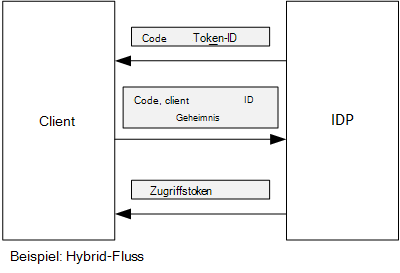

<properties
   pageTitle="Mit Client-Assertion Zugriffstoken von Azure AD | Microsoft Azure"
   description="Wie Client Assertion Zugriffstoken von Azure AD abgerufen."
   services=""
   documentationCenter="na"
   authors="MikeWasson"
   manager="roshar"
   editor=""
   tags=""/>

<tags
   ms.service="guidance"
   ms.devlang="dotnet"
   ms.topic="article"
   ms.tgt_pltfrm="na"
   ms.workload="na"
   ms.date="05/23/2016"
   ms.author="mwasson"/>

# <a name="using-client-assertion-to-get-access-tokens-from-azure-ad"></a>Verwendung von Client-Assertion Zugriffstoken von Azure AD

[AZURE.INCLUDE [pnp-header](../../includes/guidance-pnp-header-include.md)]

Dieser Artikel ist [Teil einer Serie]. Außerdem ist eine vollständige [Beispiel] , das dieser Serie begleitet.

## <a name="background"></a>Hintergrund

Bei Autorisierung Code Flow oder hybride Fluss OpenID Connect tauscht der Client einen Autorisierungscode ein Zugriffstoken. In diesem Schritt muss der Client sich an den Server zu authentifizieren.



Eine Möglichkeit zur Authentifizierung des Clients ist die Verwendung eines geheimen. Das wie [Tailspin Umfragen] [ Surveys] Anwendung standardmäßig konfiguriert.

Hier ist eine Beispiel-Anforderung vom Client an IDP Zugriffstoken anfordern. Hinweis Die `client_secret` Parameter.

```
POST https://login.microsoftonline.com/b9bd2162xxx/oauth2/token HTTP/1.1
Content-Type: application/x-www-form-urlencoded

resource=https://tailspin.onmicrosoft.com/surveys.webapi
  &client_id=87df91dc-63de-4765-8701-b59cc8bd9e11
  &client_secret=i3Bf12Dn...
  &grant_type=authorization_code
  &code=PG8wJG6Y...
```

Das Geheimnis ist nur eine Zeichenfolge und haben keine Speicherverluste Wert. Empfiehlt die geheimen aus Datenquellen-Steuerelement zu. Bei der Bereitstellung in Azure speichert ihn in einer [app Einstellung][configure-web-app].

Jedoch kann jeder Benutzer mit Zugriff auf den Azure-Abonnement Appeinstellungen anzeigen. Außerdem ist immer zu Geheimnisse in Datenquellen-Steuerelement (z. B. in Bereitstellungsskripts), per e-Mail freigeben, usw..

Für zusätzliche Sicherheit können Sie statt eines geheimen [Client Assertion] . Mit Client verwendet der Client ein x. 509-Zertifikat um zu beweisen, dass der Client token Anforderung stammt. Das Clientzertifikat ist auf dem Webserver installiert. Im Allgemeinen werden vereinfacht den Zugriff auf das Zertifikat einschränken als um sicherzustellen, dass niemand versehentlich einen geheimen zeigt. Weitere Informationen zum Konfigurieren von Zertifikaten in einer Webanwendung finden Sie unter [Zertifikate in Azure Websites Applikationen verwenden][using-certs-in-websites]

Mit Client-Assertion token Anforderung wird:

```
POST https://login.microsoftonline.com/b9bd2162xxx/oauth2/token HTTP/1.1
Content-Type: application/x-www-form-urlencoded

resource=https://tailspin.onmicrosoft.com/surveys.webapi
  &client_id=87df91dc-63de-4765-8701-b59cc8bd9e11
  &client_assertion_type=urn:ietf:params:oauth:client-assertion-type:jwt-bearer
  &client_assertion=eyJhbGci...
  &grant_type=authorization_code
  &code= PG8wJG6Y...
```

Beachten Sie, dass die `client_secret` Parameter wird nicht verwendet. In diesem Fall die `client_assertion` Parameter enthält ein JWT-Token, das das Client-Zertifikat signiert wurde. Die `client_assertion_type` Parameter gibt den Typ der Assertion &mdash; in diesem Fall JWT-Token. Der Server überprüft das JWT-Token. Wenn das JWT-Token ungültig ist, zurückgegeben token-Anforderung ein Fehler.

> [AZURE.NOTE] X. 509-Zertifikate sind nicht die einzige Art von Client-Assertion. Wir möchten es hier von Azure AD unterstützt wird.

## <a name="using-client-assertion-in-the-surveys-application"></a>Verwenden von Client-Assertion in Umfragen Anwendung

Dieser Abschnitt zeigt die Tailspin Umfragen Anwendung Assertion Client konfigurieren. In diesen Schritten erstellen Sie ein selbstsigniertes Zertifikat für Entwicklung, jedoch nicht für die Produktion.

1. Ausführen des PowerShell-Skript [/Scripts/Setup-KeyVault.ps1] [ Setup-KeyVault] wie folgt:

    ```
    .\Setup-KeyVault.ps -Subject [subject]
    ```

    Für die `Subject` Parameter Geben Sie einen beliebigen Namen wie "Surveysapp". Das Skript generiert ein selbstsigniertes Zertifikat und speichert sie im Zertifikatspeicher "Aktueller Benutzer/eigene".

2. Die Ausgabe des Skripts ist ein JSON-Fragment. Hinzufügen dieses Anwendungsmanifest Web App wie folgt:

    1. Melden Sie sich bei [Azure-Verwaltungsportal] [ azure-management-portal] und zum Azure AD Verzeichnis navigieren.

    2. Klicken Sie auf **Anwendung**.

    3. Wählen Sie die Anwendung Umfragen.

    4.  **Manifest verwalten** und wählen Sie **Manifest herunterladen**.

    5.  Öffnen Sie die JSON-Manifestdatei in einem Texteditor. Fügen Sie die Ausgabe des Skripts in der `keyCredentials` Eigenschaft. Es sollte wie folgt aussehen:

        ```    
        "keyCredentials": [
            {
              "type": "AsymmetricX509Cert",
              "usage": "Verify",
              "keyId": "29d4f7db-0539-455e-b708-....",
              "customKeyIdentifier": "ZEPpP/+KJe2fVDBNaPNOTDoJMac=",
              "value": "MIIDAjCCAeqgAwIBAgIQFxeRiU59eL.....
            }
          ],
         ```

    6.  Speichern der JSON-Datei.

    7.  Zurück zum Portal. Klicken Sie auf **Verwalten Manifest** > **Manifest hochladen** und die JSON-Datei hochladen.

3. Führen Sie den folgenden Befehl den Fingerabdruck des Zertifikats.

    ```
    certutil -store -user my [subject]
    ```

    wo `[subject]` ist der Wert, der in der PowerShell-Skript für Betreff angegeben. Der Fingerabdruck wird unter "Cert Hash(SHA1):" aufgelistet. Entfernen Sie die Leerzeichen zwischen den hexadezimalen Zahlen.

4. Aktualisieren Sie Ihre app Geheimnisse. Im Projektmappen-Explorer Maustaste Tailspin.Surveys.Web-Projekt, und wählen Sie **Vertrauliche Benutzerdaten verwalten**. Fügen Sie für "Asymmetrisch" unter "AzureAd" wie folgt:

    ```
    {
      "AzureAd": {
        "ClientId": "[Surveys application client ID]",
        // "ClientSecret": "[client secret]",  << Delete this entry
        "PostLogoutRedirectUri": "https://localhost:44300/",
        "WebApiResourceId": "[App ID URI of your Survey.WebAPI application]",
        // new:
        "Asymmetric": {
          "CertificateThumbprint": "[certificate thumbprint]",  // Example: "105b2ff3bc842c53582661716db1b7cdc6b43ec9"
          "StoreName": "My",
          "StoreLocation": "CurrentUser",
          "ValidationRequired": "false"
        }
      },
      "Redis": {
        "Configuration": "[Redis connection string]"
      }
    }
    ```

    Sie müssen festlegen, `ValidationRequired` auf false, da das Zertifikat nicht von Root CA Behörde unterzeichnet wurde. In der Produktion verwendet ein Zertifikat, das von einer Behörde Zertifizierungsstelle signiert und legen `ValidationRequired` auf True.

    Außerdem löschen Sie den Eintrag für `ClientSecret`, da es nicht mit Client erforderlich ist.

5. Suchen Sie im Startup.cs, den Code registriert die `ICredentialService`. Kommentieren Sie die Zeile verwendet `CertificateCredentialService`, und kommentieren Sie die Zeile verwendet `ClientCredentialService`:

    ```csharp
    // Uncomment this:
    services.AddSingleton<ICredentialService, CertificateCredentialService>();
    // Comment out this:
    //services.AddSingleton<ICredentialService, ClientCredentialService>();
    ```

Zur Laufzeit liest die Anwendung das Zertifikat aus dem Zertifikatspeicher. Das Zertifikat muss auf demselben Computer wie der Webanwendung installiert.

## <a name="next-steps"></a>Nächste Schritte

- Im nächsten Artikel dieser Reihe zu lesen: [Mithilfe von Azure Key Vault Anwendung Kennwörter schützen][key vault]


<!-- Links -->
[configure-web-app]: ../app-service-web/web-sites-configure.md
[azure-management-portal]: https://manage.windowsazure.com
[Client-assertion]: https://tools.ietf.org/html/rfc7521
[key vault]: guidance-multitenant-identity-keyvault.md
[Setup-KeyVault]: https://github.com/Azure-Samples/guidance-identity-management-for-multitenant-apps/blob/master/scripts/Setup-KeyVault.ps1
[Surveys]: guidance-multitenant-identity-tailspin.md
[using-certs-in-websites]: https://azure.microsoft.com/blog/using-certificates-in-azure-websites-applications/
[Teil einer Serie]: guidance-multitenant-identity.md
[Beispiel]: https://github.com/Azure-Samples/guidance-identity-management-for-multitenant-apps
