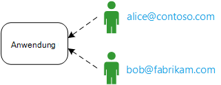
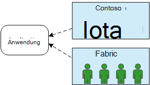
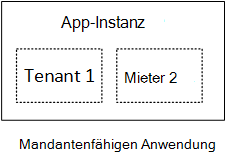
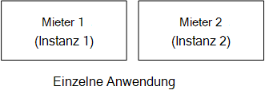
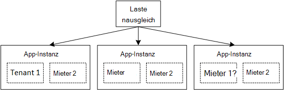

<properties
   pageTitle="Identitätsmanagement für mandantenfähigen Applikationen | Microsoft Azure"
   description="Einführung in Identitätsmanagement mandantenfähigen Applikationen"
   services=""
   documentationCenter="na"
   authors="MikeWasson"
   manager="roshar"
   editor=""
   tags=""/>

<tags
   ms.service="guidance"
   ms.devlang="dotnet"
   ms.topic="article"
   ms.tgt_pltfrm="na"
   ms.workload="na"
   ms.date="06/02/2016"
   ms.author="mwasson"/>

# Einführung in Identitätsmanagement für mandantenfähigen Applikationen in Microsoft Azure

[AZURE.INCLUDE [pnp-header](../../includes/guidance-pnp-header-include.md)]

Dieser Artikel ist [Teil einer Serie]. Außerdem ist eine vollständige [Beispiel] , das dieser Serie begleitet.

Angenommen, Sie schreiben ein Unternehmen SaaS-Anwendung in der Cloud gehostet werden. Natürlich haben die Anwendung Benutzer:

Aber diejenigen Unternehmen:

Beispiel: Tailspin verkauft Abonnements SaaS Anwendung. Contoso und Fabrikam melden sich für die Anwendung. Wenn Alice (`alice@contoso`) Zeichen in die Anwendung sollten wissen, dass Alice Teil von Contoso.

- Alice _sollte_ Zugang zu Contoso Daten.
- Alice _sollte_ haben Zugriff auf Daten von Fabrikam.

Diese Anleitung wird gezeigt, wie Verwaltung von Benutzeridentitäten in einer mehrinstanzenfähigen Anwendung mit [Azure Active Directory] [ AzureAD] (Azure AD)-Anmeldung und Authentifizierung.

## Was ist mandatenfähiges?

Ein _Mieter_ ist eine Gruppe von Benutzern. In einer SaaS-Anwendung ist der Mieter ein Abonnent oder Kunden der Anwendung. _Tenancy_ ist eine Architektur, in dem mehrere Mandanten gleiche physische Instanz der app freigeben. Obwohl Mieter physische Ressourcen (wie VMs oder Speicher) verwenden, wird jeder seine logische Instanz der app.

Normalerweise werden die Benutzer in ein Mieter, jedoch nicht mit anderen Mandanten Daten verteilt.

Vergleichen Sie diese Architektur mit einer einzelnen Mieter Architektur hat jeder auf eine dedizierte physische Instanz In einer Single-Tenant-Architektur fügen Sie Mandanten einrichten neuer Instanzen der Anwendung hinzu.

### Mandatenfähiges und horizontale Skalierung

Um die Skalierung in der Cloud ist es üblich, weitere physische Instanzen hinzufügen. Dies wird als _horizontale Skalierung_ oder _scaling-out_bezeichnet. Sollten Sie eine Webanwendung. Behandeln Sie mehr Datenverkehr können weitere Server VMs hinzufügen und hinter einem Lastenausgleich. Jede VM wird eine separate physische Instanz der Web-app.

Anfragen kann einer beliebigen Instanz weitergeleitet werden. Fungiert das System als einzelne logische Instanz. Beenden einer VM, oder einen neuen virtuellen Computer hochfahren, ohne Benutzer. In dieser Architektur jeweils physischen ist Multi-Tenant und skalieren, indem Sie mehrere Instanzen. Wenn einmal ausfällt, sollten keine Mieter beeinflussen.

## Identität in einer mehrinstanzenfähigen Anwendung

In einer mehrinstanzenfähigen app müssen Sie Benutzer im Kontext der Mieter berücksichtigen.

**Authentifizierung**

- Benutzer der Anwendung mit ihrer Organisation anmelden. Sie müssen neue Benutzerprofile für die Anwendung erstellen.
- Benutzer innerhalb derselben Organisation sind Teil der gleichen Mieter.
- Wenn sich ein Benutzer anmeldet, weiß die Anwendung die Mieter der Benutzer angehört.

**Autorisierung**

- Beim Autorisieren des Benutzers Aktionen (z.B. eine Ressource anzeigen) berücksichtigen die Anwendung des Benutzers Mieter.
- Benutzer können Rollen in der Anwendung "Admin" oder "Standardbenutzer" zugewiesen werden. Arbeitsaufträge für Benutzerrollen sollte der Kunde nicht vom SaaS-Anbieter verwaltet werden.

**Beispiel.** Alice bei Contoso zur Anwendung in ihrem Browser navigiert und klickt auf die Schaltfläche "Anmelden". Sie wird eine Anmeldeseite umgeleitet, wo sie ihre corporate Anmeldeinformationen (Benutzername und Kennwort) eingibt. Sie ist nun der Anwendung als angemeldet `alice@contoso.com`. Die Anwendung weiß auch, dass Alice ein Administrator für diese Anwendung. Da sie Administrator ist, sehen sie eine Liste aller Ressourcen, die Contoso gehören. Sie können jedoch Fabrikam Ressourcen anzeigen, da sie Administrator in ihrem Mandanten ist.

In dieser Anleitung betrachten wir ausdrücklich Azure AD-Identity Management.

- Wir gehen davon aus, dass Kunden ihre Benutzerprofile in Azure AD (einschließlich Office365 und Dynamics CRM Mieter) speichert
- Können Kunden mit lokalen Active Directory (AD) [Azure AD Connect] [ ADConnect] ihre lokale AD mit Azure AD synchronisieren.

Wenn ein Kunde mit lokalen Azure AD Connect (durch IT Unternehmensrichtlinien oder aus anderen Gründen) verwenden kann, ist mit dem Kunden Provider Föderation kann SaaS AD über Active Directory-Verbunddienste (AD FS). [Föderation mit einem Kunden AD FS]beschreibt diese Option.

Andere Aspekte der Tenancy wie Datenpartitionierung pro Mieter Konfiguration, und berücksichtigt dieser Anleitung nicht.

## Nächste Schritte

- Im nächsten Artikel dieser Reihe zu lesen: [über Tailspin Umfragen Anwendung][tailpin]

<!-- Links -->
[ADConnect]: ../active-directory/active-directory-aadconnect.md
[AzureAD]: https://azure.microsoft.com/documentation/services/active-directory/
[Teil einer Serie]: guidance-multitenant-identity.md
[Föderation mit einem Kunden AD FS]: guidance-multitenant-identity-adfs.md
[Beispiel]: https://github.com/Azure-Samples/guidance-identity-management-for-multitenant-apps
[tailpin]: guidance-multitenant-identity-tailspin.md
