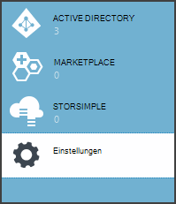
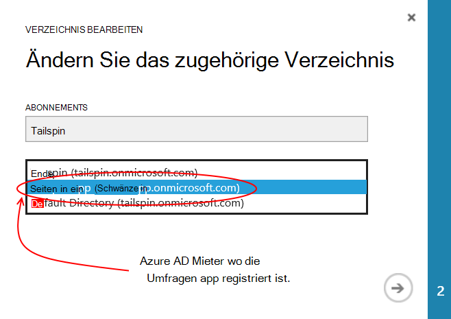
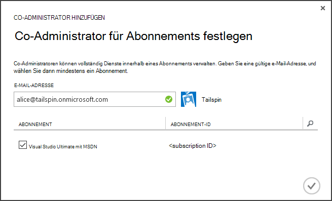
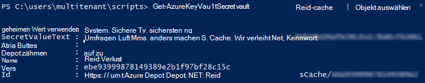

<properties
   pageTitle="Mit Key Vault Anwendung Kennwörter schützen | Microsoft Azure"
   description="Wie verwenden Schlüssel Depot Service Anwendung Kennwörter speichern"
   services=""
   documentationCenter="na"
   authors="MikeWasson"
   manager="roshar"
   editor=""
   tags=""/>

<tags
   ms.service="guidance"
   ms.devlang="dotnet"
   ms.topic="article"
   ms.tgt_pltfrm="na"
   ms.workload="na"
   ms.date="02/16/2016"
   ms.author="mwasson"/>

# <a name="using-azure-key-vault-to-protect-application-secrets"></a>Mithilfe von Azure Key Vault Anwendung Kennwörter schützen

[AZURE.INCLUDE [pnp-header](../../includes/guidance-pnp-header-include.md)]

Dieser Artikel ist [Teil einer Serie]. Außerdem ist eine vollständige [Beispiel] , das dieser Serie begleitet.

## <a name="overview"></a>Übersicht

Es ist üblich, Einstellungen sind und geschützt werden müssen, wie:

- Datenbank-Verbindungszeichenfolgen
- Kennwörter
- Kryptografische Schlüssel

Als bewährte Methode speichern Sie diese vertraulichen Daten nie im Datenquellen-Steuerelement. Es ist zu einfach für sie Speicherverluste &mdash; ist der Quellcoderepository private. Und nicht nur Schlüssel aus dem öffentlich. Größere Projekte möchten Entwickler beschränken und Operatoren können die Produktion Schlüssel zugreifen. (Standardeinstellungen für Test- oder Umgebung unterscheiden.)

Eine sicherere ist, diese geheime Daten in [Azure Key Vault]speichern[KeyVault]. Key Vault ist eine Cloud-gehosteten Dienst für kryptografische Schlüssel und anderen vertraulichen. Dieser Artikel beschreibt, wie Sie Schlüssel Depot Konfigurationen für die app speichern.

[Tailspin Umfragen] in[ Surveys] , die Folgendes sind geheime:

- Die Datenbank-Verbindungszeichenfolge.
- Die Redis-Verbindungszeichenfolge.
- Das Client-Kennwort für die Anwendung.

Zum Speichern von geheimen Konfigurationsinformationen in Schlüssel Depot Umfragen Anwendung implementiert einen Konfiguration-Anbieter in ASP.NET Core 1.0 [Konfigurationssystem]Haken[configuration]. Der benutzerdefinierte Anbieter Konfigurationen aus Schlüssel Depot beim Start gelesen.

Umfragen Anwendung lädt Konfigurationsdateien von folgenden Stellen:

- Die appsettings.json-Datei
- [Speichern Sie vertrauliche Benutzerdaten] [ user-secrets] (Umgebung nur zu Testzwecken)
- Die Hostingumgebung (app Settings in Azure webapps)
- Key Vault

Alle diese überschreibt das vorige, damit alle Einstellungen im Schlüsseltresor Vorrang.

> [AZURE.NOTE] Key Vault Konfigurationsanbieter ist standardmäßig deaktiviert. Es ist nicht erforderlich für die Anwendung lokal ausgeführt. Sie könnten sie in eine Bereitstellung in der Produktion.

> Key Vault-Anbieter wird derzeit nicht unterstützt für .NET Core da muss [Microsoft.Azure.KeyVault] [ Microsoft.Azure.KeyVault] Paket.

Beim Start die Anwendung liest Einstellungen aus jeder registrierte Konfigurationsanbieter und stark typisierte Optionsobjekt aufgefüllt wird. (Weitere Informationen finden Sie unter [verwenden und Objekte][options].)

## <a name="implementation"></a>Implementierung

[KeyVaultConfigurationProvider] [ KeyVaultConfigurationProvider] Klasse ist eine an ASP.NET Core 1.0 [Konfigurationssystem]Konfigurationsanbieter[configuration].

Mit den `KeyVaultConfigurationProvider`, rufen Sie die `AddKeyVaultSecrets` Erweiterungsmethode in die Startklasse:

```csharp
    var builder = new ConfigurationBuilder()
        .SetBasePath(appEnv.ApplicationBasePath)
        .AddJsonFile("appsettings.json");

    if (env.IsDevelopment())
    {
        builder.AddUserSecrets();
    }
    builder.AddEnvironmentVariables();
    var config = builder.Build();

    // Add key vault configuration:
    builder.AddKeyVaultSecrets(config["AzureAd:ClientId"],
        config["KeyVault:Name"],
        config["AzureAd:Asymmetric:CertificateThumbprint"],
        Convert.ToBoolean(config["AzureAd:Asymmetric:ValidationRequired"]),
        loggerFactory);
```

Beachten Sie, dass `KeyVaultConfigurationProvider` erfordert einige Konfigurationen, die in einer anderen Konfiguration Quelle gespeichert werden.

Beim Starten der Anwendung `KeyVaultConfigurationProvider` Listet alle Schlüssel im schlüsseltresor. Für jeden Schlüssel sieht es für ein Tag mit dem Namen "ConfigKey". Der Wert des Tags ist der Name der Einstellung.

> [AZURE.NOTE] [Tags] [ key-tags] sind optionale Metadaten mit einem Schlüssel gespeichert. Tags werden hier verwendet, da Namen Doppelpunkt (:) Zeichen enthalten können.

```csharp
var kvClient = new KeyVaultClient(GetTokenAsync);
var secretsResponseList = await kvClient.GetSecretsAsync(_vault, MaxSecrets, token);
foreach (var secretItem in secretsResponseList.Value)
{
    //The actual config key is stored in a tag with the Key "ConfigKey"
    // because ':' is not supported in a shared secret name by Key Vault.
    if (secretItem.Tags != null && secretItem.Tags.ContainsKey(ConfigKey))
    {
        var secret = await kvClient.GetSecretAsync(secretItem.Id, token);
        Data.Add(secret.Tags[ConfigKey], secret.Value);
    }
}
```

> [AZURE.NOTE] [KeyVaultConfigurationProvider.cs]anzeigen

## <a name="setting-up-key-vault-in-the-surveys-app"></a>Key Vault einrichten in Umfragen app

Komponenten:

- [Azure-Ressourcen-Manager-Cmdlets]installieren[azure-rm-cmdlets].
- Konfigurieren Sie die Umfragen Anwendung wie [die Umfragen läuft]unter[readme].

Allgemeine Schritte aus:

1. Ein Administrator in der Mandanten einrichten.
2. Richten Sie ein Client-Zertifikat.
3. Erstellen Sie ein Schlüssel Depot.
4. Fügen Sie Ihre Schlüssel Tresor.
5. Kommentieren Sie den Code, der schlüsseltresor ermöglicht.
6. Aktualisieren der Anwendung Benutzer Kennwörter.

### <a name="set-up-an-admin-user"></a>Admin-Benutzer einrichten

> [AZURE.NOTE] Erstellen Sie ein Key Depot verwenden Sie ein Konto der Azure-Abonnement verwalten können. Außerdem muss jeder Anwendung autorisieren Key Vault gelesen denselben Mandanten als das Konto registriert.

In diesem Schritt werden Sie sicherstellen, dass wichtige Vault angemeldet als Benutzer vom Mieter erstellen, Umfragen app registriert.

Erstens wechseln Sie Ihre Azure-Abonnement zugeordnet.

1. [Azure-Verwaltungsportal] anmelden[azure-management-portal]

2. **Klicken Sie auf.**

    

3. Wählen Sie Ihre Azure-Abonnement.

4. Klicken Sie auf **Verzeichnis bearbeiten** am unteren Rand des Portals.

    

5. In "Ändern Sie zugeordnete Verzeichnis", wählen Sie Umfragen Anwendung Sitz Azure AD-Mandanten,

    

6. Klicken Sie auf den Pfeil, und führen Sie im Dialogfeld.

Erstellen Sie einen Administrator in Azure AD Mieter, Umfragen Anwendung registriert wird.

1. Melden Sie sich bei [Azure-Verwaltungsportal][azure-management-portal].

2. Wählen Sie die Azure AD-Mandanten, in dem die Anwendung registriert wird.

3. Klicken Sie auf **Benutzer** > **Benutzer hinzufügen**.

4. Klicken Sie im Dialogfeld **Benutzer hinzufügen** der globalen Administratorrolle weisen Sie Benutzer zu.

Admin-Benutzer als Co-Administrator für Ihre Azure-Abonnement hinzufügen.

1. Melden Sie sich bei [Azure-Verwaltungsportal][azure-management-portal].

2. **Klicken Sie** , und wählen Sie Ihre Azure-Abonnement.

3. Klicken Sie auf **Administratoren**

4. Klicken Sie auf der Portalwebsite **Hinzufügen** .

5. Geben Sie die e-Mail der Administratorbenutzer, den Sie zuvor erstellt haben.

6. Aktivieren Sie das Kontrollkästchen für das Abonnement.

7. Klicken Sie auf das Kontrollkästchen, um das Dialogfeld abzuschließen.




### <a name="set-up-a-client-certificate"></a>Richten Sie ein Clientzertifikat

1. Ausführen des PowerShell-Skript [/Scripts/Setup-KeyVault.ps1] [ Setup-KeyVault] wie folgt:
    ```
    .\Setup-KeyVault.ps1 -Subject <<subject>>
    ```
    Für die `Subject` Parameter Geben Sie einen beliebigen Namen wie "Surveysapp". Das Skript generiert ein selbstsigniertes Zertifikat und speichert sie im Zertifikatspeicher "Aktueller Benutzer/eigene".

2. Die Ausgabe des Skripts ist ein JSON-Fragment. Hinzufügen dieses Anwendungsmanifest Web App wie folgt:

    1. Melden Sie sich bei [Azure-Verwaltungsportal] [ azure-management-portal] und zum Azure AD Verzeichnis navigieren.

    2. Klicken Sie auf **Anwendung**.

    3. Wählen Sie die Anwendung Umfragen.

    4.  **Manifest verwalten** und wählen Sie **Manifest herunterladen**.

    5.  Öffnen Sie die JSON-Manifestdatei in einem Texteditor. Fügen Sie die Ausgabe des Skripts in der `keyCredentials` Eigenschaft. Es sollte wie folgt aussehen:
    ```
            "keyCredentials": [
                {
                  "type": "AsymmetricX509Cert",
                  "usage": "Verify",
                  "keyId": "29d4f7db-0539-455e-b708-....",
                  "customKeyIdentifier": "ZEPpP/+KJe2fVDBNaPNOTDoJMac=",
                  "value": "MIIDAjCCAeqgAwIBAgIQFxeRiU59eL.....
                }
              ],
    ```          
    6.  Speichern der JSON-Datei.

    7.  Zurück zum Portal. Klicken Sie auf **Verwalten Manifest** > **Manifest hochladen** und die JSON-Datei hochladen.

3. Das Anwendungsmanifest Web-API (Surveys.WebAPI) das gleiche JSON-Fragment hinzugefügt.

4. Führen Sie den folgenden Befehl den Fingerabdruck des Zertifikats.
    ```
    certutil -store -user my [subject]
    ```
    wo `[subject]` ist der Wert, der in der PowerShell-Skript für Betreff angegeben. Der Fingerabdruck wird unter "Cert Hash(SHA1):" aufgelistet. Entfernen Sie die Leerzeichen zwischen den hexadezimalen Zahlen.

Den Fingerabdruck wird später verwendet werden.

### <a name="create-a-key-vault"></a>Ein Schlüssel Depot erstellen

1. Ausführen des PowerShell-Skript [/Scripts/Setup-KeyVault.ps1] [ Setup-KeyVault] wie folgt:

    ```
    .\Setup-KeyVault.ps1 -KeyVaultName <<key vault name>> -ResourceGroupName <<resource group name>> -Location <<location>>
    ```

    Wenn aufgefordert, Anmeldeinformationen einzugeben, melden Sie sich als Azure AD-Benutzer die zuvor erstellte. Das Skript erstellt eine neue Ressourcengruppe und einen neuen Schlüssel Vault innerhalb dieser Ressourcengruppe.

    Hinweis: für den Position-Parameter können Sie den folgenden PowerShell-Befehl eine Liste der gültigen Bereiche:

    ```
    Get-AzureRmResourceProvider -ProviderNamespace "microsoft.keyvault" | Where-Object { $_.ResourceTypes.ResourceTypeName -eq "vaults" } | Select-Object -ExpandProperty Locations
    ```

2. Führen Sie SetupKeyVault.ps wieder mit den folgenden Parametern:

    ```
    .\Setup-KeyVault.ps1 -KeyVaultName <<key vault name>> -ApplicationIds @("<<web app client ID>>", "<<web API client ID>>")
    ```

    wo

    - Key Vault Name = Name, Schlüssel Depot im vorherigen Schritt gegeben haben.
    - Web-Client-ID app = Client-ID für Umfragen der Anwendung.
    - Web-Client-API-ID = die Client-ID für die Surveys.WebAPI-Anwendung.

    Beispiel:
    ```
    .\Setup-KeyVault.ps1 -KeyVaultName tailspinkv -ApplicationIds @("f84df9d1-91cc-4603-b662-302db51f1031", "8871a4c2-2a23-4650-8b46-0625ff3928a6")
    ```

    > [AZURE.NOTE] Sie erhalten den Client IDs von [Azure-Verwaltungsportal][azure-management-portal]. Wählen Sie Azure AD-Mandanten aus, wählen Sie die Anwendung und klicken Sie auf **Konfigurieren**.

    Dieses Skript autorisiert WebApp und Web API-Schlüssel zu Ihrem Tresor Schlüssel abgerufen. Finden Sie unter [Erste Schritte mit Azure Schlüssel] [ authorize-app] Weitere Informationen.

### <a name="add-configuration-settings-to-your-key-vault"></a>Fügen Sie Ihre Schlüssel Tresor

1. Führen SetupKeyVault.ps wie folgt aus:

    ```
    .\Setup-KeyVault.ps1 -KeyVaultName <<key vault name> -KeyName RedisCache -KeyValue "<<Redis DNS name>>.redis.cache.windows.net,password=<<Redis access key>>,ssl=true" -ConfigName "Redis:Configuration"
    ```
    wo

    - Key Vault Name = Name, Schlüssel Depot im vorherigen Schritt gegeben haben.
    - Redis DNS-Namen der DNS-Name der Redis Cache-Instanz.
    - Zugriffstaste redis = die Zugriffstaste für die Redis Cacheinstanz.

    Dieser Befehl fügt einen geheimen Schlüssel Tresor. Name-Wert-Paar plus ein Tag ist:

    -   Der Name des Schlüssels nicht von der Anwendung verwendet jedoch muss im Tresor Schlüssel.
    -   Der Wert ist der Wert der Konfigurationsoption in diesem Fall die Redis-Verbindungszeichenfolge.
    -   Das Tag "ConfigKey" enthält den Namen des Konfigurationsschlüssels.

2. Jetzt ist eine gute Idee zu testen, ob Sie erfolgreich die Geheimnisse Schlüssel Depot gespeichert. Führen Sie den folgenden PowerShell-Befehl:

    ```
    Get-AzureKeyVaultSecret <<key vault name>> RedisCache | Select-Object *
    ```
    Das Ergebnis sollte der geheimen Wert plus Metadaten anzeigen:

    

3. Führen Sie SetupKeyVault.ps erneut, um die Verbindungszeichenfolge hinzufügen:

    ```
    .\Setup-KeyVault.ps1 -KeyVaultName <<key vault name> -KeyName ConnectionString -KeyValue <<DB connection string>> -ConfigName "Data:SurveysConnectionString"
    ```

    wo `<<DB connection string>>` ist der Wert der Datenbank-Verbindungszeichenfolge.

    Kopieren Sie zum Testen der lokalen Datenbank die Verbindungszeichenfolge aus der Datei Tailspin.Surveys.Web/appsettings.json. Wenn Sie dies tun, ändern Sie die umgekehrten Schrägstriche ("\\\\") in einen einzelnen Backslash. Der doppelte umgekehrten Schrägstrich ist ein Escapezeichen in der JSON-Datei.

    Beispiel:

    ```
    .\Setup-KeyVault.ps1 -KeyVaultName mykeyvault -KeyName ConnectionString -KeyValue "Server=(localdb)\MSSQLLocalDB;Database=Tailspin.SurveysDB;Trusted_Connection=True;MultipleActiveResultSets=true" -ConfigName "Data:SurveysConnectionString"
    ```

### <a name="uncomment-the-code-that-enables-key-vault"></a>Kommentieren Sie den Code, der Schlüsseltresor ermöglicht

1. Öffnen Sie die Projektmappe Tailspin.Surveys.

2. In [Tailspin.Surveys.Web/Startup.cs][web-startup], suchen Sie den folgenden Codeblock und kommentieren Sie es.

    ```csharp
    //#if DNX451
    //            _configuration = builder.Build();
    //            builder.AddKeyVaultSecrets(_configuration["AzureAd:ClientId"],
    //                _configuration["KeyVault:Name"],
    //                _configuration["AzureAd:Asymmetric:CertificateThumbprint"],
    //                Convert.ToBoolean(_configuration["AzureAd:Asymmetric:ValidationRequired"]),
    //                loggerFactory);
    //#endif
    ```

3. In [Tailspin.Surveys.WebAPI/Startup.cs][web-api-startup], suchen Sie den folgenden Codeblock und kommentieren Sie es.

    ```csharp
    //#if DNX451
    //            var config = builder.Build();
    //            builder.AddKeyVaultSecrets(config["AzureAd:ClientId"],
    //                config["KeyVault:Name"],
    //                config["AzureAd:Asymmetric:CertificateThumbprint"],
    //                Convert.ToBoolean(config["AzureAd:Asymmetric:ValidationRequired"]),
    //                loggerFactory);
    //#endif
    ```

4. In [Tailspin.Surveys.Web/Startup.cs][web-startup], suchen Sie den Code registriert die `ICredentialService`. Kommentieren Sie die Zeile verwendet `CertificateCredentialService`, und kommentieren Sie die Zeile verwendet `ClientCredentialService`:

    ```csharp
    // Uncomment this:
    services.AddSingleton<ICredentialService, CertificateCredentialService>();
    // Comment out this:
    //services.AddSingleton<ICredentialService, ClientCredentialService>();
    ```

    Diese Änderung ermöglicht Web app [Client Assertion] mit[ client-assertion] OAuth-Zugriffstoken abrufen. Mit Clients erforderlich keinen geheimen OAuth. Alternativ können Sie die geheimen im Schlüssel Tresor speichern. Allerdings Zertifikat Schlüssel Depot und Client Behauptung, dass einen Client verwenden, also aktivieren Schlüssel Tresor sollten auch Client-Assertion aktivieren.

### <a name="update-the-user-secrets"></a>Aktualisieren Sie vertrauliche Benutzerdaten

Im Projektmappen-Explorer Maustaste Tailspin.Surveys.Web-Projekt, und wählen Sie **Vertrauliche Benutzerdaten verwalten**. Löschen Sie in der Datei secrets.json vorhandene JSON, und fügen Sie Folgendes:

    ```
    {
      "AzureAd": {
        "ClientId": "[Surveys web app client ID]",
        "PostLogoutRedirectUri": "https://localhost:44300/",
        "WebApiResourceId": "[App ID URI of your Surveys.WebAPI application]",
        "Asymmetric": {
          "CertificateThumbprint": "[certificate thumbprint. Example: 105b2ff3bc842c53582661716db1b7cdc6b43ec9]",
          "StoreName": "My",
          "StoreLocation": "CurrentUser",
          "ValidationRequired": "false"
        }
      },
      "KeyVault": {
        "Name": "[key vault name]"
      }
    }
    ```

Ersetzen Sie die Einträge in [Klammern] mit den richtigen Werten.

- `AzureAd:ClientId`Die Client-ID der app Umfragen.
- `AzureAd:WebApiResourceId`Die App ID URI angegeben, wenn die Surveys.WebAPI-Anwendung in Azure AD erstellt.
- `Asymmetric:CertificateThumbprint`Der Fingerabdruck des Zertifikats, den Sie zuvor haben, wenn das Clientzertifikat erstellt.
- `KeyVault:Name`: Der Name des Schlüssels Vault.

> [AZURE.NOTE] `Asymmetric:ValidationRequired`falsch ist war zuvor erstellte Zertifikat nicht von einer Zertifizierungsstelle (CA) signiert. In der Produktion verwendet ein Zertifikat, das von einer Stammzertifizierungsstelle signiert und legen `ValidationRequired` auf True.

Speichern Sie die aktualisierte secrets.json-Datei.

Anschließend im Projektmappen-Explorer das Projekt Tailspin.Surveys.WebApi Maustaste, und wählen **Benutzer Kennwörter verwalten**. Löschen Sie vorhandene JSON und fügen Sie Folgendes:

```
{
  "AzureAd": {
    "ClientId": "[Surveys.WebAPI client ID]",
    "WebApiResourceId": "https://tailspin5.onmicrosoft.com/surveys.webapi",
    "Asymmetric": {
      "CertificateThumbprint": "[certificate thumbprint]",
      "StoreName": "My",
      "StoreLocation": "CurrentUser",
      "ValidationRequired": "false"
    }
  },
  "KeyVault": {
    "Name": "[key vault name]"
  }
}
```

Ersetzen Sie die Einträge in [Klammern] und speichern Sie die Datei secrets.json.

> [AZURE.NOTE] Müssen Sie für Web-API die Client-ID für die Surveys.WebAPI Anwendung, nicht die Umfragen verwenden.


<!-- Links -->
[authorize-app]: ../key-vault/key-vault-get-started.md/#authorize
[azure-management-portal]: https://manage.windowsazure.com/
[azure-rm-cmdlets]: https://msdn.microsoft.com/library/mt125356.aspx
[client-assertion]: guidance-multitenant-identity-client-assertion.md
[configuration]: https://docs.asp.net/en/latest/fundamentals/configuration.html
[KeyVault]: https://azure.microsoft.com/services/key-vault/
[KeyVaultConfigurationProvider]: https://github.com/Azure-Samples/guidance-identity-management-for-multitenant-apps/blob/master/src/Tailspin.Surveys.Configuration.KeyVault/KeyVaultConfigurationProvider.cs
[key-tags]: https://msdn.microsoft.com/library/azure/dn903623.aspx#BKMK_Keytags
[Microsoft.Azure.KeyVault]: https://www.nuget.org/packages/Microsoft.Azure.KeyVault/
[options]: https://docs.asp.net/en/latest/fundamentals/configuration.html#using-options-and-configuration-objects
[readme]: https://github.com/Azure-Samples/guidance-identity-management-for-multitenant-apps/blob/master/docs/running-the-app.md
[Setup-KeyVault]: https://github.com/Azure-Samples/guidance-identity-management-for-multitenant-apps/blob/master/scripts/Setup-KeyVault.ps1
[Surveys]: guidance-multitenant-identity-tailspin.md
[user-secrets]: http://go.microsoft.com/fwlink/?LinkID=532709
[web-startup]: https://github.com/Azure-Samples/guidance-identity-management-for-multitenant-apps/blob/master/src/Tailspin.Surveys.Web/Startup.cs
[web-api-startup]: https://github.com/Azure-Samples/guidance-identity-management-for-multitenant-apps/blob/master/src/Tailspin.Surveys.WebAPI/Startup.cs
[Teil einer Serie]: guidance-multitenant-identity.md
[KeyVaultConfigurationProvider.cs]: https://github.com/Azure-Samples/guidance-identity-management-for-multitenant-apps/blob/master/src/Tailspin.Surveys.Configuration.KeyVault/KeyVaultConfigurationProvider.cs
[Beispiel]: https://github.com/Azure-Samples/guidance-identity-management-for-multitenant-apps
