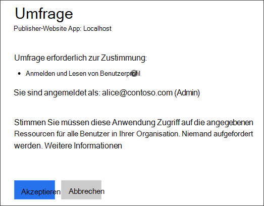
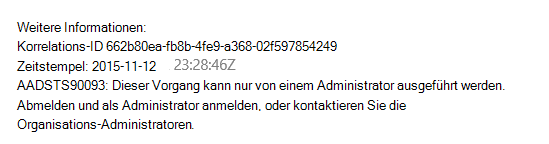
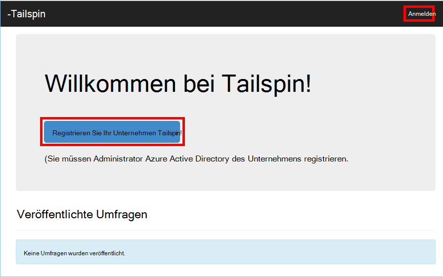
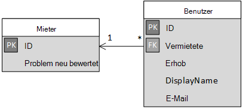

<properties
   pageTitle="Anmeldung und Mieter Onboarding in mandantenfähigen Applikationen | Microsoft Azure"
   description="Wie Sie in einer mehrinstanzenfähigen Anwendung integrierte Mieter"
   services=""
   documentationCenter="na"
   authors="MikeWasson"
   manager="roshar"
   editor=""
   tags=""/>

<tags
   ms.service="guidance"
   ms.devlang="dotnet"
   ms.topic="article"
   ms.tgt_pltfrm="na"
   ms.workload="na"
   ms.date="05/23/2016"
   ms.author="mwasson"/>

# <a name="sign-up-and-tenant-onboarding-in-a-multitenant-application"></a>Anmeldung und Mieter Onboarding in einer mehrinstanzenfähigen Anwendung

[AZURE.INCLUDE [pnp-header](../../includes/guidance-pnp-header-include.md)]

Dieser Artikel ist [Teil einer Serie]. Außerdem ist eine vollständige [Beispiel] , das dieser Serie begleitet.

Dieser Artikel beschreibt das Implementieren einer _Anmeldung_ in einer Multi-Tenant-Anwendung ermöglicht den Kunden, sich ihre Organisation für die Anwendung verarbeiten.
Es gibt mehrere Gründe einen Anmeldevorgang implementieren:

-   Lassen Sie Administrator AD Zustimmung für die gesamte Organisation des Debitors der Anwendung zu
-   Erfassen Sie Kreditkarte oder anderen Kundeninformationen.
-   Führen Sie einmal pro Mieter Setup von Ihrer Anwendung benötigt.

## <a name="admin-consent-and-azure-ad-permissions"></a>Admin-Zustimmung und Azure AD Berechtigungen

Zur Authentifizierung mit Azure benötigt eine Anwendung Zugriff auf das Verzeichnis des Benutzers. Die Anwendung benötigt mindestens Leseberechtigung für das Profil des Benutzers. Zum ersten Mal ein Benutzer anmeldet, zeigt Azure AD eine Zustimmung Seite angeforderten Berechtigungen. Indem Sie auf **annehmen**, gewährt der Benutzer der Anwendung.

Standardmäßig wird pro Benutzer Zustimmung erteilt. Jeder Benutzer meldet sieht die Zustimmung Seite. Allerdings unterstützt Azure AD _Admin Zustimmung_Administrator AD Zustimmung für eine gesamte Organisation ermöglicht.

Bei fortlaufenden Zustimmung Admin heißt Zustimmung Seite AD Administrator Berechtigungen für den gesamten Mandanten erteilen:



Nachdem der Administrator **annehmen**klickt, können andere Benutzer auf demselben Mandanten anmelden und Azure AD überspringen zustimmungsbildschirm.

Nur AD Administrator kann Admin zustimmen, weil Berechtigungen für die gesamte Organisation gewährt. Wenn ein nicht-Administrator versucht, mit Zustimmung der Verwaltung authentifizieren, zeigt Azure AD einen Fehler:



Wenn die Anwendung zu einem späteren Zeitpunkt zusätzliche Berechtigungen erfordert, muss der Kunde wieder und aktualisierten Berechtigungen bekommen.  

## <a name="implementing-tenant-sign-up"></a>Implementieren von Mieter Anmeldung

Für [Tailspin Umfragen] [ Tailspin] Anwendung mehrere Anforderungen für den Anmeldevorgang definiert:

-   Mieter muss anmelden, bevor Benutzer anmelden können.
-   Anmeldung wird die Wertentwicklung im Admin Zustimmung.
-   Anmeldung hinzugefügt des Benutzers Mieter in die Anwendungsdatenbank.
-   Nachdem ein Mieter anmeldet, zeigt die Anwendung eine Onboarding-Seite.

In diesem Abschnitt gehen wir über unsere Implementierung des Anmeldevorgangs.
Es ist wichtig zu verstehen, "Anmelden" und "Anmelden" ist ein Konzept Anwendung. Während der Fluss Authentifizierung weiß Azure AD grundsätzlich nicht, ob der Benutzer je nach der Anmeldung. Es liegt die Anwendung auf den Kontext an.

Ein anonymer Benutzer Umfragen Anwendung besucht, der Benutzer wird gezeigt zwei Schaltflächen anmelden, und Ihr Unternehmen "registrieren" (Anmelden).



Diese Schaltflächen Aktionen in der Klasse ["AccountController"] aufgerufen werden.

Die `SignIn` Aktion gibt eine **ChallegeResult**, wodurch OpenID verbinden Middleware Endpunkt Authentifizierung umgeleitet. Dies ist die Standardmethode zur Trigger-Authentifizierung in ASP.NET Core 1.0.  

```csharp
[AllowAnonymous]
public IActionResult SignIn()
{
    return new ChallengeResult(
        OpenIdConnectDefaults.AuthenticationScheme,
        new AuthenticationProperties
        {
            IsPersistent = true,
            RedirectUri = Url.Action("SignInCallback", "Account")
        });
}
```

Vergleichen Sie jetzt die `SignUp` Aktion:

```csharp
[AllowAnonymous]
public IActionResult SignUp()
{
    // Workaround for https://github.com/aspnet/Security/issues/546
    HttpContext.Items.Add("signup", "true");

    var state = new Dictionary<string, string> { { "signup", "true" }};
    return new ChallengeResult(
        OpenIdConnectDefaults.AuthenticationScheme,
        new AuthenticationProperties(state)
        {
            RedirectUri = Url.Action(nameof(SignUpCallback), "Account")
        });
}
```

Wie `SignIn`, `SignUp` Aktion gibt auch eine `ChallengeResult`. Aber dieses Mal wir Hinzufügen von Informationen zu den `AuthenticationProperties` in der `ChallengeResult`:

-   Anmeldung: ein boolesches Flag gibt an, dass der Benutzer den Anmeldevorgang gestartet wurde.

Die Informationen im `AuthenticationProperties` der OpenID verbinden [Zustand] Parameter in den Authentifizierungsablauf Rundreisen hinzugefügt wird.


Nachdem der Benutzer in Azure AD authentifiziert und an die Anwendung umgeleitet wird, enthält das Authentifizierungsticket den Status. Wir verwenden dies, um sicherzustellen, dass der Wert "Signup" über die gesamte Authentifizierungsablauf beibehalten.

## <a name="adding-the-admin-consent-prompt"></a>Admin Zustimmung Fragen hinzufügen

In Azure AD erfolgt Admin Zustimmung Fluss durch die Abfragezeichenfolge in die Authentifizierungsanfrage "Prompt" Parameter hinzufügen:

```
/authorize?prompt=admin_consent&...
```

Umfragen Anwendung fügt die Aufforderung während der `RedirectToAuthenticationEndpoint` Ereignis. Dieses Ereignis wird vor die Middleware Authentifizierung Endpunkt leitet direkt aufgerufen.

```csharp
public override Task RedirectToAuthenticationEndpoint(RedirectContext context)
{
    if (context.IsSigningUp())
    {
        context.ProtocolMessage.Prompt = "admin_consent";
    }

    _logger.RedirectToIdentityProvider();
    return Task.FromResult(0);
}
```

> [AZURE.NOTE] [SurveyAuthenticationEvents.cs]anzeigen

Festlegen von` ProtocolMessage.Prompt` teilt die Middleware die Authentifizierungsanfrage "Prompt" Parameter hinzugefügt.

Beachten Sie, dass die Meldung nur während des Anmeldevorgangs erforderlich ist. Reguläre anmelden sollten nicht enthalten. Um diese zu unterscheiden, überprüfen wir die `signup` Wert in den Authentifizierungsstatus. Die folgende Erweiterungsmethode überprüft diese Bedingung:

```csharp
internal static bool IsSigningUp(this BaseControlContext context)
{
    Guard.ArgumentNotNull(context, nameof(context));

    string signupValue;
    object obj;
    // Check the HTTP context and convert to string
    if (context.HttpContext.Items.TryGetValue("signup", out obj))
    {
        signupValue = (string)obj;
    }
    else
    {
        // It's not in the HTTP context, so check the authentication ticket.  If it's not there, we aren't signing up.
        if ((context.AuthenticationTicket == null) ||
            (!context.AuthenticationTicket.Properties.Items.TryGetValue("signup", out signupValue)))
        {
            return false;
        }
    }

    // We have found the value, so see if it's valid
    bool isSigningUp;
    if (!bool.TryParse(signupValue, out isSigningUp))
    {
        // The value for signup is not a valid boolean, throw                
        throw new InvalidOperationException($"'{signupValue}' is an invalid boolean value");
    }

    return isSigningUp;
}
```

> [AZURE.NOTE] [BaseControlContextExtensions.cs]anzeigen

> [AZURE.NOTE] Hinweis: Dieser Code enthält eine Lösung für ein bekanntes Problem in ASP.NET Core 1.0 RC1. In der `RedirectToAuthenticationEndpoint` Ereignis, gibt es keine Möglichkeit, die Eigenschaften, die den Status "Signup" enthält. Um dieses Problem zu umgehen die `AccountController.SignUp` -Methode setzt auch den Status "Anmeldung" in die `HttpContext`. Dies funktioniert, weil `RedirectToAuthenticationEndpoint` vor der Umleitung erfolgt, haben wir noch das gleiche `HttpContext`.

## <a name="registering-a-tenant"></a>Einen Mieter registrieren

Umfragen Anwendung speichert Informationen über jeden Mandanten und Benutzer in der Datenbank.



IssuerValue ist in der Tabelle Mieter Aussteller Forderung für den Mandanten. Für Azure AD ist `https://sts.windows.net/<tentantID>` und gibt einen eindeutigen Wert pro Mandant.

Wenn ein neuer Mandant, signiert Umfragen Anwendung schreibt Tenant-Datensatz in der Datenbank. Dies geschieht in der `AuthenticationValidated` Ereignis. (Nicht vor diesem Ereignis da Token-ID wird nicht noch überprüft werden, damit die Forderung Werte vertrauen können. Siehe [Authentifizierung].

Hier ist der entsprechende Code aus Umfragen Anwendung:

```csharp
public override async Task AuthenticationValidated(AuthenticationValidatedContext context)
{
    var principal = context.AuthenticationTicket.Principal;
    var userId = principal.GetObjectIdentifierValue();
    var tenantManager = context.HttpContext.RequestServices.GetService<TenantManager>();
    var userManager = context.HttpContext.RequestServices.GetService<UserManager>();
    var issuerValue = principal.GetIssuerValue();
    _logger.AuthenticationValidated(userId, issuerValue);

    // Normalize the claims first.
    NormalizeClaims(principal);
    var tenant = await tenantManager.FindByIssuerValueAsync(issuerValue)
        .ConfigureAwait(false);

    if (context.IsSigningUp())
    {
        // Originally, we were checking to see if the tenant was non-null, however, this would not allow
        // permission changes to the application in AAD since a re-consent may be required.  Now we just don't
        // try to recreate the tenant.
        if (tenant == null)
        {
            tenant = await SignUpTenantAsync(context, tenantManager)
                .ConfigureAwait(false);
        }

        // In this case, we need to go ahead and set up the user signing us up.
        await CreateOrUpdateUserAsync(context.AuthenticationTicket, userManager, tenant)
            .ConfigureAwait(false);
    }
    else
    {
        if (tenant == null)
        {
            _logger.UnregisteredUserSignInAttempted(userId, issuerValue);
            throw new SecurityTokenValidationException($"Tenant {issuerValue} is not registered");
        }

        await CreateOrUpdateUserAsync(context.AuthenticationTicket, userManager, tenant)
            .ConfigureAwait(false);
    }
}
```

> [AZURE.NOTE] [SurveyAuthenticationEvents.cs]anzeigen

Dieser Code führt Folgendes aus:

1.  Überprüfen des Mieters Issuer-Wert bereits in der Datenbank. Wenn der Mieter nicht unterschrieben hat `FindByIssuerValueAsync` gibt null zurück.
2.  Wenn der Benutzer anmelden:
  1.    Den Mieter zur Datenbank hinzufügen (`SignUpTenantAsync`).
  2.    Den authentifizierten Benutzer der Datenbank hinzufügen (`CreateOrUpdateUserAsync`).
3.  Andernfalls führen Sie normalen Fluss anmelden:
  1.    Wenn der Mieter Aussteller nicht in der Datenbank gefunden wurde, bedeutet dies Pächter nicht registriert und anmelden muss. In diesem Fall auf eine Ausnahme, wenn die Authentifizierung fehlschlägt.
  2.    Andernfalls einen Datensatz für diesen Benutzer erstellen, wenn es nicht bereits (`CreateOrUpdateUserAsync`).

Hier ist die [SignUpTenantAsync] -Methode, die den Mieter zur Datenbank hinzugefügt.

```csharp
private async Task<Tenant> SignUpTenantAsync(BaseControlContext context, TenantManager tenantManager)
{
    Guard.ArgumentNotNull(context, nameof(context));
    Guard.ArgumentNotNull(tenantManager, nameof(tenantManager));

    var principal = context.AuthenticationTicket.Principal;
    var issuerValue = principal.GetIssuerValue();
    var tenant = new Tenant
    {
        IssuerValue = issuerValue,
        Created = DateTimeOffset.UtcNow
    };

    try
    {
        await tenantManager.CreateAsync(tenant)
            .ConfigureAwait(false);
    }
    catch(Exception ex)
    {
        _logger.SignUpTenantFailed(principal.GetObjectIdentifierValue(), issuerValue, ex);
        throw;
    }

    return tenant;
}
```

Hier ist eine Zusammenfassung der gesamten Registrierungsprozesses Umfragen Anwendung:

1.  Der Benutzer klickt, **Anmelden** .
2.  Die `AccountController.SignUp` Aktion ein Kundenbeispiele Ergebnis zurückgibt.  Der Authentifizierungsstatus enthält "Signup"-Wert.
3.  In der `RedirectToAuthenticationEndpoint` Ereignis hinzufügen der `admin_consent` aufgefordert.
4.  Middleware OpenID verbinden Azure AD leitet und den Benutzer authentifiziert.
5.  In der `AuthenticationValidated` Ereignis suchen "Signup" Zustand.
6.  Den Mieter zur Datenbank hinzufügen.

## <a name="next-steps"></a>Nächste Schritte

- Im nächsten Artikel dieser Reihe zu lesen: [Anwendungsrollen mandantenfähigen Applikationen][app roles]


<!-- Links -->
[app roles]: guidance-multitenant-identity-app-roles.md
[Tailspin]: guidance-multitenant-identity-tailspin.md
[Teil einer Serie]: guidance-multitenant-identity.md
[AccountController]: https://github.com/Azure-Samples/guidance-identity-management-for-multitenant-apps/blob/master/src/Tailspin.Surveys.Web/Controllers/AccountController.cs
[Zustand]: http://openid.net/specs/openid-connect-core-1_0.html#AuthRequest
[SurveyAuthenticationEvents.cs]: https://github.com/Azure-Samples/guidance-identity-management-for-multitenant-apps/blob/master/src/Tailspin.Surveys.Web/Security/SurveyAuthenticationEvents.cs
[BaseControlContextExtensions.cs]: https://github.com/Azure-Samples/guidance-identity-management-for-multitenant-apps/blob/master/src/Tailspin.Surveys.Web/Security/BaseControlContextExtensions.cs
[Authentifizierung]: guidance-multitenant-identity-authenticate.md
[SignUpTenantAsync]: https://github.com/Azure-Samples/guidance-identity-management-for-multitenant-apps/blob/master/src/Tailspin.Surveys.Web/Security/SurveyAuthenticationEvents.cs
[Beispiel]: https://github.com/Azure-Samples/guidance-identity-management-for-multitenant-apps
