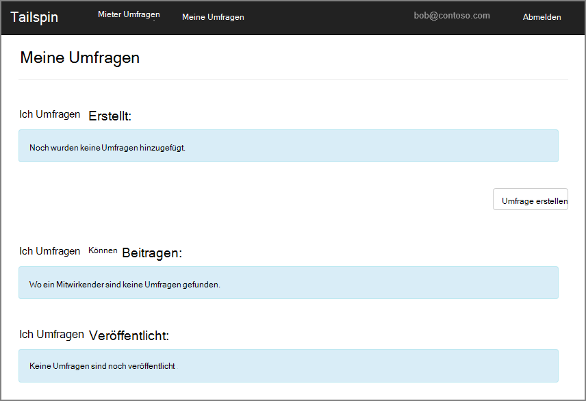
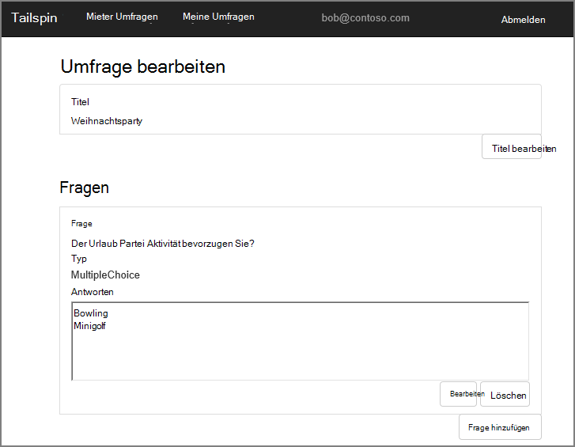
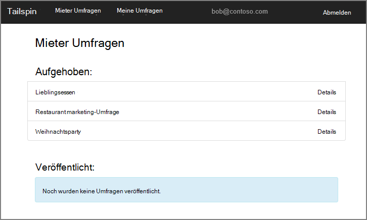
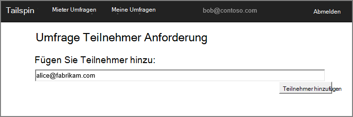
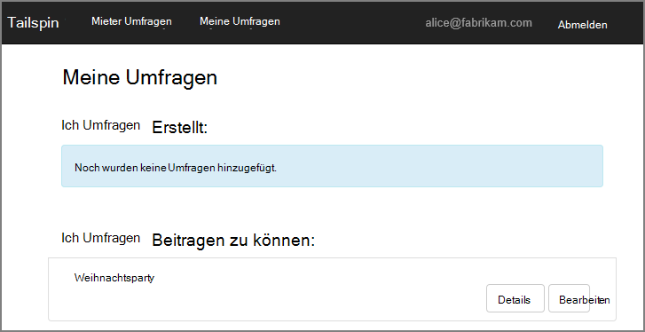
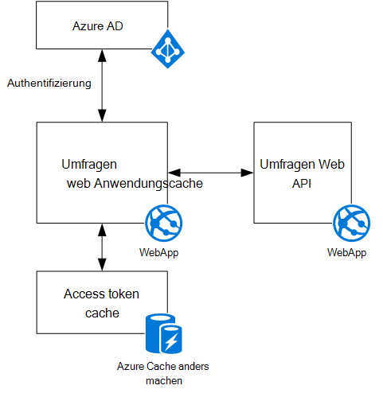

<properties
   pageTitle="Über die Tailspin Umfragen Anwendung | Microsoft Azure"
   description="Tailspin Umfragen Anwendungsübersicht"
   services=""
   documentationCenter="na"
   authors="MikeWasson"
   manager="roshar"
   editor=""
   tags=""/>

<tags
   ms.service="guidance"
   ms.devlang="dotnet"
   ms.topic="article"
   ms.tgt_pltfrm="na"
   ms.workload="na"
   ms.date="05/23/2016"
   ms.author="mwasson"/>

# Über Umfragen Tailspin-Anwendung

[AZURE.INCLUDE [pnp-header](../../includes/guidance-pnp-header-include.md)]

Dieser Artikel ist [Teil einer Serie]. Außerdem ist eine vollständige [Beispiel] , das dieser Serie begleitet.

Tailspin ist ein fiktives Unternehmen, das eine SaaS-Anwendung namens Umfragen entwickeln. Diese Anwendung ermöglicht Organisationen erstellen und Veröffentlichen von online-Umfragen.

- Eine Organisation kann für die Anwendung anmelden.
- Nachdem die Organisation angemeldet ist, können Benutzer mit ihrer Organisation Anmeldeinformationen anmelden.
- Benutzer können erstellen, bearbeiten und Veröffentlichen von Umfragen.

> [AZURE.NOTE] Zunächst mit der Anwendung finden Sie unter [Umfragen läuft].

## Benutzer können erstellen, bearbeiten und Anzeigen von Umfragen

Ein authentifizierter Benutzer kann alle Umfragen, die hat oder Teilnehmer berechtigt, anzeigen und neue Umfragen erstellen. Beachten Sie, dass der Benutzer mit Ihrer Identität Organisationseinheit angemeldet `bob@contoso.com`.

Diese Abbildung zeigt die Seite Umfrage bearbeiten:

Benutzer können auch von anderen Benutzern innerhalb der gleichen Mieter erstellte Umfragen anzeigen.

## Umfrage-Besitzer können contributors

Erstellt ein Benutzer eine laden er andere Mitwirkende auf die Umfrage zu. Mitwirkende können bearbeiten die Umfrage aber kann nicht gelöscht oder bereitstellen.  

Benutzer können Contributors aus anderen Mandanten die Mieter Kreuzes Freigabe von Ressourcen ermöglicht. In diesem Screenshot Bob (`bob@contoso.com`) ist das Hinzufügen von Alice (`alice@fabrikam.com`) als Teilnehmer an einer Umfrage, die Bob erstellt.

Wenn Alice anmeldet, sieht die Umfrage unter "Ich beitragen können Umfragen" aufgeführt.

Beachten Sie, dass Alice in eigenen Mieter nicht als Gast Contoso Mieter signiert. Alice hat Berechtigungen für diese Umfrage &mdash; sie nicht andere Umfragen von Contoso Mandanten angezeigt.

## Architektur

Umfragen Anwendung besteht aus einem front-End und Backend-Web-API. Beide werden mit [ASP.NET Core 1.0]implementiert.

Die Anwendung verwendet Azure Active Directory (Azure AD) zum Authentifizieren von Benutzern. Die Anwendung ruft außerdem Azure AD zu 2 OAuth-Zugriffstoken für die Web-API. Zugriffstoken werden in Azure Redis Cache zwischengespeichert. Der Cache kann mehrere Instanzen derselben token Cache (z. B. in einer Serverfarm) freigeben.

## Nächste Schritte

- Im nächsten Artikel dieser Reihe zu lesen: [Authentifizierung mandantenfähigen apps mit Azure Active Directory OpenID verbinden][authentication]

<!-- Links -->

[authentication]: guidance-multitenant-identity-authenticate.md
[Teil einer Serie]: guidance-multitenant-identity.md
[Die Umfragen läuft]: https://github.com/Azure-Samples/guidance-identity-management-for-multitenant-apps/blob/master/docs/running-the-app.md
[Core ASP.NET 1.0]: https://docs.asp.net/en/latest/
[Beispiel]: https://github.com/Azure-Samples/guidance-identity-management-for-multitenant-apps
