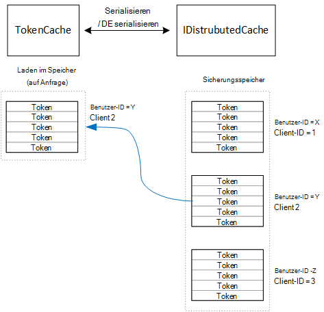

<properties
   pageTitle="Zwischenspeichern von Token in einer mehrinstanzenfähigen Anwendung Zugang | Microsoft Azure"
   description="Zwischenspeichern von Zugriffstoken zum Back-End-Web-API-aufrufen"
   services=""
   documentationCenter="na"
   authors="MikeWasson"
   manager="roshar"
   editor=""
   tags=""/>

<tags
   ms.service="guidance"
   ms.devlang="dotnet"
   ms.topic="article"
   ms.tgt_pltfrm="na"
   ms.workload="na"
   ms.date="02/16/2016"
   ms.author="mwasson"/>


# <a name="caching-access-tokens-in-a-multitenant-application"></a>Zugriffstoken in einer mehrinstanzenfähigen Anwendung Zwischenspeichern

[AZURE.INCLUDE [pnp-header](../../includes/guidance-pnp-header-include.md)]

Dieser Artikel ist [Teil einer Serie]. Außerdem ist eine vollständige [Beispiel] , das dieser Serie begleitet.

Es ist relativ teuer OAuth Zugriff token, da token Endpunkt eine HTTP-Anforderung erforderlich ist. Daher ist der Cache Token möglichst gut. [Azure AD Authentifizierungsbibliothek] [ ADAL] (ADAL) von Azure AD einschließlich Aktualisierungstoken erhaltenen Token automatisch zwischengespeichert.

ADAL bietet eine standardmäßige token Cache-Implementierung. Allerdings token Cache für systemeigene Clientanwendungen vorgesehen und ist _nicht_ für Web-apps:

-   Es ist eine statische Instanz und nicht threadsicher.
-   Es skalieren nicht an eine große Anzahl von Benutzern, denn Token aller Benutzer in dem Wörterbuch.
-   Nicht für Webserver in einer Farm gemeinsam genutzt werden.

Stattdessen sollten Sie einen benutzerdefinierten token Cache, die aus den ADAL implementieren `TokenCache` Klasse jedoch eignet sich für Server-Umgebung und bietet wünschenswert voneinander Token für verschiedene Benutzer.

Die `TokenCache` Klasse speichert ein Wörterbuch von Token vom Emittenten, Ressource, Client-ID und Benutzer indiziert. Benutzerdefinierter token Cache soll dieses Wörterbuch Sicherungsspeicher wie Redis Cache schreiben.

In der Anwendung Tailspin Umfragen der `DistributedTokenCache` -Klasse implementiert den token Cache. Diese Implementierung verwendet [IDistributedCache] [ distributed-cache] Abstraktion von ASP.NET Core 1.0. Auf diese Weise alle `IDistributedCache` Implementierung kann als Sicherungsspeicher verwendet.

-   Umfragen app verwendet einen Redis-Cache.
-   Für eine Einzelinstanz-Webserver können ASP.NET Core 1.0 [Cachespeicher][in-memory-cache]. (Dies ist auch eine gute Option für die Anwendung während der Entwicklung lokal ausgeführt.)

> [AZURE.NOTE] Redis-Cache ist derzeit für .NET nicht unterstützt.

`DistributedTokenCache`Speichert die Cachedaten als Schlüssel-Wert-Paare in der Sicherungsspeicher. Ist die Benutzer-ID sowie die Client-ID, der Sicherungsspeicher separaten Cache für jede eindeutige Kombination aus Benutzer-Client Daten.



Der Sicherungsspeicher ist vom Benutzer partitioniert. Für jede HTTP-Anforderung Token für den Benutzer Sicherungsspeicher lesen und Laden in das `TokenCache` Wörterbuch. Wenn Redis als Sicherungsspeicher verwendet, jede Serverinstanz in einer Serverfarm Lese-und Schreibvorgänge auf dem gleichen Cache und dadurch für viele Benutzer skaliert.

## <a name="encrypting-cached-tokens"></a>Verschlüsseln von zwischengespeicherten tokens

Token sind vertrauliche Daten, da sie Zugriff auf Ressourcen des Benutzers gewähren. (Außerdem kann nicht anders als ein Benutzerkennwort nur einen Hash des Tokens speichern.) Daher ist es für Token vor der Gefährdung zu schützen. Redis batteriegepufferten Cache ist durch ein Kennwort geschützt können, aber wenn jemand das Kennwort abruft, sie alle zwischengespeicherten Zugriffstoken. Aus diesem Grund die `DistributedTokenCache` verschlüsselt alle Sicherungsspeicher geschrieben. Erfolgt die Verschlüsselung mit ASP.NET Core 1.0 [Datenschutz] [ data-protection] APIs.

> [AZURE.NOTE] Wenn Sie auf Azure-Websites bereitstellen, werden die Verschlüsselungsschlüssel Netzwerkspeicher gesichert und auf allen Computern synchronisiert (siehe [Schlüsselverwaltungsdienst][key-management]). Standardmäßig werden Schlüssel nicht verschlüsselt, wenn Websites in Azure ausgeführt, aber Sie können [mit einem x. 509-Zertifikat Verschlüsselung aktivieren][x509-cert-encryption].


## <a name="distributedtokencache-implementation"></a>DistributedTokenCache-Implementierung

[DistributedTokenCache] [ DistributedTokenCache] -Klasse ist von der ADAL [TokenCache] [ tokencache-class] Klasse.

Im Konstruktor der `DistributedTokenCache` Klasse erstellt einen Schlüssel für den aktuellen Benutzer und den Cache aus einem Zusatzspeicher lädt:

```csharp
public DistributedTokenCache(
    ClaimsPrincipal claimsPrincipal,
    IDistributedCache distributedCache,
    ILoggerFactory loggerFactory,
    IDataProtectionProvider dataProtectionProvider)
    : base()
{
    _claimsPrincipal = claimsPrincipal;
    _cacheKey = BuildCacheKey(_claimsPrincipal);
    _distributedCache = distributedCache;
    _logger = loggerFactory.CreateLogger<DistributedTokenCache>();
    _protector = dataProtectionProvider.CreateProtector(typeof(DistributedTokenCache).FullName);
    AfterAccess = AfterAccessNotification;
    LoadFromCache();
}
```

Der Schlüssel wird durch Verketten der Benutzer-ID und die Client-ID erstellt Beide werden aus der Benutzer gefunden `ClaimsPrincipal`:

```csharp
private static string BuildCacheKey(ClaimsPrincipal claimsPrincipal)
{
    string clientId = claimsPrincipal.FindFirstValue("aud", true);
    return string.Format(
        "UserId:{0}::ClientId:{1}",
        claimsPrincipal.GetObjectIdentifierValue(),
        clientId);
}
```

Zum Laden der Cachedaten lesen serialisierte Blob Sicherungsspeicher und rufen `TokenCache.Deserialize` Blob in Cache-Daten konvertieren.

```csharp
private void LoadFromCache()
{
    byte[] cacheData = _distributedCache.Get(_cacheKey);
    if (cacheData != null)
    {
        this.Deserialize(_protector.Unprotect(cacheData));
    }
}
```

ADAL Zugriff auf den Cache, löst ein `AfterAccess` Ereignis. Wenn die Cachedaten geändert hat, die `HasStateChanged` -Eigenschaft true ist. In diesem Fall Sicherungsspeicher entsprechend die Änderung aktualisiert und dann `HasStateChanged` auf false.

```csharp
public void AfterAccessNotification(TokenCacheNotificationArgs args)
{
    if (this.HasStateChanged)
    {
        try
        {
            if (this.Count > 0)
            {
                _distributedCache.Set(_cacheKey, _protector.Protect(this.Serialize()));
            }
            else
            {
                // There are no tokens for this user/client, so remove the item from the cache.
                _distributedCache.Remove(_cacheKey);
            }
            this.HasStateChanged = false;
        }
        catch (Exception exp)
        {
            _logger.WriteToCacheFailed(exp);
            throw;
        }
    }
}
```

TokenCache sendet zwei Ereignisse:

- `BeforeWrite`. Aufgerufen, unmittelbar bevor ADAL in den Cache geschrieben. Dadurch können Sie eine Parallelität Strategie
- `BeforeAccess`. Aufgerufen, unmittelbar bevor ADAL aus dem Cache gelesen. Hier können Sie den Cache, um die neueste Version laden.

In unserem Fall beschlossen wir diese beiden Ereignisse behandeln.

- Parallelität letzter Schreibzugriff gewinnt. Das ist OK, da Token unabhängig für jeden Benutzer + Client gespeichert werden, damit ein Konflikt nur geschehen würde, hätte derselbe Benutzer zweimal gleichzeitiger Anmeldung.
- Wir laden zum Lesen den Cache bei jeder Anforderung. Kurzlebig sind. Der Cache in dieser Zeit geändert wird, wird der neue Wert die nächste Anforderung abholen.

## <a name="next-steps"></a>Nächste Schritte

- Im nächsten Artikel dieser Reihe zu lesen: [Föderation mit einem Kunden AD FS mandantenfähigen Apps in Azure][adfs]

<!-- links -->
[ADAL]: https://msdn.microsoft.com/library/azure/jj573266.aspx
[adfs]: guidance-multitenant-identity-adfs.md
[data-protection]: https://docs.asp.net/en/latest/security/data-protection/index.html
[distributed-cache]: https://docs.asp.net/en/latest/fundamentals/distributed-cache.html
[DistributedTokenCache]: https://github.com/Azure-Samples/guidance-identity-management-for-multitenant-apps/blob/master/src/Tailspin.Surveys.TokenStorage/DistributedTokenCache.cs
[key-management]: https://docs.asp.net/en/latest/security/data-protection/configuration/default-settings.html
[in-memory-cache]: https://docs.asp.net/en/latest/fundamentals/caching.html
[tokencache-class]: https://msdn.microsoft.com/library/azure/microsoft.identitymodel.clients.activedirectory.tokencache.aspx
[x509-cert-encryption]: https://docs.asp.net/en/latest/security/data-protection/implementation/key-encryption-at-rest.html#x-509-certificate
[Teil einer Serie]: guidance-multitenant-identity.md
[Beispiel]: https://github.com/Azure-Samples/guidance-identity-management-for-multitenant-apps
