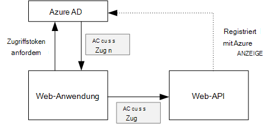
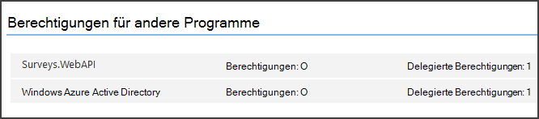

<properties
   pageTitle="Sichern einer Back-End-Webs-API in einer mehrinstanzenfähigen Anwendung | Microsoft Azure"
   description="Sichern von Back-End-Web-API"
   services=""
   documentationCenter="na"
   authors="MikeWasson"
   manager="roshar"
   editor=""
   tags=""/>

<tags
   ms.service="guidance"
   ms.devlang="dotnet"
   ms.topic="article"
   ms.tgt_pltfrm="na"
   ms.workload="na"
   ms.date="06/02/2016"
   ms.author="mwasson"/>

# <a name="securing-a-backend-web-api-in-a-multitenant-application"></a>Eine Back-End-Web-API in einer mehrinstanzenfähigen Anwendung sichern

[AZURE.INCLUDE [pnp-header](../../includes/guidance-pnp-header-include.md)]

Dieser Artikel ist [Teil einer Serie]. Außerdem ist eine vollständige [Beispiel] , das dieser Serie begleitet.

Die [Tailspin Umfragen] Anwendung Back-End-Web-API CRUD-Operationen auf Umfragen verwalten. Klickt ein Benutzer "Meine Umfragen" sendet der Anwendung eine HTTP-Anforderung an Web-API an:

```
GET /users/{userId}/surveys
```

Die Web-API gibt ein JSON-Objekt zurück:

```
{
  "Published":[],
  "Own":[
    {"Id":1,"Title":"Survey 1"},
    {"Id":3,"Title":"Survey 3"},
    ],
  "Contribute": [{"Id":8,"Title":"My survey"}]
}
```

Web-API erlaubt keine anonyme Anfragen, damit Web app mit OAuth 2 trägertoken authentifizieren muss.

> [AZURE.NOTE] Dies ist eine Server-zu-Server-Szenario. Die Anwendung macht alle AJAX-Aufrufe an die API von Clients.

Es gibt zwei Ansätze können Sie:

- Benutzeridentität übertragen. Die Anwendung authentifiziert der Benutzeridentität.
- Anwendungsidentität. Die Anwendung authentifiziert mit der Client-ID mit OAuth2 Client-Anmeldeinformationen.

Tailspin-Anwendung implementiert delegierten Benutzeridentität. Hier sind die Hauptunterschiede:

**Delegierte Benutzeridentität**

- Das trägertoken Web-API enthält die Identität des Benutzers.
- Die Web-API entscheidet Autorisierung anhand der Identität.
- Die Anwendung muss Fehler 403 (Verboten) Web-API behandelt, wenn der Benutzer nicht berechtigt ist, eine Aktion auszuführen.
- Dank der Anwendung noch einige autorisierungsentscheidungen Benutzeroberfläche wie ein- oder Ausblenden von UI-Elementen).
- Die Web-API kann möglicherweise nicht vertrauenswürdige Clients einer JavaScript-Anwendung oder eine systemeigene Anwendung verwendet werden.

**Anwendungsidentität**

- Die Web-API erhält keine Informationen über den Benutzer.
- Die Web-API Autorisierung anhand der Identität nicht möglich. Alle Autorisierung durch die Anwendung Entscheidungen.  
- Die Web-API kann nicht von einem nicht vertrauenswürdigen Client (JavaScript oder systemeigene Anwendung) verwendet.
- Dieser Ansatz etwas einfacher zu implementieren, möglicherweise gibt es keine Autorisierungslogik in der Web-API.

Bei beiden Vorgehensweisen muss die Anwendung ein Zugriffstoken erhalten die Anmeldeinformationen erforderlich, um die Web-API aufzurufen.

- Das Token muss für delegierte Benutzeridentität stammen aus den IDP einen Token für den Benutzer ausstellen kann.

- Für Client-Anmeldeinformationen möglicherweise eine Anwendung der Identitätsanbieter das Token erhalten oder eigene token Server hosten. (Aber nicht token Server neu schreiben, getestete Framework wie [IdentityServer3]verwenden.) Wenn Authentifizierung mit Azure hat empfohlen von Azure AD Client Anmeldeinformationen Flow trotz Zugriffstoken zu.

Der Rest dieses Artikels wird davon ausgegangen, dass die Anwendung in Azure AD authentifiziert.



## <a name="register-the-web-api-in-azure-ad"></a>Registrieren Sie die Web-API in Azure AD

Damit Azure Anzeige trägertoken für Web-API ausgeben müssen Sie einige Dinge in Azure AD.

1. [Registrieren Sie die Web-API in Azure AD].

2. Das Anwendungsmanifest Web API in die Client-ID der Web-app Hinzufügen der `knownClientApplications` Eigenschaft. [Aktualisiert die Anwendungsmanifeste]anzeigen

3. [Berechtigen der Web-Anwendung Web-API Aufrufen].

  In Azure-Verwaltungsportal lassen sich zwei Arten von Berechtigungen: "Berechtigungen" Anwendungsidentität (Client Anmeldeinformationen Fluss) oder "Delegiert Berechtigungen" für delegierte Benutzeridentität.

  

## <a name="getting-an-access-token"></a>Ein Zugriffstoken abrufen

Bevor Sie die Web-API aufrufen, ruft die Anwendung Zugriff von Azure AD token. Verwenden Sie in einer [Azure AD Authentifizierung Library (ADAL) für .NET][ADAL].

OAuth 2 Authorization Code Fluss tauscht die Anwendung einen Autorisierungscode ein Zugriffstoken. Der folgende Code verwendet das Zugriffstoken zu ADAL. Dieser Code wird aufgerufen, während die `AuthorizationCodeReceived` Ereignis.

```csharp
// The OpenID Connect middleware sends this event when it gets the authorization code.   
public override async Task AuthorizationCodeReceived(AuthorizationCodeReceivedContext context)
{
    string authorizationCode = context.ProtocolMessage.Code;
    string authority = "https://login.microsoftonline.com/" + tenantID
    string resourceID = "https://tailspin.onmicrosoft.com/surveys.webapi" // App ID URI
    ClientCredential credential = new ClientCredential(clientId, clientSecret);

    AuthenticationContext authContext = new AuthenticationContext(authority, tokenCache);
    AuthenticationResult authResult = await authContext.AcquireTokenByAuthorizationCodeAsync(
        authorizationCode, new Uri(redirectUri), credential, resourceID);

    // If successful, the token is in authResult.AccessToken
}
```

Hier werden die verschiedenen Parameter erforderlich sind:

- `authority`. Die Mandanten-ID des angemeldeten Benutzers abgeleitet. (Nicht die Mandanten-ID des Anbieters SaaS)  
- `authorizationCode`. Der Autorisierungscode, die Sie von der IDP zurück.
- `clientId`. Client-ID der Anwendung
- `clientSecret`. Geheimen der Anwendung.
- `redirectUri`. Die Umleitung URI festlegen für OpenID verbinden. Dies nennt, IDP wieder mit dem Token.
- `resourceID`. Der App-ID URI Web API geschaffen, wenn die Web-API in Azure AD registriert
- `tokenCache`. Ein Objekt, das die Zugriffstoken zwischengespeichert. Finden Sie unter [Zwischenspeichern von Token].

Wenn `AcquireTokenByAuthorizationCodeAsync` erfolgreich ADAL speichert das Token. Später können Sie durch Aufrufen von AcquireTokenSilentAsync Token aus dem Cache abrufen:

```csharp
AuthenticationContext authContext = new AuthenticationContext(authority, tokenCache);
var result = await authContext.AcquireTokenSilentAsync(resourceID, credential, new UserIdentifier(userId, UserIdentifierType.UniqueId));
```

wo `userId` Objekt-ID des Benutzers, die sich im befindet ist die `http://schemas.microsoft.com/identity/claims/objectidentifier` geltend machen.

## <a name="using-the-access-token-to-call-the-web-api"></a>Das Zugriffstoken Verwendung Web API aufrufen

Haben das Token in der Authorization-Header der HTTP-Anfragen an senden Sie Web API.

```
Authorization: Bearer xxxxxxxxxx
```

Die folgende Erweiterungsmethode Umfragen Anwendung wird den Authorization-Header auf eine HTTP-Anforderung die **HttpClient** -Klasse verwenden.

```csharp
public static async Task<HttpResponseMessage> SendRequestWithBearerTokenAsync(this HttpClient httpClient, HttpMethod method, string path, object requestBody, string accessToken, CancellationToken ct)
{
    var request = new HttpRequestMessage(method, path);
    if (requestBody != null)
    {
        var json = JsonConvert.SerializeObject(requestBody, Formatting.None);
        var content = new StringContent(json, Encoding.UTF8, "application/json");
        request.Content = content;
    }

    request.Headers.Authorization = new AuthenticationHeaderValue("Bearer", accessToken);
    request.Headers.Accept.Add(new MediaTypeWithQualityHeaderValue("application/json"));

    var response = await httpClient.SendAsync(request, ct);
    return response;
}
```

> [AZURE.NOTE] [HttpClientExtensions.cs]anzeigen

## <a name="authenticating-in-the-web-api"></a>Authentifizierung im Web API

Web-API muss trägertoken authentifizieren. In ASP.NET Core 1.0 können [Microsoft.AspNet.Authentication.JwtBearer] [ JwtBearer] Paket. Dieses Paket enthält die Middleware, die OpenID verbinden trägertoken erhalten kann.

Registrieren Sie die Middleware in Ihrem Web API `Startup` Klasse.

```csharp
app.UseJwtBearerAuthentication(options =>
{
    options.Audience = "[app ID URI]";
    options.Authority = "https://login.microsoftonline.com/common/";
    options.TokenValidationParameters = new TokenValidationParameters
    {
        //Instead of validating against a fixed set of known issuers, we perform custom multi-tenant validation logic
        ValidateIssuer = false,
    };
    options.Events = new SurveysJwtBearerEvents();
});
```

> [AZURE.NOTE] [Startup.cs]anzeigen

- **Zielgruppe**. Legen Sie das App-ID URL für Web-API erstellt, wenn die Web-API in Azure Active Directory registriert.
- **Behörde**. Mandantenfähigen Anwendung legen Sie dies auf `https://login.microsoftonline.com/common/`.
- **TokenValidationParameters**. Für eine Anwendung mandantenfähigen **ValidateIssuer** auf False festgelegt. Das bedeutet, dass die Anwendung den Aussteller überprüfen.
- **Ereignisse** ist eine Klasse, die von **JwtBearerEvents**abgeleitet.

### <a name="issuer-validation"></a>Aussteller-Validierung

Überprüfen Sie den Herausgeber des token bei **JwtBearerEvents.ValidatedToken** . Der Aussteller ist in Anspruch "Iss" gesendet.

In der Anwendung Umfragen behandeln nicht Web API [Mieter Anmeldung]. Daher überprüft nur ist der Emittent bereits in der Datenbank. Wenn dies nicht der Fall ist, löst eine Ausnahme aus, wodurch Authentifizierung fehlschlägt.

```csharp
public override async Task ValidatedToken(ValidatedTokenContext context)
{
    var principal = context.AuthenticationTicket.Principal;
    var tenantManager = context.HttpContext.RequestServices.GetService<TenantManager>();
    var userManager = context.HttpContext.RequestServices.GetService<UserManager>();
    var issuerValue = principal.GetIssuerValue();
    var tenant = await tenantManager.FindByIssuerValueAsync(issuerValue);

    if (tenant == null)
    {
        // the caller was not from a trusted issuer - throw to block the authentication flow
        throw new SecurityTokenValidationException();
    }
}
```

> [AZURE.NOTE] [SurveysJwtBearerEvents.cs]anzeigen

Das **ValidatedToken** -Ereignis können Sie [Anspruchstransformation]führen. Beachten Sie, dass die Ansprüche direkt Azure AD stammen, Anwendung Transformationen Ansprüche haben, die nicht im trägertoken erscheinen, die Web-API empfängt.

## <a name="authorization"></a>Autorisierung

Eine allgemeine Erläuterung der Autorisierung finden Sie unter [Autorisierung und ressourcenbasierten][Authorization]. 

JwtBearer-Middleware behandelt die Autorisierung Antworten. Z. B. um eine Controller-Aktion für authentifizierte Benutzer zu beschränken, verwenden Sie Polysaccharid **[Authorize]** , und geben Sie **JwtBearerDefaults.AuthenticationScheme** als das Authentifizierungsschema:

```csharp
[Authorize(ActiveAuthenticationSchemes = JwtBearerDefaults.AuthenticationScheme)]
```

Statuscode 401 zurückgegeben, wenn der Benutzer nicht authentifiziert ist.

Um eine Controller-Aktion Authorizaton Richtlinie einzuschränken, geben Sie den Namen der Richtlinie im Attribut **[Authorize]** :

```csharp
[Authorize(Policy = PolicyNames.RequireSurveyCreator)]
```

Statuscode 401, wenn der Benutzer nicht authentifiziert und 403 zurückgegeben, wenn der Benutzer authentifiziert, aber nicht autorisiert. Registrieren Sie die Richtlinie auf Start:

```csharp
public void ConfigureServices(IServiceCollection services)
{
    services.AddAuthorization(options =>
    {
        options.AddPolicy(PolicyNames.RequireSurveyCreator,
            policy =>
            {
                policy.AddRequirements(new SurveyCreatorRequirement());
                policy.AddAuthenticationSchemes(JwtBearerDefaults.AuthenticationScheme);
            });
    });
}
```

## <a name="next-steps"></a>Nächste Schritte

- Im nächsten Artikel dieser Reihe zu lesen: [Zugriffstoken in einer mehrinstanzenfähigen Anwendung Zwischenspeichern][token cache]

<!-- links -->
[ADAL]: https://msdn.microsoft.com/library/azure/jj573266.aspx
[JwtBearer]: https://www.nuget.org/packages/Microsoft.AspNet.Authentication.JwtBearer
[Teil einer Serie]: guidance-multitenant-identity.md
[Tailspin-Umfragen]: guidance-multitenant-identity-tailspin.md
[IdentityServer3]: https://github.com/IdentityServer/IdentityServer3
[Registrieren Sie die Web-API in Azure AD]: https://github.com/Azure-Samples/guidance-identity-management-for-multitenant-apps/blob/master/docs/running-the-app.md#register-the-surveys-web-api
[Aktualisiert die Anwendungsmanifeste]: https://github.com/Azure-Samples/guidance-identity-management-for-multitenant-apps/blob/master/docs/running-the-app.md#update-the-application-manifests
[Geben Sie Anwendung Webberechtigung Web API aufrufen]: https://github.com/Azure-Samples/guidance-identity-management-for-multitenant-apps/blob/master/docs/running-the-app.md#give-the-web-app-permissions-to-call-the-web-api
[Das Zwischenspeichern von Token]: guidance-multitenant-identity-token-cache.md
[HttpClientExtensions.cs]: https://github.com/Azure-Samples/guidance-identity-management-for-multitenant-apps/blob/master/src/Tailspin.Surveys.Common/HttpClientExtensions.cs
[Startup.cs]: https://github.com/Azure-Samples/guidance-identity-management-for-multitenant-apps/blob/master/src/Tailspin.Surveys.WebAPI/Startup.cs
[Anmeldung Mieter]: guidance-multitenant-identity-signup.md
[SurveysJwtBearerEvents.cs]: https://github.com/Azure-Samples/guidance-identity-management-for-multitenant-apps/blob/master/src/Tailspin.Surveys.WebAPI/SurveyJwtBearerEvents.cs
[Anspruchstransformation]: guidance-multitenant-identity-claims.md#claims-transformations
[Authorization]: guidance-multitenant-identity-authorize.md
[Beispiel]: https://github.com/Azure-Samples/guidance-identity-management-for-multitenant-apps
[token cache]: guidance-multitenant-identity-token-cache.md
