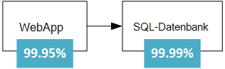
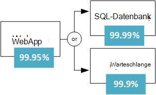
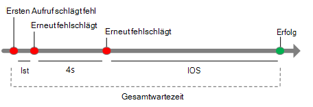
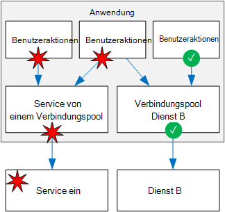

<properties
   pageTitle="Entwurfs einer stabilen Anwendung | Microsoft Azure"
   description="Wie stabil Anwendung in Azure für hohe Verfügbarkeit und Disaster Recovery."
   services=""
   documentationCenter="na"
   authors="MikeWasson"
   manager="christb"
   editor=""
   tags=""/>

<tags
   ms.service="guidance"
   ms.devlang="na"
   ms.topic="article"
   ms.tgt_pltfrm="na"
   ms.workload="na"
   ms.date="08/18/2016"
   ms.author="mwasson"/>
   
# Entwurfs einer stabilen Anwendung für Azure

In einem verteilten System können Fehler auftreten. Hardware kann fehlschlagen. Im Netzwerk können vorübergehender Fehler. Selten eine gesamte oder Region eine Störung auftreten, aber auch geplant werden müssen. 

Eine zuverlässige Anwendung in der Cloud ist anders als eine zuverlässige Anwendung in einer Organisation.  Während früher High-End-Hardware skalieren Kauf möglicherweise in einer Cloud-Umgebung muss skalieren statt Sie. Kosten für Cloud-Umgebung werden durch Standardhardware niedrig. Anstatt im Vermeiden von Fehlern und optimieren "Mean Time between Failures" aktiviert in dieser neuen Umgebung "bedeutet Wiederherstellungen." Ziel ist die Auswirkung von Fehler minimieren.

Dieser Artikel bietet eine Übersicht zum stabilen Anwendung in Microsoft Azure. Er beginnt mit der Definition der Begriff *Stabilität* und verwandte Konzepte. Anschließend beschreibt ein Verfahren zum Erreichen der Stabilität der Lebensdauer einer Anwendung von Design und Implementierung, Bereitstellung und Betrieb über einen strukturierten Ansatz.

## Was Flexibilität ist?

**Stabilität** ist die Möglichkeit von Fehlern und weiterhin. Es ist nicht über das *Vermeiden von* Fehlern *reagieren* auf Fehler in einer Weise, die Ausfallzeiten oder Datenverluste vermieden werden. Die Stabilität soll die Anwendung nach einem Fehler einen voll funktionsfähigen Zustand zurück.

Zwei wichtige Aspekte der Stabilität sind hohe Verfügbarkeit und Disaster Recovery.

- **Hohe Verfügbarkeit** (HA) ist die Möglichkeit der Anwendung in einem ordnungsgemäßen Zustand ohne erhebliche Ausfallzeiten ausgeführt. Unter "fehlerfrei" verstehen wir die Anwendung reagiert, und Benutzer können eine Verbindung mit der Anwendung und mit ihm interagieren.  

- **Disaster recovery** (DR) ist die Möglichkeit zum Wiederherstellen von seltenen, aber wichtige Vorfälle: Dauerhaftes, umfangreiche Fehler wie langwierige, die eine Region betrifft. Wiederherstellung von Backup und Archivierung enthält und möglicherweise manuelle Eingriffe wie eine Datenbank aus einer Sicherung wiederherstellen. 

Eine ist HA und DR überlegen, dass Dr. startet überschreitet die Auswirkung eines Fehlers die Fähigkeit des HA-Design behandelt. Beispielsweise bieten setzen mehrere VMs hinter einem Lastenausgleich Verfügbarkeit schlägt eine VM, aber nicht alle gleichzeitig fehlschlagen. 

Beim Entwerfen einer Anwendung robust sein müssen Sie Ihre Verfügbarkeit Anforderungen. Wie viel Ausfallzeit ist akzeptabel? Dies hängt teilweise von Kosten. Wie viel kostet potenziellen Ausfallzeiten Ihres Unternehmens? Wie viel investieren Sie Anwendung hoch verfügbar zu machen? Sie haben auch Bedeutung für die Anwendung zu definieren. Beispielsweise ist die Anwendung "nach unten", wenn ein Kunde einen Auftrag senden kann, aber das System kann nicht in den normalen Zeitrahmen verarbeiten?

Eine andere allgemeine Bezeichnung ist **Business Continuity** (BC) wichtige Geschäftsfunktionen während und nach einem Notfall ausführen. BC deckt den gesamten Vorgang des Unternehmens, einschließlich Anlagen, Personen, Transport, Kommunikation und IT. In diesem Artikel wir nur Cloudanwendungen konzentriert sind jedoch Stabilität Planung erfolgen im Allgemeinen BC-Anforderungen. 

## Prozess zu Stabilität

Stabilität ist ein Add-on nicht. Sie müssen im System und betriebliche umgesetzt. Hier ist ein allgemeines Modell folgen:

1.  **Definieren** Bedarf Verfügbarkeit basierend auf dem geschäftlichen Bedarf

2.  **Entwurf** der Anwendung Robustheit. Beginnen Sie mit einer Architektur, die folgenden bewährte Methoden und identifizieren Sie mögliche Fehlerquellen in dieser Architektur.

3.  **Implementieren** von Strategien zum Erkennen und Beheben von Fehlern. 

4.  **Testen** der Implementierung von Fehlern simulieren und erzwungene Failover auslösen. 

5.  **Bereitstellen** der Anwendung in einer zuverlässigen, wiederholbaren Prozess mit. 

6.  **Überwachen** der Anwendung zu erkennen. Überwachen Sie das System, können den Zustand der Anwendung zu messen und reagieren auf Vorfälle bei Bedarf. 

7.  **Antworten** gibt es Vorfälle, die manuelle Eingriffe erfordern.

Im weiteren Verlauf dieses Artikels werden wir diese Schritte ausführlicher.

## Definition der Stabilität

Resiliency Planung beginnt mit Unternehmen. Hier sind einige Ansätze denken Stabilität in diese Begriffe.

### Nach Arbeitslast zerlegen

Viele Cloudlösungen bestehen mehrere Arbeitslasten. Der Begriff "Aufgaben" in diesem Kontext ist eine separate Funktion oder computing Aufgabe von anderen Aufgaben in Bezug auf geschäftliche Logik und Daten Speicher logisch getrennt werden kann. Für beispielsweise e-Commerce-Anwendung die folgenden Arbeitslasten:

- Durchsuchen Sie und suchen Sie einen Produktkatalog.

- Erstellen und Nachverfolgen von Aufträgen.

- Vorschläge anzeigen

Diese Arbeitslasten möglicherweise unterschiedlichen für Verfügbarkeit, Skalierbarkeit, Datenkonsistenz, Disaster Recovery und So weiter. Sind Entscheidungen.

Denken Sie auch Verwendungsmuster. Gibt es bestimmte wichtige Punkte beim System verfügbar sein müssen? Beispielsweise kann nicht Steuererklärungen Dienst direkt vor der Einreichung gehen; ein Video streaming Service bleiben Sie bei großen Sport; Und so weiter. In wichtigen Zeiträumen möglicherweise redundante Bereitstellung über mehrere Regionen, die Anwendung Failover kann einen Bereich Fehler. Jedoch eine Bereitstellung mit mehreren teurer, damit weniger kritischen Zeiten Ausführen der Anwendung in einer Region kann.  

### RTO und RPO

Zwei wichtige Kriterien zu berücksichtigen sind die Wiederherstellungszeit und RPO:

- **Recovery Time objective** (RTO) wird die maximale Zeitspanne, die eine Anwendung nach einem Vorfall nicht verfügbar sein kann. Ist die RTO 90 Minuten, müssen Sie die Anwendung ausgeführt innerhalb von 90 Minuten vom Beginn eines Notfalls wiederherstellen können. Haben Sie eine sehr niedrige RTO möglicherweise eine zweite Bereitstellung ständig unter Standby zum Schutz gegen regionale Ausfälle aufbewahren

- **Recovery point objective** (RPO) beträgt der maximale Datenverlust bei einem Notfall akzeptabel ist. Wenn Sie Daten in einer einzelnen Datenbank keine Replikation auf andere Datenbanken speichern und stündlich sichern, könnten Sie beispielsweise bis zu einer Stunde Daten verlieren. 

RTO und RPO sind Unternehmen. Ein weiterer metrischer ist **, Mean Time to Recovery** (MTTR), die durchschnittliche Zeit, die benötigt wird, um die Anwendung nach einem Fehler wiederhergestellt. MTTR ist empirische Systeminformationen. Überschreitet MTTR RTO, wird ein Fehler im System eine unzulässige Geschäftsbetriebs führen, da er das System innerhalb der definierten RTO wiederhergestellt werden. 

### SLAs

In Azure [Service Level Agreement] [ sla] (SLA) beschreibt Microsofts Engagement für Verfügbarkeit und Konnektivität. Ist die SLA für einen bestimmten Dienst 99,9 %, bedeutet dies, dass den Dienst zu 99,9 % der Zeit erwarten.

> [AZURE.NOTE] Der Azure-SLA auch Vorschriften für den Erhalt einer Gutschrift für den Dienst SLA mit spezifischen Definitionen von "Verfügbarkeit" für jeden Dienst nicht erfüllt ist. Dieser Aspekt der SLA ist eine Erzwingungsrichtlinie. 

Definieren Sie Ihre eigenen Ziel SLAs für jede Arbeitslast in der Projektmappe. Eine SLA ermöglicht Grund über die Architektur und ob die Architektur der Unternehmen erfüllt. Beispielsweise wenn eine Arbeitslast 99,99 % Betriebszeit erfordert jedoch ein Dienst mit einer SLA von 99,9 % hängt diesen Dienst einen Single Point of Failure im System nicht möglich. Abhilfe wird einen alternativen Pfad für den Fall, dass der Dienst oder andere Maßnahmen zur Wiederherstellung nach einem Ausfall in diesem Dienst. 

Die folgende Tabelle zeigt mögliche kumulative Downtime für verschiedene SLA. 

| SLA     | Ausfallzeiten pro Woche | Ausfallzeiten pro Monat | Ausfallzeiten pro Jahr |
|---------|-------------------|--------------------|-------------------|
| 99 %     | 1,68 Stunden        | 7,2 Stunden          | 3,65 Tage         |
| 99,9 %   | 10.1 Minuten      | 43,2 Minuten       | 8,76 Stunden        |
| 99,95 %  | 5 Minuten         | 21,6 Minuten       | 4,38 Stunden        |
| 99,99 %  | 1.01 Minuten      | 4,32 Minuten       | 52,56 Minuten     |
| 99,999 % | Sekunden         | 25,9 Sekunden       | 5,26 Minuten      |

Natürlich empfiehlt höherer Verfügbarkeit, sonst alles gleich. Aber wie streben mehr 9 s Kosten und Komplexität, Grad an Verfügbarkeit. Eine Verfügbarkeit von 99,99 % entspricht ungefähr 5 Minuten Gesamtausfallzeit pro Monat. Lohnt sich die zusätzliche Komplexität und Kosten zu fünf 9 s? Die Antwort hängt von den Geschäftserfordernissen. 

Hier sind einige weitere Aspekte beim Definieren einer SLAS:

- Zu vier 9 (99,99 %) verlassen nicht Sie wahrscheinlich auf manuelle Eingriffe zu. Die Anwendung muss automatische Diagnose und Korrektur. 

- Über vier 9 ist schwierig, Ausfallzeiten erkennen schnell genug SLA erfüllen.

- Denken Sie das Zeitfenster SLA gemessen wird. Die kleineren Fenster, desto enger Toleranzen. Es sinnvoll nicht wahrscheinlich, SLA in stündlichen oder täglichen Verfügbarkeit definieren. 

### Zusammengesetzte SLAs

Sollten Sie eine App Service Web-Anwendung, die in Azure SQL-Datenbank geschrieben. Zum Zeitpunkt der Erstellung dieses Dokuments haben diese Azure Services folgende SLAs:

- App Service webapps 99,95 %

- SQL Datenbank 99,99 %

Was ist die maximale Ausfallzeit, die Sie erwarten für diese Anwendung? Wenn entweder Dienstausfall schlägt die gesamte Anwendung. Im Allgemeinen ist die Wahrscheinlichkeit jeder Dienst nicht unabhängig so zusammengesetzte SLA für diese Anwendung 99,95 % x 99,99 % = 99,94 %. Das ist geringer als einzelne SLAs die überraschend, da eine Anwendung, die auf mehrere Dienste hat mehrere mögliche Fehlerquellen. 

Auf der anderen Seite können Sie zusammengesetzte SLA verbessern, unabhängige alternative Pfade erstellen. Wenn z. B. SQL-Datenbank nicht verfügbar ist, setzen Transaktionen in einer Warteschlange später verarbeitet werden.

Mit diesem Entwurf steht die Anwendung, wenn mit der Datenbank verbinden können. Es schlägt jedoch fehl, die Datenbank und die Warteschlange gleichzeitig. Der erwartete Prozentsatz der Zeit für eine gleichzeitige Fehler ist 0,0001 × 0,001 zusammengesetzte SLA für diese kombinierten Pfad  

- Datenbank oder Warteschlange = 1,0 &minus; (0,0001 &times; 0,001) = 99,99999 %

Die gesamte zusammengesetzte SLA ist:

- Web app und (Datenbank oder Warteschlange) 99,95 % = &times; 99,99999 % = ~99.95%

Aber Nachteile dieses Ansatzes. Die Anwendungslogik ist komplexer Zahlen für die Warteschlange und möglicherweise Datenkonsistenzprobleme berücksichtigen.

**Für Installationen mit mehreren SLA**. Eine andere HA-Technik ist die Anwendung in mehreren Regionen bereitstellen und Verwenden von Azure Traffic Manager Failover, wenn die Anwendung in einer Region. Für eine Bereitstellung zwei Region wird die zusammengesetzte SLA wie folgt berechnet. 

*N* zusammengesetzten SLA für die Anwendung in einer Region bereitgestellt werden können. Die erwartete Chance, die die Anwendung in beiden Regionen gleichzeitig fehlschlägt (1 &minus; N) &times; (1 &minus; N). Daher

- Kombiniert SLA für beide Regionen = 1 &minus; (1 &minus; N) (1 &minus; N) = N + (1 &minus; N) N

Schließlich müssen Sie Faktor in die [SLA für Traffic Manager][tm-sla]. Ab wann dieser Artikel geschrieben wurde ist die SLA für Traffic Manager SLA 99,99 %.

- Zusammengesetzte SLA 99,99 % = &times; (kombiniert SLA für beide Bereiche)

Ein ausführlicher ist Failover nicht sofort, was zu Ausfallzeiten bei einem Failover führen. [Traffic Manager Endpunkt monitoring und Failover]Siehe[tm-failover].

Berechnete SLA-Anzahl ist eine nützliche Baseline es nicht Verfügbarkeit die ganze Geschichte erzählen. Häufig kann eine Anwendung diskret Wenn nicht kritischen fehlschlägt. Beispiel: eine Anwendung, die einen Katalog für Bücher zeigt. Die Anwendung die Miniaturansicht für die Abdeckung abrufen kann, könnte ein Platzhalterbild angezeigt. In diesem Fall verringert nicht das Bild des Anwendungsbetriebs, sich nicht auch die Benutzeroberfläche betrifft.  

## Entwerfen für Stabilität

Führen Sie in der Entwurfsphase eine Fehleranalyse Modus (FMA). Ein FMA soll mögliche Fehlerquellen identifizieren und definieren, wie die Anwendung auf diese Fehler reagieren.

- Wie erkennt die Anwendung solche Fehler?

- Wie reagiert die Anwendung auf diese Art von Fehler?

- Wie Sie protokollieren und überwachen diese Art von Ausfällen? 

Weitere Informationen über den Prozess FMA mit bestimmten Azure finden Sie [Azure Resiliency Anleitung: Fehleranalyse Modus][fma].

### Beispiel Fehlermodi und Strategie zur Erkennung

**Fehler Nummer:** Um einen externen Webdienst aufrufen / API.

| Fehler | Strategie zur Erkennung |
|--------------|--------------------|
| Dienst ist nicht verfügbar | HTTP-5xx |
| Drosselung | HTTP 429 (zu viele Anfragen) | 
| Authentifizierung | HTTP-Fehler 401 (nicht autorisiert) | 
| Langsame Antwort | Anforderungstimeout |

## Resiliency-Strategien

Dieser Abschnitt bietet einen Überblick über einige allgemeine Stabilität Strategien. Die meisten davon sind nicht auf eine bestimmte Technologie. Die Beschreibung in diesem Abschnitt sollen die Grundidee hinter jeder Methode mit Links zu weiteren Informationen zusammenfassen.

### Vorübergehende Fehler wiederholen

Vorübergehende Fehler können durch vorübergehende Verlust der Netzwerkkonnektivität, eine gelöschte Verbindung oder ein Timeout verursacht werden, wenn ein Dienst ausgelastet ist. Oft kann ein vorübergehender Fehler durch Wiederholung der Anforderung behoben werden. Für viele Azure Services implementiert das Client-SDK automatische Wiederholungsversuche für den Aufrufer transparent ist; Siehe [Dienst-spezifische wiederholen][retry-service-specific guidance].

Jede Wiederholungsversuch fügt die Gesamtwartezeit. Außerdem können viele fehlgeschlagene Anfragen ein, wie Anfragen in der Warteschlange ansammeln Engpass. Diese Anfragen blockierten möglicherweise kritische Systemressourcen wie Arbeitsspeicher, Threads, Datenbankverbindungen usw., cascading Fehler führen halten. Um dies zu vermeiden, erhöhen Sie die Verzögerung zwischen den Wiederholungsversuchen beim und begrenzt die Gesamtzahl der fehlgeschlagenen Anfragen.

Weitere Informationen finden Sie unter [Muster wiederholen][retry-pattern].

### Lastenausgleich für Instanzen

Skalierbarkeit sollte eine Cloudanwendung Ausskalieren, indem Sie weitere Instanzen hinzufügen können. Dieser Ansatz verbessert auch Flexibilität, da fehlerhafte Instanzen aus der Rotation durchgeführt werden können.  

Zum Beispiel:

- Platzieren Sie zwei oder mehr VMs hinter einem Lastenausgleich. Lastenausgleich verteilt Verkehr mit den virtuellen Computern. Ausführung [mehrere VMs auf Azure für Skalierbarkeits- und][ra-multi-vm].

- Skalieren einer app Azure App Service mehrere Instanzen. App Service automatisch laden Salden über Instanzen. [Grundlegende Web-Anwendung]finden Sie unter[ra-basic-web].

- Verwenden von [Azure Traffic Manager] [ tm] Datenverkehr über Endpunkte verteilen.

### Replizieren von Daten

Replizieren von Daten ist eine allgemeine Strategie zur Fehlerbehandlung nicht flüchtigen in einem Datenspeicher. Viele Speicher bieten integrierte Replikation, einschließlich Azure SQL-Datenbank, DocumentDB und Apache Cassandra.  

Deshalb sollten Sie das Lesen und Schreiben von Pfaden. Je nach Storage-Technologie mehrere schreibbare Replikate oder eine einzige schreibbare Replikat und mehrere schreibgeschützte Replikate möglicherweise. 

Höchste Verfügbarkeit können Replikate in mehreren Regionen platziert werden. Dies erhöht jedoch die Wartezeit zum Replizieren von Daten. Üblicherweise Regionen Replikation asynchron erfolgt die eventual Consistency Modell als potenzielle Datenverluste impliziert, schlägt ein Replikat. 

### Ohne Probleme

Wenn ein Dienst fehlschlägt und kein Failover Pfad die Anwendung möglicherweise, so diskret, die noch eine akzeptable Umgebung bereitstellt. Zum Beispiel:

- Legen Sie eine Arbeitsaufgabe in eine Warteschlange zu einem späteren Zeitpunkt ausgeführt werden. 

- Geschätzten Wert zurückgeben 

- Verwenden Sie lokal zwischengespeicherte Daten. 

- Anzeigen der Fehlermeldung. (Diese Option ist besser als die Anwendung reagiert auf Anfragen.)

### Große Benutzer einschränken

Eine kleine Anzahl von Benutzern erstellen manchmal ausgelastet. Das kann auf andere Benutzer reduziert die allgemeine Verfügbarkeit der Anwendung auswirken.

Bei ein einzelnen Client eine große Anzahl von Anfragen, kann die Anwendung den Client für einen bestimmten Zeitraum einschränken. Zeitraum Drosselung lehnt die Anwendung einige oder alle Anfragen von diesem Client (je nach der genauen Drosselung Strategie). Der Schwellenwert für die Drosselung kann von Kunden-Service-Tier abhängen. 

Drosselung bedeutet nicht, dass der Client unbedingt böswillig handeln. Es bedeutet nur, dass der Client das Service-Kontingent überschritten.  In einigen Fällen kann Verbraucher ständig ihre Quote überschreiten oder ansonsten Verhalten sich schlecht. In diesem Fall können Sie weiter und der Benutzer. Normalerweise geschieht dies durch das Blockieren eines API-Schlüssels oder eines IP-Adressbereichs.

Weitere Informationen finden Sie unter [Muster Drosselung][throttling-pattern].

### Verwenden Sie ein  

Schutzschalter Muster kann eine Anwendung wiederholt versucht, eine Operation, die wahrscheinlich nicht. Die Analogie ist physische Schutzschalter ein Schalter, der den Stromfluss bei eine Verbindung ist unterbrochen.

Die Leistungsschalter schließt Aufrufe an einen Dienst. Es verfügt über drei Zustände:

- **Geschlossen**. Dies ist der normale Zustand. Die Leistungsschalter sendet Anfragen an den Dienst und ein Zähler verfolgt die Anzahl der recent-Fehler. Die Fehleranzahl in einem bestimmten Zeitraum einen Schwellenwert übersteigt, wechselt der Leistungsschalter in den geöffneten Zustand. 

- Wird **geöffnet**. In diesem Zustand schlägt die Sicherung sofort alle Anfragen ohne den Dienst. Die Anwendung sollte eines Pfad zur Risikominderung oder Lesen von Daten aus einem Replikat Fehler einfach an den Benutzer zurückgegeben. Schaltet den Überlastungsschalter öffnen, wird einen Zeitgeber gestartet. Ablauf des Zeitgebers wechselt Leistungsschalter halb-offenen Zustand.

- **Halb-offenen**. In diesem Zustand können die Leistungsschalter eine begrenzte Anzahl von Anfragen an den Dienst durchlaufen. Wenn sie erfolgreich sind, wird angenommen, dass des Diensts wiederhergestellt werden und Leistungsschalter in den geschlossenen Zustand wechselt. Andernfalls wird es in den geöffneten Zustand zurückgesetzt. Halb-offenen Status verhindert, dass wiederherstellen Dienst plötzlich mit Anfragen überschüttet.

Weitere Informationen finden Sie unter [Schutzschalter Muster][circuit-breaker-pattern].

### Mit der um Spitzen im Datenverkehr zu glätten laden Abgleich

Applikationen treten plötzliche Spitzen im Datenverkehr, die Dienste auf dem Back-End überlasten können. Wenn ein Back-End-Dienst schnell genug auf Anfragen antworten, können sie möglicherweise Anfragen (sichern) Warteschlange oder verursachen Service die Anwendung einschränken.

Um dies zu vermeiden, können Sie eine Warteschlange als Puffer. Wird eine neue Arbeitsaufgabe, anstatt den Back-End-Dienst stellt die Anwendung eine Arbeitsaufgabe asynchron ausgeführt. Die Warteschlange fungiert als Puffer, Spitzen in der geglättet. 

Weitere Informationen finden Sie unter [Queue-basierten Kapazitätsabgleich Auslastungsmuster][load-leveling-pattern].

### Isolieren Sie wichtige Ressourcen 

Fehler in einem Subsystem können manchmal überlappen, Fehler in anderen Teilen der Anwendung verursacht. Dies ist ein Fehler bewirkt, dass einige Ressourcen wie Threads oder Sockets, nicht rechtzeitig zu ressourcenerschöpfung befreien. 

Um dies zu vermeiden, können Sie ein System in isolierten Gruppen aufteilen, damit, dass ein Fehler in einer Partition nicht das ganze System heruntergefahren. Diese Technik wird das Schott Muster bezeichnet.

Beispiele:

- Partitionieren einer Datenbank – z. B. Tenant - und Web-Server-Instanzen für jede Partition einen separaten Pool zuweisen.  
- Verwenden Sie separate Threadpools Aufrufe von anderen Diensten isolieren. Dadurch werden um cascading Ausfälle zu vermeiden, wenn einer der Dienste fehlschlägt. Ein Beispiel finden Sie unter Netflix [Hystrix Bibliothek][hystrix].

- [Container] [ containers] die verfügbaren Ressourcen für ein bestimmtes Subsystem beschränken. 

### Anwenden der kompensierende Transaktionen 

Eine kompensierende Transaktion ist eine Transaktion, die die Effekte einer anderen abgeschlossenen Transaktion rückgängig gemacht.

In einem verteilten System kann es sehr schwierig starken Transaktionskonsistenz. Kompensierende Transaktionen sind eine Möglichkeit, die Konsistenz durch eine Reihe von kleinere Transaktionen, die bei jedem Schritt rückgängig gemacht werden kann.

Möglicherweise reservieren Sie eine Kunde ein Auto, Hotelzimmer und einen Flug reservieren. Der gesamte Vorgang schlägt fehl, wenn einer dieser Schritte fehlschlägt. Anstatt eine verteilte Transaktion für den gesamten Vorgang zu verwenden, definieren Sie eine kompensierende Transaktion für jeden Schritt. Beispielsweise um eine Buchung zu stornieren stornieren Sie die Reservierung. Um den gesamten Vorgang führt ein Koordinator jeden Schritt. Wenn jeder Schritt fehlschlägt, gilt der Koordinator kompensierende Transaktionen rückgängig alle Schritte, die abgeschlossen wurden. 

Weitere Informationen finden Sie unter [Kompensierende Transaktion Muster][compensating-transaction-pattern]. 

## Testen der Stabilität

Im Allgemeinen kann nicht auf die gleiche Weise Stabilität testen, Anwendungsfunktionen (durch Ausführen von Komponententests usw.) zu testen. Stattdessen müssen Sie die End-to-End-Arbeitslast wie unter Umständen Fehler führt dies definitionsgemäß immer nicht testen.

Testen ist ein iterativer Prozess Teil. Testen Sie die Anwendung das Ergebnis messen, analysieren und Beheben von Fehlern, die dazu führen, und wiederholen Sie den Vorgang.

**Fault Injection-Tests**. Testen Sie die Stabilität des Systems zu, tatsächliche Fehler auslösen oder simulieren sie. Hier sind einige Ausfallszenarien zu testen:

- VM-Instanzen beenden.

- Crash Prozesse.

- Zertifikate ablaufen.

- Zugriffstasten ändern.

- Fahren Sie den DNS-Dienst auf Domänencontrollern.

- Begrenzen Sie Systemressourcen wie RAM oder Anzahl der Threads.

- Entfernen Sie Datenträger.

- Einen virtueller Computer erneut.

Messen der Recovery-Zeiten und überprüfen sie Ihre Bedürfnisse erfüllen. Fehlermodi sowie Kombinationen zu testen. Vergewissern Sie sich die Fehler nicht überlappen, werden isoliert.

Dies ist ein weiterer Grund, warum mögliche Fehlerquellen in der Entwurfsphase analysieren muss. Die Ergebnisse dieser Analyse sollte Eingaben in den Testplan.

**Auslastungstests**. Auslastungstest mithilfe eines Tools wie [Visual Studio Team] Anwendung[ vsts] oder [Apache JMeter] [ jmeter] Auslastungstest ist für Service-Drosselung oder nur unter Last wie der Backend-Datenbank überlastet passieren Fehler angibt. Spitzenlast mit Produktionsdaten oder synthetische Daten so nahe wie möglich Daten testen. Soll die Anwendung in realen Situationen Verhalten.   

## Robustes Bereitstellung

Sobald eine Anwendung für die Produktion bereitgestellt wird, werden Updates eine mögliche Fehlerquelle. Im schlimmsten Fall kann eine fehlerhafte Aktualisierung Ausfallzeiten verursachen. Um dies zu vermeiden, muss der Bereitstellungsprozess transparenten und wiederholbaren. Die Bereitstellung umfasst Azure Ressourcen bereitstellen, Anwendungscode bereitstellen und Konfiguration anwenden. Ein Update kann alle drei oder eine Teilmenge umfassen. 

Der entscheidende Punkt ist, dass manuelle Bereitstellung fehleranfällig. Daher wurde empfohlen, idempotente automatisiert haben, bei Bedarf ausführen oder erneut ausgeführt, wenn ein Fehler auftritt. 

- Verwenden Sie Ressourcenmanager Vorlagen zum Automatisieren der Bereitstellung von Azure Ressourcen.

- [Azure Automatisierung gewünschten Zustand] Konfiguration[ dsc] (DSC) VMs konfigurieren.

- Verwenden Sie einen automatisierte Bereitstellungsprozess für Anwendungscode.

Zwei Konzepte mit stabilen Bereitstellung sind *Infrastruktur als Code* und *unveränderlich Infrastruktur*.

- **Infrastruktur als Code** ist die Bereitstellung und Konfiguration Infrastruktur mit. Infrastruktur als Code können einem deklarativen Verfahren oder Imperativer Ansatz (oder eine Kombination aus beiden). Ressourcen-Manager-Vorlagen sind ein Beispiel eines deklarativen Ansatzes. PowerShell-Skripts sind ein Beispiel einer imperativen Verfahren.

- **Unveränderliche Infrastruktur** ist das Prinzip, Infrastruktur ändern sollte nicht nach der Bereitstellung für die Produktion. Andernfalls erhalten Sie in einem Zustand, in dem ad-hoc-Änderungen angewendet wurden, so es ist schwierig zu wissen, was genau geändert und schwer Grund zum System. 

Frage ist wie ein Update der Anwendung. Wie Blaugrün Bereitstellung empfohlen oder Kanarische Versionen, welche Updates sehr in Weg zu möglichen Folgen eine ungültige Bereitstellung gesteuert.

- [Blaugrün Bereitstellung] [ blue-green] ist eine Technik, Bereitstellen von Updates in einer separaten produktiven Umgebung aus der aktiven Anwendung. Nach dem Überprüfen der Bereitstellung wechseln Sie Streckenführung auf die aktualisierte Version. Beispielsweise können dies Azure App Service Web Apps mit [stagingslots][staging-slots]. 

- [Kanarische Versionen] [ canary-release] ähneln Blaugrün Bereitstellung. Anstatt alle Datenverkehr auf die aktualisierte Version, drehen Sie die Aktualisierung zu einem kleinen Prozentsatz von Benutzern durch routing einen Teil des Verkehrs in die neue Bereitstellung. Wenn ein Problem vorliegt, zurück und in die alte Bereitstellung. Andernfalls Datenverkehr mehr auf die neue Version bis 100 % des Datenverkehrs erhält.

Welchen Ansatz Sie nehmen, stellen sicher, dass Sie die letzte zweifelsfrei funktionierende-Bereitstellung wiederherstellen können bei die neue Version nicht funktioniert. Wenn Fehler auftreten, muss es auch möglich, die Anwendungsprotokolle entnehmen, welche Version der Fehler. 

## Überwachung und Diagnose

Überwachung und Diagnose sind entscheidend für Stabilität. Wenn Fehler auftreten, müssen Sie wissen, dass Fehler, und Sie Einblicke in die Fehlerursache. 

Überwachen von einem großen verteilten System stellt eine große Herausforderung. Eine Anwendung, die auf ein paar Dutzend VMs überlegen ist nicht sinnvoll, jede VM nacheinander, anmelden und Protokolldateien zu Problemen beim Suchen... Außerdem ist die Anzahl der Instanzen virtueller Computer wahrscheinlich nicht statisch. VMs hinzugefügt und entfernt die Anwendung skaliert, und eine Instanz kann gelegentlich fehl und ausgebessert werden müssen. Darüber hinaus kann normale Cloudanwendung mehreren Datenspeichern (Azure-Speicher, SQL-Datenbank, DocumentDB, Redis-Cache) und eine einzelne Benutzeraktion kann mehrere Subsysteme umfassen. 

Sie können als eine Pipeline mit mehreren Phasen der Überwachung und Diagnose vorstellen:

- **Instrumentation**. Die unformatierten Daten für die Überwachung und Diagnose stammt aus einer Vielzahl von Quellen, einschließlich Anwendungsprotokolle, Webserverprotokolle OS Leistungsindikatoren, Datenbankprotokolle und Diagnose der Azure-Plattform integriert. Die meisten Azure Services ist ein Diagnosefeature, mit dem Sie die Ursache von Problemen herauszufinden.

- **Sammlung und Lagerung**. Die unformatierten Instrumentationsdaten können in einer Vielzahl von Speicherorten und in unterschiedlichen Formaten (Anwendung Ablaufverfolgungsprotokolle, Performance-Indikatoren, IIS-Protokolle) gespeichert. Diese unterschiedlichen Quellen gesammelt konsolidiert und zuverlässige eingelagert.

- **Analyse und Diagnose**. Nach der Konsolidierung der Daten können sie analysiert werden um Probleme zu beheben und einen Überblick über den Zustand der Anwendung.

- **Visualisierung und Warnungen**. In dieser Phase werden Daten so angezeigt, dass ein Operator Trends und Probleme schnell erkennen kann. B. Dashboards enthalten oder e-Mail.  

Überwachung unterscheidet sich die Erkennung von Fehlern. Beispielsweise kann die Anwendung erkennen eine flüchtigen Fehler und Neustart, keine Ausfallzeiten. Aber es sollte auch den Vorgang wiederholen, damit Sie die Fehlerrate überwachen können, um einen Überblick über den Zustand der Anwendung abzurufen. 

Anwendungsprotokolle sind eine wichtige Diagnosedaten. Hier sind einige bewährte Methoden für die anwendungsprotokollierung:

- Melden Sie sich in der Produktion. Andernfalls verlieren Sie Einblick in Wenn die gewünschten Zeiten.

- Ereignisse an Service. Enthalten Sie eine über Dienstgrenzen hinweg fließt Korrelations-ID. Wenn mehrere Dienste und einem von Ihnen fehlschlägt Transaktion X durchläuft, Korrelations-ID hilft Ihnen Pinpoint die Transaktion fehlschlagen.

- Semantische Verwendung protokollieren, auch als strukturierte Protokollierung. Unstrukturierte Protokolle erschweren Verbrauch und Analyse der Protokolldaten, die Ebene der Cloud zu automatisieren.

- Verwenden Sie asynchrone Protokollierung. Andernfalls kann das Protokollierungssystem selbst die Anwendung fehlschlagen verursachen Anfragen sichern, sie schreiben ein Protokollereignis auf blockieren.

- Anwendungsprotokollierung ist nicht dasselbe wie. Die Überwachung kann Compliance oder gesetzlichen Gründen erfolgen. Als solche Datensätze müssen vollständig sein und ist nicht so löschen Sie beim Verarbeiten von Transaktionen akzeptiert. Erfordert eine Anwendung überwachen, sollten dies Diagnoseprotokolle voneinander getrennt. 

Weitere Informationen zum Überwachen und Diagnose finden Sie [Hinweise zur Überwachung und Diagnose][monitoring-guidance].

## Manuelle Failure-Antworten

Vorherige Abschnitten konzentrierten sich auf automatisierte Recovery-Strategien, die für hohe Verfügbarkeit. Allerdings ist auch manuelle Eingriffe erforderlich.

- **Alerts**. Überwachen der Anwendung für Anzeichen, die proaktiv eingreifen kann. Wenn SQL-Datenbank oder DocumentDB einheitlich die Anwendung Steuerung angezeigt, müssen Sie beispielsweise erhöhen die Kapazität der Datenbank oder Abfragen zu optimieren. In diesem Beispiel, obwohl die Anwendung transparent Drosselung Fehler behandeln kann sollten Ihre Telemetrie noch eine Warnung auslösen, damit Sie verfolgen können.  

- **Manuelles Failover**. Einige Systeme können ein Failover automatisch und erfordert ein manuelles Failover. 

- **Testen der Betriebsbereitschaft**. Ausfall die Anwendung über eine sekundäre Region sollten Sie einen Test Einsatzbereitschaft durchführen, bevor Sie an die primäre Region nicht. Tests sollten überprüfen, ob die primäre Region fehlerfrei und erneut empfangen werden kann.

- **Überprüfung der Datenkonsistenz**. Tritt ein Fehler in einem Datenspeicher möglicherweise Inkonsistenzen Speicher wieder verfügbar wird insbesondere dann, wenn die Daten repliziert wurden. 

- **Wiederherstellen aus einer Sicherung**. Wenn SQL-Datenbank einen regionalen Ausfall auftritt, können Sie geometrische Wiederherstellung der Datenbank aus der neuesten Sicherung.

Dokumentieren Sie und Testen Sie Ihren Wiederherstellungsplan. Enthalten Sie schriftliche Verfahren für manuelle Schritte wie Manuelles Failover, Wiederherstellen von Daten aus Backups usw. 

## Zusammenfassung

In diesem Artikel untersucht Stabilität aus einer ganzheitlichen Perspektive einzigartige Herausforderung Cloud hervorheben. Dazu gehören die verteilte Natur des Cloud-Computings mit handelsüblichen Hardwarekomponenten und dem Vorhandensein von Netzwerkfehlern Flüchtigkeit.

Hier sind die wichtigsten Punkte aus diesem Artikel:

- Stabilität führt zu höherer Verfügbarkeit und kürzere. 

- Eine Flexibilität in der Cloud erfordert unterschiedliche Techniken von herkömmlichen lokalen Solutions. 

- Stabilität nicht zufällig. Es entwickelt und integrierte ab.

- Stabilität berührt jedes Anwendungslebenszyklus, Planung und Codierung der Vorgänge.

- Testen und überwachen.

## Nächste Schritte

- [Resiliency Prüfliste] [ resiliency-checklist] enthält eine Empfehlung, mit denen zahlreiche Ausfallarten planen, die auftreten können.

- [Fehleranalyse Modus] [ fma] (FMA) ist ein Prozess zum Erstellen von Stabilität in einem System identifiziert mögliche Fehlerquellen. Als Ausgangspunkt für den Prozess FMA enthält dieser Artikel einen Katalog von möglichen Fehlermodi und ihre Schutzmaßnahmen. 

- Finden Sie zusätzliche Ressourcen: [Azure Resiliency technische Anleitung](../resiliency/resiliency-technical-guidance.md) 

<!-- links -->

[blue-green]: http://martinfowler.com/bliki/BlueGreenDeployment.html
[canary-release]: http://martinfowler.com/bliki/CanaryRelease.html
[circuit-breaker-pattern]: https://msdn.microsoft.com/library/dn589784.aspx
[compensating-transaction-pattern]: https://msdn.microsoft.com/library/dn589804.aspx
[containers]: https://en.wikipedia.org/wiki/Operating-system-level_virtualization
[dsc]: https://azure.microsoft.com/documentation/articles/automation-dsc-overview/
[fma]: guidance-resiliency-failure-mode-analysis.md
[hystrix]: http://techblog.netflix.com/2012/11/hystrix.html
[jmeter]: http://jmeter.apache.org/
[load-leveling-pattern]: https://msdn.microsoft.com/library/dn589783.aspx
[monitoring-guidance]: https://azure.microsoft.com/documentation/articles/best-practices-monitoring/
[ra-basic-web]: https://azure.microsoft.com/documentation/articles/guidance-web-apps-basic/
[ra-multi-vm]: https://azure.microsoft.com/documentation/articles/guidance-compute-multi-vm/
[resiliency-checklist]: guidance-resiliency-checklist.md
[retry-pattern]: https://msdn.microsoft.com/library/dn589788.aspx
[retry-service-specific guidance]: https://azure.microsoft.com/documentation/articles/best-practices-retry-service-specific/
[sla]: https://azure.microsoft.com/support/legal/sla/
[staging-slots]: https://azure.microsoft.com/documentation/articles/guidance-web-apps-basic/
[throttling-pattern]: https://msdn.microsoft.com/library/dn589798.aspx
[tm]: https://azure.microsoft.com/services/traffic-manager/
[tm-failover]: https://azure.microsoft.com/documentation/articles/traffic-manager-monitoring/
[tm-sla]: https://azure.microsoft.com/support/legal/sla/traffic-manager/v1_0/
[vsts]: https://www.visualstudio.com/features/vso-cloud-load-testing-vs.aspx
