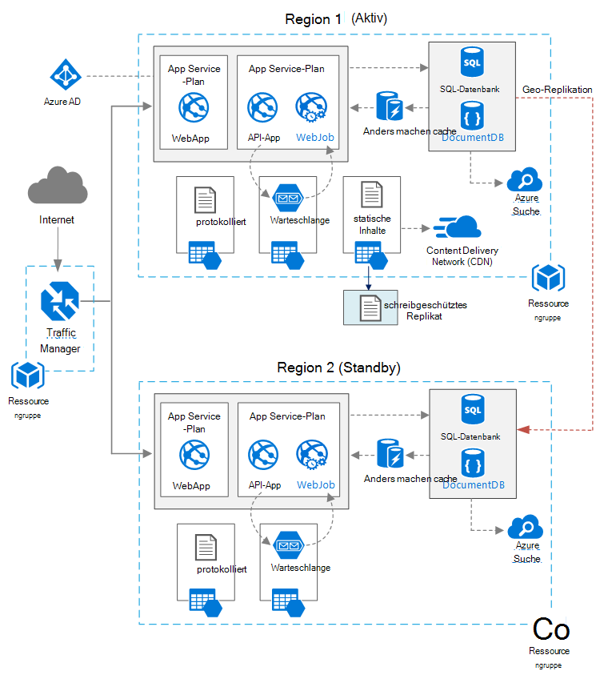

<properties
   pageTitle="Web-Anwendung mit hoher Verfügbarkeit | Azure Referenzarchitektur | Microsoft Azure"
   description="Empfohlene Architektur für Web-Anwendung mit hoher Verfügbarkeit im Microsoft Azure ausgeführt."
   services="app-service,app-service\web,sql-database" 
   documentationCenter="na"
   authors="MikeWasson"
   manager="roshar"
   editor=""
   tags=""/>

<tags
   ms.service="guidance"
   ms.devlang="na"
   ms.topic="article"
   ms.tgt_pltfrm="na"
   ms.workload="na"
   ms.date="06/27/2016"
   ms.author="mwasson"/>

# <a name="azure-reference-architecture-web-application-with-high-availability"></a>Azure Referenzarchitektur: Web-Anwendung mit hoher Verfügbarkeit

[AZURE.INCLUDE [pnp-RA-branding](../../includes/guidance-pnp-header-include.md)]

Dieser Artikel beschreibt eine empfohlene Architektur für eine Anwendung mit hoher Verfügbarkeit auf Microsoft Azure. Die Architektur baut auf [Azure Referenzarchitektur: Verbesserung der Skalierbarkeit einer Web-Anwendung][guidance-web-apps-scalability].

## <a name="architecture-diagram"></a>Architekturdiagramm



Diese Architektur basiert im [Verbesserung Skalierbarkeit einer Web-Anwendung][guidance-web-apps-scalability]. Die Hauptunterschiede sind:

- **Primäre und sekundäre Bereiche**. Diese Architektur verwendet zwei Bereichen eine höheren Verfügbarkeit. Die Anwendung wird in einzelnen Regionen bereitgestellt. Während des normalen Betriebs wird Netzwerkverkehr an die primäre Region weitergeleitet. Aber wenn, die ausfällt an die sekundäre Region Datenverkehr weitergeleitet. Einzelheiten der Failover finden Sie unter [Verwalten von Failover](#managing-failover-and-failback).

- **Azure Traffic Manager**. [Traffic Manager] [ traffic-manager] leitet Anfragen an die primäre Region. Wenn die Anwendung diese Region nicht verfügbar ist, Failover Traffic Manager auf sekundären Region. 

- **Geo-Replikation** der SQL-Datenbank und DocumentDB.

## <a name="recommendations"></a>Empfehlung

### <a name="regional-pairing"></a>Regionale koppeln

Jede Azure-Region ist eine andere Region innerhalb derselben Region zugeordnet. Im Allgemeinen wählen Sie Bereiche gleichen regionalen Paar (z. B. USA 2 Ost und USA). Dies bietet folgende Vorteile:

- Ist ein breiter Ausfall, Recovery mindestens eine Region aus jeder erhält.
- Geplante Azure Systemupdates werden paarweise Regionen sequenziell eingeführt Minimierung möglichen Ausfallzeiten.
- In den meisten Fällen befinden sich in demselben geografischen Daten vor-Ort-Anforderungen Paare.

Allerdings stellen Sie sicher, dass beide Bereiche Azure für die Anwendung erforderlichen Dienste unterstützen. [Dienste nach Region]finden Sie unter[services-by-region]. Weitere Informationen zu regionalen Paare finden Sie unter [Business Continuity und Disaster Recovery (BCDR): Azure kombiniert Bereiche][regional-pairs].

### <a name="resource-groups"></a>Ressourcengruppen

Sollten Sie die primäre Region, sekundäre Region und Traffic Manager in [Ressourcengruppen][resource groups]. Hiermit können Sie die Ressourcen in jeder Region als eine einzelne Auflistung bereitgestellt &mdash; einzeln bereitstellen, die Bereitstellung löschen und so weiter. 

### <a name="traffic-manager"></a>Traffic Manager

**Routing.** Traffic Manager unterstützt mehrere [Routingalgorithmen][tm-routing]. Verwenden Sie in diesem Artikel beschriebenen Szenario _Priorität_ routing (ehemals _Failover_ routing). Mit dieser Einstellung sendet Traffic Manager alle Anfragen an die primäre Region, wenn der Endpunkt für diese Region nicht mehr erreichbar ist. An diesem Punkt wird automatisch über die sekundäre Region. [Routing konfigurieren Failover-Methode]finden Sie unter[tm-configure-failover].

**Integritätstest.** Traffic Manager überwacht ein Prüfpunkt HTTP-(oder HTTPS-) die Verfügbarkeit jedes Endpunkts. Der Prüfpunkt bietet Traffic Manager Failover auf den zweiten Bereich einen Test bestanden oder nicht bestanden. Es funktioniert durch Senden einer Anforderung an einen angegebenen URL-Pfad. Wird nicht 200 Antwort innerhalb einer bestimmten Zeit, schlägt der Prüfpunkt. Nach vier Anforderungsfehler Traffic Manager den Endpunkt als fehlerhaft markiert und Failover auf den anderen Endpunkt. Details finden Sie unter [Traffic Manager Endpunkt monitoring und Failover][tm-monitoring].

Als bewährte Methode erstellen ein Health Probe, die den Gesamtzustand der Anwendung meldet und verwenden diesen Endpunkt für den Integritätstest. Der Endpunkt prüfen wichtige Abhängigkeiten wie App Service apps, Speicherwarteschlange und SQL-Datenbank. Andernfalls kann der Prüfpunkt "gesunden" Endpunkt melden wenn wichtige Teile der Anwendung fehlerhaft sind 

Auf der anderen Seite verwenden Sie nicht den Integritätstest niedriger Priorität Dienste überprüfen. Fällt ein e-Mail-Dienst, kann die Anwendung z. B. auf einen zweiten Anbieter wechseln oder nur e-Mails später. Die Anwendung sollte nicht über in diesem Fall wahrscheinlich fehl. Weitere Informationen finden Sie unter [Health Endpunkt Überwachung Muster][health-endpoint-monitoring-pattern].
  
### <a name="sql-database"></a>SQL-Datenbank

[Aktive Geo -] Replikation[ sql-replication] eine lesbare sekundäre in einen anderen Bereich zu erstellen. Sie können bis zu vier lesbare sekundäre. Wenn die primäre Datenbank ausfällt, oder einfach muss offline Failover auf sekundäre Datenbanken können. Aktive Geo-Replikation kann für jede Datenbank in jeder Pool elastische Datenbanken konfiguriert werden.

### <a name="documentdb"></a>DocumentDB

DocumentDB unterstützt Regionen Geo-Replikation. Region als geschrieben, und die anderen sind schreibgeschützte Replikate. 

Ist ein regionaler Ausfall, können Sie nicht von einer anderen Region zu Region schreiben auswählen. DocumentDB-Client SDK automatisch sendet schreiben Anfragen für den aktuellen Bereich schreiben, müssen Sie nicht nach einem Failover die Client-Konfiguration aktualisieren. Weitere Informationen finden Sie unter [verteilen Daten mit DocumentDB][docdb-geo]. 

> [AZURE.NOTE] Alle Replikate der gleichen Ressourcengruppe gehören.

### <a name="storage"></a>Speicher

Azure-Speicher verwenden [Lesezugriff Geo redundanten Speicher] [ ra-grs] (RA-GRS). Mit RA-GRS Speicher werden die Daten auf einen zweiten Bereich repliziert. Sie haben schreibgeschützten Zugriff auf die Daten in der sekundären Region durch einen separaten Endpunkt. Ist ein regionaler Ausfall oder einer möglicherweise Azure Storage-Team ob Geo-Failover auf den zweiten Bereich ausführen. Gibt keine Kunden für diese Failover erforderlich.

Erstellen Sie für Queue Storage backup Warteschlange im zweiten Bereich. Während eines Failovers können app backup Warteschlange, bis die primäre Region wieder verfügbar wird. Auf diese Weise kann die Anwendung weiterhin neue Anfragen bearbeitet werden. 

## <a name="availability-considerations"></a>Aspekte der Verfügbarkeit

Eine Architektur mit mehreren bieten höheren Verfügbarkeit als einen einzelnen Bereich bereitzustellen. Wenn ein regionaler Ausfall die primäre Region auswirkt, können Sie die sekundäre Region Failover. Diese Architektur kann auch helfen, schlägt ein einzelner Subsystem der Anwendung.  
     
Es gibt mehrere allgemeine Verfahren zum Erreichen einer hohen Verfügbarkeit Rechenzentren:      
- Aktiv/Passiv mit hot Standby. Netzwerkverkehr einen Bereich während der wartet auf Standby. Die Anwendung ist in der sekundären Region bereitgestellt und ausgeführt. Sie starten mit kleineren Instanz im sekundären Rechenzentrum und dann Skalierung nach Bedarf. 

- Aktiv/Passiv mit kaltem. Die gleiche, jedoch Anwendung wird erst bereitgestellt für Failover erforderlich. Dieser Ansatz günstiger ausgeführt, aber im Allgemeinen mehr Zeit bei einem Ausfall. 

- Aktiv/aktiv. Beide Bereiche sind aktiv und Anfragen erfolgt ein Lastenausgleich zwischen ihnen. Wenn ein Rechenzentrum nicht verfügbar ist, wird es aus der Rotation übernommen. 

Dieser Artikel befasst sich mit hot Standby [Azure Traffic Manager] mit Aktiv/Passiv[ traffic-manager] Datenverkehr in den Bereich. 

### <a name="traffic-manager"></a>Traffic Manager

Traffic Manager automatisch ein Failover wird die primäre Region nicht verfügbar. Beim Failover Traffic Manager ist eine Zeitspanne, wenn Clients die Anwendung erreichen kann deinstalliert werden. Zwei Faktoren wirken sich auf die gesamte Dauer:

- Der Integritätstest muss erkennen, dass das primäre Rechenzentrum nicht erreichbar ist.

- DNS-Server müssen die zwischengespeicherten DNS-Einträge für die IP-Adresse Aktualisieren der DNS-Time to live (TTL) abhängig. Die Standardgültigkeitsdauer beträgt 300 Sekunden (5 Minuten), aber Sie können diesen Wert beim Erstellen des Profils Traffic Manager.

Näheres [Über Traffic Manager überwachen][tm-monitoring]. 

Traffic Manager ist ein möglicher Fehlerpunkt im System. Wenn der Dienst nicht können nicht Clients während der Ausfallzeit die Anwendung zugreifen. Überprüfen Sie die [Traffic Manager SLA][tm-sla], und bestimmen, ob Bedarf für hohe Verfügbarkeit mit Traffic Manager allein erfüllt werden. Falls nicht, anderen Datenverkehr Management-Lösung als ein Failback hinzufügen. Ändern Sie Azure Traffic Manager-Dienst nicht, Ihre CNAME-Einträge in DNS auf der Datenverkehr-Verwaltungsdienst. (Dieser Schritt muss manuell ausgeführt werden und die Anwendung nicht verfügbar, bis die DNS-Änderungen weitergegeben werden.) 

### <a name="sql-database"></a>SQL-Datenbank

Recovery Point Objective (RPO) und geschätzte Wiederherstellungszeit (ERT) für SQL-Datenbank werden [hier][sql-rpo]. 

### <a name="storage"></a>Speicher

RA-GRS Storage bietet dauerhaften Speicher, aber es ist wichtig zu verstehen, was bei einem Ausfall geschehen: 

- Ausfall Speicher werden eine Zeitspanne, wenn Sie Schreibzugriff auf die Daten haben. Sekundäre Endpunkt können noch während des Ausfalls gelesen werden.

- Betrifft einen regionalen Ausfall oder einer primären Standort und die Daten nicht wiederhergestellt werden kann Azure Storage-Team ob Geo-Failover auf den zweiten Bereich ausführen. 

- Datenreplikation an die sekundäre Region wird asynchron ausgeführt. Geo-Failover erfolgt, ist daher Datenverlust möglich, wenn die Daten aus dem primären wiederhergestellt werden können.

- Vorübergehende Fehler wie ein Netzwerkausfall werden einen Speicherfailover nicht ausgelöst. Entwerfen Sie die Anwendung anfällig für vorübergehende Fehler. Mögliche Gegenmaßnahmen:

    - Lesen Sie die sekundäre.

    - Vorübergehender Wechsel zum anderen Speicherkonto für neue Vorgänge (z. B. Nachrichten in eine Warteschlange). 

    - Kopieren von Daten aus der sekundären einem anderen Speicher-Konto.

    - Weniger Funktionen bereit, bis das System wieder fehlschlägt.

Weitere Informationen finden Sie unter [Vorgehensweise bei einem Azure Storage Ausfall][storage-outage].

## <a name="managing-failover-and-failback"></a>Verwalten von Failover und failback

### <a name="traffic-manager"></a>Traffic Manager

Traffic Manager automatisch ein Failover wird die primäre Region nicht verfügbar. Standardmäßig wird es automatisch, nicht die primäre Region wieder verfügbar wird.

Wir empfehlen jedoch manuelle Failback durchführen, sondern automatisch Failback. Überprüfen Sie bevor wieder fehlschlägt, ob alle anwendungssubsysteme fehlerfrei sind. Andernfalls können Sie eine Situation erstellen, wo die Anwendung hin und her zwischen Rechenzentren spiegelt. 

Um Automatisches Failback zu verhindern, verringern Sie die Priorität der primäre Region manuell nach einem Failover. Beispielsweise die primäre Region Priorität 1 und die sekundäre Priorität 2. Nach einem Failover die primäre Region Priorität festgelegt, 3, um Automatisches Failback zu verhindern. Wenn Sie nicht mehr zurück wechseln möchten, Zurücksetzen Sie die Priorität auf 1.

Die folgenden Befehle aktualisieren die Priorität.

**PowerShell** 

```bat
$endpoint = Get-AzureRmTrafficManagerEndpoint -Name <endpoint> -ProfileName <profile> -ResourceGroupName <resource-group> -Type AzureEndpoints
$endpoint.Priority = 3
Set-AzureRmTrafficManagerEndpoint -TrafficManagerEndpoint $endpoint
```

Weitere Informationen finden Sie unter [Azure Traffic Manager Cmdlets][tm-ps].

**Azure CLI**

```bat
azure network traffic-manager endpoint set --name <endpoint> --profile-name <profile> --resource-group <resource-group> --type AzureEndpoints --priority 3
```    

### <a name="sql-database"></a>SQL-Datenbank

Wenn die primäre Datenbank ausfällt, durchführen Sie ein manuelles Failover auf die sekundäre Datenbank Finden Sie unter [Wiederherstellen einer Azure SQL-Datenbank oder Failover zu einem sekundären][sql-failover]. Bis Sie Failover ist die sekundäre Datenbank schreibgeschützt. 


<!-- links -->

[azure-sql-db]: https://azure.microsoft.com/en-us/documentation/services/sql-database/
[docdb-geo]: ../documentdb/documentdb-distribute-data-globally.md
[guidance-web-apps-scalability]: guidance-web-apps-scalability.md
[health-endpoint-monitoring-pattern]: https://msdn.microsoft.com/library/dn589789.aspx
[ra-grs]: ../storage/storage-redundancy.md#read-access-geo-redundant-storage
[regional-pairs]: ../best-practices-availability-paired-regions.md
[resource groups]: ../resource-group-overview.md
[services-by-region]: https://azure.microsoft.com/en-us/regions/#services
[sql-failover]: ../sql-database/sql-database-disaster-recovery.md
[sql-replication]: ../sql-database/sql-database-geo-replication-overview.md
[sql-rpo]: ../sql-database/sql-database-business-continuity.md#sql-database-business-continuity-features
[storage-outage]: ../storage/storage-disaster-recovery-guidance.md
[tm-configure-failover]: ../traffic-manager/traffic-manager-configure-failover-routing-method.md
[tm-monitoring]: ../traffic-manager/traffic-manager-monitoring.md
[tm-ps]: https://msdn.microsoft.com/en-us/library/mt125941.aspx
[tm-routing]: ../traffic-manager/traffic-manager-routing-methods.md
[tm-sla]: https://azure.microsoft.com/en-us/support/legal/sla/traffic-manager/v1_0/
[traffic-manager]: https://azure.microsoft.com/en-us/services/traffic-manager/
