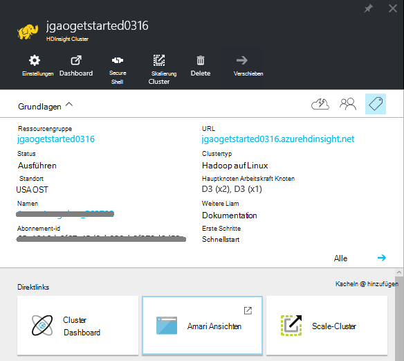
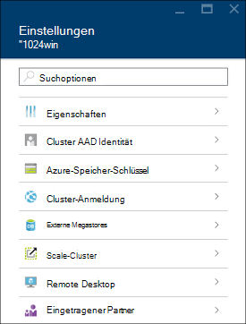
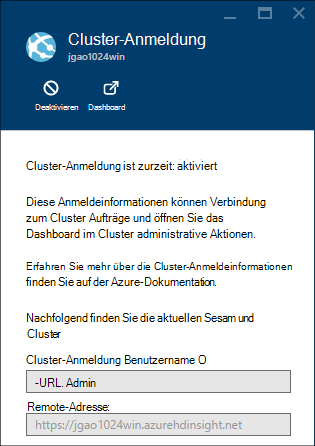
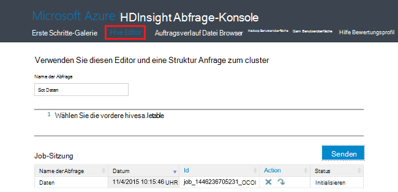
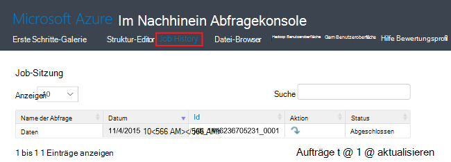
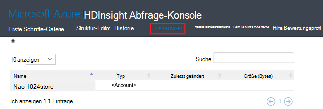
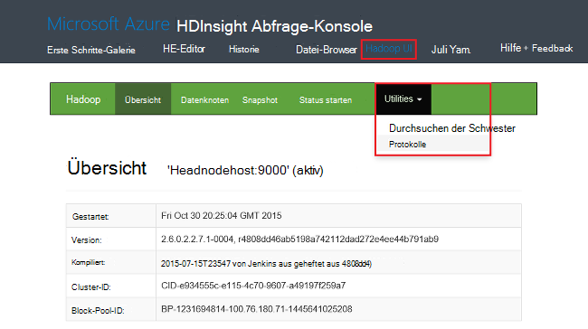
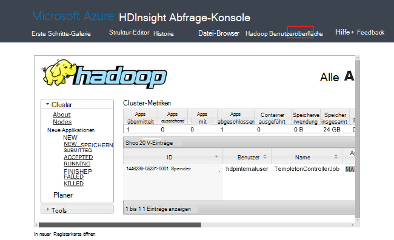
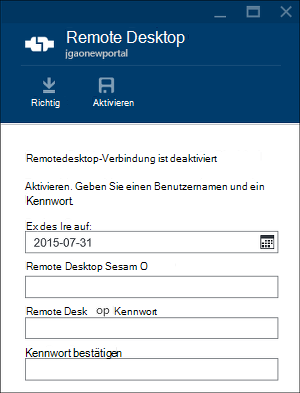

<properties
    pageTitle="Hadoop in Azure-Portal mit HDInsight Cluster verwalten | Microsoft Azure"
    description="Informationen Sie zum Verwalten von HDInsight Service. Erstellen Sie einen HDInsight-Cluster und öffnen Sie der Wiederherstellungskonsole Hadoop öffnen Sie interaktive JavaScript-Konsole."
    services="hdinsight"
    documentationCenter=""
    tags="azure-portal"
    authors="mumian"
    manager="jhubbard"
    editor="cgronlun"/>

<tags
    ms.service="hdinsight"
    ms.workload="big-data"
    ms.tgt_pltfrm="na"
    ms.devlang="na"
    ms.topic="article"
    ms.date="09/14/2016"
    ms.author="jgao"/>

# Verwalten Sie in HDInsight Hadoop Cluster mithilfe von Azure-portal

[AZURE.INCLUDE [selector](../../includes/hdinsight-portal-management-selector.md)]

[Azure-Portal]mit[azure-portal], in Azure HDInsight Hadoop Cluster erstellen, Hadoop Benutzerkennwort ändern und Remote Desktop Protocol (RDP) aktivieren, damit die Befehlskonsole Hadoop auf den Cluster zugreifen können.

Die Informationen in diesem Artikel gilt nur für Windows-basierten HDInsight-Cluster. Informationen zum Verwalten von Linux-basierten Clustern klicken Sie auf die Registerkarte oben.

Klicken Sie auf die Tabstoppauswahl Informationen zum Erstellen von Hadoop Cluster in HDInsight mit anderen Tools. 

**Erforderliche Komponenten**

Vor diesem Artikel benötigen Sie Folgendes:

- **Ein Azure-Abonnement**. Finden Sie [kostenlose Testversion von Azure zu erhalten](https://azure.microsoft.com/documentation/videos/get-azure-free-trial-for-testing-hadoop-in-hdinsight/).
- **Azure Storage-Konto** – ein HDInsight-Cluster verwendet einen Container Azure BLOB-Speicher als das Standarddateisystem. Weitere Informationen, wie Azure BLOB-Speicher bietet nahtlos mit HDInsight anzeigen [Mit Azure BLOB-Speicher mit HDInsight](hdinsight-hadoop-use-blob-storage.md) Ausführliche Informationen zum Erstellen eines Kontos Azure-Speicher finden Sie unter [Erstellen eines Speicherkontos](../storage/storage-create-storage-account.md).

##Öffnen Sie das Portal

1. [Https://portal.azure.com](https://portal.azure.com)anmelden.
2. Nach dem Öffnen des Portals können Sie:

    - Klicken Sie auf **neu** aus dem linken Menü einen neuen Cluster zu erstellen:
    
        
    - Klicken Sie im linken Menü auf **HDInsight-Cluster** .
    
        

    Wenn **HDInsight** im linken Menü angezeigt wird, klicken Sie auf **Durchsuchen**. 

    

##Erstellen von Clustern

Informationen Erstellung über das Portal finden Sie unter [Erstellen HDInsight-Cluster](hdinsight-provision-clusters.md#create-using-the-preview-portal).

HDInsight arbeitet mit einer Breite von Hadoop Komponenten. Die Liste der Komponenten, die überprüft und unterstützt, finden Sie unter [Version von Hadoop in Azure HDInsight](hdinsight-component-versioning.md). HDInsight können mit einer der folgenden Optionen:

- Verwenden Sie Skriptaktion benutzerdefinierte Skripts ausführen, die einen Cluster Cluster-Konfiguration ändern oder benutzerdefinierte Komponenten wie Giraph oder Solr installieren anpassen können. Weitere Informationen finden Sie unter [Anpassen HDInsight Cluster Skriptaktion verwenden](hdinsight-hadoop-customize-cluster.md).
- Verwenden Sie Anpassung Clusterparameter HDInsight .NET SDK oder Azure PowerShell während der Erstellung des Clusters. Diese Neukonfiguration bleiben dann über die Lebensdauer des Clusters und Cluster-Knoten-Reimages, die Azure-Plattform für die Wartung in regelmäßigen Abständen führt nicht betroffen. Weitere Informationen über die Clusterparameter Anpassung finden Sie unter [Erstellen HDInsight-Cluster](hdinsight-provision-clusters.md).
- Einige systemeigenen Java-Komponenten wie Mahout und Cascading, können im Cluster als JAR-Dateien ausgeführt werden. Diese JAR-Dateien können Azure Blob-Speicher verteilt und HDInsight Cluster über Hadoop Auftrag Übermittlung Mechanismen gesendet werden. Weitere Informationen finden Sie unter [Senden Hadoop Aufträge programmgesteuert](hdinsight-submit-hadoop-jobs-programmatically.md).

    >[AZURE.NOTE] Haben Sie Probleme JAR-Dateien auf HDInsight Cluster bereitstellen oder Aufrufen von JAR-Dateien auf HDInsight Cluster Support von [Microsoft](https://azure.microsoft.com/support/options/).

    > Überlappung von HDInsight nicht unterstützt und ist nicht für den Microsoft Support. Listen der unterstützten Komponenten finden Sie unter [neuen Cluster Versionen von HDInsight bereitgestellten?](hdinsight-component-versioning.md).

Installation von benutzerdefinierten Software im Cluster mithilfe von Remotedesktopverbindung wird nicht unterstützt. Sie sollten alle Dateien auf dem Head-Knoten als sie verloren, wenn Sie Cluster neu erstellen müssen. Speichern von Dateien auf Azure BLOB-Speicher wird empfohlen. BLOB-Speicher ist.

##Auflisten und Anzeigen von Clustern

1. [Https://portal.azure.com](https://portal.azure.com)anmelden.
2. Klicken Sie im linken Menü auf **HDInsight-Cluster** .
3. Klicken Sie auf den Namen des Clusters. Wenn die Liste Cluster lang ist, können Sie Filter oben auf der Seite.
4. Doppelklicken Sie auf einen Cluster aus der Liste mit den Details.

    **Menü und Essentials**:

    
    
    - Anpassen im Menü mit der rechten Sie Maustaste auf das Menü, und klicken Sie auf **Anpassen**.
    - **Einstellungen** und **Alle**: Zeigt das Blatt **Einstellungen** für den Cluster, dem Sie ausführliche Konfigurationsinformationen für den Cluster zugreifen kann.
    - **Dashboard**, **Cluster-Dashboard** und **URL: Diese werden auf das Dashboard Cluster Ambari Web für Linux-basierte Cluster ist. - **Secure Shell **: Zeigt auf Secure Shell (SSH) Verbindung herstellen.
    - **Skalierung Cluster**: können Sie die Anzahl der workerknoten für diesen Cluster.
    - **Löschen**: Löscht den Cluster.
    - **Schnellstart ()**: Zeigt Informationen, mit denen Sie erste Schritte mit HDInsight.
    - **Benutzer ()**: ermöglicht das Festlegen von Berechtigungen für _Portal-Management_ dieses Clusters für andere Benutzer auf Ihre Azure-Abonnement.
    
        > [AZURE.IMPORTANT] Diese _nur_ betrifft und die Berechtigungen dieser Cluster in Azure-Portal und hat keine Auswirkung auf die Verbindung oder Aufträge HDInsight-Cluster.
    - **Tags ()**: Tags können Sie Schlüssel-Wert-Paare definieren Sie eine benutzerdefinierte Taxonomie von Cloud-Diensten. Beispielsweise können Sie ein __Projekt__erstellen und verwenden Sie einen gemeinsamen Wert für alle Dienste, die einem bestimmten Projekt zugeordnet.
    - **Ambari Ansichten**: Links zu Ambari Web.
    
    > [AZURE.IMPORTANT] Zum Verwalten der Dienste von HDInsight-Cluster müssen Sie Ambari Web oder Ambari REST-API verwenden. Weitere Informationen über Ambari finden Sie unter [Verwalten HDInsight Cluster mit Ambari](hdinsight-hadoop-manage-ambari.md).

    **Verwendung**:
    
    
    
5. **Klicken Sie auf.**

    

    - **Eigenschaften**: die Eigenschaften anzeigen.
    - **Cluster AAD Identität**: 
    - **Azure Storage Schlüssel**: standardspeicherkonto und dessen Schlüssel anzeigen. Das Speicherkonto ist Konfiguration während der Clustererstellung.
    - **Cluster-Login**: Cluster HTTP-Benutzernamen und Kennwort ändern.
    - **Externe Metastores**: Metastores Struktur und Oozie anzeigen. Die Metastores kann nur während der Clustererstellung konfiguriert werden.
    - **Skalierung Cluster**: erhöhen und Verringern der Arbeitskraft Clusterknoten.
    - **Remote Desktop**: Aktivieren und Deaktivieren von Remotedesktop (RDP) und RDP Benutzername konfigurieren.  RDP-Benutzernamen dürfen Benutzernamens unterscheiden.
    - **Eingetragener Partner**:
    
    > [AZURE.NOTE] Dies ist eine generische Liste von Einstellungen. nicht werden für alle Cluster.

6. Klicken Sie auf **Eigenschaften**:

    Eigenschaften Listen, Folgendes:
    
    - **Hostname**: Clusternamen.
    - **Cluster-URL**.
    - **Status**: enthalten abgebrochen akzeptiert, ClusterStorageProvisioned, AzureVMConfiguration, HDInsightConfiguration, Betrieb, ausführen, löschen, Fehler gelöscht, Timedout, DeleteQueued, DeleteTimedout, DeleteError, PatchQueued, CertRolloverQueued, ResizeQueued, ClusterCustomization
    - **Region**: Azure Speicherort. Finden Sie eine Liste der unterstützten Azure Speicherorte **Region** Dropdown-Listenfeld auf [HDInsight Preisgestaltung](https://azure.microsoft.com/pricing/details/hdinsight/).
    - **Daten erstellt**.
    - **Betriebssystem**: **Windows** oder **Linux**.
    - **Typ**: Hadoop, HBase, Sturm, auslösen. 
    - **Version**. [HDInsight](hdinsight-component-versioning.md) Versionen
    - **Abonnement**: Namen.
    - **Abonnement-ID**.
    - **Primäre Datenquelle**. Das Azure BLOB-Speicher verwendet standardmäßig Hadoop-Dateisystem.
    - **Arbeitskraft Knoten Tarif**.
    - **Head-Knoten Tarif**.

##Cluster löschen

Ein Cluster wird nicht das Standardkonto Speicher oder Speicherkonten verknüpften löschen. Sie können Cluster mithilfe derselben Speicherkonten und derselben Metastores neu erstellen.

1. Melden Sie sich beim [Portal][azure-portal].
2. Klicken Sie im linken Menü auf **Alle durchsuchen** , **HDInsight-Cluster**auf, auf der Clustername.
3. Klicken Sie im oberen Menü auf **Löschen** und dann.

Siehe auch [Anhalten/Cluster herunterfahren](#pauseshut-down-clusters).

##Clustern
Cluster Feature Skalierung können Sie die Anzahl der workerknoten eines Clusters in Azure HDInsight ist ohne erneuten Erstellen des Clusters verwendet.

>[AZURE.NOTE] Nur mit HDInsight Version 3.1.3 Cluster oder höher unterstützt. Wenn Sie die Version Ihres Clusters kennen, können Sie die Seite Eigenschaften überprüfen.  [Liste und zeigen Cluster](#list-and-show-clusters)anzeigen

Die Auswirkung der Ändern der Anzahl der Datenknoten für jeden Cluster HDInsight unterstützt:

- Hadoop

    Sie können problemlos die Anzahl der workerknoten in einem Cluster Hadoop erhöhen, die ohne Beeinträchtigung der ausstehenden oder ausgeführten Aufträge ausgeführt wird. Arbeitsplätze können auch gesendet werden, während der Vorgang ausgeführt wird. Fehler bei einer Skalierung werden ordnungsgemäß behandelt, sodass immer der Cluster funktionsfähig bleibt.

    Wenn Hadoop Cluster durch die Verringerung der Datenknoten verkleinert wird, werden einige Dienste im Cluster neu gestartet. Dadurch alle ausgeführten und ausstehenden Aufträge am Ende die Skalierungsoperation fehlschlägt. Sie können Einzelvorgänge jedoch erneut, nachdem der Vorgang abgeschlossen ist.

- HBase

    Sie können problemlos hinzufügen oder Entfernen von Knoten zum Cluster HBase während der Ausführung. Regionale Server werden innerhalb weniger Minuten Abschließen der Skalierung automatisch ausgeglichen. Sie können die regionalen Server jedoch auch manuell ausgleichen, indem Hauptknoten des Clusters anmelden und im Eingabeaufforderungsfenster die folgenden Befehle ausführen:

        >pushd %HBASE_HOME%\bin
        >hbase shell
        >balancer

    Weitere Informationen über die HBase Shell finden Sie unter]
- Sturm

    Sie können problemlos hinzufügen oder entfernen Datenknoten zum Cluster Sturm während er ausgeführt wird. Aber nach erfolgreichem Abschluss der Skalierung müssen die Topologie auszugleichen.

    Lastausgleich kann auf zwei Arten erfolgen:

    * Storm-Webbenutzeroberfläche
    * Befehlszeilenschnittstelle (CLI) tool

    Finden Sie die [Apache Storm-Dokumentation](http://storm.apache.org/documentation/Understanding-the-parallelism-of-a-Storm-topology.html) .

    Storm-Webbenutzeroberfläche ist im HDInsight-Cluster verfügbar:

    

    Hier ist ein Beispiel zum verwenden den CLI-Befehl Storm-Topologie neu:

        ## Reconfigure the topology "mytopology" to use 5 worker processes,
        ## the spout "blue-spout" to use 3 executors, and
        ## the bolt "yellow-bolt" to use 10 executors

        $ storm rebalance mytopology -n 5 -e blue-spout=3 -e yellow-bolt=10

**Skalieren von Clustern**

1. Melden Sie sich beim [Portal][azure-portal].
2. Klicken Sie im linken Menü auf **Alle durchsuchen** , **HDInsight-Cluster**auf, auf der Clustername.
3. **Klicken Sie im oberen Menü** und dann auf **Cluster skalieren**.
4. Geben Sie die **Anzahl der Worker-Knoten**. Die maximale Anzahl der Clusterknoten variiert zwischen Azure-Abonnements. Sie erreichen Abrechnungssupport zu erhöhen.  Die Kosteninformationen wird entsprechend der Anzahl der Knoten machte.

    

##Pause/Cluster herunterfahren

Hadoop Stellen sind Stapelverarbeitungen nur gelegentlich ausgeführt. Für die meisten Hadoop Cluster sind lange Zeiträume, die der Cluster nicht zur Verarbeitung verwendet wird. Mit HDInsight Ihre Daten in Azure Storage gespeichert, einen Cluster sicher löschen können, wenn es nicht verwendet wird.
Sie sind auch für einen HDInsight-Cluster berechnet, auch wenn es nicht verwendet wird. Da die Gebühren für den Cluster mehr als die Kosten für Speicher sind, ist es wirtschaftlich Cluster löschen, wenn sie nicht verwendet werden.

Es gibt viele Methoden den Prozess Programmieren zu können:

- Benutzer Azure Data Factory. Finden Sie [Azure HDInsight verknüpfte Service](../data-factory/data-factory-compute-linked-services.md) und [Transformieren und Analysieren mit Azure Data Factory](../data-factory/data-factory-data-transformation-activities.md) für bei Bedarf und selbst definierten HDInsight verknüpft.
- Verwenden Sie Azure PowerShell.  [Analyze Verzögerung Daten](hdinsight-analyze-flight-delay-data.md)anzeigen
- Verwenden Sie Azure CLI. [Verwalten HDInsight Cluster mithilfe von Azure CLI](hdinsight-administer-use-command-line.md)anzeigen
- Verwenden Sie HDInsight .NET SDK. Stellenangebote [Hadoop senden](hdinsight-submit-hadoop-jobs-programmatically.md).

Die Preisinformationen finden Sie unter [HDInsight Preisgestaltung](https://azure.microsoft.com/pricing/details/hdinsight/). Um einen Cluster aus dem Portal löschen, finden Sie unter [Cluster löschen](#delete-clusters)

##Cluster-Benutzernamen ändern

Ein HDInsight-Cluster können zwei Benutzerkonten. Während des Erstellungsprozesses wird HDInsight Cluster-Benutzerkonto erstellt. Sie können auch eine RDP-Benutzerkonto für den Zugriff auf den Cluster über RDP erstellen. Siehe [Remotedesktop aktivieren](#connect-to-hdinsight-clusters-by-using-rdp).

**HDInsight Cluster-Benutzername und Kennwort ändern**

1. Melden Sie sich beim [Portal][azure-portal].
2. Klicken Sie im linken Menü auf **Alle durchsuchen** , **HDInsight-Cluster**auf, auf der Clustername.
3. **Klicken Sie im oberen Menü** und klicken Sie auf **Cluster anmelden**.
4. Aktivierter **Cluster Login** muss auf **Deaktivieren**und klicken Sie auf **Aktivieren** , bevor Sie den Benutzernamen und das Kennwort ändern können.
4. Ändern Sie **Cluster-Benutzername** oder **Passwort Cluster**, und klicken Sie auf **Speichern**.

    

##GRANT/Revoke Zugriff

HDInsight-Cluster haben die folgenden HTTP-Webdienste (alle diese Dienste müssen REST-Endpunkten):

- ODBC
- JDBC
- Ambari
- Oozie
- Templeton

Standardmäßig werden diese Dienste für den Zugriff erteilt. Sie können Sperren/den Zugriff von Azure-Portal gewähren.

>[AZURE.NOTE] Durch den Zugriff gewähren/aufheben, wird die Cluster-Benutzername und Kennwort zurückgesetzt.

**Grant/Revoke HTTP-Web services zugreifen**

1. Melden Sie sich beim [Portal][azure-portal].
2. Klicken Sie im linken Menü auf **Alle durchsuchen** , **HDInsight-Cluster**auf, auf der Clustername.
3. **Klicken Sie im oberen Menü** und klicken Sie auf **Cluster anmelden**.
4. Aktivierter **Cluster Login** muss auf **Deaktivieren**und klicken Sie auf **Aktivieren** , bevor Sie den Benutzernamen und das Kennwort ändern können.
6. Geben Sie für **Cluster-Benutzernamen** und **Passwort Cluster**den neuen Benutzernamen und das Kennwort (bzw.) für den Cluster.
7. Klicken Sie auf **Speichern**.

    

##Suchen Sie das Standardkonto Speicher

Jeder HDInsight Cluster verfügt über ein Standardkonto Speicher. Das Standardkonto Speicher und ihre Schlüssel für einen Cluster wird unter **Einstellungen**/**Eigenschaften**/**Azure Storage Schlüssel**. [Liste und zeigen Cluster](#list-and-show-clusters)anzeigen

    
##Suchen der Ressourcengruppe 

Im Modus Azure-Ressourcen-Manager wird jeder HDInsight Cluster Azure Ressourcengruppe erstellt. Wird die Azure-Ressourcengruppe, der zu ein Cluster gehört:

- Die Cluster-Liste enthält eine Spalte **Ressourcengruppe** .
- Cluster **wesentlichen** nebeneinander.  

[Liste und zeigen Cluster](#list-and-show-clusters)anzeigen
   
##HDInsight Abfrage-Konsole öffnen

HDInsight Abfrage-Konsole enthält die folgenden Features:

- **Erste Schritte Galerie**: Katalog finden Sie unter [Hadoop mit Azure HDInsight Getting Started Galerie erfahren](hdinsight-learn-hadoop-use-sample-gallery.md).
- **Hive-Editor**: eine GUI-Weboberfläche für Struktur Aufträge.  [Struktur führen Abfragen mithilfe der Query-Konsole](hdinsight-hadoop-use-hive-query-console.md)anzeigen

    

- **Historie**: Monitor Hadoop Aufträge.  

    

    Klicken Sie auf **Abfrage** Auftragseigenschaften **Auftragsabfrage**, einschließlich Details anzuzeigen und ** Auftragsausgabe. Sie können auch die Abfrage und die Ausgabe auf der Arbeitsstation.

- **Datei-Browser**: das Standardkonto Speicher und verknüpfte Speicherkonten durchsuchen.

    

    Auf dem Screenshot der **<Account>** Typ angibt, das Element ist ein Azure Storage-Konto.  Klicken Sie auf Konto, um Dateien zu suchen.
    
- **Hadoop Benutzeroberfläche**.

    
    
    Aus **Hadoop Benutzeroberfläche*können Dateien durchsuchen und Protokollen. 

- **Garn Benutzeroberfläche**.

    

##Struktur Abfragen

Struktur Aufträge über das Portal ausgeführt wird, klicken Sie auf **Hive-Editor** in der Konsole HDInsight Abfrage. Siehe [Abfrage öffnen HDInsight-Konsole](#open-hdinsight-query-console).

##Aufträge überwachen

Aufträge über das Portal zu überwachen, klicken Sie auf **Auftragsverlauf** HDInsight Abfrage-Konsole. Siehe [Abfrage öffnen HDInsight-Konsole](#open-hdinsight-query-console).

##Dateien durchsuchen

Durchsuchen von Dateien in das Standardkonto Speicher und verknüpfte Speicherkonten klicken Sie auf **Datei-Browser** HDInsight Abfrage-Konsole. Siehe [Abfrage öffnen HDInsight-Konsole](#open-hdinsight-query-console).

**Durchsuchen des Dateisystems** Dienstprogramm **Hadoop Benutzeroberfläche** verwenden Sie in der Konsole HDInsight.  Siehe [Abfrage öffnen HDInsight-Konsole](#open-hdinsight-query-console).

##Überwachung der Cluster Nutzung

HDInsight Cluster Blade im Abschnitt __Verwendung__ zeigt Informationen über die verfügbare Anzahl von Prozessorkernen Ihr Abonnement mit HDInsight sowie die Anzahl der Kerne zu diesem Cluster Zuteilung für die Knoten in diesem Cluster zugeordnet. [Liste und zeigen Cluster](#list-and-show-clusters)anzeigen

> [AZURE.IMPORTANT] Die Dienste der HDInsight-Cluster überwachen, müssen Sie Ambari Web oder Ambari REST-API verwenden. Weitere Informationen über Ambari finden Sie unter [Verwalten HDInsight Cluster mit Ambari](hdinsight-hadoop-manage-ambari.md)

##Hadoop Benutzeroberfläche öffnen

Klicken Sie zum Überwachen des Clusters, das Dateisystem durchsuchen und Protokollen **Hadoop Benutzeroberfläche** in der Konsole HDInsight Abfrage. Siehe [Abfrage öffnen HDInsight-Konsole](#open-hdinsight-query-console).

##Garn Benutzeroberfläche öffnen

Klicken Sie Garn-Benutzeroberfläche **Garn Benutzeroberfläche** in der Konsole HDInsight Abfrage. Siehe [Abfrage öffnen HDInsight-Konsole](#open-hdinsight-query-console).

##Verbinden Sie mit Clustern mit RDP

Die Anmeldeinformationen für den Cluster, den bei seiner Erstellung bereitgestellt Dienste im Cluster jedoch nicht in den Cluster durch Remote Desktop Zugriff gewähren. Remote Desktop Zugriff zu aktivieren, wenn Sie einen Cluster bereitstellen oder ein Cluster bereitgestellt wird. Informationen zum Aktivieren von Remotedesktop bei der Erstellung finden Sie unter [Erstellen HDInsight-Cluster](hdinsight-provision-clusters.md).

**Aktivieren von Remotedesktop**

1. Melden Sie sich beim [Portal][azure-portal].
2. Klicken Sie im linken Menü auf **Alle durchsuchen** , **HDInsight-Cluster**auf, auf der Clustername.
3. **Klicken Sie im oberen Menü** , und klicken Sie dann auf **Remotedesktop**.
4. Geben Sie **Läuft ab am** **Remote Desktop Benutzername** und **Kennwort für Remote Desktop ein**und dann auf **Aktivieren**.

    

    Die Standardwerte für Ablauf ist eine Woche.
> [AZURE.NOTE] HDInsight .NET SDK können Sie den Remotedesktop auf einem Cluster aktivieren. Verwenden Sie die Methode **EnableRdp** Clientobjekt HDInsight wie folgt: **Client. EnableRdp (Clustername, Speicherort, "Rdpuser", "Rdppassword", DateTime.Now.AddDays(6))**. Ebenso können Sie zum Deaktivieren von Remotedesktop auf dem Cluster **Client verwenden. DisableRdp (Clustername, Ort)**. Weitere Informationen zu diesen Methoden finden Sie unter [HDInsight .NET SDK-Referenz](http://go.microsoft.com/fwlink/?LinkId=529017). Dies gilt nur für HDInsight-Cluster unter Windows.

**Die Verbindung zu einem Cluster über RDP**

1. Melden Sie sich beim [Portal][azure-portal].
2. Klicken Sie im linken Menü auf **Alle durchsuchen** , **HDInsight-Cluster**auf, auf der Clustername.
3. **Klicken Sie im oberen Menü** , und klicken Sie dann auf **Remotedesktop**.
4. Klicken Sie auf **Verbinden** , und folgen Sie der Anleitung. Verbindung deaktiviert ist, müssen Sie es zunächst aktivieren. Stellen Sie sicher, dass der Remotedesktop-Benutzernamen und das Kennwort.  Cluster-Anmeldeinformationen können nicht verwendet werden.

##Hadoop Befehlszeile öffnen

Um den Cluster mithilfe von Remotedesktop und Befehlszeile Hadoop, müssen Sie zuerst Remotedesktop Zugriff auf den Cluster aktiviert haben wie im vorherigen Abschnitt beschrieben.

**Öffnen Sie eine Befehlszeile Hadoop**

1. Verbinden Sie mit Remotedesktop.
8. Doppelklicken Sie auf dem Desktop auf **Hadoop Befehlszeile**.

    ![HDI. HadoopCommandLine][image-hadoopcommandline]

    Weitere Informationen über Hadoop Befehle finden Sie unter [Befehlsreferenz Hadoop](http://hadoop.apache.org/docs/current/hadoop-project-dist/hadoop-common/CommandsManual.html).

In der vorherigen Abbildung hat der Ordnername eingebettete Hadoop-Versionsnummer. Die Versionsnummer kann je nach der Version der Hadoop Komponenten im Cluster installiert. Hadoop Umgebungsvariablen können auf diese Ordner verweisen. Zum Beispiel:

    cd %hadoop_home%
    cd %hive_home%
    cd %hbase_home%
    cd %pig_home%
    cd %sqoop_home%
    cd %hcatalog_home%
    
##Nächste Schritte
In diesem Artikel haben Sie einen HDInsight-Cluster mithilfe der Portalwebsite erstellen und zum Öffnen des Befehlszeilenprogramms Hadoop. Weitere finden Sie in folgenden Artikeln:

* [Verwalten Sie HDInsight mit Azure PowerShell](hdinsight-administer-use-powershell.md)
* [Verwalten Sie HDInsight mit Azure CLI](hdinsight-administer-use-command-line.md)
* [HDInsight Cluster erstellen](hdinsight-provision-clusters.md)
* [Hadoop Aufträge programmgesteuert übermitteln](hdinsight-submit-hadoop-jobs-programmatically.md)
* [Erste Schritte mit Azure HDInsight](hdinsight-hadoop-linux-tutorial-get-started.md)
* [Welche Version von Hadoop in Azure HDInsight ist?](hdinsight-component-versioning.md)

[azure-portal]: https://portal.azure.com
[image-hadoopcommandline]: ./media/hdinsight-administer-use-management-portal/hdinsight-hadoop-command-line.png "Hadoop-Befehlszeile"
