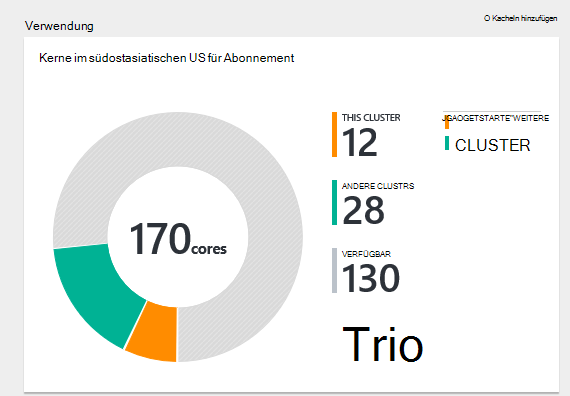
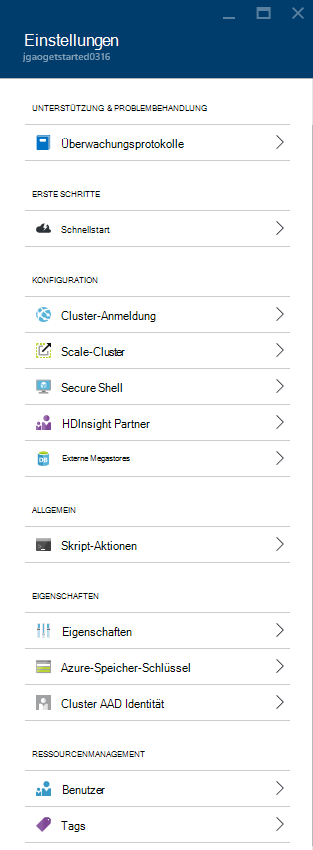
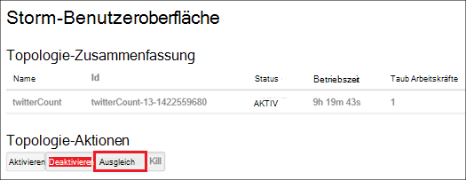
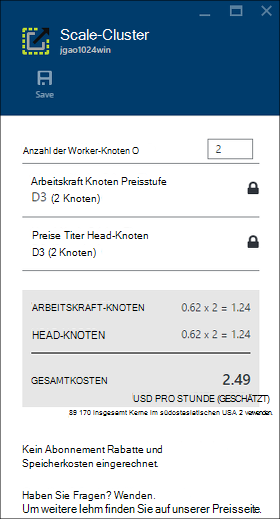
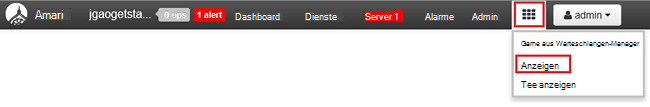

<properties
    pageTitle="Verwalten von Linux-basierten Hadoop Cluster in Azure-Portal mit HDInsight | Microsoft Azure"
    description="Informationen Sie zum Erstellen und Verwalten von Linux-basierten HDInsight Cluster mithilfe von Azure-Portal."
    services="hdinsight"
    documentationCenter=""
    authors="mumian"
    manager="jhubbard"
    editor="cgronlun"
    tags="azure-portal"/>

<tags
    ms.service="hdinsight"
    ms.workload="big-data"
    ms.tgt_pltfrm="na"
    ms.devlang="na"
    ms.topic="article"
    ms.date="08/10/2016"
    ms.author="jgao"/>

#Verwalten Sie in HDInsight Hadoop Cluster mithilfe von Azure-portal

[AZURE.INCLUDE [selector](../../includes/hdinsight-portal-management-selector.md)]

[Azure-Portal]mit[azure-portal], Linux-basierten Clustern in Azure HDInsight verwalten. Verwenden Sie die Tabstoppauswahl Informationen zum Erstellen von Hadoop Cluster in HDInsight mit anderen Tools. 

**Erforderliche Komponenten**

Vor diesem Artikel benötigen Sie Folgendes:

- **Ein Azure-Abonnement**. Finden Sie [kostenlose Testversion von Azure zu erhalten](https://azure.microsoft.com/documentation/videos/get-azure-free-trial-for-testing-hadoop-in-hdinsight/).

##Öffnen Sie das Portal

1. [Https://portal.azure.com](https://portal.azure.com)anmelden.
2. Nach dem Öffnen des Portals können Sie:

    - Klicken Sie auf **neu** aus dem linken Menü einen neuen Cluster zu erstellen:
    
        
    - Klicken Sie im linken Liste vorhandener Cluster auf **HDInsight-Cluster**
    
        

        **HDInsight** im linken Menü angezeigt wird, klicken Sie auf **Durchsuchen,**und klicken Sie dann auf **HDInsight-Cluster**.

        

##Erstellen von Clustern

[AZURE.INCLUDE [delete-cluster-warning](../../includes/hdinsight-delete-cluster-warning.md)]

HDInsight arbeitet mit einer Breite von Hadoop Komponenten. Die Liste der Komponenten, die überprüft und unterstützt, finden Sie unter [Version von Hadoop in Azure HDInsight](hdinsight-component-versioning.md). Erstellungsinformationen Allgemein Cluster finden Sie unter [Erstellen Hadoop Cluster in HDInsight](hdinsight-hadoop-provision-linux-clusters.md). 

##Auflisten und Anzeigen von Clustern

1. [Https://portal.azure.com](https://portal.azure.com)anmelden.
2. Klicken Sie auf **HDInsight Cluster** aus dem linken Menü vorhandener Cluster auflisten.
3. Klicken Sie auf den Namen des Clusters. Wenn die Liste Cluster lang ist, können Sie Filter oben auf der Seite.
4. Doppelklicken Sie auf einen Cluster aus der Liste mit den Details.

    **Menü und Essentials**:

    
    
    - **Einstellungen** und **Alle**: Zeigt das Blatt **Einstellungen** für den Cluster, dem Sie ausführliche Konfigurationsinformationen für den Cluster zugreifen kann.
    - **Dashboard**, **Dashboard Cluster** und ** URL: Diese werden auf das Dashboard Cluster Ambari Web für Linux-basierte Cluster ist.
    - **Secure Shell**: Zeigt auf Secure Shell (SSH) Verbindung herstellen.
    - **Skalierung Cluster**: können Sie die Anzahl der workerknoten für diesen Cluster.
    - **Löschen**: Löscht den Cluster.
    - **Schnellstart ()**: Zeigt Informationen, mit denen Sie erste Schritte mit HDInsight.
    - **Benutzer ()**: ermöglicht das Festlegen von Berechtigungen für _Portal-Management_ dieses Clusters für andere Benutzer auf Ihre Azure-Abonnement.
    
        > [AZURE.IMPORTANT] Diese _nur_ betrifft und die Berechtigungen dieser Cluster in Azure-Portal und hat keine Auswirkung auf die Verbindung oder Aufträge HDInsight-Cluster.
    - **Tags ()**: Tags können Sie Schlüssel-Wert-Paare definieren Sie eine benutzerdefinierte Taxonomie von Cloud-Diensten. Beispielsweise können Sie ein __Projekt__erstellen und verwenden Sie einen gemeinsamen Wert für alle Dienste, die einem bestimmten Projekt zugeordnet.
    - **Ambari Ansichten**: Links zu Ambari Web.
    
    > [AZURE.IMPORTANT] Zum Verwalten der Dienste von HDInsight-Cluster müssen Sie Ambari Web oder Ambari REST-API verwenden. Weitere Informationen über Ambari finden Sie unter [Verwalten HDInsight Cluster mit Ambari](hdinsight-hadoop-manage-ambari.md).

    **Verwendung**:
    
    
    
5. **Klicken Sie auf.**

    

    - **Audit-Protokolle**:
    - **Schnellstart**: Zeigt Informationen, mit denen Sie erste Schritte mit HDInsight.
    - **Skalierung Cluster**: erhöhen und Verringern der Arbeitskraft Clusterknoten.
    - **Secure Shell**: Zeigt auf Secure Shell (SSH) Verbindung herstellen.
    - **HDInsight Partner**: aktuelle HDInsight Partner hinzufügen/entfernen.
    - **Externe Metastores**: Metastores Struktur und Oozie anzeigen. Die Metastores kann nur während der Clustererstellung konfiguriert werden.
    - **Skript-Aktionen**: Bash führen Sie Skripts auf dem Cluster.
    - **Eigenschaften**: die Eigenschaften anzeigen.
    - **Azure Storage Schlüssel**: standardspeicherkonto und dessen Schlüssel anzeigen. Das Speicherkonto ist Konfiguration während der Clustererstellung.
    - **Cluster AAD Identität**: 
    - **Benutzer**: ermöglicht das Festlegen von Berechtigungen für _Portal-Management_ dieses Clusters für andere Benutzer auf Ihre Azure-Abonnement.
    - **Tags**: Tags können Sie Schlüssel-Wert-Paare definieren Sie eine benutzerdefinierte Taxonomie von Cloud-Diensten. Beispielsweise können Sie ein __Projekt__erstellen und verwenden Sie einen gemeinsamen Wert für alle Dienste, die einem bestimmten Projekt zugeordnet.
    
    > [AZURE.NOTE] Dies ist eine generische Liste von Einstellungen. nicht werden für alle Cluster.

6. Klicken Sie auf **Eigenschaften**:

    Die Eigenschaften sind:
    
    - **Hostname**: Clusternamen.
    - **Cluster-URL**.
    - **Status**: enthalten abgebrochen akzeptiert, ClusterStorageProvisioned, AzureVMConfiguration, HDInsightConfiguration, Betrieb, ausführen, löschen, Fehler gelöscht, Timedout, DeleteQueued, DeleteTimedout, DeleteError, PatchQueued, CertRolloverQueued, ResizeQueued, ClusterCustomization
    - **Region**: Azure Speicherort. Finden Sie eine Liste der unterstützten Azure Speicherorte **Region** Dropdown-Listenfeld auf [HDInsight Preisgestaltung](https://azure.microsoft.com/pricing/details/hdinsight/).
    - **Daten erstellt**.
    - **Betriebssystem**: **Windows** oder **Linux**.
    - **Typ**: Hadoop, HBase, Sturm, auslösen. 
    - **Version**. [HDInsight](hdinsight-component-versioning.md) Versionen
    - **Abonnement**: Namen.
    - **Abonnement-ID**.
    - **Standarddatenquelle**: das Cluster-Dateisystem.
    - **Arbeitskraft Knoten Tarif**.
    - **Head-Knoten Tarif**.

##Cluster löschen

Ein Cluster wird nicht das Standardkonto Speicher oder Speicherkonten verknüpften löschen. Sie können Cluster mithilfe derselben Speicherkonten und derselben Metastores neu erstellen. Es wird empfohlen, neue Blob Standardcontainer verwenden, wenn den Cluster neu erstellen.

1. Melden Sie sich beim [Portal][azure-portal].
2. Klicken Sie im linken Menü auf **Alle durchsuchen** , **HDInsight-Cluster**auf, auf der Clustername.
3. Klicken Sie im oberen Menü auf **Löschen** und dann.

Siehe auch [Anhalten/Cluster herunterfahren](#pauseshut-down-clusters).

##Clustern
Cluster Feature Skalierung können Sie die Anzahl der workerknoten eines Clusters in Azure HDInsight ist ohne erneuten Erstellen des Clusters verwendet.

>[AZURE.NOTE] Nur mit HDInsight Version 3.1.3 Cluster oder höher unterstützt. Wenn Sie die Version Ihres Clusters kennen, können Sie die Seite Eigenschaften überprüfen.  [Liste und zeigen Cluster](#list-and-show-clusters)anzeigen

Die Auswirkung der Ändern der Anzahl der Datenknoten für jeden Cluster HDInsight unterstützt:

- Hadoop

    Sie können problemlos die Anzahl der workerknoten in einem Cluster Hadoop erhöhen, die ohne Beeinträchtigung der ausstehenden oder ausgeführten Aufträge ausgeführt wird. Arbeitsplätze können auch gesendet werden, während der Vorgang ausgeführt wird. Fehler bei einer Skalierung werden ordnungsgemäß behandelt, sodass immer der Cluster funktionsfähig bleibt.

    Wenn Hadoop Cluster durch die Verringerung der Datenknoten verkleinert wird, werden einige Dienste im Cluster neu gestartet. Dadurch alle ausgeführten und ausstehenden Aufträge am Ende die Skalierungsoperation fehlschlägt. Sie können Einzelvorgänge jedoch erneut, nachdem der Vorgang abgeschlossen ist.

- HBase

    Sie können problemlos hinzufügen oder Entfernen von Knoten zum Cluster HBase während der Ausführung. Regionale Server werden innerhalb weniger Minuten Abschließen der Skalierung automatisch ausgeglichen. Sie können die regionalen Server jedoch auch manuell ausgleichen, indem Hauptknoten des Clusters anmelden und im Eingabeaufforderungsfenster die folgenden Befehle ausführen:

        >pushd %HBASE_HOME%\bin
        >hbase shell
        >balancer

    Weitere Informationen über die HBase Shell finden Sie unter]
- Sturm

    Sie können problemlos hinzufügen oder entfernen Datenknoten zum Cluster Sturm während er ausgeführt wird. Aber nach erfolgreichem Abschluss der Skalierung müssen die Topologie auszugleichen.

    Lastausgleich kann auf zwei Arten erfolgen:

    * Storm-Webbenutzeroberfläche
    * Befehlszeilenschnittstelle (CLI) tool

    Finden Sie die [Apache Storm-Dokumentation](http://storm.apache.org/documentation/Understanding-the-parallelism-of-a-Storm-topology.html) .

    Storm-Webbenutzeroberfläche ist im HDInsight-Cluster verfügbar:

    

    Hier ist ein Beispiel zum verwenden den CLI-Befehl Storm-Topologie neu:

        ## Reconfigure the topology "mytopology" to use 5 worker processes,
        ## the spout "blue-spout" to use 3 executors, and
        ## the bolt "yellow-bolt" to use 10 executors

        $ storm rebalance mytopology -n 5 -e blue-spout=3 -e yellow-bolt=10

**Skalieren von Clustern**

1. Melden Sie sich beim [Portal][azure-portal].
2. Klicken Sie im linken Menü auf **Alle durchsuchen** , **HDInsight-Cluster**auf, auf der Clustername.
3. **Klicken Sie im oberen Menü** und dann auf **Cluster skalieren**.
4. Geben Sie die **Anzahl der Worker-Knoten**. Die maximale Anzahl der Clusterknoten variiert zwischen Azure-Abonnements. Sie erreichen Abrechnungssupport zu erhöhen.  Die Kosteninformationen wird entsprechend der Anzahl der Knoten machte.

    

##Pause/Cluster herunterfahren

Hadoop Stellen sind Stapelverarbeitungen nur gelegentlich ausgeführt. Für die meisten Hadoop Cluster sind lange Zeiträume, die der Cluster nicht zur Verarbeitung verwendet wird. Mit HDInsight Ihre Daten in Azure Storage gespeichert, einen Cluster sicher löschen können, wenn es nicht verwendet wird.
Sie sind auch für einen HDInsight-Cluster berechnet, auch wenn es nicht verwendet wird. Da die Gebühren für den Cluster mehr als die Kosten für Speicher sind, ist es wirtschaftlich Cluster löschen, wenn sie nicht verwendet werden.

Es gibt viele Methoden den Prozess Programmieren zu können:

- Benutzer Azure Data Factory. Finden Sie unter [erstellen bei Bedarf Hadoop Linux-basierten Clustern in HDInsight mit Azure Data Factory](hdinsight-hadoop-create-linux-clusters-adf.md) -HDInsight verknüpften Dienste erstellen.
- Verwenden Sie Azure PowerShell.  [Analyze Verzögerung Daten](hdinsight-analyze-flight-delay-data.md)anzeigen
- Verwenden Sie Azure CLI. [Verwalten HDInsight Cluster mithilfe von Azure CLI](hdinsight-administer-use-command-line.md)anzeigen
- Verwenden Sie HDInsight .NET SDK. Stellenangebote [Hadoop senden](hdinsight-submit-hadoop-jobs-programmatically.md).

Die Preisinformationen finden Sie unter [HDInsight Preisgestaltung](https://azure.microsoft.com/pricing/details/hdinsight/). Um einen Cluster aus dem Portal löschen, finden Sie unter [Cluster löschen](#delete-clusters)

##Kennwörter ändern

Ein HDInsight-Cluster können zwei Benutzerkonten. Die HDInsight cluster Benutzerkonto (auch bekannt als HTTP-Benutzerkonto) und während des Erstellungsprozesses SSH-Benutzerkonto erstellt. Sie können Ambari-Webbenutzeroberfläche Cluster-Benutzername und Kennwort und Skriptaktionen SSH-Benutzerkonto ändern ändern

###Ändern Sie das Kennwort für Benutzer

Ambari Web-Benutzeroberfläche können Benutzer das Kennwort ändern. Ambari Anmeldung müssen Sie den Cluster-Benutzernamen und das Kennwort verwenden.

> [AZURE.NOTE] Ändert das Kennwort für Benutzer (Admin) möglicherweise dieses Skript Lief Aktionen gegen diese Cluster fehlschlagen. Haben Sie dauerhaften Skriptaktionen, Arbeitskraft Zielknoten, möglicherweise diese beim Knoten zum Cluster über Vorgänge Größe hinzufügen. Weitere Informationen zu Skriptaktionen finden Sie unter [Anpassen HDInsight Cluster mit Skriptaktionen](hdinsight-hadoop-customize-cluster-linux.md).

1. Mit Ambari Web-Benutzeroberfläche mit den HDInsight Cluster Anmeldeinformationen anmelden. Der Standard-Benutzername ist **Admin**. Die URL **https://&lt;HDInsight Clustername > azurehdinsight.net**.
2. Klicken Sie im oberen Menü auf **Administrator** und dann auf "Ambari verwalten". 
3. Klicken Sie im linken Menü auf **Benutzer**.
4. Klicken Sie auf **Administration**.
5. Klicken Sie auf **Kennwort ändern**.

Ambari ändert anschließend das Kennwort auf allen Knoten im Cluster.

###SSH-Benutzerkennwort ändern

1. Mit einem Texteditor, speichern Sie Folgendes in einer Datei namens __changepassword.sh__.

    > [AZURE.IMPORTANT] Sie müssen einen Editor verwenden, der LF als die unterste Zeile verwendet. Wenn der Editor CRLF verwendet, funktioniert das Skript nicht.
    
        #! /bin/bash
        USER=$1
        PASS=$2

        usermod --password $(echo $PASS | openssl passwd -1 -stdin) $USER

2. Laden Sie die Datei an einen Speicherort, der über eine HTTP- oder HTTPS-Adresse HDInsight zugegriffen werden kann. Beispielsweise eine öffentliche Datei wie OneDrive oder Azure BLOB-Speicher gespeichert. Speichern Sie den URI (HTTP oder HTTPS Adresse) in der Datei, dies im nächsten Schritt benötigt wird.

3. Azure-Portal HDInsight Cluster auswählen und dann __Alle__Einstellungen. Wählen Sie Blatt __Einstellungen__ __Skriptaktionen__.

4. Wählen Sie Blatt __Skriptaktionen__ __Neue senden__. Beim __Absenden Skriptaktion__ Blatt angezeigt wird, geben Sie die folgenden Informationen.

  	| Feld | Wert |
  	| ----- | ----- |
  	| Name | Ssh Kennwort ändern |
  	| Bash-Skript URI | Der URI, der die changepassword.sh-Datei |
  	| Knoten (Head Arbeitskraft, Nimbus, Supervisor, Zookeeper usw.) | ✓ für alle aufgeführten Knotentypen |
  	| Parameter | Geben Sie den SSH-Benutzernamen und das neue Kennwort ein. Es sollte ein Leerzeichen zwischen den Benutzernamen und das Kennwort.
  	| Speichern Sie diese Skriptaktion... | Lassen Sie dieses Feld deaktiviert.

5. Wählen Sie zum Anwenden des Skripts __Erstellen__ . Nach Abschluss des Skripts werden Sie mit SSH mit dem neuen Kennwort herstellen.

##GRANT/Revoke Zugriff

HDInsight-Cluster haben die folgenden HTTP-Webdienste (alle diese Dienste müssen REST-Endpunkten):

- ODBC
- JDBC
- Ambari
- Oozie
- Templeton

Standardmäßig werden diese Dienste für den Zugriff erteilt. Sie können [Sperren/Azure CLI](hdinsight-administer-use-command-line.md#enabledisable-http-access-for-a-cluster) mit [Azure PowerShell](hdinsight-administer-use-powershell.md#grantrevoke-access)Zugriff gewähren.

##Die Abonnement-ID

**Der Azure-Abonnement-IDs gefunden**

1. Melden Sie sich beim [Portal][azure-portal].
2. Klicken Sie im linken Menü auf **Alle suchen** und klicken Sie dann auf **Abonnements**. Jedes Abonnement hat einen Namen und eine ID ein.

Ein Azure-Abonnement jeden Cluster verbunden. Die Abonnement-ID wird im Cluster **wesentlichen** nebeneinander angezeigt. [Liste und zeigen Cluster](#list-and-show-clusters)anzeigen

##Suchen der Ressourcengruppe 

Im Modus ARM wird jeder HDInsight Cluster Azure Ressourcengruppe erstellt. Wird die Azure-Ressourcengruppe, der zu ein Cluster gehört:

- Die Cluster-Liste enthält eine Spalte **Ressourcengruppe** .
- Cluster **wesentlichen** nebeneinander.  

[Liste und zeigen Cluster](#list-and-show-clusters)anzeigen

##Suchen Sie das Standardkonto Speicher

Jeder HDInsight Cluster verfügt über ein Standardkonto Speicher. Das Standardkonto Speicher und ihre Schlüssel für einen Cluster wird unter **Einstellungen**/**Eigenschaften**/**Azure Storage Schlüssel**. [Liste und zeigen Cluster](#list-and-show-clusters)anzeigen

##Struktur Abfragen

Hive-Auftrag kann nicht direkt aus dem Azure-Portal ausgeführt, aber die Struktur Ansicht Ambari Web-Benutzeroberfläche verwenden.

**Struktur auszuführenden Abfragen mit Ambari Struktur anzeigen**

1. Mit Ambari Web-Benutzeroberfläche mit den HDInsight Cluster Anmeldeinformationen anmelden. Die Installationsgruppe-Benutzername ist **Admin**. Die URL **https://&lt;HDInsight Clustername > azurehdinsight.net**.
2. Öffnen Sie Struktur anzeigen, wie im folgenden Screenshot gezeigt:  

    
3. Klicken Sie im oberen Menü auf **Abfrage** .
4. Geben Sie eine Struktur Abfrage im **Abfrage-Editor**und dann auf **Ausführen**.

##Aufträge überwachen

Finden Sie unter [Verwalten von HDInsight Cluster mithilfe der Ambari Web-Benutzeroberfläche](hdinsight-hadoop-manage-ambari.md#monitoring).

##Dateien durchsuchen

Azure-Portal können Sie den Inhalt der Standardcontainer durchsuchen.

1. [Https://portal.azure.com](https://portal.azure.com)anmelden.
2. Klicken Sie auf **HDInsight Cluster** aus dem linken Menü vorhandener Cluster auflisten.
3. Klicken Sie auf den Namen des Clusters. Wenn die Liste Cluster lang ist, können Sie Filter oben auf der Seite.
4. **Klicken Sie auf.**
5. Klicken Sie auf Blatt **Einstellungen** **Azure Storage Schlüssel**.
6. Klicken Sie auf den Kontonamen standardmäßig Speicher.
7. Klicken Sie auf die Kachel **Blobs** .
8. Klicken Sie auf den Standardcontainernamen darstellt.

##Überwachung der Cluster Nutzung

HDInsight Cluster Blade im Abschnitt __Verwendung__ zeigt Informationen über die verfügbare Anzahl von Prozessorkernen Ihr Abonnement mit HDInsight sowie die Anzahl der Kerne zu diesem Cluster Zuteilung für die Knoten in diesem Cluster zugeordnet. [Liste und zeigen Cluster](#list-and-show-clusters)anzeigen

> [AZURE.IMPORTANT] Die Dienste der HDInsight-Cluster überwachen, müssen Sie Ambari Web oder Ambari REST-API verwenden. Weitere Informationen über Ambari finden Sie unter [Verwalten HDInsight Cluster mit Ambari](hdinsight-hadoop-manage-ambari.md)

##Verbindung zu einem cluster

Finden Sie unter [Struktur Hadoop in HDInsight mit SSH verwenden](hdinsight-hadoop-use-hive-ssh.md#ssh).
    
##Nächste Schritte
In diesem Artikel haben Sie einen HDInsight-Cluster mithilfe der Portalwebsite erstellen und zum Öffnen des Befehlszeilenprogramms Hadoop. Weitere finden Sie in folgenden Artikeln:

* [Verwalten Sie HDInsight mit Azure PowerShell](hdinsight-administer-use-powershell.md)
* [Verwalten Sie HDInsight mit Azure CLI](hdinsight-administer-use-command-line.md)
* [HDInsight Cluster erstellen](hdinsight-provision-clusters.md)
* [Struktur in HDInsight verwenden](hdinsight-use-hive.md)
* [Schweine in HDInsight verwenden](hdinsight-use-pig.md)
* [Verwenden von Sqoop in HDInsight](hdinsight-use-sqoop.md)
* [Erste Schritte mit Azure HDInsight](hdinsight-hadoop-linux-tutorial-get-started.md)
* [Welche Version von Hadoop in Azure HDInsight ist?](hdinsight-component-versioning.md)

[azure-portal]: https://portal.azure.com
[image-hadoopcommandline]: ./media/hdinsight-administer-use-portal-linux/hdinsight-hadoop-command-line.png "Hadoop-Befehlszeile"
