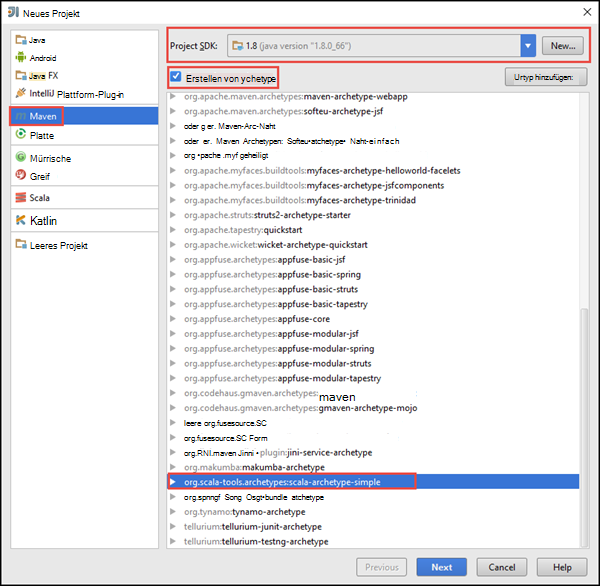
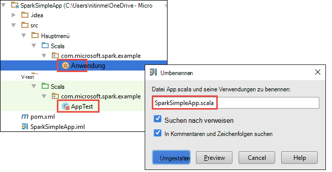
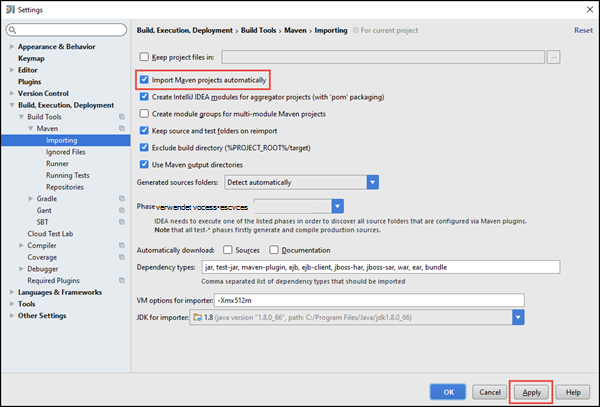
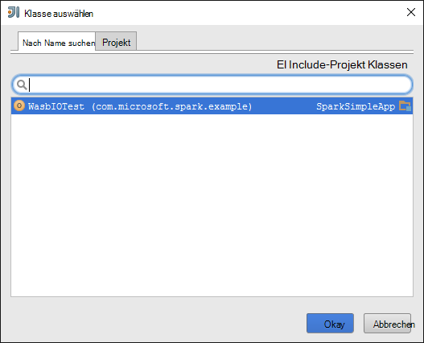
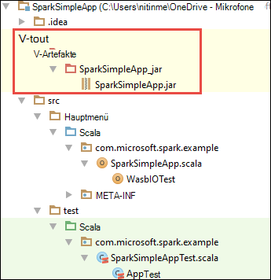

<properties
    pageTitle="Erstellen eigenständiger Scala auf HDInsight Spark Cluster | Microsoft Azure"
    description="Informationen Sie zum Erstellen einer eigenständiges Anwendung Spark HDInsight Spark-Cluster ausgeführt."
    services="hdinsight"
    documentationCenter=""
    authors="nitinme"
    manager="jhubbard"
    editor="cgronlun"
    tags="azure-portal"/>

<tags
    ms.service="hdinsight"
    ms.workload="big-data"
    ms.tgt_pltfrm="na"
    ms.devlang="na"
    ms.topic="article"
    ms.date="10/28/2016"
    ms.author="nitinme"/>

# Erstellen einer eigenständiges Scala Anwendung unter Apache Spark Cluster HDInsight Linux

Dieser Artikel enthält schrittweise Anwendungsentwicklung eigenständige Spark Scala schriftlich mit Maven mit IntelliJ. Artikel Apache Maven als das Buildsystem verwendet und beginnt mit einem vorhandenen Maven-Urtyp für Scala von IntelliJ bereitgestellt.  Auf hoher umfasst Erstellen einer Scala Anwendung IntelliJ IDEA folgende Schritte:

* Das Buildsystem verwenden Sie Maven.
* Projekt Objekt Model (POM) Updatedatei Spark Modul Abhängigkeit zu beheben.
* Schreiben Sie Ihre Anwendung in Scala.
* Generieren Sie eine JAR-Datei, die an HDInsight Spark Cluster gesendet werden kann.
* Führen Sie die Anwendung mit Livius Spark-Cluster.

>[AZURE.NOTE] HDInsight bietet auch eine IntelliJ IDEA Plugin-Tool zur vereinfachen und stellen eine HDInsight Spark-Cluster unter Linux. Weitere Informationen finden Sie unter [Verwendung HDInsight Tools Plugin IntelliJ Idee zu Spark beantragen](hdinsight-apache-spark-intellij-tool-plugin.md).

**Erforderliche Komponenten**

* Ein Azure-Abonnement. Finden Sie [kostenlose Testversion von Azure zu erhalten](https://azure.microsoft.com/documentation/videos/get-azure-free-trial-for-testing-hadoop-in-hdinsight/).
* Ein HDInsight Linux Apache Spark-Cluster. Informationen finden Sie [in Azure HDInsight Cluster Apache Spark erstellen](hdinsight-apache-spark-jupyter-spark-sql.md).
* Oracle Java Development Kit. Sie können es [hier](http://www.oracle.com/technetwork/java/javase/downloads/jdk8-downloads-2133151.html).
* Eine Java IDE. In diesem Artikel verwendet IntelliJ IDEA 15.0.1. Sie können es [hier](https://www.jetbrains.com/idea/download/).

## Scala Plugin für IntelliJ IDEA installieren

Wenn IntelliJ IDEA Installation nicht nicht auffordert Scala-Plug-in aktivieren, IntelliJ Idee und das Plugin installieren die folgenden Schritte aus:

1. Starten Sie IntelliJ IDEE zu, klicken Sie auf der Willkommensseite **Konfigurieren** , und klicken Sie **Plugins**.

    

2. Klicken Sie im nächsten Bildschirm auf **Installieren JetBrains-Plug-in** der linken unteren Ecke. Im Dialogfeld **Suchen JetBrains Plugins** Scala suchen Sie, und klicken Sie dann auf **Installieren**.

    

3. Nachdem das Plug-In erfolgreich installiert wurde, klicken Sie auf **Neustart IntelliJ IDEA Schaltfläche** Neustart die IDE.

## Erstellen Sie ein eigenständiges Projekt Scala

1. IntelliJ Idee und erstellen ein neues Projekt. Optionen Sie im Dialogfeld Neues Projekt die folgenden und klicken Sie dann auf **Weiter**.

    

    * Wählen Sie den Projekttyp **Maven** .
    * Geben Sie einen **Project SDK**. Klicken Sie auf neu, und navigieren Sie zum Installationsverzeichnis Java normalerweise `C:\Program Files\Java\jdk1.8.0_66`.
    * Aktivieren Sie die Option **aus Urtyp erstellen** .
    * Wählen Sie aus der Archetypen **org.scala tools.archetypes:scala Urtyp einfach**. Die richtige Verzeichnisstruktur erstellt und laden die erforderliche Abhängigkeit Scala Programm schreiben.

2. Geben Sie relevante Werte für **GroupId** **ArtifactId**und **Version**. Klicken Sie auf **Weiter**.

3. Akzeptieren Sie im nächsten Dialogfeld, wo Sie Maven-Basisverzeichnis und weitere Benutzer angeben die Standardeinstellungen, und klicken Sie auf **Weiter**.

4. Geben Sie im letzten Dialogfeld einen Namen und einen Speicherort, und klicken Sie dann auf **Fertig stellen**.

5. Löschen Sie die Datei **MySpec.Scala** unter **Src\test\scala\com\microsoft\spark\example**. Dies ist nicht für die Anwendung erforderlich werden.

6. Benennen Sie ggf. die Standarddateien Quell- und Test. Navigieren Sie im linken Bereich in IntelliJ IDEA **src\main\scala\com.microsoft.spark.example**. **App.scala**Maustaste auf **Umgestalten**, klicken Sie auf Datei umbenennen, und geben Sie im Dialogfeld den neuen Namen für die Anwendung und klicken Sie dann auf **Umgestalten**.

      

7. In den folgenden Schritten aktualisieren Sie pom.xml Abhängigkeiten Spark Scala Anwendung definieren. Für diese Abhängigkeit heruntergeladen und automatisch aufgelöst werden müssen Sie Maven entsprechend konfigurieren.

    

    1. Klicken Sie im Menü **Datei** auf **Settings**.
    2. Navigieren Sie im Dialogfeld **Einstellungen** zu **Ausführung Bereitstellung** > **Buildtools** > **Maven** > **Importieren**.
    3. Wählen Sie die Option **Import Maven-Projekte**.
    4. Klicken Sie auf **Übernehmen**, und klicken Sie dann auf **OK**.

8. Aktualisieren Sie Scala-Quelldatei auf Anwendungscode. Öffnen ersetzen Sie den vorhandenen Beispielcode durch folgenden Code und speichern Sie der. Dieser Code liest die Daten aus der HVAC.csv (verfügbar auf alle HDInsight Spark-Cluster) die Zeilen, die nur eine Ziffer in der sechsten Spalte und schreibt die Ausgabe in **/HVACOut** unter Standard-Behälter für den Cluster.

        package com.microsoft.spark.example

        import org.apache.spark.SparkConf
        import org.apache.spark.SparkContext

        /**
          * Test IO to wasb
          */
        object WasbIOTest {
          def main (arg: Array[String]): Unit = {
            val conf = new SparkConf().setAppName("WASBIOTest")
            val sc = new SparkContext(conf)

            val rdd = sc.textFile("wasbs:///HdiSamples/HdiSamples/SensorSampleData/hvac/HVAC.csv")

            //find the rows which have only one digit in the 7th column in the CSV
            val rdd1 = rdd.filter(s => s.split(",")(6).length() == 1)

            rdd1.saveAsTextFile("wasbs:///HVACout")
          }
        }

9. Aktualisieren der pom.xml.

    1.  In `<project>\<properties>` fügen Sie Folgendes hinzu:

            <scala.version>2.10.4</scala.version>
            <scala.compat.version>2.10.4</scala.compat.version>
            <scala.binary.version>2.10</scala.binary.version>

    2. In `<project>\<dependencies>` fügen Sie Folgendes hinzu:

            <dependency>
              <groupId>org.apache.spark</groupId>
              <artifactId>spark-core_${scala.binary.version}</artifactId>
              <version>1.4.1</version>
            </dependency>

    Pom.xml speichern.

10. Erstellen Sie die JAR-Datei. IntelliJ IDEA können JAR als außertextliche Elemente eines Projekts erstellen. Führen Sie die folgenden Schritte aus.

    1. Klicken Sie im Menü **Datei** auf **Projektstruktur**.
    2. Klicken Sie im Dialogfeld **Struktur** **Artefakte** auf, und klicken Sie dann auf das Pluszeichen. Popup-Dialogfeld auf **JAR**und **Module Abhängigkeiten**klicken.

        

    3. Klicken Sie im Dialogfeld **Erstellen aus Glas** auf das Auslassungszeichen ( ) für die **Main-Klasse**.

    4. Wählen Sie im Dialogfeld **Wählen Sie Main Klasse** die Klasse, die standardmäßig angezeigt wird, und klicken Sie auf **OK**.

        

    5. Stellen Sie im Dialogfeld **Erstellen aus Glas** sicher, dass die Option **auf JAR-Datei** extrahiert und klicken Sie dann auf **OK**. Dies erstellt ein Glas mit konfiguriert.

        

    6. Registerkarte Layout Ausgabe Listet alle Gläser, die das Maven-Projekt enthalten sind. Wählen und löschen auf dem Scala-Anwendung hat keine direkte Abhängigkeit. Wir hier schaffen in der Anwendung können Sie alle außer der letzten Entfernen eines (**SparkSimpleApp kompilieren Ausgabe**). Wählen Sie die Gläser und dann auf das Symbol **Löschen** .

        

        Sicherstellen Sie, dass **bauen auf** das aktiviert ist, wird sichergestellt, dass die JAR-Datei erstellt wird, jedes Mal, wenn das Projekt erstellt oder aktualisiert wird. Klicken Sie auf **Übernehmen** und dann auf **OK**.

    7. In der Menüleiste auf **Erstellen**und dann auf **Projekt erstellen**. Klicken Sie auf **Erstellen Artefakte** JAR-Datei erstellen. Die Ausgabe JAR-Datei wird unter **\out\artifacts**erstellt.

        

## Führen Sie die Anwendung auf dem Cluster Funken

Führen Sie die Anwendung auf dem Cluster muss Folgendes:

* **Kopieren die Jar Anwendung in Azure-Speicher-Blob** Cluster zugeordnet. [**AzCopy**](../storage/storage-use-azcopy.md), Befehlszeilen-Dienstprogramm können Sie tun. Gibt es viele andere Kunden, mit denen Sie Daten hochladen. Sie können mehr über diese [Daten für Projekte in HDInsight Hadoop](hdinsight-upload-data.md)finden.

* **Livius verwendet eine Anwendung Arbeit Remote senden** Spark-Cluster. Spark auf HDInsight Cluster umfasst Livius, der REST-Endpunkte zum Remote Spark Aufträge senden verfügbar macht. Weitere Informationen finden Sie unter [Senden Spark Aufträge über Livius mit Spark auf HDInsight](hdinsight-apache-spark-livy-rest-interface.md).

## Siehe auch

* [Übersicht: Apache Spark auf Azure HDInsight](hdinsight-apache-spark-overview.md)

### Szenarien

* [Spark BI: Datenanalyse interaktive BI-Tools Spark in HDInsight mit](hdinsight-apache-spark-use-bi-tools.md)

* [Spark mit Computer: Funken im HDInsight für die Analyse erstellen Temperatur HKL-Daten verwenden](hdinsight-apache-spark-ipython-notebook-machine-learning.md)

* [Spark mit Computer: Spark in HDInsight Lebensmittel Ergebnisse vorherzusagen verwenden](hdinsight-apache-spark-machine-learning-mllib-ipython.md)

* [Spark Streaming: Verwendung Funken im HDInsight zum Erstellen von Echtzeit-streaming](hdinsight-apache-spark-eventhub-streaming.md)

* [Websiteanalyse mit Spark in HDInsight](hdinsight-apache-spark-custom-library-website-log-analysis.md)

### Erstellen und Ausführen der Anwendung

* [Führen Sie Aufträge auf einem Spark-Cluster mit Livius Remote aus](hdinsight-apache-spark-livy-rest-interface.md)

### Tools und Erweiterung

* [Verwenden Sie HDInsight Tools Plugin für IntelliJ IDEA erstellen und übermitteln Spark Scala Programme](hdinsight-apache-spark-intellij-tool-plugin.md)

* [Mit HDInsight Tools Plugin IntelliJ Idee Remotedebugging Spark-Applikationen](hdinsight-apache-spark-intellij-tool-plugin-debug-jobs-remotely.md)

* [Verwenden Sie Zeppelin Notebooks mit einem Cluster Spark HDInsight](hdinsight-apache-spark-use-zeppelin-notebook.md)

* [Cluster-Kernels für Jupyter Notebook Spark für HDInsight](hdinsight-apache-spark-jupyter-notebook-kernels.md)

* [Verwenden Sie externe Pakete mit Jupyter notebooks](hdinsight-apache-spark-jupyter-notebook-use-external-packages.md)

* [Jupyter auf dem Computer installieren und Verbinden mit einem HDInsight Spark-cluster](hdinsight-apache-spark-jupyter-notebook-install-locally.md)

### Verwalten von Ressourcen

* [Ressourcen Sie für den Apache Spark-Cluster in Azure HDInsight](hdinsight-apache-spark-resource-manager.md)

* [Verfolgen und Debug Aufträge in einem Apache Spark-Cluster HDInsight](hdinsight-apache-spark-job-debugging.md)
