 <properties
    pageTitle="Spark Scala mit HDInsight Werkzeugen in Azure Toolkit für Eclipse erstellen | Microsoft Azure"
    description="Informationen Sie zum Erstellen einer eigenständiges Anwendung Spark HDInsight Spark-Cluster ausgeführt."
    services="hdinsight"
    documentationCenter=""
    authors="nitinme"
    manager="jhubbard"
    editor="cgronlun"
    tags="azure-portal"/>

<tags
    ms.service="hdinsight"
    ms.workload="big-data"
    ms.tgt_pltfrm="na"
    ms.devlang="na"
    ms.topic="article"
    ms.date="08/30/2016"
    ms.author="nitinme"/>

# Verwenden Sie HDInsight in Azure Toolkit für Eclipse Spark Anträge HDInsight Spark Linux Cluster erstellen

Dieser Artikel enthält schrittweise Spark Anwendungsentwicklung in uns und senden sie ein HDInsight Spark cluster mit HDInsight Werkzeugen in Azure Toolkit für Eclipse geschrieben. Die Tools können auf unterschiedliche Weise:

* Zu einer Scala Spark Antrag auf einem HDInsight Spark-cluster
* Zugriff auf die Clusterressourcen Azure HDInsight Funken
* Zu eine Scala Spark Anwendung lokal ausführen

>[AZURE.IMPORTANT] Dieses Tool kann verwendet werden, zu beantragen nur für HDInsight Spark-Cluster unter Linux.

##Erforderliche Komponenten

* Ein Azure-Abonnement. Finden Sie [kostenlose Testversion von Azure zu erhalten](https://azure.microsoft.com/documentation/videos/get-azure-free-trial-for-testing-hadoop-in-hdinsight/).

* Ein HDInsight Linux Apache Spark-Cluster. Informationen finden Sie [in Azure HDInsight Cluster Apache Spark erstellen](hdinsight-apache-spark-jupyter-spark-sql.md).

* Oracle Java Development kit 7 und Version 8. 
    * **Java SDK 7** wird zum Kompilieren Spark Projekte als HDInsight Cluster Java Version 7 unterstützt. Sie können Java SDK 7 [hier](http://www.oracle.com/technetwork/java/javase/downloads/jdk7-downloads-1880260.html)herunterladen.
    * **Java SDK 8** ist für Eclipse-IDE Runtime verwendet. Sie können es [hier](http://www.oracle.com/technetwork/java/javase/downloads/jdk8-downloads-2133151.html)herunterladen.

* Eclipse-IDE. In diesem Artikel verwendet Eclipse Neon. Sie können es [hier](https://www.eclipse.org/downloads/).

* Scala IDE Eclipse. 
    * **Eclipse-IDE installiert haben**, können Sie hinzufügen Scala IDE-Plugin **helfen** -> **Neue SoftWare installieren**und [http://download.scala-ide.org/sdk/lithium/e44/scala211/stable/site](http://download.scala-ide.org/sdk/lithium/e44/scala211/stable/site) als Quelle Scala Plugin für Eclipse herunterladen. 
    * **Wenn Sie keine Eclipse-IDE installiert haben**, können Sie direkt von [hier](http://scala-ide.org/download/sdk.html)Scala IDE installieren. Sie können hier die ZIP-Datei herunterladen, extrahieren sie den **/eclipse** Ordner und führen Sie **eclipse.exe** Datei aus.
    
    >[AZURE.NOTE] Die Schritte in diesem Dokument basieren auf Eclipse-IDE mit Scala-Plug-In installiert.

* Spark SDK. Sie können es [hier](http://go.microsoft.com/fwlink/?LinkID=723585&clcid=0x409)herunterladen.

* Installieren Sie e (fx) Clipse von [https://www.eclipse.org/efxclipse/install.html](https://www.eclipse.org/efxclipse/install.html).

## HDInsight Tools in Azure Toolkit für Eclipse installieren

HDInsight tools Eclipse ist als Teil der Azure-Toolkit für Eclipse. Anleitung zum Installieren der Azure-Toolkit finden Sie in der [Azure-Toolkit für Eclipse installieren](../azure-toolkit-for-eclipse-installation.md).

## Azure-Abonnement anmelden

1. Starten Sie Eclipse-IDE und öffnen Sie Azure-Explorer. Menü **Fenster** in der IDE auf **Ansicht anzeigen,** und klicken Sie dann auf **andere**. Im daraufhin geöffneten Dialogfeld erweitern Sie **Azure**, auf **Azure Explorer**und klicken Sie dann auf **OK**.

    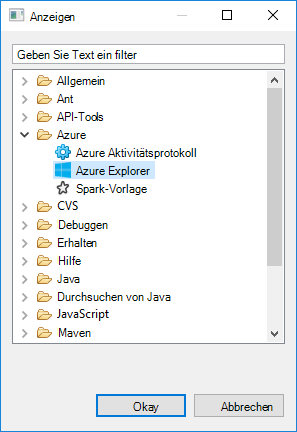

2. Maustaste auf **Azure** Knoten in **Azure Explorer**, und klicken Sie dann auf **Abonnements verwalten**.

3. Im Dialogfeld **Abonnements verwalten** klicken Sie auf **Anmelden** und geben Sie Ihre Azure-Anmeldeinformationen.

    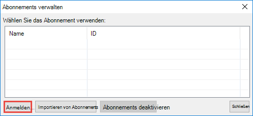

4. Nachdem Sie sich angemeldet haben, zeigt das Dialogfeld **Abonnements verwalten** alle Azure Abonnements, die den Anmeldeinformationen zugeordnet. Klicken Sie auf **Schließen** im Dialogfeld.

5. Die Registerkarte Azure Explorer erweitern Sie **HDInsight** um HDInsight Spark-Cluster unter Abonnements angezeigt.

    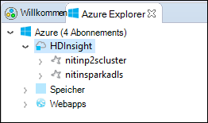

6. Sie können einen Clusterknoten Namen um die Ressourcen (z. B. Speicherkonten) den Cluster weiter.

    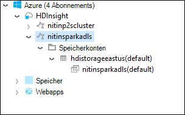

## Einrichten eines Projekts Spark Scala für HDInsight Spark-cluster

1. Arbeitsbereich Eclipse-IDE auf **Datei**, klicken Sie auf **neu**, und klicken Sie auf **Projekt**. 

2. Im **Neuen Projekt** -Assistenten erweitern Sie **HDInsight**, wählen Sie **Spark auf HDInsight (Scala)**und klicken Sie auf **Weiter**.

    

3. Klicken Sie im Dialogfeld **Neue HDInsight Scala Projekt** eingeben/auswählen Werte wie in der folgenden Abbildung dargestellt und klicken Sie auf **Weiter**.

    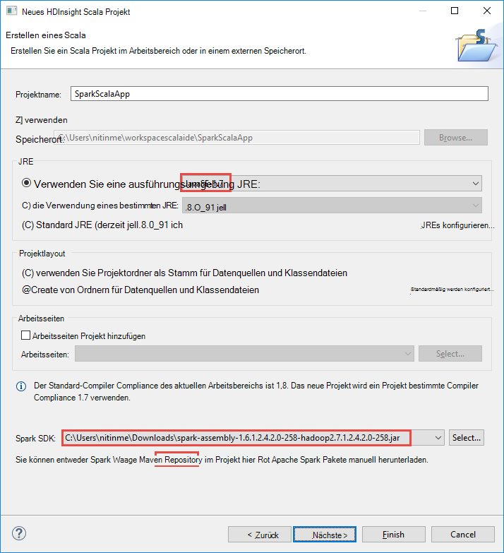

    * Geben Sie einen Namen für das Projekt.
    * Im Feld **JRE** unbedingt **eine Execution Environment JRE** bis **1,7 JavaSE**festgelegt ist.
    * Stellen Sie sicher, dass Spark SDK auf die Position eingestellt wird, wo das SDK heruntergeladen. Die Verknüpfung zum Downloadpfad ist in [Komponenten](#prerequisites) weiter oben in diesem Thema enthalten. Über den Link in diesem Dialogfeld können Sie auch das SDK herunterladen, wie im Bild oben gezeigt.    

4. Klicken Sie im nächsten Dialogfeld auf der Registerkarte **Bibliotheken** und doppelklicken Sie dann auf **JRE-Systembibliothek [JavaSE-1.7]**.

    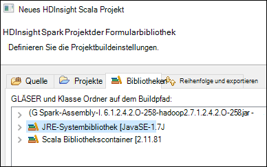

5. Klicken Sie im Dialogfeld **Bibliothek bearbeiten** unbedingt **Execution Environment** auf **JavaSE-1.7(jdk1.7.0_79)**festgelegt ist. Wenn dies nicht als Option verfügbar ist, gehen.

    1. Wählen Sie die Option **Andere JRE** und **JavaSE-1.7(jdk1.7.0_79)** verfügbar ist.
    2. Wenn dies nicht der Fall ist, klicken Sie auf **JRE installiert** .

          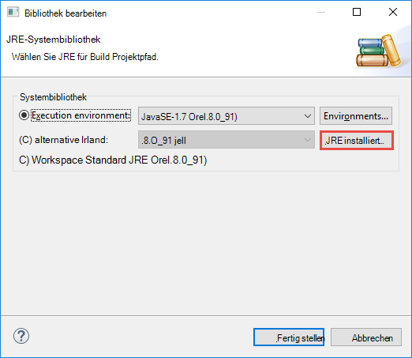

    3. Klicken Sie auf **Hinzufügen**, klicken Sie im Dialogfeld **JRE installiert** .

          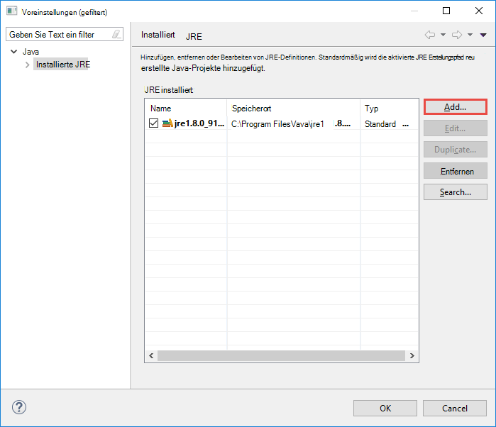  

    4. Klicken Sie im Dialogfeld **JRE-Typ** wählen Sie **Standard-VM**, und klicken Sie auf **Weiter**

            

    5. Klicken Sie im Dialogfeld **JRE Definition** auf Verzeichnis, navigieren Sie zum Speicherort für die Installation von JDK 7, und wählen Sie den Stammordner für **Jdk1.7.0_79**.

          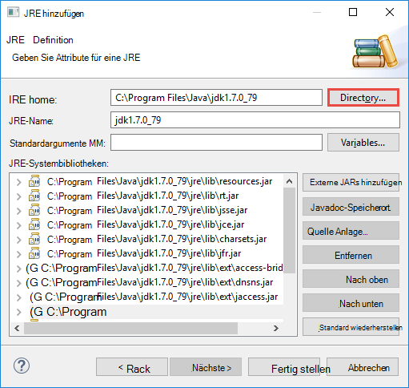  

    6. Klicken Sie auf **Fertig stellen**. Wählen Sie im Dialogfeld **JRE installiert** neue JRE aus und klicken Sie dann auf **OK**.

           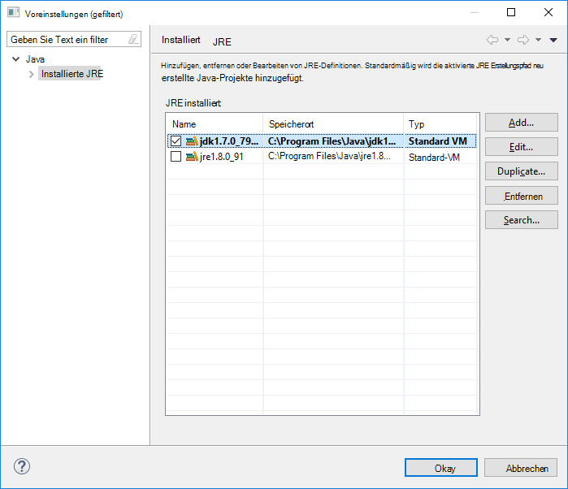

    7. Die neue JRE sollte für **Ausführung**aufgeführt. Klicken Sie auf **Fertig stellen**.

           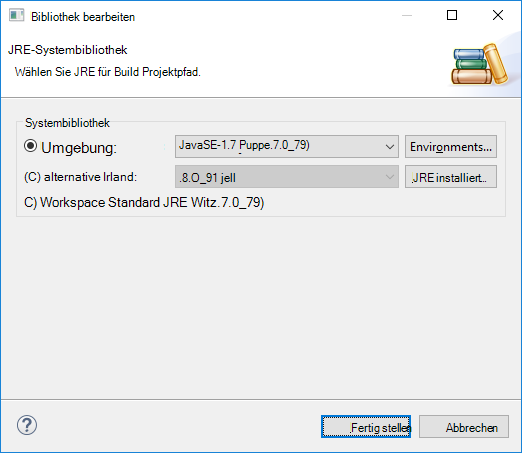

6. Doppelklicken Sie auf der Registerkarte **Bibliotheken** **Bibliothekscontainer Scala [2.11.8]**. Wählen Sie im Dialogfeld **Bibliothek bearbeiten** **festen Scala Bibliothek Container: 2.10.6.**. 

    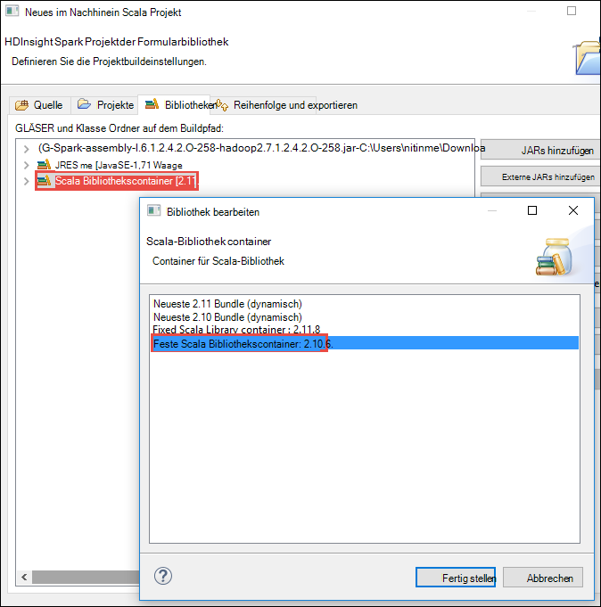

    Das Dialogfeld Projekt beenden, klicken Sie auf **Fertig stellen** .

## Erstellen Sie eine Scala-Anwendung für HDInsight Spark-cluster

1. In der bereits Eclipse-IDE aus dem **Paket-Explorer**erweitern Sie das Projekt, das Sie zuvor erstellt haben, mit der rechten Maustaste **Src**, **neu**und klicken Sie auf **andere**.

2. Im Dialogfeld **Wählen Sie einen Assistenten** erweitern Sie **Scala Assistenten**zu, klicken Sie auf **Scala-Objekt**und klicken Sie auf **Weiter**.

    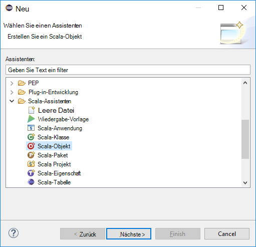

3. Klicken Sie im Dialogfeld **Neue Datei erstellen** Geben Sie einen Namen für das Objekt, und klicken Sie dann auf **Fertig stellen**.

    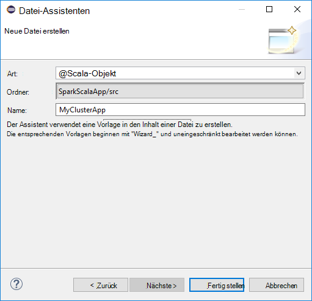

4. Fügen Sie folgenden Code in den Text-Editor.

        import org.apache.spark.SparkConf
        import org.apache.spark.SparkContext
    
        object MyClusterApp{
          def main (arg: Array[String]): Unit = {
            val conf = new SparkConf().setAppName("MyClusterApp")
            val sc = new SparkContext(conf)
        
            val rdd = sc.textFile("wasbs:///HdiSamples/HdiSamples/SensorSampleData/hvac/HVAC.csv")
        
            //find the rows which have only one digit in the 7th column in the CSV
            val rdd1 =  rdd.filter(s => s.split(",")(6).length() == 1)
        
            rdd1.saveAsTextFile("wasbs:///HVACOut")
          }     
        }

5. Führen Sie die Anwendung in einem Cluster HDInsight Spark.

    1. **Paket-Explorer**mit der rechten Maustaste des Namens des Projekts und wählen Sie **HDInsight Spark Anwendung senden**.      

    2. Klicken Sie im Dialogfeld **Vorlage Spark** bieten Sie folgende Werte.

        * Wählen Sie für **Clustername**HDInsight Spark-Cluster auf dem die Anwendung ausgeführt werden soll.

        * Sie müssen Eclipse-Projekt ein Element auswählen, oder wählen eine Festplatte aus.

        * Für das Textfeld **Hauptklassenname** Geben Sie den Namen des Objekts im Code angegeben (siehe Abbildung unten).

            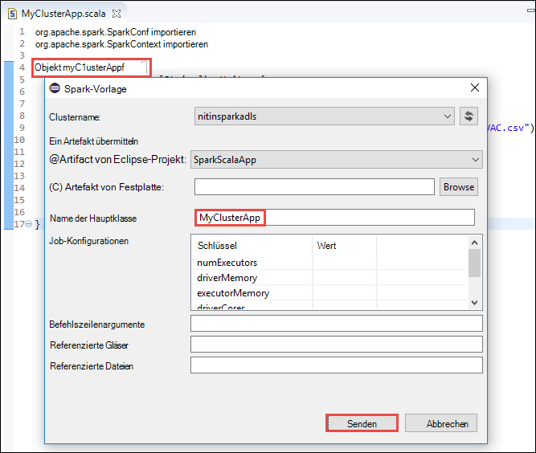

        * Da der Anwendungscode in diesem Beispiel keine Befehlszeilenargumente erfordert oder Gläser oder Dateien verweisen, können Sie die restlichen Textfelder leer lassen.

        * Klicken Sie auf **Senden**.

    3. Registerkarte **Spark Einreichung** startet den Status anzeigt. Durch Klicken auf die Schaltfläche im Fenster "Spark Beitrag" können Sie die Anwendung beenden. Sie können auch die Protokolle für diese spezielle Anwendung durch Klicken auf das Globussymbol (gekennzeichnet durch das Blau im Bild) anzeigen.

        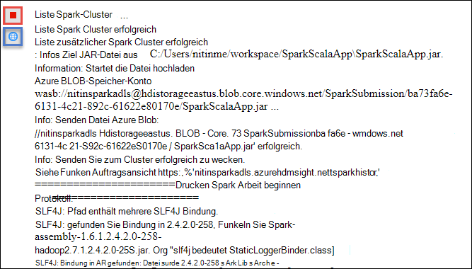

    Im nächsten Abschnitt erfahren Sie, wie auf den Auftrag mit der HDInsight-Tools in Azure Toolkit für Eclipse ausgegeben.

## Zugriff auf HDInsight Spark-Cluster und verwalten Sie der Einsatz HDInsight in Azure Toolkit für Eclipse

Sie können eine Vielzahl von Vorgängen mithilfe der HDInsight-Tools ausführen.

### Zugriff auf Behälter für den cluster

1. Erweitern Sie Azure-Explorer **HDInsight** Stammknoten zum HDInsight Spark Cluster aufgelistet, die verfügbar sind.

3. Erweitern Sie den Clusternamen das Speicherkonto und Standard-Behälter für den Cluster.

    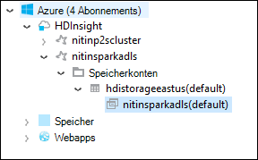

4. Klicken Sie auf Storage Container Cluster zugeordnet. Im rechten Fenster erhalten Sie einen Ordner namens **HVACOut**. Doppelklicken Sie auf den Ordner, und Sie sehen **sich*** Dateien. Öffnen Sie die Dateien auf die Ausgabe der Anwendung.

### Zugriff auf den Server Spark-Verlauf

1. **Azure Explorer**der Clustername Spark Maustaste, und wählen Sie **Öffnen Spark Geschichte Benutzeroberfläche**. Geben Sie bei Aufforderung die Administratoranmeldeinformationen für den Cluster. Sie müssen während der Bereitstellung des Clusters angegeben haben.

2. Im Dashboard Spark Geschichte Server Sie finden die Anwendung Sie gerade ausgeführt, indem der Anwendungsname. Im obigen Code Festlegen der Anwendung mit `val conf = new SparkConf().setAppName("MyClusterApp")`. Der Anwendungsname Spark wurde daher **MyClusterApp**.

### Ambari Portal starten

**Azure Explorer**mit der rechten Maustaste der Clustername Spark und dann **Öffnen Cluster-Verwaltungsportal (Ambari)**. Geben Sie bei Aufforderung die Administratoranmeldeinformationen für den Cluster. Sie müssen während der Bereitstellung des Clusters angegeben haben.

### Azure-Abonnements verwalten

Standardmäßig führt die HDInsight-Tools in Azure Toolkit für Eclipse Spark-Clustern alle Azure Abonnements. Gegebenenfalls können Sie die Abonnements zugreifen werden soll. **Azure Explorer**klicken Sie auf den Stammknoten **Azure** und klicken Sie dann auf **Abonnements verwalten**. Kontrollkästchen Sie im Dialogfeld das für das Abonnement nicht zugreifen und dann auf **Schließen**möchten. Sie können auch **Abmelden** klicken Sie ggf. aus dem Azure-Abonnement abmelden.

## Spark Scala Anwendung lokal ausführen

Azure-Toolkit für Eclipse können HDInsight-Tools Sie Spark Scala Anwendung lokal auf der Arbeitsstation ausgeführt. In der Regel Anträge nicht benötigen Zugriff auf Clusterressourcen wie Behälter ausführen und lokal getestet.

### Voraussetzung

Beim lokalen Spark Scala-Anwendung auf einem windowscomputer ausführen, erhalten Sie möglicherweise eine Ausnahme, wie in [SPARK-2356](https://issues.apache.org/jira/browse/SPARK-2356) , die aufgrund einer fehlenden **WinUtils.exe** auf Windows-Betriebssystem. Um diesen Fehler zu umgehen, müssen Sie wie **C:\WinUtils\bin**an [die ausführbare Datei hier herunterladen](http://public-repo-1.hortonworks.com/hdp-win-alpha/winutils.exe) . Sie müssen eine Umgebungsvariable **HADOOP_HOME** hinzufügen und den Wert der Variablen auf **C\WinUtils**festgelegt.

### Ausführen einer lokalen Spark Scala-Anwendung  

1. Eclipse starten und ein neues Projekt erstellen. Optionen Sie im Dialogfeld Neues Projekt die folgenden und klicken Sie dann auf **Weiter**.

    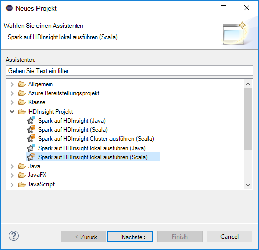

    * Wählen Sie im linken Bereich **HDInsight**.
    * Wählen Sie im rechten Bereich **Spark auf HDInsight lokalen ausführen (Scala)**.
    * Klicken Sie auf **Weiter**.

2. Um die Projektdetails bereitzustellen, Schritte 3 bis 6 wie oben beschrieben [ein Anwendungsprojekt Spark Scala für HDInsight Spark-Cluster einrichten](#set-up-a-spark-scala-application-project-for-an-hdinsight-spark cluster).

3. Die Vorlage fügt einen Beispielcode (**LogQuery**) im Ordner **Src** , die lokal auf Ihrem Computer ausführen.

    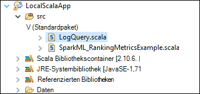

4.  Klicken Sie mit der rechten Maustaste auf die Anwendung **LogQuery** **als**zeigen Sie und klicken Sie auf **1 Scala Anwendung**. Sie sehen eine Ausgabe wie diese **Konsole** Registerkarte unten.

    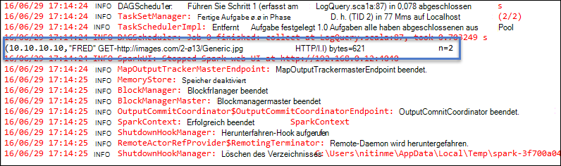

## Feedback und bekannte Probleme

Gerade Spark gibt direkt nicht unterstützt wird, und wir arbeiten daran.

Zögern Sie Wenn Sie Feedback oder Vorschläge haben oder Probleme auftreten, wenn Sie dieses Tool verwenden, nicht, uns eine e-Mail an Hdivstool bei Microsoft Dot Com.

## Siehe auch

* [Übersicht: Apache Spark auf Azure HDInsight](hdinsight-apache-spark-overview.md)

### Szenarien

* [Spark BI: Datenanalyse interaktive BI-Tools Spark in HDInsight mit](hdinsight-apache-spark-use-bi-tools.md)

* [Spark mit Computer: Funken im HDInsight für die Analyse erstellen Temperatur HKL-Daten verwenden](hdinsight-apache-spark-ipython-notebook-machine-learning.md)

* [Spark mit Computer: Spark in HDInsight Lebensmittel Ergebnisse vorherzusagen verwenden](hdinsight-apache-spark-machine-learning-mllib-ipython.md)

* [Spark Streaming: Verwendung Funken im HDInsight zum Erstellen von Echtzeit-streaming](hdinsight-apache-spark-eventhub-streaming.md)

* [Websiteanalyse mit Spark in HDInsight](hdinsight-apache-spark-custom-library-website-log-analysis.md)

### Erstellen und Ausführen der Anwendung

* [Erstellen Sie eine eigenständige Anwendung Scala](hdinsight-apache-spark-create-standalone-application.md)

* [Führen Sie Aufträge auf einem Spark-Cluster mit Livius Remote aus](hdinsight-apache-spark-livy-rest-interface.md)

### Tools und Erweiterung

* [Verwenden Sie HDInsight in Azure Toolkit für IntelliJ zum Erstellen und übermitteln Spark Scala Programme](hdinsight-apache-spark-intellij-tool-plugin.md)

* [Mit der HDInsight-Tools in Azure Toolkit für IntelliJ Remotedebugging Spark-Applikationen](hdinsight-apache-spark-intellij-tool-plugin-debug-jobs-remotely.md)

* [Verwenden Sie Zeppelin Notebooks mit einem Cluster Spark HDInsight](hdinsight-apache-spark-use-zeppelin-notebook.md)

* [Cluster-Kernels für Jupyter Notebook Spark für HDInsight](hdinsight-apache-spark-jupyter-notebook-kernels.md)

* [Verwenden Sie externe Pakete mit Jupyter notebooks](hdinsight-apache-spark-jupyter-notebook-use-external-packages.md)

* [Jupyter auf dem Computer installieren und Verbinden mit einem HDInsight Spark-cluster](hdinsight-apache-spark-jupyter-notebook-install-locally.md)

### Verwalten von Ressourcen

* [Ressourcen Sie für den Apache Spark-Cluster in Azure HDInsight](hdinsight-apache-spark-resource-manager.md)

* [Verfolgen und Debug Aufträge in einem Apache Spark-Cluster HDInsight](hdinsight-apache-spark-job-debugging.md)
