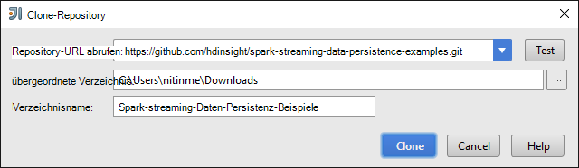
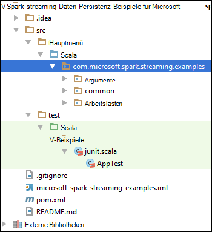
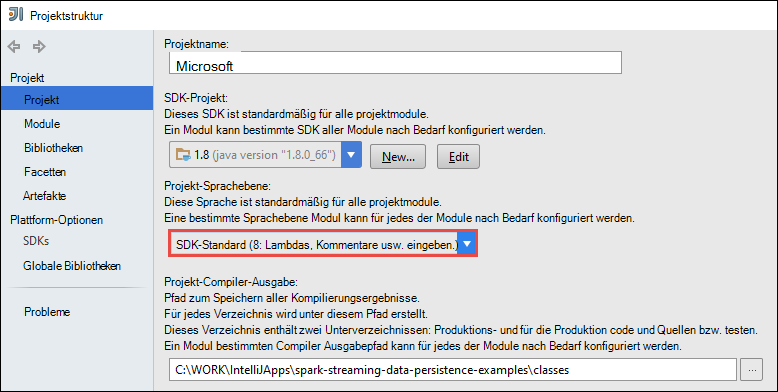
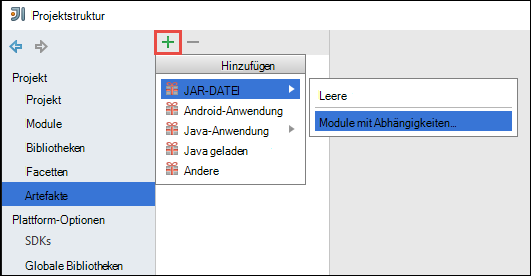
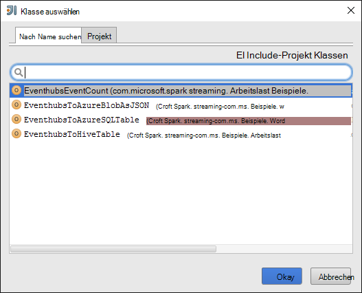
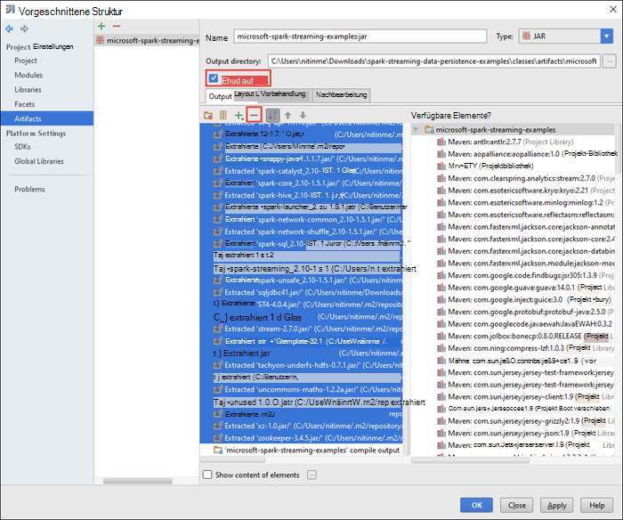
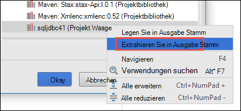
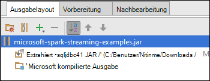
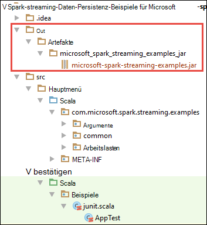

<properties 
    pageTitle="Verwenden Sie Azure Ereignis Hubs mit Apache Spark in HDInsight Daten zu | Microsoft Azure" 
    description="Anleitung zum Senden einer Azure Event Hub übertragen und werden diese Ereignisse im Scala Anwendung Funken" 
    services="hdinsight" 
    documentationCenter="" 
    authors="nitinme" 
    manager="jhubbard" 
    editor="cgronlun"
    tags="azure-portal"/>

<tags 
    ms.service="hdinsight" 
    ms.workload="big-data" 
    ms.tgt_pltfrm="na" 
    ms.devlang="na" 
    ms.topic="article" 
    ms.date="09/30/2016" 
    ms.author="nitinme"/>

# Spark Streaming: Verarbeitet Ereignisse von Azure Ereignis Hubs mit Apache Spark HDInsight Linux

Spark Streaming erweitert die Kern-API Spark skalierbare, fehlertolerante hohem Durchsatz Stream Applikationen erstellt. Daten können aus vielen Quellen aufgenommen werden. In diesem Artikel verwenden wir Azure Ereignis Hubs Daten aufnehmen. Ereignis-Hubs ist ein hochskalierbares Einnahme System, können Millionen Ereignisse pro Sekunde. 

In diesem Lernprogramm lernen Sie eine Azure Event Hub erstellen wie Nachrichten in ein Ereignis mit einem Konsolenanwendungsprojekt in Java aufnehmen und Abruf parallel eine Anwendung Spark in Scala geschrieben. Anwendung verbraucht über Ereignis Hubs übertragen Daten und leitet sie an unterschiedliche Ausgaben (Azure Storage Blob Hive-Tabelle und SQL-Tabelle).

> [AZURE.NOTE] Die Anleitung in diesem Artikel folgen zu können, müssen Sie beide Versionen der Azure-Portal verwendet. Erstellen einer Event-Hub verwenden Sie [Azure-Verwaltungsportal](https://manage.windowsazure.com). Verwenden Sie zum Arbeiten mit dem HDInsight Spark [Azure-Portal](https://portal.azure.com/).  

**Komponenten:**

Sie benötigen Folgendes:

- Ein Azure-Abonnement. Finden Sie [kostenlose Testversion von Azure zu erhalten](https://azure.microsoft.com/documentation/videos/get-azure-free-trial-for-testing-hadoop-in-hdinsight/).
- Apache Spark-Cluster. Informationen finden Sie [in Azure HDInsight Cluster Apache Spark erstellen](hdinsight-apache-spark-jupyter-spark-sql.md).
- Oracle Java Development Kit. Sie können es [hier](http://www.oracle.com/technetwork/java/javase/downloads/jdk8-downloads-2133151.html).
- Eine Java IDE. In diesem Artikel verwendet IntelliJ IDEA 15.0.1. Sie können es [hier](https://www.jetbrains.com/idea/download/).
- Microsoft JDBC-Treiber für SQL Server, Version 4.1 oder höher. Dies ist erforderlich, die Daten in einer SQL Server-Datenbank schreiben. Sie können es [hier](https://msdn.microsoft.com/sqlserver/aa937724.aspx).
- Eine SQL Azure-Datenbank. Eine Anleitung finden Sie unter [Erstellen einer SQL-Datenbank in Minuten](../sql-database/sql-database-get-started.md).

## Wozu dient dies?

Dadurch fließt wie Streaming-Lösung:

1. Erstellen einer Azure Event Hub, die einen Stream von Ereignissen erhalten.

2. Ausführen einer lokalen Standalone-Anwendung generiert Ereignisse und legt Azure Event Hub. Beispielanwendung, die dies ist am [https://github.com/hdinsight/spark-streaming-data-persistence-examples](https://github.com/hdinsight/spark-streaming-data-persistence-examples)veröffentlicht.

2. Remoteausführung Streaming-Anwendung auf einem Spark-Cluster, der Streaming-Ereignisse von Azure Event Hub liest und an andere Standorte (Azure BLOB-Struktur Tabelle und SQL-Datenbanktabelle) drückt. 

## Azure Event Hub erstellen

1. Wählen Sie aus dem [Azure-Portal](https://manage.windowsazure.com) **neu** > **Service Bus** > **Event Hub** > **Benutzerdefinierte**.

2. Auf dem Bildschirm **Hinzufügen neuer Ereignis-Hub** ein **Hub Ereignisname**, der **Region** Hub, erstellen und einen neuen Namespace erstellen oder bestehende auswählen. Klicken Sie auf den **Pfeil** , um fortzufahren.

    ![Seite 1 des Assistenten] (./media/hdinsight-apache-spark-eventhub-streaming/hdispark.streaming.create.event.hub.png "Einen Hub Azure Ereignis erstellen")

    > [AZURE.NOTE] Sie sollten als Clusterressourcen Apache Spark HDInsight Verringerung der Latenz und Kosten am selben **Speicherort** auswählen.

3. Geben Sie auf dem Bildschirm **Konfigurieren Ereignis Hub** **Partitionen** und **Message-Aufbewahrung** und klicken Sie auf das Häkchen. Verwenden Sie für dieses Beispiel Partitionsanzahl von 10 und einer Aufbewahrungsrichtlinie Nachricht 1. Beachten Sie die Anzahl der Partitionen, da dieser Wert später benötigen.

    ![Seite 2] (./media/hdinsight-apache-spark-eventhub-streaming/hdispark.streaming.create.event.hub2.png "Geben Sie Partition Größe und Aufbewahrung Tage Ereignis-Hub")

4. Klicken Sie auf Ereignis-Hub, die Sie erstellt haben, klicken Sie auf **Konfigurieren**und erstellen Sie zwei Richtlinien Ereignisses Hub

    <table>
    <tr><th>Name</th><th>Berechtigungen</th></tr>
    <tr><td>mysendpolicy</td><td>Senden</td></tr>
    <tr><td>myreceivepolicy</td><td>Überwachen</td></tr>
    </table>

    Nach dem Erstellen der Berechtigungen wählen Sie des Symbols **Speichern** am unteren Rand der Seite. Dies erstellt die freigegebenen Richtlinien, die zu senden (**Mysendpolicy**) (**Myreceivepolicy**) dieser Ereignis-Hub verwendet werden.

    ![Richtlinien] (./media/hdinsight-apache-spark-eventhub-streaming/hdispark.streaming.event.hub.policies.png "Richtlinien Ereignisses Hub erstellen")

    
5. Notieren Sie auf der Seite die Richtlinienschlüssel für zwei Richtlinien erstellt. Speichern Sie diesen Schlüssel, da sie später verwendet werden.

    ![Richtlinienschlüssel] (./media/hdinsight-apache-spark-eventhub-streaming/hdispark.streaming.event.hub.policy.keys.png "Richtlinienschlüssel speichern")

6. Klicken Sie auf **der Dashboardseite** **Informationen** unten abrufen und speichern die Verbindungszeichenfolgen für den Ereignis-Hub mit zwei Richtlinien.

    ![Richtlinienschlüssel] (./media/hdinsight-apache-spark-eventhub-streaming/hdispark.streaming.event.hub.policy.connection.strings.png "Speichern Sie Verbindungszeichenfolgen Richtlinie")

## Anwendung Event Hub Nachrichten Scala

In diesem Abschnitt verwenden Sie eigenständige lokale Scala Anwendung Azure Event Hub einen Stream von Ereignissen an, die Sie im vorherigen Schritt erstellt haben. Diese Anwendung ist auf der GitHub unter [https://github.com/hdinsight/eventhubs-sample-event-producer](https://github.com/hdinsight/eventhubs-sample-event-producer)verfügbar. Die Schritte angenommen, dieses GitHub Repository bereits gespalten haben.

1. Öffnen Sie die Anwendung **EventhubsSampleEventProducer**IntelliJ Idee.
    
2. Erstellen Sie das Projekt. Klicken Sie im Menü **Erstellen** auf **Projekt erstellen**. Die Ausgabe JAR-Datei wird unter **\out\artifacts**erstellt.

>[AZURE.TIP] Eine Option IntelliJ IDEA können Sie um das Projekt direkt aus einem GitHub Repository zu erstellen. Verwenden Sie verstehen, möchten, wie dieser Ansatz der Anleitung im nächsten Abschnitt Anleitung. Beachten Sie, dass viele im nächsten Abschnitt beschriebenen Schritte nicht für die Scala-Anwendung, die Sie in diesem Schritt erstellen. Zum Beispiel:

> * Sie haben nicht das POM um die Spark-Version aktualisieren. Deshalb besteht keine Abhängigkeit Spark für diese Anwendung erstellen
> * Sie haben nicht die Projektbibliothek einige Gläser Abhängigkeit hinzufügen. Deshalb die Gläser nicht für dieses Projekt erforderlich sind.

## Streaming-Anwendung für den Empfang der Ereignisse Scala aktualisieren

Eine Beispiel Scala Anwendung das Ereignis und dessen Weiterleitung an verschiedene Ziele ist unter [https://github.com/hdinsight/spark-streaming-data-persistence-examples](https://github.com/hdinsight/spark-streaming-data-persistence-examples)verfügbar. Gehen Sie folgendermaßen vor, aktualisieren Sie die Anwendung und erstellen Ausgabe Jar.

1. IntelliJ Idee Startbildschirm wählen Sie **Auschecken aus der Versionskontrolle** und klicken Sie dann auf **Git**.
        
    

2. Geben Sie im Dialogfeld **Klon Repository** URL Git Repository kopieren, geben Sie das Verzeichnis kopieren, und klicken Sie auf **Clone**.

    

    
3. Befolgen Sie bis das Projekt vollständig geklont wird. Drücken Sie **Alt + 1** um die **Projektansicht**zu öffnen. Es sollte wie folgt.

    
    
4. Stellen Sie sicher, dass der Anwendungscode mit Java8 kompiliert wird. Dafür klicken Sie auf **Datei**, klicken Sie auf **Struktur**und auf der Registerkarte **Projekt** stellen Sie sicher, dass Project Language Level **8 - Lambdas Typangaben usw.**ist.

    

5. **Pom.xml** öffnen Sie und sicherstellen Sie, dass die Spark-Version korrekt ist. Unter <properties> Knoten suchen im folgenden Codeausschnitt und Spark-Version überprüfen.

        <scala.version>2.10.4</scala.version>
        <scala.compat.version>2.10.4</scala.compat.version>
        <scala.binary.version>2.10</scala.binary.version>
        <spark.version>1.6.2</spark.version>
    
5. Die Anwendung erfordert zwei Abhängigkeit Gläser:

    * **EventHub Empfänger JAR-Datei**. Dies ist erforderlich für Spark Event Hub Nachrichten erhalten. Um das Glas verwenden, aktualisieren Sie **pom.xml** fügen Sie Folgendes unter `<dependencies>`.

            <dependency>
              <groupId>com.microsoft.azure</groupId>
              <artifactId>spark-streaming-eventhubs_2.10</artifactId>
              <version>1.6.0</version>
            </dependency> 

    * **JDBC-Treiber JAR-Datei**. Dies ist erforderlich, Nachrichten von Ereignis-Hub mit einer Azure SQL-Datenbank geschrieben. Sie können Version 4.1 oder höher dieser JAR-Datei [hier](https://msdn.microsoft.com/sqlserver/aa937724.aspx). Auf das Glas in der Projektbibliothek hinzufügen Führen Sie die folgenden Schritte aus:

        1. IntelliJ IDEA-Fenster, die Anwendung zu öffnen damit, klicken Sie auf **Datei**, klicken Sie auf **Struktur**und dann auf **Bibliotheken**. 
        
        2. Klicken Sie auf das Symbol hinzufügen (), klicken Sie auf **Java**und navigieren Sie zum Speicherort, JDBC-Treiber JAR-Datei heruntergeladen. Folgen Sie der Projektbibliothek JAR-Datei hinzu.

            ![fehlende Abhängigkeit hinzufügen] (./media/hdinsight-apache-spark-eventhub-streaming/add-missing-dependency-jars.png "Fehlende Abhängigkeit Jars hinzufügen")

        3. Klicken Sie auf **Übernehmen**.

6. JAR-Ausgabedatei erstellt. Führen Sie die folgenden Schritte aus.
    1. Klicken Sie im Dialogfeld **Struktur** **Artefakte** auf, und klicken Sie dann auf das Pluszeichen. Popup-Dialogfeld auf **JAR**und **Module Abhängigkeiten**klicken.

        

    1. Klicken Sie im Dialogfeld **Erstellen aus Glas** auf das Auslassungszeichen () für die **Main-Klasse**.

    1. Wählen Sie im Dialogfeld **Wählen Sie Main Klasse** eine der verfügbaren Klassen, und klicken Sie auf **OK**.

        

    1. Stellen Sie im Dialogfeld **Erstellen aus Glas** sicher, dass die Option **auf JAR-Datei** extrahiert und klicken Sie dann auf **OK**. Dies erstellt ein Glas mit konfiguriert.

        

    1. Die Registerkarte **Ausgabelayout** Listet alle Gläser, die das Maven-Projekt enthalten sind. Wählen und löschen auf dem Scala-Anwendung hat keine direkte Abhängigkeit. Wir hier schaffen in der Anwendung können Sie alle außer der letzten Entfernen einer (**Microsoft Spark streaming Beispiele kompilieren Ausgabe**). Die Gläser löschen, und klicken Sie dann auf das Symbol " **Löschen** " wählen ().

        

        Sicherstellen Sie, dass **bauen auf** das aktiviert ist, wird sichergestellt, dass die JAR-Datei erstellt wird, jedes Mal, wenn das Projekt erstellt oder aktualisiert wird. Klicken Sie auf **Übernehmen** und dann auf **OK**.

    1. In der Ausgabe Registerkarte **Layout** rechts unten im Feld **Verfügbare Elemente** müssen Sie SQL JDBC JAR-Datei, die Sie zuvor der Projektbibliothek hinzugefügt. Sie müssen dies auf der Registerkarte **Ausgabelayout** hinzufügen. Klicken Sie die JAR-Datei und dann auf **In Ausgabe Stamm extrahieren**.

          

        Die Registerkarte **Ausgabelayout** sollte jetzt wie folgt aussehen.

             

        Klicken Sie im Dialogfeld **Struktur** klicken Sie auf **Übernehmen** , und klicken Sie auf **OK**. 

    1. In der Menüleiste auf **Erstellen**und dann auf **Projekt erstellen**. Klicken Sie auf **Erstellen Artefakte** JAR-Datei erstellen. Die Ausgabe JAR-Datei wird unter **\out\artifacts**erstellt.

        

## Führen Sie die Anträge auf einem Spark-Cluster mit Livius Remote aus

Wir verwenden Livius, Streaming-Anwendung auf einem Spark-Cluster auszuführen. Ausführliche Informationen zur Verwendung von Livius HDInsight Spark-Cluster finden Sie unter [Senden Aufträge Remote auf einem Cluster Apache Spark Azure HDInsight](hdinsight-apache-spark-livy-rest-interface.md). Bevor Sie ausführen können stellen die remote Stream Ereignisse Spark es mit ein paar Dinge tun:

1. Starten Sie lokale eigenständige Anwendung zum Generieren von Ereignissen und Event Hub an. Verwenden Sie dazu den folgenden Befehl:

        java -cp EventhubsSampleEventProducer.jar com.microsoft.eventhubs.client.example.EventhubsClientDriver --eventhubs-namespace "mysbnamespace" --eventhubs-name "myeventhub" --policy-name "mysendpolicy" --policy-key "<policy key>" --message-length 32 --thread-count 32 --message-count -1

2. Kopieren Sie Streaming-JAR-Datei (**Microsoft Spark streaming examples.jar**) an den Cluster Azure Blob-Speicher Dadurch wird das Glas Livius für. [**AzCopy**](../storage/storage-use-azcopy.md), Befehlszeilen-Dienstprogramm können Sie tun. Es gibt viele andere Kunden, mit Daten. Sie können mehr über diese [Daten für Projekte in HDInsight Hadoop](hdinsight-upload-data.md)finden.

3. Installieren Sie auf dem Computer, in dem Sie diese Anträge mit, AUFROLLEN. Wir verwenden CURL aufzurufenden Livius Endpunkte die Aufträge Remote ausführen.

### Führen Sie die Anwendung, die Ereignisse in einer Azure Storage Blob als Text angezeigt

Öffnen Sie ein Eingabeaufforderungsfenster, navigieren Sie zum Verzeichnis CURL installiert und führen Sie den folgenden Befehl ein (ersetzen Benutzername/Kennwort und Cluster Name):

    curl -k --user "admin:mypassword1!" -v -H "Content-Type: application/json" -X POST --data @C:\Temp\inputBlob.txt "https://mysparkcluster.azurehdinsight.net/livy/batches"

Die Parameter in der Datei **inputBlob.txt** werden wie folgt definiert:

    { "file":"wasbs:///example/jars/microsoft-spark-streaming-examples.jar", "className":"com.microsoft.spark.streaming.examples.workloads.EventhubsEventCount", "args":["--eventhubs-namespace", "mysbnamespace", "--eventhubs-name", "myeventhub", "--policy-name", "myreceivepolicy", "--policy-key", "<put-your-key-here>", "--consumer-group", "$default", "--partition-count", 10, "--batch-interval-in-seconds", 20, "--checkpoint-directory", "/EventCheckpoint", "--event-count-folder", "/EventCount/EventCount10"], "numExecutors":20, "executorMemory":"1G", "executorCores":1, "driverMemory":"2G" }

Wir verstehen Sie die Parameter in der Eingabedatei:

* **Datei** ist der Pfad der Anwendung JAR-Datei auf Azure Storage-Konto mit dem Cluster.
* **Klassenname** ist der Name der Klasse in das Glas.
* **Args** ist die Liste der Argumente für die-Klasse erforderlich
* **NumExecutors** ist die Anzahl der Kerne zur Spark Streaming-Anwendung ausgeführt. Dies sollte immer mindestens doppelt so viele Event Hub-Partitionen sein.
* **ExecutorMemory**, **ExecutorCores**, **DriverMemory** Parameter Streaming-Anwendung erforderliche Ressourcen zugewiesen sind.

>[AZURE.NOTE] Sie müssen nicht den Ausgabeordner (EventCheckpoint, EventCount-EventCount10) erstellen, die als Parameter verwendet werden. Streaming-Anwendung erstellt werden.
    
Der Befehl sollte eine Ausgabe ähnlich der folgenden angezeigt werden:

    < HTTP/1.1 201 Created
    < Content-Type: application/json; charset=UTF-8
    < Location: /18
    < Server: Microsoft-IIS/8.5
    < X-Powered-By: ARR/2.5
    < X-Powered-By: ASP.NET
    < Date: Tue, 01 Dec 2015 05:39:10 GMT
    < Content-Length: 37
    <
    {"id":1,"state":"starting","log":[]}* Connection #0 to host mysparkcluster.azurehdinsight.net left intact

Notieren Sie sich die Stapel-ID in der letzten Zeile der Ausgabe (in diesem Beispiel ist "1"). Um sicherzustellen, dass die Anwendung erfolgreich ausgeführt wird, finden Sie den Cluster Konto Azure-Speicher, und Sie sollten sehen **/EventCount/EventCount10** Ordner erstellt. Dieser Ordner sollte Blobs, die die Anzahl der Ereignisse, die innerhalb des angegebenen Zeitraums Parameter **Batch Intervall in Sekunden**erfasst.

Die Anwendung weiterhin ausgeführt, bis Sie es beenden. Verwenden Sie hierzu den folgenden Befehl ein:

    curl -k --user "admin:mypassword1!" -v -X DELETE "https://mysparkcluster.azurehdinsight.net/livy/batches/1"

### Führen Sie die Anwendung der Ereignisse in einer Azure Storage Blob als JSON erhalten

Öffnen Sie ein Eingabeaufforderungsfenster, navigieren Sie zum Verzeichnis CURL installiert und führen Sie den folgenden Befehl ein (ersetzen Benutzername/Kennwort und Cluster Name):

    curl -k --user "admin:mypassword1!" -v -H "Content-Type: application/json" -X POST --data @C:\Temp\inputJSON.txt "https://mysparkcluster.azurehdinsight.net/livy/batches"

Die Parameter in der Datei **inputJSON.txt** werden wie folgt definiert:

    { "file":"wasbs:///example/jars/microsoft-spark-streaming-examples.jar", "className":"com.microsoft.spark.streaming.examples.workloads.EventhubsToAzureBlobAsJSON", "args":["--eventhubs-namespace", "mysbnamespace", "--eventhubs-name", "myeventhub", "--policy-name", "myreceivepolicy", "--policy-key", "<put-your-key-here>", "--consumer-group", "$default", "--partition-count", 10, "--batch-interval-in-seconds", 20, "--checkpoint-directory", "/EventCheckpoint", "--event-count-folder", "/EventCount/EventCount10", "--event-store-folder", "/EventStore10"], "numExecutors":20, "executorMemory":"1G", "executorCores":1, "driverMemory":"2G" }

Die Parameter sind mit Textausgabe im vorherigen Schritt angegebene. Sie müssen auch nicht Ausgabeordner (EventCheckpoint, EventCount-EventCount10) erstellen, die als Parameter verwendet werden. Streaming-Anwendung erstellt werden.

 Nach dem Ausführen des Befehls der Azure-Speicher-Konto mit dem betrachten, und Sie sollten sehen **/EventStore10** Ordner erstellt. Öffnen sollte jede Datei und **Teil -** Präfix im JSON-Format verarbeitet Ereignisse angezeigt werden.

### Führen Sie die Anwendung der Ereignisse in einer Tabelle Struktur erhalten

Um die Anwendung auszuführen, die Ereignisse in einer Struktur Tabelle streamt benötigen Sie einige zusätzlichen Komponenten. Diese sind:

* Datanucleus-api-Jdo-3.2.6.jar
* Datanucleus-Rdbms-3.2.9.jar
* Datanucleus wichtigsten 3.2.10.jar
* Struktur site.xml

Die **JAR** -Dateien stehen auf Ihrem Cluster HDInsight Spark `/usr/hdp/current/spark-client/lib`. **Struktur site.xml** steht unter `/usr/hdp/current/spark-client/conf`.

[WinScp](http://winscp.net/eng/download.php) können Sie diese Dateien aus dem Cluster auf dem lokalen Computer kopieren. Tools können Sie diese Dateien in Ihrem Cluster zugeordnete Speicherkonto kopieren. Weitere Informationen zum upload von Dateien in das Speicherkonto finden Sie unter [Daten Hadoop Aufträge in HDInsight](hdinsight-upload-data.md).

Nachdem Sie Ihre Azure Storage-Konto über die Dateien kopiert haben, öffnen Sie ein Eingabeaufforderungsfenster, navigieren zu dem Verzeichnis, in dem AUFROLLEN installiert, und führen Sie folgenden Befehl (Replace Benutzername/Kennwort und Cluster Name):

    curl -k --user "admin:mypassword1!" -v -H "Content-Type: application/json" -X POST --data @C:\Temp\inputHive.txt "https://mysparkcluster.azurehdinsight.net/livy/batches"

Die Parameter in der Datei **inputHive.txt** werden wie folgt definiert:

    { "file":"wasbs:///example/jars/microsoft-spark-streaming-examples.jar", "className":"com.microsoft.spark.streaming.examples.workloads.EventhubsToHiveTable", "args":["--eventhubs-namespace", "mysbnamespace", "--eventhubs-name", "myeventhub", "--policy-name", "myreceivepolicy", "--policy-key", "<put-your-key-here>", "--consumer-group", "$default", "--partition-count", 10, "--batch-interval-in-seconds", 20, "--checkpoint-directory", "/EventCheckpoint", "--event-count-folder", "/EventCount/EventCount10", "--event-hive-table", "EventHiveTable10" ], "jars":["wasbs:///example/jars/datanucleus-api-jdo-3.2.6.jar", "wasbs:///example/jars/datanucleus-rdbms-3.2.9.jar", "wasbs:///example/jars/datanucleus-core-3.2.10.jar"], "files":["wasbs:///example/jars/hive-site.xml"], "numExecutors":20, "executorMemory":"1G", "executorCores":1, "driverMemory":"2G" }

Die Parameter ähneln, die Sie für die Textausgabe in den vorherigen Schritten angegeben. Erneut, Sie müssen nicht zu Ausgabeordner (EventCheckpoint, EventCount-EventCount10) oder die Ausgabe Struktur Tabelle (EventHiveTable10), die als Parameter verwendet werden. Streaming-Anwendung erstellt werden. Beachten Sie, dass die Option **Gläser** und **Dateien** zu JAR-Dateien und Hive-site.xml Storage-Konto kopiert.

Um sicherzustellen, dass die Tabelle Struktur erfolgreich erstellt wurde, können Sie SSH in Cluster und zur Struktur Abfragen. Eine Anleitung finden Sie in der [Struktur mit Hadoop in HDInsight mit SSH](hdinsight-hadoop-use-hive-ssh.md). Sobald Sie über SSH verbunden sind, führen Sie den folgenden Befehl, um sicherzustellen, dass die Hive-Tabelle **EventHiveTable10**erstellt wird.

    show tables;

Sie sollte eine Ausgabe ähnlich der folgenden angezeigt:

    OK
    eventhivetable10
    hivesampletable

Sie können auch eine SELECT-Abfrage zum Anzeigen des Inhalts der Tabelle ausführen.

    SELECT * FROM eventhivetable10 LIMIT 10;

Sie sollte eine Ausgabe ähnlich der folgenden angezeigt:

    ZN90apUSQODDTx7n6Toh6jDbuPngqT4c
    sor2M7xsFwmaRW8W8NDwMneFNMrOVkW1
    o2HcsU735ejSi2bGEcbUSB4btCFmI1lW
    TLuibq4rbj0T9st9eEzIWJwNGtMWYoYS
    HKCpPlWFWAJILwR69MAq863nCWYzDEw6
    Mvx0GQOPYvPR7ezBEpIHYKTKiEhYammQ
    85dRppSBSbZgThLr1s0GMgKqynDUqudr
    5LAWkNqorLj3ZN9a2mfWr9rZqeXKN4pF
    ulf9wSFNjD7BZXCyunozecov9QpEIYmJ
    vWzM3nvOja8DhYcwn0n5eTfOItZ966pa
    Time taken: 4.434 seconds, Fetched: 10 row(s)

### Führen Sie die Anwendung der Ereignisse in einer Azure SQL-Datenbanktabelle empfangen

Sicherstellen Sie bevor Sie diesen Schritt ausführen, dass eine SQL Azure-Datenbank erstellt haben. Sie benötigen die Werte für Datenbankname, Servername und die Administrator-Anmeldeinformationen als Parameter. Sie brauchen aber die Datenbanktabelle erstellen. Streaming-Anwendung erstellt, die für Sie.

Öffnen Sie ein Eingabeaufforderungsfenster, navigieren Sie zum Verzeichnis CURL installiert und führen Sie den folgenden Befehl:

    curl -k --user "admin:mypassword1!" -v -H "Content-Type: application/json" -X POST --data @C:\Temp\inputSQL.txt "https://mysparkcluster.azurehdinsight.net/livy/batches"

Die Parameter in der Datei **inputSQL.txt** werden wie folgt definiert:

    { "file":"wasbs:///example/jars/microsoft-spark-streaming-examples.jar", "className":"com.microsoft.spark.streaming.examples.workloads.EventhubsToAzureSQLTable", "args":["--eventhubs-namespace", "mysbnamespace", "--eventhubs-name", "myeventhub", "--policy-name", "myreceivepolicy", "--policy-key", "<put-your-key-here>", "--consumer-group", "$default", "--partition-count", 10, "--batch-interval-in-seconds", 20, "--checkpoint-directory", "/EventCheckpoint", "--event-count-folder", "/EventCount/EventCount10", "--sql-server-fqdn", "<database-server-name>.database.windows.net", "--sql-database-name", "mysparkdatabase", "--database-username", "sparkdbadmin", "--database-password", "<put-password-here>", "--event-sql-table", "EventContent" ], "numExecutors":20, "executorMemory":"1G", "executorCores":1, "driverMemory":"2G" }

Um sicherzustellen, dass die Anwendung erfolgreich ausgeführt wird, können Sie SQL Server Management Studio mit SQL Azure-Datenbank verbinden. Informationen dazu finden Sie unter [Verbinden mit SQL-Datenbank mit SQL Server Management Studio](../sql-database/sql-database-connect-query-ssms.md). Sobald Sie mit der Datenbank verbunden sind, navigieren Sie zur **EventContent** -Tabelle, die Streaming-Anwendung erstellt wurde. Sie können eine schnelle Abfrage um die Daten aus der Tabelle ausführen. Die folgende Abfrage ausführen:

    SELECT * FROM EventCount

Eine Ausgabe ähnlich der folgenden sollte angezeigt werden:

    00046b0f-2552-4980-9c3f-8bba5647c8ee
    000b7530-12f9-4081-8e19-90acd26f9c0c
    000bc521-9c1b-4a42-ab08-dc1893b83f3b
    00123a2a-e00d-496a-9104-108920955718
    0017c68f-7a4e-452d-97ad-5cb1fe5ba81b
    001KsmqL2gfu5ZcuQuTqTxQvVyGCqPp9
    001vIZgOStka4DXtud0e3tX7XbfMnZrN
    00220586-3e1a-4d2d-a89b-05c5892e541a
    0029e309-9e54-4e1b-84be-cd04e6fce5ec
    003333cf-874f-4045-9da3-9f98c2b4ea49
    0043c07e-8d73-420a-9af7-1fcb94575356
    004a11a9-0c2c-4bc0-a7d5-2e0ebd947ab9

    
## Siehe auch

* [Übersicht: Apache Spark auf Azure HDInsight](hdinsight-apache-spark-overview.md)

### Szenarien

* [Spark BI: Datenanalyse interaktive BI-Tools Spark in HDInsight mit](hdinsight-apache-spark-use-bi-tools.md)

* [Spark mit Computer: Funken im HDInsight für die Analyse erstellen Temperatur HKL-Daten verwenden](hdinsight-apache-spark-ipython-notebook-machine-learning.md)

* [Spark mit Computer: Spark in HDInsight Lebensmittel Ergebnisse vorherzusagen verwenden](hdinsight-apache-spark-machine-learning-mllib-ipython.md)

* [Websiteanalyse mit Spark in HDInsight](hdinsight-apache-spark-custom-library-website-log-analysis.md)

### Erstellen und Ausführen der Anwendung

* [Erstellen Sie eine eigenständige Anwendung Scala](hdinsight-apache-spark-create-standalone-application.md)

* [Führen Sie Aufträge auf einem Spark-Cluster mit Livius Remote aus](hdinsight-apache-spark-livy-rest-interface.md)

### Tools und Erweiterung

* [Verwenden Sie HDInsight Tools Plugin für IntelliJ IDEA erstellen und übermitteln Spark Scala Programme](hdinsight-apache-spark-intellij-tool-plugin.md)

* [Mit HDInsight Tools Plugin IntelliJ Idee Remotedebugging Spark-Applikationen](hdinsight-apache-spark-intellij-tool-plugin-debug-jobs-remotely.md)

* [Verwenden Sie Zeppelin Notebooks mit einem Cluster Spark HDInsight](hdinsight-apache-spark-use-zeppelin-notebook.md)

* [Cluster-Kernels für Jupyter Notebook Spark für HDInsight](hdinsight-apache-spark-jupyter-notebook-kernels.md)

* [Verwenden Sie externe Pakete mit Jupyter notebooks](hdinsight-apache-spark-jupyter-notebook-use-external-packages.md)

* [Jupyter auf dem Computer installieren und Verbinden mit einem HDInsight Spark-cluster](hdinsight-apache-spark-jupyter-notebook-install-locally.md)

### Verwalten von Ressourcen

* [Ressourcen Sie für den Apache Spark-Cluster in Azure HDInsight](hdinsight-apache-spark-resource-manager.md)

* [Verfolgen und Debug Aufträge in einem Apache Spark-Cluster HDInsight](hdinsight-apache-spark-job-debugging.md)

[hdinsight-versions]: hdinsight-component-versioning.md
[hdinsight-upload-data]: hdinsight-upload-data.md
[hdinsight-storage]: hdinsight-hadoop-use-blob-storage.md

[azure-purchase-options]: http://azure.microsoft.com/pricing/purchase-options/
[azure-member-offers]: http://azure.microsoft.com/pricing/member-offers/
[azure-free-trial]: http://azure.microsoft.com/pricing/free-trial/
[azure-management-portal]: https://manage.windowsazure.com/
[azure-create-storageaccount]: ../storage-create-storage-account/ 
