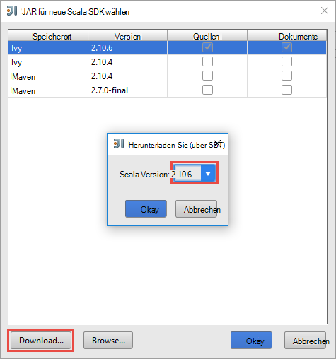

 <properties
    pageTitle="Verwenden HDInsight in Azure Toolkit für IntelliJ Remotedebuggen auf wie HDInsight Spark Cluster | Microsoft Azure"
    description="Erfahren Sie, wie verwenden HDInsight in Azure Toolkit für IntelliJ Remotedebuggen auf HDInsight Spark-Cluster ausgeführt."
    services="hdinsight"
    documentationCenter=""
    authors="nitinme"
    manager="jhubbard"
    editor="cgronlun"
    tags="azure-portal"/>

<tags
    ms.service="hdinsight"
    ms.workload="big-data"
    ms.tgt_pltfrm="na"
    ms.devlang="na"
    ms.topic="article"
    ms.date="09/09/2016"
    ms.author="nitinme"/>

# Verwenden Sie HDInsight in Azure Toolkit für IntelliJ Spark Applikationen Remote auf HDInsight Spark Linux Cluster Debuggen

Dieser Artikel enthält schrittweise Anleitung zur Verwendung von HDInsight-Tools in Azure Toolkit für IntelliJ einen Auftrag Spark HDInsight Spark-Cluster und dann vom Computer Remote Debuggen. Dazu müssen Sie die folgenden Schritte ausführen:

1. Erstellen Sie eine Standort-zu-Standort- oder Punkt-zu-Standort-Azure Virtual Network. Die Schritte in diesem Dokument wird eine Standort-zu-Standort-Netzwerk verwenden.

2. Erstellen eines Clusters Spark in Azure HDInsight, die zwischen Standorten Azure Virtual Network gehört.

3. Überprüfen Sie die Konnektivität zwischen Cluster Hauptknoten und Ihrem Desktop.

4. Erstellen Sie eine Anwendung Scala IntelliJ Idee und Remotedebuggen konfigurieren.

5. Ausführen und Debuggen der Anwendung.

##Erforderliche Komponenten

* Ein Azure-Abonnement. Finden Sie [kostenlose Testversion von Azure zu erhalten](https://azure.microsoft.com/documentation/videos/get-azure-free-trial-for-testing-hadoop-in-hdinsight/).

* Ein HDInsight Linux Apache Spark-Cluster. Informationen finden Sie [in Azure HDInsight Cluster Apache Spark erstellen](hdinsight-apache-spark-jupyter-spark-sql.md).
 
* Oracle Java Development Kit. Sie können es [hier](http://www.oracle.com/technetwork/java/javase/downloads/jdk8-downloads-2133151.html).
 
* IntelliJ IDEE. In diesem Artikel verwendet die Version 15.0.1. Sie können es [hier](https://www.jetbrains.com/idea/download/).
 
* HDInsight Tools in Azure Toolkit für IntelliJ. HDInsight Tools für IntelliJ stehen als Teil der Azure-Toolkit für IntelliJ. Anleitung zum Installieren der Azure-Toolkit finden Sie unter [Installieren der Azure-Toolkit für IntelliJ](../azure-toolkit-for-intellij-installation.md).

* Melden Sie Ihre Azure-Abonnement von IntelliJ IDEE. Gehen Sie [hier](hdinsight-apache-spark-intellij-tool-plugin.md#log-into-your-azure-subscription).
 
* Beim Spark Scala Anwendung für remote-Debuggen auf einem Windows-Computer ausführen, erhalten Sie eine Ausnahme wie in [SPARK-2356](https://issues.apache.org/jira/browse/SPARK-2356) , die aufgrund einer fehlenden WinUtils.exe unter Windows. Um diesen Fehler zu umgehen, müssen Sie wie **C:\WinUtils\bin**an [die ausführbare Datei hier herunterladen](http://public-repo-1.hortonworks.com/hdp-win-alpha/winutils.exe) . Sie müssen eine Umgebungsvariable **HADOOP_HOME** hinzufügen und den Wert der Variablen auf **C\WinUtils**festgelegt.

## Schritt 1: Erstellen einer Azure Virtual Network

Gehen Sie über die Links unten, um ein virtuelles Azure-Netzwerk erstellen und überprüfen die Konnektivität zwischen dem Desktop und Azure Virtual Network.

* [Erstellen Sie ein VNet mit eine Standort-zu-Standort-VPN-Verbindung mithilfe von Azure-Portal](../vpn-gateway/vpn-gateway-howto-site-to-site-resource-manager-portal.md)
* [Erstellen Sie ein VNet mit einer Standort-zu-Standort-VPN-Verbindung mit PowerShell](../vpn-gateway/vpn-gateway-create-site-to-site-rm-powershell.md)
* [Konfigurieren Sie eine Punkt-zu-Standort-Verbindung zu einem virtuellen Netzwerk mit PowerShell](../vpn-gateway/vpn-gateway-howto-point-to-site-rm-ps.md)

## Schritt 2: Erstellen eines HDInsight Spark-Clusters

Erstellen Sie einen Apache Spark-Cluster auch auf Azure HDInsight, die der Azure Virtual Network gehört, die Sie erstellt haben. Verwenden Sie die Informationen am [Erstellen Linux-basierten Clustern in HDInsight](hdinsight-hadoop-provision-linux-clusters.md). Wählen Sie als Teil der Konfiguration optional Azure Virtual Network, die Sie im vorherigen Schritt erstellt haben.

## Schritt 3: Überprüfen Sie die Verbindung zwischen Cluster Hauptknoten und desktop

1. Die IP-Adresse der Hauptknoten zu erhalten. Öffnen Sie Ambari UI für den Cluster. Klicken Sie auf **Dashboard**aus dem Cluster-Blade.

    

2. UI Ambari oben rechts klicken Sie auf **Hosts**.

    

3. Eine Liste von Headnodes, Zookeeper-Knoten und Arbeitskraft Knoten sollte angezeigt werden. Die Headnodes haben **hn*** Präfix. Klicken Sie auf die erste Hauptknoten.

    

4. Am unteren Rand der Seite geöffnet, die IP-Adresse der Hauptknoten und den Hostnamen im Feld **Zusammenfassung** kopieren.

    

5. Enthalten Sie die IP-Adresse und den Hostnamen der Hauptknoten zur **Hosts** -Datei auf dem Computer aus zu Remotedebugging Spark Aufträge werden soll. Dies können Sie mit der IP-Adresse sowie der Hostname Hauptknoten kommunizieren.

    1. Öffnen Sie Notepad mit erweiterten Berechtigungen. Im Menü Datei auf **Öffnen** , und navigieren Sie zum Speicherort der Hostsdatei. Auf einem Windows-Computer ist `C:\Windows\System32\Drivers\etc\hosts`.

    2. Fügen Sie folgenden zur **Hosts** -Datei.

            # For headnode0
            192.xxx.xx.xx hn0-nitinp
            192.xxx.xx.xx hn0-nitinp.lhwwghjkpqejawpqbwcdyp3.gx.internal.cloudapp.net

            # For headnode1
            192.xxx.xx.xx hn1-nitinp
            192.xxx.xx.xx hn1-nitinp.lhwwghjkpqejawpqbwcdyp3.gx.internal.cloudapp.net

5. Dem Computer mit Azure Virtual Network, die vom HDInsight-Cluster verwendet wird, stellen Sie sicher, dass sowohl der Headnodes die IP-Adresse sowie den Hostnamen anpingen können.

6. SSH in Cluster Hauptknoten [mit einem HDInsight-Cluster über SSH](hdinsight-hadoop-linux-use-ssh-windows.md#connect-to-a-linux-based-hdinsight-cluster)mit der Anleitung. Pingen Sie aus den Hauptknoten Cluster die IP-Adresse des desktop-Computers. Testen Sie die Konnektivität mit sowohl die IP-Adressen der Computer, der für die Verbindung und die andere für virtuelle Azure-Netzwerk, das der Computer angeschlossen ist.

7. Wiederholen Sie die Schritte für die anderen Hauptknoten sowie. 

## Schritt 4: Erstellen einer Spark Scala Anwendung HDInsight Tools in Azure Toolkit für IntelliJ und für Remotedebuggen konfigurieren

1. IntelliJ Idee und erstellen ein neues Projekt. Optionen Sie im Dialogfeld Neues Projekt die folgenden und klicken Sie dann auf **Weiter**.

    

    * Wählen Sie im linken Bereich **HDInsight**.
    * Wählen Sie im rechten Bereich **Spark auf HDInsight (Scala)**.
    * Klicken Sie auf **Weiter**.

2. Geben Sie im nächsten Fenster die Projektdetails.

    * Geben Sie Namen und Speicherort.
    * **Project SDK**stellen Sie sicher, dass Sie eine Java-Version größer als 7.
    * **Scala SDK**klicken Sie auf **Erstellen**wählen Sie die Version des Scala verwenden und klicken Sie auf **Download**. **Sicher verwenden Version nicht 2.11.x**. Version **2.10.6.**verwendet.

        

    * **Spark SDK**downloaden Sie und verwenden Sie das SDK [hier](http://go.microsoft.com/fwlink/?LinkID=723585&clcid=0x409). Sie können auch ignorieren und stattdessen [Spark Maven Repository](http://mvnrepository.com/search?q=spark) , aber stellen Sie sicher, dass rechts Maven Repository installiert der Spark-Entwicklung. (Z. B. müssen Sie sicherstellen, dass die Spark Streaming Teil installiert, wenn Sie Spark Streaming verwenden. Auch bitte sicher, dass Sie als Scala 2.10 Repository verwenden - verwenden Sie nicht das Repository Scala 2.11 markiert.)

        

    * Klicken Sie auf **Fertig stellen**.

3. Spark-Projekt erstellt automatisch ein Artefakt. Gehen Sie folgendermaßen vor, um das Element anzuzeigen.

    1. Klicken Sie im Menü **Datei** auf **Projektstruktur**.
    2. Klicken Sie im Dialogfeld **Struktur** auf **Artefakte** um Standard-Artefakts anzuzeigen, die erstellt wird.

        

    Sie können eigene Artefakt Assembly auf die **+** Symbol in der Abbildung oben hervorgehoben.

4. Klicken Sie in der **Projektstruktur** auf **Projekt**. Wenn **Project SDK** 1,8 festgelegt ist, müssen Sie **Projekt Sprachebene** soll **7 - Karo, ARM, mehrere Catch usw.**.

    

4. Bibliotheken und dem Projekt hinzugefügt. Fügen Sie eine Bibliothek mit der rechten Maustaste des Projektnamen in der Projekthierarchie und dann auf **Öffnen Einstellungen**. Klicken Sie im Dialogfeld **Struktur** im linken Bereich auf **Bibliotheken**, klicken Sie auf das Pluszeichen (+) symbol und klicken Sie dann auf **Aus Maven**. 

     

    Klicken Sie im Dialogfeld **Download Library aus Maven Repository** suchen Sie und fügen Sie die folgenden Bibliotheken.

    * `org.scalatest:scalatest_2.10:2.2.1`
    * `org.apache.hadoop:hadoop-azure:2.7.1`

5. Copy `yarn-site.xml` und `core-site.xml` vom Cluster Hauptknoten und dem Projekt hinzufügen. Verwenden Sie die folgenden Befehle, um die Dateien zu kopieren. Können Sie Folgendes ausführen [Cygwin](https://cygwin.com/install.html) `scp` Befehle zum Kopieren von Cluster-Headnodes.

        scp <ssh user name>@<headnode IP address or host name>://etc/hadoop/conf/core-site.xml .

    Da wir bereits den Hauptknoten IP-Adresse und den Hostnamen hinzugefügt fo die Hosts-Datei auf dem Desktop, können wir die **scp** -Befehle wie folgt.

        scp sshuser@hn0-nitinp:/etc/hadoop/conf/core-site.xml .
        scp sshuser@hn0-nitinp:/etc/hadoop/conf/yarn-site.xml .

    Diese Dateien dem Projekt hinzufügen, z. B. unter dem **Ordner/src** in Ihrer Projektstruktur kopieren `<your project directory>\src`.

6. Aktualisierung der `core-site.xml` folgenden ändern.

    1. `core-site.xml`enthält den verschlüsselten Schlüssel Speicherkonto Cluster zugeordnet. In der `core-site.xml` , dass Sie dem Projekt hinzugefügt, ersetzen Sie den verschlüsselten Schlüssel mit den tatsächlichen Speicher zugeordnete Speicher Standardkonto. Siehe [Speicher Zugriff verwalten](../storage/storage-create-storage-account.md#manage-your-storage-account).

            <property>
                <name>fs.azure.account.key.hdistoragecentral.blob.core.windows.net</name>
                <value>access-key-associated-with-the-account</value>
            </property>

    2. Entfernen Sie die folgenden Einträge aus der `core-site.xml`.

            <property>
                <name>fs.azure.account.keyprovider.hdistoragecentral.blob.core.windows.net</name>
                <value>org.apache.hadoop.fs.azure.ShellDecryptionKeyProvider</value>
            </property>

            <property>
                <name>fs.azure.shellkeyprovider.script</name>
                <value>/usr/lib/python2.7/dist-packages/hdinsight_common/decrypt.sh</value>
            </property>

            <property>
                <name>net.topology.script.file.name</name>
                <value>/etc/hadoop/conf/topology_script.py</value>
            </property>

    3. Speichern Sie die Datei.

7. Fügen Sie der Main-Klasse für die Anwendung. **Projekt-Explorer**mit der rechten Maustaste **Src**, zeigen Sie auf **neu**und dann auf **Scala Klasse**.

    

8. Klicken Sie im Dialogfeld **Neue Scala-Klasse erstellen** benennen Sie, **Art** wählen Sie **Objekt**, und klicken Sie auf **OK**.

    

9. In der `MyClusterAppMain.scala` Datei, fügen Sie den folgenden Code. Dieser Code erstellt die Spark Kontext und startet eine `executeJob` aus der `SparkSample` Objekt.

        import org.apache.spark.{SparkConf, SparkContext}

        object SparkSampleMain {
          def main (arg: Array[String]): Unit = {
            val conf = new SparkConf().setAppName("SparkSample")
                                      .set("spark.hadoop.validateOutputSpecs", "false")
            val sc = new SparkContext(conf)
        
            SparkSample.executeJob(sc,
                                   "wasbs:///HdiSamples/HdiSamples/SensorSampleData/hvac/HVAC.csv",
                                   "wasbs:///HVACOut")
          }
        }

10. Wiederholen Sie die Schritte 8 und 9 oben hinzufügen ein neues Scala-Objekt namens `SparkSample`. Fügen Sie dieser Klasse den folgenden Code ein. Dieser Code liest die Daten aus der HVAC.csv (verfügbar auf alle HDInsight Spark-Cluster) die Zeilen, die nur eine Ziffer in der siebten Spalte im CSV-Format und schreibt die Ausgabe in **/HVACOut** unter Standard-Behälter für den Cluster.

        import org.apache.spark.SparkContext
    
        object SparkSample {
          def executeJob (sc: SparkContext, input: String, output: String): Unit = {
            val rdd = sc.textFile(input)
        
            //find the rows which have only one digit in the 7th column in the CSV
            val rdd1 =  rdd.filter(s => s.split(",")(6).length() == 1)
        
            val s = sc.parallelize(rdd.take(5)).cartesian(rdd).count()
            println(s)
        
            rdd1.saveAsTextFile(output)
            //rdd1.collect().foreach(println)
          }
        
        }

11. Wiederholen Sie die Schritte 8 und 9 oben, um eine neue Klasse mit dem Namen `RemoteClusterDebugging`. Diese Klasse implementiert das Testframework Spark, das zum Debuggen verwendet wird. Fügen Sie den folgenden Code in die `RemoteClusterDebugging` Klasse.

        import org.apache.spark.{SparkConf, SparkContext}
        import org.scalatest.FunSuite
        
        class RemoteClusterDebugging extends FunSuite {
        
          test("Remote run") {
            val conf = new SparkConf().setAppName("SparkSample")
                                      .setMaster("yarn-client")
                                      .set("spark.yarn.am.extraJavaOptions", "-Dhdp.version=2.4")
                                      .set("spark.yarn.jar", "wasbs:///hdp/apps/2.4.2.0-258/spark-assembly-1.6.1.2.4.2.0-258-hadoop2.7.1.2.4.2.0-258.jar")
                                      .setJars(Seq("""C:\WORK\IntelliJApps\MyClusterApp\out\artifacts\MyClusterApp_DefaultArtifact\default_artifact.jar"""))
                                      .set("spark.hadoop.validateOutputSpecs", "false")
            val sc = new SparkContext(conf)
        
            SparkSample.executeJob(sc,
              "wasbs:///HdiSamples/HdiSamples/SensorSampleData/hvac/HVAC.csv",
              "wasbs:///HVACOut")
          }
        }

    Paar wichtige Dinge zu beachten:
    
    * Für `.set("spark.yarn.jar", "wasbs:///hdp/apps/2.4.2.0-258/spark-assembly-1.6.1.2.4.2.0-258-hadoop2.7.1.2.4.2.0-258.jar")`, sicherzustellen, dass Spark Assembly Glas auf den Clusterspeicher am angegebenen Pfad.
    * Für `setJars`, geben Sie den Speicherort, wo Artefakt JAR-Datei erstellt. Normalerweise ist `<Your IntelliJ project directory>\out\<project name>_DefaultArtifact\default_artifact.jar`. 

11. In der `RemoteClusterDebugging` Klasse der rechten Maustaste auf den `test` Schlüsselwort und wählen Sie **RemoteClusterDebugging-Konfiguration erstellen**.

    

12. Klicken Sie im Dialogfeld einen Namen für die Konfiguration und **Test Art** als **Testname**auswählen. **Lassen Sie alle anderen Werte als Standard und klicken Sie auf **Übernehmen**.**

    

13. Eine **Remote** Testlaufkonfiguration Dropdown-Menü in der Menüleiste sollte angezeigt werden. 

    

## Schritt 5: Führen Sie die Anwendung im Debugmodus

1. Öffnen Sie das Projekt IntelliJ IDEA `SparkSample.scala` und einen Haltepunkt neben "Val rdd1. Wählen Sie im Popupmenü für ein Haltepunkt erstellt **Zeile Funktion ExecuteJob**.

    

2. Klicken Sie **Debuggen ausführen** neben der **Remote** Testlaufkonfiguration Dropdown für den start der Anwendungdes.

    

3. Wenn die Ausführung des Programms den Haltepunkt erreicht, sollte eine **Debugger** -Registerkarte im unteren Bereich angezeigt werden.

    

4. Klicken Sie auf das (**+**) um eine Überwachung hinzuzufügen, wie in der folgenden Abbildung dargestellt. 

    

    Hier, denn die Anwendung vor der Variable `rdd1` erstellt wurde, sehen wir, was sind die ersten 5 Zeilen in die Variable Uhr mit `rdd`. Drücken Sie die **EINGABETASTE**.

    

    Sehen Sie im Bild oben ist, zur Laufzeit Gesamtkapazität und Debug abgefragt werden konnte wie Ihre Anwendung verläuft. Z. B. in der Ausgabe im Bild oben gezeigt, sehen Sie, dass die erste Zeile der Ausgabe eine Kopfzeile ist. Auf dieser Grundlage können Sie Anwendungscode die Kopfzeile überspringen, falls erforderlich.

5. Sie können jetzt das Programmsymbol **Resume** zum Fortsetzen der Ausführung der Anwendung klicken.

    

6. Wenn die Anwendung erfolgreich abgeschlossen wird, sollte eine Ausgabe ähnlich der folgenden angezeigt werden.

    

 

## Siehe auch

* [Übersicht: Apache Spark auf Azure HDInsight](hdinsight-apache-spark-overview.md)

### Szenarien

* [Spark BI: Datenanalyse interaktive BI-Tools Spark in HDInsight mit](hdinsight-apache-spark-use-bi-tools.md)

* [Spark mit Computer: Funken im HDInsight für die Analyse erstellen Temperatur HKL-Daten verwenden](hdinsight-apache-spark-ipython-notebook-machine-learning.md)

* [Spark mit Computer: Spark in HDInsight Lebensmittel Ergebnisse vorherzusagen verwenden](hdinsight-apache-spark-machine-learning-mllib-ipython.md)

* [Spark Streaming: Verwendung Funken im HDInsight zum Erstellen von Echtzeit-streaming](hdinsight-apache-spark-eventhub-streaming.md)

* [Websiteanalyse mit Spark in HDInsight](hdinsight-apache-spark-custom-library-website-log-analysis.md)

### Erstellen und Ausführen der Anwendung

* [Erstellen Sie eine eigenständige Anwendung Scala](hdinsight-apache-spark-create-standalone-application.md)

* [Führen Sie Aufträge auf einem Spark-Cluster mit Livius Remote aus](hdinsight-apache-spark-livy-rest-interface.md)

### Tools und Erweiterung

* [Verwenden Sie HDInsight in Azure Toolkit für IntelliJ zum Erstellen und übermitteln Spark Scala Programme](hdinsight-apache-spark-intellij-tool-plugin.md)

* [Verwenden Sie HDInsight in Azure Toolkit für Eclipse Spark Applikationen erstellen](hdinsight-apache-spark-eclipse-tool-plugin.md)

* [Verwenden Sie Zeppelin Notebooks mit einem Cluster Spark HDInsight](hdinsight-apache-spark-use-zeppelin-notebook.md)

* [Cluster-Kernels für Jupyter Notebook Spark für HDInsight](hdinsight-apache-spark-jupyter-notebook-kernels.md)

* [Verwenden Sie externe Pakete mit Jupyter notebooks](hdinsight-apache-spark-jupyter-notebook-use-external-packages.md)

* [Jupyter auf dem Computer installieren und Verbinden mit einem HDInsight Spark-cluster](hdinsight-apache-spark-jupyter-notebook-install-locally.md)

### Verwalten von Ressourcen

* [Ressourcen Sie für den Apache Spark-Cluster in Azure HDInsight](hdinsight-apache-spark-resource-manager.md)

* [Verfolgen und Debug Aufträge in einem Apache Spark-Cluster HDInsight](hdinsight-apache-spark-job-debugging.md)
