 <properties
    pageTitle="Erstellen Spark Scala mit HDInsight Werkzeugen in Azure Toolkit für IntelliJ | Microsoft Azure"
    description="Informationen Sie zum Erstellen einer eigenständiges Anwendung Spark HDInsight Spark-Cluster ausgeführt."
    services="hdinsight"
    documentationCenter=""
    authors="nitinme"
    manager="jhubbard"
    editor="cgronlun"
    tags="azure-portal"/>

<tags
    ms.service="hdinsight"
    ms.workload="big-data"
    ms.tgt_pltfrm="na"
    ms.devlang="na"
    ms.topic="article"
    ms.date="09/09/2016"
    ms.author="nitinme"/>

# Verwenden Sie HDInsight in Azure Toolkit für IntelliJ Spark Anträge HDInsight Spark Linux Cluster erstellen

Dieser Artikel enthält schrittweise Spark Anwendungsentwicklung in uns und senden sie ein HDInsight Spark cluster mit HDInsight Werkzeugen in Azure Toolkit für IntelliJ geschrieben.  Die Tools können auf unterschiedliche Weise:

* Zu einer Scala Spark Antrag auf einem HDInsight Spark-cluster
* Zugriff auf die Clusterressourcen Azure HDInsight Funken
* Zu eine Scala Spark Anwendung lokal ausführen

Sie können auch ein video [hier](https://mix.office.com/watch/1nqkqjt5xonza) Einstieg folgen.

>[AZURE.IMPORTANT] Dieses Tool kann verwendet werden, zu beantragen nur für HDInsight Spark-Cluster unter Linux.

##Erforderliche Komponenten

* Ein Azure-Abonnement. Finden Sie [kostenlose Testversion von Azure zu erhalten](https://azure.microsoft.com/documentation/videos/get-azure-free-trial-for-testing-hadoop-in-hdinsight/).

* Ein HDInsight Linux Apache Spark-Cluster. Informationen finden Sie [in Azure HDInsight Cluster Apache Spark erstellen](hdinsight-apache-spark-jupyter-spark-sql.md).

* Oracle Java Development Kit. Sie können es [hier](http://www.oracle.com/technetwork/java/javase/downloads/jdk8-downloads-2133151.html).

* IntelliJ IDEE. In diesem Artikel verwendet die Version 15.0.1. Sie können es [hier](https://www.jetbrains.com/idea/download/).

## Installieren von HDInsight Tools in Azure Toolkit für IntelliJ

HDInsight tools IntelliJ ist als Teil der Azure-Toolkit für IntelliJ. Anleitung zum Installieren der Azure-Toolkit finden Sie unter [Installieren der Azure-Toolkit für IntelliJ](../azure-toolkit-for-intellij-installation.md).

## Azure-Abonnement anmelden

1. Starten der IDE IntelliJ und Azure-Explorer öffnen. In der IDE im Menü **Ansicht** auf **Fenster** und dann auf **Azure Explorer**.

    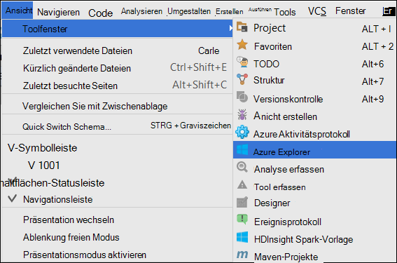

2. Maustaste auf **Azure** Knoten in **Azure Explorer**, und klicken Sie dann auf **Abonnements verwalten**.

3. Im Dialogfeld **Abonnements verwalten** klicken Sie auf **Anmelden** und geben Sie Ihre Azure-Anmeldeinformationen.

    

4. Nachdem Sie sich angemeldet haben, zeigt das Dialogfeld **Abonnements verwalten** alle Azure Abonnements, die den Anmeldeinformationen zugeordnet. Klicken Sie auf **Schließen** im Dialogfeld.

5. Die Registerkarte **Azure Explorer** erweitern Sie **HDInsight** um HDInsight Spark-Cluster unter Abonnements angezeigt.

    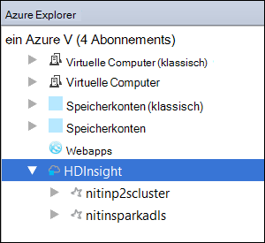

6. Sie können einen Clusterknoten Namen um die Ressourcen (z. B. Speicherkonten) den Cluster weiter.

    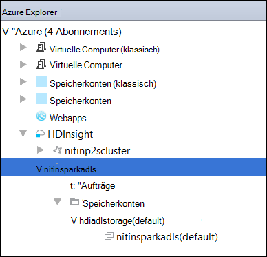

## Ausführen einer Anwendung Spark Scala in einem HDInsight Spark-cluster

1. IntelliJ Idee und erstellen ein neues Projekt. Optionen Sie im Dialogfeld Neues Projekt die folgenden und klicken Sie dann auf **Weiter**.

    

    * Wählen Sie im linken Bereich **HDInsight**.
    * Wählen Sie im rechten Bereich **Spark auf HDInsight (Scala)**.
    * Klicken Sie auf **Weiter**.

2. Geben Sie im nächsten Fenster die Projektdetails.

    * Geben Sie Namen und Speicherort.
    * **Project SDK**stellen Sie sicher, dass Sie eine Java-Version größer als 7.
    * **Scala SDK**klicken Sie auf **Erstellen**wählen Sie die Version des Scala verwenden und klicken Sie auf **Download**. **Sicher verwenden Version nicht 2.11.x**. Version **2.10.6.**verwendet.

        

    * **Spark SDK**downloaden Sie und verwenden Sie das SDK [hier](http://go.microsoft.com/fwlink/?LinkID=723585&clcid=0x409). Sie können auch ignorieren und stattdessen [Spark Maven Repository](http://mvnrepository.com/search?q=spark) , aber stellen Sie sicher, dass rechts Maven Repository installiert der Spark-Entwicklung. (Z. B. müssen Sie sicherstellen, dass die Spark Streaming Teil installiert, wenn Sie Spark Streaming verwenden. Auch bitte sicher, dass Sie als Scala 2.10 Repository verwenden - verwenden Sie nicht das Repository Scala 2.11 markiert.)

        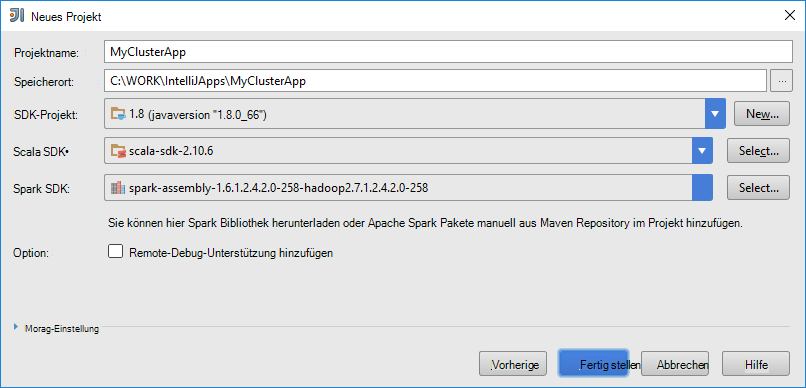

    * Klicken Sie auf **Fertig stellen**.

3. Spark-Projekt erstellt automatisch ein Artefakt. Gehen Sie folgendermaßen vor, um das Element anzuzeigen.

    1. Klicken Sie im Menü **Datei** auf **Projektstruktur**.
    2. Klicken Sie im Dialogfeld **Struktur** auf **Artefakte** um Standard-Artefakts anzuzeigen, die erstellt wird.

        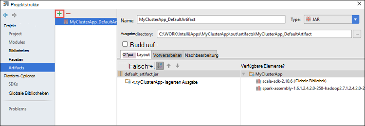

    Sie können eigene Artefakt Assembly auf die **+** Symbol in der Abbildung oben hervorgehoben.

4. Klicken Sie in der **Projektstruktur** auf **Projekt**. Wenn **Project SDK** 1,8 festgelegt ist, müssen Sie **Projekt Sprachebene** soll **7 - Karo, ARM, mehrere Catch usw.**.

    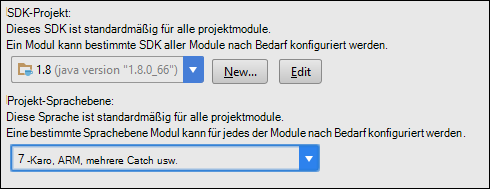

5. Hinzufügen von Quellcode Ihrer Anwendung.

    1. **Projekt-Explorer**mit der rechten Maustaste **Src**, zeigen Sie auf **neu**und dann auf **Scala Klasse**.

        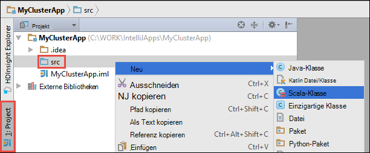

    2. Klicken Sie im Dialogfeld **Neue Scala-Klasse erstellen** benennen Sie, **Art** wählen Sie **Objekt**, und klicken Sie auf **OK**.

        

    3. Fügen Sie folgenden Code in der Datei **MyClusterApp.scala** . Dieser Code liest die Daten aus der HVAC.csv (verfügbar auf alle HDInsight Spark-Cluster) die Zeilen, die nur eine Ziffer in der siebten Spalte im CSV-Format und schreibt die Ausgabe in **/HVACOut** unter Standard-Behälter für den Cluster.

            import org.apache.spark.SparkConf
            import org.apache.spark.SparkContext

            object MyClusterApp{
              def main (arg: Array[String]): Unit = {
                val conf = new SparkConf().setAppName("MyClusterApp")
                val sc = new SparkContext(conf)

                val rdd = sc.textFile("wasbs:///HdiSamples/HdiSamples/SensorSampleData/hvac/HVAC.csv")

                //find the rows which have only one digit in the 7th column in the CSV
                val rdd1 =  rdd.filter(s => s.split(",")(6).length() == 1)

                rdd1.saveAsTextFile("wasbs:///HVACOut")
              }

            }

5. Führen Sie die Anwendung in einem Cluster HDInsight Spark.

    1. **Projekt-Explorer**mit der rechten Maustaste des Namens des Projekts und wählen Sie **HDInsight Spark Anwendung senden**.

        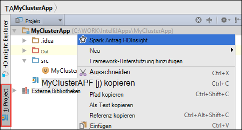

    2. Sie werden aufgefordert Ihre Anmeldeinformationen Azure-Abonnement. Klicken Sie im Dialogfeld **Vorlage Spark** bieten Sie folgende Werte.

        * **Spark-Cluster (nur Linux)**wählen Sie den HDInsight Spark-Cluster auf dem die Anwendung ausgeführt werden soll.

        * Sie müssen ein Artefakt aus dem Projekt IntelliJ wählen oder aus Festplatte auswählen.

        * Für das Textfeld **Hauptklassenname** klicken Sie auf die Auslassungszeichen ( ), wählen Sie die Hauptklasse im Quellcode Ihrer Anwendung und klicken Sie auf **OK**.

            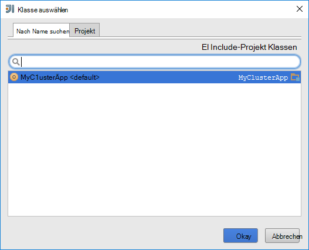

        * Da der Anwendungscode in diesem Beispiel keine Befehlszeilenargumente erfordert oder Gläser oder Dateien verweisen, können Sie die restlichen Textfelder leer lassen.

        * Nach der Bereitstellung alle Eingaben, sollte das Dialogfeld folgendermaßen aussehen.

            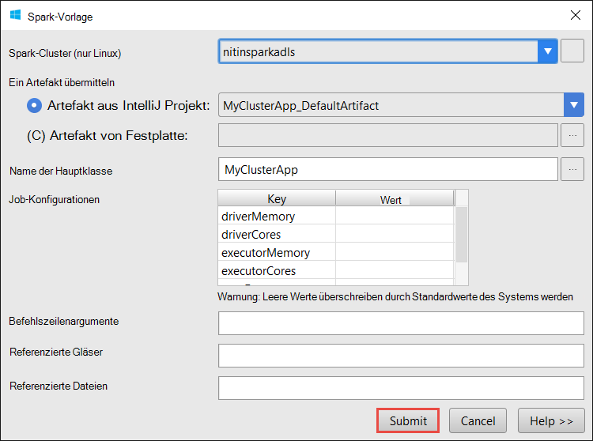

        * Klicken Sie auf **Senden**.

    3. Registerkarte **Spark Vorlage** am unteren Fensterrand startet den Status anzeigt. Die Anwendung hält durch Klicken auf die Schaltfläche im Fenster "Spark Beitrag".

        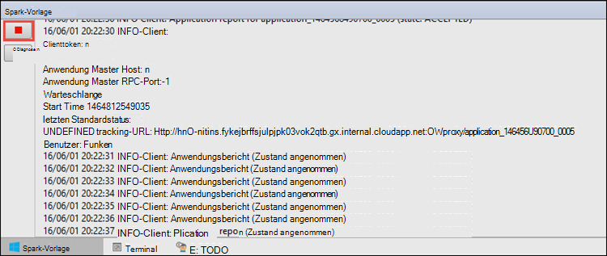

    Im nächsten Abschnitt erfahren Sie, wie auf den Auftrag mit der HDInsight-Tools in Azure Toolkit für IntelliJ ausgegeben.

## Zugriff auf HDInsight Spark-Cluster und verwalten Sie der Einsatz HDInsight in Azure Toolkit für IntelliJ

Sie können eine Vielzahl von Vorgängen mit den HDInsight der Azure-Toolkit für IntelliJ Teil ausführen.

### HDInsight-Tools die Auftragsansicht direkt zugreifen

1. **Azure Explorer**erweitern Sie **HDInsight**, erweitern Sie den Clusternamen Spark und klicken Sie auf **Aufträge**.

2. Im rechten Bereich zeigt die Registerkarte **Spark Auftrag anzeigen** alle Programme, die im Cluster ausgeführt wurden. Klicken Sie auf den Anwendungsnamen, für den Sie Details anzeigen möchten.

    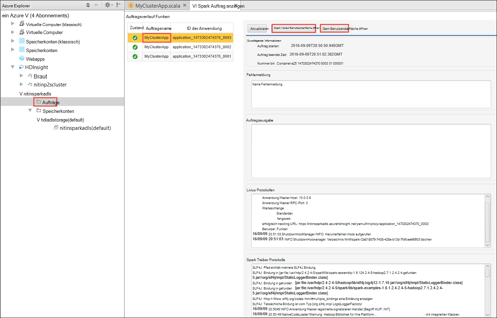

3. Die Felder für **Fehlermeldung**, **Auftragsausgabe** **Livius Protokollen**und **Spark Treiber Protokolle** werden basierend auf der ausgewählten Anwendung gefüllt.

4. Sie können auch **Spark Geschichte Benutzeroberfläche** und **GARN UI** (auf Anwendungsebene) öffnen, auf die entsprechenden Schaltflächen am oberen Bildschirmrand.

### Zugriff auf den Server Spark-Verlauf

1. **Azure Explorer** **HDInsight**erweitern, der Clustername Spark Maustaste und wählen Sie **Öffnen Spark Geschichte UI**. Geben Sie bei Aufforderung die Administratoranmeldeinformationen für den Cluster. Sie müssen während der Bereitstellung des Clusters angegeben haben.

2. Im Dashboard Spark Geschichte Server Sie finden die Anwendung Sie gerade ausgeführt, indem der Anwendungsname. Im obigen Code Festlegen der Anwendung mit `val conf = new SparkConf().setAppName("MyClusterApp")`. Der Anwendungsname Spark wurde daher **MyClusterApp**.

### Ambari Portal starten

**Azure Explorer** **HDInsight**erweitern, der Clustername Spark Maustaste und wählen Sie dann **Öffnen Cluster-Verwaltungsportal (Ambari)**. Geben Sie bei Aufforderung die Administratoranmeldeinformationen für den Cluster. Sie müssen während der Bereitstellung des Clusters angegeben haben.

### Azure-Abonnements verwalten

Standardmäßig listet HDInsight Tools Spark-Clustern alle Azure Abonnements. Gegebenenfalls können Sie die Abonnements zugreifen werden soll. **Azure Explorer**klicken Sie auf den Stammknoten **Azure** und klicken Sie dann auf **Abonnements verwalten**. Kontrollkästchen Sie im Dialogfeld das für das Abonnement nicht zugreifen und dann auf **Schließen**möchten. Sie können auch **Abmelden** klicken Sie ggf. aus dem Azure-Abonnement abmelden.

## Spark Scala Anwendung lokal ausführen

Azure-Toolkit für IntelliJ können HDInsight-Tools Sie Spark Scala Anwendung lokal auf der Arbeitsstation ausgeführt. In der Regel Anträge nicht benötigen Zugriff auf Clusterressourcen wie Behälter ausführen und lokal getestet.

### Voraussetzung

Beim lokalen Spark Scala-Anwendung auf einem windowscomputer ausführen, erhalten Sie möglicherweise eine Ausnahme, wie in [SPARK-2356](https://issues.apache.org/jira/browse/SPARK-2356) , die aufgrund einer fehlenden WinUtils.exe unter Windows. Um diesen Fehler zu umgehen, müssen Sie wie **C:\WinUtils\bin**an [die ausführbare Datei hier herunterladen](http://public-repo-1.hortonworks.com/hdp-win-alpha/winutils.exe) . Sie müssen eine Umgebungsvariable **HADOOP_HOME** hinzufügen und den Wert der Variablen auf **C\WinUtils**festgelegt.

### Ausführen einer lokalen Spark Scala-Anwendung  

1. IntelliJ Idee und erstellen ein neues Projekt. Optionen Sie im Dialogfeld Neues Projekt die folgenden und klicken Sie dann auf **Weiter**.

    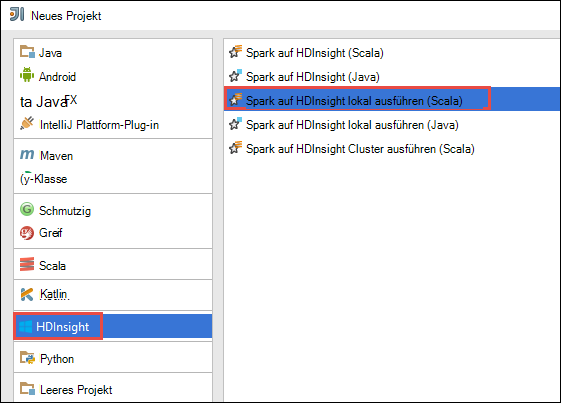

    * Wählen Sie im linken Bereich **HDInsight**.
    * Wählen Sie im rechten Bereich **Spark auf HDInsight lokalen ausführen (Scala)**.
    * Klicken Sie auf **Weiter**.

2. Geben Sie im nächsten Fenster die Projektdetails.

    * Geben Sie Namen und Speicherort.
    * **Project SDK**stellen Sie sicher, dass Sie eine Java-Version größer als 7.
    * **Scala SDK**klicken Sie auf **Erstellen**wählen Sie die Version des Scala verwenden und klicken Sie auf **Download**. **Sicher verwenden Version nicht 2.11.x**. Version **2.10.6.**verwendet.

        

    * **Spark SDK**downloaden Sie und verwenden Sie das SDK [hier](http://go.microsoft.com/fwlink/?LinkID=723585&clcid=0x409). Sie können auch ignorieren und stattdessen [Spark Maven Repository](http://mvnrepository.com/search?q=spark) , aber stellen Sie sicher, dass rechts Maven Repository installiert der Spark-Entwicklung. (Z. B. müssen Sie sicherstellen, dass die Spark Streaming Teil installiert, wenn Sie Spark Streaming verwenden. Auch bitte sicher, dass Sie als Scala 2.10 Repository verwenden - verwenden Sie nicht das Repository Scala 2.11 markiert.)

        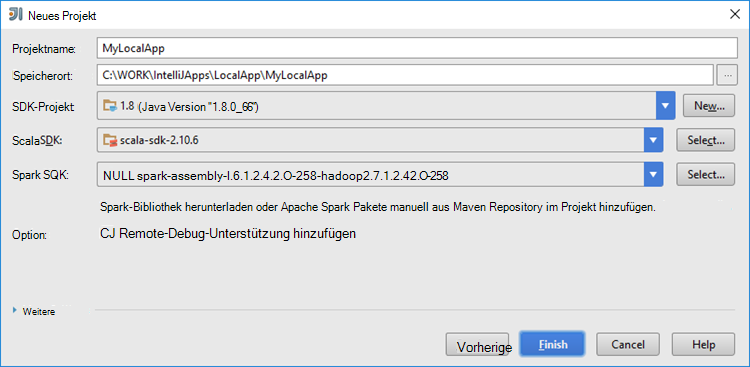

    * Klicken Sie auf **Fertig stellen**.

3. Die Vorlage fügt einen Beispielcode (**LogQuery**) im Ordner **Src** , die lokal auf Ihrem Computer ausführen.

    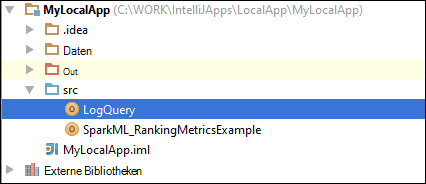

4.  Klicken Sie mit der rechten Maustaste auf die **LogQuery** -Anwendung, und klicken Sie dann auf **"Ausführen"LogQuery""**. Sie sehen eine Ausgabe wie diese Registerkarte **Führen Sie** unten.

    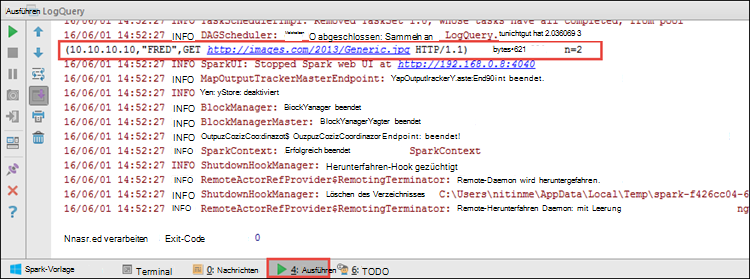

## Konvertieren Sie vorhandene IntelliJ IDEA Applikationen mit HDInsight Tools in Azure Toolkit IntelliJ

Sie können auch Ihre vorhandenen Spark Scala Anwendung erstellt IntelliJ Idee mit HDInsight Tools in Azure Toolkit für IntelliJ konvertieren. Dies können Sie mithilfe des Tools zu einem Cluster HDInsight Spark Anträge. Sie können dazu die folgenden Schritte ausführen:

1. Für eine vorhandene Spark Scala Anwendung erstellt IntelliJ IDEA öffnen Datei zugeordneten .iml.
2. Auf der Stammebene wird **ein Modulelement folgendermaßen** angezeigt:

        <module org.jetbrains.idea.maven.project.MavenProjectsManager.isMavenModule="true" type="JAVA_MODULE" version="4">

3. Das hinzuzufügende Element bearbeiten `UniqueKey="HDInsightTool"` , damit das **Module** -Element wie folgt aussieht:

        <module org.jetbrains.idea.maven.project.MavenProjectsManager.isMavenModule="true" type="JAVA_MODULE" version="4" UniqueKey="HDInsightTool">

4. Speichern. Die Anwendung sollte jetzt mit den HDInsight in Azure Toolkit für IntelliJ kompatibel sein. Sie können dies testen, indem Sie mit der rechten Maustaste auf das Projekt im Projekt-Explorer. Im Popupmenü müsste nun die Option **HDInsight Spark Anwendung senden**.

## Problembehandlung

### "Verwenden Sie eine größere Heap" Fehler in lokaler Testlauf

Spark 1.6 verwenden Sie ein 32-Bit-Java SDK bei lokaler Ausführung können folgende Fehler auftreten:

    Exception in thread "main" java.lang.IllegalArgumentException: System memory 259522560 must be at least 4.718592E8. Please use a larger heap size.
        at org.apache.spark.memory.UnifiedMemoryManager$.getMaxMemory(UnifiedMemoryManager.scala:193)
        at org.apache.spark.memory.UnifiedMemoryManager$.apply(UnifiedMemoryManager.scala:175)
        at org.apache.spark.SparkEnv$.create(SparkEnv.scala:354)
        at org.apache.spark.SparkEnv$.createDriverEnv(SparkEnv.scala:193)
        at org.apache.spark.SparkContext.createSparkEnv(SparkContext.scala:288)
        at org.apache.spark.SparkContext.<init>(SparkContext.scala:457)
        at LogQuery$.main(LogQuery.scala:53)
        at LogQuery.main(LogQuery.scala)
        at sun.reflect.NativeMethodAccessorImpl.invoke0(Native Method)
        at sun.reflect.NativeMethodAccessorImpl.invoke(NativeMethodAccessorImpl.java:57)
        at sun.reflect.DelegatingMethodAccessorImpl.invoke(DelegatingMethodAccessorImpl.java:43)
        at java.lang.reflect.Method.invoke(Method.java:606)
        at com.intellij.rt.execution.application.AppMain.main(AppMain.java:144)

Ist die Heapgröße ist nicht groß genug für Spark auszuführenden da Spark 471 MB benötigt (Sie Details von [SPARK 12081](https://issues.apache.org/jira/browse/SPARK-12081) erhalten soll). Eine einfache Lösung ist die Verwendung einer 64-Bit-SDK für Java. Hinzufügen die folgenden Optionen können Sie auch die Einstellungen JVM IntelliJ ändern:

    -Xms128m -Xmx512m -XX:MaxPermSize=300m -ea

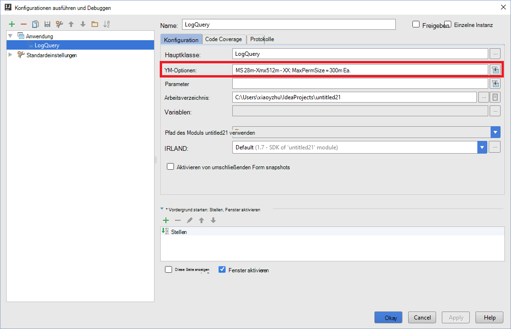

## Feedback und bekannte Probleme

Gerade Spark gibt direkt nicht unterstützt wird, und wir arbeiten daran.

Zögern Sie Wenn Sie Feedback oder Vorschläge haben oder Probleme auftreten, wenn Sie dieses Tool verwenden, nicht, uns eine e-Mail an Hdivstool bei Microsoft Dot Com.

## Siehe auch

* [Übersicht: Apache Spark auf Azure HDInsight](hdinsight-apache-spark-overview.md)

### Szenarien

* [Spark BI: Datenanalyse interaktive BI-Tools Spark in HDInsight mit](hdinsight-apache-spark-use-bi-tools.md)

* [Spark mit Computer: Funken im HDInsight für die Analyse erstellen Temperatur HKL-Daten verwenden](hdinsight-apache-spark-ipython-notebook-machine-learning.md)

* [Spark mit Computer: Spark in HDInsight Lebensmittel Ergebnisse vorherzusagen verwenden](hdinsight-apache-spark-machine-learning-mllib-ipython.md)

* [Spark Streaming: Verwendung Funken im HDInsight zum Erstellen von Echtzeit-streaming](hdinsight-apache-spark-eventhub-streaming.md)

* [Websiteanalyse mit Spark in HDInsight](hdinsight-apache-spark-custom-library-website-log-analysis.md)

### Erstellen und Ausführen der Anwendung

* [Erstellen Sie eine eigenständige Anwendung Scala](hdinsight-apache-spark-create-standalone-application.md)

* [Führen Sie Aufträge auf einem Spark-Cluster mit Livius Remote aus](hdinsight-apache-spark-livy-rest-interface.md)

### Tools und Erweiterung

* [Mit der HDInsight-Tools in Azure Toolkit für IntelliJ Remotedebugging Spark-Applikationen](hdinsight-apache-spark-intellij-tool-plugin-debug-jobs-remotely.md)

* [Verwenden Sie HDInsight in Azure Toolkit für Eclipse Spark Applikationen erstellen](hdinsight-apache-spark-eclipse-tool-plugin.md)

* [Verwenden Sie Zeppelin Notebooks mit einem Cluster Spark HDInsight](hdinsight-apache-spark-use-zeppelin-notebook.md)

* [Cluster-Kernels für Jupyter Notebook Spark für HDInsight](hdinsight-apache-spark-jupyter-notebook-kernels.md)

* [Verwenden Sie externe Pakete mit Jupyter notebooks](hdinsight-apache-spark-jupyter-notebook-use-external-packages.md)

* [Jupyter auf dem Computer installieren und Verbinden mit einem HDInsight Spark-cluster](hdinsight-apache-spark-jupyter-notebook-install-locally.md)

### Verwalten von Ressourcen

* [Ressourcen Sie für den Apache Spark-Cluster in Azure HDInsight](hdinsight-apache-spark-resource-manager.md)

* [Verfolgen und Debug Aufträge in einem Apache Spark-Cluster HDInsight](hdinsight-apache-spark-job-debugging.md)
