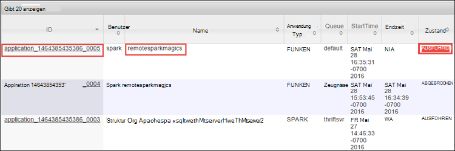
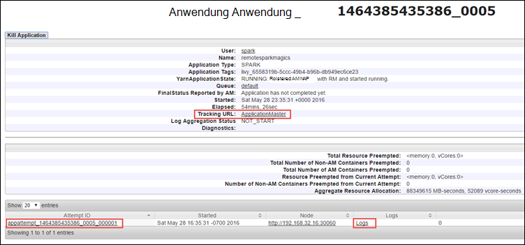
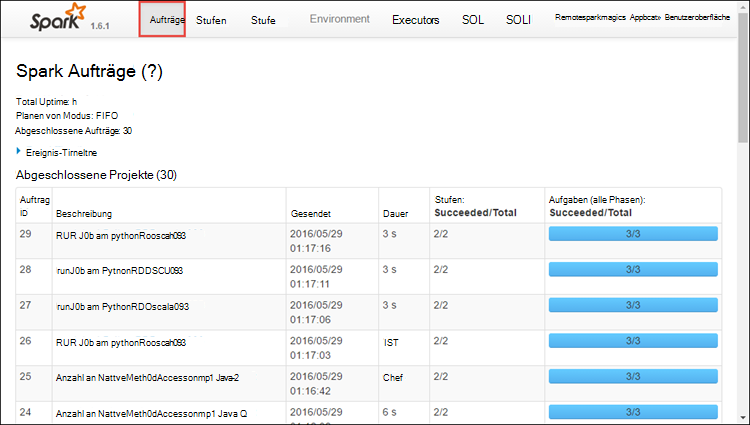
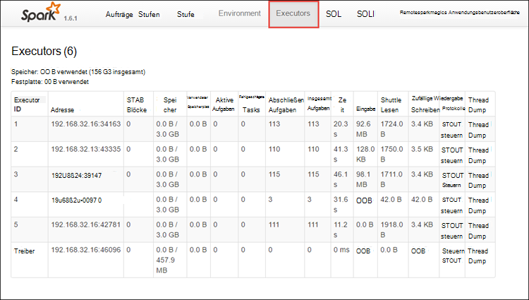
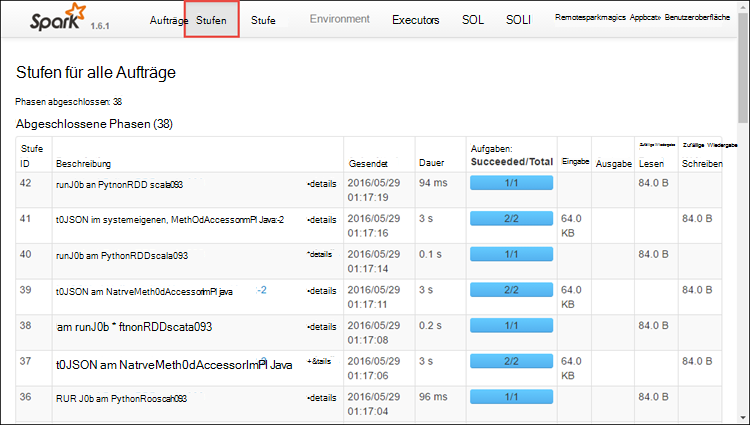
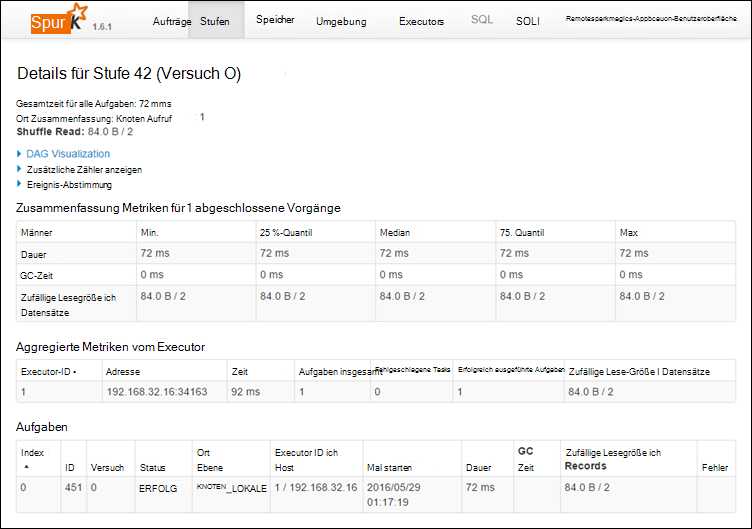
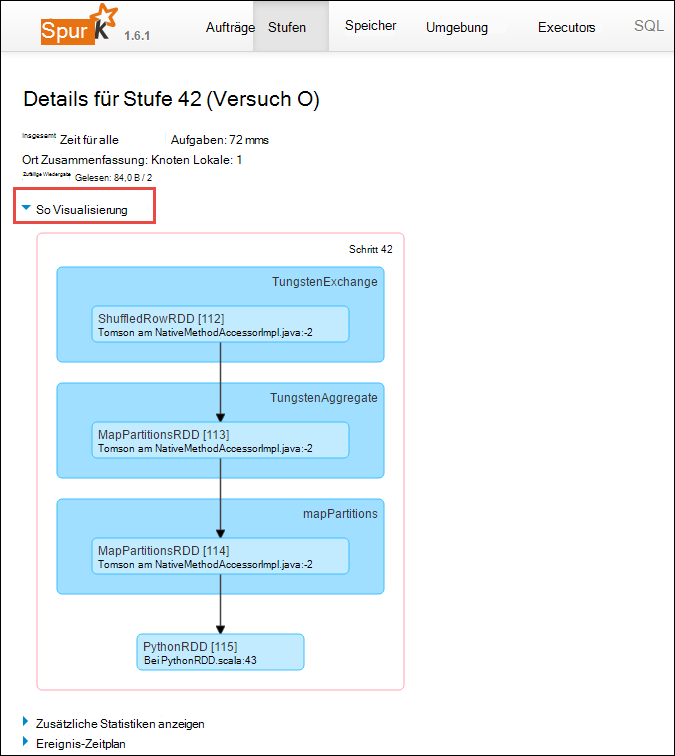
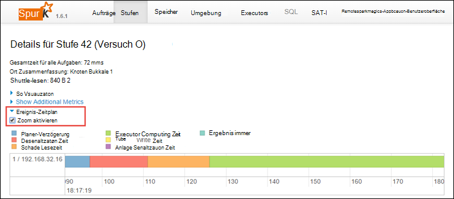
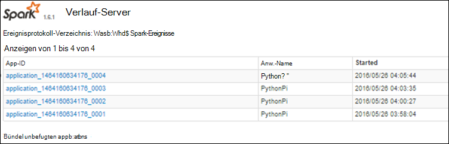

<properties 
    pageTitle="Verfolgen und Debug Aufträge in Apache Spark cluster in HDInsight | Microsoft Azure" 
    description="Verwenden Sie GARN UI Spark Benutzeroberfläche und Spark Geschichte Server zu debuggen Aufträge in einem Cluster Spark in Azure HDInsight" 
    services="hdinsight" 
    documentationCenter="" 
    authors="nitinme" 
    manager="jhubbard" 
    editor="cgronlun"
    tags="azure-portal"/>

<tags 
    ms.service="hdinsight" 
    ms.workload="big-data" 
    ms.tgt_pltfrm="na" 
    ms.devlang="na" 
    ms.topic="article" 
    ms.date="08/25/2016" 
    ms.author="nitinme"/>

# Verfolgen und Debug Aufträge in Apache Spark Cluster HDInsight Linux

In diesem Artikel erfahren Sie, wie zu Spark Aufträge mithilfe von GARN UI Spark Benutzeroberfläche und Spark Geschichte Server Debuggen. Für diesen Artikel wird zunächst einen Spark Auftrag Spark-Cluster mit einem Notebook verfügbar **maschinelles lernen: Vorhersageanalysen Lebensmittel Daten mit MLLib**. Schritte eine Anwendung zu verfolgen, die Sie übermittelt alle anderen Ansatz, beispielsweise **Spark senden**können.

##Erforderliche Komponenten

Sie benötigen Folgendes:

- Ein Azure-Abonnement. Finden Sie [kostenlose Testversion von Azure zu erhalten](https://azure.microsoft.com/documentation/videos/get-azure-free-trial-for-testing-hadoop-in-hdinsight/).
- Ein HDInsight Linux Apache Spark-Cluster. Informationen finden Sie [in Azure HDInsight Cluster Apache Spark erstellen](hdinsight-apache-spark-jupyter-spark-sql.md).
- Sie sollten haben das Notizbuch mit **[maschinelles lernen: Vorhersageanalysen Lebensmittel Daten mit MLLib](hdinsight-apache-spark-machine-learning-mllib-ipython.md)**. Informationen zum Ausführen dieses Notizbuchs auf den Link.  

## Überwachen einer Anwendung in der Benutzeroberfläche aus

1. Starten Sie die Benutzeroberfläche aus. Blatt Cluster auf **Cluster-Dashboard**und klicken Sie dann auf **aus**.

    

    >[AZURE.TIP] Alternativ können Sie auch die UI GARN Ambari UI starten. Starten der UI Ambari Blatt Cluster auf **Cluster-Dashboard**und dann auf **HDInsight Cluster Dashboard**. Ambari UI auf **aus**, klicken Sie auf **Quicklinks**, klicken Sie auf der aktiven Ressourcen-Manager und klicken Sie **ResourceManager-Benutzeroberfläche**.  

3. Mit Jupyter Notebooks Spark-Auftrag gestartet wird, muss die Anwendung den Namen **Remotesparkmagics** (Dies ist der Name für alle Programme, die von den Notebooks gestartet werden). Klicken Sie auf die-ID gegen den Anwendungsnamen, Weitere Informationen über das Projekt erhalten. Zum Starten der Anwendung anzeigen.

    

    Für Anwendungsbereiche, die Jupyter Notebooks gestartet werden, ist der Status immer **Ausführen** Beenden des Notebooks.

4. Aus der Anwendung können Sie weiter finden Anwendung und Protokolle (Stdout/Stderr) zugeordnete Container aufgliedern. Starten Sie Spark-Benutzeroberfläche, indem Sie auf die Verknüpfung für **Tracking-URL**wie folgt. 

    

## Überwachen einer Anwendung Spark-Benutzeroberfläche

Spark-Benutzeroberfläche können Sie Aufträge Spark aufgliedern, die von der Anwendung erzeugt werden, bereits gestartet.

1. Benutzeroberfläche Spark aus Anwendung starten klicken Sie mit **Tracking-URL**wie auf dem Bildschirmfoto oben dargestellt. Sie sehen alle Spark-Aufträge, die von der Anwendung im Notizbuch Jupyter gestartet werden.

    

2. Klicken Sie auf der Registerkarte **Executors** Verarbeitung und Speicherung von Informationen für jede Executor finden. Sie können auch die Aufrufliste der **Thread Dump** Link abrufen.

    
 
3. Klicken Sie auf **Phasen** , um die Phasen der Anwendung anzuzeigen.

    

    Jede Phase können mehrere Aufgaben für die können Statistiken, wie unten gezeigt.

     

4. Starten Sie auf der Detailseite Phase so Visualisierung. Erweitern Sie **So Visualisierung** Link oben auf der Seite wie unten dargestellt.

    

    So oder direkte Aclyic Diagramm stellt die verschiedenen Stufen in der Anwendung. Jeder Kasten im Diagramm stellt einen Spark-Vorgang von der Anwendung aufgerufen.

5. Auf der Detailseite Phase können Sie auch die Zeitachsenansicht Anwendung starten. Erweitern Sie Link **Veranstaltung Zeitplan** am oberen Rand der Seite, wie unten dargestellt.

    

    Spark-Ereignisse in Form einer Zeitachse angezeigt. Die Zeitachsenansicht ist auf drei Ebenen über Aufträge innerhalb eines Auftrags und in einer Phase. Bild oben Zeichnet die Zeitachsenansicht für eine bestimmte Phase.

    >[AZURE.TIP] **Zoom aktivieren** Sie das Kontrollkästchen aktivieren, können Sie links und rechts in der Zeitachsenansicht blättern.

6. Andere Registerkarten in der Benutzeroberfläche Spark enthalten nützliche Informationen zu den Spark-Instanz.

    * Registerkarte Speicher - Wenn die Anwendung eine RDDs erstellt finden Sie Informationen über die in der Registerkarte Speicher.
    * Registerkarte Umgebung – diese Registerkarte bietet viele nützliche Informationen über Ihre Spark-Instanz wie die 
        * Scala-version
        * Ereignisprotokoll-Verzeichnis der Cluster zugeordnet
        * Anzahl der Executor Kerne für die Anwendung
        * Usw.

## Suchen Sie abgeschlossene Projekte mit Spark Geschichte Server

Nach Abschluss ein Auftrags wird die Informationen zum Einzelvorgang Spark Geschichte Server beibehalten.

1. Server Geschichte Funken aus dem Cluster Blade starten, klicken Sie auf **Cluster-Dashboard**und klicken Sie auf **Spark Geschichte**.

    

    >[AZURE.TIP] Alternativ können Sie auch die UI Spark Geschichte Server Ambari UI starten. Starten der UI Ambari Blatt Cluster auf **Cluster-Dashboard**und dann auf **HDInsight Cluster Dashboard**. Ambari UI auf **Spark**, klicken Sie auf **Quick Links**und klicken Sie **Spark Geschichte Server-Benutzeroberfläche**.

2. Sie sehen alle Bewerbungen aufgeführt. Klicken Sie auf eine ID Drilldown in eine Anwendung mehr.

    
    

## Siehe auch

* [Übersicht: Apache Spark auf Azure HDInsight](hdinsight-apache-spark-overview.md)

### Szenarien

* [Spark BI: Datenanalyse interaktive BI-Tools Spark in HDInsight mit](hdinsight-apache-spark-use-bi-tools.md)

* [Spark mit Computer: Funken im HDInsight für die Analyse erstellen Temperatur HKL-Daten verwenden](hdinsight-apache-spark-ipython-notebook-machine-learning.md)

* [Spark mit Computer: Spark in HDInsight Lebensmittel Ergebnisse vorherzusagen verwenden](hdinsight-apache-spark-machine-learning-mllib-ipython.md)

* [Spark Streaming: Verwendung Funken im HDInsight zum Erstellen von Echtzeit-streaming](hdinsight-apache-spark-eventhub-streaming.md)

* [Websiteanalyse mit Spark in HDInsight](hdinsight-apache-spark-custom-library-website-log-analysis.md)

### Erstellen und Ausführen der Anwendung

* [Erstellen Sie eine eigenständige Anwendung Scala](hdinsight-apache-spark-create-standalone-application.md)

* [Führen Sie Aufträge auf einem Spark-Cluster mit Livius Remote aus](hdinsight-apache-spark-livy-rest-interface.md)

### Tools und Erweiterung

* [Verwenden Sie HDInsight Tools Plugin für IntelliJ IDEA erstellen und übermitteln Spark Scala Programme](hdinsight-apache-spark-intellij-tool-plugin.md)

* [Mit HDInsight Tools Plugin IntelliJ Idee Remotedebugging Spark-Applikationen](hdinsight-apache-spark-intellij-tool-plugin-debug-jobs-remotely.md)

* [Verwenden Sie Zeppelin Notebooks mit einem Cluster Spark HDInsight](hdinsight-apache-spark-use-zeppelin-notebook.md)

* [Cluster-Kernels für Jupyter Notebook Spark für HDInsight](hdinsight-apache-spark-jupyter-notebook-kernels.md)

* [Verwenden Sie externe Pakete mit Jupyter notebooks](hdinsight-apache-spark-jupyter-notebook-use-external-packages.md)

* [Jupyter auf dem Computer installieren und Verbinden mit einem HDInsight Spark-cluster](hdinsight-apache-spark-jupyter-notebook-install-locally.md)

### Verwalten von Ressourcen

* [Ressourcen Sie für den Apache Spark-Cluster in Azure HDInsight](hdinsight-apache-spark-resource-manager.md)
