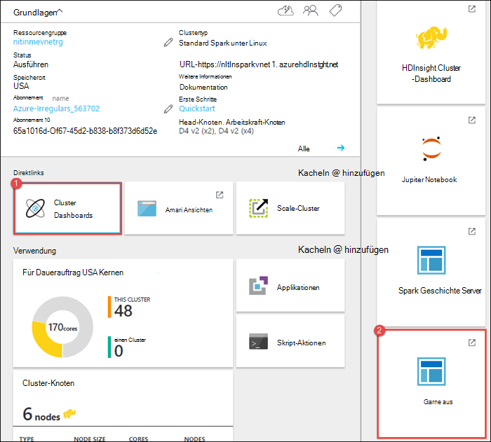
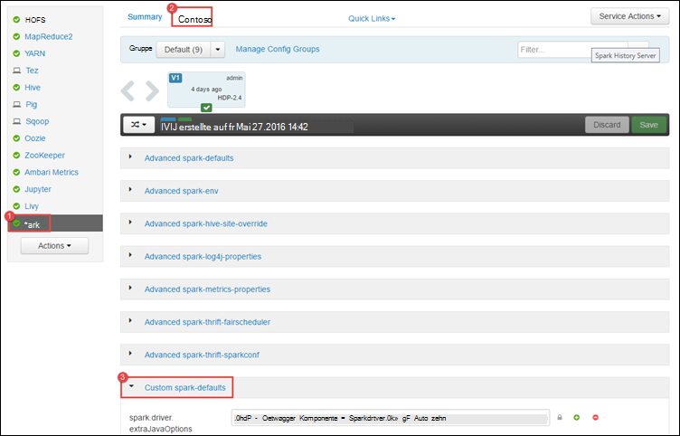
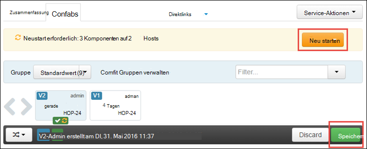
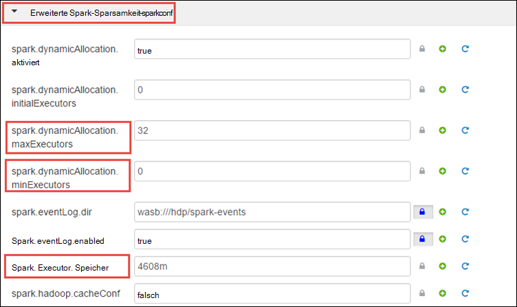
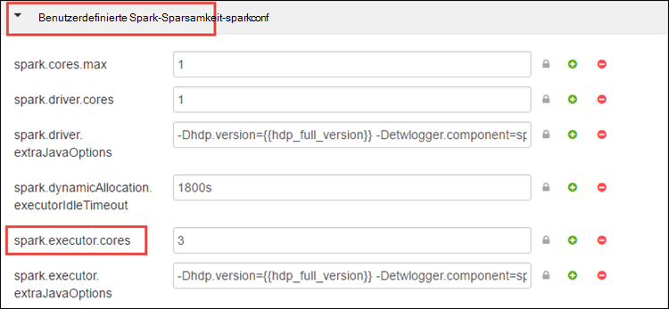
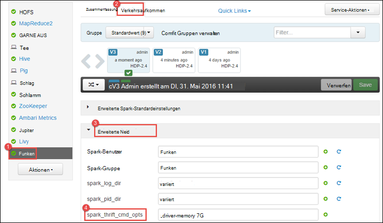
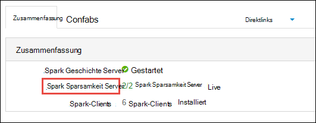
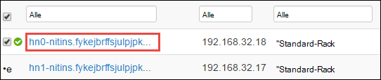
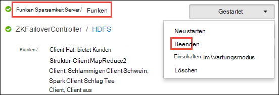

<properties 
    pageTitle="Mit Ressourcen-Manager Clusters Apache Spark HDInsight Mittel | Microsoft Azure" 
    description="Informationen Sie zum Spark-Cluster auf HDInsight Leistung verwendet." 
    services="hdinsight" 
    documentationCenter="" 
    authors="nitinme" 
    manager="jhubbard" 
    editor="cgronlun"
    tags="azure-portal"/>

<tags 
    ms.service="hdinsight" 
    ms.workload="big-data" 
    ms.tgt_pltfrm="na" 
    ms.devlang="na" 
    ms.topic="article" 
    ms.date="08/25/2016" 
    ms.author="nitinme"/>

# Ressourcen Sie für den Cluster Apache Spark HDInsight Linux

In diesem Artikel erfahren Sie, auf Schnittstellen wie Ambari UI Benutzeroberfläche aus und Server Geschichte Spark Spark Cluster zugeordnet. Sie werden wie die Clusterkonfiguration für optimale Leistung erfahren.

**Komponenten:**

Sie benötigen Folgendes:

- Ein Azure-Abonnement. Finden Sie [kostenlose Testversion von Azure zu erhalten](https://azure.microsoft.com/documentation/videos/get-azure-free-trial-for-testing-hadoop-in-hdinsight/).
- Ein HDInsight Linux Apache Spark-Cluster. Informationen finden Sie [in Azure HDInsight Cluster Apache Spark erstellen](hdinsight-apache-spark-jupyter-spark-sql.md).

## Wie starten Sie Ambari Web-Benutzeroberfläche

1. [Azure-Portal](https://portal.azure.com/)aus dem Startmenü klicken Sie auf die Kachel Spark Cluster (Wenn Sie es an das Startmenü angeheftet). Sie können auch zum Cluster unter **Alle durchsuchen** > **HDInsight-Cluster**. 
 
2. Klicken Sie auf **Dashboard**Blatt Cluster Spark. Geben Sie bei Aufforderung die Administratoranmeldeinformationen für den Spark-Cluster.

    ![Ambari starten] (./media/hdinsight-apache-spark-resource-manager/hdispark.cluster.launch.dashboard.png "Ressourcen-Manager starten")

3. Dies sollte Ambari Web-Benutzeroberfläche starten, wie unten dargestellt.

    ![Ambari Web-Benutzeroberfläche] (./media/hdinsight-apache-spark-resource-manager/ambari-web-ui.png "Ambari Web-Benutzeroberfläche")   

## Wie starten Sie Server Geschichte Funken

1. [Azure-Portal](https://portal.azure.com/)aus dem Startmenü klicken Sie auf die Kachel Spark Cluster (Wenn Sie es an das Startmenü angeheftet).

2. Blade Cluster unter **Quicklinks**, klicken Sie auf **Cluster-Dashboard**. Klicken Sie auf **Spark Geschichte Server**Blatt **Cluster Dashboard** .

    ![Spark Geschichte Server] (./media/hdinsight-apache-spark-resource-manager/launch-history-server.png "Spark Geschichte Server")

    Geben Sie bei Aufforderung die Administratoranmeldeinformationen für den Spark-Cluster.

## Wie starten Sie die Benutzeroberfläche aus

GARN-Benutzeroberfläche können Sie Programme überwachen, die derzeit auf dem Spark-Cluster ausgeführt werden. 

1. Blatt Cluster auf **Cluster-Dashboard**und klicken Sie dann auf **aus**.

    

    >[AZURE.TIP] Alternativ können Sie auch die UI GARN Ambari UI starten. Starten der UI Ambari Blatt Cluster auf **Cluster-Dashboard**und dann auf **HDInsight Cluster Dashboard**. Ambari UI auf **aus**, klicken Sie auf **Quicklinks**, klicken Sie auf der aktiven Ressourcen-Manager und klicken Sie **ResourceManager-Benutzeroberfläche**.

## Was ist die optimale Clusterkonfiguration Spark ausgeführt?

Drei wichtige Parameter für Spark Konfiguration je nach Anwendung verwendet werden können `spark.executor.instances`, `spark.executor.cores`, und `spark.executor.memory`. Ein Executor ist ein Prozess Spark-Anwendung gestartet. Wird die Arbeitskraft Knoten ausgeführt, und die Aufgaben für die Anwendung verantwortlich ist. Die Standardanzahl der Executor und Executor Größen für jeden Cluster ist die Anzahl der workerknoten und der Arbeitskraft Knotengröße berechnet. Diese werden in `spark-defaults.conf` auf den Kopf Clusterknoten. 

Die drei Parameter für jede einzelne Anwendung angegeben werden oder können auf Clusterebene (für alle Programme, die im Cluster ausgeführt) konfiguriert werden.

### Ändern Sie die Parameter mit Ambari UI

1. Ambari UI auf **Spark**, klicken Sie auf **Konfigurationen**und erweitern Sie dann die **benutzerdefinierte Spark-Standardwerte**.

    

2. Die Standardwerte sind 4 Spark auf Cluster Programme gleichzeitig ausführen können. Sie können ändert diese Werte über die Benutzeroberfläche wie unten dargestellt.

    

3. Klicken Sie auf **Speichern** , um die Konfiguration zu speichern. Klicken Sie oben auf der Seite werden Sie aufgefordert, alle betroffenen Dienste neu starten. Klicken Sie auf **neu starten**.

    

### Ändern Sie die Parameter für eine Anwendung mit Jupyter notebook

Für Programme Jupyter Notebook, können Sie die `%%configure` Magic Konfiguration ändern. Im Idealfall müssen Sie diese am Anfang der Anwendung vor dem Ausführen der ersten Zelle Code ändern. Dadurch die Konfiguration der Sitzung Livius gilt es erstellt wird. Wenn Sie die Konfiguration der Anwendung später ändern möchten, verwenden Sie die `-f` Parameter. Damit alle bei der Anwendung verloren.

Unten Ausschnitt zeigt die Konfiguration für eine Anwendung mit Jupyter ändern.

    %%configure 
    {"executorMemory": "3072M", "executorCores": 4, “numExecutors”:10}

Parameter müssen als JSON-Zeichenfolge übergeben werden und müssen in der nächsten Zeile nach der Magic in der Spalte wird angezeigt. 

### Ändern der Parameter für einen Antrag mit Spark senden

Befehl ist ein Beispiel für die Konfigurationsparameter für Batch-Anwendung ändern, die mit übermittelt `spark-submit`.

    spark-submit --class <the application class to execute> --executor-memory 3072M --executor-cores 4 –-num-executors 10 <location of application jar file> <application parameters>

### Ändern Sie die Parameter für einen Antrag Aufrollen

Befehl zeigt die Konfigurationsparameter für Batch-Anwendung ändern, die über cURL übermittelt wird.

    curl -k -v -H 'Content-Type: application/json' -X POST -d '{"file":"<location of application jar file>", "className":"<the application class to execute>", "args":[<application parameters>], "numExecutors":10, "executorMemory":"2G", "executorCores":5' localhost:8998/batches

### Ändern dieser Parameter in einem Spark Sparsamkeit Server

Spark Sparsamkeit Server können JDBC-ODBC auf Spark-Cluster und zum Dienst Spark SQL-Abfragen. Tools wie Power BI Tableaus usw.. Verwenden Sie ODBC-Protokoll mit Spark Sparsamkeit Server als Spark Spark SQL-Abfragen ausführen. Erstellung ein Clusters Spark werden zwei Instanzen von Spark Sparsamkeit Server gestartet, auf jedes Headknoten. Jeder Server Spark Sparsamkeit ist als Anwendung Spark GARN-Benutzeroberfläche angezeigt. 

Spark Sparsamkeit Server verwendet Spark Executor dynamische Zuweisung und die `spark.executor.instances` wird nicht verwendet. Stattdessen verwendet Spark Sparsamkeit Server `spark.dynamicAllocation.minExecutors` und `spark.dynamicAllocation.maxExecutors` an die Anzahl der Executor. Der Parameter `spark.executor.cores` und `spark.executor.memory` zum Executor Größe ändern. Sie können diese Parameter ändern, wie unten dargestellt.

* Erweitern Sie die Kategorie **Erweitert Spark-Sparsamkeit-Sparkconf** aktualisieren die Parameter `spark.dynamicAllocation.minExecutors`, `spark.dynamicAllocation.maxExecutors`, und `spark.executor.memory`.

     

* Erweitern Sie die Kategorie **benutzerdefinierte Spark-Sparsamkeit-Sparkconf** um der Parameter `spark.executor.cores`.

    

### Ändern den Treiber Arbeitsspeicher des Servers Sparsamkeit Funken

Spark Sparsamkeit Serverspeicher Treiber 25 % des Arbeitsspeichers Head-Knoten konfiguriert ist, sofern die Gesamtgröße RAM des Head-Knotens größer als 14GB. Ambari UI können Sie die Speicherkonfiguration Treiber ändern, wie unten dargestellt.

* Ambari UI auf **Spark**, klicken Sie auf **Konfiguration**, erweitern Sie **Erweiterte Spark Env**und geben Sie den Wert für **Spark_thrift_cmd_opts**.

    

## Ich verwende keine BI Spark-Cluster. Wie nehme ich die Ressourcen zurück?

Da wir Spark dynamischen Zuteilung verwenden, sind die einzigen Sparsamkeit Server verbrauchten Ressourcen sind die Ressourcen für die beiden Master. Um diese Ressourcen freizugeben, müssen Sie die Sparsamkeit Serverdienste auf dem Cluster beenden.

1. Wählen Sie UI Ambari aus dem linken Bereich **Spark**.

2. Klicken Sie auf der nächsten Seite auf **Spark Sparsamkeit Server**.

    

3. Die zwei Headnodes sollte auf dem Server Sparsamkeit Spark läuft angezeigt werden. Klicken Sie auf die Headnodes.

    

4. Die Seite listet alle Dienste auf diesem Hauptknoten. Klicken Sie aus der Liste auf die Dropdown-Schaltfläche neben Spark Sparsamkeit und klicken Sie dann auf **Beenden**.

    

5. Wiederholen Sie diese Schritte für die anderen Hauptknoten sowie.

## Meine Jupyter Notebooks werden nicht wie erwartet ausgeführt. Wie kann ich den Dienst neu starten?

1. Starten Sie die Webbenutzeroberfläche Ambari wie oben dargestellt. Im linken Navigationsbereich auf **Jupyter**, klicken Sie auf **Service-Aktionen**, und klicken Sie dann auf **Neu starten**. Dies startet den Dienst Jupyter auf alle Headnodes.

    ![Jupyter starten] (./media/hdinsight-apache-spark-resource-manager/restart-jupyter.png "Jupyter starten")

    

## Siehe auch

* [Übersicht: Apache Spark auf Azure HDInsight](hdinsight-apache-spark-overview.md)

### Szenarien

* [Spark BI: Datenanalyse interaktive BI-Tools Spark in HDInsight mit](hdinsight-apache-spark-use-bi-tools.md)

* [Spark mit Computer: Funken im HDInsight für die Analyse erstellen Temperatur HKL-Daten verwenden](hdinsight-apache-spark-ipython-notebook-machine-learning.md)

* [Spark mit Computer: Spark in HDInsight Lebensmittel Ergebnisse vorherzusagen verwenden](hdinsight-apache-spark-machine-learning-mllib-ipython.md)

* [Spark Streaming: Verwendung Funken im HDInsight zum Erstellen von Echtzeit-streaming](hdinsight-apache-spark-eventhub-streaming.md)

* [Websiteanalyse mit Spark in HDInsight](hdinsight-apache-spark-custom-library-website-log-analysis.md)

### Erstellen und Ausführen der Anwendung

* [Erstellen Sie eine eigenständige Anwendung Scala](hdinsight-apache-spark-create-standalone-application.md)

* [Führen Sie Aufträge auf einem Spark-Cluster mit Livius Remote aus](hdinsight-apache-spark-livy-rest-interface.md)

### Tools und Erweiterung

* [Verwenden Sie HDInsight Tools Plugin für IntelliJ IDEA erstellen und übermitteln Spark Scala Programme](hdinsight-apache-spark-intellij-tool-plugin.md)

* [Mit HDInsight Tools Plugin IntelliJ Idee Remotedebugging Spark-Applikationen](hdinsight-apache-spark-intellij-tool-plugin-debug-jobs-remotely.md)

* [Verwenden Sie Zeppelin Notebooks mit einem Cluster Spark HDInsight](hdinsight-apache-spark-use-zeppelin-notebook.md)

* [Cluster-Kernels für Jupyter Notebook Spark für HDInsight](hdinsight-apache-spark-jupyter-notebook-kernels.md)

* [Verwenden Sie externe Pakete mit Jupyter notebooks](hdinsight-apache-spark-jupyter-notebook-use-external-packages.md)

* [Jupyter auf dem Computer installieren und Verbinden mit einem HDInsight Spark-cluster](hdinsight-apache-spark-jupyter-notebook-install-locally.md)

### Verwalten von Ressourcen

* [Verfolgen und Debug Aufträge in einem Apache Spark-Cluster HDInsight](hdinsight-apache-spark-job-debugging.md)

[hdinsight-versions]: hdinsight-component-versioning.md
[hdinsight-upload-data]: hdinsight-upload-data.md
[hdinsight-storage]: hdinsight-hadoop-use-blob-storage.md

[azure-purchase-options]: http://azure.microsoft.com/pricing/purchase-options/
[azure-member-offers]: http://azure.microsoft.com/pricing/member-offers/
[azure-free-trial]: http://azure.microsoft.com/pricing/free-trial/
[azure-management-portal]: https://manage.windowsazure.com/
[azure-create-storageaccount]: storage-create-storage-account.md 
