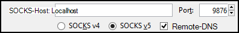
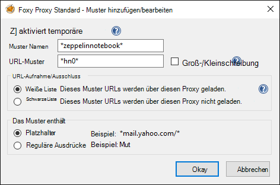
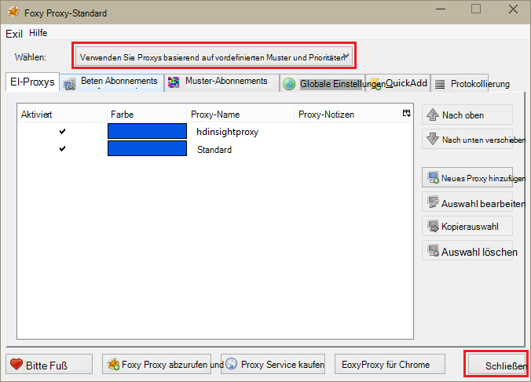

<properties 
    pageTitle="Installieren Zeppelin Notebooks für Apache Spark-Cluster unter HDInsight Linux | Microsoft Azure" 
    description="Eine schrittweise Anleitung zum Installieren und Zeppelin Notebooks mit Spark HDInsight Linux verwenden." 
    services="hdinsight" 
    documentationCenter="" 
    authors="nitinme" 
    manager="jhubbard" 
    editor="cgronlun"/>

<tags 
    ms.service="hdinsight" 
    ms.workload="big-data" 
    ms.tgt_pltfrm="na" 
    ms.devlang="na" 
    ms.topic="article" 
    ms.date="10/28/2016" 
    ms.author="nitinme"/>

# Installieren Sie Zeppelin Notebooks für Apache Spark-Cluster auf HDInsight Linux

Informationen Sie Zeppelin Notebooks auf Apache Spark-Cluster installieren und mit Zeppelin Notebooks Spark Aufträge ausgeführt werden.

> [AZURE.IMPORTANT] Zeppelin Notebooks sind jetzt standardmäßig mit Spark verfügbar. Sie müssen explizit sie Spark-Cluster nicht mehr installieren. Weitere Informationen finden Sie unter [Verwendung Zeppelin Notebooks mit Apache Spark HDInsight Linux cluster](hdinsight-apache-spark-zeppelin-notebook.md). 

**Komponenten:**

* Bevor Sie dieses Lernprogramm beginnen, müssen Sie ein Azure-Abonnement. Finden Sie [kostenlose Testversion von Azure zu erhalten](https://azure.microsoft.com/documentation/videos/get-azure-free-trial-for-testing-hadoop-in-hdinsight/).
* Apache Spark-Cluster. Informationen finden Sie [in Azure HDInsight Cluster Apache Spark erstellen](hdinsight-apache-spark-jupyter-spark-sql.md).
* SSH-Client. Verteilung von Linux und Unix oder Macintosh OS X die `ssh` Befehl wird mit dem Betriebssystem bereitgestellt. Unter Windows sollten [kitten](http://www.chiark.greenend.org.uk/~sgtatham/putty/download.html)

    > [AZURE.NOTE] SSH-Client verwenden soll `ssh` oder kitten bitte die Dokumentation für Ihren Client auf einen SSH-Tunnel einrichten.

* Ein Webbrowser konfiguriert einen SOCKS-Proxyserver

* __(optional)__: ein Plug-in wie [FoxyProxy](http://getfoxyproxy.org/,) anwenden können Regeln, die nur bestimmte Anfragen durch den Tunnel weiterleiten.

    > [AZURE.WARNING] Ohne ein Plugin wie FoxyProxy können alle Anfragen über den Browser über den Tunnel weitergeleitet werden. Dies führt zu Webseiten in Ihrem Browser langsamer geladen.

## Installieren von Zeppelin auf einem Cluster Funken

Sie können Zeppelin auf einem Spark-Cluster mit Skriptaktion. Skriptaktion verwendet benutzerdefinierte Skripts zum Installieren von Komponenten auf dem Cluster nicht standardmäßig verfügbar sind. Das benutzerdefinierte Skript können Sie Zeppelin mit HDInsight .NET SDK oder mithilfe von Azure PowerShell Azure-Portal installieren. Das Skript können Sie Zeppelin installieren, entweder als Teil der Clustererstellung oder Cluster ausgeführt wird. Links in den folgenden Abschnitten enthalten die Hinweise dazu. 

### Mithilfe des Azure-Portals

Anleitung zum Azure-Portal verwenden, um Skripts ausgeführt Zeppelin installieren finden Sie unter [Anpassen HDInsight Cluster mit Skriptaktion](hdinsight-hadoop-customize-cluster-linux.md#use-a-script-action-from-the-azure-portal). Sie müssen diesem Artikel Änderungen vornehmen.

* Sie müssen das Skript verwenden, um Zeppelin installieren. Das benutzerdefinierte Skript in einem Cluster Spark HDInsight Zeppelin installieren ist unter den folgenden Links verfügbar:
    * Spark 1.6.0 Cluster-`https://hdiconfigactions.blob.core.windows.net/linuxincubatorzeppelinv01/install-zeppelin-spark160-v01.sh`
    * Spark 1.5.2 Cluster-`https://hdiconfigactions.blob.core.windows.net/linuxincubatorzeppelinv01/install-zeppelin-spark151-v01.sh`

* Sie müssen die Skriptaktion nur auf die Hauptknoten ausführen.

* Das Skript benötigt keine Parameter. 

### HDInsight .NET SDK verwenden

Anleitung mit HDInsight .NET SDK Skript ausgeführt Zeppelin installieren finden Sie unter [Anpassen HDInsight Cluster mit Skriptaktion](hdinsight-hadoop-customize-cluster-linux.md#use-a-script-action-from-the-hdinsight-net-sdk). Sie müssen diesem Artikel Änderungen vornehmen.

* Sie müssen das Skript verwenden, um Zeppelin installieren. Das benutzerdefinierte Skript in einem Cluster Spark HDInsight Zeppelin installieren ist unter den folgenden Links verfügbar:
    * Spark 1.6.0 Cluster-`https://hdiconfigactions.blob.core.windows.net/linuxincubatorzeppelinv01/install-zeppelin-spark160-v01.sh`
    * Spark 1.5.2 Cluster-`https://hdiconfigactions.blob.core.windows.net/linuxincubatorzeppelinv01/install-zeppelin-spark151-v01.sh`

* Das Skript benötigt keine Parameter. 

* Legen Sie die Cluster erstellen, Spark.

### Mithilfe von Azure PowerShell

Verwenden Sie folgende PowerShell-Ausschnitt zum Erstellen eines Clusters Spark HDInsight Linux mit Zeppelin installiert. Je nach Version Sie Spark-Cluster, um den Link zu den entsprechenden benutzerdefinierten Skripts PowerShell Ausschnitt aktualisieren müssen. 

* Spark 1.6.0 Cluster-`https://hdiconfigactions.blob.core.windows.net/linuxincubatorzeppelinv01/install-zeppelin-spark160-v01.sh`
* Spark 1.5.2 Cluster-`https://hdiconfigactions.blob.core.windows.net/linuxincubatorzeppelinv01/install-zeppelin-spark151-v01.sh`

[AZURE.INCLUDE [upgrade-powershell](../../includes/hdinsight-use-latest-powershell.md)]

    Login-AzureRMAccount
    
    # PROVIDE VALUES FOR THE VARIABLES
    $clusterAdminUsername="admin"
    $clusterAdminPassword="<<password>>"
    $clusterSshUsername="adminssh"
    $clusterSshPassword="<<password>>"
    $clusterName="<<clustername>>"
    $clusterContainerName=$clusterName
    $resourceGroupName="<<resourceGroupName>>"
    $location="<<region>>"
    $storage1Name="<<storagename>>"
    $storage1Key="<<storagekey>>"
    $subscriptionId="<<subscriptionId>>"
    
    Select-AzureRmSubscription -SubscriptionId $subscriptionId
    
    $passwordAsSecureString=ConvertTo-SecureString $clusterAdminPassword -AsPlainText -Force
    $clusterCredential=New-Object System.Management.Automation.PSCredential ($clusterAdminUsername, $passwordAsSecureString)
    $passwordAsSecureString=ConvertTo-SecureString $clusterSshPassword -AsPlainText -Force
    $clusterSshCredential=New-Object System.Management.Automation.PSCredential ($clusterSshUsername, $passwordAsSecureString)
    
    $azureHDInsightConfigs= New-AzureRmHDInsightClusterConfig -ClusterType Spark
    $azureHDInsightConfigs.DefaultStorageAccountKey = $storage1Key
    $azureHDInsightConfigs.DefaultStorageAccountName = "$storage1Name.blob.core.windows.net"
    
    Add-AzureRMHDInsightScriptAction -Config $azureHDInsightConfigs -Name "Install Zeppelin" -NodeType HeadNode -Parameters "void" -Uri "https://hdiconfigactions.blob.core.windows.net/linuxincubatorzeppelinv01/install-zeppelin-spark151-v01.sh"
    
    New-AzureRMHDInsightCluster -Config $azureHDInsightConfigs -OSType Linux -HeadNodeSize "Standard_D12" -WorkerNodeSize "Standard_D12" -ClusterSizeInNodes 2 -Location $location -ResourceGroupName $resourceGroupName -ClusterName $clusterName -HttpCredential $clusterCredential -DefaultStorageContainer $clusterContainerName -SshCredential $clusterSshCredential -Version "3.3"
 
## Einrichten von SSH tunneling Zeppelin Notizbuch zugreifen

SSH-Tunnel verwendet Zeppelin Notebooks auf Spark HDInsight Linux Cluster auf. Die folgenden Schritte zeigen, wie einen SSH-Tunnel über ssh Befehlszeile (Linux) und kitten (Windows) erstellt.

### Erstellen eines Tunnels mit dem Befehl SSH (Linux)

Verwenden Sie der folgende Befehl zum Erstellen einer SSH tunnel mit der `ssh` Befehl. Ersetzen Sie __Benutzernamen__ mit einem SSH-Benutzer für den HDInsight-Cluster, und __CLUSTERNAME__ durch den Namen des Clusters HDInsight

    ssh -C2qTnNf -D 9876 USERNAME@CLUSTERNAME-ssh.azurehdinsight.net

Dies erstellt eine Verbindung, die Datenverkehr am lokalen Port 9876 Cluster über SSH weiterleitet. Die Optionen sind:

* **D 9876** - der lokale Port, die durch den Tunnel Datenverkehr weiterleiten.

* **C** - alle Daten komprimieren, da Webdatenverkehr hauptsächlich Text ist.

* **2** - Force SSH-Protokoll, Version 2 nur versuchen.

* **Q** - Stiller Modus.

* **T** - deaktivieren Pseudo-tty-Zuweisung, da wir nur einen Port weitergeleitet.

* **n** - Lesen von STDIN, verhindern, da wir nur einen Port weitergeleitet.

* **N** - remote-Befehl nicht ausführen, da wir nur einen Port weitergeleitet.

* **f** - im Hintergrund ausgeführt.

Wenn Sie mit einem SSH-Schlüssel des Clusters konfiguriert, möglicherweise mit den `-i` Parameter und geben Sie den Pfad zum privaten SSH-Schlüssel.

Nachdem der Befehl abgeschlossen ist, Datenverkehr auf Port 9876 auf dem lokalen Computer über weitergeleitet werden, Secure Sockets Layer (SSL) zum Cluster head-Knoten und offenbar vorhanden.

### Erstellen eines Tunnels mit kitten (Windows)

Gehen Sie folgendermaßen vor, um ein kitten mit SSH-Tunnel zu erstellen.

1. Öffnen Sie kitten, und geben Sie die Verbindungsinformationen. Wenn Sie nicht mit kitten vertraut sind, finden Sie unter [Verwenden SSH mit Linux-basierten Hadoop auf Windows HDInsight](hdinsight-hadoop-linux-use-ssh-windows.md) Informationen mit HDInsight verwendet.

2. Im Abschnitt **Kategorien** links im Dialogfeld erweitern Sie **Verbindung** **SSH**, und wählen Sie dann **Tunnel**.

3. Angaben Sie folgende im Formular **Optionen zum Steuern der SSH Port weiterleiten** :

    * **Ursprungs-Port** - Port auf dem Client, den Sie weiterleiten möchten. Z. B. **9876**.

    * **Ziel** - die SSH-Adresse für den Cluster Linux-basierten HDInsight. Z. B. **MeinCluster-SSH.azurehdinsight.NET**.

    * **Dynamische** - ermöglicht dynamische SOCKS-Proxy weiterleiten.

    

4. Klicken Sie auf **Hinzufügen** , um die Einstellungen hinzufügen, und klicken Sie auf **Öffnen** , um eine SSH-Verbindung zu öffnen.

5. Wenn Sie aufgefordert werden, melden Sie sich an den Server an. Eine SSH-Sitzung einrichten wird und aktivieren den Tunnel.

### Der Tunnel vom browser

> [AZURE.NOTE] Die Schritte in diesem Abschnitt verwenden den FireFox-Browser für Linux, Unix und Macintosh OS X Windows Systeme frei verfügbar ist. Andere Browser wie Google Chrome, Microsoft Edge oder Apple Safari sollte funktionieren; Allerdings verwendete einige Schritte FoxyProxy-Plugin für alle Browser möglicherweise nicht.

1. Konfigurieren Sie den Browser, um **Localhost:9876** als **v5 SOCKS-** Proxy verwenden. Hier wird die Firefox-Einstellungen aussehen. Wenn Sie einen anderen Anschluss als 9876 verwendet, ändern Sie den Port zu verwendeten:

    

    > [AZURE.NOTE] Auswählen von **Remote-DNS-** auflösen Anfragen (DNS = Domain Name System) HDInsight Cluster. Wenn dies deaktiviert ist, wird DNS lokal aufgelöst werden.

2. Stellen Sie sicher, dass Datenverkehr durch den Tunnel weitergeleitet wird durch eine Website wie [http://www.whatismyip.com/](http://www.whatismyip.com/) mit Proxyeinstellungen aktiviert und deaktiviert in Firefox Überwachungsgerät. Während die Einstellung aktiviert ist, werden die IP-Adresse für einen Computer im Microsoft Azure-Rechenzentrum.

### Browsererweiterungen

Konfigurieren den Browser, um den Tunnel funktioniert in der Regel möchten allen Datenverkehr über den Tunnel. Browsererweiterungen wie [FoxyProxy](http://getfoxyproxy.org/) unterstützen Mustervergleich für URL-Anfragen (FoxyProxy Standard oder nur Plus), so dass nur Anfragen für bestimmte URLs über den Tunnel gesendet werden.

Wenn Sie FoxyProxy Standard installiert haben, gehen Sie zum Weiterleiten von Datenverkehr nur für HDInsight über den Tunnel konfigurieren.

1. FoxyProxy-Erweiterung in Ihrem Browser geöffnet. Wählen Sie z. B. in Firefox FoxyProxy neben dem Adressfeld.

    

2. Wählen Sie **Neue Proxy hinzufügen**, wählen Sie die Registerkarte **Allgemein** , und geben Sie ein Proxy **HDInsightProxy**.

    

3. Wählen Sie die Registerkarte **Proxy-Details** , und füllen Sie die folgenden Felder:

    * **Host oder IP-Adresse** – Dies ist Localhost, da wir einen SSH-Tunnel auf dem lokalen Computer verwenden.

    * **Port** – diesen Port für SSH-Tunnel verwendet.

    * **SOCKS-Proxy** - wählen Sie diese Browser den Tunnel als Proxy verwenden kann.

    * **SOCKS-v5** - dieser Option legen Sie die erforderliche Version des Proxys.

    

4. Wählen Sie die Registerkarte **URL-Muster** , und wählen Sie **Neue Muster hinzufügen**. **Verwenden Sie die folgenden Muster definieren**

    * **Muster der Name** - **Zeppelinnotebook** - Dies ist eine benutzerfreundliche Namen für das Muster.

    * **URL-Muster** - **\*hn0** * - definiert eine Muster, das den internen vollqualifizierten Domänennamen des Endpunkts übereinstimmt, Zeppelin Notebooks gehostet werden. Da Zeppelin Notebooks nur auf der headnode0 des Clusters sind und der Endpunkt i. d. r. ist `http://hn0-<string>.internal.cloudapp.net`, dem Muster * *hn0** wird sichergestellt, dass die Anforderung an den Endpunkt Zeppelin umgeleitet wird.

        

4. Klicken Sie auf **OK** , um den Proxy hinzuzufügen und **Proxyeinstellungen**zu schließen.

5. Oben im Dialogfeld FoxyProxy ändern Sie **Modus wählen** **mit Proxys**basierend auf vordefinierten Muster und Prioritäten und dann auf **Schließen**.

    

Nach diesen Schritten werden nur Anfragen für URLs mit der Zeichenfolge __hn0__ über SSL-Tunnel weitergeleitet. 

## Zugriff auf Zeppelin notebook

Haben SSH Tunneling-Setup können die folgenden Schritte Sie Zeppelin Notebook im Cluster Spark folgt zugreifen. In diesem Abschnitt sehen Sie, wie Sql % und % Struktur Anweisungen ausgeführt.

1. Öffnen Sie im Webbrowser den folgenden Endpunkt:

        http://hn0-myspar:9995

    * **hn0** bezeichnet headnode0
    * **Myspar** werden die ersten sechs Buchstaben Spark-Clustername.
    * **9995** ist der Port, Zeppelin Notebook zugegriffen werden kann.

2. Erstellen Sie ein neues Notizbuch. Der Header-Bereich **Notebook**auf und klicken Sie dann auf **Neue Notiz erstellen**.

    ![Erstellen einer neuen Zeppelin notebook] (./media/hdinsight-apache-spark-use-zeppelin-notebook/hdispark.createnewnote.png "Erstellen einer neuen Zeppelin notebook")

    Auf der Seite unter der Überschrift **Notebook** sollte ein neues Notizbuch mit dem Namen beginnend mit **Notiz XXXXXXXXX**angezeigt werden. Klicken Sie auf das neue Notizbuch.

3. Klicken Sie auf der Webseite für das neue Notizbuch auf die Überschrift, und ändern Sie den Namen des Notizbuchs möchten. Drücken Sie die EINGABETASTE, um die Änderung zu speichern. Stellen Sie außerdem sicher, Notebook-Header Status **verbunden** in der oberen rechten Ecke angezeigt.

    ![Zeppelin Notebook status] (./media/hdinsight-apache-spark-use-zeppelin-notebook/hdispark.newnote.connected.png "Zeppelin Notebook status")

### Ausführen von SQL-Anweisungen

4. Laden Sie Beispieldaten in eine temporäre Tabelle. Beim Erstellen eines Clusters Spark in HDInsight wird dem Konto zugeordneten Speicher unter **\HdiSamples\SensorSampleData\hvac**Beispieldatendatei **hvac.csv**kopiert.

    Fügen Sie den leeren Absatz, der in der neuen Arbeitsmappe standardmäßig erstellt wird, im folgenden Codeausschnitt.

        // Create an RDD using the default Spark context, sc
        val hvacText = sc.textFile("wasbs:///HdiSamples/HdiSamples/SensorSampleData/hvac/HVAC.csv")
        
        // Define a schema
        case class Hvac(date: String, time: String, targettemp: Integer, actualtemp: Integer, buildingID: String)
        
        // Map the values in the .csv file to the schema
        val hvac = hvacText.map(s => s.split(",")).filter(s => s(0) != "Date").map(
            s => Hvac(s(0), 
                    s(1),
                    s(2).toInt,
                    s(3).toInt,
                    s(6)
            )
        ).toDF()
        
        // Register as a temporary table called "hvac"
        hvac.registerTempTable("hvac")
        
    Drücken Sie **UMSCHALT + EINGABETASTE** , oder klicken Sie auf **die Wiedergabeschaltfläche für den Absatz den Ausschnitt ausführen** . Status des Absatzes rechts sollte Fortschreiten bereit, AUSSTEHENDE ausgeführt hat. Die Ausgabe wird unten im gleichen Absatz. Der Screenshot sieht folgendermaßen aus:

    ![Erstellen einer temporären Tabelle Rohdaten] (./media/hdinsight-apache-spark-use-zeppelin-notebook/hdispark.note.loaddDataintotable.png "Erstellen einer temporären Tabelle Rohdaten")

    Sie können auch einen Titel zu jedem Absatz bereitstellen. Rechts klicken Sie auf **das Symbol** und dann auf **Titel anzeigen**.

5. Sie können jetzt Spark-SQL-Anweisungen der **HKL** -Tabelle ausführen. Fügen Sie die folgende Abfrage in einen neuen Absatz. Die Abfrage ruft Gebäude-ID sowie die Differenz zwischen dem Ziel und Temperaturen für jedes Gebäude zu einem bestimmten Zeitpunkt. Drücken Sie **UMSCHALT + EINGABETASTE**.

        %sql
        select buildingID, (targettemp - actualtemp) as temp_diff, date 
        from hvac
        where date = "6/1/13" 

    **% Sql** -Anweisung zu Beginn weist das Notizbuch Spark SQL-Interpreter verwendet. Betrachten Sie definierten Interpreter auf der Registerkarte **Interpreter** Notebook-Header.

    Der folgende Screenshot zeigt die Ausgabe.

    ![Führen Sie eine Spark-SQL-Anweisung des Notebooks] (./media/hdinsight-apache-spark-use-zeppelin-notebook/hdispark.note.sparksqlquery1.png "Führen Sie eine Spark-SQL-Anweisung des Notebooks")

     Klicken Sie zum Wechseln zwischen unterschiedlichen Darstellungsweisen für dieselbe Ausgabe auf Anzeigeoptionen (Rechteck hervorgehoben). Klicken Sie auf **Einstellungen** wählen Sie welche stellt die Schlüssel und Werte in der Ausgabe. Die Bildschirmaufnahme über verwendet **BuildingID** als Schlüssel und den Durchschnitt der **Temp_diff** als Wert.

    
6. Sie können auch mit Variablen in der Abfrage Spark-SQL-Anweisung ausführen. Der nächste Ausschnitt zeigt wie eine Variable **Temp**in der Abfrage mit den möglichen Werten mit Abfragen möchten. Beim Ausführen der Abfrage wird eine Dropdownliste automatisch mit den Werten aufgefüllt, für die Variable angegeben.

        %sql
        select buildingID, date, targettemp, (targettemp - actualtemp) as temp_diff
        from hvac
        where targettemp > "${Temp = 65,65|75|85}" 

    Fügen Sie diesen Ausschnitt eines neuen Absatzes, und drücken Sie **UMSCHALT + EINGABETASTE**. Der folgende Screenshot zeigt die Ausgabe.

    ![Führen Sie eine Spark-SQL-Anweisung des Notebooks] (./media/hdinsight-apache-spark-use-zeppelin-notebook/hdispark.note.sparksqlquery2.png "Führen Sie eine Spark-SQL-Anweisung des Notebooks")

    Für nachfolgende Abfragen können wählen einen neuen Wert aus der Dropdown-Liste und die Abfrage erneut auszuführen. Klicken Sie auf **Einstellungen** wählen Sie welche stellt die Schlüssel und Werte in der Ausgabe. Die Bildschirmaufnahme oben verwendet **BuildingID** als Schlüssel den Durchschnitt der **Temp_diff** als Wert und als Gruppe **Targettemp** .

7. Starten des Interpreters Spark SQL zum Beenden der Anwendung. Klicken Sie auf Registerkarte **Interpreter** oben und Spark Dolmetscher, **neu starten**.

    ![Zeppelin Intepreter starten] (./media/hdinsight-apache-spark-use-zeppelin-notebook/hdispark.zeppelin.restart.interpreter.png "Zeppelin Intepreter starten")

### Struktur-Anweisung ausführen

1. Klicken Sie auf **Interpreter** , vom Notebook Zeppelin.

    ![Interpreter Struktur aktualisieren] (./media/hdinsight-apache-spark-use-zeppelin-notebook/zeppelin-update-hive-interpreter-1.png "Interpreter Struktur aktualisieren")

2. Der Interpreter **Struktur** klicken Sie auf **Bearbeiten**.

    ![Interpreter Struktur aktualisieren] (./media/hdinsight-apache-spark-use-zeppelin-notebook/zeppelin-update-hive-interpreter-2.png "Interpreter Struktur aktualisieren")

    Die folgenden Eigenschaften aktualisiert.

    * **Default.password** das angegebene Kennwort für den Administrator beim Erstellen HDInsight Spark-Cluster festgelegt.
    * Legen Sie **default.url** auf `jdbc:hive2://<spark_cluster_name>.azurehdinsight.net:443/default;ssl=true?hive.server2.transport.mode=http;hive.server2.thrift.http.path=/hive2`. Ersetzen Sie ** \<Spark_cluster_name >** mit dem Namen des Clusters Spark.
    * Legen Sie **default.user** auf den Namen der Administratorbenutzer, die beim Erstellen des Clusters angegeben. Beispielsweise *Admin*.

3. Klicken Sie auf **Speichern** und Interpreter Struktur neu zu starten, klicken Sie auf **OK**.

4. Erstellen Sie ein neues Notizbuch zu, und führen Sie folgende Anweisung zum Auflisten aller Struktur Tabellen im Cluster.

        %hive
        SHOW TABLES

    Standardmäßig hat ein HDInsight-Cluster eine Beispieltabelle aufgerufen **Hivesampletable** die folgende Ausgabe angezeigt werden soll.

    ![Struktur der Ausgabe] (./media/hdinsight-apache-spark-use-zeppelin-notebook/zeppelin-update-hive-interpreter-3.png "Struktur der Ausgabe")

5. Führen Sie die folgende Anweisung um die Einträge in der Tabelle anzuzeigen.

        %hive
        SELECT * FROM hivesampletable LIMIT 5

    Sollten Sie eine Ausgabe ähnlich der folgenden.

    ![Struktur der Ausgabe] (./media/hdinsight-apache-spark-use-zeppelin-notebook/zeppelin-update-hive-interpreter-4.png "Struktur der Ausgabe")

## Siehe auch

* [Übersicht: Apache Spark auf Azure HDInsight](hdinsight-apache-spark-overview.md)

### Szenarien

* [Spark BI: Datenanalyse interaktive BI-Tools Spark in HDInsight mit](hdinsight-apache-spark-use-bi-tools.md)

* [Spark mit Computer: Funken im HDInsight für die Analyse erstellen Temperatur HKL-Daten verwenden](hdinsight-apache-spark-ipython-notebook-machine-learning.md)

* [Spark mit Computer: Spark in HDInsight Lebensmittel Ergebnisse vorherzusagen verwenden](hdinsight-apache-spark-machine-learning-mllib-ipython.md)

* [Spark Streaming: Verwendung Funken im HDInsight zum Erstellen von Echtzeit-streaming](hdinsight-apache-spark-eventhub-streaming.md)

* [Websiteanalyse mit Spark in HDInsight](hdinsight-apache-spark-custom-library-website-log-analysis.md)

### Erstellen und Ausführen der Anwendung

* [Erstellen Sie eine eigenständige Anwendung Scala](hdinsight-apache-spark-create-standalone-application.md)

* [Führen Sie Aufträge auf einem Spark-Cluster mit Livius Remote aus](hdinsight-apache-spark-livy-rest-interface.md)

### Tools und Erweiterung

* [Verwenden Sie HDInsight Tools Plugin für IntelliJ IDEA erstellen und übermitteln Spark Scala Programme](hdinsight-apache-spark-intellij-tool-plugin.md)

* [Mit HDInsight Tools Plugin IntelliJ Idee Remotedebugging Spark-Applikationen](hdinsight-apache-spark-intellij-tool-plugin-debug-jobs-remotely.md)

* [Cluster-Kernels für Jupyter Notebook Spark für HDInsight](hdinsight-apache-spark-jupyter-notebook-kernels.md)

* [Verwenden Sie externe Pakete mit Jupyter notebooks](hdinsight-apache-spark-jupyter-notebook-use-external-packages.md)

* [Jupyter auf dem Computer installieren und Verbinden mit einem HDInsight Spark-cluster](hdinsight-apache-spark-jupyter-notebook-install-locally.md)

### Verwalten von Ressourcen

* [Ressourcen Sie für den Apache Spark-Cluster in Azure HDInsight](hdinsight-apache-spark-resource-manager.md)

* [Verfolgen und Debug Aufträge in einem Apache Spark-Cluster HDInsight](hdinsight-apache-spark-job-debugging.md)

[hdinsight-versions]: hdinsight-component-versioning.md
[hdinsight-upload-data]: hdinsight-upload-data.md
[hdinsight-storage]: hdinsight-hadoop-use-blob-storage.md

[azure-purchase-options]: http://azure.microsoft.com/pricing/purchase-options/
[azure-member-offers]: http://azure.microsoft.com/pricing/member-offers/
[azure-free-trial]: http://azure.microsoft.com/pricing/free-trial/
[azure-management-portal]: https://manage.windowsazure.com/
[azure-create-storageaccount]: storage-create-storage-account.md 

