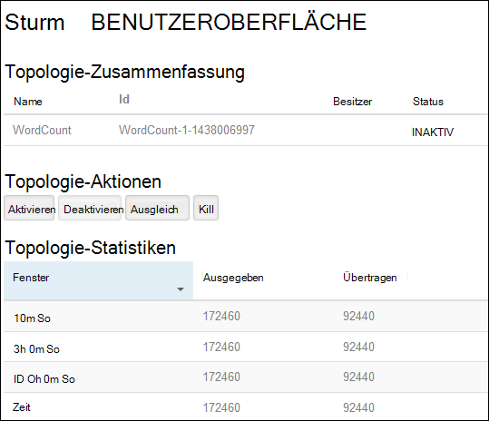
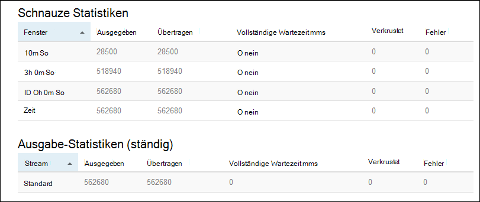

<properties
    pageTitle="Apache Storm-Lernprogramm: Erste Schritte auf HDInsight mit Linux-basierten | Microsoft Azure"
    description="Erste Schritte mit großen Datenanalyse mit Apache Storm Storm Starter-Beispiele auf Linux-basierten HDInsight. Informationen Sie zur Verwendung von Storm Daten in Echtzeit."
    keywords="Apache Storm Apache Storm Lernprogramm big Data Analytics, Sturm starter"
    services="hdinsight"
    documentationCenter=""
    authors="Blackmist"
    manager="jhubbard"
    editor="cgronlun"/>

<tags
   ms.service="hdinsight"
   ms.devlang="java"
   ms.topic="get-started-article"
   ms.tgt_pltfrm="na"
   ms.workload="big-data"
   ms.date="10/12/2016"
   ms.author="larryfr"/>

# Apache Storm-Lernprogramm: Erste Schritte mit Sturm Starter Beispiele für große Datenanalyse auf HDInsight

Apache Storm ist eine skalierbare, fehlertolerante verteilte, Echtzeit-Berechnung System für die Verarbeitung Datenströme. Mit auf Azure HDInsight können Sie einen cloudbasierte Storm-Cluster erstellen, der große Datenanalyse in Echtzeit durchführt.

> [AZURE.NOTE] In diesem Artikel erstellt einen Linux-basierte HDInsight-Cluster. Erstellen einen Windows-basierten Sturm auf HDInsight Cluster finden Sie unter [Apache Storm-Lernprogramm: Erste Schritte mit Sturm Starter Probe Datenanalyse auf HDInsight](hdinsight-apache-storm-tutorial-get-started.md)

## Erforderliche Komponenten

[AZURE.INCLUDE [delete-cluster-warning](../../includes/hdinsight-delete-cluster-warning.md)]

Sie müssen folgende Lernprogramms Apache Storm erfolgreich abgeschlossen:

- **Ein Azure-Abonnement**. Finden Sie [kostenlose Testversion von Azure zu erhalten](https://azure.microsoft.com/documentation/videos/get-azure-free-trial-for-testing-hadoop-in-hdinsight/).

- **Vertrautheit mit SSH und SCP**. Weitere Informationen zur Verwendung von SSH und SCP mit HDInsight finden Sie unter:

    - **Linux, Unix oder OS X Clients**: Siehe [Verwendet SSH mit Linux-basierten Hadoop auf HDInsight von Linux, OS X und Unix](hdinsight-hadoop-linux-use-ssh-unix.md)

    - **Windows-Clients**: Siehe [Verwendet SSH mit Linux-basierten Hadoop auf Windows HDInsight](hdinsight-hadoop-linux-use-ssh-windows.md)

### Steuerelement erforderlich

[AZURE.INCLUDE [access-control](../../includes/hdinsight-access-control-requirements.md)]

## Erstellen eines Clusters Sturm

In diesem Abschnitt erstellen Sie einen HDInsight Version 3.2 Cluster (Sturm Version 0.9.3) mit einer Azure-Ressourcen-Manager-Vorlage. Informationen zu Versionen von HDInsight und ihre SLAs anzeigen Sie [HDInsight Komponenten Versionen](hdinsight-component-versioning.md) Andere Cluster erstellen finden Sie unter [Erstellen HDInsight-Cluster](hdinsight-hadoop-provision-linux-clusters.md).

1. Klicken Sie zum Öffnen der Vorlage im Azure-Portal auf folgende.         

    
    
    Die Vorlage befindet sich in einem öffentlichen Blob-Container *https://hditutorialdata.blob.core.windows.net/armtemplates/create-linux-based-storm-cluster-in-hdinsight.json*. 
   
2. Blatt Parameter geben Sie Folgendes ein:

    - **ClusterName**: Geben Sie einen Namen für den Cluster Hadoop, die Sie erstellen.
    - **Cluster-Benutzername und Kennwort**: der Standard-Anmeldename ist Admin.
    - **SSH-Benutzernamen und ein Kennwort**.
    
    Bitte notieren Sie diese Werte.  Sie benötigen sie später im Lernprogramm.

    > [AZURE.NOTE] Remotezugriff über eine Befehlszeile HDInsight-Cluster wird SSH verwendet. Benutzername und Kennwort hier wird beim Verbinden mit dem Cluster über SSH verwendet. Die SSH-Benutzername muss eindeutig auch beim Erstellen eines Benutzerkontos auf allen Clusterknoten für HDInsight. Folgende sind einige Kontonamen vorbehalten Dienste im Cluster und nicht als Benutzername SSH verwendet werden:
    >
    > Stamm, Hdiuser, Sturm, Hbase, Ubuntu, Zookeeper, bietet, Garn, Mapred, Hbase, Struktur, Oozie, Falcon, Sqoop, Admin, Tez, Hcat, Hdinsight Zookeeper.

    > Weitere Informationen zur Verwendung von SSH mit HDInsight finden Sie in den folgenden Artikeln:

    > * [Verwenden Sie SSH mit Linux-basierten Hadoop auf HDInsight von Linux, Unix und Mac OS](hdinsight-hadoop-linux-use-ssh-unix.md)
    > * [Verwenden Sie SSH mit Linux-basierten Hadoop auf Windows HDInsight](hdinsight-hadoop-linux-use-ssh-windows.md)

    
3. Klicken Sie auf **OK** , um die Parameter zu speichern.

4. **benutzerdefinierte Bereitstellung** Blade auf **Ressourcengruppe** Dropdownfeld, und klicken Sie auf **neu** , um eine neue Ressourcengruppe erstellen. Die Ressourcengruppe ist ein Container, der Cluster abhängige Speicherkonto und andere verknüpfte Ressource gruppiert.

5. auf **rechtlich**und klicken Sie dann auf **Erstellen**.

6. Klicken Sie auf **Erstellen**. Sie sehen eine neue Tile Titel Submitting Bereitstellung Bereitstellung. Dauert es etwa 20 Minuten Cluster und SQL-Datenbank erstellen.

##Ein Beispiel Sturm Starter auf HDInsight ausführen

[Storm-Starter](https://github.com/apache/storm/tree/master/examples/storm-starter) -Beispiele sind in HDInsight Cluster enthalten. In den folgenden Schritten führen Sie WordCount-Beispiel.

1. Verbinden Sie mit HDInsight SSH:

        ssh USERNAME@CLUSTERNAME-ssh.azurehdinsight.net
        
    Wenn Sie ein Kennwort zum schützen Ihr Benutzerkonto SSH verwendet, werden Sie aufgefordert, eingeben. Wenn Sie einen öffentlichen Schlüssel verwendet, müssen Sie möglicherweise verwenden die `-i` Parameter, um den passenden privaten Schlüssel. Z. B. `ssh -i ~/.ssh/id_rsa USERNAME@CLUSTERNAME-ssh.azurehdinsight.net`.
        
    Weitere Informationen über SSH mit Linux-basierten HDInsight finden Sie in folgenden Artikeln:
    
    * [Verwenden Sie SSH mit Linux-basierten Hadoop auf HDInsight von Linux, Unix und Mac OS](hdinsight-hadoop-linux-use-ssh-unix.md)

    * [Verwenden Sie SSH mit Linux-basierten Hadoop auf Windows HDInsight](hdinsight-hadoop-linux-use-ssh-windows)

2. Verwenden Sie folgenden Befehl ein Beispieltopologie starten:

        storm jar /usr/hdp/current/storm-client/contrib/storm-starter/storm-starter-topologies-*.jar storm.starter.WordCountTopology wordcount
        
    > [AZURE.NOTE] Die `*` Teil des Dateinamens wird die Versionsnummer entsprechend geändert wird, während HDInsight aktualisiert wird.

    WordCount Beispieltopologie startet im Cluster mit dem angezeigten Namen "Wordcount". Es zufällig generiert Sätze und zählen der Vorkommen eines Worts Sätze.

    > [AZURE.NOTE] Bei Topologie des Clusters müssen Sie die JAR-Datei mit den Cluster vor Kopieren der `storm` Befehl. Dies erfolgt mit der `scp` Befehl vom Client, in dem die Datei vorhanden ist. Zum Beispiel`scp FILENAME.jar USERNAME@CLUSTERNAME-ssh.azurehdinsight.net:FILENAME.jar`
    >
    > WordCount-Beispiel und andere Sturm Starter Beispiele sind bereits auf Ihrem Cluster enthalten `/usr/hdp/current/storm-client/contrib/storm-starter/`.

##Überwachen der Topologie

Storm-Benutzeroberfläche bietet eine Web-Oberfläche für die Arbeit mit Topologien und auf HDInsight Cluster enthalten.

Gehen Sie mithilfe der Benutzeroberfläche Sturm Topologie überwachen:

1. Öffnen Sie einen Webbrowser, https://CLUSTERNAME.azurehdinsight.net/stormui, wobei __CLUSTERNAME__ der Name des Clusters ist. Storm-Benutzeroberfläche wird geöffnet.

    > [AZURE.NOTE] Wenn aufgefordert, einen Benutzernamen und ein Kennwort einzugeben, geben Sie den Cluster-Administrator (Admin) und Kennwort, das Sie verwendet, wenn des Clusters.

2. Wählen Sie unter **Zusammenfassung Topologie** **Wordcount** -Eintrag in der Spalte **Name** . Weitere Informationen zur Topologie erscheint.

    

    Diese Seite enthält die folgende Informationen:

    * **Topologie Statistiken** – grundlegende Informationen zur Topologie Performance organisiert in Zeitfenster.

        > [AZURE.NOTE] Auswählen einer bestimmten Zeitfenster ändert Zeitfenster für Informationen in anderen Abschnitten der Seite.

    * **Tüllen** – grundlegende Informationen zu Ausläufen, einschließlich des letzten Fehlers jedes Schnauze.

    * **Schrauben** - Basisinformationen Schrauben.

    * **Wizards** - detaillierte Informationen zur Topologiekonfiguration.

    Diese Seite enthält auch Topologie durchführbaren Aktionen:

    * **Aktivieren** - Lebensläufe Verarbeitung einer deaktivierten Topologie.

    * **Deaktivieren** – hält eine laufende Topologie.

    * **Neu** - passt die Parallelität der Topologie. Sie sollten ausgeführte Topologien ausgleichen, nachdem Sie die Anzahl der Knoten im Cluster geändert haben. Dadurch wird die Topologie Parallelität vergrößert/verkleinert Anzahl der Knoten im Cluster kompensieren anpassen. Weitere Informationen finden Sie unter [Understanding Parallelität Storm-Topologie](http://storm.apache.org/documentation/Understanding-the-parallelism-of-a-Storm-topology.html).

    * **Kill** - beendet Storm-Topologie angegebenen Timeout.

3. Wählen Sie auf dieser Seite einen Eintrag aus dem Abschnitt **Tüllen** oder **Schrauben** . Dies zeigt Informationen über die ausgewählte Komponente.

    

    Die folgende Informationen angezeigt:

    * **Auslauf-Schraube Stats** - grundlegende Informationen zur Performance Komponente organisiert in Zeitfenster.

        > [AZURE.NOTE] Auswählen einer bestimmten Zeitfenster ändert Zeitfenster für Informationen in anderen Abschnitten der Seite.

    * **Eingabe-Statistiken** (nur Bolzen) - Informationen zu Komponenten, die Daten der Bolzen verbraucht.

    * **Ausgabe-Statistik** - Informationen auf diese Schraube ausgegeben.

    * **Executors** - Informationen zu Instanzen der Komponente.

    * **Fehler** - Fehlern, die von dieser Komponente.

4. Anzeigen von Einzelheiten einer Schnauze oder Bolzen einen Eintrag aus der Spalte **Port** im Abschnitt **Executors** Details für eine bestimmte Instanz der Komponente an.

        2015-01-27 14:18:02 b.s.d.task [INFO] Emitting: split default ["with"]
        2015-01-27 14:18:02 b.s.d.task [INFO] Emitting: split default ["nature"]
        2015-01-27 14:18:02 b.s.d.executor [INFO] Processing received message source: split:21, stream: default, id: {}, [snow]
        2015-01-27 14:18:02 b.s.d.task [INFO] Emitting: count default [snow, 747293]
        2015-01-27 14:18:02 b.s.d.executor [INFO] Processing received message source: split:21, stream: default, id: {}, [white]
        2015-01-27 14:18:02 b.s.d.task [INFO] Emitting: count default [white, 747293]
        2015-01-27 14:18:02 b.s.d.executor [INFO] Processing received message source: split:21, stream: default, id: {}, [seven]
        2015-01-27 14:18:02 b.s.d.task [INFO] Emitting: count default [seven, 1493957]

    Anhand dieser Daten finden Sie unter dem Wort **sieben** 1493957 Mal aufgetreten. Das ist wie oft es seit dieser Topologie aufgetreten.

##Beenden der Topologie

Kehren Sie zur Seite **Zusammenfassung Topologie** für die Topologie Wörter zählen, und wählen Sie die Schaltfläche **Abbrechen** im Aktionsbereich **Topologie** . Geben Sie bei Aufforderung 10 Sekunden warten, bevor der Topologie beenden. Nachdem das Zeitlimit wird die Topologie beim Besuch Abschnitt **Storm-Benutzeroberfläche** des Dashboards nicht mehr angezeigt.

##Cluster löschen

[AZURE.INCLUDE [delete-cluster-warning](../../includes/hdinsight-delete-cluster-warning.md)]

##Nächste Schritte

In diesem Lernprogramm Apache Storm verwendet Sie Sturm Starter lernen zu erstellen eines Sturms HDInsight Cluster Storm-Dashboard bereitstellen, überwachen und Verwalten von Storm Topologien. Als Nächstes erfahren Sie, wie [entwickeln Java-basierte Topologien mit Maven](hdinsight-storm-develop-java-topology.md).

Wenn Sie bereits mit Java-basierten Topologien Entwicklung HDInsight eine bestehende Topologie Bereitstellung vertraut sind, finden Sie unter [Bereitstellen und Verwalten von Apache Storm Topologien auf HDInsight](hdinsight-storm-deploy-monitor-topology-linux.md).

Wenn .NET Entwickler sind, können C# oder hybride C# / Java-Topologien mit Visual Studio. Weitere Informationen finden Sie unter [Entwickeln von C# Topologien für Apache Storm auf HDInsight mit Hadoop Tools für Visual Studio](hdinsight-storm-develop-csharp-visual-studio-topology.md).

Beispielsweise Siehe Topologien mit auf HDInsight, die folgenden Beispiele:

    * [Topologien für auf HDInsight](hdinsight-storm-example-topology.md)

[apachestorm]: https://storm.incubator.apache.org
[stormdocs]: http://storm.incubator.apache.org/documentation/Documentation.html
[stormstarter]: https://github.com/apache/storm/tree/master/examples/storm-starter
[stormjavadocs]: https://storm.incubator.apache.org/apidocs/
[azureportal]: https://manage.windowsazure.com/
[hdinsight-provision]: hdinsight-provision-clusters.md
[preview-portal]: https://portal.azure.com/
