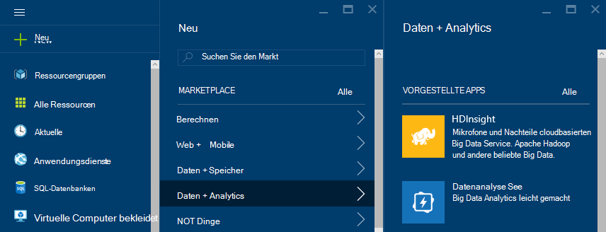
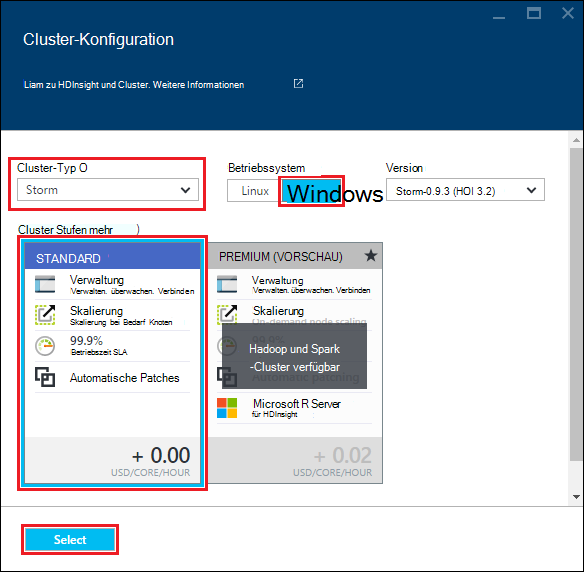
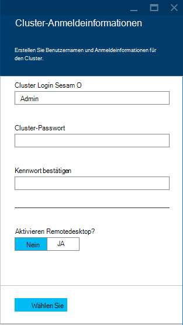
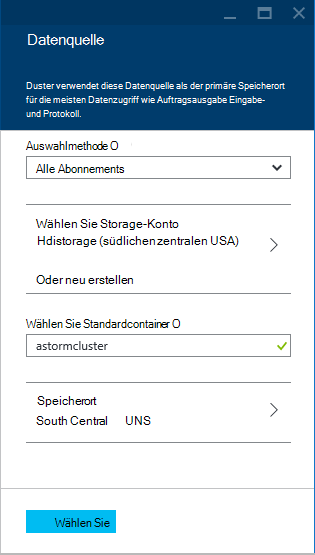
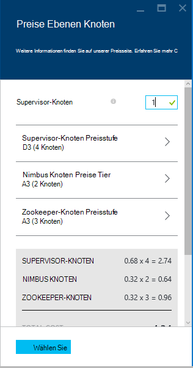
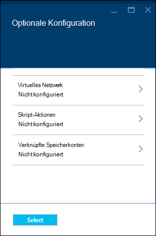
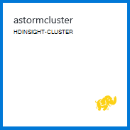

<properties
    pageTitle="Apache Storm-Lernprogramm: Erste Schritte mit | Microsoft Azure"
    description="Erste Schritte mit großen Datenanalyse mit Apache Storm Storm Starter Beispiele für HDInsight. Informationen Sie zur Verwendung von Storm Daten in Echtzeit."
    keywords="Apache Storm Apache Storm Lernprogramm big Data Analytics, Sturm starter"
    services="hdinsight"
    documentationCenter=""
    authors="Blackmist"
    manager="jhubbard"
    editor="cgronlun"
    tags="azure-portal"/>

<tags
   ms.service="hdinsight"
   ms.devlang="java"
   ms.topic="article"
   ms.tgt_pltfrm="na"
   ms.workload="big-data"
   ms.date="09/07/2016"
   ms.author="larryfr"/>

# Apache Storm-Lernprogramm: Erste Schritte mit Sturm Starter Beispiele für große Datenanalyse auf HDInsight

Apache Storm ist eine skalierbare, fehlertolerante verteilte, Echtzeit-Berechnung System für die Verarbeitung Datenströme. Mit auf Microsoft Azure HDInsight können Sie einen cloudbasierte Storm-Cluster erstellen, der große Datenanalyse in Echtzeit durchführt. 

> [AZURE.NOTE] In diesem Artikel erstellt einen Windows-basierte HDInsight-Cluster. Schritte zum Erstellen eines Sturms Linux-basierten HDInsight Cluster finden Sie [Apache Storm-Lernprogramm: Erste Schritte mit Sturm Starter Probe Datenanalyse auf HDInsight](hdinsight-apache-storm-tutorial-get-started-linux.md)

## Erforderliche Komponenten

[AZURE.INCLUDE [delete-cluster-warning](../../includes/hdinsight-delete-cluster-warning.md)]

Sie müssen folgende Lernprogramms Apache Storm erfolgreich abgeschlossen:

- **Ein Azure-Abonnement**. Finden Sie [kostenlose Testversion von Azure zu erhalten](https://azure.microsoft.com/documentation/videos/get-azure-free-trial-for-testing-hadoop-in-hdinsight/).

### Steuerelement erforderlich

[AZURE.INCLUDE [access-control](../../includes/hdinsight-access-control-requirements.md)]

## Erstellen eines Clusters Sturm

Auf HDInsight verwendet Azure BLOB-Speicher zum Speichern von Protokolldateien und Topologien an den Cluster gesendet. Gehen Sie folgendermaßen vor, ein Konto Azure-Speicher für die Verwendung mit Ihrem Cluster erstellen:

1. [Azure-Portal]anmelden[preview-portal].

2. Wählen Sie **neu**, wählen Sie __Datenanalyse__und dann __HDInsight__.

    

3. Geben Sie einen __Clusternamen__. Ein grünes Häkchen neben den __Clusternamen__ , falls verfügbar.

4. Haben mehrere Abonnements wählen Sie __den Abonnementeintrag Azure-Abonnement auswählen, das für den Cluster verwendet werden__ .

5.  __Clustertyp auswählen__ __Storm__ -Cluster auswählen. Wählen Sie für das __Betriebssystem__Windows. Wählen Sie STANDARD für __Cluster-Ebene__. Schließlich Schaltfläche wählen, um diese Einstellung zu speichern.

    

5. __Ressourcengruppe__können Sie uns die Dropdownliste eine Liste der verfügbaren Ressourcengruppen und dann auswählen, der der Cluster erstellt. Oder wählen Sie __neu__ und geben Sie den Namen der neuen Ressource. Ein grünes Häkchen angezeigt, falls der neuen Gruppennamen verfügbar ist.

6. Wählen Sie __Berechtigungen__aus, und geben Sie eine __Cluster-Benutzernamen__ und das __Passwort Cluster__. Verwenden Sie schließlich __Wählen__ Festlegen der Anmeldeinformationen. Remotedesktop werden nicht in diesem Dokument verwendet, Sie es deaktiviert lassen.

    

6. __Datenquelle__können wählen eine vorhandene Datenquelle auswählen oder eine neue erstellen.

    

    Derzeit können Sie als Datenquelle für einen HDInsight-Cluster ein Azure Storage-Konto auswählen. Anhand der folgenden um Einträge auf die __Datenquelle__ zu verstehen.

    - __Methode__: Legen Sie __alle Abonnements__ aktivieren Speicherkonten Abonnements zu durchsuchen. Setzen Sie auf __Access__ __Storage Namen__ und __Zugriffstaste__ ein Storage-Konto eingeben soll.

    - __Neu erstellen__: ein neues Speicherkonto erstellen können. Verwenden Sie das Feld zur Eingabe des Namens des Speicherkontos. Ein grünes Häkchen wird angezeigt, wenn der Name verfügbar ist.

    - __Standardcontainer auswählen__: Eingeben der Standardcontainer für den Cluster verwenden können. Während Sie einen beliebigen Namen eingeben können, wird empfohlen, mit demselben Namen wie des Clusters, damit Sie erkennen können, dass der Container für diesen bestimmten Cluster verwendet wird.

    - __Standort__: die geografische Region Storage-Konto wird oder erstellt wird.

        > [AZURE.IMPORTANT] Den Standort für die Standarddatenquelle setzt auch den Standort der HDInsight-Cluster. Die Cluster und Standard-Datenquelle muss im selben Bereich befinden.

    - __Auswählen__: die Datenquellenkonfiguration speichern können.

7. Wählen Sie __Knoten Preise Ebenen__ Informationen zu Knoten anzeigen, die für diesen Cluster erstellt werden. Standardmäßig ist die Anzahl der workerknoten __4__festgelegt. Legen Sie den __1__reicht für dieses Lernprogramm und reduziert die Kosten des Clusters. Die geschätzte Kosten des Clusters wird am Ende dieses angezeigt.

    

    Verwenden Sie __Knoten Preise Ebenen__ Informationen speichern __Wählen__ .

8. __Optionale Konfiguration__auswählen Dieses Blatt können Sie wählen die Clusterversion sowie andere optionale wie ein __Virtuelles Netzwerk__konfigurieren.

    

9. Sicherstellen Sie, dass __an Startmenü anheften__ ausgewählt ist, und wählen Sie dann __Erstellen__. Diese Cluster erstellt und Startmenü Azure-Portal eine Kachel für sie hinzugefügt. Das Symbol gibt an, dass der Cluster bereitstellen angezeigt HDInsight Symbol einmal Bereitstellung wurde abgeschlossen.

  	| Bei der Bereitstellung | Bereitstellung abgeschlossen |
  	| ------------------ | --------------------- |
  	|  |  |

    > [AZURE.NOTE] Es dauert einige Zeit für den Cluster, normalerweise ca. 15 Minuten erstellt werden. Verwenden der Kachel auf das Startmenü oder den Eintrag __Benachrichtigungen__ auf der linken Seite, um den Bereitstellungsprozess zu überprüfen.

## Ein Beispiel Sturm Starter auf HDInsight ausführen

In diesem Lernprogramm Apache Storm werden big Data Analytics Stichproben Sturm Starter auf GitHub.

Jeder Sturm HDInsight Cluster enthält Dashboard Sturm zum Hochladen und Sturm Topologien im Cluster ausführen. Jeder Cluster enthält auch Beispieltopologien, die direkt aus dem Dashboard Sturm ausgeführt werden können.

### Verbindung zum dashboard

Das Schaltpult wird am **https://&lt;Clustername >.azurehdinsight.net//**, wobei **Clustername** den Namen des Clusters. Eine Verknüpfung zum Dashboard finden Cluster das Startmenü und __Dashboard__ Verknüpfung oben das Blade.

> [AZURE.NOTE] Beim Verbinden mit dem Dashboard werden Sie aufgefordert, einen Benutzernamen und ein Kennwort einzugeben. Dies ist der Namen (**Admin**) und das Kennwort beim Erstellen des Clusters verwendet.

Storm-Dashboard geladen wurde, sehen Sie das Formular **Absenden Topologie** .

Formular **Absenden Topologie** kann verwendet werden, auszuführen JAR-Dateien, die Sturm Topologien enthalten. Darüber hinaus mehrere grundlegende Beispiele, die mit dem Cluster bereitgestellt werden.

### Führen Sie das Beispiel Wörter zählen vom Sturm Startprojekt in GitHub

Mit dem bereitgestellten Beispiele enthalten verschiedene Schriftschnitte einer Topologie Word zählen. Die Beispiele enthalten ein **Auslauf** , die zufällig ausgibt, Sätze und **Schrauben** , die teilen jedem Satz in einzelne Wörter zählen, wie oft jedes Wort aufgetreten ist. Diese Beispiele sind [Beispiele Sturm Starter](https://github.com/apache/storm/tree/master/examples/storm-starter)Teil des Apache Storm.

Die folgenden Schritte Sturm Starter Beispiel auszuführen:

1. Wählen Sie **StormStarter - WordCount** Dropdown **-JAR-Datei** . Dieses füllt die Felder **Klassenname** und **Zusätzliche Parameter** mit den Parametern für dieses Beispiel.

    

    * **Klassennamen** - Klasse in der JAR-Datei, die die Topologie übermittelt.
    * **Zusätzliche Parameter** - Topologie erforderlichen Parameter. In diesem Beispiel dient das Feld einen Anzeigenamen für die übermittelte Topologie bereitstellen.

2. Klicken Sie auf **Senden**. Nach einem Augenblick zeigt **Feld** Befehl verwendet, um das Projekt sowie die Ergebnisse des Befehls. **Feld** zeigt alle auftretenden Fehler an der Topologie.

    

    > [AZURE.NOTE] Die Ergebnisse bedeuten nicht, dass die Topologie hat - **ein Sturm Topologie gestartet, läuft bis IT beenden** Wörter zählen Topologie generiert zufällige Sätze und zählt wie oft sie jedes Wort stößt, bis Sie sie anhalten.

### Überwachen der Topologie

Storm-Benutzeroberfläche lässt sich die Topologie überwachen.

1. Wählen Sie oben Storm-Dashboard **Storm-Benutzeroberfläche** . Dies zeigt zusammenfassende Informationen über Cluster und alle laufenden Topologien.

    

    Auf der Seite sehen Sie Mal, das aktiv die Topologie, sowie die Anzahl der Arbeitskräfte, Executors und Aufgaben verwendet werden.

    > [AZURE.NOTE] Die Spalte **Name** enthält den Anzeigenamen, die zuvor über das Feld **Zusätzliche Parameter** angegeben.

4. Wählen Sie unter **Zusammenfassung Topologie** **Wordcount** -Eintrag in der Spalte **Name** . Weitere Informationen zur Topologie angezeigt.

    

    Diese Seite enthält die folgende Informationen:

    * **Topologie Statistiken** – grundlegende Informationen zur Topologie Performance organisiert in Zeitfenster.

        > [AZURE.NOTE] Auswählen einer bestimmten Zeitfenster ändert Zeitfenster für Informationen in anderen Abschnitten der Seite.

    * **Tüllen** – grundlegende Informationen zu Ausläufen, einschließlich des letzten Fehlers jedes Schnauze.

    * **Schrauben** - Basisinformationen Schrauben.

    * **Wizards** - detaillierte Informationen zur Topologiekonfiguration.

    Diese Seite enthält auch Topologie durchführbaren Aktionen:

    * **Aktivieren** - Lebensläufe Verarbeitung einer deaktivierten Topologie.

    * **Deaktivieren** – hält eine laufende Topologie.

    * **Neu** - passt die Parallelität der Topologie. Sie sollten ausgeführte Topologien ausgleichen, nachdem Sie die Anzahl der Knoten im Cluster geändert haben. Dadurch wird die Topologie Parallelität vergrößert/verkleinert Anzahl der Knoten im Cluster kompensieren anpassen. Weitere Informationen finden Sie unter [Understanding Parallelität Storm-Topologie](http://storm.apache.org/documentation/Understanding-the-parallelism-of-a-Storm-topology.html).

    * **Kill** - beendet Storm-Topologie angegebenen Timeout.

5. Wählen Sie auf dieser Seite einen Eintrag aus dem Abschnitt **Tüllen** oder **Schrauben** . Dies zeigt Informationen über die ausgewählte Komponente.

    

    Die folgende Informationen angezeigt:

    * **Auslauf-Schraube Stats** - grundlegende Informationen zur Performance Komponente organisiert in Zeitfenster.

        > [AZURE.NOTE] Auswählen einer bestimmten Zeitfenster ändert Zeitfenster für Informationen in anderen Abschnitten der Seite.

    * **Eingabe-Statistiken** (nur Bolzen) - Informationen zu Komponenten, die Daten der Bolzen verbraucht.

    * **Ausgabe-Statistik** - Informationen auf diese Schraube ausgegeben.

    * **Executors** - Informationen zu Instanzen der Komponente.

    * **Fehler** - Fehlern, die von dieser Komponente.

5. Anzeigen von Einzelheiten einer Schnauze oder Bolzen einen Eintrag aus der Spalte **Port** im Abschnitt **Executors** Details für eine bestimmte Instanz der Komponente an.

        2015-01-27 14:18:02 b.s.d.task [INFO] Emitting: split default ["with"]
        2015-01-27 14:18:02 b.s.d.task [INFO] Emitting: split default ["nature"]
        2015-01-27 14:18:02 b.s.d.executor [INFO] Processing received message source: split:21, stream: default, id: {}, [snow]
        2015-01-27 14:18:02 b.s.d.task [INFO] Emitting: count default [snow, 747293]
        2015-01-27 14:18:02 b.s.d.executor [INFO] Processing received message source: split:21, stream: default, id: {}, [white]
        2015-01-27 14:18:02 b.s.d.task [INFO] Emitting: count default [white, 747293]
        2015-01-27 14:18:02 b.s.d.executor [INFO] Processing received message source: split:21, stream: default, id: {}, [seven]
        2015-01-27 14:18:02 b.s.d.task [INFO] Emitting: count default [seven, 1493957]

    Anhand dieser Daten finden Sie unter dem Wort **sieben** 1.493.957 Mal aufgetreten. Das ist wie oft es seit dieser Topologie aufgetreten.

### Beenden der Topologie

Kehren Sie zur Seite **Zusammenfassung Topologie** für Word Count-Topologie und wählen im Aktionsbereich **Topologie** **Töten** . Geben Sie bei Aufforderung 10 Sekunden warten, bevor der Topologie beenden. Nachdem das Zeitlimit wird die Topologie nicht mehr besuchen Abschnitt **Storm-Benutzeroberfläche** des Dashboards.

##Cluster löschen

[AZURE.INCLUDE [delete-cluster-warning](../../includes/hdinsight-delete-cluster-warning.md)]

## Zusammenfassung

In diesem Lernprogramm Apache Storm verwendet Sie Sturm Starter lernen zu erstellen eines Sturms HDInsight Cluster Storm-Dashboard bereitstellen, überwachen und Verwalten von Storm Topologien.

## Nächste Schritte

* **HDInsight-Tools für Visual Studio** - Tools für HDInsight können Sie mit Visual Studio einreichen, überwachen und Verwalten von Storm Topologien ähnlich erwähnte Storm-Dashboard. HDInsight Tools ermöglicht das Erstellen von C# Sturm Topologien auch Beispieltopologien, die Sie bereitstellen und Ausführen des Clusters enthält.

    Weitere Informationen finden Sie unter [Erste Schritte mit HDInsight Tools for Visual Studio](hdinsight-hadoop-visual-studio-tools-get-started.md).

* **Beispieldateien** - die HDInsight Storm-Cluster stellt mehrere Beispiele im Verzeichnis **%STORM_HOME%\contrib** . Jedes Beispiel enthält:

    * Quellcode - z. B. Sturm-Starter-0.9.1.2.1.5.0-2057-sources.jar

    * Die Java Docs - z. B. Sturm-Starter-0.9.1.2.1.5.0-2057-javadoc.jar

    * Beispiel - beispielsweise storm-starter-0.9.1.2.1.5.0-2057-jar-with-dependencies.jar

    Befehl "Glas" Quellcode oder Java Dokumenten extrahieren. Z. B. "Glas - Xvf Storm-Starter-0.9.1.2.1.5.0.2057-Javadoc.jar".

    > [AZURE.NOTE] Java-Dokumente bestehen aus Webseiten. Sobald extrahiert, verwenden Sie einen Browser zum Anzeigen der Datei **index.html** .

    Zugriff auf diese Beispiele müssen Remotedesktop für auf HDInsight Cluster aktivieren und kopieren Sie die Dateien aus **%STORM_HOME%\contrib**.

* Das folgende Dokument enthält eine Liste anderer Beispiele auf HDInsight verwendet werden kann:

    * [Topologien für auf HDInsight](hdinsight-storm-example-topology.md)

[apachestorm]: https://storm.incubator.apache.org
[stormdocs]: http://storm.incubator.apache.org/documentation/Documentation.html
[stormstarter]: https://github.com/apache/storm/tree/master/examples/storm-starter
[stormjavadocs]: https://storm.incubator.apache.org/apidocs/
[azureportal]: https://manage.windowsazure.com/
[hdinsight-provision]: hdinsight-provision-clusters.md
[preview-portal]: https://portal.azure.com/
