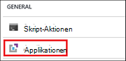
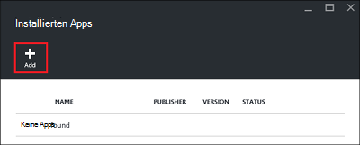
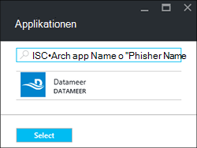

<properties
    pageTitle="Installieren Sie Hadoop Anträge auf HDInsight | Microsoft Azure"
    description="Informationen Sie zum HDInsight für HDInsight-Anwendung installieren."
    services="hdinsight"
    documentationCenter=""
    authors="mumian"
    manager="jhubbard"
    editor="cgronlun"
    tags="azure-portal"/>

<tags
    ms.service="hdinsight"
    ms.devlang="na"
    ms.topic="hero-article"
    ms.tgt_pltfrm="na"
    ms.workload="big-data"
    ms.date="09/14/2016"
    ms.author="jgao"/>

# HDInsight Anwendung installieren

Eine HDInsight-Anwendung ist eine Anwendung, die Benutzer auf einem Linux-basierten HDInsight-Cluster installieren können. Diese Programme können von Microsoft, unabhängige Softwareanbieter (ISV) oder selbst entwickelt werden. In diesem Artikel erfahren Sie, wie Sie eine veröffentlichte Anwendung installieren. Eigene Installation finden Sie unter [benutzerdefinierte HDInsight Anwendung zu installieren](hdinsight-apps-install-custom-applications.md). 

Derzeit ist eine veröffentlichte Anwendung:

- **Datameer**: [Datameer](http://www.datameer.com/documentation/display/DAS50/Home?ls=Partners&lsd=Microsoft&c=Partners&cd=Microsoft) bietet Analysten interaktiv entdecken, analysieren und Darstellen der Ergebnisse auf Big Data. Ziehen Sie weitere Datenquellen einfach zu entdecken neuen schnelle Antworten.

>[AZURE.NOTE] Datameer ist derzeit nur in Azure HDInsight Version 3.2 Cluster unterstützt.

Die Anleitung in diesem Artikel verwenden Azure-Portal. Sie können auch Vorlage Azure-Ressourcen-Manager über das Portal exportieren oder erhalten eine Kopie der Vorlage Ressourcenmanager Hersteller und Azure PowerShell und Azure CLI Vorlage bereitstellen verwenden.  [Hadoop erstellen Linux-basierten Clustern in HDInsight Ressourcenmanager Vorlagen](hdinsight-hadoop-create-linux-clusters-arm-templates.md)anzeigen

## Erforderliche Komponenten

Wenn Sie in einem bestehenden Cluster HDInsight HDInsight installieren möchten, müssen Sie einen HDInsight-Cluster. Um eine zu erstellen, finden Sie unter [Cluster erstellen](hdinsight-hadoop-linux-tutorial-get-started.md#create-cluster). HDInsight Programme können auch installieren, wenn Sie einen HDInsight-Cluster erstellen.

## Anwendung vorhandener Cluster installieren

Das folgende Verfahren veranschaulicht die HDInsight zu einem vorhandenen HDInsight-Cluster installieren.

**Zum Installieren einer Anwendung HDInsight**

1. Mit der [Azure-Portal](https://portal.azure.com)anmelden.
2. Klicken Sie im linken Menü auf **HDInsight-Cluster** .  Wenn es nicht angezeigt wird, klicken Sie auf **Durchsuchen**und dann auf **HDInsight-Cluster**.
3. Klicken Sie auf einen HDInsight-Cluster.  Wenn Sie haben, legen Sie einen ersten.  finden Sie unter [Cluster erstellen](hdinsight-hadoop-linux-tutorial-get-started.md#create-cluster).
4. Blatt **Einstellungen** klicken Sie auf **Applikationen** unter der Kategorie **Allgemein** . Das Blade **Installiert Apps** Listet alle installierten Programme. 

    

5. Blade-Menü klicken Sie auf **Hinzufügen** . 

    

    Sie finden eine Liste der vorhandenen HDInsight Anwendung Sie.

    

6. Klicken Sie auf eines der akzeptieren Sie die Vertragsbedingungen, und klicken Sie auf **auswählen**.

Den Installationsstatus von Portal Benachrichtigungen angezeigt (klicken Sie auf das Glockensymbol auf das Portal). Nach der Installation der Anwendungdes wird die Anwendung auf den installierten Apps angezeigt.

## Installieren von Clientanwendungen bei der Clustererstellung

Sie können HDInsight Programme installieren, wenn Sie einen Cluster erstellen. Dabei sind HDInsight Anwendung installiert, nachdem Cluster erstellt und ausgeführt wird. Das folgende Verfahren veranschaulicht die HDInsight installieren, wenn Sie einen Cluster erstellen.

**Zum Installieren einer Anwendung HDInsight**

1. Mit der [Azure-Portal](https://portal.azure.com)anmelden.
2. Klicken Sie auf **neu**und klicken Sie dann auf **HDInsight**auf **Daten + Analytics**.
3. Geben Sie **Cluster**: dieser Name muss eindeutig sein.
4. Klicken Sie auf **Abonnement** Azure-Abonnement aktivieren, das für den Cluster verwendet werden.
5. Klicken Sie auf **Cluster Typ auswählen**und dann:

    - **Clustertyp**: Sie möchten wissen, wählen Sie **Hadoop**. Es ist der am häufigsten verwendeten Cluster.
    - **Betriebssystem**: **Linux**wählen.
    - **Version**: die Standardversion verwenden, wenn Sie weiß auswählen. Weitere Informationen finden Sie unter [HDInsight Cluster Versionen](hdinsight-component-versioning.md).
    - **Cluster-Tier**: Azure HDInsight bietet Cloudlösungen Datenverlustvorfalls in zwei Kategorien: Standard Ebene und Premium-Ebene. Weitere Informationen finden Sie unter [Cluster Ebenen](hdinsight-hadoop-provision-linux-clusters.md#cluster-tiers).
6. Klicken Sie auf **Programme**, klicken Sie auf eine veröffentlichte Anwendung und klicken Sie auf **auswählen**.
6. Klicken Sie auf **Anmeldeinformationen** , und geben Sie ein Kennwort für den Administrator. Außerdem geben Sie einen **SSH-Benutzernamen** und ein **Kennwort** oder **Öffentlichen Schlüssel**, die SSH-Benutzerauthentifizierung verwendet wird. Es wird empfohlen, einen öffentlichen Schlüssel. Klicken Sie unten, um die Anmeldeinformationen speichern **Wählen** .
8. Klicken Sie auf **Datenquelle**, wählen Sie einen vorhandenen Speicherkonto oder erstellen ein neues Storage-Konto als Standardkonto Speicher für den Cluster verwendet werden.
9. Klicken Sie auf **Gruppe** wählen Sie eine vorhandene Ressourcengruppe oder klicken Sie auf **neu** , um eine neue Ressourcengruppe erstellen

10. Blade **HDInsight-Cluster neue** sicherzustellen Sie, dass **an Startmenü anheften** ausgewählt ist, und klicken Sie dann auf **Erstellen**. 

## Auflisten der installierten HDInsight apps und Eigenschaften

Das Portal zeigt eine Liste der installierten HDInsight Programme für einen Cluster und die Eigenschaften jedes installierte Anwendung.

**HDInsight Anwendung und Eigenschaften anzeigen**

1. Mit der [Azure-Portal](https://portal.azure.com)anmelden.
2. Klicken Sie im linken Menü auf **HDInsight-Cluster** .  Wenn es nicht angezeigt wird, klicken Sie auf **Durchsuchen**und dann auf **HDInsight-Cluster**.
3. Klicken Sie auf einen HDInsight-Cluster.
4. Blatt **Einstellungen** klicken Sie auf **Applikationen** unter der Kategorie **Allgemein** . Das Blade installiert Apps Listet alle installierten Programme. 

    

5. Klicken Sie auf eines der installierten um die Eigenschaft anzuzeigen. Der Eigenschaftenliste Blade:

    - Anw.-Name: Name der Anwendung.
    - Status: Anwendungsstatus. 
    - Webseite: Die URL der Website, die auf den edgeknoten bereitgestellt haben, ist eine. Die Anmeldeinformationen entspricht dem HTTP-Anmeldeinformationen, die Sie für den Cluster konfiguriert haben.
    - HTTP-Endpunkt: Anmeldeinformationen entspricht dem HTTP-Anmeldeinformationen, die Sie für den Cluster konfiguriert haben. 
    - SSH-Endpunkt: können Sie [SSH](hdinsight-hadoop-linux-use-ssh-unix.md) Rand Knoten herstellen. Die SSH-Anmeldeinformationen entsprechen die SSH-Anmeldeinformationen, die Sie für den Cluster konfiguriert haben.

6. Löschen einer Anwendung, mit der rechten Maustaste der Anwendungdes und klicken Sie dann im Kontextmenü auf **Löschen** .

## Verbinden Sie mit der edgeknoten

Sie können mithilfe von HTTP und SSH Kantenknoten verbinden. Die Endpunktinformationen kann über das [Portal](#list-installed-hdinsight-apps-and-properties)gefunden werden. Weitere Informationen über SSH finden Sie unter [Verwenden SSH mit Linux-basierten Hadoop auf HDInsight von Linux, Unix oder OS X](hdinsight-hadoop-linux-use-ssh-unix.md). 

HTTP-Endpunkt Anmeldeinformationen sind HTTP-Anmeldeinformationen, die für den HDInsight-Cluster konfiguriert haben. die SSH-Endpunkt Anmeldeinformationen sind SSH-Anmeldeinformationen, die für den HDInsight-Cluster konfiguriert haben.

## Problembehandlung bei

Finden Sie unter [Problembehandlung bei der Installation](hdinsight-apps-install-custom-applications.md#troubleshoot-the-installation).

## Nächste Schritte

- [Benutzerdefinierte HDInsight Anwendung installieren](hdinsight-apps-install-custom-applications.md): erfahren Sie, wie eine nicht veröffentlichte Anwendung HDInsight HDInsight bereitstellen.
- [HDInsight veröffentlichen Applications](hdinsight-apps-publish-applications.md): erfahren Sie, wie Ihre benutzerdefinierte Anwendung HDInsight Azure Marketplace veröffentlichen.
- [MSDN: Installieren einer Anwendung HDInsight](https://msdn.microsoft.com/library/mt706515.aspx): Informationen zum HDInsight Anwendung definieren.
- [Anpassen von Linux-basierten HDInsight Cluster mit Skriptaktion](hdinsight-hadoop-customize-cluster-linux.md): Informationen zum Skript-Aktion verwenden, um zusätzliche Applikationen zu installieren.
- [Hadoop erstellen Linux-basierten Clustern in HDInsight Ressourcenmanager Vorlagen](hdinsight-hadoop-create-linux-clusters-arm-templates.md): erfahren Sie, wie Vorlagen erstellen HDInsight-Cluster Resource Manager aufrufen.
- [Verwenden Sie leere Rand Nodes in HDInsight](hdinsight-apps-use-edge-node.md): erfahren Sie, wie einen leere Kantenknoten HDInsight Cluster zugreifen und Anwendungstests HDInsight HDInsight Anwendung hosten.

