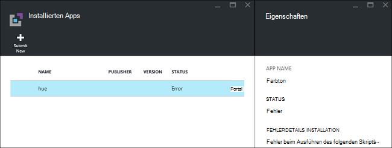
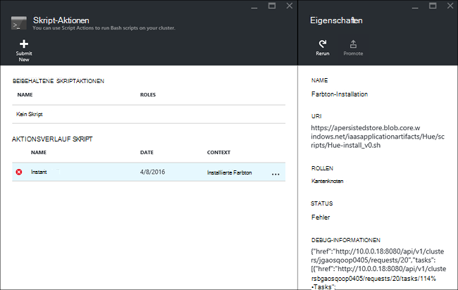

<properties
    pageTitle="Installieren Sie Hadoop Anträge auf HDInsight | Microsoft Azure"
    description="Informationen Sie zum HDInsight für HDInsight-Anwendung installieren."
    services="hdinsight"
    documentationCenter=""
    authors="mumian"
    manager="jhubbard"
    editor="cgronlun"
    tags="azure-portal"/>

<tags
    ms.service="hdinsight"
    ms.devlang="na"
    ms.topic="hero-article"
    ms.tgt_pltfrm="na"
    ms.workload="big-data"
    ms.date="09/14/2016"
    ms.author="jgao"/>

# Installieren von benutzerdefinierten Programmen HDInsight

Eine HDInsight-Anwendung ist eine Anwendung, die Benutzer auf einem Linux-basierten HDInsight-Cluster installieren können.  Diese Programme können von Microsoft, unabhängige Softwareanbieter (ISV) oder selbst entwickelt werden. In diesem Artikel erfahren Sie, wie HDInsight Anwendung installiert, die nicht zum Azure-Portal auf HDInsight veröffentlicht wurde. Die zu installierende Anwendung ist [Farbton](http://gethue.com/). 

Andere verwandte Artikel:

- [Installieren HDInsight Applikationen](hdinsight-apps-install-applications.md): erfahren Sie, wie eine Anwendung HDInsight Cluster installieren.
- [HDInsight veröffentlichen Applications](hdinsight-apps-publish-applications.md): erfahren Sie, wie Ihre benutzerdefinierte Anwendung HDInsight Azure Marketplace veröffentlichen.
- [MSDN: Installieren einer Anwendung HDInsight](https://msdn.microsoft.com/library/mt706515.aspx): Informationen zum HDInsight Anwendung definieren.

 
## Erforderliche Komponenten

Wenn Sie in einem bestehenden Cluster HDInsight HDInsight installieren möchten, müssen Sie einen HDInsight-Cluster. Um eine zu erstellen, finden Sie unter [Cluster erstellen](hdinsight-hadoop-linux-tutorial-get-started.md#create-cluster). HDInsight Programme können auch installieren, wenn Sie einen HDInsight-Cluster erstellen.

## HDInsight Anwendung installieren

HDInsight Anwendung können installiert werden, wenn Sie einen Cluster erstellen oder einem vorhandenen Cluster HDInsight. Azure-Ressourcen-Manager Vorlagen definieren, finden Sie unter [MSDN: Installieren einer Anwendung HDInsight](https://msdn.microsoft.com/library/mt706515.aspx).

Die Dateien für die Bereitstellung dieser Anwendung (Farbton) erforderlich:

- [azuredeploy.JSON](https://github.com/hdinsight/Iaas-Applications/blob/master/Hue/azuredeploy.json): der Ressourcen-Manager-Vorlage für HDInsight Installation. Siehe [MSDN: Installieren einer Anwendung HDInsight](https://msdn.microsoft.com/library/mt706515.aspx) für die Entwicklung Ihrer eigenen Ressourcen-Manager-Vorlage.
- [Farbton-install_v0.sh](https://github.com/hdinsight/Iaas-Applications/blob/master/Hue/scripts/Hue-install_v0.sh): die Skriptaktion Ressourcenmanager Vorlage zum Konfigurieren der Kantenknoten aufgerufen wird. 
- [Farbton-binaries.tgz](https://hdiconfigactions.blob.core.windows.net/linuxhueconfigactionv01/hue-binaries-14-04.tgz): die Binärdatei Farbton aus den Hinweis auf ein install_v0.sh aufgerufen wird. 
- [Farbton-Binärdateien-14-04.tgz](https://hdiconfigactions.blob.core.windows.net/linuxhueconfigactionv01/hue-binaries-14-04.tgz): die Binärdatei Farbton aus den Hinweis auf ein install_v0.sh aufgerufen wird. 
- [Webwasb tomcat.tar.gz](https://hdiconfigactions.blob.core.windows.net/linuxhueconfigactionv01/webwasb-tomcat.tar.gz): ein Beispiel Web-Anwendung (Tomcat) aus den Hinweis auf ein install_v0.sh aufgerufen wird.

**Farbton zu einem vorhandenen Cluster HDInsight installieren**

1. Klicken Sie auf das folgende Bild Azure anmelden und öffnen die Vorlage Ressourcenmanager in Azure-Portal. 

    

    Diese Schaltfläche öffnet eine Ressourcen-Manager-Vorlage Azure-Portal.  Die Ressourcen-Manager-Vorlage befindet sich unter [https://github.com/hdinsight/Iaas-Applications/tree/master/Hue](https://github.com/hdinsight/Iaas-Applications/tree/master/Hue).  Ressourcenmanager Vorlage schreiben, finden Sie unter [MSDN: Installieren einer Anwendung HDInsight](https://msdn.microsoft.com/library/mt706515.aspx).
    
2. Blatt **Parameter** Geben Sie Folgendes ein:

    - **ClusterName**: Geben Sie den Namen des Clusters, wo möchten Sie die Anwendung installieren. Dieser Cluster muss einem vorhandenen Cluster.
    
3. Klicken Sie auf **OK** , um die Parameter zu speichern.
4. Geben Sie **benutzerdefinierte Bereitstellung** Blatt **Ressourcengruppe**.  Die Ressourcengruppe ist ein Container, in dem Cluster, abhängige Speicherkonto und andere Ressourcen gruppiert. Es muss derselben Ressourcengruppe als Cluster verwenden.
5. **Vertragsbedingungen**auf und klicken Sie dann auf **Erstellen**.
6. Überprüfen Sie das Kontrollkästchen **Pin Dashboard** ausgewählt ist, und klicken Sie dann auf **Erstellen**. Den Installationsstatus von Portal Dashboard und Portal Benachrichtigung fixiert Kachel angezeigt (klicken Sie auf das Glockensymbol auf das Portal).  Etwa Minuten 10 zur Installation der Anwendung.

**Farbton beim Erstellen eines Clusters installieren**

1. Klicken Sie auf das folgende Bild Azure anmelden und öffnen die Vorlage Ressourcenmanager in Azure-Portal. 

    

    Diese Schaltfläche öffnet eine Ressourcen-Manager-Vorlage Azure-Portal.  Die Ressourcen-Manager-Vorlage befindet sich unter [https://hditutorialdata.blob.core.windows.net/hdinsightapps/create-linux-based-hadoop-cluster-in-hdinsight.json](https://hditutorialdata.blob.core.windows.net/hdinsightapps/create-linux-based-hadoop-cluster-in-hdinsight.json).  Ressourcenmanager Vorlage schreiben, finden Sie unter [MSDN: Installieren einer Anwendung HDInsight](https://msdn.microsoft.com/library/mt706515.aspx).

2. Führen Sie die Anweisung zu Cluster erstellen Farbton. Weitere Informationen zum Erstellen HDInsight-Cluster finden Sie unter [Hadoop erstellen Linux-basierten Clustern in HDInsight](hdinsight-hadoop-provision-linux-clusters.md).

Neben der Azure-Portal auch können [Azure PowerShell](hdinsight-hadoop-create-linux-clusters-arm-templates.md#deploy-with-powershell) und [Azure CLI](hdinsight-hadoop-create-linux-clusters-arm-templates.md#deploy-with-azure-cli) Ressourcenmanager Vorlagen aufrufen.

## Überprüfen der installation

Sie können den Anwendungsstatus Azure-Portal zum Überprüfen der Installation der Anwendung überprüfen. Darüber hinaus Sie können auch prüfen alle HTTP-Endpunkte kam wie erwartet und Webseite, sofern vorhanden:

**Farbton-Portal öffnen**

1. Mit der [Azure-Portal](https://portal.azure.com)anmelden.
2. Klicken Sie im linken Menü auf **HDInsight-Cluster** .  Wenn es nicht angezeigt wird, klicken Sie auf **Durchsuchen**und dann auf **HDInsight-Cluster**.
3. Klicken Sie auf den Cluster, auf dem die Anwendung installiert.
4. Blatt **Einstellungen** klicken Sie auf **Applikationen** unter der Kategorie **Allgemein** . **Farbton** **Installierten Apps** Blatt aufgeführt sehen.
5. Klicken Sie auf **Farbe** aus der Liste, um die Eigenschaften aufzulisten.  
6. Klicken Sie auf Webseite, um die Website zu überprüfen; Öffnen Sie den HTTP-Endpunkt in einem Browser, Überprüfen der Farbton Webbenutzeroberfläche [kitten](hdinsight-hadoop-linux-use-ssh-windows.md) oder andere [SSH-Clients](hdinsight-hadoop-linux-use-ssh-unix.md)über SSH-Endpunkt zu öffnen.
 
## Problembehandlung bei der installation

Den Installationsstatus Anwendung von Portal Benachrichtigung überprüfen (klicken Sie auf das Glockensymbol auf das Portal). 

Fehlschlagen der Installation einer Anwendung können Sie die Fehlermeldungen und Debuginformationen aus 3:

- HDInsight Programme: Allgemeine Informationen.

    Öffnen Sie Cluster aus dem Portal und auf Anträge Einstellungen Blade:

    

- HDInsight Skriptaktion: Wenn die HDInsight Anwendung Fehlermeldung ein Skript Aktion hinweist, weitere Details zu den Skriptfehler präsentiert werden im Aktionsbereich Skript.

    Klicken Sie auf Aktion Skript Einstellungen-Blades. Aktionsverlauf Skript zeigt Fehlermeldungen

    
    
- Ambari Web-Benutzeroberfläche: Wurde das Installationsskript die Fehlerursache, verwenden Sie Ambari Web-Benutzeroberfläche auf vollständige Protokolle über die Installationsskripts.

    Weitere Informationen finden Sie unter [Fehlerbehebung](hdinsight-hadoop-customize-cluster-linux.md#troubleshooting).

## HDInsight Programme entfernen

Es gibt verschiedene HDInsight Anwendung löschen.

### Portal verwenden

**Entfernen Sie eine Anwendung über das portal**

1. Mit der [Azure-Portal](https://portal.azure.com)anmelden.
2. Klicken Sie im linken Menü auf **HDInsight-Cluster** .  Wenn es nicht angezeigt wird, klicken Sie auf **Durchsuchen**und dann auf **HDInsight-Cluster**.
3. Klicken Sie auf den Cluster, auf dem die Anwendung installiert.
4. Blatt **Einstellungen** klicken Sie auf **Applikationen** unter der Kategorie **Allgemein** . Sie finden eine Liste der installierten Anwendung Sie. Für dieses Lernprogramm **Farbton** in Blade **Installiert Apps** aufgelistet.
5. Maustaste auf die Anwendung, die Sie entfernen möchten und klicken Sie auf **Löschen**.
6. Klicken Sie auf **Ja** zu bestätigen.

Über das Portal können auch Cluster löschen oder Ressourcengruppe enthält die Anwendung löschen.

### Azure PowerShell verwenden

Azure PowerShell können Sie Cluster löschen oder löschen die Ressourcengruppe. Finden Sie unter [Cluster mithilfe von Azure PowerShell löschen](hdinsight-administer-use-powershell.md#delete-clusters).

### Verwenden von Azure CLI

Azure-Befehlszeilenschnittstelle können Sie Cluster löschen oder löschen die Ressourcengruppe. Finden Sie unter [Löschen von Clustern mit Azure-CLI](hdinsight-administer-use-command-line.md#delete-clusters).

## Nächste Schritte

- [MSDN: Installieren einer Anwendung HDInsight](https://msdn.microsoft.com/library/mt706515.aspx): Ressourcenmanager Vorlagen für die Bereitstellung von HDInsight Applikationen zu erfahren.
- [Installieren HDInsight Applikationen](hdinsight-apps-install-applications.md): erfahren Sie, wie eine Anwendung HDInsight Cluster installieren.
- [HDInsight veröffentlichen Applications](hdinsight-apps-publish-applications.md): erfahren Sie, wie Ihre benutzerdefinierte Anwendung HDInsight Azure Marketplace veröffentlichen.
- [Anpassen von Linux-basierten HDInsight Cluster mit Skriptaktion](hdinsight-hadoop-customize-cluster-linux.md): Informationen zum Skript-Aktion verwenden, um zusätzliche Applikationen zu installieren.
- [Hadoop erstellen Linux-basierten Clustern in HDInsight Ressourcenmanager Vorlagen](hdinsight-hadoop-create-linux-clusters-arm-templates.md): erfahren Sie, wie Vorlagen erstellen HDInsight-Cluster Resource Manager aufrufen.
- [Verwenden Sie leere Rand Nodes in HDInsight](hdinsight-apps-use-edge-node.md): erfahren Sie, wie einen leere Kantenknoten HDInsight Cluster zugreifen und Anwendungstests HDInsight HDInsight Anwendung hosten.
