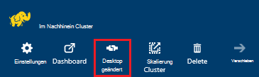
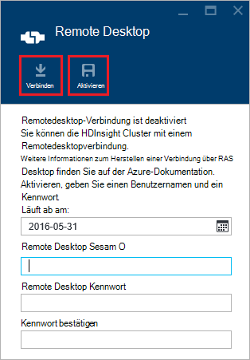
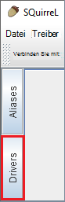
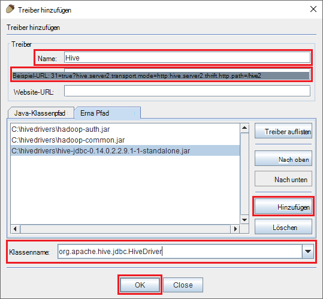
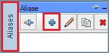
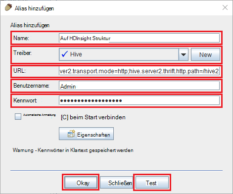
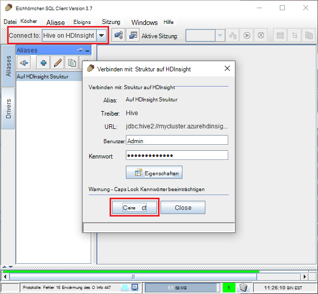
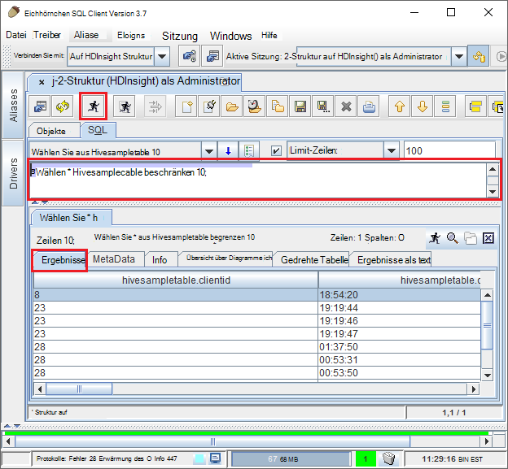

<properties
 pageTitle="Mit der Abfrage Hive auf Azure HDInsight JDBC"
 description="Informationen Sie zur Verwendung von JDBC Hive auf Azure HDInsight und Remote-Abfragen auf Daten in der Cloud."
 services="hdinsight"
 documentationCenter=""
 authors="Blackmist"
 manager="jhubbard"
 editor="cgronlun"
    tags="azure-portal"/>

<tags
 ms.service="hdinsight"
 ms.devlang="java"
 ms.topic="article"
 ms.tgt_pltfrm="na"
 ms.workload="big-data"
 ms.date="08/23/2016"
 ms.author="larryfr"/>

#Verbinden Sie mit Struktur auf Azure HDInsight Struktur JDBC-Treiber verwenden

[AZURE.INCLUDE [ODBC-JDBC-selector](../../includes/hdinsight-selector-odbc-jdbc.md)]

In diesem Dokument erfahren Sie, wie Sie JDBC aus einer Java-Anwendung Remote Struktur Abfragen an einen HDInsight-Cluster senden. Verbindung vom Client Eichhörnchen SQL und Verbindung programmgesteuert aus Java erfahren.

Weitere Informationen über die Struktur JDBC-Schnittstelle finden Sie unter [HiveJDBCInterface](https://cwiki.apache.org/confluence/display/Hive/HiveJDBCInterface).

##Erforderliche Komponenten

Die Schritte in diesem Artikel benötigen Sie Folgendes:

* Eine Hadoop auf HDInsight Cluster. Linux-basierten oder Windows-basierten Cluster funktionieren.

* [Eichhörnchen SQL](http://squirrel-sql.sourceforge.net/). Eichhörnchen ist eine JDBC-Clientanwendung.

Erstellen und führen Sie die Beispiel Java-Anwendung mit diesem Artikel verknüpft, benötigen Sie.

* [Java Developer Kit (JDK) Version 7](https://www.oracle.com/technetwork/java/javase/downloads/jdk7-downloads-1880260.html) oder höher.

* [Apache Maven](https://maven.apache.org). Maven ist ein Projekt System für Java-Projekte, die mit diesem Artikel verknüpfte Projekt verwendet wird.

##Verbindungszeichenfolge

JDBC-Verbindung zu einem Cluster HDInsight Azure erfolgt über 443 und der Datenverkehr mit SSL geschützt. Öffentliche Gateway Cluster sitzen leitet den Datenverkehr an den Port HiveServer2 tatsächlich abhört. Eine normale Verbindungszeichenfolge möchte Folgendes:

    jdbc:hive2://CLUSTERNAME.azurehdinsight.net:443/default;ssl=true?hive.server2.transport.mode=http;hive.server2.thrift.http.path=/hive2

Der Name des Clusters HDInsight ersetzen Sie __CLUSTERNAME__ .

##Authentifizierung

Beim Herstellen der Verbindung müssen Sie Cluster-Gateway authentifizieren HDInsight Cluster Administrator Name und Kennwort verwenden. Beim Verbinden von JDBC-Clients wie Eichhörnchen SQL müssen Sie den Administratornamen und das Kennwort in Clienteinstellungen eingeben.

Aus einer Java-Anwendung müssen Sie den Namen und das Kennwort beim Herstellen einer Verbindung verwenden. Beispielsweise wird im folgende Java-Code eine neue Verbindung mit der Verbindungszeichenfolge, Administratornamen und das Kennwort geöffnet:

    DriverManager.getConnection(connectionString,clusterAdmin,clusterPassword);

##Verbinden Sie mit Eichhörnchen SQL client

Eichhörnchen SQL ist eine JDBC-Client, der Remote Struktur Abfragen mit HDInsight Cluster verwendet werden kann. Die folgenden Schritte gehen Eichhörnchen SQL bereits installiert haben, und gehen Sie herunterladen und konfigurieren die Treiber für die Struktur.

1. Kopieren Sie die Struktur JDBC-Treiber aus HDInsight Cluster.

    * Gehen Sie für __Linux-basierte HDInsight__die erforderlichen JAR-Dateien herunterladen.

        1. Erstellen Sie ein neues Verzeichnis mit den Dateien. Z. B. `mkdir hivedriver`.

        2. Befehlszeile, Bash, PowerShell oder andere Befehlszeile in das neue Verzeichnis wechseln Sie und verwenden Sie die folgenden Befehle, um Dateien aus dem HDInsight-Cluster.

                scp USERNAME@CLUSTERNAME:/usr/hdp/current/hive-client/lib/hive-jdbc*standalone.jar .
                scp USERNAME@CLUSTERNAME:/usr/hdp/current/hadoop-client/hadoop-common.jar .
                scp USERNAME@CLUSTERNAME:/usr/hdp/current/hadoop-client/hadoop-auth.jar .

            Ersetzen Sie __USERNAME__ SSH-Benutzerkonto für den Cluster. Der Clustername HDInsight ersetzen Sie __CLUSTERNAME__ .

            > [AZURE.NOTE] In Windows-Umgebung müssen Sie mithilfe des Dienstprogramms PSCP statt scp. Sie können sie von [http://www.chiark.greenend.org.uk/~sgtatham/putty/download.html](http://www.chiark.greenend.org.uk/~sgtatham/putty/download.html)herunterladen.

    * Gehen Sie für __Windows-basierte HDInsight__die JAR-Dateien herunterladen.

        1. Azure-Portal aktivieren Sie HDInsight Cluster und wählen Sie das __Remote Desktop__ -Symbol.

            

        2. -Blade Remotedesktop Verbindung zum Cluster verwenden Sie die Schaltfläche __Verbinden__ . Wenn der Remotedesktop nicht aktiviert ist, mithilfe des Formulars bieten einen Benutzernamen und ein Kennwort wählen Sie Remotedesktop für den Cluster aktivieren __Aktivieren__ .

            

            Nach dem __Verbinden__auswählen, wird eine RDP-Datei heruntergeladen. Verwenden Sie diese Datei zum Remotedesktopverbindung zu starten. Verwenden Sie bei Aufforderung den Benutzernamen und das Kennwort für Remote Desktop-Zugriff.

        3. Sobald verbunden, kopieren Sie die folgenden Dateien von der Remotedesktopsitzung auf Ihrem Computer. Legen sie in einem lokalen Verzeichnis `hivedriver`.

            * C:\apps\dist\hive-0.14.0.2.2.9.1-7\lib\hive-JDBC-0.14.0.2.2.9.1-7-Standalone.jar
            * C:\apps\dist\hadoop-2.6.0.2.2.9.1-7\share\hadoop\common\hadoop-Common-2.6.0.2.2.9.1-7.jar
            * C:\apps\dist\hadoop-2.6.0.2.2.9.1-7\share\hadoop\common\lib\hadoop-AUTH-2.6.0.2.2.9.1-7.jar

            > [AZURE.NOTE] Die Versionsnummern in Pfade und Dateinamen enthalten möglicherweise für den Cluster.

        4. Trennen Sie die Remotedesktopsitzung, nachdem Sie die Dateien kopiert haben.

3. Starten Sie die Anwendung Eichhörnchen SQL. Wählen Sie links im Fenster __Treiber__.

    

4. Wählen Sie die Symbole oben im Dialogfeld __Treiber__ , die __+__ Symbol für das Erstellen eines neuen Treibers.

    

5. Fügen Sie die folgenden Informationen im Dialogfeld Treiber hinzufügen.

    * __Name__: Struktur
    * __Beispiel-URL__: jdbc:hive2://localhost:443/default;ssl=true?hive.server2.transport.mode=http;hive.server2.thrift.http.path=/hive2
    * __Zusätzliche Pfad__: mit die Schaltfläche hinzufügen die JAR-Dateien bereits heruntergeladen
    * __Klassenname__: org.apache.hive.jdbc.HiveDriver

    

    Klicken Sie auf __OK__ , um diese Einstellung zu speichern.

6. Wählen Sie im linken Fenster Eichhörnchen SQL __Aliase__. Klicken Sie auf die __+__ Symbol für das Erstellen eines neuen Verbindung Alias.

    

7. Verwenden Sie die folgenden Werte für das Dialogfeld __Alias hinzufügen__ .

    * __Name__: Struktur auf HDInsight
    * __Treiber__: Verwenden Sie die Dropdownliste, um __Struktur__ auswählen
    * __URL__: jdbc:hive2://CLUSTERNAME.azurehdinsight.net:443/default;ssl=true?hive.server2.transport.mode=http;hive.server2.thrift.http.path=/hive2

        Der Name des Clusters HDInsight ersetzen Sie __CLUSTERNAME__ .

    * __Benutzername__: Cluster Login-Kontonamen für den HDInsight-Cluster. Der Standardwert ist `admin`.
    * __Kennwort__: das Kennwort für das Anmeldekonto Cluster. Dies ist ein Kennwort, das beim Erstellen HDInsight Cluster bereitgestellt.

    

    Verwenden Sie die Schaltfläche __Test__ überprüfen, ob die Verbindung funktioniert. Wenn __Verbindung: auf HDInsight Struktur__ Dialogfeld __Verbindung__ zum Ausführen des Tests auswählen. Wenn der Test erfolgreich ist, sehen Sie ein Verbindungsdialogfeld __erfolgreich__ .

    Verwenden Sie die Schaltfläche __Ok__ unten im Dialogfeld __Alias hinzufügen__ , um Verbindung Alias speichern.

8. Wählen Sie in der Dropdownliste __mit__ oben Eichhörnchen SQL __auf HDInsight Struktur aus__ Wenn Sie aufgefordert werden, wählen Sie __Verbinden__.

    

9. Sobald verbunden, geben Sie die folgende Abfrage in SQL-Abfrage-Dialogfeld, und wählen Sie das Symbol __Ausführen__ . Der Ergebnisbereich sollten die Ergebnisse der Abfrage anzeigen.

        select * from hivesampletable limit 10;

    

##Ein Beispiel für Java-Anwendung schließen

Ein Beispiel für eine Java-Client Abfrage Struktur auf HDInsight ist unter [https://github.com/Azure-Samples/hdinsight-java-hive-jdbc](https://github.com/Azure-Samples/hdinsight-java-hive-jdbc)verfügbar. Führen Sie die Schritte im Repository erstellen und Ausführen des Beispiels.

##Problembehandlung

### Unerwarteter Fehler aufgetreten, eine SQL-Verbindung zu öffnen.

__Symptome__: Wenn HDInsight-Cluster Version 3.3 und 3.4 herstellen, erhalten Sie Fehler ist ein Fehler aufgetreten. Stapelrahmen für diesen Fehler beginnt mit den folgenden Zeilen:

    java.util.concurrent.ExecutionException: java.lang.RuntimeException: java.lang.NoSuchMethodError: org.apache.commons.codec.binary.Base64.<init>(I)V
    at java.util.concurrent.FutureTas...(FutureTask.java:122)
    at java.util.concurrent.FutureTask.get(FutureTask.java:206)

__Ursache__: Dieser Fehler durch einen Konflikt in der Version der Datei Commons codec.jar Eichhörnchen und die erforderliche Struktur JDBC Komponenten heruntergeladen HDInsight-Cluster verwendet.

__Auflösung__: Gehen Sie folgendermaßen vor, um diesen Fehler zu beheben.

1. HDInsight Cluster Commons Codec JAR-Datei herunterladen.

        scp USERNAME@CLUSTERNAME:/usr/hdp/current/hive-client/lib/commons-codec*.jar ./commons-codec.jar

2. Eichhörnchen beenden und dann zum Verzeichnis, Eichhörnchen auf Ihrem System installiert. Im Verzeichnis Eichhörnchen unter der `lib` Verzeichnis ersetzen vorhandene Commons-codec.jar mit dem HDInsight-Cluster heruntergeladen.

3. Starten Sie Eichhörnchen. Der Fehler sollte nicht mehr auftreten, beim Verbinden mit Struktur auf HDInsight.

##Nächste Schritte

Jetzt gelernt wie JDBC Struktur arbeiten, verwenden Sie die folgenden Links zu anderen Methoden zum Arbeiten mit Azure HDInsight.

* [Upload von Daten auf HDInsight](hdinsight-upload-data.md)
* [Struktur mit HDInsight verwenden](hdinsight-use-hive.md)
* [Verwenden Sie Schwein mit HDInsight](hdinsight-use-pig.md)
* [Verwenden Sie MapReduce Aufträge mit HDInsight](hdinsight-use-mapreduce.md)
