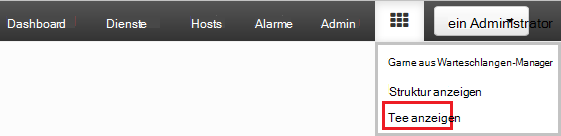
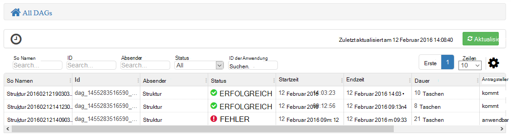
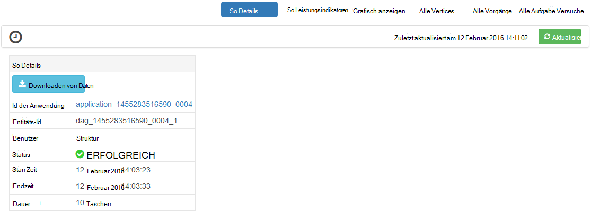
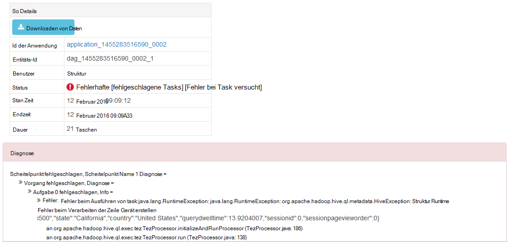
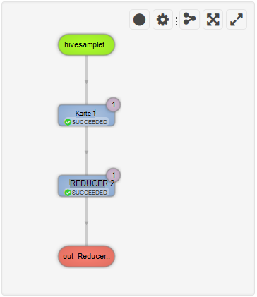
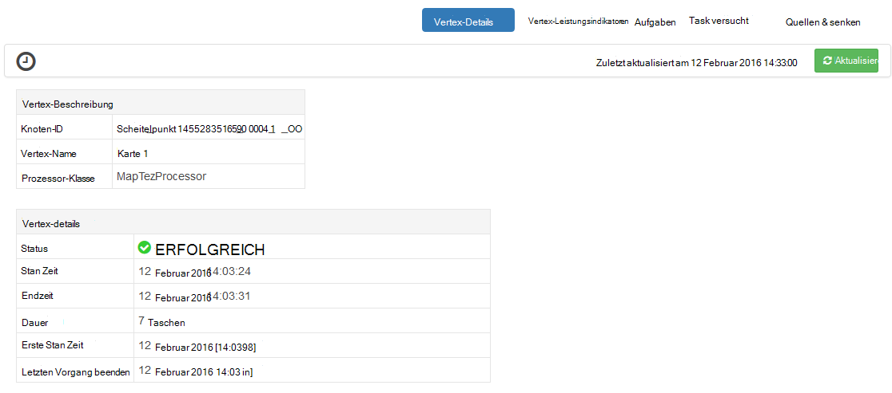
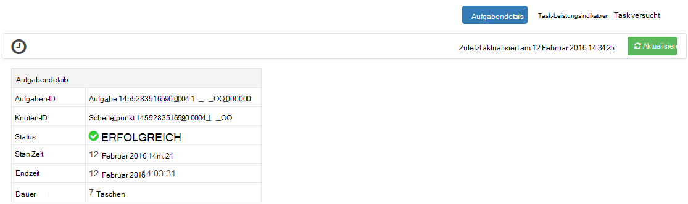

<properties
pageTitle="Verwenden Sie Ambari Tez Ansicht mit HDInsight | Azure"
description="Erfahren Sie, wie Ambari Tez Ansicht zum Debuggen Tez Aufträge auf HDInsight verwendet."
services="hdinsight"
documentationCenter=""
authors="Blackmist"
manager="jhubbard"
editor="cgronlun"/>

<tags
ms.service="hdinsight"
ms.devlang="na"
ms.topic="article"
ms.tgt_pltfrm="na"
ms.workload="big-data"
ms.date="10/04/2016"
ms.author="larryfr"/>

# Verwenden Sie Ambari Ansichten Tez Aufträge auf HDInsight Debuggen

Die Webbenutzeroberfläche Ambari für HDInsight enthält eine Tez Ansicht, die zum Verständnis und Aufträge mit Tez als das Ausführungsmodul Debuggen. Tez-Ansicht können Sie den Auftrag als Diagramm verbundenen Elemente visualisieren, in jedes Element Bohren und Statistiken und Informationen abzurufen.

> [AZURE.NOTE] Die Informationen in diesem Dokument ist für Linux-basierte HDInsight-Cluster. Informationen zum Debuggen von Tez Aufträge mithilfe von Windows-basierten HDInsight finden Sie unter [der Tez Benutzeroberfläche zum Debuggen von Tez Aufträge auf Windows-basierten HDInsight](hdinsight-debug-tez-ui.md).

## Erforderliche Komponenten

* Ein Linux-basiertes HDInsight-Cluster. Schritte zum Erstellen eines neuen Clusters finden Sie unter [Erste Schritte mit Linux-basierten HDInsight](hdinsight-hadoop-linux-tutorial-get-started.md).

* Einen modernen Webbrowser, der HTML5 unterstützt.

## Grundlegendes zu Tez

Tez ist ein erweiterbares Framework für die Datenverarbeitung in Hadoop, die schneller als herkömmliche MapReduce Verarbeitung bereitstellt. HDInsight Linux-basierten Clustern ist es Standard-Engine für die Struktur.

Beim Arbeiten an Tez gesendet wird, erstellt eine gesteuerte azyklische Diagramm (DAG), die Reihenfolge der Ausführung der Maßnahmen das Projekt beschreibt. Einzelne Aktionen werden auch Scheitelpunkte genannt und einen Teil der gesamten Auftrag ausführen. Die tatsächliche Ausführung der Arbeit durch einen Scheitelpunkt eine Aufgabe aufgerufen wird und möglicherweise mehrere Knoten im Cluster verteilt.

### Grundlegendes zu Tez anzeigen

Die Tez-Ansicht enthält Informationen über Prozesse, die ausgeführt werden oder zuvor war mit Tez. Können so erzeugte Tez anzeigen Verteilung auf Clustern Leistungsindikatoren für Arbeitsspeicher von Aufgaben und Eckpunkte und Fehlerinformationen verwendet. Sie können Informationen in den folgenden Szenarien bieten:

* Lang andauernde Überwachung verarbeitet den Status der Karte anzeigen und Aufgaben reduzieren.

* Verlaufsdaten für erfolgreiche oder fehlgeschlagene Vorgänge zu Verbesserung Verarbeitung oder warum nicht analysieren.

## Ein So generieren

Tez Ansicht nur enthält Wenn ein Auftrag Daten, die mithilfe die Tez Engine läuft oder wurde in der Vergangenheit ausgeführt wurden. Einfache Struktur Abfragen können in der Regel aufgelöst werden ohne Tez jedoch komplexere Abfragen, die filtern, gruppieren, sortieren, Joins usw. normalerweise Tez erfordern.

Gehen Sie folgendermaßen vor, um eine Hive-Abfrage ausführen, die mit Tez ausgeführt wird.

1. Navigieren Sie in einem Webbrowser zu https://CLUSTERNAME.azurehdinsight.net ist der Name Ihres Clusters HDInsight durch __CLUSTERNAME__ .

2. Wählen Sie im Menü am oberen Rand der Seite __Ansicht__ . Das sieht eine Reihe von Quadraten. Wählen Sie in der Dropdownliste angezeigt wird __Struktur anzeigen__. 

    

3. Beim Anzeigen der Struktur Lasten, fügen Sie Folgendes in den Abfrage-Editor und klicken Sie dann auf __Ausführen__.

        select market, state, country from hivesampletable where deviceplatform='Android' group by market, country, state;
    
    Wenn der Auftrag abgeschlossen ist, sollte die Ausgabe im Abschnitt __Prozess Abfrageergebnisse__ angezeigt werden. Das Ergebnis sollte ähnlich der folgenden
    
        market  state       country
        en-GB   Hessen      Germany
        en-GB   Kingston    Jamaica
        
4. Wählen Sie die Registerkarte __Protokoll__ . Informationen ähnlich der folgenden wird angezeigt:
    
        INFO : Session is already open
        INFO :

        INFO : Status: Running (Executing on YARN cluster with App id application_1454546500517_0063)

    Speichern Sie den __App-Id__ -Wert wie im nächsten Abschnitt Hiermit.

## Tez Ansicht

1. Wählen Sie im Menü am oberen Rand der Seite __Ansicht__ . Wählen Sie in der Dropdownliste angezeigt wird __Tez anzeigen__.

    

2. Wenn die Tez-Ansicht geladen wird, sehen Sie eine Liste von DAGs, die derzeit ausgeführt werden, oder auf dem Cluster ausgeführt. Die Standardansicht enthält Dag Name, Id, Absender, Status, Startzeit, Endzeit, Dauer, ID der Anwendung und Warteschlange. Mehrere Spalten können mit dem Zahnradsymbol rechts auf der Seite hinzugefügt werden.

    

3. Haben Sie nur ein Eintrag werden für die Abfrage die im vorherigen Abschnitt ausgeführt. Haben mehrere Einträge können die ID im Feld __ID der Anwendung__ eingeben, und drücken Sie die EINGABETASTE.

4. Wählen Sie den __Namen so__. Zeigt Informationen über die so sowie Zip JSON-Dateien herunterladen, die Informationen über die so.

    

5. Über die __So Details__ sind mehrere Links mit Informationen über die so angezeigt.

    * __So Indikatoren__ zeigt Indikatoren für diese so.
    
    * __Grafisch__ zeigt diese so grafisch dargestellt.
    
    * __Alle Vertices__ zeigt eine Liste der Scheitelpunkte in diesem so.
    
    * __Alle Aufgaben__ zeigt eine Liste der Aufgaben aus, um alle Scheitelpunkte in diesem so.
    
    * __Alle TaskAttempts__ zeigt Informationen über die Versuche zum Ausführen von Aufgaben für diese so.
    
    > [AZURE.NOTE] Bildlauf die Spaltenanzeige für Eckpunkte, Aufgaben und TaskAttempts feststellen Sie, dass Links __Leistungsindikatoren__ und __anzeigen oder downloaden Protokolle__ für jede Zeile angezeigt.

    Wenn Fehler mit dem Auftrag, werden die Details so Status fehlgeschlagen, sowie Links zu Informationen über die fehlgeschlagene Aufgabe angezeigt. Diagnoseinformationen werden unter So Details angezeigt.
    
    

7. __Grafisch__auswählen Die so grafisch angezeigt. Sie können die Maus über jeden Scheitelpunkt in der Ansicht anzuzeigenden Informationen platzieren.

    

8. Auf einem Eckpunkt lädt __Scheitelpunkt Details__ für dieses Element. Klicken Sie auf der __Karte 1__ Scheitelpunkt Informationen für dieses Element angezeigt.

    

9. Beachten Sie, dass nun Links oben auf der Seite die Scheitelpunkte und Aufgaben.

    > [AZURE.NOTE] Sie können diese Seite auch wieder __So__Details __Scheitelpunkt Details__auswählen und Auswählen des __Karte 1__ Scheitelpunkts ankommen.

    * __Scheitelpunkt Indikatoren__ zeigt Indikatorinformationen für diesen Vertex.
    
    * __Aufgaben__ zeigt Aufgaben für diesen Vertex.
    
    * __Task versucht__ zeigt Informationen über Versuche zum Ausführen von Aufgaben für diesen Vertex.
    
    * __Quellen und senken__ zeigt Datenquellen und Channelsenken für diesen Vertex.

    > [AZURE.NOTE] Als mit dem vorherigen Menü können Sie die Spaltenanzeige für Aufgaben, Task versucht, Quellen und Sinks__ Hyperlinks zu weiteren Informationen für jedes Element anzeigen blättern.

10. Wählen Sie __Aufgaben__, und wählen Sie das Element mit der Bezeichnung __00_000000__. Dadurch werden für diese Aufgabe __Aufgabendetails__ angezeigt. Von diesem __Task Leistungsindikatoren__ und __Task versucht__angezeigt.

    

## Nächste Schritte

Wie die Tez-Ansicht bearbeitet haben, erfahren Sie mehr über [Auf HDInsight Struktur verwenden](hdinsight-use-hive.md).

Weitere technische Informationen zu Tez finden Sie unter [Tez-Seite unter Hortonworks](http://hortonworks.com/hadoop/tez/).

Weitere Informationen zur Verwendung von Ambari mit HDInsight finden Sie unter [Verwalten HDInsight Cluster mit Ambari Web-Benutzeroberfläche](hdinsight-hadoop-manage-ambari.md)
