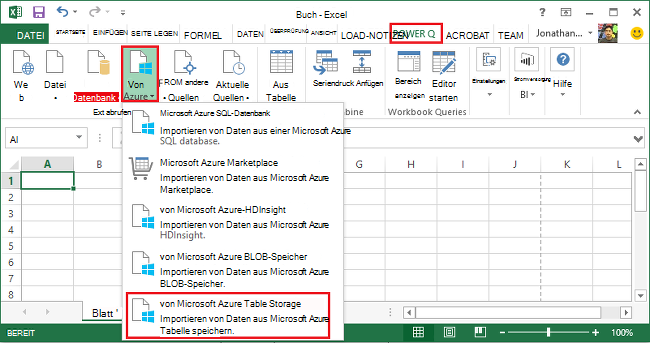
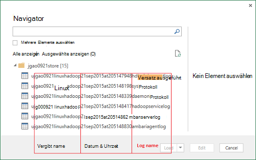
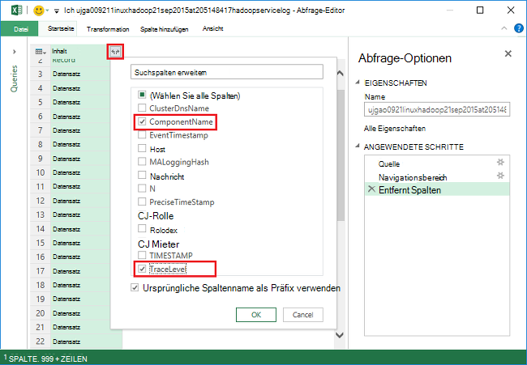
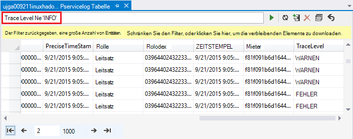
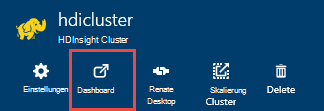
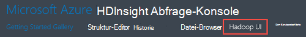

<properties
    pageTitle="Hadoop in HDInsight Debuggen: Protokolle anzeigen und Interpretieren von Fehlermeldungen | Microsoft Azure"
    description="Informationen Sie zu Fehlermeldungen erhalten Sie möglicherweise die Verwaltung von HDInsight mithilfe von PowerShell und die wiederherzustellende Schritte."
    services="hdinsight"
    tags="azure-portal"
    editor="cgronlun"
    manager="jhubbard"
    authors="mumian"
    documentationCenter=""/>

<tags
    ms.service="hdinsight"
    ms.workload="big-data"
    ms.tgt_pltfrm="na"
    ms.devlang="na"
    ms.topic="article"
    ms.date="09/02/2016"
    ms.author="jgao"/>

# HDInsight Protokolle analysieren

Clustern Hadoop in Azure HDInsight hat ein Azure Storage-Konto als Standard-Dateisystem verwendet. Das Speicherkonto wird als Standardkonto Speicher bezeichnet. Cluster, Azure-Tabellenspeicher und BLOB-Speicher auf das Standardkonto Storage Protokolle speichern verwendet.  Das Standardkonto Speicher für Ihren Cluster finden [Verwalten Hadoop Cluster in HDInsight](hdinsight-administer-use-management-portal.md#find-the-default-storage-account)anzeigen Auch nach dem Löschen des Clusters beibehalten Protokolle in das Speicherkonto.

##Protokolle in Azure-Tabellen geschrieben

Die Protokolle in Azure-Tabellen geschrieben bieten einen Einblick in was mit einem HDInsight-Cluster geschieht.

Beim Erstellen eines HDInsight-Clusters werden 6 Tabellen für Linux-basierten Clustern in Tabelle Standardspeicher automatisch erstellt:

- hdinsightagentlog
- Syslog
- daemonlog
- hadoopservicelog
- ambariserverlog
- ambariagentlog

3 Tabellen werden für Windows-basierten Clustern erstellt:

- Setuplog: Protokollieren von Ereignissen und Ausnahmen bereitstellen/einrichten HDInsight Cluster aufgetreten.
- Hadoopinstalllog: Protokollieren von Ereignissen und Ausnahmen Wenn Hadoop auf dem Cluster installieren. Diese Tabelle kann Probleme im Zusammenhang mit Clustern mit benutzerdefinierten Parametern erstellt Debuggen nützlich sein.
- Hadoopservicelog: Protokollieren von Ereignissen und Ausnahmen von Hadoop-Dienste aufgezeichnet. Diese Tabelle kann Probleme bei Auftragsfehler HDInsight Cluster Debuggen nützlich sein.

Tabelle Dateinamen **u<ClusterName>DDMonYYYYatHHMMSSsss<TableName>**.

Diese Tabellen enthält die folgenden Felder:

- ClusterDnsName
- Komponentenname
- EventTimestamp
- Host
- MALoggingHash
- Nachricht
- N
- PreciseTimeStamp
- Rolle
- RowIndex
- Mieter
- ZEITSTEMPEL
- TraceLevel

### Tools für den Zugriff auf die Protokolle

Es gibt viele Tools für den Zugriff auf Daten in diesen Tabellen:

-  Visual Studio
-  Azure-Speicher-Explorer
-  Power Query für Excel

#### Verwenden von Power Query für Excel

Power Query kann von [www.microsoft.com/en-us/download/details.aspx?id=39379]( http://www.microsoft.com/en-us/download/details.aspx?id=39379)installiert werden. Finden Sie die Downloadseite für die an das system

**Mit Power Abfrage öffnen und Analysieren-Protokoll**

1. Öffnen Sie **Microsoft Excel**.
2. Klicken Sie im Menü **Abfrage macht** auf **Von Azure**klicken Sie **von Azure Table Storage**
 
    
3. Geben Sie den speicherkontonamen. Dies ist der kurze Name oder der FQDN.
4. Geben Sie ein Konto Speicherschlüssel. Sie sehen eine Liste der Tabellen:

    
5. Mit der rechten Maustaste im **Bereich** der Hadoopservicelog-Tabelle, und wählen Sie **Bearbeiten**. 4 Spalten sehen. Gegebenenfalls löschen Sie **Partitionsschlüssel** **Zeilenschlüssel**und **Timestamp** -Spalten auswählen und dann auf **Entfernen Sie Spalten** aus den Optionen in der Multifunktionsleiste.
6. Klicken Sie auf das Erweiterungssymbol Inhaltsspalte Spalten wählen Sie in der Excel-Kalkulationstabelle importieren möchten. Für diese Demo wurde gewählt TraceLevel und Komponentenname: sie können mir einige grundlegende Informationen auf dem Komponenten Probleme hatte.

    
7. Klicken Sie auf **OK** , um die Daten zu importieren.
8. Wählen Sie **TraceLevel**, Rolle und **Komponentenname** Spalten aus und dann auf **Gruppieren nach** Steuerelement auf der Multifunktionsleiste.
9. Klicken Sie auf **OK** im Dialogfeld Gruppieren nach
10. Klicken Sie auf** anwenden und schließen**.
 
Sie können jetzt Excel zum Filtern und Sortieren nach Bedarf. Natürlich kann sollen Spalten (z. B. Nachricht) um Detailinformationen Probleme auftretenden jedoch markieren und Gruppieren von Spalten beschriebenen bietet gute Grafik mit Hadoop passiert. Die Tabellen Setuplog und Hadoopinstalllog kann dasselbe zugewiesen.

#### Verwenden von Visual Studio

**Mit Visual Studio**

1. Öffnen Sie Visual Studio.
2. Klicken Sie im Menü **Ansicht** auf **Cloud Explorer**. Oder klicken Sie einfach auf **STRG +\, STRG + X**.
3. Wählen Sie **Cloud Explorer** **Ressourcentypen**.  Die andere Option ist **Ressourcengruppen**.
4. Erweitern Sie **Speicherkonten**Speicher Standardkonto für den Cluster und **Tabellen**.
5. Doppelklicken Sie auf **Hadoopservicelog**.
6. Filter hinzufügen. Zum Beispiel:
    
        TraceLevel eq 'ERROR'

    

    Weitere Informationen zum Erstellen von Filtern finden Sie unter [Filtern von Zeichenfolgen für den Tabellen-Designer erstellen](../vs-azure-tools-table-designer-construct-filter-strings.md).
 
##Protokolle in Azure BLOB-Speicher geschrieben

[Die Protokolle in Azure-Tabellen geschrieben](#log-written-to-azure-tables) bieten einen Einblick in was mit einem HDInsight-Cluster geschieht. Diese Tabellen bieten jedoch keine auf Protokolle, die Bohrung können zu Problemen beim auftreten. Bieten diese nächste Detailebene sind HDInsight-Cluster konfiguriert um Task-Protokolle zu Ihrem Konto BLOB-Speicher für jede Aufgabe zu schreiben, die über Templeton gesendet wird. Praktisch bedeutet dies Aufträge mit Microsoft Azure PowerShell-Cmdlets oder APIs der .NET Auftrag senden, keine Aufträge über RDP/command-line Zugriff auf den Cluster. 

Zum Anzeigen der Protokolle finden Sie unter [Zugriff GARN Anwendungsprotokolle auf Linux-basierten HDInsight](hdinsight-hadoop-access-yarn-app-logs-linux.md).

Finden Sie weitere Informationen Anwendungsprotokolle [Vereinfachung Benutzers Management und Zugriff aus](http://hortonworks.com/blog/simplifying-user-logs-management-and-access-in-yarn/).
 
 
## Gesundheit und Clusterprotokollen anzeigen

###Hadoop-Benutzeroberfläche

Azure-Portal klicken Sie auf einen Clusternamen HDInsight Cluster Blade öffnen. Klicken Sie auf **Dashboard**aus dem Cluster-Blade.

Geben Sie bei Aufforderung die Cluster Administrator-Anmeldeinformationen. Der Abfrage-Konsole, die geöffnet wird, klicken Sie auf **Hadoop Benutzeroberfläche**.

###Zugriff auf die Benutzeroberfläche aus

Azure-Portal klicken Sie auf einen Clusternamen HDInsight Cluster Blade öffnen. Klicken Sie auf **Dashboard**aus dem Cluster-Blade. Geben Sie bei Aufforderung die Cluster Administrator-Anmeldeinformationen. Der Abfrage-Konsole, die geöffnet wird, klicken Sie auf **Benutzeroberfläche aus**.

Der Benutzeroberfläche aus können Sie Folgendes:

* **Cluster-Status abrufen**. Im linken Fensterbereich erweitern Sie **Cluster**und auf **Info**. Dieser Präsentation cluster Informationen wie insgesamt zugewiesenen Speicher Kerne verwendet, Zustand der Ressourcenmanager Cluster, cluster-Version usw.

    

* Sie **erhalten den Status**. Im linken Fensterbereich erweitern Sie **Cluster**und **Knoten**auf. Alle Knoten im Cluster HTTP-Adresse jedes Knotens Mittel für jeden Knoten usw. aufgeführt.

* **Auftragsstatus überwachen**. Im linken Bereich erweitern Sie **Cluster**und dann auf **Clientanwendungen** zum Auflisten aller Aufträge im Cluster. Möchten Sie Einzelvorgänge in einem bestimmten Zustand (z. B. neue, vorgelegten ausgeführt) sehen, klicken Sie auf die entsprechende Verknüpfung unter **Applications**. Sie können außerdem den Auftragsnamen an die Stelle dieser Ausgabe, Protokolle, usw. erfahren klicken.

###Zugriff auf die HBase-Benutzeroberfläche

Azure-Portal klicken Sie auf eine HDInsight HBase Clustername Blade Cluster geöffnet. Klicken Sie auf **Dashboard**aus dem Cluster-Blade. Geben Sie bei Aufforderung die Cluster Administrator-Anmeldeinformationen. Der Abfrage-Konsole, die geöffnet wird, klicken Sie auf **HBase-Benutzeroberfläche**.

## HDInsight-Fehlercodes

In diesem Abschnitt aufgeführten Fehlermeldungen stehen die Benutzern Hadoop in Azure HDInsight mögliche Fehlerzustände zu verstehen, die sie beim Verwalten von Azure PowerShell mit auftreten können und sie beraten die Schritte ergriffen werden, um den Fehler zu beheben.

Einige dieser Fehlermeldungen können auch im Azure-Portal angezeigt bei HDInsight-Cluster zu verwalten. Jedoch andere Fehlermeldungen auftreten, sind weniger detaillierte Gründen auf dabei mögliche Abhilfemaßnahmen. In den Fällen offensichtlich die Minderung ist Fehlermeldungen erhalten. 

### AtleastOneSqlMetastoreMustBeProvided
- **Beschreibung**: bitte Einzelheiten Azure SQL-Datenbank für mindestens eine Komponente um benutzerdefinierte Einstellungen für Struktur und Oozie Metastores verwenden.
- **Ausgleich**: der Benutzer muss ein gültiges SQL Azure-Metastore und wiederholen Sie die Anforderung.  

### AzureRegionNotSupported
- **Beschreibung**: Cluster im Bereich *NameOfYourRegion*konnte nicht erstellt. Verwenden Sie einen gültigen Bereich HDInsight und wiederholen Sie Anforderung.
- **Ausgleich**: Kunden sollten der clusterregion, das derzeit unterstützt erstellen: Südostasien, Westeuropa, Nordeuropa, USA, Osten oder Westen der USA.  

### ClusterContainerRecordNotFound
- **Beschreibung**: der Server den angeforderten Cluster Datensatz nicht gefunden.  
- **Ausgleich**: Wiederholen Sie den Vorgang.

### ClusterDnsNameInvalidReservedWord
- **Beschreibung**: Cluster DNS Namen *YourDnsName* ist ungültig. Überprüfen Sie Name beginnt und endet mit alphanumerischen und nur '-' Zeichen  
- **Ausgleich**: Stellen Sie sicher, dass Sie einen gültigen DNS-Namen verwendet haben, für Cluster, die beginnt und endet mit alphanumerischen und enthält keine außer dem Bindestrich Zeichen "-" und wiederholen Sie den Vorgang.

### ClusterNameUnavailable
- **Beschreibung**: Cluster Name *YourClusterName* ist nicht verfügbar. Wählen Sie einen anderen Namen ein.  
- **Ausgleich**: der Benutzer sollte geben ein Clustername eindeutig ist nicht vorhanden und wiederholen. Wenn der Benutzer das Portal verwenden, benachrichtigt die Benutzeroberfläche sie, wenn ein Cluster erstellen Schritte bereits verwendet wird.

### ClusterPasswordInvalid
- **Beschreibung**: Cluster-Kennwort ist ungültig. Kennwort muss mindestens 10 Zeichen lang sein und muss mindestens eine Ziffer, Großbuchstaben, Kleinbuchstaben und Zeichen ohne Leerzeichen enthalten und darf keine der Benutzername als Teil.  
- **Ausgleich**: ein gültiger Cluster Kennwort und wiederholen Sie den Vorgang.

### ClusterUserNameInvalid
- **Beschreibung**: Cluster-Benutzername ist ungültig. Stellen Sie sicher, dass Benutzername Sonderzeichen oder Leerzeichen enthält.  
- **Ausgleich**: Geben Sie einen gültigen Cluster Benutzernamen und wiederholen Sie den Vorgang.

### ClusterUserNameInvalidReservedWord
- **Beschreibung**: Cluster DNS Namen *YourDnsClusterName* ist ungültig. Überprüfen Sie Name beginnt und endet mit alphanumerischen und nur '-' Zeichen  
- **Ausgleich**: Geben Sie einen gültigen DNS-Cluster Benutzernamen und wiederholen Sie den Vorgang.

### ContainerNameMisMatchWithDnsName
- **Beschreibung**: Containernamen in URI *YourcontainerURI* und DNS-Namen *YourDnsName* im Anforderungshauptteil müssen identisch sein.  
- **Ausgleich**: sicherstellen, dass den Container Name Ihres DNS-Namens identisch sind und wiederholen Sie den Vorgang.

### DataNodeDefinitionNotFound
- **Beschreibung**: Ungültige Konfiguration. Keine Knoten Datendefinitionen Knoten Größe gefunden.  
- **Ausgleich**: Wiederholen Sie den Vorgang.

### DeploymentDeletionFailure
- **Beschreibung**: Fehler beim Löschen der Bereitstellung für den Cluster  
- **Ausgleich**: Wiederholen Sie den Löschvorgang.

### DnsMappingNotFound
- **Beschreibung**: Fehler-Service. Erforderliche DNS-Zuordnungsinformationen nicht gefunden.  
- **Ausgleich**: Cluster löschen und einen neuen Cluster erstellen.

### DuplicateClusterContainerRequest
- **Beschreibung**: Doppelte Cluster Container erstellen versucht. Datensatz für *NameOfYourContainer* vorhanden ist, aber Etags stimmen nicht überein.
- **Ausgleich**: Geben Sie einen eindeutigen Namen für den Container, und wiederholen Sie den Vorgang zum Erstellen.

### DuplicateClusterInHostedService
- **Beschreibung**: gehosteter Dienst *NameOfYourHostedService* enthält bereits einen Cluster. Ein gehosteter Dienst kann nicht mehrere Cluster enthalten.  
- **Ausgleich**: Host des Clusters in einem anderen gehosteten Dienst.

### FailureToUpdateDeploymentStatus
- **Beschreibung**: der Server konnte nicht aktualisiert den Status der Bereitstellung.  
- **Ausgleich**: Wiederholen Sie den Vorgang. Geschieht dies mehrmals, wenden Sie sich an CSS.

### HdiRestoreClusterAltered
- **Beschreibung**: Cluster- *YourClusterName* wurde im Rahmen von Wartungsarbeiten gelöscht. Erstellen Sie den Cluster neu.
- **Ausgleich**: Erstellen des Clusters.

### HeadNodeConfigNotFound
- **Beschreibung**: Ungültige Konfiguration. Head-Knoten-Konfiguration konnte in der Größe der Knoten erforderlich.
- **Ausgleich**: Wiederholen Sie den Vorgang.

### HostedServiceCreationFailure
- **Beschreibung**: nicht gehosteten Dienst *NameOfYourHostedService*erstellen. Wiederholen Sie die Anforderung.  
- **Ausgleich**: Wiederholen Sie die Anforderung.

### HostedServiceHasProductionDeployment
- **Beschreibung**: gehosteter Dienst *NameOfYourHostedService* bereits ein Produktionsbetrieb. Ein gehosteter Dienst kann nicht mehrere Praxiseinsatz enthalten. Wiederholen Sie die Anforderung mit einem anderen Clusternamen.
- **Ausgleich**: unterschiedliche Namen verwenden, und wiederholen Sie die Anforderung.

### HostedServiceNotFound
- **Beschreibung**: Hosted Service *NameOfYourHostedService* für Cluster nicht gefunden werden konnte.  
- **Ausgleich**: Wenn Cluster im Fehlerzustand befindet, löschen, und versuchen Sie es erneut.

### HostedServiceWithNoDeployment
- **Beschreibung**: gehosteter Dienst *NameOfYourHostedService* hat keine zugeordnete Bereitstellung.  
- **Ausgleich**: Wenn Cluster im Fehlerzustand befindet, löschen, und versuchen Sie es erneut.

### InsufficientResourcesCores
- **Beschreibung**: die SubscriptionId *YourSubscriptionId* keinen Kerne links Cluster *YourClusterName*erstellen. Erforderlich: *ResourcesRequired*, verfügbar: *ResourcesAvailable*.  
- **Ausgleich**: Ressourcen in Ihrem Abonnement oder erhöhen Sie die verfügbaren Ressourcen für das Abonnement und den Cluster erstellen erneut.

### InsufficientResourcesHostedServices
- **Beschreibung**: Abonnement-ID *YourSubscriptionId* hat keine Vorgabe für neue HostedService Cluster *YourClusterName*erstellen.  
- **Ausgleich**: Ressourcen in Ihrem Abonnement oder erhöhen Sie die verfügbaren Ressourcen für das Abonnement und den Cluster erstellen erneut.

### InternalErrorRetryRequest
- **Beschreibung**: ein internen Fehler aufgetreten. Wiederholen Sie die Anforderung.  
- **Ausgleich**: Wiederholen Sie die Anforderung.

### InvalidAzureStorageLocation
- **Beschreibung**: Azure-Speicherort *DataRegionName* ist nicht gültig. Sicherstellen Sie, dass der Bereich richtig ist, und wiederholen Sie Anforderung.
- **Ausgleich**: Wählen Sie einen Speicherort, der HDInsight unterstützt Cluster installiert ist und wiederholen Sie den Vorgang.

### InvalidNodeSizeForDataNode
- **Beschreibung**: Ungültiger virtueller Speicher für Datenknoten. Nur wird "Große VM" für alle Daten unterstützt.  
- **Ausgleich**: Geben Sie die unterstützten Knotengröße für den Datenknoten und wiederholen Sie den Vorgang.

### InvalidNodeSizeForHeadNode
- **Beschreibung**: Ungültiger virtueller Speicher für Head-Knoten. Nur wird 'ExtraLarge VM' für Head-Knoten unterstützt.  
- **Ausgleich**: Geben Sie die unterstützten Knotengröße der Head-Knoten und wiederholen Sie den Vorgang

### InvalidRightsForDeploymentDeletion
- **Beschreibung**: Abonnement-ID *YourSubscriptionId* verwendeten verfügt nicht über ausreichende Berechtigungen Löschvorgang für Cluster- *YourClusterName*ausgeführt.  
- **Ausgleich**: ist der Cluster im Fehlerzustand, drop und versuchen Sie es erneut.  

### InvalidStorageAccountBlobContainerName
- **Beschreibung**: externe Speicher Konto BLOB-Container namens *YourContainerName* ist ungültig. Sicher Namen mit einem Buchstaben beginnt und nur Kleinbuchstaben, Zahlen und Bindestrich enthält.  
- **Ausgleich**: Geben Sie einen gültigen Konto BLOB-Container an, und wiederholen Sie den Vorgang.

### InvalidStorageAccountConfigurationSecretKey
- **Beschreibung**: Konfiguration für externen Speicher Konto *YourStorageAccountName* geheime Schlüssel Informationen festgelegt werden muss.  
- **Ausgleich**: Geben Sie einen gültigen geheimen Schlüssel für das Speicherkonto und wiederholen Sie den Vorgang.

### InvalidVersionHeaderFormat
- **Beschreibung**: Version Header *YourVersionHeader* ist kein gültiges Format Yyyy-mm-tt.  
- **Ausgleich**: Geben Sie ein gültiges Format für Version-Header und wiederholen Sie die Anforderung.

### MoreThanOneHeadNode
- **Beschreibung**: Ungültige Konfiguration. Gefunden Sie mehrere Head-Knoten-Konfiguration.  
- **Ausgleich**: Bearbeiten Sie die Konfiguration so, dass bankiers eine Head-Knoten angegeben wird.

### OperationTimedOutRetryRequest
- **Beschreibung**: der Vorgang konnte nicht innerhalb der zulässigen Zeit abgeschlossen oder die maximale Anzahl von Wiederholungsversuchen möglich. Wiederholen Sie die Anforderung.  
- **Ausgleich**: Wiederholen Sie die Anforderung.

### ParameterNullOrEmpty
- **Beschreibung**: Parameter *YourParameterName* darf nicht null oder leer.  
- **Ausgleich**: Geben Sie einen gültigen Wert für den Parameter.

### PreClusterCreationValidationFailure
- **Beschreibung**: eine oder mehrere Cluster erstellen Anforderung Eingaben ist ungültig. Stellen Sie sicher, die Eingabewerte korrekt sind und wiederholen die Anforderung.  
- **Ausgleich**: sicher Eingabewerte korrekt sind, und wiederholen die Anforderung.

### RegionCapabilityNotAvailable
- **Beschreibung**: Region-Funktion nicht verfügbar für die Region *YourRegionName* und Abonnement-ID *YourSubscriptionId*.  
- **Ausgleich**: Geben Sie einen Bereich, der HDInsight-Cluster unterstützt. Die öffentlich unterstützten Regionen: Südostasien, Westeuropa, Nordeuropa, USA, Osten oder Westen der USA.

### StorageAccountNotColocated
- **Beschreibung**: Speicher-Konto *YourStorageAccountName* ist in der Region *CurrentRegionName*. Diese sein Cluster Region *YourClusterRegionName*identisch.  
- **Ausgleich**: Geben Sie ein Speicherkonto in derselben Region Cluster ist oder wenn die Daten bereits im Speicherkonto, erstellen Sie einen neuen Cluster im Bereich Speicherkonto. Wenn Sie das Portal die Benutzeroberfläche wird dieses Problem im Voraus benachrichtigen verwenden.

### SubscriptionIdNotActive
- **Beschreibung**: die angegebene Abonnement-ID *YourSubscriptionId* ist nicht aktiv.  
- **Ausgleich**: Ihr Abonnement reaktivieren oder erhalten neue gültig.

### SubscriptionIdNotFound
- **Beschreibung**: Abonnement-ID- *YourSubscriptionId* konnte nicht gefunden werden.  
- **Ausgleich**: Überprüfen Sie Ihre Abonnenten-ID gültig ist und wiederholen Sie den Vorgang.

### UnableToResolveDNS
- **Beschreibung**: kann nicht aufgelöst werden DNS- *YourDnsUrl*. Stellen Sie sicher, die vollqualifizierte URL für den BLOB-Endpunkt bereitgestellt wird.  
- **Ausgleich**: Geben Sie eine gültige Blob-URL. Die URL muss vollständig gültig, beginnend mit *http://* und *.com*enden.

### UnableToVerifyLocationOfResource
- **Beschreibung**: nicht Speicherort der Ressource *YourDnsUrl*überprüfen. Stellen Sie sicher, die vollqualifizierte URL für den BLOB-Endpunkt bereitgestellt wird.  
- **Ausgleich**: Geben Sie eine gültige Blob-URL. Die URL muss vollständig gültig, beginnend mit *http://* und *.com*enden.

### VersionCapabilityNotAvailable
- **Beschreibung**: Version Funktionen für Version *SpecifiedVersion* und Abonnement-ID *YourSubscriptionId*nicht verfügbar.  
- **Ausgleich**: Wählen Sie eine verfügbare Version und wiederholen Sie den Vorgang.

### VersionNotSupported
- **Beschreibung**: Version *SpecifiedVersion* nicht unterstützt.
- **Ausgleich**: Wählen Sie eine Version unterstützt wird, und wiederholen Sie den Vorgang.

### VersionNotSupportedInRegion
- **Beschreibung**: Version *SpecifiedVersion* ist nicht verfügbar in Azure-Region *SpecifiedRegion*.  
- **Ausgleich**: Wählen Sie eine Version, die in der angegebenen Region unterstützt wird, und wiederholen Sie den Vorgang.

### WasbAccountConfigNotFound
- **Beschreibung**: Ungültige Konfiguration. Erforderliche WASB Kontokonfiguration in externe Konten nicht gefunden.  
- **Ausgleich**: Überprüfen Sie, ob das Konto vorhanden ist und ordnungsgemäß in der Konfiguration angegeben und wiederholen Sie den Vorgang.

## Nächste Schritte

- [Verwenden Sie Ambari Ansichten Tez Aufträge auf HDInsight Debuggen](hdinsight-debug-ambari-tez-view.md)
- [Aktivieren Sie Heapdumps für Hadoop auf Linux-basierten HDInsight](hdinsight-hadoop-collect-debug-heap-dump-linux.md)
- [Verwalten Sie HDInsight-Cluster mithilfe der Ambari Web-Benutzeroberfläche](hdinsight-hadoop-manage-ambari.md)
