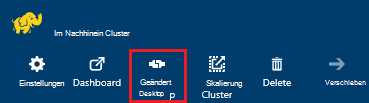
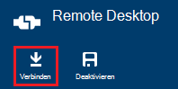
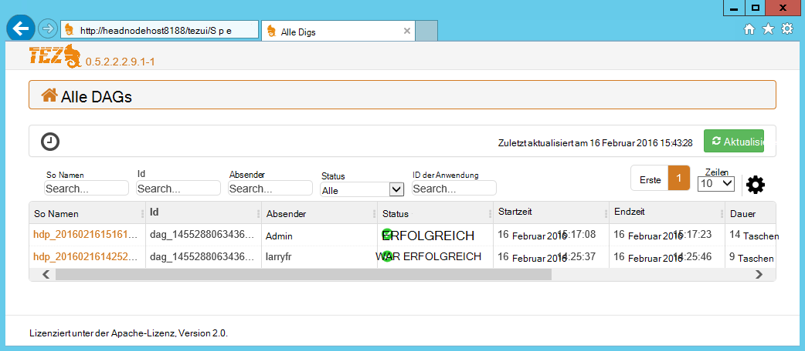
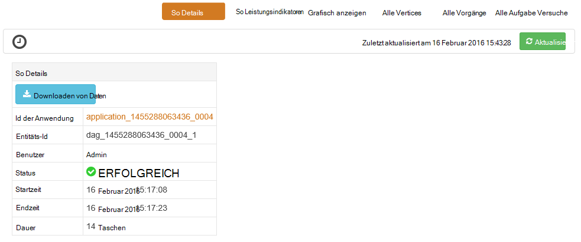
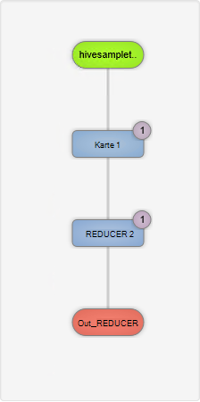
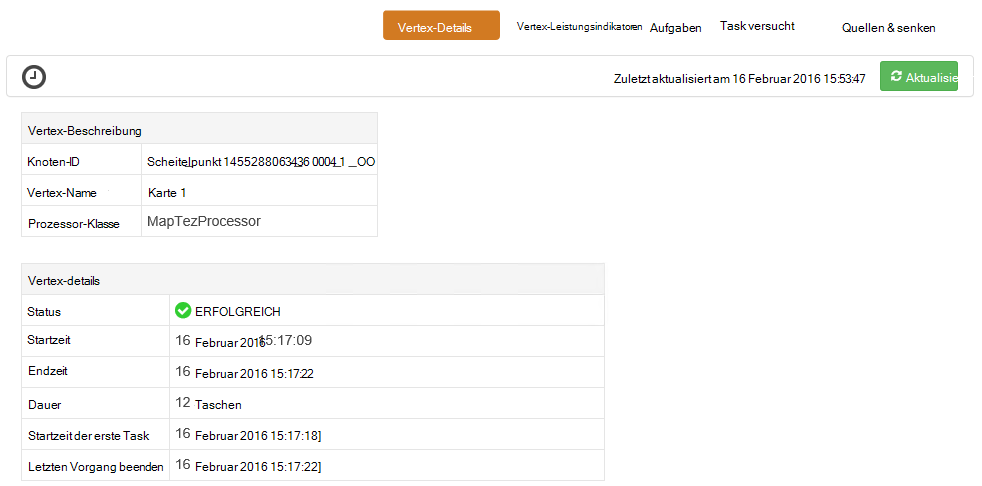
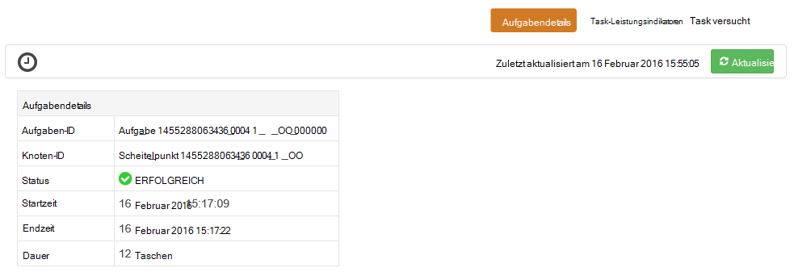

<properties
pageTitle="Verwenden Sie Tez Benutzeroberfläche mit Windows-basierten HDInsight | Azure"
description="Informationen Sie zum Tez UI Tez Aufträge auf Windows basierenden HDInsight HDInsight Debuggen verwenden."
services="hdinsight"
documentationCenter=""
authors="Blackmist"
manager="jhubbard"
editor="cgronlun"/>

<tags
ms.service="hdinsight"
ms.devlang="na"
ms.topic="article"
ms.tgt_pltfrm="na"
ms.workload="big-data"
ms.date="10/04/2016"
ms.author="larryfr"/>

# Verwenden Sie Tez UI zum Debuggen Tez Aufträge auf Windows-basierten HDInsight

Tez-UI ist eine Webseite zu debuggen Aufträge mit Tez als das Ausführungsmodul auf Windows basierenden HDInsight-Cluster verwendet werden können. Tez UI können Sie den Auftrag als Diagramm verbundenen Elemente visualisieren, in jedes Element Bohren und Statistiken und Informationen abzurufen.

> [AZURE.NOTE] Die Informationen in diesem Dokument ist spezifisch für Windows-basierte HDInsight-Cluster. Informationen zum Anzeigen und Debuggen Tez auf Linux-basierten HDInsight finden Sie unter [Verwendung Ambari Ansichten Tez Aufträge auf HDInsight Debuggen](hdinsight-debug-ambari-tez-view.md).

## Erforderliche Komponenten

* Eine Windows-basierte HDInsight-Cluster. Schritte zum Erstellen eines neuen Clusters finden Sie unter [Erste Schritte mit Windows-basierten HDInsight](hdinsight-hadoop-tutorial-get-started-windows.md).

    > [AZURE.IMPORTANT] Tez UI ist nur auf Windows-basierten HDInsight Cluster nach 8. Februar 2016 erstellt.

* Eine Windows-basierte Remote Desktop Client.

## Grundlegendes zu Tez

Tez ist ein erweiterbares Framework für die Datenverarbeitung in Hadoop, die schneller als herkömmliche MapReduce Verarbeitung bereitstellt. Für Windows-basierte HDInsight-Cluster ist ein optionales Modul Sie Struktur mit dem folgenden Befehl als Teil der Struktur aktivieren können:

    set hive.execution.engine=tez;

Beim Arbeiten an Tez gesendet wird, erstellt eine gesteuerte azyklische Diagramm (DAG), die Reihenfolge der Ausführung der Maßnahmen das Projekt beschreibt. Einzelne Aktionen werden auch Scheitelpunkte genannt und einen Teil der gesamten Auftrag ausführen. Die tatsächliche Ausführung der Arbeit durch einen Scheitelpunkt eine Aufgabe aufgerufen wird und möglicherweise mehrere Knoten im Cluster verteilt.

### Grundlagen der Benutzeroberfläche Tez

Tez-UI ist eine Webseite liefert Informationen über Prozesse, die ausgeführt werden oder zuvor war mit Tez. Können so erzeugte Tez anzeigen Verteilung auf Clustern Leistungsindikatoren für Arbeitsspeicher von Aufgaben und Eckpunkte und Fehlerinformationen verwendet. Sie können Informationen in den folgenden Szenarien bieten:

* Lang andauernde Überwachung verarbeitet den Status der Karte anzeigen und Aufgaben reduzieren.

* Verlaufsdaten für erfolgreiche oder fehlgeschlagene Vorgänge zu Verbesserung Verarbeitung oder warum nicht analysieren.

## Ein So generieren

Tez UI nur enthält Wenn ein Auftrag Daten, die mithilfe die Tez Engine läuft oder wurde in der Vergangenheit ausgeführt wurden. Einfache Struktur Abfragen können in der Regel aufgelöst werden ohne Tez jedoch komplexere Abfragen, die filtern, gruppieren, sortieren, Joins usw. normalerweise Tez erfordern.

Gehen Sie folgendermaßen vor, um eine Hive-Abfrage ausführen, die mit Tez ausgeführt wird.

1. Navigieren Sie in einem Webbrowser zu https://CLUSTERNAME.azurehdinsight.net ist der Name Ihres Clusters HDInsight durch __CLUSTERNAME__ .

2. Wählen Sie im Menü am oberen Rand der Seite den __Hive-Editor__. Dadurch wird eine Seite mit der folgenden Abfrage wird angezeigt.

        Select * from hivesampletable

    Löschen Sie die Beispielabfrage und Ersetzen Sie ihn durch folgenden.

        set hive.execution.engine=tez;
        select market, state, country from hivesampletable where deviceplatform='Android' group by market, country, state;

3. Klicken Sie auf __Absenden__ . Abschnitt __Job Sitzung__ am unteren Rand der Seite wird der Status der Abfrage angezeigt. Wählen Sie nach Statuswechsel __abgeschlossen__Link __Details anzeigen__ , um die Ergebnisse anzuzeigen. __Auftragsausgabe__ sollte etwa wie folgt aussehen:
        
        en-GB   Hessen      Germany
        en-GB   Kingston    Jamaica
        en-GB   Nairobi Area    Kenya

## Verwenden Sie die Tez-Benutzeroberfläche

> [AZURE.NOTE] Tez UI steht nur Desktop Head Clusterknoten müssen Sie Remotedesktop Verbindung zum Head-Knoten verwenden.

1. Wählen Sie aus dem [Azure-Portal](https://portal.azure.com)HDInsight Cluster. Wählen Sie oben HDInsight Blade __Remote Desktop__ -Symbol. Remote desktop Blade wird angezeigt

    

2. Wählen Sie das Blade Remote Desktop __Verbinden__ Verbindung mit dem Cluster-Head-Knoten. Wenn Sie aufgefordert werden, verwenden Sie Cluster Remotedesktop-Benutzernamen und ein Kennwort zur Authentifizierung der Verbindung.

    

    > [AZURE.NOTE] Wenn Remotedesktop Verbindung nicht aktiviert haben, geben Sie einen Benutzernamen, Kennwort und Ablaufdatum und wählen Sie Remotedesktop aktivieren __Aktivieren__ . Einmal aktiviert wurde, werden verwenden Sie die vorherigen Schritte Verbindung.

3. Sobald verbunden sind, öffnen Sie Internet Explorer auf dem Remotedesktop wählen Sie Zahnrad-Symbol oben rechts im Browser aus und wählen Sie __Kompatibilität Ansichtsoptionen__.

4. Ende __Compatibility View Settings__deaktivieren Sie das Kontrollkästchen für __Intranet-Websites in der Kompatibilitätsansicht anzeigen__ und __verwenden Microsoft-Kompatibilitätsliste__und wählen Sie __Schließen__.

5. Wechseln Sie in Internet Explorer an Http://headnodehost:8188/Tezui / /. Tez UI wird angezeigt

    

    Beim Laden der UI Tez sehen Sie eine Liste von DAGs, die derzeit ausgeführt werden, oder auf dem Cluster ausgeführt. Die Standardansicht enthält Dag Name, Id, Absender, Status, Startzeit, Endzeit, Dauer, ID der Anwendung und Warteschlange. Mehrere Spalten können mit dem Zahnradsymbol rechts auf der Seite hinzugefügt werden.

    Haben Sie nur ein Eintrag werden für die Abfrage die im vorherigen Abschnitt ausgeführt. Haben Sie mehrere Einträge können durch Eingabe von Suchkriterien in den Feldern der DAGs suchen Sie drücken __Sie die EINGABETASTE__.

4. Wählen Sie den __Namen so__ der aktuellsten so. Zeigt Informationen über die so sowie Zip JSON-Dateien herunterladen, die Informationen über die so.

    

5. Über die __So Details__ sind mehrere Links mit Informationen über die so angezeigt.

    * __So Indikatoren__ zeigt Indikatoren für diese so.
    
    * __Grafisch__ zeigt diese so grafisch dargestellt.
    
    * __Alle Vertices__ zeigt eine Liste der Scheitelpunkte in diesem so.
    
    * __Alle Aufgaben__ zeigt eine Liste der Aufgaben aus, um alle Scheitelpunkte in diesem so.
    
    * __Alle TaskAttempts__ zeigt Informationen über die Versuche zum Ausführen von Aufgaben für diese so.
    
    > [AZURE.NOTE] Bildlauf die Spaltenanzeige für Eckpunkte, Aufgaben und TaskAttempts feststellen Sie, dass Links __Leistungsindikatoren__ und __anzeigen oder downloaden Protokolle__ für jede Zeile angezeigt.

    Wenn Fehler mit dem Auftrag, werden die Details so Status fehlgeschlagen, sowie Links zu Informationen über die fehlgeschlagene Aufgabe angezeigt. Diagnoseinformationen werden unter So Details angezeigt.

7. __Grafisch__auswählen Die so grafisch angezeigt. Sie können die Maus über jeden Scheitelpunkt in der Ansicht anzuzeigenden Informationen platzieren.

    

8. Auf einem Eckpunkt lädt __Scheitelpunkt Details__ für dieses Element. Klicken Sie auf der __Karte 1__ Scheitelpunkt Informationen für dieses Element angezeigt. Wählen Sie __bestätigen__ , um die Navigation zu bestätigen.

    

9. Beachten Sie, dass nun Links oben auf der Seite die Scheitelpunkte und Aufgaben.

    > [AZURE.NOTE] Sie können diese Seite auch wieder __So__Details __Scheitelpunkt Details__auswählen und Auswählen des __Karte 1__ Scheitelpunkts ankommen.

    * __Scheitelpunkt Indikatoren__ zeigt Indikatorinformationen für diesen Vertex.
    
    * __Aufgaben__ zeigt Aufgaben für diesen Vertex.
    
    * __Task versucht__ zeigt Informationen über Versuche zum Ausführen von Aufgaben für diesen Vertex.
    
    * __Quellen und senken__ zeigt Datenquellen und Channelsenken für diesen Vertex.

    > [AZURE.NOTE] Als mit dem vorherigen Menü können Sie die Spaltenanzeige für Aufgaben, Task versucht, Quellen und Sinks__ Hyperlinks zu weiteren Informationen für jedes Element anzeigen blättern.

10. Wählen Sie __Aufgaben__, und wählen Sie das Element mit der Bezeichnung __00_000000__. Dadurch werden für diese Aufgabe __Aufgabendetails__ angezeigt. Von diesem __Task Leistungsindikatoren__ und __Task versucht__angezeigt.

    

## Nächste Schritte

Wie die Tez-Ansicht bearbeitet haben, erfahren Sie mehr über [Auf HDInsight Struktur verwenden](hdinsight-use-hive.md).

Weitere technische Informationen zu Tez finden Sie unter [Tez-Seite unter Hortonworks](http://hortonworks.com/hadoop/tez/).
