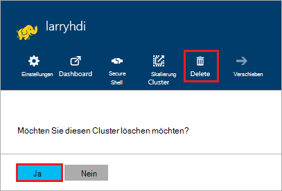

<properties
pageTitle="Einen HDInsight-Cluster löschen | Azure"
description="Informationen über die verschiedenen Arten, einen HDInsight-Cluster zu löschen."
services="hdinsight"
documentationCenter=""
authors="Blackmist"
manager="jhubbard"
editor="cgronlun"/>

<tags
ms.service="hdinsight"
ms.devlang="na"
ms.topic="article"
ms.tgt_pltfrm="na"
ms.workload="big-data"
ms.date="10/28/2016"
ms.author="larryfr"/>

#Einen HDInsight-Cluster löschen

HDInsight Cluster Abrechnung beginnt ein Cluster erstellt und wird beendet, wenn der Cluster gelöscht und anteilig pro Minute, damit Sie immer Cluster löschen sollte nicht mehr verwendet. In diesem Dokument lernen Sie das Löschen eines Clusters mithilfe der Azure-Portal, Azure PowerShell und Azure-CLI.

> [AZURE.IMPORTANT] Einen HDInsight-Cluster löschen den Cluster Azure Storage-Konten nicht. Dadurch erhalten und alle Daten vom Cluster wiederverwenden.

##Azure-Portal

1. Anmeldung bei [Azure-Portal](https://portal.azure.com) , und wählen Sie den HDInsight-Cluster. Wenn HDInsight Cluster zum Dashboard nicht fixiert ist, können Sie mit dem Suchfeld (Lupensymbol), namentlich auf der rechten Seite der Navigationsleiste suchen.

    

2. Wenn das Blade für den Cluster geöffnet wird, wählen Sie das Symbol __Löschen__ . Wenn Sie aufgefordert werden, wählen Sie __Ja__ Cluster löschen.

    

##Azure PowerShell

Verwenden Sie aus einem PowerShell den folgenden Befehl zum Löschen des Clusters:

    Remove-AzureRmHDInsightCluster -ClusterName CLUSTERNAME

Der Name des Clusters HDInsight ersetzen Sie __CLUSTERNAME__ .

##Azure CLI

Verwenden Sie eine Aufforderung folgenden Cluster löschen:

    azure hdinsight cluster delete CLUSTERNAME
    
Der Name des Clusters HDInsight ersetzen Sie __CLUSTERNAME__ .
