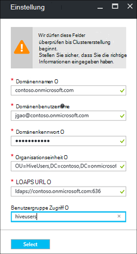

<properties
    pageTitle="Domäne HDInsight Cluster konfigurieren | Microsoft Azure"
    description="Informationen Sie zum Einrichten und Konfigurieren von Domäne HDInsight-Cluster"
    services="hdinsight"
    documentationCenter=""
    authors="saurinsh"
    manager="jhubbard"
    editor="cgronlun"
    tags=""/>

<tags
    ms.service="hdinsight"
    ms.devlang="na"
    ms.topic="article"
    ms.tgt_pltfrm="na"
    ms.workload="big-data"
    ms.date="10/26/2016"
    ms.author="saurinsh"/>

# Domäne HDInsight Cluster (Vorschau) konfigurieren

Informationen Sie zum Einrichten eines Clusters Azure HDInsight in Azure Active Directory (Azure AD) und [Apache Ranger](http://hortonworks.com/apache/ranger/) starke Authentifizierung und umfangreiche rollenbasierte (RBAC) Zugriffsrichtlinien nutzen.  Domäne HDInsight kann nur auf Linux-Cluster konfiguriert werden. Weitere Informationen finden Sie unter [Einführung Domäne HDInsight-Cluster](hdinsight-domain-joined-introduction.md).

Dieser Artikel ist der erste Lernprogramm aus einer Reihe:

- Erstellen einer verbundenen Azure AD (über Azure Directory-Domänendienste-Funktion) HDInsight Cluster mit Apache Ranger aktiviert.
- Erstellen Sie und Benutzern Sie (z. B. datenwissenschaftler) Verbindung mit ODBC-basierten Tools, z. B. Excel usw. Tableaus Hive wenden Sie Struktur Richtlinien durch Apache Ranger an. Microsoft arbeitet an anderen Arbeitslasten HBase Spark und Sturm, bald HDInsight Domäne hinzufügen.

Ein Beispiel für die endgültige Topologie sieht wie folgt aus:

Da Azure AD derzeit unterstützt nur klassische virtuelle Netzwerke (VNets) und HDInsight Linux-basierten Clustern Unterstützung nur Ressourcenmanager Azure basieren VNets, HDInsight Azure AD-Integration erfordert zwei VNets und peering dazwischen. Informationen Vergleich zwischen den beiden Modellen finden Sie unter [Azure Resource Manager im Vergleich zu klassischen Bereitstellung: verstehen Bereitstellungsmodelle und den Zustand Ihrer Ressourcen](../resource-manager-deployment-model.md). Die zwei VNets müssen Bereich Azure AD DS.

Azure Servicenamen müssen eindeutig sein. In diesem Lernprogramm werden die folgenden Namen verwendet. Contoso ist ein fiktives. Sie müssen unter einem anderen Namen *Contoso* ersetzen, wenn Sie das Lernprogramm durchgehen. 
    
**Namen:**

|Eigenschaft|Wert|
|--------|-----|
| Azure AD VNet|contosoaadvnet|
| Azure AD Virtual Machine (VM)|Contosoaadadmin. Diese VM wird zum Konfigurieren der Organisationseinheit und reverse-DNS-Zone.|
| Azure AD-Verzeichnis|contosoaaddirectory|
| Azure Active Directory-Domänennamen|Contoso (contoso.onmicrosoft.com)|
| HDInsight VNet|contosohdivnet|
| HDInsight VNet-Ressourcengruppe|contosohdirg|
| HDInsight-cluster|contosohdicluster|

Dieses Lernprogramm enthält die Schritte zum Konfigurieren eines Domäne HDInsight Clusters. Jeder Abschnitt enthält Links zu anderen Artikeln mit Hintergrundinformationen.

## Voraussetzung:

- Vertrautmachen Sie mit [Azure Active Directory-Domänendienste](https://azure.microsoft.com/services/active-directory-ds/) seine [Preise](https://azure.microsoft.com/pricing/details/active-directory-ds/) Struktur.
- Sicherstellen Sie, dass Ihr Abonnement auf der weißen Liste für Öffentliche Vorschau. Dazu senden eine e-Mail an hdipreview@microsoft.com mit Ihrem Abonnement-ID.
- Ein SSL-Zertifikat, das von einer Signaturstelle für Ihre Domäne angemeldet ist. Konfigurieren von sicheren LDAP ist das Zertifikat erforderlich. Selbstsignierte Zertifikate können verwendet werden.

## Verfahren

1. Azure AD erstellen Sie Azure klassische VNet.  
2. Erstellen und Konfigurieren von Azure AD und Azure AD DS.
3. Klassische VNet für Organisationseinheit erstellen fügen Sie einen virtuellen Computer hinzu. 
4. Erstellen einer Organisationseinheit für Azure AD DS.
5. Erstellen Sie ein HDInsight VNet im Verwaltungsmodus Azure-Ressource.
6. Reverse DNS-Zonen für Azure AD DS einrichten.
6. Die beiden Peers VNets.
7. Erstellen Sie einen HDInsight-Cluster.

> [AZURE.NOTE] Es wird vorausgesetzt, dass Sie keinen Azure AD. Wenn Sie haben, überspringen Sie Teil in Schritt 2.
    
## Ein Azure klassische VNet erstellen

In diesem Abschnitt erstellen Sie eine klassische VNet mit Azure-Portal. Im nächsten Abschnitt können Sie Ihre Azure Anzeige im klassischen VNet Azure AD DS. Weitere Informationen zu folgenden Verfahren und mit anderen Methoden VNet finden Sie unter [Erstellen eines virtuellen Netzwerks (classic) mithilfe des Azure-Portals](../virtual-network/virtual-networks-create-vnet-classic-portal.md).

**Klassische VNet erstellen**

1. Melden Sie sich auf der [Azure-Portal](https://portal.azure.com). 
2. **Klicken Sie auf** > **Netzwerk** > **virtuelles Netzwerk**.
3. Wählen Sie unter **Wählen Sie ein Bereitstellungsmodell** **klassische aus**und dann auf **Erstellen**.
4. Geben Sie oder wählen Sie die folgenden Werte:

    - **Name**: Contosoaadvnet
    - **Adressraum**: 10.1.0.0/16
    - **Subnet-Name**: Subnet1
    - **Subnetzadressbereichs**: 10.1.0.0/24
    - **Abonnement**: (Wählen Sie ein Abonnement zum Erstellen dieses VNet verwendet.)
    - **ResourceGroup**:
    - **Ort**: (Wählen Sie einen Bereich für den HDInsight-Cluster).

        > [AZURE.IMPORTANT] Sie müssen einen Speicherort auswählen, der Azure AD DS unterstützt. Weitere Informationen finden Sie unter [Produkte nach Region](https://azure.microsoft.com/en-us/regions/services/). 
        >
        > Klassische VNet und Ressource Gruppe VNet muss im Bereich Azure AD DS.

5. Klicken Sie auf **Erstellen** , um die VNet zu erstellen.

## Erstellen und Konfigurieren von Azure AD DS für Azure AD

In diesem Abschnitt werden Sie:

1. Erstellen einer Azure AD.
2. Erstellen Sie Azure AD-Benutzer. Diese Benutzer sind Domänenbenutzer. Verwenden Sie den ersten Benutzer für Azure AD HDInsight Cluster konfigurieren.  In diesem Lernprogramm sind die beiden Benutzer optional. Diese [Struktur konfigurieren Sie Richtlinien für die Domäne HDInsight-Cluster](hdinsight-domain-joined-run-hive.md) dienen Apache Ranger Richtlinien konfigurieren.
3. Erstellen Sie der AAD DC-Administratorgruppe und fügen Sie Azure AD-Benutzer zur Gruppe hinzu. Mithilfe dieser Benutzer die Organisationseinheit erstellen.
4. Azure Active Directory-Domänendienste (Azure AD DS) für Azure AD zu aktivieren.
7. Konfigurieren von LDAPS für Azure AD. Lightweight Directory Access Protocol (LDAP) wird zum Lesen und Schreiben in Azure AD verwendet.

Wenn Sie eine vorhandene Azure AD verwenden möchten, können Sie Schritte 1 und 2 überspringen.

**Azure AD erstellen**

1. Wählen Sie [klassische Azure-Portal](https://manage.windowsazure.com) **neu** > **App Services** > **Active Directory** > **Verzeichnis** > **Benutzerdefinierte**. 
3. Geben Sie oder wählen Sie die folgenden Werte:

    - **Name**: Contosoaaddirectory
    - **Domänenname**: Contoso.  Dieser Name muss eindeutig sein.
    - **Land oder Region**: Wählen Sie Ihr Land oder Ihre Region.
4. Klicken Sie auf **abgeschlossen**.

**Einen Azure AD-Benutzer erstellen**

1. [Azure-Verwaltungsportal](https://manage.windowsazure.com)klicken Sie auf **Active Directory** -> **Contosoaaddirectory**. 
3. Klicken Sie im oberen Menü auf **Benutzer** .
4. Klicken Sie auf **Benutzer hinzufügen**.
4. Geben Sie **Benutzernamen**, und klicken Sie auf **Weiter**. 
5. Konfigurieren Sie Profil. Wählen Sie **Rolle** **Globaler Administrator**; und klicken Sie dann auf **Weiter**.  Die globale Administratorrolle musste Organisationseinheiten erstellen.
6. Klicken Sie auf **Erstellen** , um ein temporäres Kennwort erhalten.
7. Eine Kopie des Kennworts, und klicken Sie auf **vollständig**. Später in diesem Lernprogramm verwenden Sie diese globalen Administrator für eine Organisationseinheit erstellen und Konfigurieren von reverse-DNS-Administrator VM anmelden.

Folgen Sie der Rolle **Benutzer** , hiveuser1 und hiveuser2 zwei weitere Benutzer erstellen. Die folgenden Benutzer werden in [Struktur konfigurieren Sie Richtlinien für die Domäne HDInsight-Cluster](hdinsight-domain-joined-run-hive.md)verwendet werden.

**AAD DC Administrators Gruppe erstellen und Hinzufügen eines Benutzers Azure AD**

1. [Azure-Verwaltungsportal](https://manage.windowsazure.com)klicken Sie auf **Active Directory** > **Contosoaaddirectory**. 
3. Klicken Sie im oberen Menü auf **Gruppen** .
4. Klicken Sie auf **Gruppe hinzufügen** oder **Gruppe hinzufügen**.
5. Geben Sie oder wählen Sie die folgenden Werte:

    - **Name**: AAD DC Administrators.  Ändern Sie nicht den Namen der Gruppe.
    - **Gruppentyp**: Sicherheit.
6. Klicken Sie auf **abgeschlossen**.
7. Klicken Sie auf **AAD DC Administrators** , um die Gruppe zu öffnen.
8. Klicken Sie auf **Mitglieder hinzufügen**.
9. Wählen Sie den ersten Benutzer, den Sie im vorherigen Schritt erstellt haben, und klicken Sie auf **vollständig**.
10. Schritte zum Erstellen einer anderen Gruppe mit dem Namen **HiveUsers**und zwei Struktur Benutzer zur Gruppe hinzufügen.

Weitere Informationen finden Sie unter [Azure Active Directory-Domänendienste (Vorschau) - ' AAD DC Administrators' Gruppe erstellen](../active-directory-domain-services/active-directory-ds-getting-started.md).

**Azure AD DS für Ihre Azure Anzeige aktivieren**

1. [Azure-Verwaltungsportal](https://manage.windowsazure.com)klicken Sie auf **Active Directory** > **Contosoaaddirectory**. 
3. Klicken Sie im oberen Menü auf **Konfigurieren** .
4. **Domänendienste**scrollen und die folgende Werte festlegen:

    - **Domäne dieses Verzeichnis aktiviert**: Ja.
    - **DNS-Domänennamen von Domänendiensten**: standardmäßig DNS-Namen der Azure-Verzeichnis zeigt. Beispielsweise contoso.onmicrosoft.com.
    - **Domänendienste in diesem virtuellen Netzwerk verbinden**: Wählen Sie das klassische virtuelle Netzwerk erstellen, z. B. **Contosoaadvnet**.
    
6. Klicken Sie am unteren Rand der Seite **Speichern** . Sehen Sie **Ausstehend...** neben **Domäne dieses Verzeichnis aktiviert**.  
7. Warten Sie, bis **Ausstehend...** verschwindet, und **IP-Adresse** erhält. Zwei IP-Adressen abrufen ausgefüllt. Die IP-Adressen der Domänencontroller von den Domänendiensten bereitgestellt sind. Jede IP-Adresse wird angezeigt, wenn der entsprechende Domänencontroller bereitgestellt und betriebsbereit ist. Notieren Sie sich die beiden IP-Adressen. Diese werden später benötigt werden.

Weitere Informationen finden Sie in [Azure AD-Domäne Dienstleistungen (Vorschau) - Azure AD-Domäne aktivieren](../active-directory-domain-services/active-directory-ds-getting-started-enableaadds.md).

**Kennwort synchronisieren**

Verwenden Sie Ihre eigene Domäne müssen Sie das Kennwort zu synchronisieren. Siehe [Aktivieren Kennwortsynchronisation in Azure AD-Domänendienste für Cloud nur Azure AD-Verzeichnis](../active-directory-domain-services/active-directory-ds-getting-started-password-sync.md).

**Konfigurieren von LDAPS für Azure AD**

1. Abrufen eines SSL-Zertifikats von einer Signaturstelle für Ihre Domäne angemeldet ist. Selbstsignierte Zertifikate können verwendet werden. Wenn Sie ein SSL-Zertifikat nicht, wenden Sie sich an hdipreview@microsoft.com für eine Ausnahme.
1. [Azure-Verwaltungsportal](https://manage.windowsazure.com)klicken Sie auf **Active Directory** > **Contosoaaddirectory**. 
3. Klicken Sie im oberen Menü auf **Konfigurieren** .
4. Ans **-Domänendienste**.
5. Klicken Sie auf **Zertifikat konfigurieren**.
6. Führen Sie die Anweisung, die Zertifikatdatei und das Kennwort angeben. Sehen Sie **Ausstehend...** neben **Domäne dieses Verzeichnis aktiviert**.  
7. Warten Sie, bis **Ausstehend...** verschwindet, und **Sichere LDAP-Zertifikat** erhalten.  Dies kann bis zu 10 Minuten dauern.
 
>[AZURE.NOTE] Wenn einige Hintergrundaufgaben auf Azure AD DS ausgeführt werden, möglicherweise einen Fehler beim Hochladen des Zertifikats angezeigt - <i>Es ist eine Operation für diesen Mandanten. Bitte versuchen Sie später erneut</i>.  Wenn dieser Fehler auftritt, versuchen Sie nach einiger Zeit erneut. Die zweite Domain Controller IP dauert bis zu 3 Stunden bereitgestellt werden.

Weitere Informationen finden Sie unter [Konfigurieren Sie sichere LDAP (LDAPS) für eine Domäne Azure Active Directory-Domänendienste verwaltet](../active-directory-domain-services/active-directory-ds-admin-guide-configure-secure-ldap.md).

## Konfigurieren einer Organisationseinheit und reverse-DNS

In diesem Abschnitt Azure AD VNet einen virtuellen Computer hinzufügen und konfigurieren eine Organisationseinheit und reverse-DNS Verwaltung auf diesem virtuellen Computer installieren. Umgekehrte DNS-Suche ist für die Kerberos-Authentifizierung erforderlich.

**Zum Erstellen eines virtuellen Computers in das virtuelle Netzwerk**

1. Wählen Sie [klassische Azure-Portal](https://manage.windowsazure.com) **neu** > **berechnen** > **virtuellen** > **Aus Galerie**.
3. Wählen Sie ein Bild, und klicken Sie auf **Weiter**.  Wenn Sie sich nicht kennen, wählen Sie Standard, **Windows Server 2012 R2 Datacenter**.
4. Geben Sie oder wählen Sie die folgenden Werte:

    - Virtual Machine-Name: **contosoaadadmin**
    - Tier: **grundlegende**
    - Neuer Benutzername: (Benutzername)
    - Kennwort: (Kennwort)
    
    Bitte beachten Sie den Benutzernamen und das Kennwort ist der lokale Administrator.
    
5. Klicken Sie auf **Weiter**
6. **Region-virtuellen Netzwerk**wählen Sie neue virtuelle Netzwerk, die, das Sie im letzten Schritt (Contosoaadvnet) erstellt, und dann auf **Weiter**.
7. Klicken Sie auf **abgeschlossen**.

**RDP der VM**

1. [Azure-Verwaltungsportal](https://manage.windowsazure.com)klicken Sie auf **virtuellen Maschinen** > **Contosoaadadmin**.
3. Klicken Sie im oberen Menü auf **Dashboard** .
4. Klicken Sie auf **Verbindung** vom unteren Rand der Seite.
5. Führen Sie die Anweisung und verwenden Sie lokaler Administrator Benutzernamen und Kennwort für die Verbindung.

**VM Azure AD-Domäne hinzufügen**

1. Die RDP-Sitzung klicken Sie auf **Start**und dann auf **Server-Manager**.
2. Klicken Sie im linken Menü auf **Lokalen Server** .
3. Wählen Sie Arbeitsgruppe **Arbeitsgruppe**.
4. Klicken Sie auf **Ändern**.
5. **Klicken Sie auf **Domäne**und geben Sie **contoso.onmicrosoft.com ein**.**
6. Geben Sie die Anmeldeinformationen des Benutzers, und klicken Sie dann auf **OK**.
7. Klicken Sie auf **OK**.
8. Klicken Sie auf **OK** zum Neustart des Computers übereinstimmen.
9. Klicken Sie auf **Schließen**.
10. Klicken Sie auf **jetzt neu starten**.

Weitere Informationen finden Sie unter [ein Windows Server virtueller Computer einer verwalteten Domäne beitreten](../active-directory-domain-services/active-directory-ds-admin-guide-join-windows-vm.md).

**Active Directory-Verwaltungstools und DNS-Tools installieren**

1. RDP in **Contosoaadadmin** mit Azure AD-Benutzerkonto.
2. Klicken Sie auf **Start**, und klicken Sie dann auf **Server-Manager**.
3. Klicken Sie im linken Menü auf **Dashboard** .
4. Klicken Sie auf **Verwalten**und dann auf **Add Rollen und Features**.
5. Klicken Sie auf **Weiter**.
6. Wählen Sie **Rolle oder Funktion-basierten Installation**und klicken Sie dann auf **Weiter**.
7. Wählen Sie der aktuellen virtuellen Maschine aus den Server aus und auf **Weiter**.
8. Klicken Sie auf **Weiter** um Rollen zu überspringen.
9. Erweitern Sie **Remoteserver-Verwaltungstools**erweitern Sie **Rollenverwaltungstools**, wählen Sie **AD DS und AD LDS-Tools** und **DNS-Server-Tools**und klicken Sie auf **Weiter**. 
10. Klicken Sie auf **Weiter**
10. Klicken Sie auf **Installieren**.

Weitere Informationen finden Sie unter [Installation von Active Directory-Verwaltungstools auf dem virtuellen Computer](../active-directory-domain-services/active-directory-ds-admin-guide-administer-domain.md#task-2---install-active-directory-administration-tools-on-the-virtual-machine).

**Reverse DNS konfigurieren**

1. RDP, Contosoaadadmin mit Azure AD-Benutzerkonto.
2. Klicken Sie auf **Start**, klicken Sie auf **Verwaltung**, und klicken Sie auf **DNS**. 
3. Klicken Sie auf **Nein** zum Hinzufügen von ContosoAADAdmin zu überspringen.
4. **Wählen Sie **die folgenden Computer**und geben Sie die IP-Adresse den ersten DNS-Server bereits konfiguriert.**  Sie sehen, dass im linken DC und DNS hinzugefügt.
3. Den Domänencontroller/DNS-Server und **anschließend** **Reverse-Lookupzonen**Maustaste. Assistenten wird geöffnet.
4. Klicken Sie auf **Weiter**.
5. Wählen Sie **primäre Zone**, und klicken Sie auf **Weiter**.
6. **Alle DNS-Server auf Domänencontrollern in dieser Domäne**wählen Sie aus und klicken Sie dann auf **Weiter**.
6. Wählen Sie **IPv4-Reverse-Lookupzone**, und klicken Sie auf **Weiter**.
7. **Netzwerk-ID**Geben Sie das Präfix für den Netzwerkbereich HDInsight VNET und klicken Sie dann auf **Weiter**. HDInsight VNet erstellen Sie im folgenden Abschnitt.
8. Klicken Sie auf **Weiter**.
9. Klicken Sie auf **Weiter**.
10. Klicken Sie auf **Fertig stellen**.

Erstellte Organisationseinheit wird anschließend beim Erstellen des HDInsight-Clusters verwendet. Hadoop System Benutzer- und Computerkonten werden in dieser Organisationseinheit befinden.

**Erstellen Sie eine Organisationseinheit (OU) in einer verwalteten Domäne Azure Active Directory-Domänendienste**

1. RDP in **Contosoaadadmin** mit dem Domänenkonto **AAD DC** -Administratorengruppe gehört.
2. Klicken Sie auf **Start**, klicken Sie auf **Verwaltung**, und klicken Sie dann auf **Active Directory-Verwaltungscenter**.
5. Klicken Sie auf den Domänennamen im linken Bereich. Z. B. Contoso.
6. Klicken Sie unter dem Domänennamen im **Aufgabenbereich** auf **neu** und dann auf **Organisationseinheit**.
7. Geben Sie einen Namen, z. B. **HDInsightOU**, und klicken Sie dann auf **OK**. 

Weitere Informationen finden Sie unter [Erstellen einer Organisationseinheit (OU) auf einer Domäne Azure Active Directory Domain Services verwaltet](../active-directory-domain-services/active-directory-ds-admin-guide-create-ou.md).

## Ein Ressourcen-Manager VNet für HDInsight-Cluster erstellen

In diesem Abschnitt erstellen Sie eine Azure-Ressourcen-Manager-VNet, die für den HDInsight-Cluster verwendet werden. Weitere Informationen zum Erstellen von Azure VNET mit anderen Methoden finden Sie unter [Erstellen eines virtuellen Netzwerks](../virtual-network/virtual-networks-create-vnet-arm-pportal.md)

Konfigurieren Sie nach Erstellung des Vnets Resource Manager VNet verwenden die gleichen DNS-Server für Azure AD VNet. Wenn Sie die Schritte in diesem Lernprogramm der klassischen VNet und Azure AD werden DNS-Server 10.1.0.4 und 10.1.0.5.

**Ein Ressourcen-Manager-VNet erstellen**

1. Melden Sie sich auf der [Azure-Portal](https://portal.azure.com).
2. Klicken Sie auf **neu**, **Netzwerke**und **virtuelle Netzwerk**. 
3. Wählen Sie unter **Wählen Sie ein Bereitstellungsmodell** **Ressourcenmanager aus**und dann auf **Erstellen**.
4. Geben Sie ein oder wählen Sie die folgenden Werte aus:

    - **Name**: Contosohdivnet
    - **Adressraum**: 10.2.0.0/16. Sicherstellen Sie, dass der Bereich mit den IP-Adressbereich des klassischen VNet überlappen kann.
    - **Subnet-Name**: Subnet1
    - **Subnetzadressbereichs**: 10.2.0.0/24
    - **Abonnement**: (Wählen Sie Ihre Azure-Abonnement).
    - **Ressourcengruppe**: Contosohdirg
    - **Ort**: (Wählen Sie dort Azure AD VNet, z. B. Contosoaadvnet.)

5. Klicken Sie auf **Erstellen**.

**Konfigurieren von DNS für den Ressourcen-Manager VNet**

1. [Azure-Portal](https://portal.azure.com)klicken Sie auf **Weitere Dienste** -> **virtuelle Netzwerke**. Sicherstellen, dass keine **virtuelle Netzwerke (classic)**klicken.
2. Klicken Sie auf **Contosohdivnet**.
4. Klicken Sie auf **DNS-Server** von der linken Seite des neuen Blades.
6. Klicken Sie auf **Benutzerdefiniert**, und geben Sie die folgenden Werte:

    - 10.1.0.4
    - 10.1.0.5

    DNS-Adressen muss die DNS-Server in Azure AD VNet (klassische VNet).
7. Klicken Sie auf **Speichern**.

## Peer Azure AD VNet und HDInsight VNet

**Zu zwei VNet**

1. Melden Sie sich auf der [Azure-Portal](https://portal.azure.com).
2. Klicken Sie im linken Menü auf **Weitere Dienste** .
3. Klicken Sie auf **virtuelle Netzwerke**. Klicken Sie nicht auf **virtuelle Netzwerke (classic)**.
4. Klicken Sie auf **Contosohdivnet**.  Dies ist die HDInsight VNet.
5. Klicken Sie im linken Menü des Blades auf **Peerings** .
6. Klicken Sie im oberen Menü auf **Hinzufügen** . Das Blade **peering hinzufügen** wird geöffnet.
7. Festlegen Sie auf dem Blatt **Hinzufügen peering** oder wählen Sie die folgenden Werte:

    - **Name**: ContosoAADHDIVNetPeering
    - **Virtuelle Netzwerk-Bereitstellungsmodell**: Klassisch
    - **Abonnement**: die Classic (Azure AD) Vnet zum Abonnement wählen.
    - **Virtual Network**: Contosoaadvnet.
    - **Virtuelles Netzwerkzugriff**: (überprüfen)
    - **Zulassen Datenverkehr weitergeleitet**: (überprüfen). Lassen Sie die beiden Kontrollkästchen deaktiviert.

8. Klicken Sie auf **OK**.

## HDInsight Cluster erstellen

In diesem Abschnitt erstellen Sie einen Linux-basierten Hadoop Cluster in HDInsight mit der Azure-Portal oder [Ressourcenmanager Azure-Vorlage](../resource-group-template-deploy.md). Andere Methoden zur Erstellung und Verständnis die Standardeinstellungen finden Sie unter [Erstellen HDInsight-Cluster](hdinsight-hadoop-provision-linux-clusters.md). Weitere Informationen über Ressourcen-Manager-Vorlage in HDInsight Hadoop Cluster erstellen finden Sie unter [Erstellen Hadoop Cluster Resource Manager Vorlagen HDInsight](hdinsight-hadoop-create-windows-clusters-arm-templates.md)

**Einen Domäne HDInsight Cluster mit Azure-Portal erstellen**

1. Melden Sie sich auf der [Azure-Portal](https://portal.azure.com).
2. Klicken Sie auf **neu**, **Intelligenz + Analytics**und **HDInsight**.
3. **Neue HDInsight-Cluster** Blatt geben Sie ein oder wählen Sie die folgenden Werte:

    - **Cluster-Name**: Geben Sie einen neuen Clusternamen für die Domäne HDInsight-Cluster.
    - **Abonnement**: Wählen Sie zum Erstellen dieser Cluster Azure-Abonnement.
    - **Cluster-Konfiguration**:

        - **Clustertyp**: Hadoop. Domäne HDInsight ist derzeit nur auf unterstützten Hadoop Cluster.
        - **Betriebssystem**: Linux.  HDInsight Domäne wird nur auf Linux-basierten HDInsight-Cluster unterstützt.
        - **Version**: Hadoop 2.7.3 (HDI 3.5). HDInsight Domäne wird nur auf HDInsight Clusterversion 3.5 unterstützt.
        - **Clustertyp**: PREMIUM

        Klicken Sie auf Speichern **Wählen** .

    - **Anmeldeinformationen**: Anmeldeinformationen für den clusterbenutzer und SSH-Benutzer konfigurieren.
    - **Datenquelle**: erstellen ein neues Speicherkonto oder ein Storage-Konto als Standardkonto Speicher für HDInsight-Cluster. Der Speicherort muss mit zwei VNets übereinstimmen.  Der Speicherort ist auch die HDInsight-Cluster.
    - **Preise**: Wählen Sie die Arbeitskraft Knoten des Clusters.
    - **Erweiterte Konfigurationen**: 

        - **Domäne beitreten und Vnet-Teilnetz**: 

            - **Einstellungen**: 

                - **Domänenname**: contoso.onmicrosoft.com
                - **Domänenbenutzername**: Geben Sie einen Domänenbenutzernamen ein. Dieser Domäne müssen die folgenden Berechtigungen: Computer der Domäne beitreten und in Organisationseinheit oben konfiguriert; Erstellen Sie Service Sicherheitsprincipals in der Organisationseinheit, die Sie zuvor konfiguriert. Reverse-DNS-Einträge zu erstellen. Diese Domänenbenutzer werden dem Administrator dieser Domäne HDInsight-Cluster.
                - **Kennwort**: Geben Sie das Kennwort des Benutzers.
                - **Organisationseinheit**: distinguished Name der Organisationseinheit Verknüpfung bereits konfiguriert. Beispiel: OU = HDInsightOU, DC = Contoso, DC = Onmicrosoft, DC = com
                - **LDAPS-URL**: Ldaps://contoso.onmicrosoft.com:636
                - **Benutzergruppe Zugriff**: Geben Sie die Sicherheitsgruppe, deren Benutzer WAN-Synchronisierung mit dem Cluster. Beispielsweise HiveUsers.

                Klicken Sie auf Speichern **Wählen** .

                
            - **Virtuelles Netzwerk**: Contosohdivnet
            - **Subnetzmaske**: Subnet1

            Klicken Sie auf Speichern **Wählen** .       
        Klicken Sie auf Speichern **Wählen** .
    - **Gruppe**: Wählen Sie die Ressourcengruppe für HDInsight VNet (Contosohdirg) verwendet.

4. Klicken Sie auf **Erstellen**.  

Eine weitere Möglichkeit zum Erstellen von Domäne HDInsight-Cluster ist Azure Ressourcenmanagement-Vorlage verwenden. Das folgende Verfahren veranschaulicht:

**So erstellen Sie einen Domäne HDInsight Cluster Ressourcenmanagement Vorlage**

1. Klicken Sie zum Öffnen einer Vorlage Ressourcenmanager in Azure-Portal auf folgende. Die Ressourcen-Manager-Vorlage befindet sich ein Blob für den öffentlichen Container. 

    

2. Blatt **Parameter** eingeben:

    - **Abonnement**: (Wählen Sie Ihre Azure-Abonnement).
    - **Ressourcengruppe**: Klicken Sie auf **vorhandene**, und geben Sie mit die gleichen Ressourcengruppe.  Beispielsweise Contosohdirg. 
    - **Lage**: einen Ressource Gruppe Speicherort angeben.
    - **Cluster-Name**: Geben Sie einen Namen für den Cluster Hadoop, die Sie erstellen. Beispielsweise Contosohdicluster.
    - **Clustertyp**: Wählen Sie einen Cluster.  Der Standardwert ist **Hadoop**.
    - **Ort**: Wählen Sie einen Speicherort für den Cluster.  Das Standardkonto Speicher verwendet denselben Speicherort.
    - **Anzahl der Worker-Clusterknoten**: Wählen Sie die Anzahl der workerknoten.
    - **Cluster-Benutzername und Kennwort**: der Standard-Anmeldename ist **Admin**.
    - **SSH-Benutzername und Kennwort**: der Standard-Benutzername ist **Sshuser**.  Sie können sie umbenennen. 
    - **Virtuelle Netzwerk-Id**: /subscriptions/&lt;SubscriptionID > /resourceGroups/&lt;ResourceGroupName > /providers/Microsoft.Network/virtualNetworks/&lt;VNetName >
    - **Virtuelle Netzwerk-Subnetz**: /subscriptions/&lt;SubscriptionID > /resourceGroups/&lt;ResourceGroupName > /providers/Microsoft.Network/virtualNetworks/&lt;VNetName > Subnetze/Subnet1
    - **Domänenname**: contoso.onmicrosoft.com
    - **Organisation Einheit DN**: OU = HDInsightOU, DC = Contoso, DC = Onmicrosoft, DC = com
    - **Cluster Benutzer Gruppe D Ns**: "\"CN = HiveUsers, OU = AADDC Users, DC =<DomainName>, DC = Onmicrosoft, DC = com\""
    - **LDAPUrls**: ["Ldaps://contoso.onmicrosoft.com:636"]
    - **DomainAdminUserName**: (Benutzername Domäne Admin)
    - **"DomainAdminPassword"**: (Geben Sie das Benutzerkennwort Domäne Admin)
    - **Ich stimme den allgemeinen Geschäftsbedingungen genannten**: (überprüfen)
    - **PIN Dashboard**: (überprüfen)

6. Klicken Sie auf **kaufen**. Sie sehen eine neue Tile Titel **Bereitstellung bereitstellen**. Es dauert etwa 20 Minuten Erstellen eines Clusters. Nach Erstellung des Clusters können Sie Cluster Blade im Portal öffnen klicken.

Nach Abschluss des Lernprogramms sollten Sie Cluster löschen. Mit HDInsight Ihre Daten in Azure Storage gespeichert, einen Cluster sicher löschen können, wenn es nicht verwendet wird. Sie sind auch für einen HDInsight-Cluster berechnet, auch wenn es nicht verwendet wird. Da die Gebühren für den Cluster mehr als die Kosten für Speicher sind, ist es wirtschaftlich Cluster löschen, wenn sie nicht verwendet werden. Hinweise Löschen eines Clusters finden Sie [in HDInsight mit Azure-Portal verwalten Hadoop Cluster](hdinsight-administer-use-management-portal.md#delete-clusters).

## Nächste Schritte

- Konfigurieren von Richtlinien Struktur und Hive-Abfragen ausführen, finden Sie unter [Richtlinien für Domäne HDInsight Cluster Struktur konfigurieren](hdinsight-domain-joined-run-hive.md).
- Struktur Abfragen über SSH auf Domäne HDInsight-Cluster ausführen, finden Sie unter [Verwenden SSH mit Linux-basierten Hadoop auf HDInsight von Linux, Unix oder OS X](hdinsight-hadoop-linux-use-ssh-unix.md#connect-to-a-domain-joined-hdinsight-cluster).
