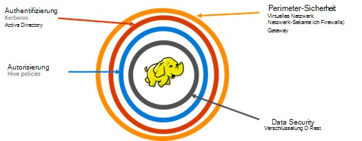

<properties
    pageTitle="Sichere HDInsight Übersicht | Microsoft Azure"
    description="Weitere Informationen..."
    services="hdinsight"
    documentationCenter=""
    authors="saurinsh"
    manager="jhubbard"
    editor="cgronlun"
    tags="azure-portal"/>

<tags
    ms.service="hdinsight"
    ms.devlang="na"
    ms.topic="hero-article"
    ms.tgt_pltfrm="na"
    ms.workload="big-data"
    ms.date="10/24/2016"
    ms.author="saurinsh"/>

# Einführung HDInsight Domäne Cluster (Vorschau)

Azure HDInsight bis heute nur einen einzigen lokalen Benutzeradministration unterstützt Dies funktioniert hervorragend für kleinere Anwendungsteams oder Abteilung. Hadoop Arbeitslasten mehr Popularität im Bereich Enterprise basiert, wurde die Notwendigkeit Enterprise Klasse Funktionen wie active Directory-Authentifizierung, Unterstützung für mehrere Benutzer und rollenbasierte Zugriffskontrolle zunehmend an Bedeutung. Domäne HDInsight-Cluster können Sie einen HDInsight-Cluster ein Active Directory-Domäne erstellen, konfigurieren Sie eine Liste der Mitarbeiter von Unternehmen über Azure Active Directory HDInsight Cluster Anmeldung authentifizieren können. Außerhalb des Unternehmens nicht anmelden oder HDInsight Cluster zugreifen. Organisations-Admins können rollenbasierte Zugriffskontrolle für Struktur Sicherheit mit [Apache Ranger](http://hortonworks.com/apache/ranger/), daher Beschränken des Zugriffs auf Daten nur so viel wie nötig. Schließlich kann der Administrator Datenzugriff von Mitarbeitern und alle Änderungen Zugriffsrichtlinien, um ein hohes Maß an Steuerung der Unternehmensressourcen überwachen.

[AZURE.NOTE]> Die neuen Features in dieser Vorschau beschrieben stehen nur für Linux-basierte HDInsight-Cluster Struktur Arbeitslast. Andere Arbeitslasten wie HBase, Spark Sturm und Kafka werden in künftigen Versionen aktiviert. 

## Vorteile

Enterprise Security enthält vier großen Säulen Sicherheit, Authentifizierung, Autorisierung und Verschlüsselung.

.

### Sicherheit

Sicherheit in HDInsight virtuelle Netzwerke mit Gateway Service erfolgt. Heute ein Organisationsadministrator erstellen HDInsight-Cluster in einem virtuellen Netzwerk und Netzwerk-Sicherheitsgruppen (eingehende oder ausgehende Firewallregeln) verwenden, um Zugriff auf das virtuelle Netzwerk. Nur IP-Adressen in eingehenden Firewall-Regeln definiert werden mit HDInsight-Cluster, damit Sicherheit kommunizieren. Perimeter-Sicherheit erfolgt über Gateway Service. Das Gateway wird als erste Verteidigungslinie für jede eingehende Anforderung HDInsight Cluster fungiert. Akzeptiert die Anfrage, prüft sie und können nur dann die Anforderung an die anderen Knoten im Cluster, damit Sicherheit an andere Knoten des Clusters und Datentyp übergeben.

### Authentifizierung

Organisations-Admins kann mit dieser öffentlichen Vorschau einen Domäne HDInsight-Cluster in einem [virtuellen Netzwerk](https://azure.microsoft.com/services/virtual-network/)bereitstellen. HDInsight-Clusterknoten werden die Domäne des Unternehmens angehören. Dies geschieht durch Verwendung von [Azure Active Directory Domain Services](https://technet.microsoft.com/library/cc770946.aspx). Alle Knoten des Clusters werden Mitglied einer Domäne, die das Unternehmen verwaltet. Mit diesem Setup können die Mitarbeiter die Clusterknoten mit ihren Anmeldeinformationen anmelden. Ihre Anmeldeinformationen können sie um mit anderen genehmigten Endpunkten Farbton Ambari Ansichten, ODBC, JDBC, PowerShell und REST-APIs interagieren mit dem Cluster zu authentifizieren. Der Administrator hat vollständige Kontrolle über die Begrenzung der Benutzer interagiert mit dem Cluster über diese Endpunkte.

### Autorisierung

Eine bewährte Methode, gefolgt von den meisten Unternehmen hat nicht alle Mitarbeiter Zugriff auf alle Enterprise-Ressourcen. Auch mit dieser Version Definieren der Administrator Zugriffsrichtlinien für die Clusterressourcen rollenbasierte. Beispielsweise können der Admin [Apache Ranger](http://hortonworks.com/apache/ranger/) um Zugriff Zugriffsrichtlinien für die Struktur festzulegen. Diese Funktionalität sorgt dafür, dass Mitarbeiter nur können erfolgreich in ihrer Aufgaben benötigten Daten. SSH-Zugriff auf den Cluster steht nur für den Administrator beschränkt.

### Überwachung

Mit HDInsight Clusterressourcen vor nicht autorisierten Benutzern schützen und Sichern der Daten muss Überwachung der Zugriff auf die Clusterressourcen und die Daten nicht autorisierte oder unbeabsichtigten Zugriff auf die Ressourcen verfolgen. Mit dieser Vorschau der Administrator einsehen und Zugriff auf HDInsight Ressourcen und Daten. Der Administrator auch einsehen und alle Änderungen, die Zugriffsrichtlinien Apache Ranger unterstützt Endpunkte durchgeführt. Domäne HDInsight Cluster verwendet bekannte Apache Ranger UI Audit-Protokolle durchsuchen. Im Back-End verwendet Ranger [Apache Solr]( http://hortonworks.com/apache/solr/) für die Durchsuchung und die Protokolle.

### Verschlüsselung

Datenschutz ist wichtig für Besprechung Sicherheitsrichtlinien und Compliance und und Einschränken des Zugriffs auf Daten von nicht autorisierten Mitarbeitern, es sollte ebenfalls gesichert durch verschlüsseln. Sowohl die Datenspeicher für HDInsight Cluster Azure Storage Blob und Azure See Datenspeicher unterstützt transparente serverseitige [Verschlüsselung von Daten](../storage/storage-service-encryption.md) im Ruhezustand. Sichere HDInsight Cluster nahtlos mit dieser Server Seite Verschlüsselung von Daten Rest-Funktion verwendet werden.

## Nächste Schritte

- Einen Domäne HDInsight Cluster konfigurieren, finden Sie unter [Konfigurieren Domäne HDInsight-Cluster](hdinsight-domain-joined-configure.md).
- Verwalten einer Domäne HDInsight-Cluster finden Sie unter [Verwalten von Domäne HDInsight-Cluster](hdinsight-domain-joined-manage.md).
- Konfigurieren von Richtlinien Struktur und Hive-Abfragen ausführen, finden Sie unter [Richtlinien für Domäne HDInsight Cluster Struktur konfigurieren](hdinsight-domain-joined-run-hive.md).
- Struktur Abfragen über SSH auf Domäne HDInsight-Cluster ausführen, finden Sie unter [Verwenden SSH mit Linux-basierten Hadoop auf HDInsight von Linux, Unix oder OS X](hdinsight-hadoop-linux-use-ssh-unix.md#connect-to-a-domain-joined-hdinsight-cluster).