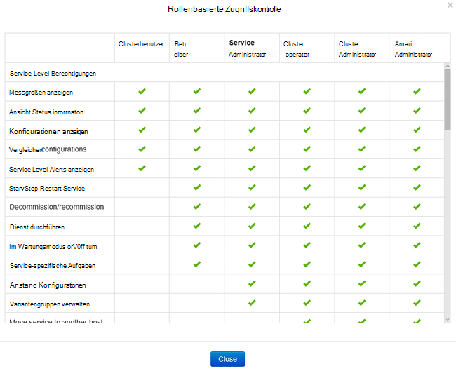
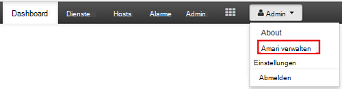
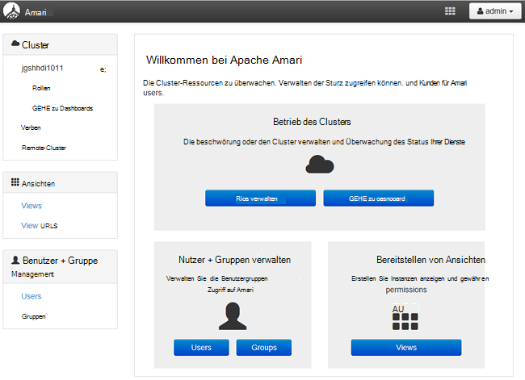
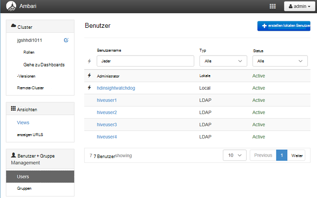
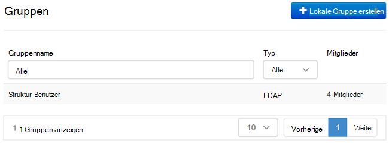
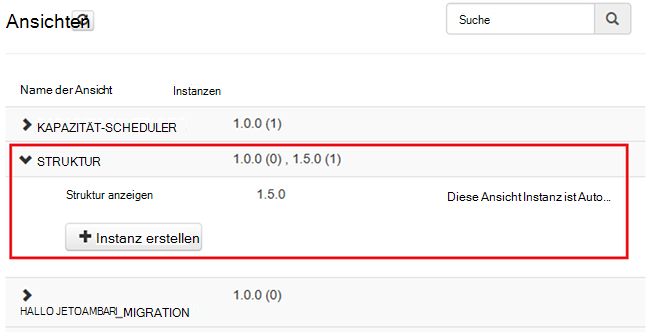
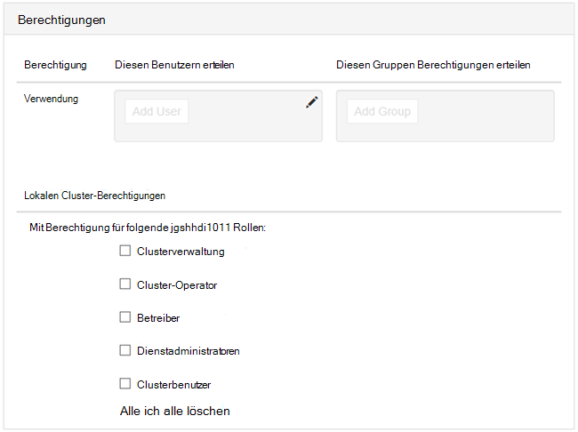

<properties
    pageTitle="Domäne HDInsight Cluster verwalten | Microsoft Azure"
    description="Domäne HDInsight Cluster verwalten"
    services="hdinsight"
    documentationCenter=""
    authors="saurinsh"
    manager="jhubbard"
    editor="cgronlun"
    tags=""/>

<tags
    ms.service="hdinsight"
    ms.devlang="na"
    ms.topic="article"
    ms.tgt_pltfrm="na"
    ms.workload="big-data"
    ms.date="10/25/2016"
    ms.author="saurinsh"/>

# Verwalten der Domäne HDInsight-Cluster (Vorschau)

Lernen Sie die Benutzer und Rollen in Domäne HDInsight und HDInsight-Cluster Domäne verwalten.

## Benutzer der Domäne HDInsight-Cluster

Ein HDInsight-Cluster nicht Domänencomputern hat zwei Benutzerkonten, die während der Erstellung des Clusters erstellt werden:

- **Ambari-Admin**: dieses Konto ist auch *Hadoop* oder *HTTP-Benutzer*. Dieses Konto kann zur https:// Ambari Anmelden verwendet&lt;Clustername >. azurehdinsight.net. Auch kann verwendet werden, Abfragen auf Ambari Ansichten und Ausführen von Aufträgen über externe Tools (PowerShell, Templeton, Visual Studio) mit Struktur-ODBC-Treiber und BI-Tools (z. B. Excel, PowerBI oder Tableaus) authentifizieren.

- **SSH-Benutzer**: dieses Konto mit SSH verwendet werden kann und Sudo Befehle ausführen. Es verfügt über Root-Rechte auf Linux VMs.

Ein Domäne HDInsight Cluster hat drei neue Benutzer Ambari Admin und SSH-Benutzer.

- **Rangers Admin**: dieses Konto ist das lokale Administratorkonto Apache Ranger. Es ist nicht active Directory-Domäne-Benutzer. Dieses Konto kann verwendet werden, Richtlinien einrichten und andere Benutzer Admins oder delegierte Administratoren (so dass diese Benutzer Richtlinien verwalten können). Standardmäßig der Benutzername ist *Admin* und das Kennwort ist das Administratorkennwort Ambari identisch. Das Kennwort kann auf der Seite Einstellungen Ranger aktualisiert werden.

- **Cluster Administrator Domain**: dieses Konto ist ein Benutzer active Directory Domäne als Ambari sowie Ranger Hadoop Cluster Administrator. Sie müssen Anmeldeinformationen des Benutzers während der Erstellung des Clusters angeben. Dieser Benutzer verfügt über die folgenden Berechtigungen:

    - Beitreten Sie Computer der Domäne und sie innerhalb der Organisationseinheit, die Sie während der Erstellung des Clusters angeben.
    - Erstellen Sie Service-Prinzipale in der Organisationseinheit, die Sie während der Erstellung des Clusters angeben. 
    - Reverse-DNS-Einträge zu erstellen.

    Hinweis die AD-Benutzer können diese Berechtigungen. 

    Gibt es einige Endpunkte innerhalb des Clusters (z. B. Templeton) nicht von Ranger verwaltet und sind daher nicht sicher. Die Endpunkte sind für alle Benutzer außer den Cluster-Administrator Domäne gesperrt. 

- **Reguläre**: während der Clustererstellung können Sie mehrere active Directory-Gruppen. Die Benutzer in diesen Gruppen werden Ranger und Ambari synchronisiert. Diese Benutzer sind Domänenbenutzer und haben Zugriff auf nur Ranger verwaltet Endpunkte (z. B. Hiveserver2). Alle Rollenbasierten Richtlinien und Überwachung für diesen Benutzer anwendbar.

## Funktionen der Domäne HDInsight-Cluster

HDInsight Domäne haben folgenden Funktionen:

- Clusterverwaltung
- Cluster-Operator
- Dienstadministratoren
- Betreiber
- Clusterbenutzer

**Um die Berechtigungen dieser Rollen anzuzeigen**

1. Öffnen Sie Ambari Management UI.  [Öffnen Sie die Ambari Management UI](#open-the-ambari-management-ui)anzeigen
2. Klicken Sie im linken Menü auf **Rollen**.
3. Klicken Sie auf das blaue Fragezeichen, um die Berechtigungen anzuzeigen:

    

## Öffnen Sie die Ambari Management UI

1. Melden Sie sich auf der [Azure-Portal](https://portal.azure.com).
2. Öffnen Sie in einem Blade HDInsight Cluster. [Liste und zeigen Cluster](hdinsight-administer-use-management-portal.md#list-and-show-clusters)anzeigen
3. Klicken Sie im oberen Menü auf Ambari auf **Dashboard** .
4. Melden Sie sich bei Ambari mit Cluster Administrator Domänenbenutzernamen und Kennwort an.
5. Klicken Sie auf **Admin** -Menü in der oberen rechten Ecke und dann auf **Ambari verwalten**.

    

    Die Benutzeroberfläche sieht folgendermaßen aus:

    

## Liste der Domänen-Benutzer aus Active Directory synchronisiert

1. Öffnen Sie Ambari Management UI.  [Öffnen Sie die Ambari Management UI](#open-the-ambari-management-ui)anzeigen
2. Klicken Sie im linken Menü auf **Benutzer**. Sie sehen alle Benutzer aus Active Directory zu HDInsight Cluster synchronisiert.

    

## Liste der Domänengruppen aus Active Directory synchronisiert

1. Öffnen Sie Ambari Management UI.  [Öffnen Sie die Ambari Management UI](#open-the-ambari-management-ui)anzeigen
2. Klicken Sie im linken Menü auf **Gruppen**. Sie sehen alle Gruppen von Active Directory HDInsight Cluster synchronisiert.

    

## Berechtigungen für Ansichten Struktur konfigurieren

1. Öffnen Sie Ambari Management UI.  [Öffnen Sie die Ambari Management UI](#open-the-ambari-management-ui)anzeigen
2. Klicken Sie im linken Menü auf **Ansichten**.
3. Klicken Sie auf **Struktur** , um die Details anzuzeigen.

    

4. Klicken Sie auf **Struktur anzeigen** , um Ansichten Struktur konfigurieren.
5. Scrollen Sie im Abschnitt **Berechtigungen** .

    

6. Klicken Sie auf **Benutzer** oder **Gruppe hinzufügen**hinzufügen und geben Sie die Benutzer oder Gruppen, die Struktur Ansichten verwenden können. 

## Konfigurieren von Benutzern für die Rollen

 Eine Liste der Rollen und deren Berechtigungen finden Sie unter [Funktionen der Domäne HDInsight-Cluster](#roles-of-domain---joined-hdinsight-clusters).

1. Öffnen Sie Ambari Management UI.  [Öffnen Sie die Ambari Management UI](#open-the-ambari-management-ui)anzeigen
2. Klicken Sie im linken Menü auf **Rollen**.
3. Klicken Sie auf **Benutzer hinzufügen** oder **Gruppe hinzufügen** , um Benutzern und Gruppen zu Rollen zuweisen.
 
## Nächste Schritte

- Einen Domäne HDInsight Cluster konfigurieren, finden Sie unter [Konfigurieren Domäne HDInsight-Cluster](hdinsight-domain-joined-configure.md).
- Konfigurieren von Richtlinien Struktur und Hive-Abfragen ausführen, finden Sie unter [Richtlinien für Domäne HDInsight Cluster Struktur konfigurieren](hdinsight-domain-joined-run-hive.md).
- Struktur Abfragen über SSH auf Domäne HDInsight-Cluster ausführen, finden Sie unter [Verwenden SSH mit Linux-basierten Hadoop auf HDInsight von Linux, Unix oder OS X](hdinsight-hadoop-linux-use-ssh-unix.md#connect-to-a-domain-joined-hdinsight-cluster).
