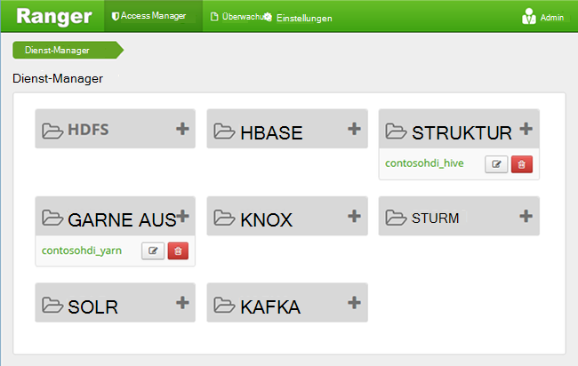
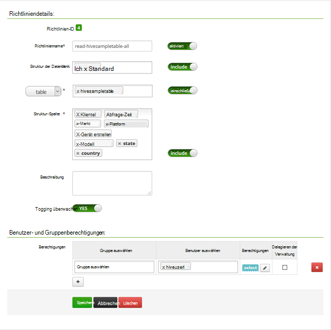

<properties
    pageTitle="Domäne HDInsight Struktur Richtlinien konfigurieren | Microsoft Azure"
    description="Weitere Informationen..."
    services="hdinsight"
    documentationCenter=""
    authors="saurinsh"
    manager="jhubbard"
    editor="cgronlun"
    tags="azure-portal"/>

<tags
    ms.service="hdinsight"
    ms.devlang="na"
    ms.topic="hero-article"
    ms.tgt_pltfrm="na"
    ms.workload="big-data"
    ms.date="10/25/2016"
    ms.author="saurinsh"/>

# Domäne HDInsight (Vorschau) konfigurieren Sie Struktur Richtlinien

Informationen Sie zum Konfigurieren von Apache Ranger Richtlinien für Struktur. In diesem Artikel erstellen Sie zwei Ranger Richtlinien zum Einschränken des Zugriffs auf die Hivesampletable. Die Hivesampletable kommt mit HDInsight. Nachdem die Richtlinien konfiguriert haben, verwenden Sie Excel und ODBC-Treiber Verbindung Struktur Tabellen in HDInsight.

## Erforderliche Komponenten

- Eine Domäne HDInsight-Cluster. [Konfigurieren Sie Domäne HDInsight Cluster](hdinsight-domain-joined-configure.md)anzeigen
- Eine Workstation mit Office 2016 Office 2013 Professional Plus, Office 365 Pro Plus, Excel 2013 eigenständige oder Office 2010 Professional Plus.

## Verbinden Sie mit Apache Ranger-Administratoroberfläche

**Verbindung mit Ranger-Administratoroberfläche**

1. Schließen Sie in einem Browser Administratoroberfläche Ranger. Ist die URL https://&lt;ClusterName >.azurehdinsight.net/Ranger/. 

    >[AZURE.NOTE] Rangers verwendet andere Anmeldeinformationen als Hadoop Cluster. Verhindern Sie mit zwischengespeicherten Anmeldeinformationen Hadoop Browser Verbindung zu Ranger Administratoroberfläche verwenden Sie InPrivate-Browserfenster.
4. Melden Sie sich mit dem Cluster Administrator Domänenbenutzername und Kennwort:

    

    Rangers arbeitet derzeit, Garn und Struktur.

## Domänenbenutzer erstellen

[Konfigurieren Sie Domäne HDInsight-Cluster](hdinsight-domain-joined-configure.md#create-and-configure-azure-ad-ds-for-your-azure-ad)haben Sie hiveruser1 und hiveuser2 erstellt. In diesem Lernprogramm werden Sie zwei Benutzerkonto verwenden.

## Rangers Richtlinien erstellen

In diesem Abschnitt erstellen Sie zwei Ranger Richtlinien für den Zugriff auf Hivesampletable. Geben Sie select-Berechtigung auf andere Spalten. Beide Benutzer wurden in [Clustern konfigurieren Domäne HDInsight](hdinsight-domain-joined-configure.md#create-and-configure-azure-ad-ds-for-your-azure-ad)erstellt.  Im nächsten Abschnitt Testen Sie die beiden Richtlinien in Excel.

**Rangers Richtlinien erstellen**

1. Rangers Admin-Benutzeroberfläche zu öffnen. [Verbinden mit Apache Ranger Administratoroberfläche](#connect-to-apache-ranager-admin-ui)anzeigen
2. Klicken Sie auf ** &lt;ClusterName > _hive**, unter **Struktur**. Sie sehen zwei Richtlinien konfigurieren.
3. Klicken Sie auf **Neue Richtlinie hinzufügen**, und geben Sie die folgenden Werte:

    - Richtlinienname: Lesen Hivesampletable alle
    - Struktur der Datenbank: Standard
    - Tabelle: Hivesampletable
    - Spalte Struktur: *
    - Wählen Sie Benutzer: hiveuser1
    - Berechtigungen: Wählen

    .

    >[AZURE.NOTE] Wenn ein Domänenbenutzer in Benutzer nicht ausgefüllt ist, warten Sie für Ranger mit AAD.

4. Klicken Sie auf **Hinzufügen** , um die Richtlinie zu speichern.
5. Wiederholen Sie die letzten beiden Schritte zum Erstellen einer anderen Richtlinie mit den folgenden Eigenschaften:

    - Richtlinienname: Read-Hivesampletable-Devicemake
    - Struktur der Datenbank: Standard
    - Tabelle: Hivesampletable
    - Spalte Struktur: Clientid Devicemake
    - Wählen Sie Benutzer: hiveuser2
    - Berechtigungen: Wählen

## Struktur ODBC-Datenquelle erstellen

Der Anleitung finden in [Erstellen Struktur ODBC-Datenquelle](hdinsight-connect-excel-hive-odbc-driver.md).  

    Eigenschaft|Beschreibung
    ---|---
    Datenquelle|Geben Sie einen Namen zur Datenquelle
    Host|Geben Sie &lt;HDInsightClusterName >. azurehdinsight.net. Beispielsweise myHDICluster.azurehdinsight.net
    Anschluss|Verwenden Sie <strong>443</strong>. (Dieser Port wurde von 563 auf 443 geändert.)
    Datenbank|<strong>Standardmäßig</strong>verwenden.
    Struktur-Typ|Wählen Sie <strong>Struktur Server 2</strong>
    Mechanismus|Wählen Sie <strong>Azure HDInsight-Dienst</strong>
    HTTP-Pfad|Lassen Sie leer.
    Benutzername|Geben Sie hiveuser1@contoso158.onmicrosoft.com. Aktualisieren Sie den Domänennamen verschiedene.
    Kennwort|Geben Sie das Kennwort für hiveuser1 ein.
    </table>

Vergewissern Sie sich auf **Tests** vor dem Speichern der Datenquelle.

##Importieren von Daten in Excel HDInsight

Im letzten Abschnitt haben Sie zwei Richtlinien konfiguriert.  hiveuser1 ist die select-Berechtigung für alle Spalten und hiveuser2 wurde die select-Berechtigung für zwei Spalten. In diesem Abschnitt Identität der zwei Benutzer Daten in Excel importieren.

1. Öffnen Sie eine neue oder vorhandene Arbeitsmappe in Excel.
2. Über die Registerkarte **Daten** **Aus anderen Datenquellen**auf und klicken Sie dann auf **Vom Datenverbindungs-Assistenten** , um den **Datenverbindungs-Assistenten**zu starten.

    ! [Open Data Connection Wizard] [Img-Hdi-simbahiveodbc.excel.dataconnection]

3. Wählen Sie **ODBC DSN** als Datenquelle aus und dann auf **Weiter**.
4. ODBC-Datenquellen wählen Sie der Name der Datenquelle aus, die Sie im vorherigen Schritt erstellt haben und klicken Sie auf **Weiter**.
5. Geben Sie das Kennwort für den Cluster im Assistenten, und klicken Sie auf **OK**. Warten Sie auf die **Datenbank und Tabelle auswählen** -Dialogfeld öffnen. Dies kann einige Sekunden dauern.
8. Wählen Sie **Hivesampletable**und klicken Sie dann auf **Weiter**. 
8. Klicken Sie auf **Fertig stellen**.
9. Klicken Sie im Dialogfeld **Daten importieren** Sie ändern oder Angeben der Abfrage. Dazu klicken Sie auf **Eigenschaften**. Dies kann einige Sekunden dauern. 
10. Klicken Sie auf die Registerkarte **Definition** . Der Befehlstext ist:

        SELECT * FROM "HIVE"."default"."hivesampletable"

    Hiveuser1 hat Richtlinien definierten Ranger select-Berechtigung für alle Spalten.  So funktioniert diese Abfrage mit der hiveuser1, diese Abfrage nicht funktioniert jedoch nicht mit der hiveuser2.

    ! [Verbindungseigenschaften] [Img-Hdi-Simbahiveodbc-excel-Connectionproperties]

11. Klicken Sie auf **OK** , um das Dialogfeld Eigenschaften zu schließen.
12. Klicken Sie auf **OK** , um das Dialogfeld **Daten importieren** zu schließen.  
13. **Das Kennwort für hiveuser1** Es dauert ein paar Sekunden, bevor Daten in Excel importiert werden. Wenn er abgeschlossen ist, werden 11 Datenspalten angezeigt.

So testen Sie die zweite Richtlinie (Lesen-Hivesampletable-Devicemake) im letzten Abschnitt erstellt

1. Fügen Sie ein neues Blatt in Excel.
2. Die letzten Schritte zum Importieren der Daten.  Die einzige Veränderung, die Sie vornehmen, werden Anmeldeinformationen des hiveuser2 statt des hiveuser1 verwendet. Dies schlägt fehl, da hiveuser2 nur zwei Spalten verfügt. Sie werden der folgende Fehler angezeigt:

        [Microsoft][HiveODBC] (35) Error from Hive: error code: '40000' error message: 'Error while compiling statement: FAILED: HiveAccessControlException Permission denied: user [hiveuser2] does not have [SELECT] privilege on [default/hivesampletable/clientid,country ...]'.

3. Verfahren Sie dasselbe zum Importieren von Daten. Dieses Mal hiveuser2 Anmeldeinformationen und auch ändern der select-Anweisung aus:

        SELECT * FROM "HIVE"."default"."hivesampletable"

    An:

        SELECT clientid, devicemake FROM "HIVE"."default"."hivesampletable"

    Wenn er abgeschlossen ist, werden zwei Datenspalten importiert sehen.

## Nächste Schritte

- Einen Domäne HDInsight Cluster konfigurieren, finden Sie unter [Konfigurieren Domäne HDInsight-Cluster](hdinsight-domain-joined-configure.md).
- Verwalten einer Domäne HDInsight-Cluster finden Sie unter [Verwalten von Domäne HDInsight-Cluster](hdinsight-domain-joined-manage.md).
- Struktur Abfragen über SSH auf Domäne HDInsight-Cluster ausführen, finden Sie unter [Verwenden SSH mit Linux-basierten Hadoop auf HDInsight von Linux, Unix oder OS X](hdinsight-hadoop-linux-use-ssh-unix.md#connect-to-a-domain-joined-hdinsight-cluster).
- Verbindung Struktur Struktur JDBC verwenden finden Sie unter [Verbinden Hive auf Azure HDInsight Struktur JDBC-Treiber verwenden](hdinsight-connect-hive-jdbc-driver.md)
- Hadoop mit Struktur ODBC Excel herstellen, finden Sie unter [Hadoop mit der Struktur ODBC Microsoft Excel verbinden](hdinsight-connect-excel-hive-odbc-driver.md)
- Hadoop Power Abfrage Excel herstellen, finden Sie unter [Verbinden Excel Hadoop mit Power-Abfrage](hdinsight-connect-excel-power-query.md)