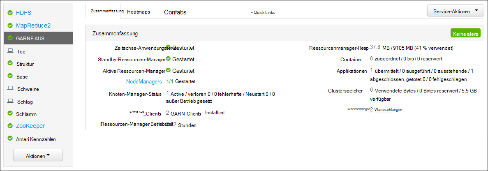
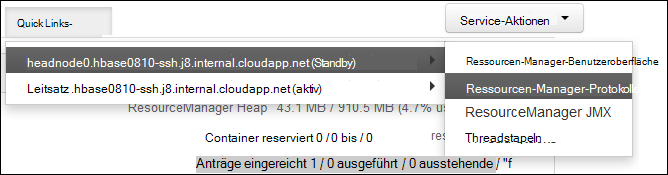

<properties
    pageTitle="Access Hadoop GARN Anwendungsprotokolle auf Linux-basierten HDInsight | Microsoft Azure"
    description="Informationen Sie zum GARN Anwendungsprotokolle auf einem Linux-basierten HDInsight (Hadoop)-Cluster mit der Befehlszeile und einen Webbrowser zugreifen."
    services="hdinsight"
    documentationCenter=""
    tags="azure-portal"
    authors="Blackmist" 
    manager="jhubbard"
    editor="cgronlun"/>

<tags
    ms.service="hdinsight"
    ms.workload="big-data"
    ms.tgt_pltfrm="na"
    ms.devlang="na"
    ms.topic="article"
    ms.date="10/21/2016"
    ms.author="larryfr"/>

# Zugriff Anwendungsprotokolle aus auf Linux-basierten HDInsight 

Dieses Dokument erläutert die Protokolle aus (noch eine andere Ressource Vermittlung) Programme zugreifen, die in einem Cluster Hadoop in Azure HDInsight haben.

> [AZURE.NOTE] Die Informationen in diesem Dokument ist für Linux-basierte HDInsight-Cluster. Informationen über Windows-Cluster finden Sie unter [Anwendungsprotokolle aus Zugriff auf Windows-basierten HDInsight](hdinsight-hadoop-access-yarn-app-logs.md)

## Erforderliche Komponenten

* Ein Linux-basiertes HDInsight-Cluster.

* Sie müssen [einen SSH-Tunnel erstellen](hdinsight-linux-ambari-ssh-tunnel.md) ResourceManager Protokolle Webbenutzeroberfläche zugreifen zu können.

## AUS Zeitachse Server

[Aus Zeitachse Server](http://hadoop.apache.org/docs/r2.4.0/hadoop-yarn/hadoop-yarn-site/TimelineServer.html) bietet allgemeinen Informationen auf Bewerbungen Framework-Anwendungsinformationen über zwei verschiedene Schnittstellen. Insbesondere:

* Speicherung und Abruf von Informationen auf HDInsight Cluster generische Anwendung wurde aktiviert, Version 3.1.1.374 oder höher.
* Der Framework-Anwendung Informationen Bestandteil der Zeitachse Server ist derzeit nicht verfügbar auf HDInsight-Cluster.

Allgemeine Informationen über die Anwendung enthält die folgenden Arten von Daten:

* Die ID der Anwendung, eine eindeutige Kennung für eine Anwendung
* Der Benutzer, der die Anwendung gestartet
* Informationen in versucht das Ausfüllen
* Jegliche Anwendung verwendete Container

## GARN-Applikationen und Protokolle

GARN unterstützt mehrere Programmiermodelle (einer davon MapReduce) entkoppeln Ressourcenmanagement aus Anwendung Planung und Überwachung. Dies erfolgt durch eine globale *Ressourcen-Manager* (RM) pro Arbeitskraft Knoten *NodeManagers* (NMs) und pro Anwendung *ApplicationMasters* (AMs). AM pro Anwendung verwendet läuft mit RM Ressourcen (CPU, Arbeitsspeicher, Datenträger, Netzwerk) RM arbeitet mit NMs erteilen diese Ressourcen als *Container*gewährt werden. Die Uhr ist für Fortschritt der Container RM zugewiesen Eine Anwendung kann viele Container je nach Art der Anwendung benötigen.

Darüber hinaus jede Anwendung bestehen mehrere *Anwendung* um vor Abstürzen oder durch die Unterbrechung der Verbindung zwischen einem beenden und ein RM. Container sind daher einen bestimmten Versuch einer Anwendung gewährt. In gewisser Hinsicht Container stellt den Kontext für die Einheit der Arbeit von einer Anwendung aus und alle Arbeit innerhalb eines Containers erfolgt auf einzelnen workerknoten auf dem Container zugeordnet wurde. [GARN-Konzepte] finden Sie unter[ YARN-concepts] zu Referenzzwecken.

Anwendungsprotokolle (und die zugehörigen Container Protokolle) sind entscheidend für problematische Hadoop Debuggen. GARN ermöglicht gut erfassen, sammeln und Speichern von Anwendungsprotokollen mit [Protokoll Aggregation] [ log-aggregation] Funktion. Protokoll Aggregierungsfunktion wird Zugriff auf Anwendungsprotokolle gezielter, Protokolle über alle Container auf eine Arbeitskraft Knoten aggregiert und nach Beendigung eine Anwendung als eine aggregierte Protokolldatei pro Arbeitskraft Knoten auf das Standard-Dateisystem gespeichert. Ihre Anwendung kann Hunderte oder Tausende von Containern verwenden Protokolle für alle Container ausführen auf einem einzelnen Worker-Knoten immer in einer einzigen Datei, wodurch eine Protokolldatei pro Arbeitskraft Knoten von der Anwendung verwendeten aggregiert. Aggregation Protokoll standardmäßig auf HDInsight Cluster (Version 3.0 und höher), und aggregierte Protokolle finden Sie in den Standardcontainer des Clusters am folgenden Speicherort:

    wasbs:///app-logs/<user>/logs/<applicationId>

Ort, *Benutzer* ist der Name des Benutzers, der die Anwendung gestartet und *ApplicationId* der eindeutige Bezeichner einer Anwendung vom GARN RM ist.

Die aggregierten Protokolle sind nicht direkt lesbar, Schreiben in [TFile][T-file], [Binärformat] [ binary-format] Container indiziert. GARN ResourceManager Protokolle oder CLI-Tools verwenden diese Protokolle als Text für Applikationen oder Container an anzeigen. 

##GARN CLI-tools

Um die GARN CLI-Tools verwenden, müssen Sie zunächst mit HDInsight SSH verbinden. Verwenden Sie eines der folgenden Dokumente für Informationen über SSH mit HDInsight:

- [Verwenden Sie SSH mit Linux-basierten Hadoop auf HDInsight von Linux, Unix und Mac OS](hdinsight-hadoop-linux-use-ssh-unix.md)

- [Verwenden Sie SSH mit Linux-basierten Hadoop auf Windows HDInsight](hdinsight-hadoop-linux-use-ssh-windows.md)
    
Unter einem der folgenden Befehle können Sie diese Protokolle als Text anzeigen:

    yarn logs -applicationId <applicationId> -appOwner <user-who-started-the-application>
    yarn logs -applicationId <applicationId> -appOwner <user-who-started-the-application> -containerId <containerId> -nodeAddress <worker-node-address>
    
Geben Sie die &lt;p >, &lt;Benutzer,-gestartet-Programms >, &lt;ContainerId >, und & Ltworker Knotenadresse > Informationen beim Ausführen dieser Befehle.

##GARN ResourceManager-Benutzeroberfläche

GARN ResourceManager Benutzeroberfläche auf den Hauptknoten Cluster ausgeführt wird und über der Ambari Web-Benutzeroberfläche zugegriffen werden; Allerdings müssen Sie zunächst [einen SSH-Tunnel erstellen](hdinsight-linux-ambari-ssh-tunnel.md) ResourceManager UI zugreifen zu können.

Nach dem Erstellen eines SSH-Tunnels gehen Sie zum Anzeigen der Protokolle aus:

1. Navigieren Sie in Ihrem Webbrowser zu https://CLUSTERNAME.azurehdinsight.net. Der Name des Clusters HDInsight ersetzen Sie CLUSTERNAME.

2. Wählen Sie aus der Liste der Dienste auf der linken Seite __aus__.

    

3. In der Dropdownliste __Direktlinks__ wählen Sie einen Cluster-Head-Knoten und dann __ResourceManager-Protokoll__.

    
    
    Eine Liste mit Links zu GARN Protokolle wird angezeigt.

[YARN-timeline-server]:http://hadoop.apache.org/docs/r2.4.0/hadoop-yarn/hadoop-yarn-site/TimelineServer.html
[log-aggregation]:http://hortonworks.com/blog/simplifying-user-logs-management-and-access-in-yarn/
[T-file]:https://issues.apache.org/jira/secure/attachment/12396286/TFile%20Specification%2020081217.pdf
[binary-format]:https://issues.apache.org/jira/browse/HADOOP-3315
[YARN-concepts]:http://hortonworks.com/blog/apache-hadoop-yarn-concepts-and-applications/
