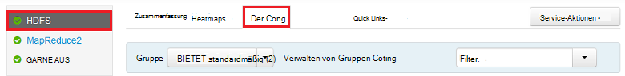
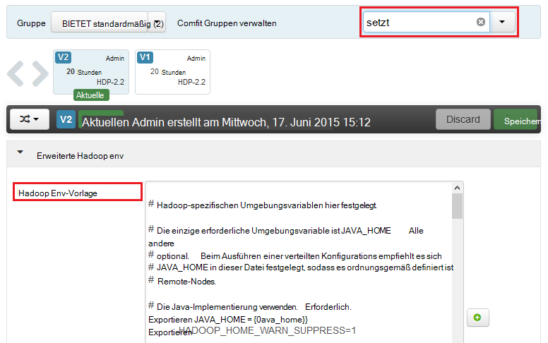
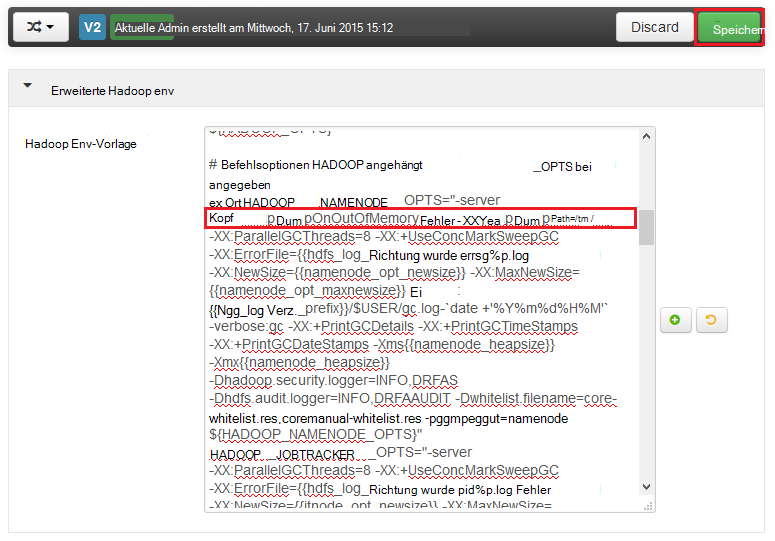
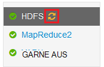
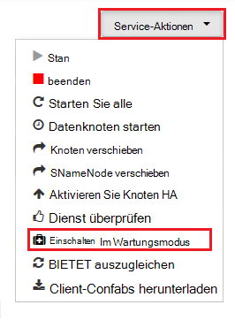

<properties
    pageTitle="Aktivieren von Heapdumps für Hadoop auf HDInsight | Microsoft Azure"
    description="Ermöglichen Sie Heapdumps für Hadoop Services HDInsight Linux-basierten Clustern zum Debuggen und Analyse."
    services="hdinsight"
    documentationCenter=""
    authors="Blackmist"
    manager="jhubbard"
    editor="cgronlun"
    tags="azure-portal"/>

<tags
    ms.service="hdinsight"
    ms.workload="big-data"
    ms.tgt_pltfrm="na"
    ms.devlang="na"
    ms.topic="article"
    ms.date="09/27/2016"
    ms.author="larryfr"/>

#Aktivieren von Heapdumps für Hadoop auf Linux-basierten HDInsight (Vorschau)

[AZURE.INCLUDE [heapdump-selector](../../includes/hdinsight-selector-heap-dump.md)]

Heapdumps enthalten einen Snapshot der Anwendung Speicher, einschließlich der Werte von Variablen Zeitpunkt das Speicherabbild erzeugt wurde. Sind sehr nützlich zum Diagnostizieren von Problemen, die bei der Ausführung auftreten.

> [AZURE.NOTE] Die Informationen in diesem Artikel gilt nur für Linux-basierte HDInsight. Informationen zu Windows-basierten HDInsight finden Sie unter [Aktivieren von Heapdumps für Hadoop auf Windows-basierten HDInsight](hdinsight-hadoop-collect-debug-heap-dumps.md)

## Dienste

Sie können Heapdumps für die folgenden Dienste:

*  **Hcatalog** - tempelton
*  **Struktur** - hiveserver2, Metastore, derbyserver
*  **Mapreduce** - jobhistoryserver
*  **Garn** - Resourcemanager Nodemanager, timelineserver
*  **bietet** - Datanode, Secondarynamenode, namenode

Kann auch Heapdumps für die Zuordnung und reduzieren Prozesse durch HDInsight ausgeführt.

## Grundlegendes zu Heapdumpkonfiguration

Heapdumps aktivierte Optionen übergeben (auch bezeichnet als entscheidet, oder Parameter) auf die JVM als ein Dienst gestartet wird. Für die meisten Hadoop-Dienste kann dies erreicht durch das Shell-Skript zum Starten des Dienstes ändern.

In jedem Skript ist ein Export für ** \* \_OPTS**, um die JVM übergebenen Optionen enthält. Beispielsweise im Skript **Hadoop env.sh** die Zeile, die beginnt mit `export HADOOP_NAMENODE_OPTS=` enthält die Optionen für den NameNode-Dienst.

Ordnen und reduzieren Prozesse sind geringfügig sind ein untergeordneter Prozess MapReduce-Service. Jede Karte oder reduzieren Prozess in einem untergeordneten Container ausgeführt wird und zwei Einträge, die JVM-Optionen für diese enthalten. Beide **Mapred site.xml**enthalten:

* **MapReduce.Admin.Map.Child.java.OPTS**
* **MapReduce.Admin.reduce.Child.java.OPTS**

> [AZURE.NOTE] Wir empfehlen Ambari Skripts und Mapred site.xml Einstellungen ändern wie Ambari Änderungen auf Knoten im Cluster repliziert werden. Siehe Abschnitt [Mithilfe von Ambari](#using-ambari) für bestimmte Schritte.

###Heapdumps aktivieren

Die folgende Option ermöglicht Heapdumps tritt ein OutOfMemoryError:

    -XX:+HeapDumpOnOutOfMemoryError

Die **+** gibt an, dass diese Option aktiviert ist. Der Standardwert ist deaktiviert.

> [AZURE.WARNING] Heapdumps nicht für Hadoop auf HDInsight in der Standardeinstellung werden die Speicherabbilddateien groß werden können. Wenn Sie sie aktivieren für die Problembehandlung, müssen Sie das Problem reproduziert und erfasst die Speicherabbilddateien deaktivieren.

###Dump-Speicherort

Der Standardspeicherort für die Abbilddatei ist das aktuelle Arbeitsverzeichnis. Sie können steuern, wo die Datei gespeichert ist, mit der folgenden Option:

    -XX:HeapDumpPath=/path

Beispielsweise `-XX:HeapDumpPath=/tmp` verursachen Dumps/TMP-Verzeichnis gespeichert werden.

###Skripts

Wenn ein **OutOfMemoryError** auftritt, können Sie auch ein Skript auslösen. Z. B. auslösen eine Benachrichtigung, wissen Sie, dass der Fehler aufgetreten ist. Dies erfolgt mithilfe der folgenden Option:

    -XX:OnOutOfMemoryError=/path/to/script

> [AZURE.NOTE] Hadoop ein verteiltes System ist, muss jedes Skript verwendet auf allen Knoten im Cluster der Service läuft auf platziert.
>
> Das Skript muss auch werden in einem Verzeichnis das Konto der Dienst wird als und geben Ausführungsberechtigungen. Sie möchten z. B. Speichern von Skripts in `/usr/local/bin` und `chmod go+rx /usr/local/bin/filename.sh` lesen und ausführen.

##Ambari verwenden

Gehen Sie folgendermaßen vor, um die Konfiguration für einen Dienst ändern:

1. Öffnen Sie Ambari Webbenutzeroberfläche für den Cluster. Die URL wird https://YOURCLUSTERNAME.azurehdinsight.net sein.

    Aufforderung der Site mithilfe der Kontoname HTTP-Authentifizierung (Standardwert: Admin) und das Kennwort für den Cluster.

    > [AZURE.NOTE] Sie können ein zweites Mal von Ambari für Benutzername und Kennwort aufgefordert. In diesem Fall nur Geben Sie denselben Kontonamen und Kennwort

2. Wählen Sie die Liste der Links Servicebereich, den Sie ändern möchten. Beispielsweise **bietet**. Im mittleren Bereich der Registerkarte **Konfigurationen** aus.

    

3. Geben Sie den Eintrag **Filter...** **entscheidet**. Diese Liste der Konfigurationselemente, die mit diesem Text filtern und schnell nach der Shell-Skript oder die **Vorlage** , mit diesen Optionen.

    

4. Suchen der ** \* \_OPTS** Eintrag für den Dienst soll Heapdumps für aktivieren und die Optionen aktivieren möchten. In der folgenden Abbildung habe ich `-XX:+HeapDumpOnOutOfMemoryError -XX:HeapDumpPath=/tmp/` auf der **HADOOP\_NAMENODE\_OPTS** Eintrag:

    

    > [AZURE.NOTE] Beim Aktivieren Heap für die Zuordnung bildet oder untergeordneten Prozess reduzieren, sehen Sie stattdessen für die Felder mit der Beschriftung **mapreduce.admin.map.child.java.opts** und **mapreduce.admin.reduce.child.java.opts**.

    Verwenden Sie die Schaltfläche **Speichern** um zu speichern. Sie können eine kurze Notiz die Änderungen.

5. Nachdem die Änderung angewendet wurde, wird das Symbol **Neustart erforderlich** neben einen oder mehrere Dienste angezeigt.

    

6. Wählen Sie jeden Dienst, die einen Neustart, und verwenden Sie die Schaltfläche **Aktivitäten** **Im Wartungsmodus schalten**. Dadurch wird verhindert, dass Alarme aus diesem Dienst generiert werden, wenn Sie neu starten.

    

7. Einmal Wartungsmodus aktiviert haben, verwenden Sie die Schaltfläche **Neustart** für den Dienst **Starten alle** erfolgt

    

    > [AZURE.NOTE] die Einträge für die Schaltfläche **Neustart** möglicherweise für andere Dienste.

8. Nach dem Neustart der Dienste Schaltfläche **Service-Aktionen** zu **Aktivieren deaktivieren im Wartungsmodus**. Diese Ambari wieder Warnungen für den Dienst überwachen.
