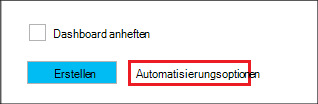

<properties
   pageTitle="Linux-basierten Hadoop Cluster in HDInsight Azure-Ressourcen-Manager Vorlagen erstellen | Microsoft Azure"
    description="Informationen Sie zum Cluster für Azure HDInsight Azure Azure-Ressourcen-Manager Vorlagen erstellen."
   services="hdinsight"
   documentationCenter=""
   tags="azure-portal"
   authors="mumian"
   manager="jhubbard"
   editor="cgronlun"/>

<tags
   ms.service="hdinsight"
   ms.devlang="na"
   ms.topic="article"
   ms.tgt_pltfrm="na"
   ms.workload="big-data"
   ms.date="09/02/2016"
   ms.author="jgao"/>

# Erstellen Sie Linux-basierten Hadoop Cluster in HDInsight Azure-Ressourcen-Manager Vorlagen

[AZURE.INCLUDE [selector](../../includes/hdinsight-selector-create-clusters.md)]

Informationen Sie zum Azure Ressource Manager(ARM) Vorlagen HDInsight-Cluster erstellen. Weitere Informationen finden Sie unter [Bereitstellen einer Anwendung mit Azure-Ressourcen-Manager-Vorlage](../resource-group-template-deploy.md). Andere Clustererstellung Tools und Features klicken Sie auf die Registerkarte wählen oben auf dieser Seite finden Sie oder [Cluster Methoden](hdinsight-provision-clusters.md#cluster-creation-methods).

##Komponenten:

[AZURE.INCLUDE [delete-cluster-warning](../../includes/hdinsight-delete-cluster-warning.md)]

Vor diesem Artikel benötigen Sie Folgendes:

- [Azure-Abonnement](https://azure.microsoft.com/documentation/videos/get-azure-free-trial-for-testing-hadoop-in-hdinsight/).
- Azure PowerShell und Azure-CLI

    [AZURE.INCLUDE [use-latest-version](../../includes/hdinsight-use-latest-powershell-and-cli.md)]

### Steuerelement erforderlich

[AZURE.INCLUDE [access-control](../../includes/hdinsight-access-control-requirements.md)]

## Ressourcen-Manager-Vorlagen

Ressourcenmanager Vorlage erleichtert die HDInsight-Cluster, deren abhängigen Ressourcen (wie das Standardkonto Speicher) und andere Ressourcen (wie Azure SQL-Datenbank mit Apache Sqoop) für die Anwendung in einer einzigen koordinierten Operation erstellen. In der Vorlage die Ressourcen für die Anwendung definieren und Bereitstellungsparameter Werte für verschiedene umge bungen angeben. Die Vorlage umfasst JSON und Ausdrücke mit Werten für die Bereitstellung erstellen.

Ressourcenmanager Vorlage für einen HDInsight-Cluster und von Azure Storage-Konto finden Sie [Anhang A](#appx-a-arm-template). Verwenden Sie plattformübergreifende [VSCode](https://code.visualstudio.com/#alt-downloads) mit der [Ressourcen-Manager-Erweiterung](https://marketplace.visualstudio.com/items?itemName=msazurermtools.azurerm-vscode-tools) oder einem Text-Editor die Vorlage in einer Datei auf Ihrer Arbeitsstation speichern. Wie die Vorlage mit verschiedenen Methoden erfahren.

Weitere Informationen zu Ressourcen-Manager-Vorlage finden Sie unter

- [Autor Azure Ressourcenmanager Vorlagen](../resource-group-authoring-templates.md)
- [Bereitstellen einer Anwendung mit Azure-Ressourcen-Manager-Vorlage](../resource-group-template-deploy.md)

JSON-Schema für bestimmte Elemente feststellen, führen Sie das folgende Verfahren:

1. [Azure-Portal](https://porta.azure.com) für einen HDInsight-Cluster erstellen zu öffnen.  Siehe [Erstellen von Linux-basierten Clustern in Azure-Portal mit HDInsight](hdinsight-hadoop-create-linux-clusters-portal.md).
2. Konfigurieren Sie die erforderlichen Elemente und Elemente des Schemas JSON benötigen.
3. Klicken Sie auf **Automatisierungsoptionen** , bevor Sie auf **Erstellen**, wie im folgenden Screenshot gezeigt:

    

    Das Portal erstellt einen Ressourcen-Manager auf Grundlage Ihrer Konfigurationen.
## PowerShell bereitstellen

Die folgende Prozedur erstellt HDInsight Linux-basierten Cluster.

**Bereitstellen ein Clusters mithilfe der Ressourcen-Manager-Vorlage**

1. Speichern Sie die Datei Json in [Anhang A](#appx-a-arm-template) auf der Arbeitsstation. PowerShell-Skript ist der Dateiname *C:\HDITutorials-ARM\hdinsight-arm-template.json*.
2. Legen Sie ggf. die Parameter und Variablen.
3. Führen Sie die Vorlage mit dem folgenden PowerShell-Skript aus:

        ####################################
        # Set these variables
        ####################################
        #region - used for creating Azure service names
        $nameToken = "<Enter an Alias>" 
        $templateFile = "C:\HDITutorials-ARM\hdinsight-arm-template.json"
        #endregion

        ####################################
        # Service names and varialbes
        ####################################
        #region - service names
        $namePrefix = $nameToken.ToLower() + (Get-Date -Format "MMdd")

        $resourceGroupName = $namePrefix + "rg"
        $hdinsightClusterName = $namePrefix + "hdi"
        $defaultStorageAccountName = $namePrefix + "store"
        $defaultBlobContainerName = $hdinsightClusterName

        $location = "East US 2"

        $armDeploymentName = $namePrefix
        #endregion

        ####################################
        # Connect to Azure
        ####################################
        #region - Connect to Azure subscription
        Write-Host "`nConnecting to your Azure subscription ..." -ForegroundColor Green
        try{Get-AzureRmContext}
        catch{Login-AzureRmAccount}
        #endregion

        # Create a resource group
        New-AzureRmResourceGroup -Name $resourceGroupName -Location $Location

        # Create cluster and the dependent storage accounge
        $parameters = @{clusterName="$hdinsightClusterName"}

        New-AzureRmResourceGroupDeployment `
            -Name $armDeploymentName `
            -ResourceGroupName $resourceGroupName `
            -TemplateFile $templateFile `
            -TemplateParameterObject $parameters

        # List cluster
        Get-AzureRmHDInsightCluster -ResourceGroupName $resourceGroupName -ClusterName $hdinsightClusterName 

    PowerShell-Skript konfiguriert nur den Namen des Clusters. Der Speicher-Kontoname ist hartcodiert in der Vorlage. Sie werden aufgefordert, geben das Kennwort für Benutzer (der Standardbenutzername lautet *Admin*); und das Kennwort SSH (SSH Standardbenutzername ist *Sshuser*).  
    
Weitere Informationen finden Sie unter [Bereitstellen von PowerShell](../resource-group-template-deploy.md#deploy-with-powershell).

## Bereitstellen von Azure CLI

Das folgende Beispiel erstellt einen Cluster von Speicherkonto und der zugehörigen Container durch Aufrufen einer Ressourcen-Manager-Vorlage:

    azure login
    azure config mode arm
    azure group create -n hdi1229rg -l "East US"
    azure group deployment create --resource-group "hdi1229rg" --name "hdi1229" --template-file "C:\HDITutorials-ARM\hdinsight-arm-template.json"
    
Sie werden aufgefordert den Clusternamen Cluster Benutzerkennwort (der Standardbenutzername lautet *Admin*) und das Kennwort SSH (SSH Standardbenutzername ist *Sshuser*). Inline-Parameter angeben:

    azure group deployment create --resource-group "hdi1229rg" --name "hdi1229" --template-file "c:\Tutorials\HDInsightARM\create-linux-based-hadoop-cluster-in-hdinsight.json" --parameters '{\"clusterName\":{\"value\":\"hdi1229\"},\"clusterLoginPassword\":{\"value\":\"Pass@word1\"},\"sshPassword\":{\"value\":\"Pass@word1\"}}'

## REST-API bereitstellen

Finden Sie [die REST-API bereitstellen](../resource-group-template-deploy.md#deploy-with-the-rest-api).

## Bereitstellung mit Visual Studio

Mit Visual Studio können Sie Projekt Ressourcen erstellen und über die Benutzeroberfläche in Azure bereitstellen. Wählen Sie den Typ von Ressourcen in Ihr Projekt aufnehmen und Ressourcenmanager Vorlage werden automatisch Ressourcen hinzugefügt. Das Projekt bietet auch ein PowerShell-Skript, um die Vorlage bereitzustellen.

Einführung in Ressourcengruppen mit Visual Studio finden Sie unter [Erstellen und Bereitstellen von Azure Ressourcengruppen über Visual Studio](../vs-azure-tools-resource-groups-deployment-projects-create-deploy.md).

##Nächste Schritte
In diesem Artikel haben Sie verschiedene HDInsight-Cluster erstellen. Weitere finden Sie in folgenden Artikeln:

- Ein Beispiel zum Bereitstellen von Ressourcen durch die Clientbibliothek .NET finden Sie unter [Ressourcen bereitstellen Proxybibliothek und eine Vorlage verwenden](../virtual-machines/virtual-machines-windows-csharp-template.md).
- Ein ausführliches Beispiel für die Bereitstellung einer Anwendung finden Sie unter [Bereitstellen und Microservices vorhersehbar in Azure](../app-service-web/app-service-deploy-complex-application-predictably.md).
- Bereitstellen der Projektmappe in unterschiedlichen Umgebungen Siehe [Entwicklung und testumgebungen in Microsoft Azure](../solution-dev-test-environments.md).
- Zu den Abschnitten der Azure-Ressourcen-Manager-Vorlage finden Sie unter [Erstellung Vorlagen](../resource-group-authoring-templates.md).
- Eine Liste der Funktionen, die in einer Vorlage Azure-Ressourcen-Manager verwendet werden kann, finden Sie unter [Vorlagenfunktionen](../resource-group-template-functions.md).

##Anlage a Resource Manager-Vorlage

Die folgende Vorlage Azure Resource Manager erstellt einen Cluster Hadoop Linux-basierten Berücksichtigung von Azure-Speicher. 

> [AZURE.NOTE] Das Beispiel enthält Konfigurationsinformationen für Struktur Metastore und Oozie Metastore.  Entfernen Sie den Abschnitt oder konfigurieren Sie Abschnitt, bevor Sie mit der Vorlage.

    {
    "$schema": "https://schema.management.azure.com/schemas/2015-01-01/deploymentTemplate.json#",
    "contentVersion": "1.0.0.0",
    "parameters": {
        "clusterName": {
        "type": "string",
        "metadata": {
            "description": "The name of the HDInsight cluster to create."
        }
        },
        "clusterLoginUserName": {
        "type": "string",
        "defaultValue": "admin",
        "metadata": {
            "description": "These credentials can be used to submit jobs to the cluster and to log into cluster dashboards."
        }
        },
        "clusterLoginPassword": {
        "type": "securestring",
        "metadata": {
            "description": "The password must be at least 10 characters in length and must contain at least one digit, one non-alphanumeric character, and one upper or lower case letter."
        }
        },
        "sshUserName": {
        "type": "string",
        "defaultValue": "sshuser",
        "metadata": {
            "description": "These credentials can be used to remotely access the cluster."
        }
        },
        "sshPassword": {
        "type": "securestring",
        "metadata": {
            "description": "The password must be at least 10 characters in length and must contain at least one digit, one non-alphanumeric character, and one upper or lower case letter."
        }
        },
        "location": {
        "type": "string",
        "defaultValue": "East US",
        "allowedValues": [
            "East US",
            "East US 2",
            "North Central US",
            "South Central US",
            "West US",
            "North Europe",
            "West Europe",
            "East Asia",
            "Southeast Asia",
            "Japan East",
            "Japan West",
            "Australia East",
            "Australia Southeast"
        ],
        "metadata": {
            "description": "The location where all azure resources will be deployed."
        }
        },
        "clusterType": {
        "type": "string",
        "defaultValue": "hadoop",
        "allowedValues": [
            "hadoop",
            "hbase",
            "storm",
            "spark"
        ],
        "metadata": {
            "description": "The type of the HDInsight cluster to create."
        }
        },
        "clusterWorkerNodeCount": {
        "type": "int",
        "defaultValue": 2,
        "metadata": {
            "description": "The number of nodes in the HDInsight cluster."
        }
        }
    },
    "variables": {
        "defaultApiVersion": "2015-05-01-preview",
        "clusterApiVersion": "2015-03-01-preview",
        "clusterStorageAccountName": "[concat(parameters('clusterName'),'store')]"
    },
    "resources": [
        {
        "name": "[variables('clusterStorageAccountName')]",
        "type": "Microsoft.Storage/storageAccounts",
        "location": "[parameters('location')]",
        "apiVersion": "[variables('defaultApiVersion')]",
        "dependsOn": [ ],
        "tags": { },
        "properties": {
            "accountType": "Standard_LRS"
        }
        },
        {
        "name": "[parameters('clusterName')]",
        "type": "Microsoft.HDInsight/clusters",
        "location": "[parameters('location')]",
        "apiVersion": "[variables('clusterApiVersion')]",
        "dependsOn": [ "[concat('Microsoft.Storage/storageAccounts/',variables('clusterStorageAccountName'))]" ],
        "tags": {

        },
        "properties": {
            "clusterVersion": "3.4",
            "osType": "Linux",
            "tier": "standard",
            "clusterDefinition": {
            "kind": "[parameters('clusterType')]",
            "configurations": {
                "gateway": {
                "restAuthCredential.isEnabled": true,
                "restAuthCredential.username": "[parameters('clusterLoginUserName')]",
                "restAuthCredential.password": "[parameters('clusterLoginPassword')]"
                },
                "hive-site": {
                    "javax.jdo.option.ConnectionDriverName": "com.microsoft.sqlserver.jdbc.SQLServerDriver",
                    "javax.jdo.option.ConnectionURL": "jdbc:sqlserver://myadla0901dbserver.database.windows.net;database=myhive20160901;encrypt=true;trustServerCertificate=true;create=false;loginTimeout=300",
                    "javax.jdo.option.ConnectionUserName": "johndole",
                    "javax.jdo.option.ConnectionPassword": "myPassword$"
                },
                "hive-env": {
                    "hive_database": "Existing MSSQL Server database with SQL authentication",
                    "hive_database_name": "myhive20160901",
                    "hive_database_type": "mssql",
                    "hive_existing_mssql_server_database": "myhive20160901",
                    "hive_existing_mssql_server_host": "myadla0901dbserver.database.windows.net",
                    "hive_hostname": "myadla0901dbserver.database.windows.net"
                },
                "oozie-site": {
                    "oozie.service.JPAService.jdbc.driver": "com.microsoft.sqlserver.jdbc.SQLServerDriver",
                    "oozie.service.JPAService.jdbc.url": "jdbc:sqlserver://myadla0901dbserver.database.windows.net;database=myhive20160901;encrypt=true;trustServerCertificate=true;create=false;loginTimeout=300",
                    "oozie.service.JPAService.jdbc.username": "johndole",
                    "oozie.service.JPAService.jdbc.password": "myPassword$",
                    "oozie.db.schema.name": "oozie"
                },
                "oozie-env": {
                    "oozie_database": "Existing MSSQL Server database with SQL authentication",
                    "oozie_database_name": "myhive20160901",
                    "oozie_database_type": "mssql",
                    "oozie_existing_mssql_server_database": "myhive20160901",
                    "oozie_existing_mssql_server_host": "myadla0901dbserver.database.windows.net",
                    "oozie_hostname": "myadla0901dbserver.database.windows.net"
                }            
            }
            },
            "storageProfile": {
            "storageaccounts": [
                {
                "name": "[concat(variables('clusterStorageAccountName'),'.blob.core.windows.net')]",
                "isDefault": true,
                "container": "[parameters('clusterName')]",
                "key": "[listKeys(resourceId('Microsoft.Storage/storageAccounts', variables('clusterStorageAccountName')), variables('defaultApiVersion')).key1]"
                }
            ]
            },
            "computeProfile": {
            "roles": [
                {
                "name": "headnode",
                "targetInstanceCount": "2",
                "hardwareProfile": {
                    "vmSize": "Standard_D3"
                },
                "osProfile": {
                    "linuxOperatingSystemProfile": {
                    "username": "[parameters('sshUserName')]",
                    "password": "[parameters('sshPassword')]"
                    }
                }
                },
                {
                "name": "workernode",
                "targetInstanceCount": "[parameters('clusterWorkerNodeCount')]",
                "hardwareProfile": {
                    "vmSize": "Standard_D3"
                },
                "osProfile": {
                    "linuxOperatingSystemProfile": {
                    "username": "[parameters('sshUserName')]",
                    "password": "[parameters('sshPassword')]"
                    }
                }
                }
            ]
            }
        }
        }
    ],
    "outputs": {
        "cluster": {
        "type": "object",
        "value": "[reference(resourceId('Microsoft.HDInsight/clusters',parameters('clusterName')))]"
        }
    }
    }
