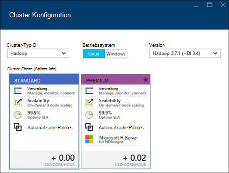
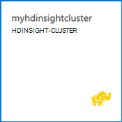

<properties
    pageTitle="Hadoop, HBase, Sturm oder Funken Cluster unter Linux in HDInsight über das Portal erstellen | Microsoft Azure"
    description="Informationen Sie zum Cluster Hadoop, HBase, Sturm oder Funken unter Linux für HDInsight mit einem Webbrowser und Azure vorschauportal erstellen."
    services="hdinsight"
    documentationCenter=""
    authors="nitinme"
    manager="jhubbard"
    editor="cgronlun"
    tags="azure-portal"/>

<tags
    ms.service="hdinsight"
    ms.devlang="na"
    ms.topic="article"
    ms.tgt_pltfrm="na"
    ms.workload="big-data"
    ms.date="10/05/2016"
    ms.author="nitinme"/>

#Erstellen von Linux-basierten Clustern in Azure-Portal mit HDInsight

[AZURE.INCLUDE [selector](../../includes/hdinsight-selector-create-clusters.md)]

Azure-Portal ist ein Web-basiertes Management-Tool für Dienstleistungen und Ressourcen in Microsoft Azure Cloud gehostet. In diesem Artikel erfahren Sie, wie Linux-basierte HDInsight-Cluster über das Portal erstellt.

## Erforderliche Komponenten

[AZURE.INCLUDE [delete-cluster-warning](../../includes/hdinsight-delete-cluster-warning.md)]

- **Ein Azure-Abonnement**. Finden Sie [kostenlose Testversion von Azure zu erhalten](https://azure.microsoft.com/documentation/videos/get-azure-free-trial-for-testing-hadoop-in-hdinsight/).
- __Modernen Webbrowser__. Azure-Portal verwendet HTML5 und Javascript und funktioniert möglicherweise nicht ordnungsgemäß in älteren Webbrowsern.

### Steuerelement erforderlich

[AZURE.INCLUDE [access-control](../../includes/hdinsight-access-control-requirements.md)]

##Erstellen von Clustern

Azure-Portal stellt die meisten Clustereigenschaften. Azure-Ressourcen-Manager-Vorlage können Sie viele Details ausblenden. Weitere Informationen finden Sie unter [Hadoop erstellen Linux-basierten Clustern in Azure Ressourcenmanager Vorlagen HDInsight](hdinsight-hadoop-create-linux-clusters-arm-templates.md).

1. Mit der [Azure-Portal](https://portal.azure.com)anmelden.

2. Klicken Sie auf **neu**und klicken Sie dann auf **HDInsight**auf **Datenanalyse**.

    ![Erstellen eines neuen Clusters in Azure-portal] (./media/hdinsight-hadoop-create-linux-cluster-portal/HDI.CreateCluster.1.png "Erstellen eines neuen Clusters in Azure-portal")
3. Geben Sie **Cluster**: dieser Name muss eindeutig sein.
4. Klicken Sie auf **Cluster Typ auswählen**und dann:

    - **Clustertyp**: Sie möchten wissen, wählen Sie **Hadoop**. Es ist der am häufigsten verwendeten Cluster.

        > [AZURE.IMPORTANT] HDInsight Cluster sind in verschiedenen Typen entsprechen den Arbeitslast oder Technologie Cluster abgestimmt ist. Es ist keine unterstützte Methode in einem Cluster, der mehrere Typen wie Sturm und HBase auf einem Cluster kombiniert. 

    - **Betriebssystem**: **Linux**wählen.
    - **Version**: die Standardversion verwenden, wenn Sie weiß auswählen. Weitere Informationen finden Sie unter [HDInsight Cluster Versionen](hdinsight-component-versioning.md).
    - **Cluster-Tier**: Azure HDInsight bietet Cloudlösungen Datenverlustvorfalls in zwei Kategorien: Standard Ebene und Premium-Ebene. Weitere Informationen finden Sie unter [Cluster Ebenen](hdinsight-hadoop-provision-linux-clusters.md#cluster-tiers).
    
    

4. Klicken Sie auf **Abonnement** Azure-Abonnement aktivieren, das für den Cluster verwendet werden.

5. Klicken Sie auf **Gruppe** wählen Sie eine vorhandene Ressourcengruppe oder klicken Sie auf **neu** , um eine neue Ressourcengruppe erstellen

    > [AZURE.NOTE] Dieser Eintrag standardmäßig eine vorhandene Ressourcengruppen, wenn diese verfügbar sind.

6. Klicken Sie auf **Anmeldeinformationen** , und geben Sie ein Kennwort für den Administrator. Außerdem geben Sie einen **SSH-Benutzernamen** und ein **Kennwort** oder **Öffentlichen Schlüssel**, die SSH-Benutzerauthentifizierung verwendet wird. Es wird empfohlen, einen öffentlichen Schlüssel. Klicken Sie unten, um die Anmeldeinformationen speichern **Wählen** .

    ![Cluster-Anmeldeinformationen bereitstellen] (./media/hdinsight-hadoop-create-linux-cluster-portal/HDI.CreateCluster.3.png "Cluster-Anmeldeinformationen bereitstellen")

    Weitere Informationen zur Verwendung von SSH mit HDInsight finden Sie in den folgenden Artikeln:

    * [Verwenden Sie SSH mit Linux-basierten Hadoop auf HDInsight von Linux, Unix und Mac OS](hdinsight-hadoop-linux-use-ssh-unix.md)
    * [Verwenden Sie SSH mit Linux-basierten Hadoop auf Windows HDInsight](hdinsight-hadoop-linux-use-ssh-windows.md)

7. Klicken Sie auf **Datenquelle** wählen Sie eine vorhandene Datenquelle für den Cluster oder erstellen Sie ein neues.

    ![Datenquellen-blade] (./media/hdinsight-hadoop-create-linux-cluster-portal/HDI.CreateCluster.4.png "Konfiguration der Datenquelle angeben")

    Derzeit können Sie als Datenquelle für einen HDInsight-Cluster eine Azure Storage-Konto auswählen. Anhand der folgenden um Einträge auf die **Datenquelle** zu verstehen.

    - **Methode**: Legen Sie **alle Abonnements** aktivieren Speicherkonten alle Abonnements zu durchsuchen. Legen Sie den **Schlüssel** **Speichern Namen** und **Zugriffstaste** ein Storage-Konto eingeben soll.

    - **Wählen Sie Konto / New**: Klicken Sie auf Durchsuchen und ein Speicherkonto zu Cluster zugeordnet **Speicherkonto auswählen** . Oder klicken Sie auf **neu** , um ein neues Speicherkonto erstellen. Verwenden Sie das Feld zur Eingabe des Namens des Speicherkontos. Ein grünes Häkchen wird angezeigt, wenn der Name verfügbar ist.

    - **Standardcontainer auswählen**: Eingeben der Standardcontainer für den Cluster verwenden können. Während Sie einen beliebigen Namen eingeben können, wird empfohlen, mit demselben Namen wie des Clusters, damit Sie erkennen können, dass der Container für diesen bestimmten Cluster verwendet wird.

    - **Ort**: das geografische Gebiet, die das Speicherkonto oder erstellt wird.

        > [AZURE.IMPORTANT] Den Standort für die Standarddatenquelle wird auch die Position des Clusters HDInsight festgelegt. Die Cluster und Standard-Datenquelle muss im selben Bereich befinden.
        
    - **Cluster AAD Identität**: Konfigurieren sie, Sie Cluster zugänglich machen Azure Data Lake Shops basierend auf der Konfiguration AAD.

    Klicken Sie auf **auswählen** , um die Datenquellenkonfiguration speichern.

8. Klicken Sie auf **Knoten Preise Ebenen** Informationen über Knoten angezeigt, die für diesen Cluster erstellt werden. Anzahl der workerknoten, die für den Cluster erforderlich. Die geschätzte Kosten des Clusters wird in die Blade angezeigt.

    ![Knoten Preise Ebenen blade] (./media/hdinsight-hadoop-create-linux-cluster-portal/HDI.CreateCluster.5.png "Geben Sie Anzahl der Clusterknoten")
    
    > [AZURE.IMPORTANT] Wenn Sie mehr als 32 Arbeitskraft zur Clustererstellung oder Knoten durch Skalierung des Clusters nach Erstellung planen müssen Sie Headknoten Größe 14 GB Ram mit mindestens 8 Kernen auswählen.
    >
    > Weitere Informationen zu Knoten Größen und Kosten finden Sie unter [HDInsight Preisgestaltung](https://azure.microsoft.com/pricing/details/hdinsight/).

    Klicken Sie auf Preise Knotenkonfiguration speichern **Wählen** .

9. Klicken Sie auf **Optionale Konfiguration** wählen Sie Clusterversion sowie andere optionale Einstellungen wie ein **Virtuelles Netzwerk**, Einrichten einer **Externen Metastore** Daten für Struktur und Oozie, Skriptaktionen Cluster zum Installieren von benutzerdefinierter Komponenten anpassen, oder verwenden Sie zusätzlichen Speicherkonten mit Cluster.

    * **Virtuelles Netzwerk**: Wählen Azure virtuelles Netzwerk und die Subnetzmaske des Clusters in einem virtuellen Netzwerk platzieren möchten.  

        ![Virtuelle Netzwerk-blade] (./media/hdinsight-hadoop-create-linux-cluster-portal/HDI.CreateCluster.6.png "Virtuelles Netzwerkdetails angeben")

        Ein virtuelles Netzwerk, einschließlich Konfiguration für das virtuelle Netzwerk mit HDInsight Informationen finden Sie unter [Funktionen über ein virtuelles Netzwerk Azure HDInsight erweitern](hdinsight-extend-hadoop-virtual-network.md).

    * Klicken Sie auf **Externe Metastores** zum SQL-Datenbank angeben, die Struktur und Oozie Metadaten Cluster gespeichert werden soll.
    
        > [AZURE.NOTE] Metastore-Konfiguration ist nicht für HBase Cluster verfügbar.

        ![Benutzerdefinierte Metastores blade] (./media/hdinsight-hadoop-create-linux-cluster-portal/HDI.CreateCluster.7.png "Externe Metastores angeben")

        **Verwenden Sie eine vorhandene SQL-Datenbank für Struktur** Metadaten klicken Sie auf **Ja**Benutzername/Kennwort für die Datenbank bereit und wählen Sie eine SQL-Datenbank. Wiederholen Sie diese Schritte verwenden **Eine vorhandene SQL-Datenbank für Oozie-Metadaten**. **Klicken Sie auf auf die **Optionale Konfiguration** Blade sind.**

        >[AZURE.NOTE] Für die Metastore verwendete SQL Azure-Datenbank muss Konnektivität mit anderen Azure Services, einschließlich Azure HDInsight zulassen. Klicken Sie im Schaltpult Azure SQL-Datenbank auf der rechten Seite auf den Servernamen. Dies ist der Server, auf dem SQL-Datenbankinstanz ausgeführt wird. Einmal sind die Server-Ansicht klicken Sie auf **Konfiguration**und ** **Azure Services**klicken**und dann auf **Speichern**.

        &nbsp;

        > [AZURE.IMPORTANT] Beim Erstellen einer Metastore nicht verwenden Sie einen Datenbanknamen, der Striche oder Bindestrich enthält dadurch der Clustererstellung fehlschlagen kann.

    * **Skript-Aktionen** möchten Sie ein benutzerdefiniertes Skript verwenden, um einen Cluster anzupassen Cluster entsteht. Weitere Informationen zu Skriptaktionen finden Sie unter [Anpassen HDInsight Cluster mit Skriptaktion](hdinsight-hadoop-customize-cluster-linux.md). Geben Sie die Details auf das Skriptaktionen wie im Screenshot dargestellt.

        ![Skript Aktion blade] (./media/hdinsight-hadoop-create-linux-cluster-portal/HDI.CreateCluster.8.png "Skriptaktion angeben")

    * Klicken Sie auf **Verknüpfte Speicherkonten** zusätzlichen Speicher Konten Cluster zugeordnet. Blatt **Azure Speicherschlüssel** klicken Sie auf **Add Storage-Schlüssel**und ein Storage-Konto auswählen oder ein neues Konto erstellen.

        ![Zusätzlicher Speicher blade] (./media/hdinsight-hadoop-create-linux-cluster-portal/HDI.CreateCluster.9.png "Geben Sie zusätzlichen Speicherkonten")

        Wenn ein Cluster erstellt wurde, können Sie auch zusätzliche Speicherkonten hinzufügen.  [Anpassen von Linux-basierten HDInsight Cluster mit Skriptaktion](hdinsight-hadoop-customize-cluster-linux.md)anzeigen

        **Klicken Sie auf auf das **neue HDInsight-Cluster** Blade sind.**
        
        Zusätzlich BLOB-Speicher können Sie auch Azure Data Lake Stores verknüpfen. Die Konfiguration kann durch Konfigurieren AAD Datenquelle dem Standardkonto Speicher und Standardcontainer konfigurieren.

10. Blade **HDInsight-Cluster neue** sicherzustellen Sie, dass **an Startmenü anheften** ausgewählt ist, und klicken Sie dann auf **Erstellen**. Cluster erstellt und eine Kachel für sie Startmenü Azure-Portal hinzufügen. Das Symbol bedeutet, dass der Cluster ist die Bereitstellung und sich das Symbol HDInsight ändert nach Abschluss der Bereitstellung angezeigt.

  	| Bei der Bereitstellung | Bereitstellung abgeschlossen |
  	| ------------------ | --------------------- |
  	|  |  |

    > [AZURE.NOTE] Es dauert Clusters, normalerweise ca. 15 Minuten erstellt werden. Verwenden Sie die Kachel auf das Startmenü oder den Eintrag **Benachrichtigungen** auf der linken Seite um den Bereitstellungsprozess zu überprüfen.

11. Nach Abschluss des Erstellungsprozesses klicken Sie für den Cluster aus Startmenü Blade Cluster gestartet. Cluster-Blade enthält wichtige Informationen zum Cluster wie den Namen der Ressourcengruppe gehört zu der Position, Betriebssystem URL für Cluster-Dashboard usw..

    ![Cluster-blade] (./media/hdinsight-hadoop-create-linux-cluster-portal/HDI.Cluster.Blade.png "Clustereigenschaften")

    Anhand der folgenden um Symbole oben Blatt und im Abschnitt **Grundlagen** zu verstehen:

    * **Einstellungen** und **Alle**: Zeigt das Blatt **Einstellungen** für den Cluster, dem Sie ausführliche Konfigurationsinformationen für den Cluster zugreifen kann.

    * **Dashboard**, **Dashboard Cluster**und **URL**: Diese werden auf das Dashboard Cluster ist ein Webportal Aufträge im Cluster ausgeführt.

    * **Secure Shell**: Angaben über SSH zugreifen.

    * **Löschen**: Löscht den HDInsight-Cluster.

    * **Schnellstart** (): Zeigt Informationen, mit denen Sie erste Schritte mit HDInsight.

    * **Benutzer** (): ermöglicht das Festlegen von Berechtigungen für _Portal-Management_ dieses Clusters für andere Benutzer auf Ihre Azure-Abonnement.

        > [AZURE.IMPORTANT] Diese _nur_ betrifft und die Berechtigungen dieser Cluster in Azure-Portal und hat keine Auswirkung auf die Verbindung oder Aufträge HDInsight-Cluster.

    * **Tags** (): Tags können Sie Schlüssel-Wert-Paare definieren Sie eine benutzerdefinierte Taxonomie von Cloud-Diensten. Beispielsweise können Sie ein __Projekt__erstellen und verwenden Sie einen gemeinsamen Wert für alle Dienste, die einem bestimmten Projekt zugeordnet.

##Anpassen von Clustern

- Siehe [Anpassen HDInsight Cluster mit Bootstrap](hdinsight-hadoop-customize-cluster-bootstrap.md).
- [Anpassen von Linux-basierten HDInsight Cluster mit Skriptaktion](hdinsight-hadoop-customize-cluster-linux.md)anzeigen

##Cluster löschen

[AZURE.INCLUDE [delete-cluster-warning](../../includes/hdinsight-delete-cluster-warning.md)]

##Nächste Schritte

Da Sie einen HDInsight-Cluster erstellt haben, verwenden Sie folgende Informationen zum Cluster arbeiten:

###Hadoop-Cluster

* [Struktur mit HDInsight verwenden](hdinsight-use-hive.md)
* [Verwenden Sie Schwein mit HDInsight](hdinsight-use-pig.md)
* [Verwenden Sie MapReduce mit HDInsight](hdinsight-use-mapreduce.md)

###HBase-Cluster

* [Erste Schritte mit HBase auf HDInsight](hdinsight-hbase-tutorial-get-started-linux.md)
* [Java-Anwendungsentwicklung für HBase auf HDInsight](hdinsight-hbase-build-java-maven-linux.md)

###Storm-Cluster

* [Entwickeln von Java-Topologien für auf HDInsight](hdinsight-storm-develop-java-topology.md)
* [Python-Komponenten in auf HDInsight verwenden](hdinsight-storm-develop-python-topology.md)
* [Bereitstellen und Überwachen von Topologien mit auf HDInsight](hdinsight-storm-deploy-monitor-topology-linux.md)

###Spark-Cluster

* [Erstellen Sie eine eigenständige Anwendung Scala](hdinsight-apache-spark-create-standalone-application.md)
* [Führen Sie Aufträge auf einem Spark-Cluster mit Livius Remote aus](hdinsight-apache-spark-livy-rest-interface.md)
* [Spark BI: Datenanalyse interaktive BI-Tools Spark in HDInsight mit](hdinsight-apache-spark-use-bi-tools.md)
* [Spark mit Computer: Spark in HDInsight Lebensmittel Ergebnisse vorherzusagen verwenden](hdinsight-apache-spark-machine-learning-mllib-ipython.md)
* [Spark Streaming: Verwendung Funken im HDInsight zum Erstellen von Echtzeit-streaming](hdinsight-apache-spark-eventhub-streaming.md)
