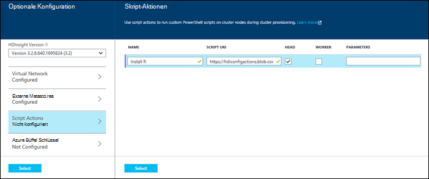

<properties
   pageTitle="In HDInsight Hadoop Cluster erstellen | Microsoft Azure"
    description="Informationen Sie zum Cluster für Azure HDInsight mithilfe der Azure-Portal."
   services="hdinsight"
   documentationCenter=""
   tags="azure-portal"
   authors="mumian"
   manager="jhubbard"
   editor="cgronlun"/>

<tags
   ms.service="hdinsight"
   ms.devlang="na"
   ms.topic="article"
   ms.tgt_pltfrm="na"
   ms.workload="big-data"
   ms.date="09/02/2016"
   ms.author="jgao"/>

# Erstellen Sie Windows-basierte Hadoop Cluster in HDInsight mithilfe der Azure-Portal

[AZURE.INCLUDE [selector](../../includes/hdinsight-selector-create-clusters.md)]

Erfahren Sie, wie einen Cluster Hadoop in Azure-Portal mit HDInsight erstellen. Microsoft [Azure-Portal](../azure-portal-overview.md) ist ein zentraler Ort bereitstellen und Azure Ressourcen. Azure-Portal ist eines der Tools für die Linux-basierten oder Windows-basierten Hadoop Cluster in HDInsight erstellen. Andere Clustererstellung Tools und Features klicken Sie auf die Registerkarte wählen oben auf dieser Seite finden Sie oder [Cluster Methoden](hdinsight-provision-clusters.md#cluster-creation-methods).

##Komponenten:

[AZURE.INCLUDE [delete-cluster-warning](../../includes/hdinsight-delete-cluster-warning.md)]

Vor diesem Artikel benötigen Sie Folgendes:

- Ein Azure-Abonnement. Finden Sie [kostenlose Testversion von Azure zu erhalten](https://azure.microsoft.com/documentation/videos/get-azure-free-trial-for-testing-hadoop-in-hdinsight/).

### Steuerelement erforderlich

[AZURE.INCLUDE [access-control](../../includes/hdinsight-access-control-requirements.md)]

## Erstellen von Clustern

**Um ein HDInsight-Cluster erstellen**

1. [Azure-Portal](https://portal.azure.com)anmelden.
2. Klicken Sie auf **neu**und klicken Sie dann auf **HDInsight**auf **Datenanalyse**.

    ![Erstellen eines neuen Clusters in Azure-Portal] (./media/hdinsight-provision-clusters/HDI.CreateCluster.1.png "Erstellen eines neuen Clusters in Azure-Portal")

3. Geben Sie ein oder wählen Sie die folgenden Werte aus:

    * **Cluster-Name**: Geben Sie einen Namen für den Cluster. Wenn verfügbar ist, wird ein grünes Häkchen neben dem Clusternamen angezeigt.

    * **Clustertyp**: **Hadoop**wählen. Andere Optionen Inclue **HBase**, **Sturm**und **Spark**.

        > [AZURE.IMPORTANT] HDInsight Cluster sind in verschiedenen Typen entsprechen den Arbeitslast oder Technologie Cluster abgestimmt ist. Es ist keine unterstützte Methode in einem Cluster, der mehrere Typen wie Sturm und HBase auf einem Cluster kombiniert.

    * **Cluster-Betriebssystem**: **Windows**auswählen. Wählen Sie zum Erstellen eines Clusters Linux Base **Linux**.
    * **Version**: [HDInsight](hdinsight-component-versioning.md)Versionen.
    * **Abonnement**: Azure Abonnement, die zum Erstellen von diesem Cluster verwendet werden.
    * **Gruppe**: Wählen Sie eine vorhandene oder eine neue Ressourcengruppe erstellen. Dieser Eintrag standardmäßig eine vorhandene Ressourcengruppen, wenn diese verfügbar sind.
    * **Anmeldeinformationen**: Konfigurieren Sie den Benutzernamen und das Kennwort für die Hadoop (HTTP) Benutzer. Aktivieren des Remotedesktops für Cluster müssen Sie die desktop-Benutzernamen und das Kennwort sowie ein Kontoablaufdatum konfigurieren. Klicken Sie unten auf Speichern **Wählen** .

        ![Cluster-Anmeldeinformationen bereitstellen] (./media/hdinsight-provision-clusters/HDI.CreateCluster.3.png "Cluster-Anmeldeinformationen bereitstellen")

    * **Datenquelle**: Erstellen Sie ein neues oder wählen Sie ein vorhandenes Azure Storage-Konto als Standard-Dateisystem für den Cluster verwendet werden.

        ![Datenquellen-blade] (./media/hdinsight-provision-clusters/HDI.CreateCluster.4.png "Konfiguration der Datenquelle angeben")

        * **Methode**: Legen Sie **alle Abonnements** aktivieren Speicherkonten alle Abonnements zu durchsuchen. Legen Sie den **Schlüssel** **Speichern Namen** und **Zugriffstaste** ein Storage-Konto eingeben soll.
        * **Konto auswählen / neue**: Klicken Sie auf Durchsuchen und ein Speicherkonto zu Cluster zugeordnet **Speicherkonto auswählen** . Oder klicken Sie auf **Neu erstellen** , um ein neues Speicherkonto erstellen. Verwenden Sie das Feld zur Eingabe des Namens des Speicherkontos. Ein grünes Häkchen wird angezeigt, wenn der Name verfügbar ist.
        * **Standardcontainer auswählen**: Eingeben der Standardcontainer für den Cluster verwenden können. Während Sie einen beliebigen Namen eingeben können, wird empfohlen, mit demselben Namen wie des Clusters, damit Sie erkennen können, dass der Container für diesen bestimmten Cluster verwendet wird.
        * **Ort**: das geografische Gebiet, die das Speicherkonto oder erstellt wird. Dabei bestimmt den Cluster-Speicherort.  Cluster und die standardmäßige Speicher müssen gemeinsam in derselben Azure Data Center finden.
    
    * **Knoten Preise Ebenen**: Anzahl der workerknoten, die für den Cluster erforderlich. Die geschätzte Kosten des Clusters wird in die Blade angezeigt.
  

        ![Knoten Preise Ebenen blade] (./media/hdinsight-provision-clusters/HDI.CreateCluster.5.png "Geben Sie Anzahl der Clusterknoten")

    * **Optionale Konfiguration** wählen Sie Clusterversion sowie andere optionale Einstellungen wie ein **Virtuelles Netzwerk**, Einrichten von einer **Externen Metastore** für Daten für Struktur und Oozie, verwenden Skriptaktionen Cluster zum Installieren von benutzerdefinierter Komponenten anpassen, oder zusätzliche Speicherkonten mit dem Cluster.

    * **HDInsight-Version**: Wählen Sie die Version für den Cluster verwenden möchten. Weitere Informationen finden Sie unter [HDInsight Cluster Versionen](hdinsight-component-versioning.md).
    * **Virtuelles Netzwerk**: Wählen Azure virtuelles Netzwerk und die Subnetzmaske des Clusters in einem virtuellen Netzwerk platzieren möchten.  

        ![Virtuelle Netzwerk-blade] (./media/hdinsight-provision-clusters/HDI.CreateCluster.6.png "Virtuelles Netzwerkdetails angeben")

        Ein virtuelles Netzwerk, einschließlich Konfiguration für das virtuelle Netzwerk mit HDInsight Informationen finden Sie unter [Erweitern HDInsight Capbilities mit einer Azure Virtual Network](hdinsight-extend-hadoop-virtual-network.md).
  

        
    * **Externe Metastores**: eine SQL Azure-Datenbank Struktur und Oozie den Cluster Speichermetadaten angeben.
 
        > [AZURE.NOTE] Metastore-Konfiguration ist nicht für HBase Cluster verfügbar.

    ![Benutzerdefinierte Metastores blade] (./media/hdinsight-provision-clusters/HDI.CreateCluster.7.png "Externe Metastores angeben")

    **Verwenden Sie eine vorhandene SQL-Datenbank für Struktur** Metadaten klicken Sie auf **Ja**Benutzername/Kennwort für die Datenbank bereit und wählen Sie eine SQL-Datenbank. Wiederholen Sie diese Schritte verwenden **Eine vorhandene SQL-Datenbank für Oozie-Metadaten**. **Klicken Sie auf auf die **Optionale Konfiguration** Blade sind.**

    >[AZURE.NOTE] Für die Metastore verwendete SQL Azure-Datenbank muss Konnektivität mit anderen Azure Services, einschließlich Azure HDInsight zulassen. Klicken Sie im Schaltpult Azure SQL-Datenbank auf der rechten Seite auf den Servernamen. Dies ist der Server, auf dem SQL-Datenbankinstanz ausgeführt wird. Einmal sind die Server-Ansicht klicken Sie auf **Konfiguration**und ** **Azure Services**klicken**und dann auf **Speichern**.

            &nbsp;

            > [AZURE.IMPORTANT] Beim Erstellen einer Metastore nicht verwenden Sie einen Datenbanknamen, der Striche oder Bindestrich enthält dadurch der Clustererstellung fehlschlagen kann.
        
        * **Script Actions** if you want to use a custom script to customize a cluster, as the cluster is being created. For more information about script actions, see [Customize HDInsight clusters using Script Action](hdinsight-hadoop-customize-cluster.md). On the Script Actions blade provide the details as shown in the screen capture.
    

            

        * **Azure Storage Keys**: Specify additional storage accounts to associate with the cluster. In the **Azure Storage Keys** blade, click **Add a storage key**, and then select an existing storage account or create a new account.
    

            

4. Klicken Sie auf **Erstellen**. Auswahl **an Startmenü anheften** wird eine Kachel für Cluster Startmenü das Portal hinzufügen. Das Symbol bedeutet, dass der Cluster erstellt wird und ändert sich nach Abschluss der Erstellung das HDInsight-Symbol angezeigt.
    
    Es dauert Clusters, normalerweise ca. 15 Minuten erstellt werden. Verwenden Sie die Kachel auf das Startmenü oder den Eintrag **Benachrichtigungen** auf der linken Seite um den Bereitstellungsprozess zu überprüfen.
    

5. Nach Abschluss die Erstellung klicken Sie für den Cluster aus Startmenü Blade Cluster gestartet. Cluster-Blade enthält wichtige Informationen zum Cluster wie den Namen der Ressourcengruppe gehört zu der Position, Betriebssystem URL für Cluster-Dashboard usw..

    ![Cluster-blade] (./media/hdinsight-provision-clusters/HDI.Cluster.Blade.png "Clustereigenschaften")

    Anhand der folgenden um Symbole oben Blatt und im Abschnitt **Grundlagen** zu verstehen:

    * **Einstellungen** und **Alle**: Zeigt das Blatt **Einstellungen** für den Cluster, dem Sie ausführliche Konfigurationsinformationen für den Cluster zugreifen kann.
    * **Dashboard**, **Dashboard Cluster**und **URL**: Diese werden auf das Dashboard Cluster ist ein Webportal Aufträge im Cluster ausgeführt.
    * **Remote Desktop**: Sie Remotedesktop auf den Clusterknoten aktivieren können.
    * **Skalierung Cluster**: können Sie die Anzahl der workerknoten für diesen Cluster.
    * **Löschen**: Löscht den HDInsight-Cluster.
    * **Schnellstart** (): Zeigt Informationen, mit denen Sie erste Schritte mit HDInsight.
    * **Benutzer** (): ermöglicht das Festlegen von Berechtigungen für _Portal-Management_ dieses Clusters für andere Benutzer auf Ihre Azure-Abonnement.
    

        > [AZURE.IMPORTANT] Diese _nur_ betrifft und die Berechtigungen dieser Cluster im Portal und hat keine Auswirkung auf die Verbindung oder Aufträge HDInsight-Cluster.
        
    * **Tags** (): Tags können Sie Schlüssel-Wert-Paare definieren Sie eine benutzerdefinierte Taxonomie von Cloud-Diensten. Beispielsweise können Sie ein __Projekt__erstellen und verwenden Sie einen gemeinsamen Wert für alle Dienste, die einem bestimmten Projekt zugeordnet.

##Anpassen von Clustern

- Siehe [Anpassen HDInsight Cluster mit Bootstrap](hdinsight-hadoop-customize-cluster-bootstrap.md).
- [Anpassen von Windows-basierten HDInsight Cluster mit Skriptaktion](hdinsight-hadoop-customize-cluster.md)anzeigen

##Nächste Schritte
In diesem Artikel haben Sie verschiedene HDInsight-Cluster erstellen. Weitere finden Sie in folgenden Artikeln:

* [Einstieg in Azure HDInsight](hdinsight-hadoop-linux-tutorial-get-started.md) - Informationen von HDInsight-Cluster
* [Hadoop senden Aufträge programmgesteuert](hdinsight-submit-hadoop-jobs-programmatically.md) - erfahren Sie programmgesteuert Aufträge an HDInsight übermitteln
* [Verwalten Sie in HDInsight Hadoop Cluster mithilfe von Azure-Portal](hdinsight-administer-use-management-portal.md)

