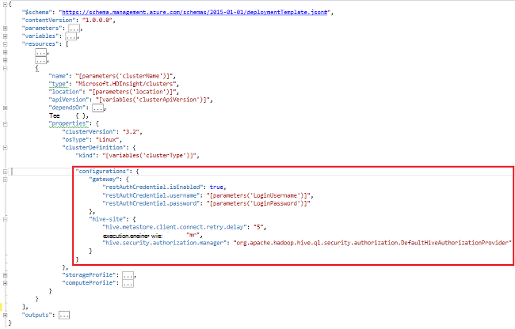

<properties
    pageTitle="HDInsight-Cluster mit Bootstrap anpassen | Microsoft Azure"
    description="Weitere Informationen zum HDInsight-Cluster mit Bootstrap anpassen."
    services="hdinsight"
    documentationCenter=""
    authors="mumian"
    manager="jhubbard"
    editor="cgronlun"
    tags="azure-portal"/>

<tags
    ms.service="hdinsight"
    ms.workload="big-data"
    ms.tgt_pltfrm="na"
    ms.devlang="na"
    ms.topic="article"
    ms.date="09/02/2016"
    ms.author="jgao"/>

# Passen Sie HDInsight-Cluster mit Bootstrap an

Manchmal möchten Sie Konfigurationsdateien konfigurieren sollen:

- clusterIdentity.xml
- Core-site.xml
- Gateway.Xml
- Hbase env.xml
- Hbase site.xml
- bietet site.xml
- Struktur-env.xml
- Struktur site.xml
- Mapred-Website
- Oozie-site.xml
- Oozie-env.xml
- Storm-site.xml
- Tez site.xml
- Webhcat site.xml
- Garn site.xml

Der Cluster können nicht die aufgrund neuer Abbilder beizubehalten. Weitere Informationen zu imaging erneut finden Sie unter [Rolle Instanz Neustart durch Aktualisierung des Betriebssystems](http://blogs.msdn.com/b/kwill/archive/2012/09/19/role-instance-restarts-due-to-os-upgrades.aspx). Zu der Änderung durch die Cluster-Lebensdauer können Sie HDInsight Cluster Anpassung während des Erstellungsprozesses. Dies ist die empfohlene Methode zum Ändern der Konfigurationen für einen Cluster und über diese Ereignisse Azure neu abbilden Neustart Neustart beibehalten. Diese Konfiguration geändert werden vor dem Starten des Diensts angewendet, sodass Dienste müssen nicht neu gestartet. 

Es gibt 3 Methoden Bootstrap verwenden:

- Azure PowerShell verwenden

    [AZURE.INCLUDE [upgrade-powershell](../../includes/hdinsight-use-latest-powershell.md)]
    
- .NET SDK verwenden
- Azure-Ressourcen-Manager-Vorlage verwenden

Informationen zum Installieren zusätzlicher Komponenten auf HDInsight Cluster während der Erstellungszeit finden Sie unter:

- [Anpassen von HDInsight Cluster mit Skriptaktion (Linux)](hdinsight-hadoop-customize-cluster-linux.md)
- [Anpassen von HDInsight Cluster mit Skriptaktion (Windows)](hdinsight-hadoop-customize-cluster.md)

## Azure PowerShell verwenden

Der folgende PowerShell-Code passt eine Struktur-Konfiguration:

    # hive-site.xml configuration
    $hiveConfigValues = @{ "hive.metastore.client.socket.timeout"="90" }
    
    $config = New-AzureRmHDInsightClusterConfig `
        | Set-AzureRmHDInsightDefaultStorage `
            -StorageAccountName "$defaultStorageAccountName.blob.core.windows.net" `
            -StorageAccountKey $defaultStorageAccountKey `
        | Add-AzureRmHDInsightConfigValues `
            -HiveSite $hiveConfigValues 
    
    New-AzureRmHDInsightCluster `
        -ResourceGroupName $existingResourceGroupName `
        -ClusterName $clusterName `
        -Location $location `
        -ClusterSizeInNodes $clusterSizeInNodes `
        -ClusterType Hadoop `
        -OSType Windows `
        -Version "3.2" `
        -HttpCredential $httpCredential `
        -Config $config 

Eine vollständige funktionsfähige PowerShell-Skript finden Sie [Anhang A](#hdinsight-hadoop-customize-cluster-bootstrap.md/appx-a:-powershell-sample).

**Um die Änderung zu überprüfen:**

1. Melden Sie sich auf der [Azure-Portal](https://portal.azure.com).
2. Im linken Bereich klicken Sie auf **Durchsuchen**und dann auf **HDInsight-Cluster**.
3. Klicken Sie auf Cluster erstellten mithilfe des PowerShell-Skripts.
4. Klicken Sie auf **Dashboard** vom oberen Rand der Blade Ambari UI öffnen.
5. Klicken Sie im linken Menü **Struktur** .
6. Klicken Sie auf **Zusammenfassung** **HiveServer2** .
7. Klicken Sie auf die Registerkarte **Konfiguration** .
8. Klicken Sie im linken Menü **Struktur** .
9. Klicken Sie auf die Registerkarte **Erweitert** .
10. Scrollen Sie nach unten und dann **Erweiterte Struktur-Website**.
11. Suchen Sie im Abschnitt **hive.metastore.client.socket.timeout** .

Weitere Beispiele für andere Konfigurationsdateien anpassen:

    # hdfs-site.xml configuration
    $HdfsConfigValues = @{ "dfs.blocksize"="64m" } #default is 128MB in HDI 3.0 and 256MB in HDI 2.1

    # core-site.xml configuration
    $CoreConfigValues = @{ "ipc.client.connect.max.retries"="60" } #default 50

    # mapred-site.xml configuration
    $MapRedConfigValues = @{ "mapreduce.task.timeout"="1200000" } #default 600000

    # oozie-site.xml configuration
    $OozieConfigValues = @{ "oozie.service.coord.normal.default.timeout"="150" }  # default 120

Weitere Informationen finden Sie in Azim Uddins Blog [Anpassen HDInsight Clustererstellung](http://blogs.msdn.com/b/bigdatasupport/archive/2014/04/15/customizing-hdinsight-cluster-provisioning-via-powershell-and-net-sdk.aspx)Titel.

## .NET SDK verwenden

Siehe [Erstellen von Linux-basierten Cluster mit .NET SDK HDInsight](hdinsight-hadoop-create-linux-clusters-dotnet-sdk.md#use-bootstrap).

## Mit Ressourcen-Manager-Vorlage

Sie können Bootstrap Ressourcenmanager Vorlage verwenden:

    "configurations": {
        …
        "hive-site": {
            "hive.metastore.client.connect.retry.delay": "5",
            "hive.execution.engine": "mr",
            "hive.security.authorization.manager": "org.apache.hadoop.hive.ql.security.authorization.DefaultHiveAuthorizationProvider"
        }
    }

## Siehe auch

- [Hadoop Cluster in HDInsight erstellen] [ hdinsight-provision-cluster] beschreibt einen HDInsight Cluster mit anderen benutzerdefinierten Optionen erstellen.
- [Entwickeln von Skriptaktion Skripts für HDInsight][hdinsight-write-script]
- [Installieren und Verwenden von Spark auf HDInsight-Cluster][hdinsight-install-spark]
- [Installieren und Verwenden von R auf HDInsight-Cluster][hdinsight-install-r]
- [Installieren und verwenden Solr auf HDInsight Cluster](hdinsight-hadoop-solr-install.md).
- [Installieren und verwenden Giraph auf HDInsight Cluster](hdinsight-hadoop-giraph-install.md).

[hdinsight-install-spark]: hdinsight-hadoop-spark-install.md
[hdinsight-install-r]: hdinsight-hadoop-r-scripts.md
[hdinsight-write-script]: hdinsight-hadoop-script-actions.md
[hdinsight-provision-cluster]: hdinsight-provision-clusters.md
[powershell-install-configure]: powershell-install-configure.md

[img-hdi-cluster-states]: ./media/hdinsight-hadoop-customize-cluster/HDI-Cluster-state.png "Phasen bei der Clustererstellung"

## A: AppX PowerShell-Beispiel

PowerShell-Skript erstellt einen HDInsight-Cluster und eine Struktur Einstellung passt:

    ####################################
    # Set these variables
    ####################################
    #region - used for creating Azure service names
    $nameToken = "<ENTER AN ALIAS>" 
    #endregion

    #region - cluster user accounts
    $httpUserName = "admin"  #HDInsight cluster username
    $httpPassword = "<ENTER A PASSWORD>" #"<Enter a Password>"

    $sshUserName = "sshuser" #HDInsight ssh user name
    $sshPassword = "<ENTER A PASSWORD>" #"<Enter a Password>"
    #endregion

    ####################################
    # Service names and varialbes
    ####################################
    #region - service names
    $namePrefix = $nameToken.ToLower() + (Get-Date -Format "MMdd")

    $resourceGroupName = $namePrefix + "rg"
    $hdinsightClusterName = $namePrefix + "hdi"
    $defaultStorageAccountName = $namePrefix + "store"
    $defaultBlobContainerName = $hdinsightClusterName

    $location = "East US 2"
    #endregion

    # Treat all errors as terminating
    $ErrorActionPreference = "Stop"

    ####################################
    # Connect to Azure
    ####################################
    #region - Connect to Azure subscription
    Write-Host "`nConnecting to your Azure subscription ..." -ForegroundColor Green
    try{Get-AzureRmContext}
    catch{Login-AzureRmAccount}
    #endregion

    #region - Create an HDInsight cluster
    ####################################
    # Create dependent components
    ####################################
    Write-Host "Creating a resource group ..." -ForegroundColor Green
    New-AzureRmResourceGroup `
        -Name  $resourceGroupName `
        -Location $location

    Write-Host "Creating the default storage account and default blob container ..."  -ForegroundColor Green
    New-AzureRmStorageAccount `
        -ResourceGroupName $resourceGroupName `
        -Name $defaultStorageAccountName `
        -Location $location `
        -Type Standard_GRS

    $defaultStorageAccountKey = (Get-AzureRmStorageAccountKey `
                                    -ResourceGroupName $resourceGroupName `
                                    -Name $defaultStorageAccountName)[0].Value
    $defaultStorageContext = New-AzureStorageContext `
                                    -StorageAccountName $defaultStorageAccountName `
                                    -StorageAccountKey $defaultStorageAccountKey
    New-AzureStorageContainer `
        -Name $defaultBlobContainerName `
        -Context $defaultStorageContext #use the cluster name as the container name

    ####################################
    # Create a configuration object
    ####################################
    $hiveConfigValues = @{ "hive.metastore.client.socket.timeout"="90" }
        
    $config = New-AzureRmHDInsightClusterConfig `
        | Set-AzureRmHDInsightDefaultStorage `
            -StorageAccountName "$defaultStorageAccountName.blob.core.windows.net" `
            -StorageAccountKey $defaultStorageAccountKey `
        | Add-AzureRmHDInsightConfigValues `
            -HiveSite $hiveConfigValues 

    ####################################
    # Create an HDInsight cluster
    ####################################
    $httpPW = ConvertTo-SecureString -String $httpPassword -AsPlainText -Force
    $httpCredential = New-Object System.Management.Automation.PSCredential($httpUserName,$httpPW)

    $sshPW = ConvertTo-SecureString -String $sshPassword -AsPlainText -Force
    $sshCredential = New-Object System.Management.Automation.PSCredential($sshUserName,$sshPW)

    New-AzureRmHDInsightCluster `
        -ResourceGroupName $resourceGroupName `
        -ClusterName $hdinsightClusterName `
        -Location $location `
        -ClusterSizeInNodes 1 `
        -ClusterType Hadoop `
        -OSType Linux `
        -Version "3.2" `
        -HttpCredential $httpCredential `
        -SshCredential $sshCredential `
        -Config $config

    ####################################
    # Verify the cluster
    ####################################
    Get-AzureRmHDInsightCluster -ClusterName $hdinsightClusterName

    #endregion
