<properties
    pageTitle="HDInsight Cluster mit Skriptaktionen anpassen | Microsoft Azure"
    description="Informationen Sie zum HDInsight Linux-basierten Cluster mit Skriptaktionen benutzerdefinierte Komponenten hinzufügen. Skriptaktionen sind Bash Skripts, die auf den Clusterknoten und wird die Clusterkonfiguration anpassen oder Hinzufügen zusätzlicher Dienste und Dienstprogramme wie Farbton, Solr oder r"
    services="hdinsight"
    documentationCenter=""
    authors="Blackmist"
    manager="jhubbard"
    editor="cgronlun"
    tags="azure-portal"/>

<tags
    ms.service="hdinsight"
    ms.workload="big-data"
    ms.tgt_pltfrm="na"
    ms.devlang="na"
    ms.topic="article"
    ms.date="09/06/2016"
    ms.author="larryfr"/>

# Passen Sie HDInsight Linux-basierten Cluster mit Skriptaktion an

HDInsight bietet eine Option namens **Skriptaktion** , benutzerdefinierte Skripts aufruft, die den Cluster anpassen. Diese Skripts können während der Erstellung des Clusters oder auf einem bereits laufenden Cluster verwendet werden und werden verwendet, um zusätzliche Komponenten installieren oder die Konfiguration ändern.

> [AZURE.NOTE] Skript-Aktionen auf einem bereits laufenden Cluster verwenden ist nur verfügbar für Linux-basierte HDInsight-Cluster. Informationen mit Windows-basierten Clustern Skriptaktionen finden Sie unter [Anpassen HDInsight Cluster mit Skriptaktion (Windows)](hdinsight-hadoop-customize-cluster.md).

Skript-Aktionen können auch Azure Marketplace als HDInsight Anwendung veröffentlicht werden. Einige der Beispiele in diesem Dokument anzeigen wie eine HDInsight Anwendung Aktion Skriptbefehle PowerShell und das .NET SDK installieren können Weitere Informationen zu HDInsight wurden finden Sie unter [Veröffentlichen HDInsight Anwendung in Azure Marketplace](hdinsight-apps-publish-applications.md). 

## Grundlegendes zu Skript-Aktionen

Ein Skript ist einfach ein, dass Sie eine URL und Parameter für und dann auf den Clusterknoten HDInsight Skriptes, Bash. Folgende sind Merkmale und Funktionen von Skriptaktionen.

* Muss auf einen URI gespeichert werden, die von der HDInsight-Cluster. Im folgenden sind mögliche Speicherorte:

    * Ein BLOB-Speicher, der entweder primäre oder zusätzliche Speicher Konto für HDInsight-Cluster. Da HDInsight beide Typen von Speicherkonten während der Erstellung des Clusters zugreifen kann, können diese nicht öffentliche Skriptaktion verwenden.
    
    * Einer öffentlich lesbaren URI wie Azure Blob, GitHub, OneDrive, Ablage, etc..
    
    Beispiele für den URI für Skripten im BLOB-Container (öffentlich lesbaren) finden Sie im Abschnitt [Beispiel Skript Aktion Skripts](#example-script-action-scripts) .

* __Nur Knoten bestimmte ausführen__, z. B. Head-Knoten oder Knoten Arbeitskraft kann eingeschränkt werden.

    > [AZURE.NOTE] Mit HDInsight Premium können Sie angeben, dass das Skript auf dem edgeknoten verwendet werden soll.

* __Beibehalten__ oder __ad-hoc-__möglich.

    __Persisted__ Skripten sind Skripten, die Arbeitskraft Knoten angewendet werden automatisch auf neue Knoten erstellt, wenn ein Cluster Skalierung ausgeführt.

    Einem dauerhaften Skript möglicherweise Änderungen auch zu einem anderen Knoten wie Head-Knoten jedoch hinsichtlich Funktionalität nur ein Skript beibehalten werden, gilt für neue Arbeitskraft Knoten erstellt, wenn ein Cluster skaliert wird.

    > [AZURE.IMPORTANT] Beibehaltene Skriptaktionen müssen einen eindeutigen Namen haben.

    __Ad-hoc-__ Skripts nicht beibehalten; aber können Sie anschließend heraufstufen ein ad-hoc-Skripts zu einem dauerhaften Skript oder Herabstufen einer dauerhaften Skript ein ad-hoc-Skript.

    > [AZURE.IMPORTANT] Skriptaktionen während der Clustererstellung werden automatisch beibehalten.
    >
    > Skripts fehlschlagen nicht beibehalten, wenn Sie ausdrücklich angegeben werden.

* Akzeptieren __Parameter__ , die vom Skript während der Ausführung verwendet werden.

* Mit __root-Berechtigungen__ ausgeführt werden, auf den Clusterknoten.

* __Azure-Portal__, __Azure PowerShell__, __Azure-CLI__oder __HDInsight.NET SDK__ dienen

    [AZURE.INCLUDE [upgrade-powershell](../../includes/hdinsight-use-latest-powershell-cli-and-dotnet-sdk.md)]

Zu verstehen, welche Skripts auf einem Cluster angewendet wurden, und bestimmen Sie hält die ID des Skripts Heraufstufen oder herabstufen, Cluster einen Verlauf aller Skripten, die ausgeführt wird.

> [AZURE.IMPORTANT] Gibt es kein automatisches Verfahren eine Skriptaktion Änderungen rückgängig gemacht. Benötigen Sie die Effekte eines Skripts umkehren, müssen Sie Änderungen verstehen und manuell stornieren (oder ein Skript Aktion, die sie macht.)

### Skript für Aktion in der Clustererstellung

Skriptaktionen während der Clustererstellung werden geringfügig vom Skript Aktionen in einem bestehenden Cluster ausgeführt:

* Das Skript wird __automatisch beibehalten__.

* Ein __Fehler__ im Skript kann der Clustererstellung fehlschlagen.

Das folgende Diagramm veranschaulicht, wenn Skriptaktion während des Erstellungsprozesses ausgeführt wird:

![HDInsight Cluster Anpassung und Phasen bei der Clustererstellung][img-hdi-cluster-states]

Das Skript wird ausgeführt, HDInsight wird konfiguriert. Zu diesem Zeitpunkt das Skript parallel ausgeführt wird, auf den angegebenen Knoten im Cluster und mit Root-Rechten ausgeführt wird, auf den Knoten.

> [AZURE.NOTE] Da das Skript wird mit Root-Berechtigungsstufe auf den Clusterknoten ausgeführt, können Sie Vorgänge wie das Beenden und Starten von Diensten, einschließlich Hadoop-Dienste ausführen. Wenn Sie Dienste beenden, müssen Sie sicherstellen, dass Ambari-Dienst und andere Hadoop-Dienste ausgeführt werden, bevor das Skript beendet. Diese Dienste müssen erfolgreich bestimmen den Zustand und Status des Clusters erstellt wird.

Während der Clustererstellung können Sie mehrere Skriptaktionen, die aufgerufen werden in der Reihenfolge, in denen sie angegeben wurden.

> [AZURE.IMPORTANT] Skript-Aktionen müssen innerhalb von 60 Minuten oder Timeout wird. Während der Bereitstellung Cluster das Skript gleichzeitig mit anderen Prozessen Einrichtung und Konfiguration ausgeführt. Wettbewerb um Ressourcen wie CPU-Zeit oder der Bandbreite kann das Skript länger dauern, als bei Umgebung.
>
> Um die Zeit zu minimieren dauert, führen Sie das Skript vermeiden Sie Aufgaben wie das Herunterladen und Kompilieren der Anwendung von Quelle. Stattdessen kompilieren Sie die Anwendung vor und speichern Sie die Binärdatei in Azure BLOB-Speicher, sodass es dem Cluster schnell heruntergeladen werden kann.

###Skript für Aktion in einem Cluster ausgeführt

Im Gegensatz zu Skripts Lief Aktionen während der Clustererstellung ein Fehler in einem Skript auf einem bereits laufenden Cluster verursacht automatisch Cluster ausgefallen ändern. Sobald ein Skript abgeschlossen ist, sollte Cluster in einen Zustand "ausgeführt" zurückgeben.

> [AZURE.IMPORTANT] Dies bedeutet nicht, dass Cluster ausgeführte Skripts ist, die schlecht. Beispielsweise könnte ein Skript Löschen vom Cluster Konfiguration ändern, damit Dienste benötigten Dateien usw.
>
> Skripten Aktionen ausführen mit Administrator-Zugriffsrechten, Sie sicherstellen sollten, dass Sie macht ein Skript wissen vor dem Cluster anwenden.

Beim Anwenden eines Skripts auf einem Cluster wird der Clusterstatus __ausgeführt__ , __akzeptiert__, dann __HDInsight Konfiguration__ändern und schließlich __ausgeführt__ für erfolgreiche Skripts zurück. Der Status des Skripts im Skript Aktionsverlauf angemeldet und können Sie verwenden, um festzustellen, ob das Skript erfolgreich war oder nicht. Angenommen, die `Get-AzureRmHDInsightScriptActionHistory` PowerShell-Cmdlets verwendet werden, um den Status eines Skripts anzuzeigen. Es gibt Informationen ähnlich der folgenden zurück:

    ScriptExecutionId : 635918532516474303
    StartTime         : 2/23/2016 7:40:55 PM
    EndTime           : 2/23/2016 7:41:05 PM
    Status            : Succeeded

> [AZURE.NOTE] Wenn Sie das Kennwort für Benutzer (Admin) nach der Erstellung des Clusters geändert haben, möglicherweise diese Skript Lief Aktionen gegen diese Cluster fehlschlagen. Haben Sie dauerhaften Skriptaktionen, Arbeitskraft Zielknoten, möglicherweise diese beim Knoten zum Cluster über Vorgänge Größe hinzufügen.

## Skriptaktion Beispielskripts

Skript Aktion Skripts können von Azure-Portal Azure PowerShell, Azure-CLI oder HDInsight .NET SDK verwendet werden. HDInsight bietet Skripts die folgenden Komponenten auf HDInsight-Cluster installieren:

Name | Skript
----- | -----
**Ein Azure Storage-Konto hinzufügen** | https://hdiconfigactions.BLOB.Core.Windows.NET/linuxaddstorageaccountv01/Add-Storage-Account-v01.sh. Siehe [anwenden eine Skriptaktion auf einem Cluster ausgeführt](#apply-a-script-action-to-a-running-cluster).
**Installieren Sie Farbton** | https://hdiconfigactions.BLOB.Core.Windows.NET/linuxhueconfigactionv02/Install-Hue-uber-v02.sh. [Installieren und verwenden Farbton auf HDInsight Cluster](hdinsight-hadoop-hue-linux.md)anzeigen
**Installieren von R** | https://hdiconfigactions.BLOB.Core.Windows.NET/linuxrconfigactionv01/r-Installer-v01.sh. [Installieren und verwenden Sie R für HDInsight Cluster](hdinsight-hadoop-r-scripts-linux.md)anzeigen
**Solr installieren** | https://hdiconfigactions.BLOB.Core.Windows.NET/linuxsolrconfigactionv01/solr-Installer-v01.sh. [Installieren und verwenden Solr auf HDInsight Cluster](hdinsight-hadoop-solr-install-linux.md)anzeigen
**Giraph installieren** | https://hdiconfigactions.BLOB.Core.Windows.NET/linuxgiraphconfigactionv01/giraph-Installer-v01.sh. [Installieren und verwenden Giraph auf HDInsight Cluster](hdinsight-hadoop-giraph-install-linux.md)anzeigen
| **Pre-Load Hive Bibliotheken** | https://hdiconfigactions.BLOB.Core.Windows.NET/linuxsetupcustomhivelibsv01/Setup-customhivelibs-v01.sh. Siehe [Bibliotheken für HDInsight Cluster Struktur hinzufügen](hdinsight-hadoop-add-hive-libraries.md) |

## Verwenden Sie eine Skriptaktion bei der Clustererstellung

Dieser Abschnitt enthält Beispiele für die verschiedenen Verwendungsmöglichkeiten Skriptaktionen beim Erstellen einer HDInsight Cluster - von Azure-Portal mithilfe einer Vorlage Ressourcenmanager Azure mithilfe von PowerShell-CMDlets und .NET SDK verwenden.

### Verwenden Sie eine Skriptaktion während der Erstellung des Clusters von Azure-portal

1. Erstellen Sie einen Cluster als [Cluster erstellen Hadoop in HDInsight](hdinsight-provision-clusters.md#portal)beschrieben.

2. Klicken Sie unter __Optionale Konfiguration__Blade **Skriptaktionen** auf **Skriptaktion hinzufügen** , um Angaben über die Skriptaktion wie folgt:

    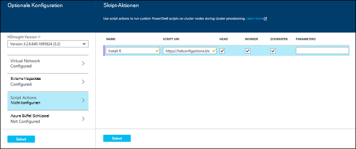

  	| Eigenschaft | Wert |
  	| -------- | ----- |
  	| Name | Geben Sie einen Namen für die Skriptaktion. |
  	| Skript URI | Geben Sie den URI für das Skript aufgerufen wird, um den Cluster anpassen. |
  	| Head-Arbeitskraft | Geben Sie Knoten (**Head**, **Arbeitskraft**oder **ZooKeeper**) für die Ausführung des Skripts anpassen. |
  	| Parameter | Geben Sie die Parameter ggf. vom Skript an. |

    Drücken Sie die EINGABETASTE mehrere Skriptaktion zum Installieren von mehreren Komponenten im Cluster hinzufügen.

3. Klicken Sie auf **Wählen** , speichern Sie die Konfiguration und Erstellung des Clusters fort.

### Verwenden Sie eine Skriptaktion von Azure-Ressourcen-Manager-Vorlagen

In diesem Abschnitt verwenden wir Azure Resource Manager Vorlagen HDInsight-Cluster erstellen und auch eine Skriptaktion benutzerdefinierte Komponenten (in diesem Beispiel R) im Cluster installieren. Dieser Abschnitt enthält eine Beispiel-Vorlage zum Erstellen eines Clusters mit Skriptaktion.

> [AZURE.NOTE] Die Schritte in diesem Abschnitt zeigen Erstellen eines Clusters mit einer Skriptaktion. Ein Beispiel für einen Cluster aus einer Vorlage mit einer HDInsight Anwendung erstellen finden Sie unter [benutzerdefinierte HDInsight Anwendung zu installieren](hdinsight-apps-install-custom-applications.md).

#### Bevor Sie beginnen

* Informationen zum Konfigurieren einer Arbeitsstation Ausführen von HDInsight-Powershell-Cmdlets finden Sie [Installieren und Konfigurieren von Azure PowerShell](../powershell-install-configure.md).
* Informationen zum Erstellen von Vorlagen finden Sie unter [Azure Ressourcenmanager erstellen Vorlagen](../resource-group-authoring-templates.md).
* Wenn Sie nicht zuvor Azure PowerShell mit Ressourcen-Manager verwendet haben, finden Sie unter [Verwendung von Azure PowerShell mit Azure-Ressourcen-Manager](../powershell-azure-resource-manager.md).

#### Erstellen Sie Cluster mit Skriptaktion

1. Kopieren Sie die folgende Vorlage an einem Speicherort auf Ihrem Computer. Diese Vorlage installiert Giraph auf die Headnodes und Arbeitskraft Knoten im Cluster. Sie können auch überprüfen, ob die JSON-Vorlage gültig ist. [JSONLint](http://jsonlint.com/), ein Onlinetool JSON Validierung den Inhalt einfügen.

            {
            "$schema": "http://schema.management.azure.com/schemas/2015-01-01/deploymentTemplate.json#",
            "contentVersion": "1.0.0.0",
            "parameters": {
                "clusterLocation": {
                    "type": "string",
                    "defaultValue": "West US",
                    "allowedValues": [ "West US" ]
                },
                "clusterName": {
                    "type": "string"
                },
                "clusterUserName": {
                    "type": "string",
                    "defaultValue": "admin"
                },
                "clusterUserPassword": {
                    "type": "securestring"
                },
                "sshUserName": {
                    "type": "string",
                    "defaultValue": "username"
                },
                "sshPassword": {
                    "type": "securestring"
                },
                "clusterStorageAccountName": {
                    "type": "string"
                },
                "clusterStorageAccountResourceGroup": {
                    "type": "string"
                },
                "clusterStorageType": {
                    "type": "string",
                    "defaultValue": "Standard_LRS",
                    "allowedValues": [
                        "Standard_LRS",
                        "Standard_GRS",
                        "Standard_ZRS"
                    ]
                },
                "clusterStorageAccountContainer": {
                    "type": "string"
                },
                "clusterHeadNodeCount": {
                    "type": "int",
                    "defaultValue": 1
                },
                "clusterWorkerNodeCount": {
                    "type": "int",
                    "defaultValue": 2
                }
            },
            "variables": {
            },
            "resources": [
                {
                    "name": "[parameters('clusterStorageAccountName')]",
                    "type": "Microsoft.Storage/storageAccounts",
                    "location": "[parameters('clusterLocation')]",
                    "apiVersion": "2015-05-01-preview",
                    "dependsOn": [ ],
                    "tags": { },
                    "properties": {
                        "accountType": "[parameters('clusterStorageType')]"
                    }
                },
                {
                    "name": "[parameters('clusterName')]",
                    "type": "Microsoft.HDInsight/clusters",
                    "location": "[parameters('clusterLocation')]",
                    "apiVersion": "2015-03-01-preview",
                    "dependsOn": [
                        "[concat('Microsoft.Storage/storageAccounts/', parameters('clusterStorageAccountName'))]"
                    ],
                    "tags": { },
                    "properties": {
                        "clusterVersion": "3.2",
                        "osType": "Linux",
                        "clusterDefinition": {
                            "kind": "hadoop",
                            "configurations": {
                                "gateway": {
                                    "restAuthCredential.isEnabled": true,
                                    "restAuthCredential.username": "[parameters('clusterUserName')]",
                                    "restAuthCredential.password": "[parameters('clusterUserPassword')]"
                                }
                            }
                        },
                        "storageProfile": {
                            "storageaccounts": [
                                {
                                    "name": "[concat(parameters('clusterStorageAccountName'),'.blob.core.windows.net')]",
                                    "isDefault": true,
                                    "container": "[parameters('clusterStorageAccountContainer')]",
                                    "key": "[listKeys(resourceId('Microsoft.Storage/storageAccounts', parameters('clusterStorageAccountName')), '2015-05-01-preview').key1]"
                                }
                            ]
                        },
                        "computeProfile": {
                            "roles": [
                                {
                                    "name": "headnode",
                                    "targetInstanceCount": "[parameters('clusterHeadNodeCount')]",
                                    "hardwareProfile": {
                                        "vmSize": "Large"
                                    },
                                    "osProfile": {
                                        "linuxOperatingSystemProfile": {
                                            "username": "[parameters('sshUserName')]",
                                            "password": "[parameters('sshPassword')]"
                                        }
                                    },
                                    "scriptActions": [
                                        {
                                            "name": "installGiraph",
                                            "uri": "https://hdiconfigactions.blob.core.windows.net/linuxgiraphconfigactionv01/giraph-installer-v01.sh",
                                            "parameters": ""
                                        }
                                    ]
                                },
                                {
                                    "name": "workernode",
                                    "targetInstanceCount": "[parameters('clusterWorkerNodeCount')]",
                                    "hardwareProfile": {
                                        "vmSize": "Large"
                                    },
                                    "osProfile": {
                                        "linuxOperatingSystemProfile": {
                                            "username": "[parameters('sshUserName')]",
                                            "password": "[parameters('sshPassword')]"
                                        }
                                    },
                                    "scriptActions": [
                                        {
                                            "name": "installR",
                                            "uri": "https://hdiconfigactions.blob.core.windows.net/linuxrconfigactionv01/r-installer-v01.sh",
                                            "parameters": ""
                                        }
                                    ]
                                }
                            ]
                        }
                    }
                }
            ],
            "outputs": {
                "cluster":{
                    "type" : "object",
                    "value" : "[reference(resourceId('Microsoft.HDInsight/clusters',parameters('clusterName')))]"
                }
            }
        }

2. Starten Sie Azure PowerShell und melden in Azure-Konto. Nach Anmeldeinformationen, gibt der Befehl Informationen zu Ihrem Konto.

        Add-AzureRmAccount

        Id                             Type       ...
        --                             ----
        someone@example.com            User       ...

3. Wenn Sie mehrere Abonnements, bieten Sie die Abonnement-Id für die Bereitstellung verwenden möchten.

        Select-AzureRmSubscription -SubscriptionID <YourSubscriptionId>

    > [AZURE.NOTE] Sie können `Get-AzureRmSubscription` eine Liste aller Abonnements, die Ihr Konto enthält die Abonnement-Id für jede zugeordnet.

5. Wenn Sie eine vorhandene Ressourcengruppe nicht haben, erstellen Sie eine neue Ressourcengruppe. Geben Sie den Namen der Ressourcengruppe und Speicherort, die Sie für Ihre Lösung benötigen. Eine neue Ressourcengruppe wird zurückgegeben.

        New-AzureRmResourceGroup -Name myresourcegroup -Location "West US"

        ResourceGroupName : myresourcegroup
        Location          : westus
        ProvisioningState : Succeeded
        Tags              :
        Permissions       :
                            Actions  NotActions
                            =======  ==========
                            *
        ResourceId        : /subscriptions/######/resourceGroups/ExampleResourceGroup

6. Erstellen Sie eine neue Bereitstellung für die Ressourcengruppe **Neu AzureRmResourceGroupDeployment** Befehl und geben Sie die erforderlichen Parameter. Der Parameter enthält einen Namen für die Bereitstellung der Name der Ressourcengruppe und den Pfad oder URL der Vorlage erstellten. Wenn die Vorlage Parameter erfordert, müssen Sie diesen Parameter übergeben. Skriptaktion für R auf dem Cluster installieren erfordert in diesem Fall keine Parameter.

        New-AzureRmResourceGroupDeployment -Name mydeployment -ResourceGroupName myresourcegroup -TemplateFile <PathOrLinkToTemplate>

    Sie werden aufgefordert, Werte für die Parameter in der Vorlage definierten bereitzustellen.

7. Wenn die Ressourcengruppe bereitgestellt wurde, sehen Sie eine Zusammenfassung der Bereitstellung.

          DeploymentName    : mydeployment
          ResourceGroupName : myresourcegroup
          ProvisioningState : Succeeded
          Timestamp         : 8/17/2015 7:00:27 PM
          Mode              : Incremental
          ...

8. Schlägt die Bereitstellung können die folgenden Cmdlets Sie Informationen über den Fehler.

        Get-AzureRmResourceGroupDeployment -ResourceGroupName myresourcegroup -ProvisioningState Failed

### Verwenden Sie eine Skriptaktion während der Clustererstellung Azure PowerShell

In diesem Abschnitt verwenden wir das Cmdlet [Hinzufügen AzureRmHDInsightScriptAction](https://msdn.microsoft.com/library/mt603527.aspx) Skripts aufrufen Skriptaktion anpassen ein Clusters mit. Stellen Sie bevor Sie fortfahren sicher installiert und Azure PowerShell konfiguriert. Informationen zum Konfigurieren einer Arbeitsstation Ausführen von HDInsight-PowerShell-Cmdlets finden Sie [Installieren und Konfigurieren von Azure PowerShell](../powershell-install-configure.md).

Führen Sie die folgenden Schritte aus:

1. Azure PowerShell-Konsole öffnen und die folgenden bei Azure-Abonnement und einige PowerShell-Variablen deklarieren:

        # LOGIN TO ZURE
        Login-AzureRmAccount

        # PROVIDE VALUES FOR THESE VARIABLES
        $subscriptionId = "<SubscriptionId>"        # ID of the Azure subscription
        $clusterName = "<HDInsightClusterName>"         # HDInsight cluster name
        $storageAccountName = "<StorageAccountName>"    # Azure storage account that hosts the default container
        $storageAccountKey = "<StorageAccountKey>"      # Key for the storage account
        $containerName = $clusterName
        $location = "<MicrosoftDataCenter>"             # Location of the HDInsight cluster. It must be in the same data center as the storage account.
        $clusterNodes = <ClusterSizeInNumbers>          # The number of nodes in the HDInsight cluster.
        $resourceGroupName = "<ResourceGroupName>"      # The resource group that the HDInsight cluster will be created in

2. Geben Sie die Konfigurationswerte (z. B. Knoten im Cluster) und der Standardspeicher verwendet werden.

        # SPECIFY THE CONFIGURATION OPTIONS
        Select-AzureRmSubscription -SubscriptionId $subscriptionId
        $config = New-AzureRmHDInsightClusterConfig
        $config.DefaultStorageAccountName="$storageAccountName.blob.core.windows.net"
        $config.DefaultStorageAccountKey=$storageAccountKey

3. Verwenden Sie **Add-AzureRmHDInsightScriptAction** -Cmdlet Skript aufrufen. Das folgende Beispiel verwendet ein Skript, die Giraph des Clusters installiert:

        # INVOKE THE SCRIPT USING THE SCRIPT ACTION FOR HEADNODE AND WORKERNODE
        $config = Add-AzureRmHDInsightScriptAction -Config $config -Name "Install Giraph"  -NodeType HeadNode -Uri https://hdiconfigactions.blob.core.windows.net/linuxgiraphconfigactionv01/giraph-installer-v01.sh
        $config = Add-AzureRmHDInsightScriptAction -Config $config -Name "Install Giraph"  -NodeType WorkerNode -Uri https://hdiconfigactions.blob.core.windows.net/linuxgiraphconfigactionv01/giraph-installer-v01.sh

    **Add-AzureRmHDInsightScriptAction** -Cmdlet verwendet die folgenden Parameter:

  	| Parameter | Definition |
  	| --------- | ---------- |
  	| Konfiguration | Konfigurationsobjekt Script Informationen hinzugefügt wird. |
  	| Name | Name der Skriptaktion. |
  	| NodeType | Gibt den Knoten, auf dem das Skript Anpassung ausgeführt wird. Die gültigen Werte sind **Hauptknoten** (um auf dem Head-Knoten installieren), **WorkerNode** (um auf die Datenknoten installieren) oder **ZookeeperNode** (auf der Zookeeper-Knoten installieren). |
  	| Parameter | Das Skript erforderlichen Parameter. |
  	| URI | Gibt den URI für das Skript ausgeführt wird. |

4. Festlegen Sie den Benutzer Admin-HTTPS für den Cluster:

        $httpCreds = get-credential

    Wenn Sie aufgefordert werden, geben Sie den Namen 'Admin' und ein Kennwort.

5. Legen Sie die SSH-Anmeldeinformationen:

        $sshCreds = get-credential

    Bei Aufforderung geben Sie SSH-Benutzernamen und ein Kennwort. SSH-Konto ein Zertifikat anstelle eines Kennworts geschützt werden soll, verwenden Sie ein leeres Kennwort und legen `$sshPublicKey` Inhalt den öffentlichen Schlüssel des Zertifikats verwenden möchten. Zum Beispiel:

        $sshPublicKey = Get-Content .\path\to\public.key -Raw

4. Erstellen Sie schließlich den Cluster:

        New-AzureRmHDInsightCluster -config $config -clustername $clusterName -DefaultStorageContainer $containerName -Location $location -ResourceGroupName $resourceGroupName -ClusterSizeInNodes $clusterNodes -HttpCredential $httpCreds -SshCredential $sshCreds -OSType Linux

    Wenn Sie einen öffentlichen Schlüssel sichern Ihr SSH-Konto verwenden, müssen Sie auch angeben `-SshPublicKey $sshPublicKey` als Parameter.

Es dauert einige Minuten, bevor der Cluster erstellt wird.

### Verwenden Sie eine Skriptaktion während der Clustererstellung HDInsight .NET SDK

HDInsight .NET SDK stellt Clientbibliotheken, die HDInsight von einer Arbeit erleichtert. Ein Codebeispiel finden Sie unter [Erstellen von Linux-basierten Cluster mit .NET SDK HDInsight](hdinsight-hadoop-create-linux-clusters-dotnet-sdk.md#use-script-action).

## Eine Skriptaktion ausgeführten Cluster anwenden

Dieser Abschnitt enthält Beispiele für verschiedenen Arten Skriptaktionen ausführen HDInsight Cluster anwenden können; Mithilfe von PowerShell-CMDlets, plattformübergreifende Azure CLI und .NET SDK von Azure-Portal. In diesem Abschnitt verwendeten beibehaltenen Skriptaktion hinzugefügt ausgeführten Cluster ein Azure Storage-Konto. Sie können auch andere Skriptaktionen Siehe [Beispiel Skriptaktion Skripts](#example-script-action-scripts).

### Eine Skriptaktion von Azure-Portal ausgeführten Cluster anwenden

1. Wählen Sie aus dem [Azure-Portal](https://portal.azure.com)HDInsight Cluster.

2. Wählen Sie HDInsight Cluster Blade __Skriptaktionen__ nebeneinander.

    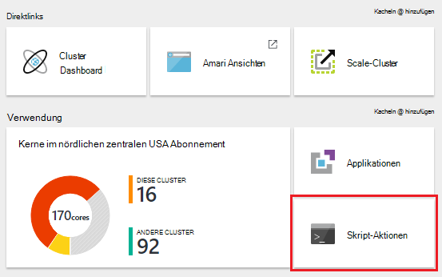

    > [AZURE.NOTE] Sie können auch __Alle__ Einstellungen und __Skriptaktionen__ Einstellungen Blatt wählen.

4. Wählen Sie oben Skriptaktionen Blade __neue senden__.

    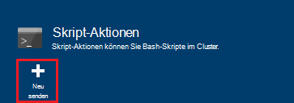

5. Blatt Skriptaktion hinzufügen eingeben.

    * __Name__: der Anzeigename für diese Aktion Skript. In diesem Beispiel `Add Storage account`.
    * __Skript-URI__: der URI für das Skript. In diesem Beispiel`https://hdiconfigactions.blob.core.windows.net/linuxaddstorageaccountv01/add-storage-account-v01.sh`
    * __Kopf__, __Arbeitskraft__und __Zookeeper__: Überprüfen Sie die Knoten, die das Skript angewendet werden soll. In diesem Beispiel werden Kopf, Arbeitskraft und Zookeeper überprüft.
    * __Parameter__: Wenn das Skript Parameter annimmt, geben Sie sie hier. Geben Sie in diesem Beispiel den speicherkontonamen und Speicherschlüssel Konto:

        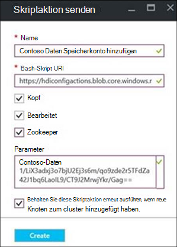

        Auf dem Screenshot `contosodata` ein Azure Storage-Konto wird die zweite Zeile ist Speicherschlüssel Konto.
    * __PERSISTED__: Dieser Eintrag überprüfen, ob das Skript so, dass es neue Arbeitskraft Knoten angewendet wird, wenn der Cluster Skalieren beibehalten werden sollen.

6. Schließlich verwenden Sie __Erstellen__ beim Anwenden des Skripts auf dem Cluster.

### Eine Skriptaktion von Azure PowerShell ausgeführten Cluster anwenden

Stellen Sie bevor Sie fortfahren sicher installiert und Azure PowerShell konfiguriert. Informationen zum Konfigurieren einer Arbeitsstation Ausführen von HDInsight-PowerShell-Cmdlets finden Sie [Installieren und Konfigurieren von Azure PowerShell](../powershell-install-configure.md).

1. Azure PowerShell-Konsole öffnen und die folgenden bei Azure-Abonnement und einige PowerShell-Variablen deklarieren:

        # LOGIN TO ZURE
        Login-AzureRmAccount

        # PROVIDE VALUES FOR THESE VARIABLES
        $clusterName = "<HDInsightClusterName>"         # HDInsight cluster name
        $saName = "<ScriptActionName>"                  # Name of the script action
        $saURI = "<URI to the script>"                  # The URI where the script is located
        $nodeTypes = "headnode", "workernode"
        
    > [AZURE.NOTE] Bei einem HDInsight Premium-Cluster können Nodetype der `"edgenode"` führen Sie das Skript auf dem edgeknoten aus.

2. Verwenden Sie den folgenden Befehl beim Anwenden des Skripts auf den Cluster:

        Submit-AzureRmHDInsightScriptAction -ClusterName $clusterName -Name $saName -Uri $saURI -NodeTypes $nodeTypes -PersistOnSuccess

    Sobald der Auftrag abgeschlossen ist, erhalten Sie Informationen, die der folgenden ähnelt:

        OperationState  : Succeeded
        ErrorMessage    :
        Name            : Giraph
        Uri             : https://hdiconfigactions.blob.core.windows.net/linuxgiraphconfigactionv01/giraph-installer-v01.sh
        Parameters      :
        NodeTypes       : {HeadNode, WorkerNode}

### Eine Skriptaktion von Azure-CLI ausgeführten Cluster anwenden

Stellen Sie bevor Sie fortfahren sicher installiert und konfiguriert der Azure-CLI. Weitere Informationen finden Sie unter [Installieren der Azure-CLI](../xplat-cli-install.md).

    [AZURE.INCLUDE [use-latest-version](../../includes/hdinsight-use-latest-cli.md)] 

1. Öffnen Sie eine shellsitzung, Terminal, Eingabeaufforderungsfenster oder andere Befehlszeilenoptionen für Ihr System und verwenden Sie den folgenden Befehl in Azure-Ressourcen-Manager-Modus wechseln.

        azure config mode arm

2. Anhand der folgenden um Azure-Abonnement zu authentifizieren.

        azure login

3. Verwenden Sie den folgenden Befehl ausführen Cluster eine Skriptaktion zuweisen

        azure hdinsight script-action create <clustername> -g <resourcegroupname> -n <scriptname> -u <scriptURI> -t <nodetypes>

    Wenn Sie Parameter für diesen Befehl auslassen, werden Sie dafür aufgefordert. Wenn das Skript mit Angabe `-u` akzeptiert Parameter, können sie mit der `-p` Parameter.

    Gültige __Nodetypes__ sind __Hauptknoten__, __Workernode__und __Zookeeper__. Wenn das Skript auf mehreren Knoten angewendet werden soll, welche getrennt durch ein ';'. Z. B. `-n headnode;workernode`.

    Behalten Sie das Skript hinzufügen der `--persistOnSuccess`. Sie können das Skript auch zu einem späteren Zeitpunkt beibehalten, mit `azure hdinsight script-action persisted set`.
    
    Sobald der Auftrag abgeschlossen ist, erhalten Sie eine Ausgabe ähnlich der folgenden.
    
        info:    Executing command hdinsight script-action create
        + Executing Script Action on HDInsight cluster
        data:    Operation Info
        data:    ---------------
        data:    Operation status:
        data:    Operation ID:  b707b10e-e633-45c0-baa9-8aed3d348c13
        info:    hdinsight script-action create command OK

### Zuweisen eines laufenden Clusters mithilfe der REST-API eine Skriptaktion

Siehe [Skriptaktionen ausführen auf einem Cluster ausgeführt](https://msdn.microsoft.com/library/azure/mt668441.aspx).
### Laufende Cluster HDInsight .NET SDK eine Skriptaktion zuweisen

Ein Beispiel für das .NET SDK eines Clusters Skripts zuweisen finden Sie unter [https://github.com/Azure-Samples/hdinsight-dotnet-script-action](https://github.com/Azure-Samples/hdinsight-dotnet-script-action).

## Zeigen Sie Verlauf an heraufstufen Sie und Herabstufen Sie Skriptaktionen

### Mithilfe des Azure-Portals

1. Wählen Sie aus dem [Azure-Portal](https://portal.azure.com)HDInsight Cluster.

2. __Wählen Sie aus dem Blade HDInsight Cluster.__

    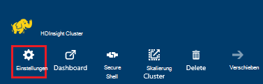

3. Wählen Sie Blatt Einstellungen __Skriptaktionen__.

    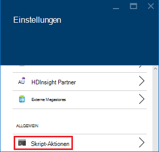

4. Eine Liste der gespeicherten Skripts sowie einen Verlauf des Skripts mit dem Cluster wird auf das Skriptaktionen angezeigt. In der Abbildung unten sehen Sie Solr Skript wurde auf diesem Cluster ausgeführt, jedoch keine Skriptaktionen beibehalten wurde.

    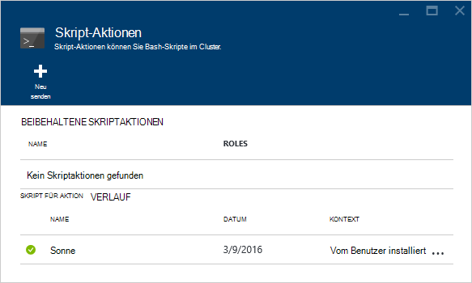

5. Wählen ein Skript aus zeigt Eigenschaften Blade für dieses Skript. Oben im Blatt können Sie das Skript erneut ausführen oder fördern.

    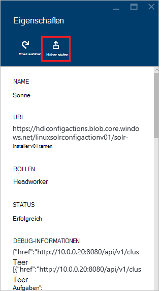

6. Sie können auch die __...__ rechts von Einträgen auf der Skriptaktionen Aktionen wie erneut beibehalten oder löschen (bei beibehaltenen Aktionen).

    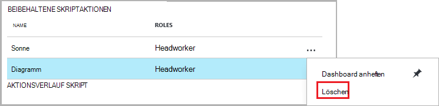

### Mithilfe von Azure PowerShell

| Verwenden Sie den folgenden... | An... |
| ----- | ----- |
| AzureRmHDInsightPersistedScriptAction abrufen | Abrufen von Informationen zum dauerhaften Skriptaktionen |
| AzureRmHDInsightScriptActionHistory abrufen | Abrufen der Geschichte Skriptaktionen Cluster oder Details für ein bestimmtes Skript angewendet |
| AzureRmHDInsightPersistedScriptAction festlegen | Ein ad-hoc-Skriptaktion für beibehaltene Skriptaktion fördert |
| AzureRmHDInsightPersistedScriptAction entfernen | Stuft eine beibehaltene Skriptaktion einer ad-hoc-Aktion |

> [AZURE.IMPORTANT] Mit `Remove-AzureRmHDInsightPersistedScriptAction` keine durch ein Skript Aktionen nicht rückgängig, es entfernt nur dauerhaften Kennzeichnung, dass das Skript nicht auf neue Arbeitskraft Knoten zum Cluster hinzugefügt haben.

Das folgende Beispielskript veranschaulicht, wie mit den Cmdlets heraufstufen und Herabstufen eines Skripts.

    # Get a history of scripts
    Get-AzureRmHDInsightScriptActionHistory -ClusterName mycluster

    # From the list, we want to get information on a specific script
    Get-AzureRmHDInsightScriptActionHistory -ClusterName mycluster -ScriptExecutionId 635920937765978529

    # Promote this to a persisted script
    # Note: the script must have a unique name to be promoted
    # if the name is not unique, you will receive an error
    Set-AzureRmHDInsightPersistedScriptAction -ClusterName mycluster -ScriptExecutionId 635920937765978529

    # Demote the script back to ad hoc
    # Note that demotion uses the unique script name instead of
    # execution ID.
    Remove-AzureRmHDInsightPersistedScriptAction -ClusterName mycluster -Name "Install Giraph"

### Verwendung der Azure-CLI

| Verwenden Sie den folgenden... | An... |
| ----- | ----- |
| `azure hdinsight script-action persisted list <clustername>` | Eine Liste der beibehaltenen Skriptaktionen abrufen |
| `azure hdinsight script-action persisted show <clustername> <scriptname>` | Abrufen von Informationen über eine bestimmte beibehaltenen Skriptaktion |
| `azure hdinsight script-action history list <clustername>` | Abrufen der Geschichte Skriptaktionen Cluster angewendet |
| `azure hdinsight script-action history show <clustername> <scriptname>` | Abrufen von Informationen über ein bestimmtes Skript-Aktion |
| `azure hdinsight script action persisted set <clustername> <scriptexecutionid>` | Ein ad-hoc-Skriptaktion für beibehaltene Skriptaktion fördert |
| `azure hdinsight script-action persisted delete <clustername> <scriptname>` | Stuft eine beibehaltene Skriptaktion einer ad-hoc-Aktion |

> [AZURE.IMPORTANT] Mit `azure hdinsight script-action persisted delete` keine durch ein Skript Aktionen nicht rückgängig, es entfernt nur dauerhaften Kennzeichnung, dass das Skript nicht auf neue Arbeitskraft Knoten zum Cluster hinzugefügt haben.

### Mithilfe des HDInsight .NET SDK

Beispielsweise verwenden .NET SDK Skript Geschichte von einem Cluster abrufen Heraufstufen oder Herabstufen von Skripts, finden Sie unter [https://github.com/Azure-Samples/hdinsight-dotnet-script-action](https://github.com/Azure-Samples/hdinsight-dotnet-script-action).

> [AZURE.NOTE] Darüber hinaus wird veranschaulicht, wie eine HDInsight Anwendung .NET SDK installieren.

## Problembehandlung

Ambari Web-Benutzeroberfläche können Sie Informationen vom Skriptaktionen protokolliert. Wird das Skript im cluster erstellen und Clustererstellung Fehler im Skript, die Protokolle stehen im Speicherkonto standardmäßig dem Cluster zugeordnet. Dieser Abschnitt enthält Informationen zum Abrufen der Protokolle mit diesen Optionen.

### Mithilfe der Ambari Web-Benutzeroberfläche

1. Navigieren Sie in Ihrem Browser zu https://CLUSTERNAME.azurehdinsight.net. Der Name des Clusters HDInsight ersetzen Sie CLUSTERNAME.

    Bei Aufforderung geben Sie die Administratorkontonamen (Admin) und das Kennwort für den Cluster. Möglicherweise geben Sie die Administratoranmeldeinformationen in einem Webformular.

2. Wählen Sie die Leiste am oberen Rand der Seite __Ops__ -Eintrag. Dies zeigt eine Liste der aktuellen und der vorherigen Operationen des Clusters durch Ambari.

    

3. Suchen Sie nach Einträgen, die __Ausführen\_Customscriptaction__ in der Spalte __Vorgänge__ . Diese werden erstellt, wenn das Skriptaktionen ausgeführt.

    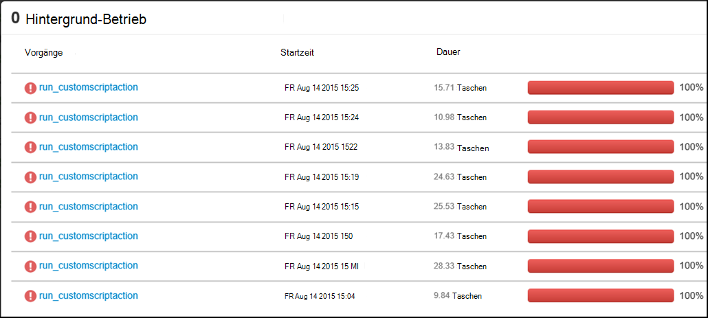

    Wählen Sie diesen Eintrag und Drilldown über die Links zeigen die STDOUT und STDERR Ausgabe generiert, wenn das Skript wurde für den Cluster ausgeführt.

### Zugriffsprotokolle vom Standardkonto Speicher

Wenn der Clustererstellung aufgrund eines Fehlers im Skriptaktion fehlgeschlagen ist, protokolliert das Skript Aktion noch direkt vom Speicher Standardkonto Cluster zugeordnet möglich.

* Storage-Protokolle finden Sie unter `\STORAGE_ACOCUNT_NAME\DEFAULT_CONTAINER_NAME\custom-scriptaction-logs\CLUSTER_NAME\DATE`.

    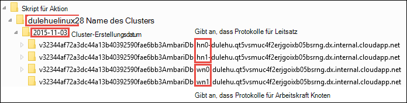

    Darunter sind die Protokolle separat Hauptknoten, Workernode und Zookeeper-Knoten organisiert. Beispiele sind:
    * **Hauptknoten** - `<uniqueidentifier>AmbariDb-hn0-<generated_value>.cloudapp.net`
    * **Arbeitskraft-Knoten** - `<uniqueidentifier>AmbariDb-wn0-<generated_value>.cloudapp.net`
    * **Zookeeper-Knoten** - `<uniqueidentifier>AmbariDb-zk0-<generated_value>.cloudapp.net`

* Alle Stdout und Stderr des entsprechenden Hosts wird an das Speicherkonto hochgeladen. Gibt eine **Ausgabe -\*.txt** und **Fehler -\*.txt** für jede Skriptaktion. Ausgabe *.txt-Datei enthält Informationen über den URI des Skripts auf dem Server laufen. Zum Beispiel

        'Start downloading script locally: ', u'https://hdiconfigactions.blob.core.windows.net/linuxrconfigactionv01/r-installer-v01.sh'

* Es ist möglich, einen Skript Aktion Cluster wiederholt mit demselben Namen zu erstellen. In diesem Fall können Sie die entsprechenden Protokolle basierend auf den Namen des Ordners unterscheiden. Beispielsweise werden die Ordnerstruktur für einen Cluster (MeinCluster) zu unterschiedlichen Zeitpunkten erstellt:
    * `\STORAGE_ACOCUNT_NAME\DEFAULT_CONTAINER_NAME\custom-scriptaction-logs\mycluster\2015-10-04`
    * `\STORAGE_ACOCUNT_NAME\DEFAULT_CONTAINER_NAME\custom-scriptaction-logs\mycluster\2015-10-05`

* Wenn Sie einen Skript Aktion Cluster mit dem gleichen Namen am gleichen Tag erstellen, können eindeutige Präfix Sie um die entsprechenden Protokolldateien zu identifizieren.

* Erstellen eines Clusters am Ende des Tages ist möglich, dass die Protokolldateien über zwei Tage erstrecken. In diesem Fall sehen Sie zwei unterschiedliche Ordner desselben Clusters.

* Hochladen von Dateien zum Standardcontainer dauert bis zu 5 Minuten, insbesondere bei großen Clustern. Also wenn Sie Protokolle zugreifen möchten, sollten Sie nicht sofort Cluster löschen schlägt eine Skriptaktion.

## Unterstützung für Open-Source-Software, die auf HDInsight-Cluster

Microsoft Azure HDInsight-Dienst ist eine flexible Plattform, die mit Ökosystem Open Source-Technologien Hadoop gebildet big Data Applications in der Cloud erstellen kann. Microsoft Azure bietet eine allgemeine Unterstützung für Open-Source-Technologien wie **Support** -Bereich der [Azure-Support-FAQ-Website](https://azure.microsoft.com/support/faq/). HDInsight-Dienst bietet zusätzliche Unterstützung für die Komponenten wie unten beschrieben.

Es gibt zwei Arten der Open Source-Komponenten, die in der HDInsight-Dienst:

- **Integrierte Komponenten** – diese Komponenten sind vorinstalliert auf HDInsight-Cluster und Kernfunktionen des Clusters bereitstellen. Beispielsweise gehören GARN ResourceManager Abfragesprache Struktur (HiveQL) und Mahout-Bibliothek zu dieser Kategorie. Eine vollständige Liste der Komponenten von Serverclustern steht in [neuen Hadoop Cluster Versionen von HDInsight bereitgestellten?](hdinsight-component-versioning.md).

- **Benutzerdefinierte Komponenten** – Sie als Benutzer des Clusters können installieren oder jede Komponente in der Gemeinschaft oder von Ihnen erstellte in Workload verwenden.

> [AZURE.WARNING] Komponenten mit HDInsight-Cluster vollständig unterstützt und Microsoft Support hilft isolieren und Lösen von Problemen im Zusammenhang mit diesen Komponenten.
>
> Benutzerdefinierte Komponenten erhalten angemessene Unterstützung helfen, das Problem zu beheben. Dadurch kann die Fehlerbehebung oder Aufforderung zu Kanälen für open-Source-Technologien, fundiertes Fachwissen für diese Technologie fand. Beispielsweise sind viele Community-Sites, wie verwendet werden können: [MSDN-Forum für HDInsight](https://social.msdn.microsoft.com/Forums/azure/en-US/home?forum=hdinsight), [http://stackoverflow.com](http://stackoverflow.com). Apache-Projekte verfügen Projektsites auf [http://apache.org](http://apache.org), zum Beispiel: [Hadoop](http://hadoop.apache.org/).

HDInsight Service bietet verschiedene benutzerdefinierte Komponenten. Unabhängig davon, wie eine Komponente verwendet oder im Cluster installiert gilt die gleiche Unterstützung. Es folgt eine Liste der häufigsten angepassten Komponenten HDInsight-Cluster eingesetzt werden können:

1. Bewerbung - Hadoop oder andere Arten von Einzelvorgängen, die ausgeführt oder benutzerdefinierte Komponenten kann dem Cluster gesendet werden.

2. Cluster-Anpassung – während der Clustererstellung können Sie zusätzliche Einstellungen und angepassten Komponenten, die auf den Clusterknoten installiert werden.

3. Beispiele – häufig verwendete benutzerdefinierte Komponenten und Microsoft bieten Beispiele für die Verwendung dieser Komponenten in Clustern HDInsight. Diese Beispiele werden ohne Unterstützung bereitgestellt.

##Problembehandlung

###Verlauf wird während der Erstellung des Clusters verwendeten Skripts angezeigt.

Wenn Cluster, vor dem 15. März 2016 erstellt wurde sehen Sie keinen Eintrag im Skript Aktionsverlauf für alle Skripts, die während der Erstellung des Clusters verwendet. Wenn den Cluster nach dem 15. März 2016 Größe erscheint während der Erstellung des Clusters mit Skripts im Verlauf wie sie neue Knoten im Cluster als Teil des Anpassungsvorgangs angewendet werden.

Es gibt zwei Ausnahmen:

* Wenn Ihr Cluster vor dem 1. September 2015 erstellt wurde. Dies ist beim Skriptaktionen eingeführt wurden, alle vor diesem Datum erstellten Cluster nicht Skriptaktionen Clustererstellung hätte verwendet.

* Wenn Sie mehrere Skriptaktionen während der Erstellung des Clusters, und denselben Namen für mehrere Skripts oder denselben Namen, denselben URI aber unterschiedlichen Parametern für mehrere Skripts verwendet. In diesen Fällen erhalten Sie die Fehlermeldung.

    Keine neuen Skriptaktionen können auf diesem Cluster durch in Konflikt stehende Skriptnamen vorhandenen Skripts ausgeführt werden. Skript zur Cluster erstellen muss eindeutig sein. Vorhandene Skripts werden weiterhin auf Größe ausgeführt werden.

## Nächste Schritte

Finden Sie Informationen und Beispiele zum Erstellen und Verwenden von Skripts zum Anpassen eines Clusters:

- [Entwickeln von Skriptaktion Skripts für HDInsight](hdinsight-hadoop-script-actions-linux.md)
- [Installieren und Verwenden von Solr auf HDInsight-Cluster](hdinsight-hadoop-solr-install-linux.md)
- [Installieren und Verwenden von Giraph auf HDInsight-Cluster](hdinsight-hadoop-giraph-install-linux.md)

[img-hdi-cluster-states]: ./media/hdinsight-hadoop-customize-cluster-linux/HDI-Cluster-state.png "Phasen bei der Clustererstellung"
