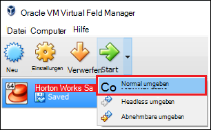

<properties
    pageTitle="Mithilfe eine Sandbox Hadoop Hadoop | Microsoft Azure"
    description="Starten mit Hadoop-Ökosystem Kennenlernen können Sie Hadoop Sandbox von Hortonworks auf einem Azure virtuellen Computer einrichten. "
    keywords="Hadoop Emulator Hadoop sandbox"
    editor="cgronlun"
    manager="jhubbard"
    services="hdinsight"
    authors="nitinme"
    documentationCenter=""
    tags="azure-portal"/>

<tags
    ms.service="hdinsight"
    ms.workload="big-data"
    ms.tgt_pltfrm="na"
    ms.devlang="na"
    ms.topic="article"
    ms.date="08/24/2016"
    ms.author="nitinme"/>

# Einstieg in Hadoop Ökosystem mit einer Sandbox Hadoop auf einem virtuellen Computer

Informationen Sie zum Sandbox Hadoop auf einem virtuellen Computer Hadoop-Ökosystem Kennenlernen von Hortonworks installieren. Die Sandbox bietet eine lokalen Umgebung Hadoop Hadoop verteilt Datei System bietet und Bewerbung erfahren.

## Erforderliche Komponenten

* [Oracle VirtualBox](https://www.virtualbox.org/)

Sobald Sie Hadoop auskennen, können Sie beginnen Hadoop auf Azure HDInsight-Cluster erstellen. Weitere Informationen für den Einstieg finden Sie unter [Erste Schritte mit Hadoop auf HDInsight](hdinsight-hadoop-linux-tutorial-get-started.md).

## Downloaden Sie und installieren Sie die virtuellen Computer

1. Wählen Sie von [http://hortonworks.com/downloads/#sandbox](http://hortonworks.com/downloads/#sandbox) __VIRTUALBOX herunterladen__ für HDP 2.4 auf Hortonworks Sandbox. Sie werden aufgefordert, sich mit Hortonworks, bevor der Download beginnt.

    

2. Derselben Webseite wählen Sie __VirtualBox-Installationshandbuch__ für HDP 2.4 auf Hortonworks Sandbox. Dies wird ein PDF-Dokument mit Installationshinweise für den virtuellen Computer heruntergeladen.

    

## Starten Sie die virtuellen Computer

1. Starten Sie VirtualBox Hortonworks Sandbox, wählen Sie __Starten__und dann __Normal__.

    

2. Die Virtual Machine den Startvorgang abgeschlossen hat, zeigt es Login-Informationen. Öffnen Sie einen Webbrowser, und navigieren Sie zu der URL angezeigt (in der Regel Http://127.0.0.1:8888).

## Kennwörter

1. Wählen Sie Schritt __beginnen__ der Hortonworks geschützten Seite __Erweiterte Optionen__. Verwenden Sie die Informationen auf dieser Seite für die Anmeldung mit SSH Sandbox. Verwenden Sie den Namen und das Kennwort.

    > [AZURE.NOTE] Wenn Sie keine SSH-Client installiert haben, können Sie den webbasierte SSH zur virtuellen Computer auf __Http://localhost:4200 /__.

    Verbindung über SSH zum ersten Mal werden Sie aufgefordert, das Kennwort für das Konto ändern. Geben Sie ein neues Kennwort beim Anmelden über SSH zukünftig verwendet werden.

2. Nach der Anmeldung Geben Sie folgenden Befehl ein:

        ambari-admin-password-reset
    
    Wenn Sie aufgefordert werden, geben Sie ein Kennwort für das Administratorkonto Ambari. Dies wird beim Zugriff auf die Webbenutzeroberfläche Ambari verwendet.

## Verwenden Sie den Befehl Struktur

1. Aus einer SSH-Verbindung in der Sandbox Befehl folgende Struktur Shell starten:

        hive

2. Nach dem Start der Shell anhand der folgenden Tabellen anzeigen, die mit der Sandbox bereitgestellt werden:

        show tables;

3. Verwenden Sie die folgenden 10 Zeilen aus der `sample_07` Tabelle:

        select * from sample_07 limit 10;

## Nächste Schritte

* [Enthält Informationen zum Verwenden von Visual Studio mit geschützten Hortonworks](hdinsight-hadoop-emulator-visual-studio.md)
* [Erlernen der Seile der Hortonworks Sandbox](http://hortonworks.com/hadoop-tutorial/learning-the-ropes-of-the-hortonworks-sandbox/)
* [Hadoop Lernprogramm - Erste Schritte mit HDP](http://hortonworks.com/hadoop-tutorial/hello-world-an-introduction-to-hadoop-hcatalog-hive-and-pig/)