<properties
pageTitle="Verwenden Microsoft Azure Data Lake-Tools für Visual Studio mit der Sandbox Hortonworks | Microsoft Azure"
description="Enthält Informationen zum Verwenden von Azure Data Lake-Tools für VIsual Studio mit Hortonworks Sandbox (lokale VM ausgeführt.) Mit diesen Tools können Sie erstellen und Ausführen von Struktur und Schwein Aufträge Sandbox und Ansicht Auftragsausgabe und Verlauf."
services="hdinsight"
documentationCenter=""
authors="Blackmist"
manager="paulettm"
editor="cgronlun"/>

<tags
ms.service="hdinsight"
ms.devlang="na"
ms.topic="article"
ms.tgt_pltfrm="na"
ms.workload="big-data"
ms.date="08/26/2016"
ms.author="larryfr"/>

# Verwenden Sie Azure Data Lake-Tools für Visual Studio mit Hortonworks Sandbox

Azure Data Lake-Tools für Visual Studio-einschließen Tools für die Arbeit mit generischen Hadoop neben Tools zum Arbeiten mit Azure Data Lake und HDInsight Dieses Dokument enthält Schritte verwenden der Azure Data Lake Hortonworks Sandkasten in einer lokalen virtuellen Computer ausgeführt.

Mit der Hortonworks-Sandbox kann Hadoop auf Umgebung arbeiten. Nachdem Sie eine Lösung und Ebene bereitstellen möchten, können Sie anschließend einen HDInsight-Cluster verschieben.

## Erforderliche Komponenten

* Der Hortonworks-Sandbox auf Umgebung auf einem virtuellen Computer ausgeführt. Dieses Dokument wurde geschrieben und getestet mit Oracle VirtualBox konfiguriert wurde mithilfe der Informationen in das Dokument [Einstieg in das Ökosystem Hadoop](hdinsight-hadoop-emulator-get-started.md) auf Sandbox.

* Visual Studio 2013 oder beliebige Edition 2015.

* [Azure SDK für .NET](https://azure.microsoft.com/downloads/) 2.7.1 oder höher

* [Azure Data Lake-Tools für Visual Studio](https://www.microsoft.com/download/details.aspx?id=49504)

## Konfigurieren von Kennwörtern für den Sandkasten

Hortonworks Sandbox ausgeführt wird, und folgen Sie den Schritten konfigurieren Sie das Kennwort für die SSH [Einstieg in Hadoop-Ökosystem](hdinsight-hadoop-emulator-get-started.md#set-passwords) `root` Konto und die Ambari `admin` Konto. Diese Kennwörter werden beim Verbinden mit der Sandbox von Visual Studio verwendet werden.

## Die Tools in der Sandbox verbinden

1. Öffnen Sie Visual Studio, und wählen Sie __Ansicht__, und klicken Sie dann auf __Server-Explorer__.

2. __Server-Explorer__klicken Sie mit der rechten Maustaste den Eintrag __HDInsight__ und wählen Sie __HDInsight Emulator__.

    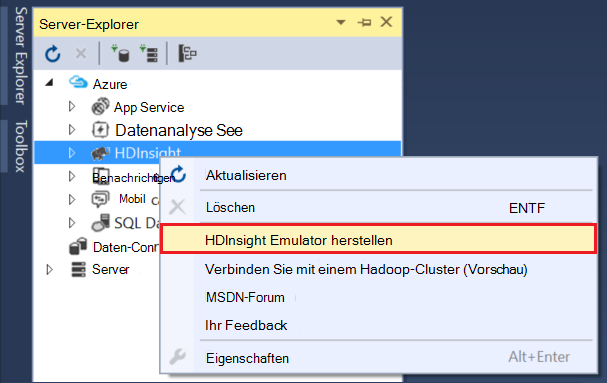

3. Dialogfeld __mit HDInsight Emulator__ Geben Sie ein, die für Ambari konfiguriert.

    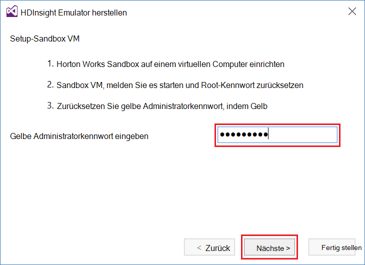

    Wählen Sie __Weiter__ .

4. Verwenden Sie das Feld __Kennwort__ Passwort für konfiguriert die `root` Konto. Lassen Sie die Felder den Standardwert.

    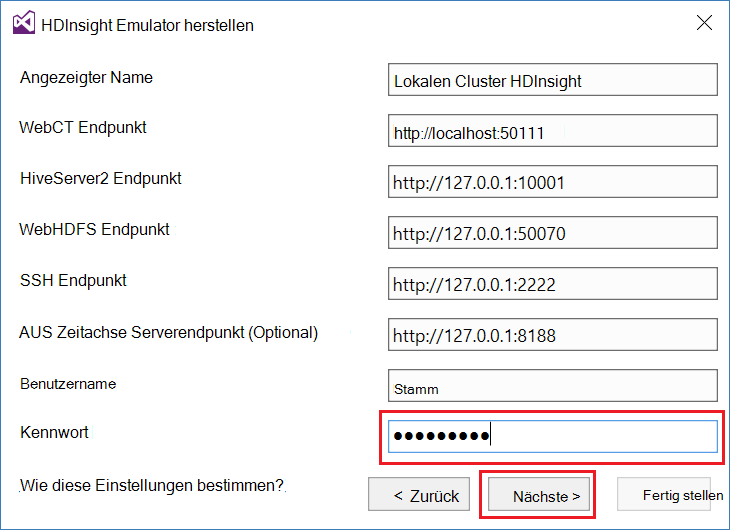

    Wählen Sie __Weiter__ .

5. Warten Sie auf Prüfung des Services abgeschlossen. In einigen Fällen möglicherweise Validierung fehl und aufgefordert, die Konfiguration zu aktualisieren. In diesem Fall wählen Sie __Aktualisieren__ und warten Sie Konfiguration und Überprüfung der Dienst abgeschlossen.

    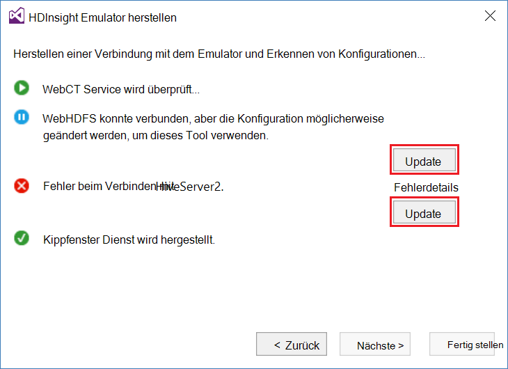

    > [AZURE.NOTE] Der Aktualisierungsvorgang mithilfe Ambari eine Hortonworks geschützten Konfiguration von Azure Data Lake-Tools für Visual Studio erwartet.

    Nach Abschluss der Überprüfung wählen Sie __Fertig stellen__ um die Konfiguration abzuschließen.

    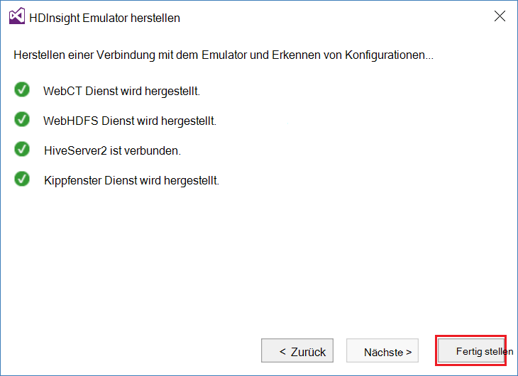

    > [AZURE.NOTE] Je nach Umgebung und virtuellen Computer zugewiesene Speichergröße dauert es einige Minuten konfigurieren und die Dienste zu überprüfen.

Nach diesen Schritten haben Sie jetzt einen Eintrag "HDInsight lokalen Cluster" im Server-Explorer im Abschnitt HDInsight.

## Schreiben einer Abfrage Struktur

Struktur enthält eine SQL-ähnliche Sprache (HiveQL) zum Arbeiten mit strukturierten Daten. Gehen Sie wie auf dem lokalen Cluster Ad-hoc-Abfragen ausführen.

1. Im __Server-Explorer__mit der rechten Maustaste auf den Eintrag für den lokalen Cluster, den Sie zuvor hinzugefügt und wählen Sie dann __eine Hive-Abfrage schreiben__.

    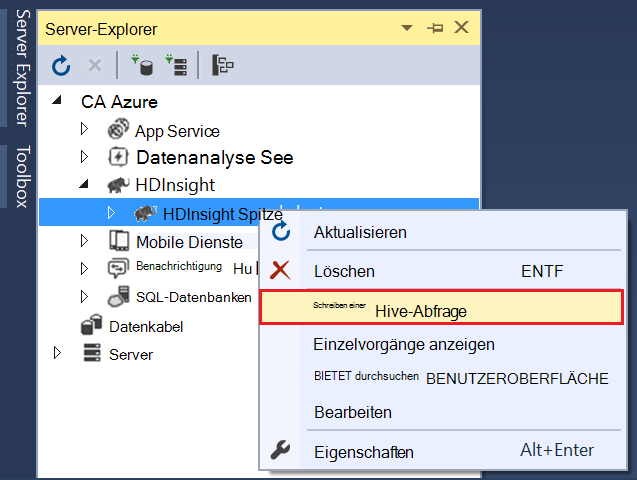

    Dadurch wird ein neues Abfragefenster, mit dem Sie schnell einrichten und eine Anfrage zu dem lokalen Cluster geöffnet.

2. Geben Sie in das neue Abfragefenster Folgendes ein:

        select count(*) from sample_08;
    
    Oben im Fenster Abfrage sicherzustellen Sie, Konfiguration der lokale Cluster aktiviert ist und wählen Sie __Senden__. Übernehmen Sie die anderen Werte (__Batch__ und Server Name) die Standardwerte.

    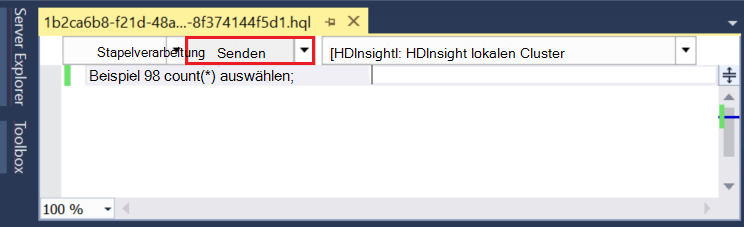

    Beachten Sie, dass Sie auch im Dropdown-Menü neben __Senden__ __Erweitert__auswählen. Dies öffnet ein Dialogfeld, mit dem Sie zusätzliche Optionen bereitstellen, wenn den Auftrag gesendet.

    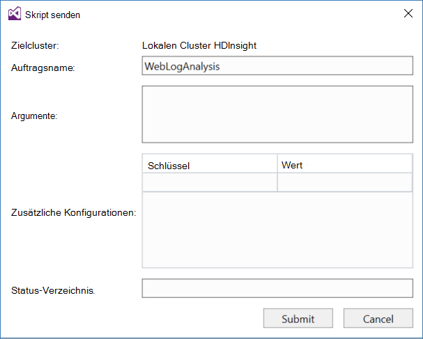

3. Nach die Abfrage senden wird der Status angezeigt. Diese Informationen über den Auftrag Hadoop Verarbeitung. __Auftragsstatus__ -Eintrag enthält den aktuellen Status des Auftrags. Der Status in regelmäßigen Abständen aktualisiert und können das Aktualisierungssymbol den Status manuell aktualisieren.

    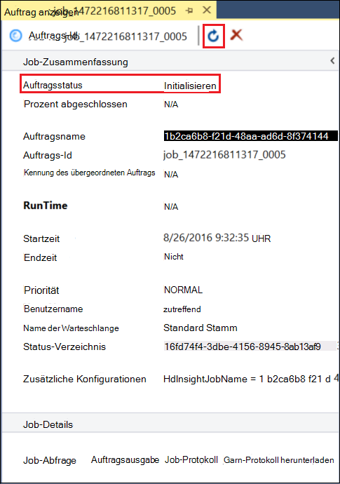

    Nach __Auftragsstatus__ zu __beendet__ändert, wird eine gesteuerte azyklische Diagramm (DAG) angezeigt. Beschreibt den Ausführungspfad Tez (Standard Ausführungsmoduls für Struktur auf dem lokalen Cluster.) festgestellt wurde 
    
    > [AZURE.NOTE] Tez wird ebenfalls standardmäßig HDInsight Linux-basierten Cluster verwenden. Es ist nicht standardmäßig auf Windows-basierten HDInsight. verwenden, Sie müssen die Zeile hinzufügen `set hive.execution.engine = tez;` an den Anfang der Hive-Abfrage. 

    Verwenden Sie den Link __Auftragsausgabe__ zum Anzeigen der Ausgabe. In diesem Fall ist es __823__. die Anzahl der Zeilen in der Tabelle sample_08. Über die Links __Job-Protokoll__ und __Herunterladen aus Protokolldateien__ können Sie Diagnoseinformationen über den Auftrag anzeigen.

4. Sie können auch Hive-Aufträge durch Ändern __der Blattname__ an __Interactive__interaktiv ausgeführt und wählen Sie __Ausführen__. 

    

    Dies überträgt das Ausgabelog während der Verarbeitung an das Ausgabefenster __HiveServer2__ generiert.
    
    > [AZURE.NOTE] Dies sind dieselben Informationen, die über den Link __Job-Protokoll__ nach Abschluss eines Druckauftrags.

    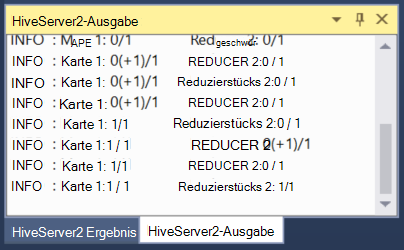

## Erstellen Sie ein Projekt Struktur

Sie können auch ein Projekt erstellen, das mehrere Hive-Skripts enthält. Dies ist hilfreich, wenn Skripts verknüpft haben, die Sie trennen oder mit einem Versionskontrollsysteme verwalten.

1. Wählen Sie in Visual Studio __Datei__, __neu__und Then__Project__.

2. Die Liste der Projekte Sie __Vorlagen__, __Azure Data Lake__ und wählen Sie dann die __Struktur (HDInsight)__. Wählen Sie aus der Liste der Vorlagen __Beispiel Struktur__. Geben Sie einen Namen und Speicherort, und wählen Sie dann __OK__.

    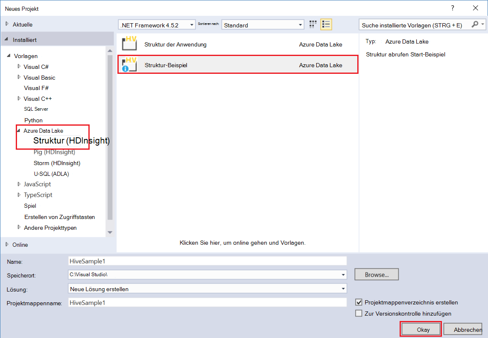

__Struktur__ Beispielprojekt enthält zwei Skripts, __WebLogAnalysis.hql__ und __SensorDataAnalysis.hql__. Sie können mit __derselben Absenden__ am oberen Fensterrand senden.

## Erstellen Sie ein Projekt Schwein

Struktur für das Arbeiten mit strukturierten SQL-ähnliche Sprache bereitstellt, bietet Schwein Sprache (Schwein Latein), mit dem Sie eine Rohrleitung von Transformationen entwickeln, die auf Daten angewendet werden. Gehen Sie folgendermaßen vor dem lokalen Cluster Schwein mit.

1. Öffnen Sie Visual Studio, und wählen Sie __Datei__, __neu__und __Projekt__. Die Liste der Projekte Sie __Vorlagen__, __Azure Data Lake__, und wählen Sie dann __Schwein (HDInsight)__. Wählen Sie aus der Liste der Vorlagen __Schwein Anwendung__. Geben Sie einen Namen, Speicherort, und klicken Sie auf __OK__.

    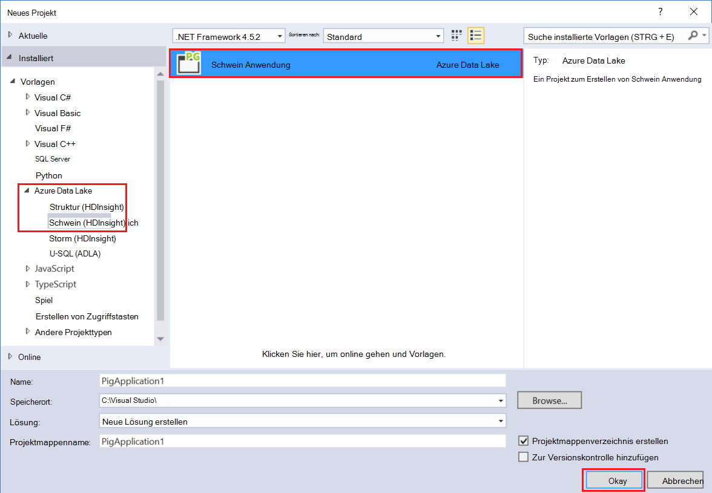

2. Geben Sie Folgendes als Inhalt der Datei __script.pig__ , die das Projekt erstellt wurde.

        a = LOAD '/demo/data/Website/Website-Logs' AS (
            log_id:int, 
            ip_address:chararray, 
            date:chararray, 
            time:chararray, 
            landing_page:chararray, 
            source:chararray);
        b = FILTER a BY (log_id > 100);
        c = GROUP b BY ip_address;
        DUMP c;

    Schwein eine andere Sprache als Struktur verwendet, zwar die Ausführung der Jobs zwischen beiden Sprachen durch __Absenden__ . Die Drop unten neben __Senden__ auswählen zeigt ein Dialogfeld Erweiterte senden für Schweine.

    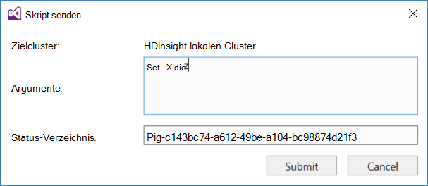
    
3. Auftragsstatus und Ausgabe ist gleich als Struktur Abfrage angezeigt.

    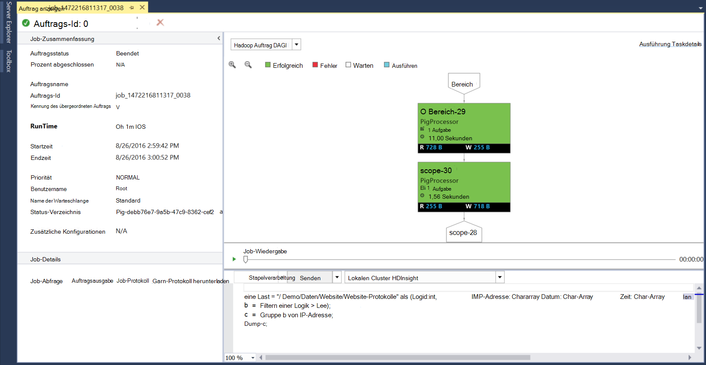

## Einzelvorgänge anzeigen

Azure Lake-Tools ermöglichen auch problemlos Informationen zu Aufträgen, die auf Hadoop ausführen. Gehen Sie um zu prüfen, ob die Aufträge, die auf dem lokalen Cluster ausgeführt.

1. __Server-Explorer__mit der rechten Maustaste auf dem lokalen Cluster und __Jobs anzeigen__wählen. Dies zeigt eine Liste der Aufträge, die übermittelt wurden zum Cluster.

    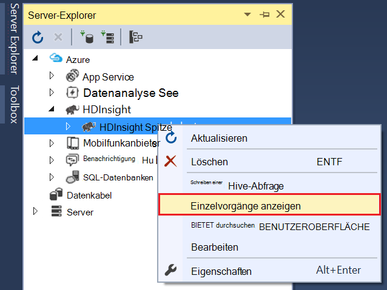

2. Die Liste der Aufträge wählen Sie die Auftragsdetails anzeigen.

    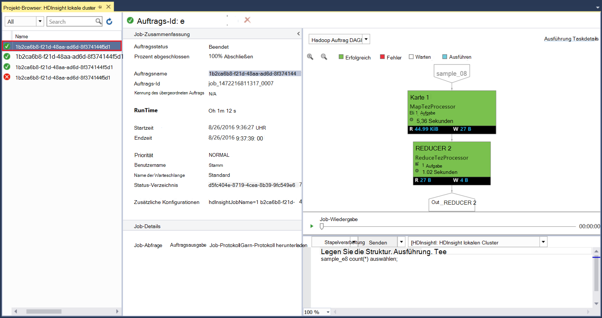

    Angezeigten Informationen sind ähnlich wie Sie nach dem Ausführen einer Struktur oder Schwein Abfrage Links zum Anzeigen der Ausgabe und Protokollinformationen.

3. Sie können auch ändern und hier ausgeben.

## Struktur Datenbanken anzeigen

1. Im __Server-Explorer__den Eintrag __Lokaler HDInsight-Cluster__ und dann __Datenbanken Struktur__. Dadurch wird die __standardmäßige__ und __Xademo__ Datenbanken auf dem lokalen Cluster angezeigt. Erweitern einer Datenbank werden die Tabellen in der Datenbank.

    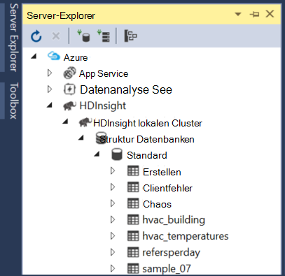

2. Erweitern einer Tabelle zeigt die Spalten dieser Tabelle. Sie können eine Tabelle Maustaste und wählen __Ansicht Top 100 Zeilen__ schnell die Daten anzeigen.

    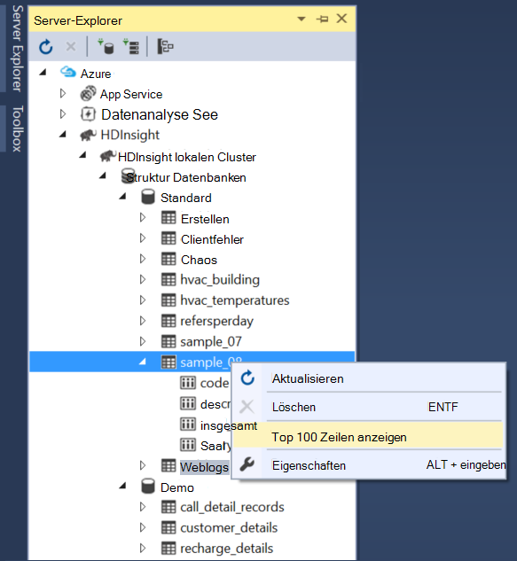

### Datenbank und Tabelle Eigenschaften

Möglicherweise haben Sie bemerkt, dass Sie auswählen können, um __Eigenschaften__ für eine Datenbank oder Tabelle anzeigen. Dies zeigt die Details für das ausgewählte Element im Eigenschaftenfenster.

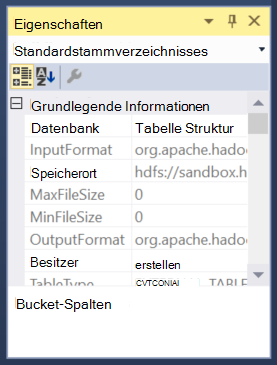

### Erstellen einer Tabelle

Zum Erstellen einer neuen Tabelle einer Maustaste und wählen Sie dann __Tabelle erstellen__.

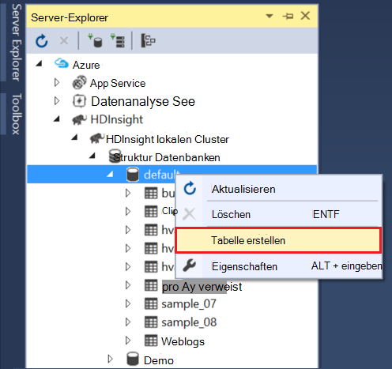

Sie können dann mit einem Formular erstellen. Sie sehen die unformatierten HiveQL, die zum Erstellen der Tabelle unten auf dieser Seite verwendet werden.

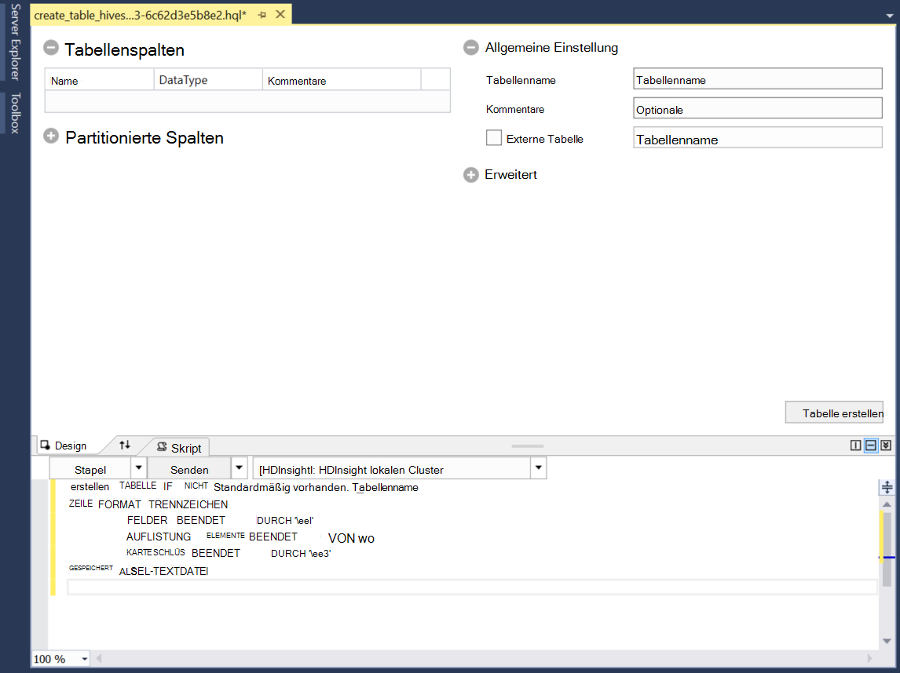

## Nächste Schritte

* [Erlernen der Seile der Hortonworks Sandbox](http://hortonworks.com/hadoop-tutorial/learning-the-ropes-of-the-hortonworks-sandbox/)
* [Hadoop Lernprogramm - Erste Schritte mit HDP](http://hortonworks.com/hadoop-tutorial/hello-world-an-introduction-to-hadoop-hcatalog-hive-and-pig/)