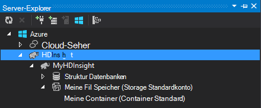

<properties
    pageTitle="Verwenden von C# mit Struktur und Schwein auf Hadoop in HDInsight | Microsoft Azure"
    description="Informationen Sie zum C#-benutzerdefinierte Funktion (UDF) mit Struktur und streaming in Azure HDInsight Schwein verwenden."
    services="hdinsight"
    documentationCenter=""
    authors="Blackmist"
    manager="jhubbard"
    editor="cgronlun"
    tags="azure-portal"/>

<tags
    ms.service="hdinsight"
    ms.workload="big-data"
    ms.tgt_pltfrm="na"
    ms.devlang="dotnet"
    ms.topic="article"
    ms.date="10/28/2016"
    ms.author="larryfr"/>

#Struktur mit streaming auf Hadoop in HDInsight Schwein verwenden Sie C# benutzerdefinierte Funktionen

Struktur und Schwein eignen sich hervorragend zum Arbeiten mit Daten in Azure HDInsight, aber manchmal benötigen Sie eine allgemeinere Sprache. Struktur und Schweine können Sie externen Code durch benutzerdefinierte Funktionen (UDFs) oder streaming aufrufen.

Erfahren Sie in diesem Dokument, wie C# Schwein mit Struktur verwenden.

##Erforderliche Komponenten

* Windows 7 oder höher.

* Visual Studio mit folgenden Versionen:

    * Visual Studio 2012 Professional/Premium/Ultimate mit [Update 4](http://www.microsoft.com/download/details.aspx?id=39305)

    * Visual Studio 2013 Community/Professional/Premium/Ultimate mit [Update 4](https://www.microsoft.com/download/details.aspx?id=44921)

    * Visual Studio 2015

* Hadoop auf HDInsight Cluster - finden Sie unter [Bereitstellung eines Clusters HDInsight](hdinsight-provision-clusters.md) Schritte zum Erstellen eines Clusters

* Hadoop Tools für Visual Studio. Schritte zur Installation und Konfiguration der Tools finden Sie unter [Erste Schritte mit HDInsight Hadoop Tools für Visual Studio](hdinsight-hadoop-visual-studio-tools-get-started.md) .

##.NET in HDInsight

.NET common Language Runtime (CLR) und Frameworks sind standardmäßig auf Windows-basierte HDInsight-Cluster installiert. Dadurch C# Applikationen mit Struktur und streaming Schwein (Daten übergeben zwischen Hive-Schwein und der C#-Anwendung über Stdout-Stdin).

> [AZURE.NOTE] Derzeit ist keine Unterstützung für.NET Framework UDFs auf Linux-basierten HDInsight-Cluster ausgeführt. 

##.NET und streaming

Streaming-umfasst Hive und Pig Übergabe von Daten an eine externe Anwendung über Stdout und Empfangen der Ergebnisse über Stdin. Für C# Applikationen dies am einfachsten erfolgt über `Console.ReadLine()` und `Console.WriteLine()`.

Da Struktur und Schweine die Anwendung zur Laufzeit müssen, sollte **die Konsolenanwendungsvorlage** für C#-Projekte verwendet werden.

##Struktur und C & #35;

###Das C#-Projekt erstellen

1. Öffnen Sie Visual Studio und erstellen Sie eine neue Projektmappe. Wählen Sie für den Projekttyp **Konsolenanwendungsprojekt aus**und nennen Sie das neue Projekt **HiveCSharp**.

2. Ersetzen Sie den Inhalt von **"Program.cs"** mit den folgenden:

        using System;
        using System.Security.Cryptography;
        using System.Text;
        using System.Threading.Tasks;

        namespace HiveCSharp
        {
            class Program
            {
                static void Main(string[] args)
                {
                    string line;
                    // Read stdin in a loop
                    while ((line = Console.ReadLine()) != null)
                    {
                        // Parse the string, trimming line feeds
                        // and splitting fields at tabs
                        line = line.TrimEnd('\n');
                        string[] field = line.Split('\t');
                        string phoneLabel = field[1] + ' ' + field[2];
                        // Emit new data to stdout, delimited by tabs
                        Console.WriteLine("{0}\t{1}\t{2}", field[0], phoneLabel, GetMD5Hash(phoneLabel));
                    }
                }
                /// 

                /// Returns an MD5 hash for the given string
                /// 

                /// <param name="input">string value</param>
                /// <returns>an MD5 hash</returns>
                static string GetMD5Hash(string input)
                {
                    // Step 1, calculate MD5 hash from input
                    MD5 md5 = System.Security.Cryptography.MD5.Create();
                    byte[] inputBytes = System.Text.Encoding.ASCII.GetBytes(input);
                    byte[] hash = md5.ComputeHash(inputBytes);

                    // Step 2, convert byte array to hex string
                    StringBuilder sb = new StringBuilder();
                    for (int i = 0; i < hash.Length; i++)
                    {
                        sb.Append(hash[i].ToString("x2"));
                    }
                    return sb.ToString();
                }
            }
        }

3. Erstellen Sie das Projekt.

###In Speicher laden

1. Öffnen Sie **Server-Explorer**in Visual Studio.

3. Erweitern Sie **Azure**, und dann **HDInsight**.

4. Ggf. Anmeldeinformationen Sie Azure-Abonnement, und klicken Sie auf **Anmelden**.

5. Erweitern Sie den HDInsight-Cluster, dem diese Anwendung bereitstellen möchten, und dann **Speicherkonto Standard**.

    

6. Doppelklicken Sie auf **Standardcontainer** für den Cluster. Dies öffnet ein neues Fenster der Inhalt der Standardcontainer angezeigt.

7. Klicken Sie auf das Symbol "Hochladen", und navigieren Sie zum **Bin\debug** -Ordner des Projekts **HiveCSharp** . Abschließend wählen Sie die Datei **HiveCSharp.exe** , und klicken Sie auf **Ok**.

    

8. Nach Abschluss des Ladevorgangs können Anwendung Hive-Abfrage Sie.

###Hive-Abfrage

1. Öffnen Sie **Server-Explorer**in Visual Studio.

2. Erweitern Sie **Azure**, und dann **HDInsight**.

5. Maustaste Cluster **HiveCSharp** Anwendung bereitgestellt und wählen Sie dann **eine Struktur Abfrage schreiben**.

6. Verwenden Sie folgende Abfrage Struktur:

        add file wasbs:///HiveCSharp.exe;

        SELECT TRANSFORM (clientid, devicemake, devicemodel)
        USING 'HiveCSharp.exe' AS
        (clientid string, phoneLabel string, phoneHash string)
        FROM hivesampletable
        ORDER BY clientid LIMIT 50;

    Dadurch wird die `clientid`, `devicemake`, und `devicemodel` Felder von `hivesampletable`, und die Felder für die HiveCSharp.exe-Anwendung. Die Abfrage erwartet die Anwendung drei Felder zurück, die als gespeicherte `clientid`, `phoneLabel`, und `phoneHash`. Die Abfrage auch erwartet HiveCSharp.exe im Stammverzeichnis des Standard-Behälter (`add file wasbs:///HiveCSharp.exe`).

5. Klicken Sie auf **Senden** , um den Auftrag HDInsight Cluster senden. **Jobübersicht Hive** -Fenster wird geöffnet.

6. Klicken Sie auf **Aktualisieren** , um die Zusammenfassung zu aktualisieren, bis **Job Status** **abgeschlossen**wird. Klicken Sie zum Anzeigen der Auftragsausgabe **Auftragsausgabe**.

##Schweine und C & #35;

###Das C#-Projekt erstellen

1. Öffnen Sie Visual Studio und erstellen Sie eine neue Projektmappe. Wählen Sie für den Projekttyp **Konsolenanwendungsprojekt aus**und nennen Sie das neue Projekt **PigUDF**.

2. Ersetzen Sie den Inhalt der Datei **Program.cs** mit folgenden:

        using System;

        namespace PigUDF
        {
            class Program
            {
                static void Main(string[] args)
                {
                    string line;
                    // Read stdin in a loop
                    while ((line = Console.ReadLine()) != null)
                    {
                        // Fix formatting on lines that begin with an exception
                        if(line.StartsWith("java.lang.Exception"))
                        {
                            // Trim the error info off the beginning and add a note to the end of the line
                            line = line.Remove(0, 21) + " - java.lang.Exception";
                        }
                        // Split the fields apart at tab characters
                        string[] field = line.Split('\t');
                        // Put fields back together for writing
                        Console.WriteLine(String.Join("\t",field));
                    }
                }
            }
        }

    Die Anwendung analysiert Benachrichtigungszeilen Schwein und formatieren Zeilen beginnen mit `java.lang.Exception`.

3. Speichern Sie **Program.cs**, und erstellen Sie das Projekt.

###Laden Sie die Anwendung

1. Schwein streaming erwartet die Anwendung lokal auf dem Cluster sein. Remotedesktop für den HDInsight-Cluster aktivieren und dann eine Verbindung her wie in [Verbindung mit HDInsight-Cluster über RDP](hdinsight-administer-use-management-portal.md#rdp).

2. Sobald verbunden, kopieren Sie **PigUDF.exe** aus dem Verzeichnis **Bin/Debug** für das PigUDF-Projekt auf dem lokalen Computer und fügen Sie ihn in das Verzeichnis **% PIG_HOME %** im Cluster.

###Anwendung von Pig Latin

1. Starten Sie von der Remotedesktopsitzung Hadoop Befehlszeile **Hadoop Befehlszeile** -Symbol auf dem Desktop mit.

2. Verwenden Sie folgende Befehlszeile Schwein starten:

        cd %PIG_HOME%
        bin\pig

    Sie präsentiert werden mit einem `grunt>` aufgefordert.

3. Geben Sie Folgendes ein, um eine einfache Schwein Stapelverarbeitung mithilfe der.NET Framework-Anwendungdes:

        DEFINE streamer `pigudf.exe` SHIP('pigudf.exe');
        LOGS = LOAD 'wasbs:///example/data/sample.log' as (LINE:chararray);
        LOG = FILTER LOGS by LINE is not null;
        DETAILS = STREAM LOG through streamer as (col1, col2, col3, col4, col5);
        DUMP DETAILS;

    Die `DEFINE` Anweisung erstellt einen Alias von `streamer` für Applikationen pigudf.exe und `SHIP` Knoten im Cluster verteilt. Später `streamer` wird mit der `STREAM` Operator die einzelnen Zeilen im Protokoll verarbeiten und die Daten als eine Reihe von Spalten zurückgeben.

> [AZURE.NOTE] Der Anwendungsname für streaming verwendet muss umgeben die \` (Backtick) Zeichen beim Alias und ' (einfaches Anführungszeichen) mit `SHIP`.

3. Geben Sie die letzte Zeile, sollte das Projekt beginnen. Schließlich gibt es Ausgabe ähnlich der folgenden zurück:

        (2012-02-03 20:11:56 SampleClass5 [WARN] problem finding id 1358451042 - java.lang.Exception)
        (2012-02-03 20:11:56 SampleClass5 [DEBUG] detail for id 1976092771)
        (2012-02-03 20:11:56 SampleClass5 [TRACE] verbose detail for id 1317358561)
        (2012-02-03 20:11:56 SampleClass5 [TRACE] verbose detail for id 1737534798)
        (2012-02-03 20:11:56 SampleClass7 [DEBUG] detail for id 1475865947)

##Zusammenfassung

In diesem Dokument haben Sie eine.NET Framework-Struktur und Schwein auf HDInsight Anwendung. Wenn Python mit Struktur und Schwein erlernen möchten, finden Sie unter [Python mit Struktur und Schweine in HDInsight verwenden](hdinsight-python.md).

Demgegenüber Schwein und Struktur und enthält Informationen zur Verwendung von MapReduce finden Sie unter:

* [Struktur mit HDInsight verwenden](hdinsight-use-hive.md)

* [Verwenden Sie Schwein mit HDInsight](hdinsight-use-pig.md)

* [Verwenden Sie MapReduce mit HDInsight](hdinsight-use-mapreduce.md)
