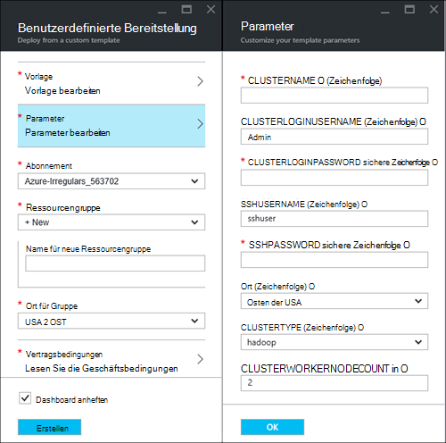
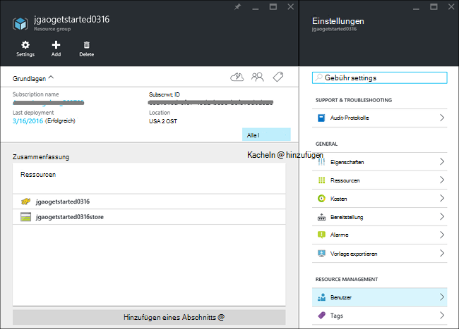
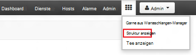
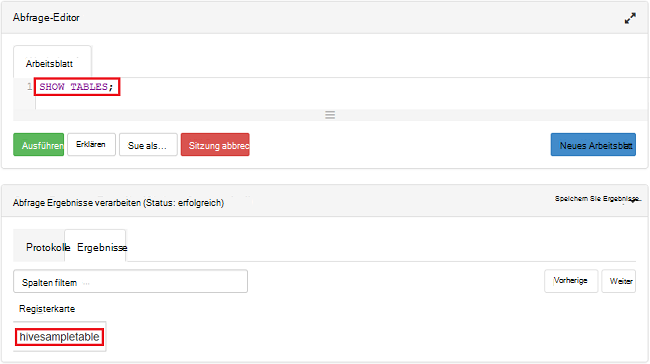

<properties
    pageTitle="Linux-Lernprogramm: Erste Schritte mit Hadoop und Struktur | Microsoft Azure"
    description="Folgen Sie dieser Anleitung Linux den Einstieg Hadoop in HDInsight. Erfahren Sie, wie Linux-Cluster bereitstellen und Abfragen von Daten mit Struktur."
    services="hdinsight"
    documentationCenter=""
    authors="mumian"
    manager="jhubbard"
    editor="cgronlun"
    tags="azure-portal"/>

<tags
    ms.service="hdinsight"
    ms.devlang="na"
    ms.topic="hero-article"
    ms.tgt_pltfrm="na"
    ms.workload="big-data"
    ms.date="09/14/2016"
    ms.author="jgao"/>

# Hadoop Lernprogramm: Erste Schritte mit Linux-basierten Hadoop in HDInsight

> [AZURE.SELECTOR]
- [Linux-basierte](hdinsight-hadoop-linux-tutorial-get-started.md)
- [Windows-basierte](hdinsight-hadoop-tutorial-get-started-windows.md)

Lernen Sie in HDInsight Linux-basierten [Hadoop](http://hadoop.apache.org/) -Cluster erstellen und Struktur Aufträge im HDInsight ausgeführt. [Apache Struktur](https://hive.apache.org/) ist die am häufigsten verwendeten Komponente im Hadoop-Ökosystem. Derzeit enthält HDInsight 4 unterschiedliche Typen: [ [Hadoop](hdinsight-hadoop-introduction.md), [Funken](hdinsight-apache-spark-overview.md), [HBase](hdinsight-hbase-overview.md) und](hdinsight-storm-overview.md).  Jedes Cluster unterstützt einen anderen Satz von Komponenten. Alle 4 Cluster unterstützen Struktur. Eine Liste der unterstützten Komponenten in HDInsight finden Sie unter [neuen Hadoop Cluster Versionen von HDInsight bereitgestellten?](hdinsight-component-versioning.md)  

[AZURE.INCLUDE [delete-cluster-warning](../../includes/hdinsight-delete-cluster-warning.md)]

## Erforderliche Komponenten

Bevor Sie dieses Lernprogramm beginnen, müssen Sie:

- **Azure-Abonnement**: Erstellen Sie ein kostenloses Testabo einmonatigen [azure.microsoft.com/free](https://azure.microsoft.com/free)suchen.

### Steuerelement erforderlich

[AZURE.INCLUDE [access-control](../../includes/hdinsight-access-control-requirements.md)]

## Cluster erstellen

Hadoop stellen stehen Stapelverarbeitungen. Erstellen eines Clusters, einige Aufträge ausführen und löschen Sie den Cluster. In diesem Abschnitt erstellen Sie einen Linux-basierte Hadoop Cluster in [Azure-Ressourcen-Manager-Vorlage](../resource-group-template-deploy.md)mit HDInsight. Ressourcen-Manager-Vorlage ist vollständig anpassbar. Es erleichtert Azure Ressourcen wie HDInsight erstellen. Ressourcenmanager Vorlage Erfahrung ist nicht für dieses Lernprogramm erforderlich. Andere Cluster Methoden und die Eigenschaften in diesem Lernprogramm verwendeten finden Sie unter [Erstellen HDInsight-Cluster](hdinsight-hadoop-provision-linux-clusters.md). In diesem Lernprogramm verwendeten Ressourcen-Manager-Vorlage befindet sich in einem öffentlichen Blob-Container [https://hditutorialdata.blob.core.windows.net/armtemplates/create-linux-based-hadoop-cluster-in-hdinsight.json](https://hditutorialdata.blob.core.windows.net/armtemplates/create-linux-based-hadoop-cluster-in-hdinsight.json). 

1. Klicken Sie auf das folgende Bild Azure anmelden und öffnen die Vorlage Ressourcenmanager in Azure-Portal. 

    

2. Blatt **Parameter** Geben Sie Folgendes ein:

    .

    - **ClusterName**: Geben Sie einen Namen für den Cluster Hadoop, die Sie erstellen.
    - **Cluster-Benutzername und Kennwort**: der Standard-Anmeldename ist **Admin**.
    - **SSH-Benutzername und Kennwort**: der Standard-Benutzername ist **Sshuser**.  Sie können sie umbenennen. 
    
    Andere Parameter sind optional für dieses Lernprogramm. Sie können diese unverändert. 
    
    Jeder Cluster verfügt über eine Abhängigkeit Azure BLOB-Speicher Konto. Es wird normalerweise als Standardkonto Speicher bezeichnet. HDInsight-Cluster und die standardmäßige Speicher müssen in derselben Azure-Region befinden. Cluster löschen löscht nicht das Speicherkonto. In der Vorlage der Kontonamen standardmäßig Speicher den Clusternamen mit "Store" angehängt bezeichnet. 
    
3. Klicken Sie auf **OK** , um die Parameter zu speichern.
4. Geben Sie **benutzerdefinierte Bereitstellung** Blatt **Name für neue Ressourcengruppe** eine neue Ressourcengruppe erstellen.  Die Ressourcengruppe ist ein Container, der Cluster abhängige Speicherkonto und anderen Gruppen. Speicherort der Ressource kann nicht mit dem Cluster.
5. **Vertragsbedingungen**auf und klicken Sie dann auf **Erstellen**.
6. Überprüfen Sie das Kontrollkästchen **Pin Dashboard** ausgewählt ist, und klicken Sie dann auf **Erstellen**. Sie sehen eine neue Tile Titel **Bereitstellung bereitstellen**. Es dauert etwa 20 Minuten Erstellen eines Clusters. 
7.  Nach Erstellung des Clusters ist die Beschriftung der Kachel auf den Namen der Ressource geändert. Und das Portal automatisch zwei Cluster mit Clustereinstellungen. 

    .

    Gibt es zwei Ressourcen des Clusters und Storage-Standardkonto.

##Struktur Abfragen

[Apache Struktur](hdinsight-use-hive.md) ist die am häufigsten verwendeten Komponente in HDInsight verwendet. Es gibt vielfältige Struktur Aufträge im HDInsight ausgeführt. In diesem Lernprogramm verwenden Sie Ansicht Ambari Struktur aus dem Portal Hive-Aufträge ausführen. Andere Methoden zum Senden von Aufträgen Struktur finden Sie in der [Struktur verwendet in HDInsight](hdinsight-use-hive.md).

1. Wechseln Sie zu **https://&lt;ClusterName >. azurehdinsight.net**, wobei &lt;ClusterName > ist die im vorherigen Abschnitt öffnen Ambari erstellt.
2. Geben Sie Hadoop Benutzername und Kennwort, die Sie im vorherigen Abschnitt angegeben. Der Standard-Benutzername ist **Admin**.
3. Öffnen Sie **Struktur anzeigen** , wie im folgenden Screenshot gezeigt:

    .
4. Das Arbeitsblatt im __Abfrage-Editor__ -Abschnitt der Seite fügen Sie HiveQL Folgendes ein:

        SHOW TABLES;

    >[AZURE.NOTE] Struktur ist Semikolon erforderlich.       
        
5. Klicken Sie auf __Ausführen__. __Abfrageergebnisse Prozess__ Abschnitt sollte unter den Abfrage-Editor angezeigt und zeigt Informationen über den Auftrag. 

    Nach Abschluss die Abfrage wird der __Prozess Abfrageergebnisse__ Abschnitt die Ergebnisse des Vorgangs angezeigt. Sie sehen eine Tabelle namens **Hivesampletable**. Diese Struktur Beispieltabelle enthält die HDInsight-Cluster.

    .

6. Wiederholen Sie die Schritte 4 und 5, um die folgende Abfrage ausführen:

        SELECT * FROM hivesampletable;

    > [AZURE.TIP] Hinweis der Dropdownliste __Ergebnisse speichern__ im linken oberen Teil __Abfrageergebnisse Prozess__ ; Hiermit können Sie die Ergebnisse herunterladen oder HDInsight Speicher als CSV-Datei speichern.

7. Klicken Sie auf **Verlauf** , um eine Liste der Aufträge.

Nach Abschluss ein Auftrags Struktur können Sie [die Ergebnisse in SQL Azure oder SQL Server-Datenbank exportieren](hdinsight-use-sqoop-mac-linux.md), können Sie auch [mit Excel Ergebnisse visualisieren](hdinsight-connect-excel-power-query.md). Weitere Informationen über Struktur in HDInsight finden Sie unter [Struktur verwenden und HiveQL Hadoop in HDInsight eine Beispieldatei Apache log4j analysieren](hdinsight-use-hive.md).

##Bereinigen Sie das Lernprogramm

Nach Abschluss des Lernprogramms sollten Sie den Cluster löschen. Mit HDInsight Ihre Daten in Azure Storage gespeichert, einen Cluster sicher löschen können, wenn es nicht verwendet wird. Sie sind auch für einen HDInsight-Cluster berechnet, auch wenn es nicht verwendet wird. Da die Gebühren für den Cluster mehr als die Kosten für Speicher sind, ist es wirtschaftlich Cluster löschen, wenn sie nicht verwendet werden. 

>[AZURE.NOTE] Mit [Azure Data Factory](hdinsight-hadoop-create-linux-clusters-adf.md)Sie HDInsight Cluster bei Bedarf erstellen und eine Einstellung TimeToLive Cluster automatisch gelöscht. 

**Cluster oder das Standardkonto Speicher löschen**

1. Mit der [Azure-Portal](https://portal.azure.com)anmelden.
2. Klicken Sie über das Portal Dashboard mit, die Sie beim Erstellen des Clusters verwendet Ressourcengruppenname.
3. Klicken Sie auf Ressource Blade Ressourcengruppe löschen enthält Cluster und das Standardkonto Speicher **Löschen** . Klicken Sie auf die Kachel **Ressourcen** Cluster oder **Klicken auf den Cluster** . Hinweis Ressourcengruppe löschen wird das Speicherkonto löschen. Soll das Speicherkonto beibehalten wählen Sie den Cluster löschen.

## Nächste Schritte

In diesem Lernprogramm haben Sie einen Linux-basierten HDInsight Cluster Resource Manager Vorlage erstellen und zum grundlegenden Struktur Abfragen.

Weitere Informationen zum Analysieren von Daten mit HDInsight finden Sie hier:

- Mehr über Struktur mit HDInsight wie Struktur Abfragen von Visual Studio finden Sie unter [Verwenden Struktur mit HDInsight][hdinsight-use-hive].

- Über Schwein eine Sprache zum Transformieren von Daten finden Sie unter [Verwenden Schwein mit HDInsight][hdinsight-use-pig].

- Über MapReduce können Programme schreiben, die Daten auf Hadoop finden Sie unter [Verwenden MapReduce mit HDInsight][hdinsight-use-mapreduce].

- Zur Verwendung von HDInsight-Tools für Visual Studio Datenanalyse auf HDInsight finden Sie unter [Erste Schritte mit Visual Studio Hadoop Tools für HDInsight](hdinsight-hadoop-visual-studio-tools-get-started.md).

Wenn Sie mit Ihren eigenen Daten arbeiten und mehr darüber, wie HDInsight Daten gespeichert oder wie Daten in HDInsight bereit sind, finden Sie hier:

- Informationen zur Verwendung HDInsight Azure BLOB-Speicher finden Sie unter [verwenden Azure BLOB-Speicher mit HDInsight](hdinsight-hadoop-use-blob-storage.md).

- Weitere Informationen zum Hochladen von Daten auf HDInsight [Daten auf HDInsight][hdinsight-upload-data].

Wenn Sie weitere Informationen zu erstellen oder einen HDInsight-Cluster verwalten möchten, finden Sie hier:

- Zur Verwaltung von Linux-basierten HDInsight Cluster finden Sie unter [Verwalten von HDInsight Cluster mit Ambari](hdinsight-hadoop-manage-ambari.md).

- Erfahren Sie mehr über die Optionen, beim Erstellen eines Clusters HDInsight auswählen können, finden Sie unter [Erstellen von HDInsight unter Linux mit benutzerdefinierten Optionen](hdinsight-hadoop-provision-linux-clusters.md).

- Wenn Sie Linux und Hadoop kennen, aber Hadoop auf der HDInsight im Detail kennen, finden Sie unter [Arbeiten mit HDInsight für Linux](hdinsight-hadoop-linux-information.md). Dieser Artikel enthält Informationen wie:

    * URLs für Dienste auf den Cluster, wie Ambari und WebHCat
    * Der Speicherort der Hadoop Dateien und Beispiele für das lokale Dateisystem
    * Die Verwendung von Azure Storage (WASB) statt bietet als die Standarddaten speichern

[1]: ../HDInsight/hdinsight-hadoop-visual-studio-tools-get-started.md

[hdinsight-provision]: hdinsight-provision-clusters.md
[hdinsight-admin-powershell]: hdinsight-administer-use-powershell.md
[hdinsight-upload-data]: hdinsight-upload-data.md
[hdinsight-use-mapreduce]: hdinsight-use-mapreduce.md
[hdinsight-use-hive]: hdinsight-use-hive.md
[hdinsight-use-pig]: hdinsight-use-pig.md

[powershell-download]: http://go.microsoft.com/fwlink/p/?linkid=320376&clcid=0x409
[powershell-install-configure]: powershell-install-configure.md
[powershell-open]: powershell-install-configure.md#Install

[img-hdi-dashboard]: ./media/hdinsight-hadoop-tutorial-get-started-windows/HDI.dashboard.png
[img-hdi-dashboard-query-select]: ./media/hdinsight-hadoop-tutorial-get-started-windows/HDI.dashboard.query.select.png
[img-hdi-dashboard-query-select-result]: ./media/hdinsight-hadoop-tutorial-get-started-windows/HDI.dashboard.query.select.result.png
[img-hdi-dashboard-query-select-result-output]: ./media/hdinsight-hadoop-tutorial-get-started-windows/HDI.dashboard.query.select.result.output.png
[img-hdi-dashboard-query-browse-output]: ./media/hdinsight-hadoop-tutorial-get-started-windows/HDI.dashboard.query.browse.output.png
[image-hdi-clusterstatus]: ./media/hdinsight-hadoop-tutorial-get-started-windows/HDI.ClusterStatus.png
[image-hdi-gettingstarted-powerquery-importdata]: ./media/hdinsight-hadoop-tutorial-get-started-windows/HDI.GettingStarted.PowerQuery.ImportData.png
[image-hdi-gettingstarted-powerquery-importdata2]: ./media/hdinsight-hadoop-tutorial-get-started-windows/HDI.GettingStarted.PowerQuery.ImportData2.png
